# wallpaper

bing wallpaper 4k download

### 今天 today :
 [欧洲刺猬在长满蒲公英的花园里，巴特德里堡，德国 (© Oksana Schmidt/Getty Images)](https://cn.bing.com/th?id=OHR.HedgehogMeadow_ZH-CN8845586473_UHD.jpg) 2024-04-08

### 2024-04

|     |    |
| ---- | ---- |
 | [欧洲刺猬在长满蒲公英的花园里，巴特德里堡，德国 (© Oksana Schmidt/Getty Images)](https://cn.bing.combing_2024-04-08_OHR.HedgehogMeadow_ZH-CN8845586473_UHD.jpg) 2024-04-08 |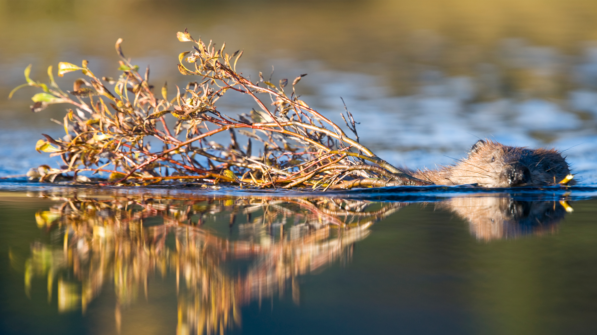 [奇迹湖附近池塘里的北美海狸，德纳里国家公园，阿拉斯加州，美国 (© Paul Souders/Getty Images)](https://cn.bing.combing_2024-04-07_OHR.BeaverDenali_ZH-CN8736013851_UHD.jpg) 2024-04-07|
 | [姬路城，姫路，兵库县，日本 (© Julian Elliott Photography/Getty Images)](https://cn.bing.combing_2024-04-06_OHR.JapanHimeji_ZH-CN8344654166_UHD.jpg) 2024-04-06 |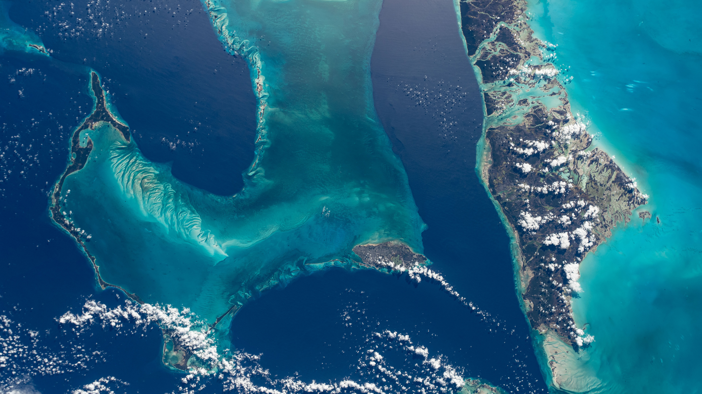 [从国际空间站拍摄的巴哈马群岛 (© NASA)](https://cn.bing.combing_2024-04-05_OHR.BahamasSpace_ZH-CN8053657656_UHD.jpg) 2024-04-05|
 |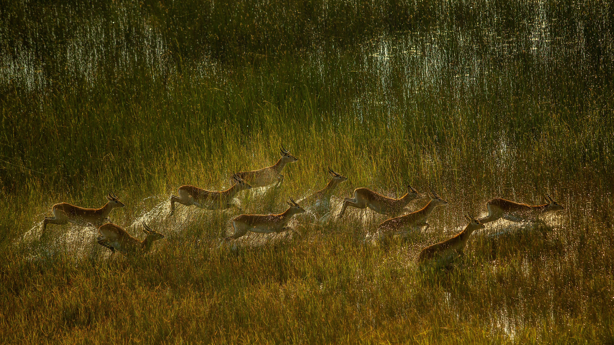 [红驴羚群穿越奥卡万戈三角洲的沼泽平原，博茨瓦纳 (© Ibrahim Suha Derbent/Getty Images)](https://cn.bing.combing_2024-04-04_OHR.AntelopeBotswana_ZH-CN8253323519_UHD.jpg) 2024-04-04 |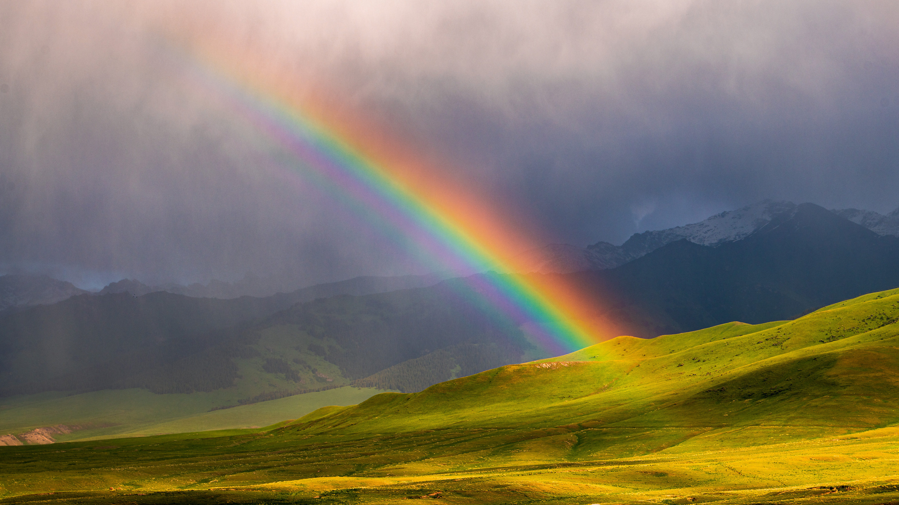 [At-Bashy地区的彩虹，Kakshaal Too山脉，纳伦省，吉尔吉斯斯坦 (© Emad aljumah/Getty Images)](https://cn.bing.combing_2024-04-03_OHR.KyrgyzstanRainbow_ZH-CN8027219590_UHD.jpg) 2024-04-03|
 |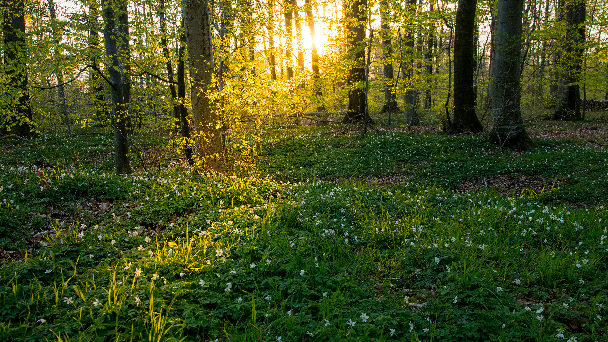 [日德兰半岛的山毛榉树和野生海葵 ，丹麦 (© Nick Brundle Photography/Getty Images)](https://cn.bing.combing_2024-04-02_OHR.JutlandSpring_ZH-CN7785758539_UHD.jpg) 2024-04-02 |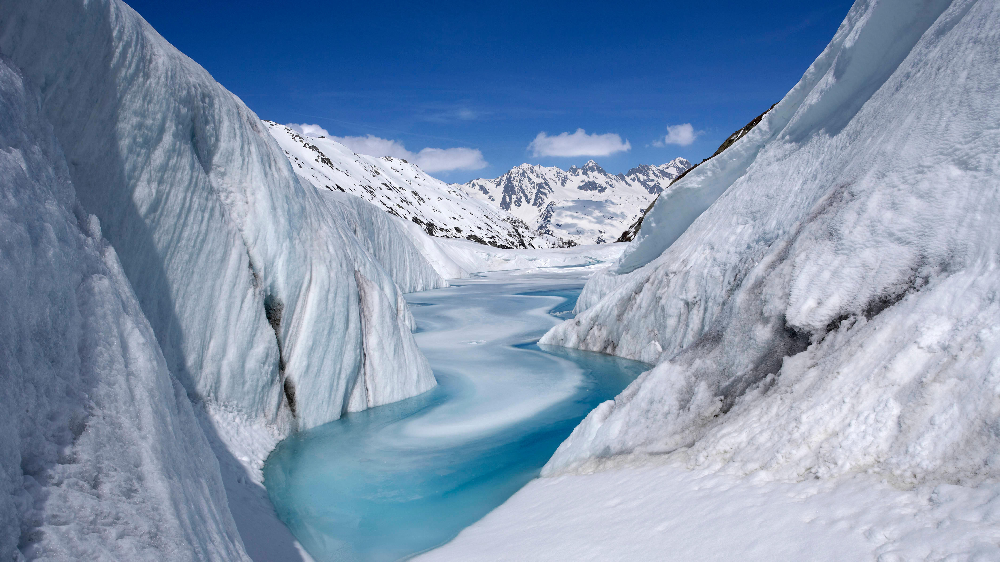 [勃朗峰上的冰海，夏慕尼，法国 (© Hagenmuller Jean-François/Hemis/Alamy)](https://cn.bing.combing_2024-04-01_OHR.MontBlancGlacier_ZH-CN2918240023_UHD.jpg) 2024-04-01|

### 2024-03

|     |    |
| ---- | ---- |
 |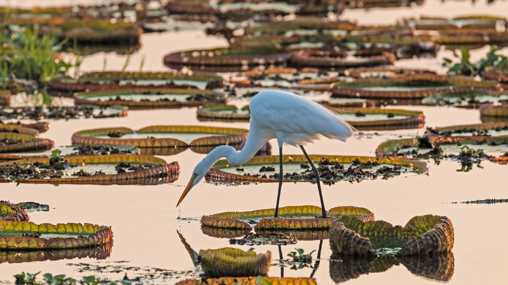 [潘塔纳尔湿地的大白鹭，巴西 (© Geraldi Corsi/Getty Images)](https://cn.bing.combing_2024-03-31_OHR.ArdeAlba_ZH-CN6807697569_UHD.jpg) 2024-03-31 | [睡在号角树上的褐喉树懒，哥斯达黎加 (© Juan Carlos Vindas/Getty Images)](https://cn.bing.combing_2024-03-30_OHR.SleepySloth_ZH-CN6084460583_UHD.jpg) 2024-03-30|
 | [日落时的南斯塔克灯塔，霍利希德，威尔士，英国 (© mariotlr/Getty Images)](https://cn.bing.combing_2024-03-29_OHR.SouthStackLight_ZH-CN5932471774_UHD.jpg) 2024-03-29 |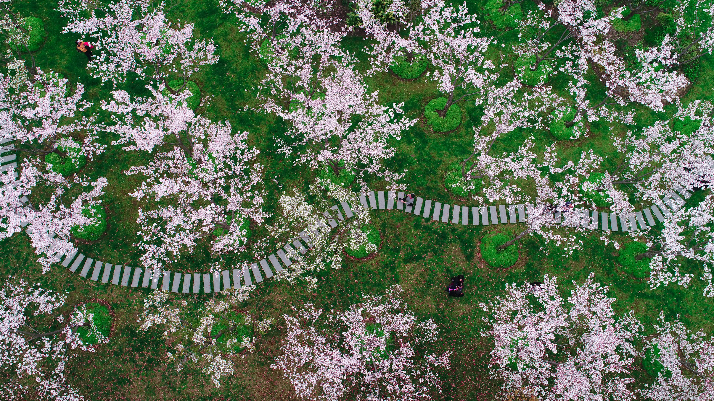 [上海的樱花，中国 (© Yaorusheng/Getty Images)](https://cn.bing.combing_2024-03-28_OHR.ShanghaiBlossoms_ZH-CN5594677517_UHD.jpg) 2024-03-28|
 | [布宜诺斯艾利斯哥伦布剧院，阿根廷 (© Wei Hao Ho/Alamy Stock Photo)](https://cn.bing.combing_2024-03-27_OHR.TeatroColon_ZH-CN5378730986_UHD.jpg) 2024-03-27 | [海水从古老的珊瑚礁上倾泻而下，杭莱，越南 (© Thang Tat Nguyen/Getty Images)](https://cn.bing.combing_2024-03-26_OHR.HangRaiVietnam_ZH-CN1601428109_UHD.jpg) 2024-03-26|
 |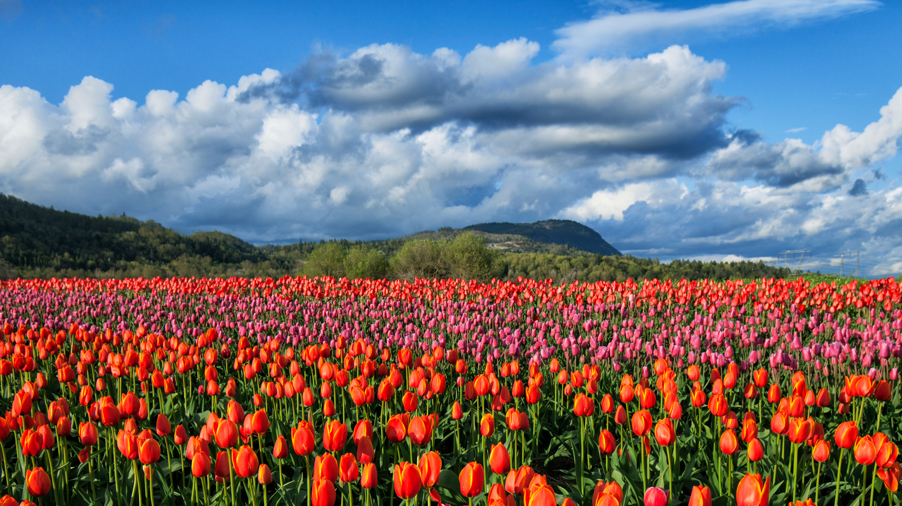 [弗雷泽河谷的郁金香田，阿伯兹福德，不列颠哥伦比亚省，加拿大 (© LeonU/Getty Images)](https://cn.bing.combing_2024-03-25_OHR.TulipAbbotsford_ZH-CN1401627293_UHD.jpg) 2024-03-25 | [樱花树枝上的灰胸绣眼鸟，韩国 (© TigerSeo/Getty Images)](https://cn.bing.combing_2024-03-24_OHR.WhiteEyes_ZH-CN1130380430_UHD.jpg) 2024-03-24|
 |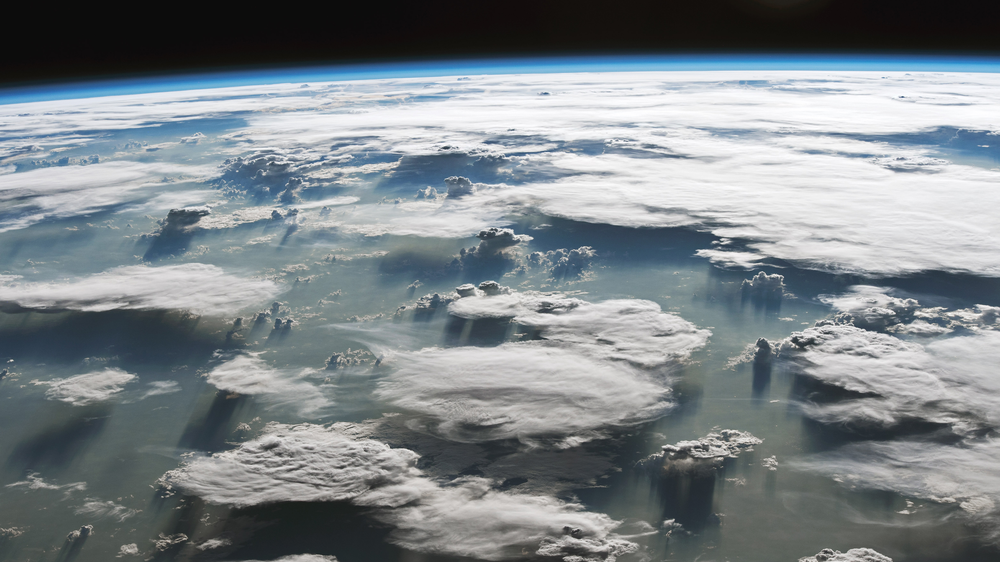 [巴西亚马逊上空巨大的砧状云 (© NASA)](https://cn.bing.combing_2024-03-23_OHR.AmazonClouds_ZH-CN0578911147_UHD.jpg) 2024-03-23 | [蓝泉，蒂怀霍步道，新西兰 (© Ian Beattie/Alamy Stock Photo)](https://cn.bing.combing_2024-03-22_OHR.WaikatoWater_ZH-CN0417438809_UHD.jpg) 2024-03-22|
 |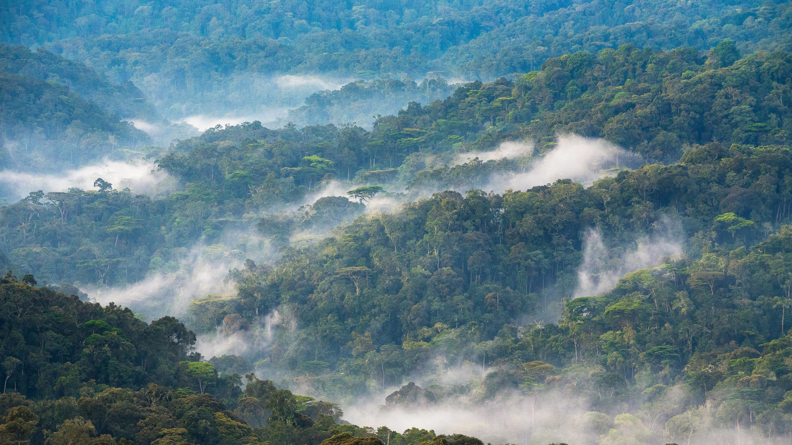 [布恩迪国家公园，乌干达 (© Art Wolfe/DanitaDelimont.com)](https://cn.bing.combing_2024-03-21_OHR.BwindiNationalForest_ZH-CN0436137473_UHD.jpg) 2024-03-21 |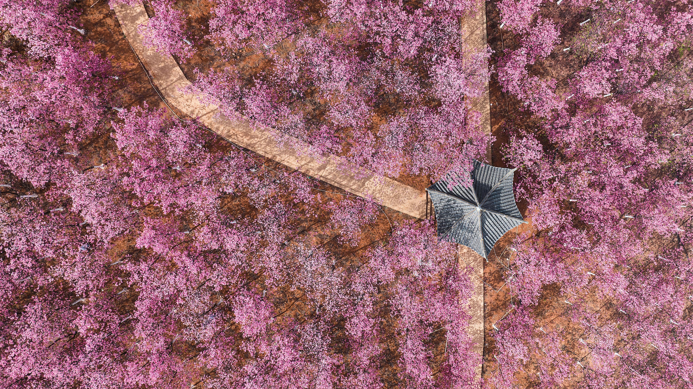 [鸟瞰春日盛开的樱花，中国 (© outcast85/Getty images)](https://cn.bing.combing_2024-03-20_OHR.Springequinox2024_ZH-CN5647214924_UHD.jpg) 2024-03-20|
 |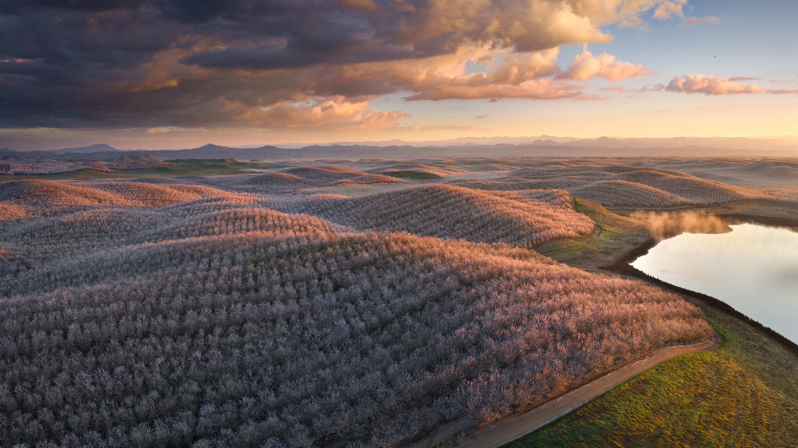 [盛开的扁桃树, 加利福尼亚州，美国 (© Jeffrey Lewis/Tandem Stills + Motion)](https://cn.bing.combing_2024-03-19_OHR.AlmondBloom_ZH-CN9441550492_UHD.jpg) 2024-03-19 |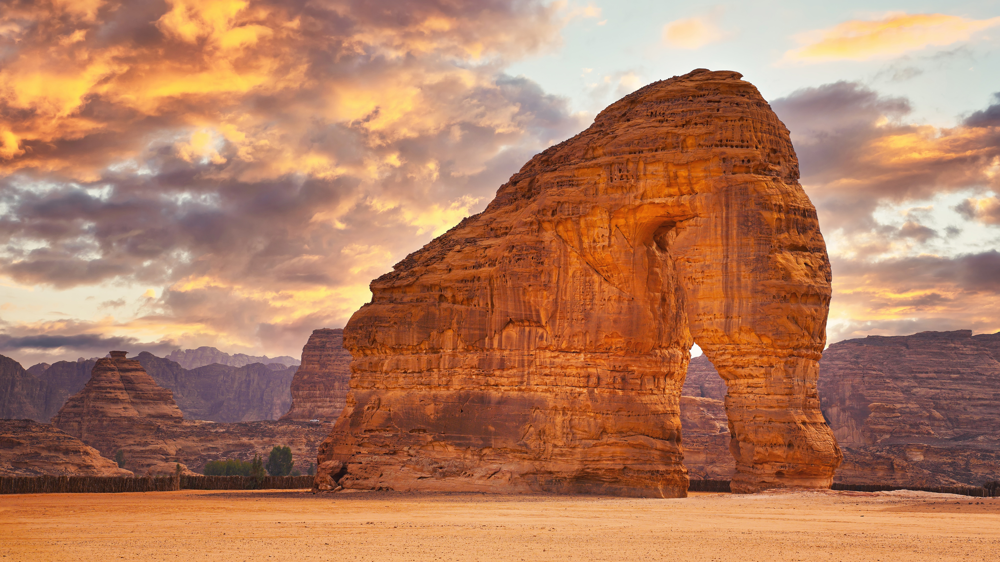 [大象岩，古城欧拉，沙特阿拉伯 (© Lubo Ivanko/Shutterstock)](https://cn.bing.combing_2024-03-18_OHR.ElephantRock_ZH-CN9293300383_UHD.jpg) 2024-03-18|
 | [圣菲尼安湾，凯里郡，爱尔兰 (© Atlantide Phototravel/Getty Images)](https://cn.bing.combing_2024-03-17_OHR.StFiniansBay_ZH-CN8655586052_UHD.jpg) 2024-03-17 | [正在吃竹子的大熊猫，中国成都 (© Suzi Eszterhas/Minden Pictures)](https://cn.bing.combing_2024-03-16_OHR.BambooPanda_ZH-CN8455481760_UHD.jpg) 2024-03-16|
 |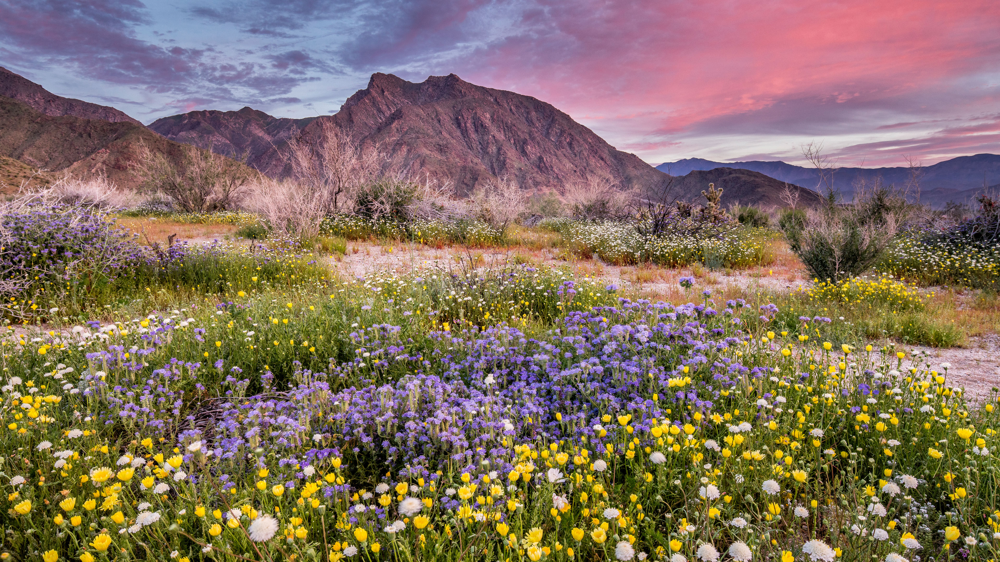 [安沙波利哥沙漠州立公园，美国加利福尼亚州 (© Stephen Matera/Tandem Stills + Motion)](https://cn.bing.combing_2024-03-15_OHR.AnzaBorregoBloom_ZH-CN8284458835_UHD.jpg) 2024-03-15 | [Wat Phra Ngam，大城府历史公园，泰国 (© boonchai wedmakawand/Alamy Stock Photo)](https://cn.bing.combing_2024-03-14_OHR.AyutthayaTree_ZH-CN8075870220_UHD.jpg) 2024-03-14|
 |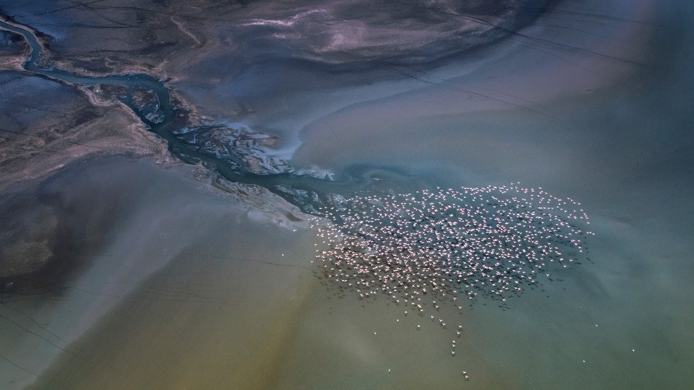 [小红鹳飞越马加迪湖,肯尼亚 (© Vicki Jauron, Babylon and Beyond Photography/Getty Images)](https://cn.bing.combing_2024-03-13_OHR.MagadiFlamingos_ZH-CN7888437841_UHD.jpg) 2024-03-13 |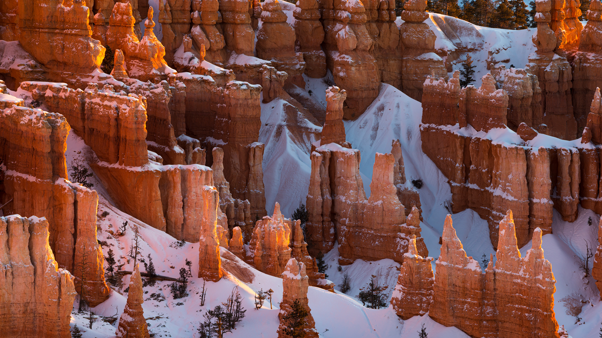 [布莱斯峡谷国家公园，犹他州，美国 (© Jim Patterson/Tandem Stills + Motion)](https://cn.bing.combing_2024-03-12_OHR.BryceSnow_ZH-CN7489999663_UHD.jpg) 2024-03-12|
 |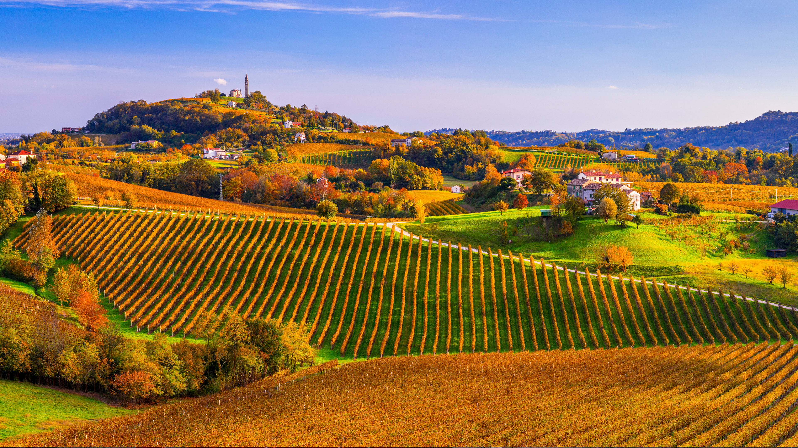 [Prosecco山丘，科内利亚诺和瓦尔多比亚德内，威内托大区，意大利 (© Richard T. Nowitz/Getty Images)](https://cn.bing.combing_2024-03-11_OHR.ProseccoItaly_ZH-CN6802010344_UHD.jpg) 2024-03-11 |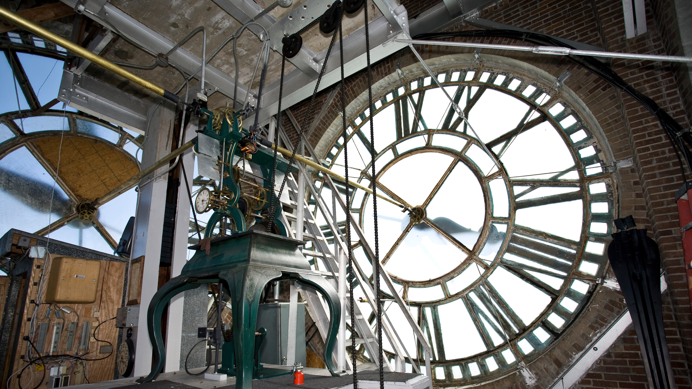 [圣哈辛托大厦的机械钟，博蒙特，美国德克萨斯州 (© Richard T. Nowitz/Getty Images)](https://cn.bing.combing_2024-03-10_OHR.BeaumontClock_ZH-CN5288086713_UHD.jpg) 2024-03-10|
 |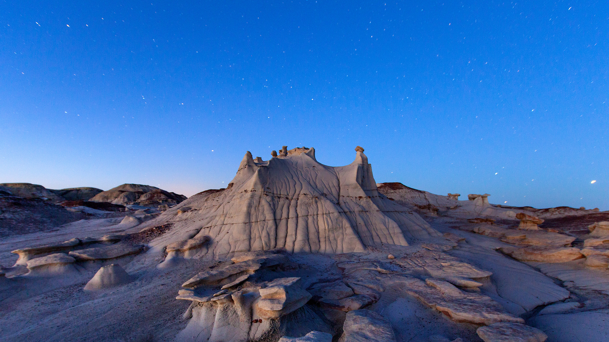 [比斯第恶土，新墨西哥州，美国 (© Ian Shive/Tandem Stills + Motion)](https://cn.bing.combing_2024-03-09_OHR.BistiBlue_ZH-CN4991705833_UHD.jpg) 2024-03-09 |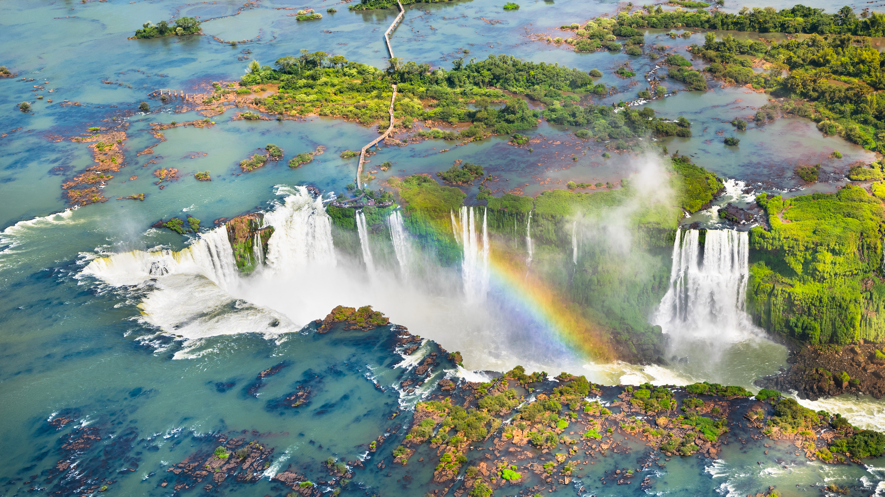 [伊瓜苏大瀑布鸟瞰图，巴西 (© Nido Huebl/Shutterstock)](https://cn.bing.combing_2024-03-08_OHR.IguazuFalls_ZH-CN4749837052_UHD.jpg) 2024-03-08|
 |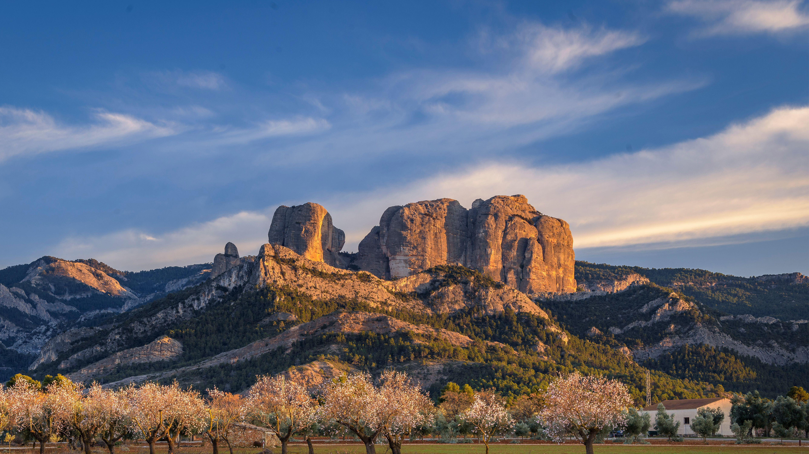 [Roques de Benet，埃尔斯港自然公园，加泰罗尼亚，西班牙 (© Sergi Boixader/Alamy Stock Photo)](https://cn.bing.combing_2024-03-07_OHR.TarragonaSpain_ZH-CN5488361711_UHD.jpg) 2024-03-07 |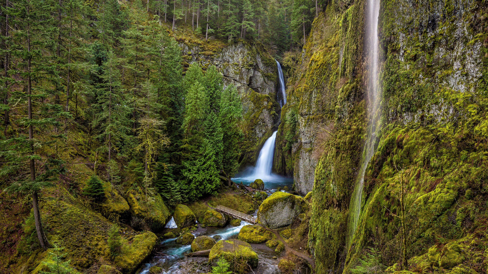 [Wahclella Falls，哥伦比亚河峡谷，俄勒冈州，美国 (© Eric Vogt/Tandem Stills + Motion)](https://cn.bing.combing_2024-03-06_OHR.WahclellaFalls_ZH-CN4932852217_UHD.jpg) 2024-03-06|
 | [曼谷的交通圈和高速公路，泰国 (© Avigator Fortuner/Shutterstock)](https://cn.bing.combing_2024-03-05_OHR.BangkokCircle_ZH-CN4702412806_UHD.jpg) 2024-03-05 |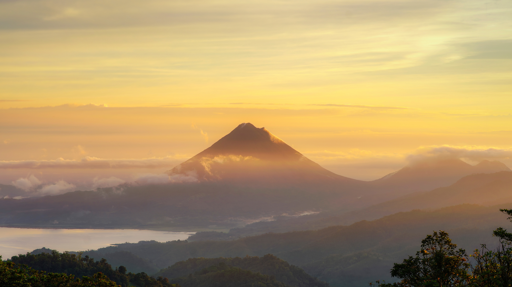 [从蒙特维多看到的阿雷纳尔火山,哥斯达黎加 (© Lukas Bischoff/Getty Images)](https://cn.bing.combing_2024-03-04_OHR.ArenalCostaRica_ZH-CN4466297855_UHD.jpg) 2024-03-04|
 |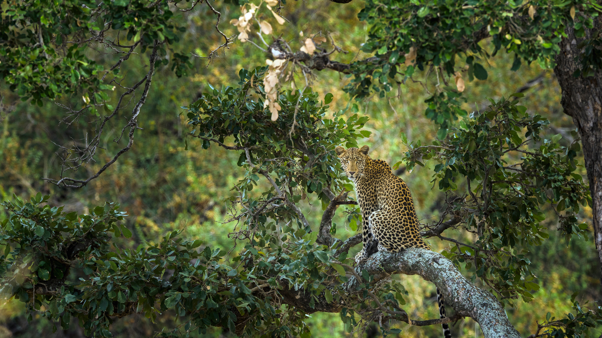 [树上的豹子，克鲁格国家公园，南非 (© Tonino De Marco/Minden Pictures)](https://cn.bing.combing_2024-03-03_OHR.KrugerLeopard_ZH-CN4125884091_UHD.jpg) 2024-03-03 | [莫迪卡，西西里岛，意大利 (© Sandro Bisaro/Getty Images)](https://cn.bing.combing_2024-03-02_OHR.ModicaItaly_ZH-CN3893147952_UHD.jpg) 2024-03-02|
 |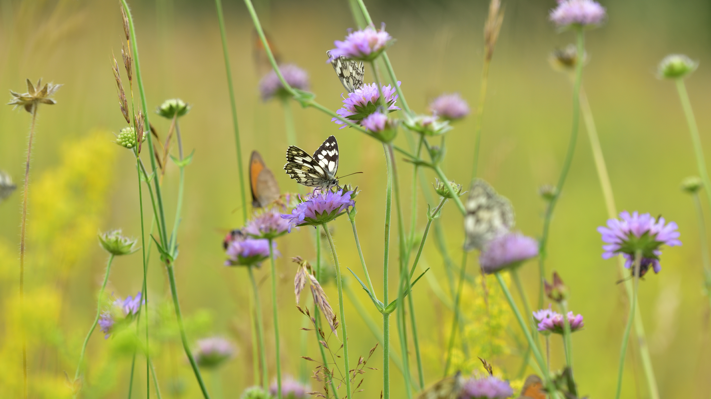 [德国草地上的蝴蝶 (© Albert Fertl/Getty Images)](https://cn.bing.combing_2024-03-01_OHR.Schmetterlingswiese_ZH-CN3740804088_UHD.jpg) 2024-03-01|
### 2024-02

|     |    |
| ---- | ---- |
 |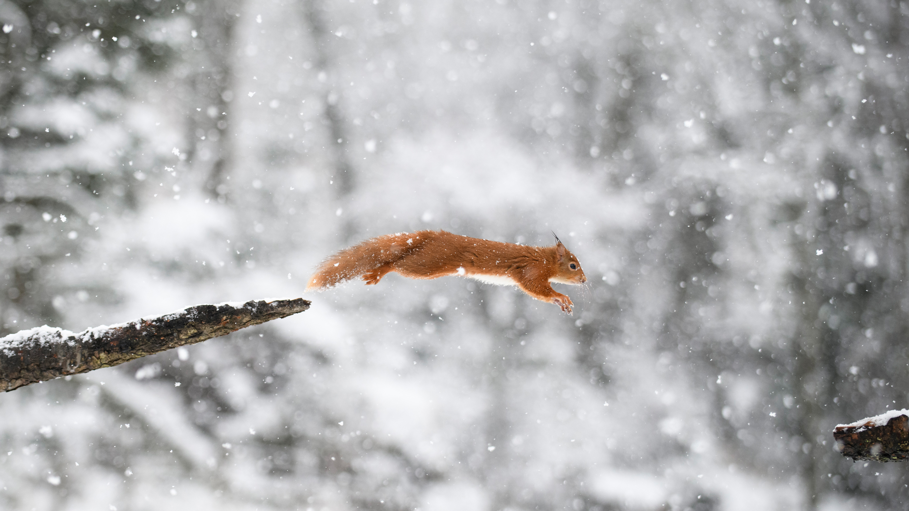 [欧亚红松鼠 (© Westend61/Getty Images)](https://cn.bing.combing_2024-02-29_OHR.LeapingSquirrel_ZH-CN9112090462_UHD.jpg) 2024-02-29|
 |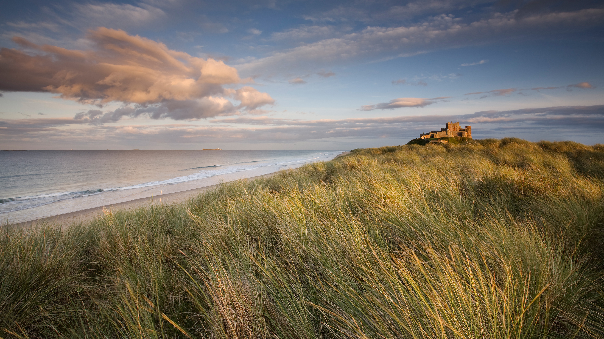 [班堡城堡，诺森伯兰郡，英格兰 (© Blackbeck/Getty Images)](https://cn.bing.combing_2024-02-28_OHR.BamburghCastleUK_ZH-CN3201531782_UHD.jpg) 2024-02-28 |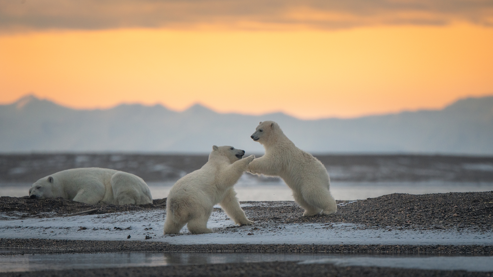 [玩耍的北极熊幼崽，卡克托维克，阿拉斯加州，美国 (© Piriya Photography/Getty Images)](https://cn.bing.combing_2024-02-27_OHR.PolarBearCubs_ZH-CN2913942257_UHD.jpg) 2024-02-27|
 |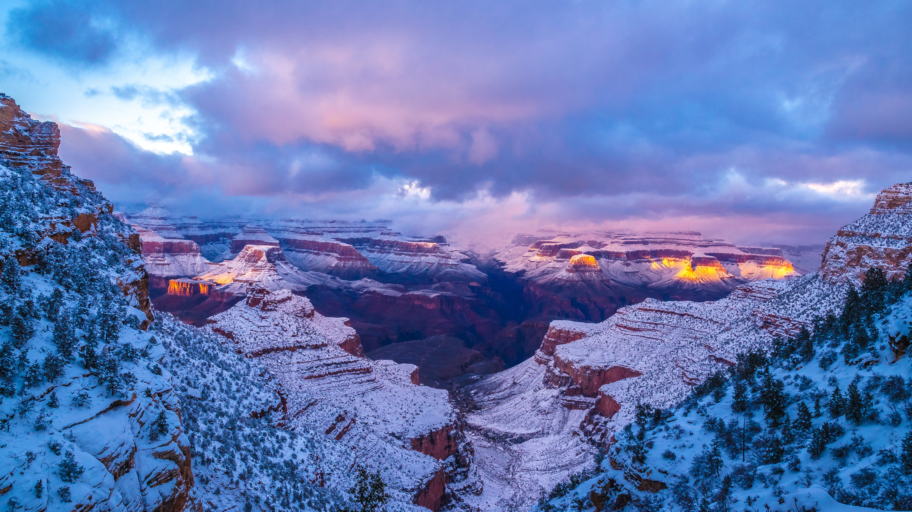 [大峡谷国家公园，亚利桑那州，美国 (© Jeremy Janus/Getty Images)](https://cn.bing.combing_2024-02-26_OHR.GrandCanyonWinter_ZH-CN2640803517_UHD.jpg) 2024-02-26 | [考伊琴山谷的薄雾，温哥华岛，加拿大不列颠哥伦比亚省 (© Kevin Oke/Alamy)](https://cn.bing.combing_2024-02-25_OHR.MtPrevostDuncan_ZH-CN2333619635_UHD.jpg) 2024-02-25|
 | [锦里街上悬挂的红色中国灯笼，成都，中国四川省 (© Philippe LEJEANVRE/Getty images)](https://cn.bing.combing_2024-02-24_OHR.LaternFestival2024_ZH-CN8050981828_UHD.jpg) 2024-02-24 |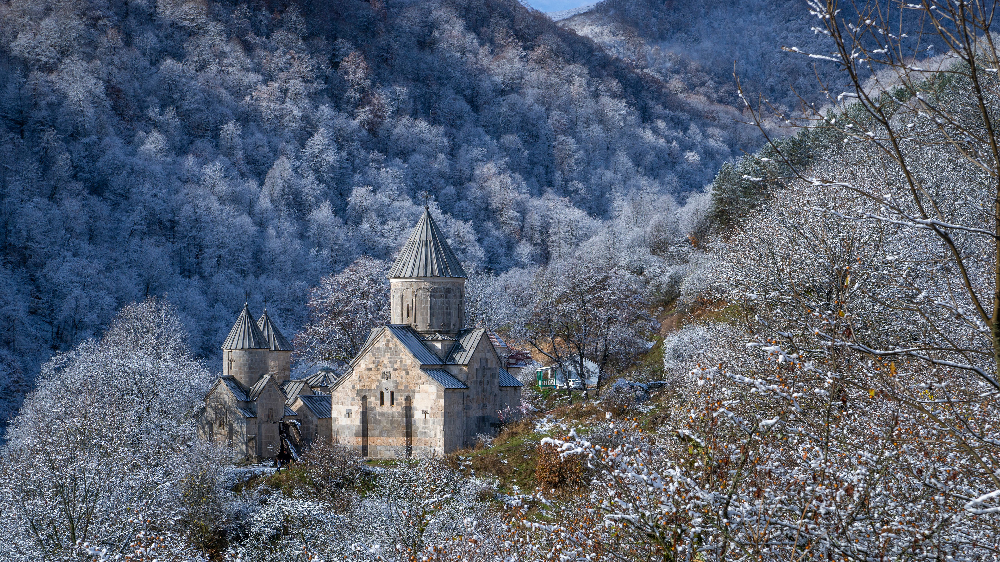 [Haghartsin修道院，迪利扬国家公园，亚美尼亚 (© Alexey Kharitonov/Shutterstock)](https://cn.bing.combing_2024-02-23_OHR.HaghartsinMonastery_ZH-CN1705226096_UHD.jpg) 2024-02-23|
 |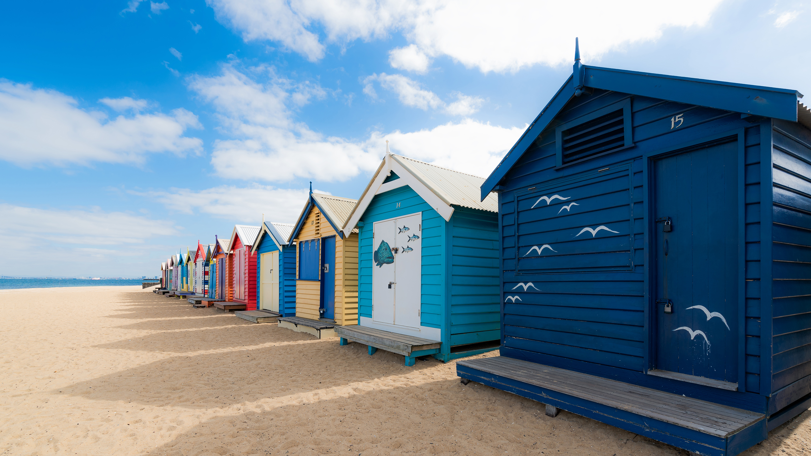 [布莱顿海滩的彩虹小屋，墨尔本，维多利亚州，澳大利亚 (© Prasit photo/Getty Images)](https://cn.bing.combing_2024-02-22_OHR.BrightonBoxes_ZH-CN0947219018_UHD.jpg) 2024-02-22 |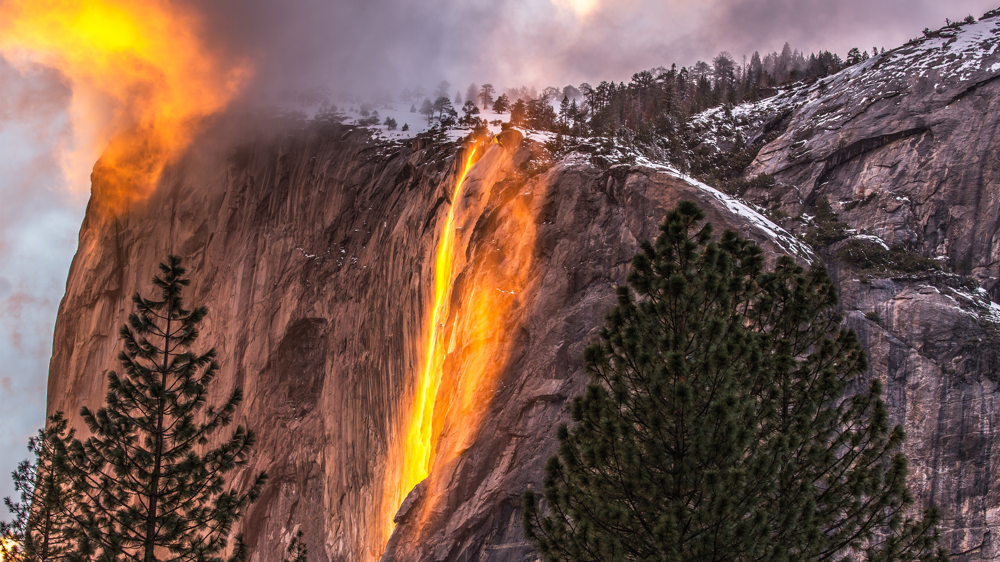 [火瀑布，优胜美地国家公园，加利福尼亚州，美国 (© Gregory B Cuvelier/Shutterstock)](https://cn.bing.combing_2024-02-21_OHR.YosemiteFirefall_ZH-CN2236242565_UHD.jpg) 2024-02-21|
 |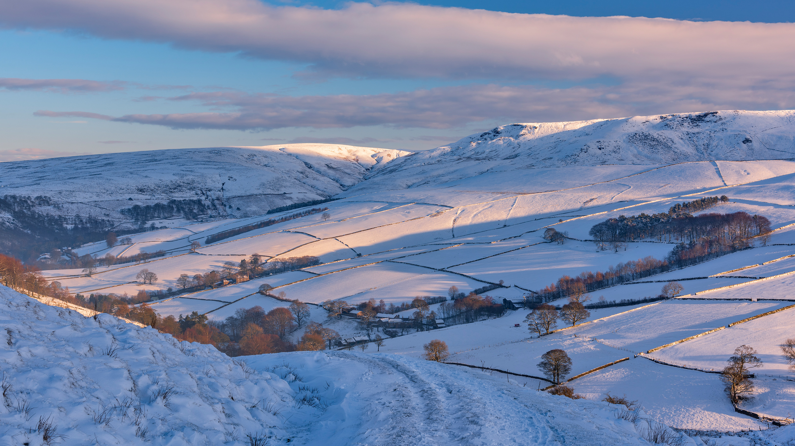 [Kinder Scout，峰区国家公园，英国 (© john finney photography/Getty Images)](https://cn.bing.combing_2024-02-20_OHR.PeakDistrictNP_ZH-CN1987784653_UHD.jpg) 2024-02-20 |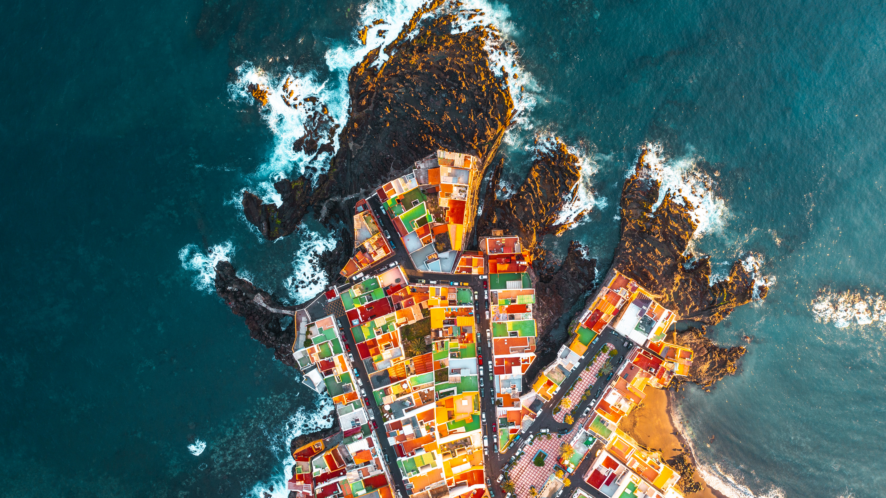 [鸟瞰克鲁斯港色彩斑斓的房屋，特内里费岛，西班牙 (© Marco Bottigelli/Getty Images)](https://cn.bing.combing_2024-02-19_OHR.CarnavalTenerife_ZH-CN1559136778_UHD.jpg) 2024-02-19|
 |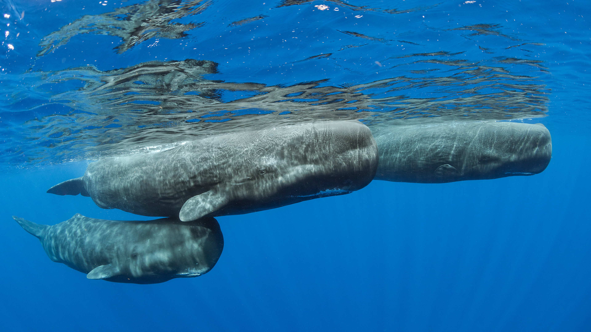 [抹香鲸浮出水面，多米尼克 (© Franco Banfi/Minden Pictures)](https://cn.bing.combing_2024-02-18_OHR.DominicaWhales_ZH-CN1293650397_UHD.jpg) 2024-02-18 |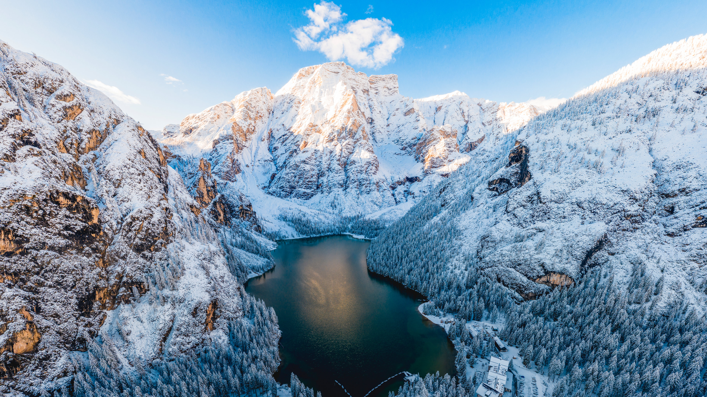 [多洛米蒂山的布莱耶斯湖，南蒂罗尔，意大利 (© Marco Bottigelli/Getty Images)](https://cn.bing.combing_2024-02-17_OHR.LakeDolomites_ZH-CN2317113886_UHD.jpg) 2024-02-17|
 |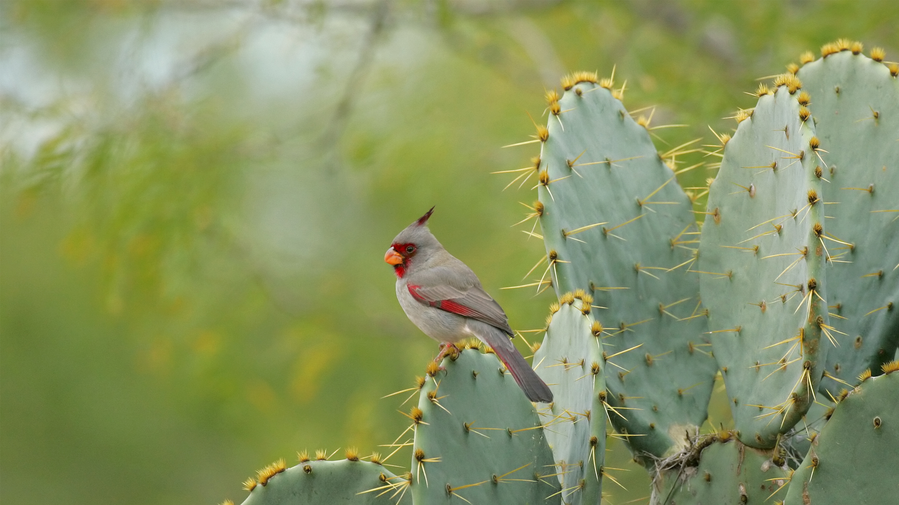 [一只雌性灰额主红雀栖息在德克萨斯州一株多刺仙人掌上，美国 (© outtakes/Getty Images)](https://cn.bing.combing_2024-02-16_OHR.BackyardBird_ZH-CN0522695977_UHD.jpg) 2024-02-16 |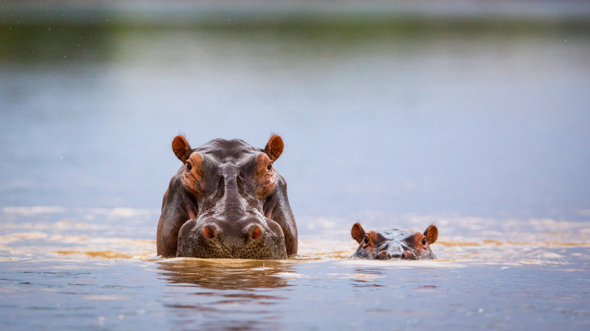 [河马妈妈和小河马，南卢安瓜国家公园，赞比亚 (© Nature Picture Library/Alamy Stock Photo)](https://cn.bing.combing_2024-02-15_OHR.HippopotamusDay_ZH-CN0518367336_UHD.jpg) 2024-02-15|
 |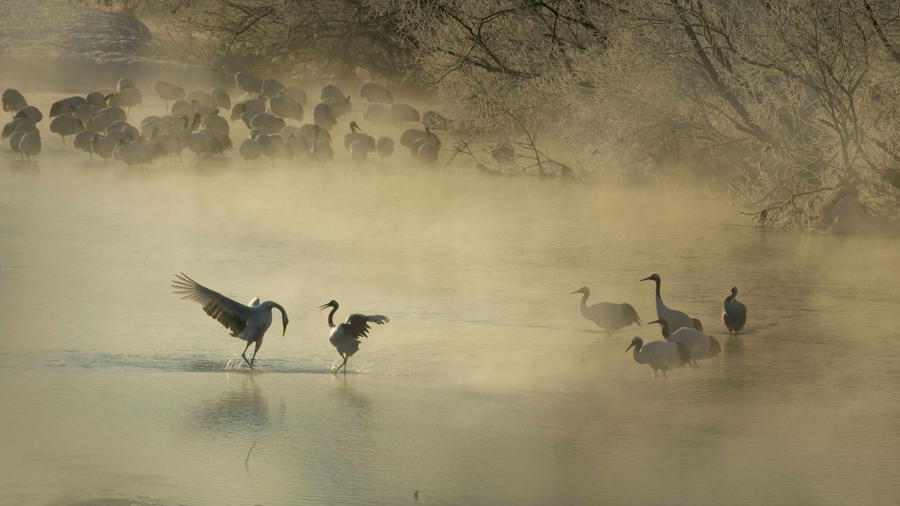 [丹顶鹤向伴侣鞠躬，北海道，日本 (© Steve Bloom Images/Alamy Stock Photo)](https://cn.bing.combing_2024-02-14_OHR.BowingCrane_ZH-CN0143761293_UHD.jpg) 2024-02-14 | [马里尼的狂欢节彩珠，新奥尔良，美国 (© Erik Pronske Photography/Getty Images)](https://cn.bing.combing_2024-02-13_OHR.MarignyBeads_ZH-CN9346804869_UHD.jpg) 2024-02-13|
 |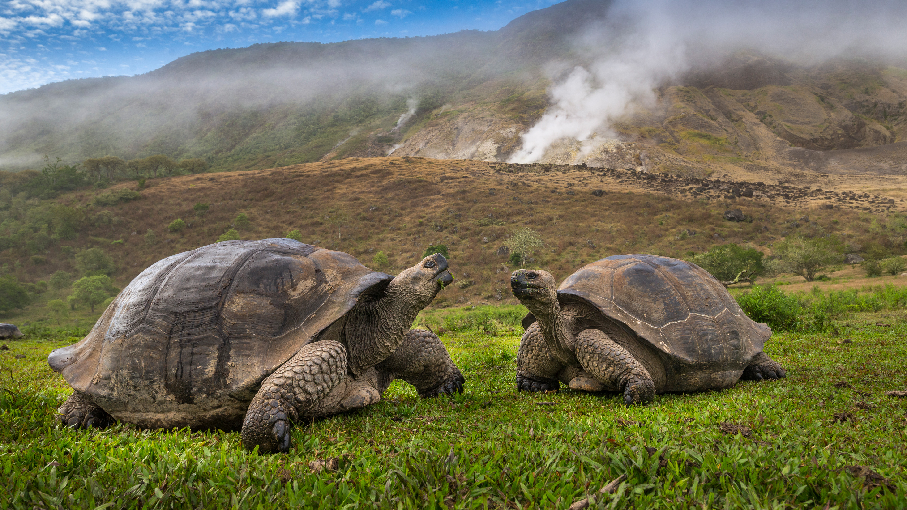 [阿尔塞多火山象龟, 伊莎贝拉岛, 加拉帕戈斯群岛，厄瓜多尔 (© Tui De Roy/Minden Pictures)](https://cn.bing.combing_2024-02-12_OHR.GiantTortoise_ZH-CN9220903689_UHD.jpg) 2024-02-12 |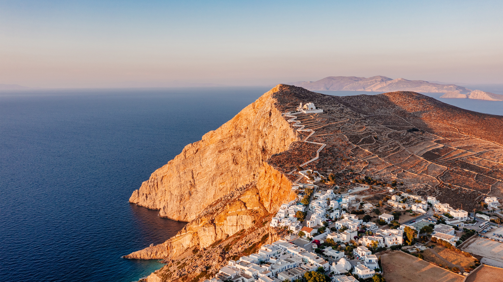 [乔拉岛，福莱甘兹罗斯岛，基克拉泽斯群岛, 希腊 (© Francesco Riccardo Iacomino/Getty Images)](https://cn.bing.combing_2024-02-11_OHR.FolegandrosGreece_ZH-CN7803666477_UHD.jpg) 2024-02-11|
 | [中国舞狮，大年初一 (© SENEZ/Getty Images)](https://cn.bing.combing_2024-02-10_OHR.SpringFestival2024_ZH-CN7514007541_UHD.jpg) 2024-02-10 | [灯光秀点亮夜幕中的西安城墙，中国春节 (© Eastimages/Getty Images)](https://cn.bing.combing_2024-02-09_OHR.ChineseNewYearEve2024_ZH-CN7153418405_UHD.jpg) 2024-02-09|
 |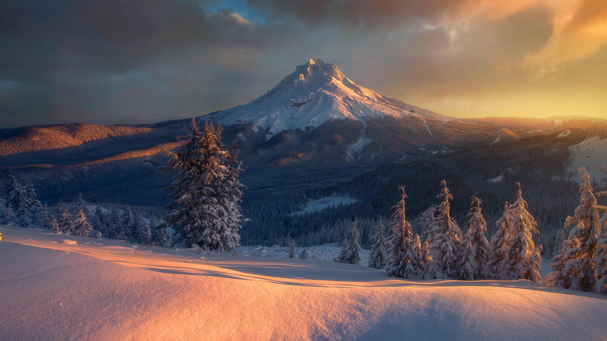 [胡德山，俄勒冈州，美国 (© Inigo Cia/Getty Images)](https://cn.bing.combing_2024-02-08_OHR.MtHoodOregon_ZH-CN6068357532_UHD.jpg) 2024-02-08 |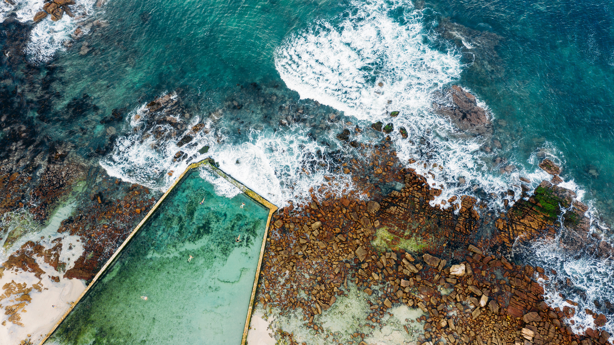 [圣詹姆斯潮汐池，开普敦，南非 (© AmazingAerialAgency/Adobe)](https://cn.bing.combing_2024-02-07_OHR.StJamesPool_ZH-CN5930624359_UHD.jpg) 2024-02-07|
 | [盆景岩，太浩湖，内华达州，美国 (© Jim Patterson/Tandem Stills + Motion)](https://cn.bing.combing_2024-02-06_OHR.LakeTahoeRock_ZH-CN5770740919_UHD.jpg) 2024-02-06 |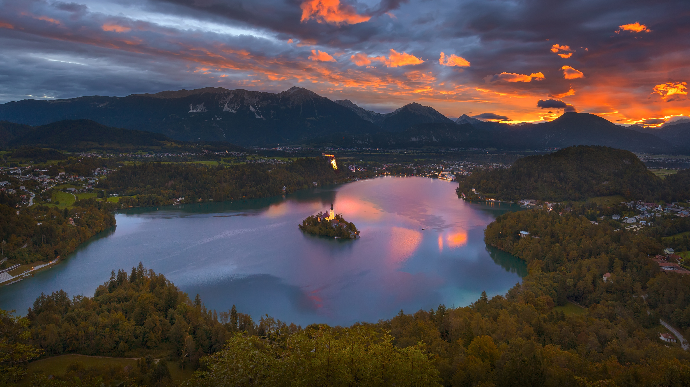 [从奥索伊尼察观景点看日出时的布莱德湖，斯洛文尼亚 (© Rasica/Getty Images)](https://cn.bing.combing_2024-02-05_OHR.LakeBledSunrise_ZH-CN5580697031_UHD.jpg) 2024-02-05|
 |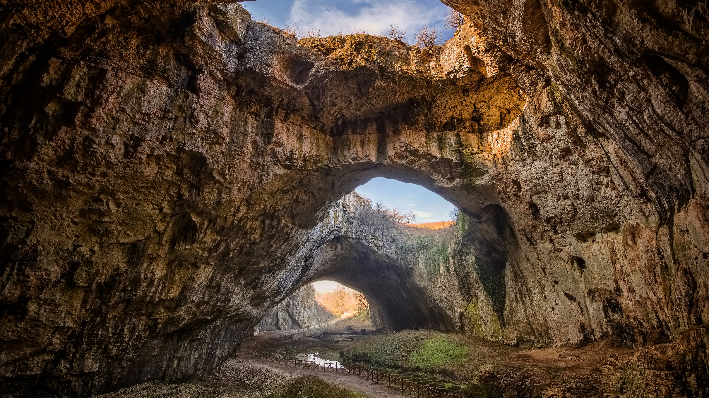 [德弗塔什卡洞, Devetaki村庄，保加利亚 (© Jasmine_K/Shutterstock)](https://cn.bing.combing_2024-02-04_OHR.DevetashkaCave_ZH-CN5186222166_UHD.jpg) 2024-02-04 | [大运河与安康圣母大教堂，威尼斯，意大利 (© Rudy Balasko/Getty Images)](https://cn.bing.combing_2024-02-03_OHR.VeniceCarnival_ZH-CN4965898587_UHD.jpg) 2024-02-03|
 |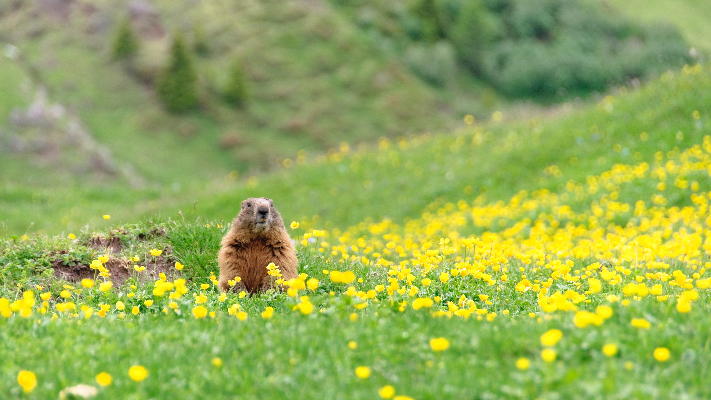 [从洞穴中探出头的土拨鼠 (© Scacciamosche/Getty Images)](https://cn.bing.combing_2024-02-02_OHR.AlpineMarmot_ZH-CN3818584615_UHD.jpg) 2024-02-02 | [吕根岛的萨斯尼茨灯塔，德国 (© Christian Back/eStock)](https://cn.bing.combing_2024-02-01_OHR.HalbinselJasmund_ZH-CN2110869056_UHD.jpg) 2024-02-01|

### 2024-01

|     |    |
| ---- | ---- |
 | [布氏斑马妈妈和小马驹，里特弗雷自然保护区，南非 (© Richard Du Toit/Minden Pictures)](https://cn.bing.combing_2024-01-31_OHR.ZebraMother_ZH-CN1947314869_UHD.jpg) 2024-01-31 |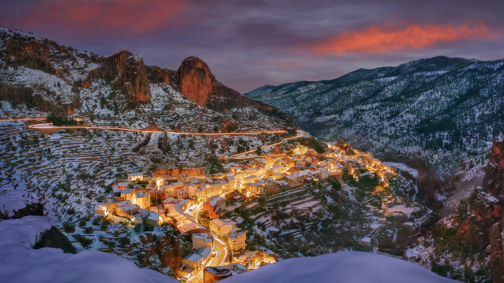 [艾纳, 塞古拉山脉, 阿尔瓦塞特, 西班牙 (© Juan Maria Coy Vergara/Getty Images)](https://cn.bing.combing_2024-01-30_OHR.AlbaceteSpain_ZH-CN1597281896_UHD.jpg) 2024-01-30|
 |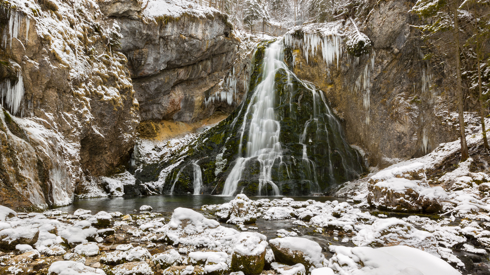 [戈林格瀑布，泰嫩高，萨尔茨堡，奥地利 (© Frank Fischbach/Alamy Stock Photo)](https://cn.bing.combing_2024-01-29_OHR.GollingerFalls_ZH-CN1137680822_UHD.jpg) 2024-01-29 |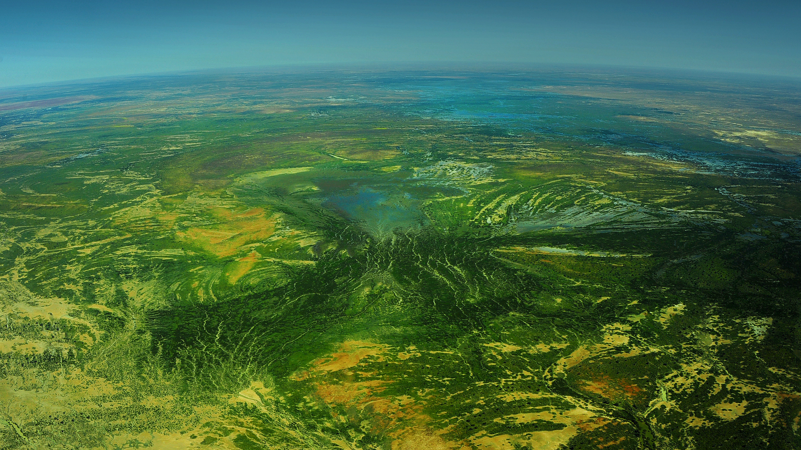 [昆士兰州内陆海峡地区，澳大利亚 (© Southern Lightscapes-Australia/Getty Images)](https://cn.bing.combing_2024-01-28_OHR.ChannelOutback_ZH-CN0579687777_UHD.jpg) 2024-01-28|
 |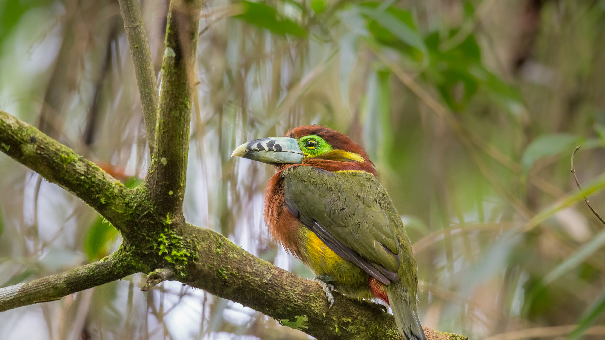 [点嘴小巨嘴鸟，大西洋森林，巴西 (© aaprophoto/Getty Images)](https://cn.bing.combing_2024-01-27_OHR.ToucanetEmpoleirado_ZH-CN8520861326_UHD.jpg) 2024-01-27 |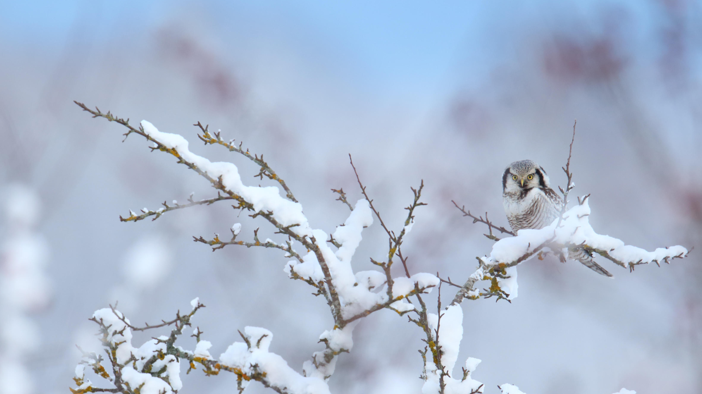 [北鹰鸮 (© Remo Savisaar/Alamy Stock Photo)](https://cn.bing.combing_2024-01-26_OHR.HawkOwl_ZH-CN3401920167_UHD.jpg) 2024-01-26|
 | [圣德温教堂的废墟，莫纳岛，威尔士，英国 (© Photos by R A Kearton/Getty Images)](https://cn.bing.combing_2024-01-25_OHR.DwynwensDay_ZH-CN1768649253_UHD.jpg) 2024-01-25 |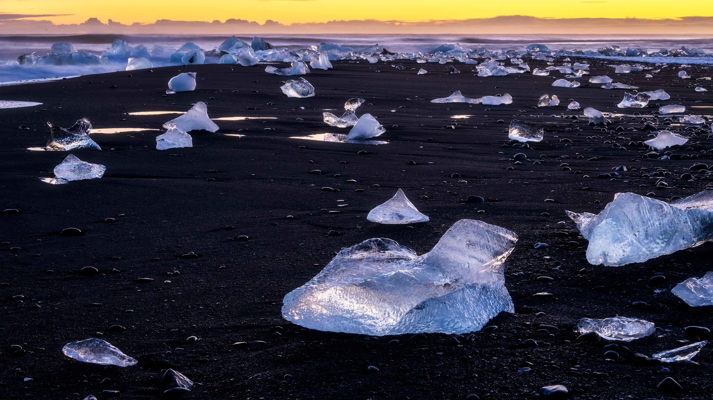 [钻石冰沙滩，冰岛 (© Rachid Dahnoun/Tandem Stills + Motion)](https://cn.bing.combing_2024-01-24_OHR.IcelandBeach_ZH-CN1632329693_UHD.jpg) 2024-01-24|
 | [印度洋的环礁，马尔代夫 (© Amazing Aerial Premium/Shutterstock)](https://cn.bing.combing_2024-01-23_OHR.MaldivesAtolls_ZH-CN1365670653_UHD.jpg) 2024-01-23 | [冬季日出，沃尔顿灯塔，圣克鲁斯, 加利福尼亚州, 美国 (© Jeff Lewis/Tandem Stills + Motion)](https://cn.bing.combing_2024-01-22_OHR.SantaCruzSunrise_ZH-CN3074203377_UHD.jpg) 2024-01-22|
 |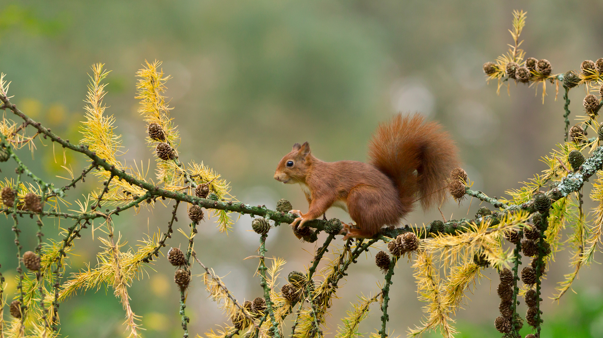 [欧亚红松鼠，荷兰 (© Ernst Dirksen/Minden Pictures)](https://cn.bing.combing_2024-01-21_OHR.SquirrelNetherlands_ZH-CN0757138587_UHD.jpg) 2024-01-21 |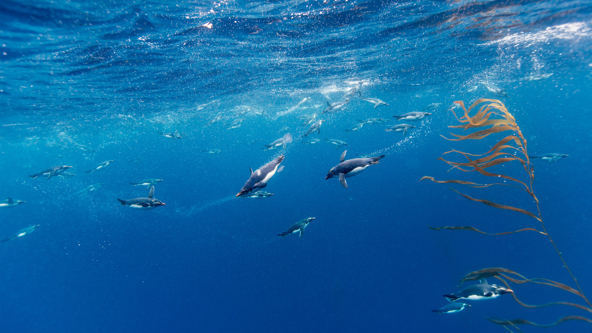 [马可罗尼企鹅，德雷克海峡，智利 (© Paul Souders/Getty Images)](https://cn.bing.combing_2024-01-20_OHR.MacaroniPenguins_ZH-CN0600867997_UHD.jpg) 2024-01-20|
 | [十六湖国家公园，克罗地亚 (© Massimo_S8/Getty Images)](https://cn.bing.combing_2024-01-19_OHR.PlitviceWinter_ZH-CN0407572344_UHD.jpg) 2024-01-19 | [黄昏时分的亚历山大三世桥，巴黎，法国 (© Sizun Eye/Getty Images)](https://cn.bing.combing_2024-01-18_OHR.ParisBridge_ZH-CN0173421630_UHD.jpg) 2024-01-18|
 |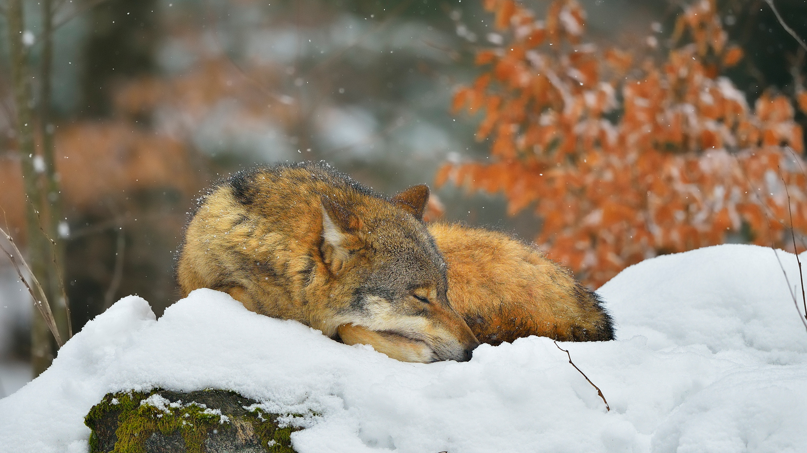 [巴伐利亚森林国家公园里睡觉的狼，德国 (© Raimund Linke/Getty Images)](https://cn.bing.combing_2024-01-17_OHR.SleepyWolf_ZH-CN9870873990_UHD.jpg) 2024-01-17 |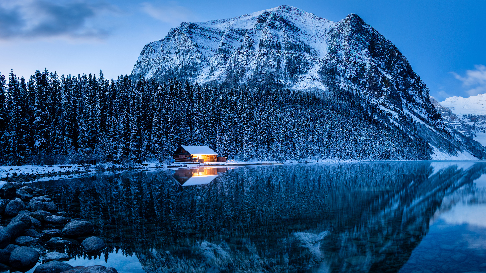 [路易斯湖，班夫国家公园，阿尔伯塔省，加拿大 (© Mr. Simon Paul/Shutterstock)](https://cn.bing.combing_2024-01-16_OHR.LakeLouise_ZH-CN9592539152_UHD.jpg) 2024-01-16|
 |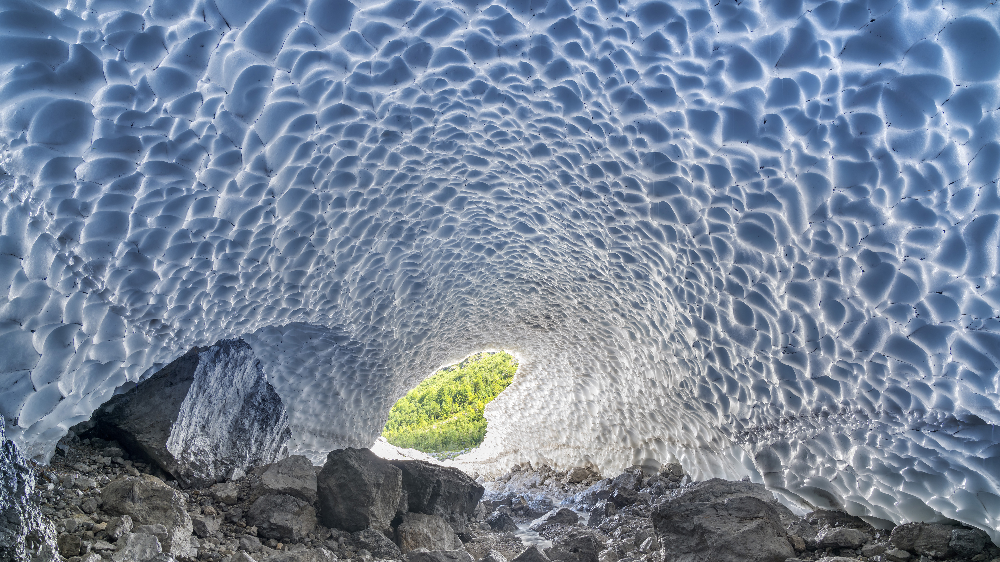 [瓦茨曼山脚下的冰教堂，巴伐利亚，德国 (© Christian Bäck/eStock Photo)](https://cn.bing.combing_2024-01-15_OHR.IceChapel_ZH-CN9189733666_UHD.jpg) 2024-01-15 |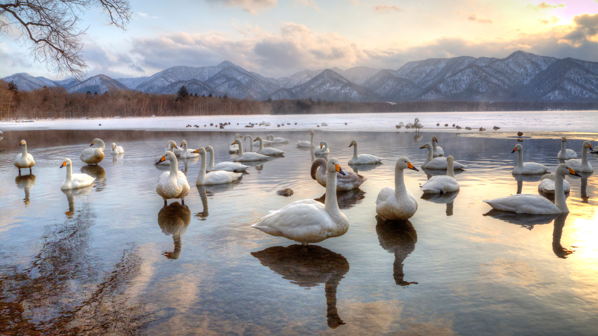 [屈斜路湖的天鹅，日本 (© Darrell Gulin/DanitaDelimont.com)](https://cn.bing.combing_2024-01-14_OHR.HokkaidoSwans_ZH-CN8733312972_UHD.jpg) 2024-01-14|
 |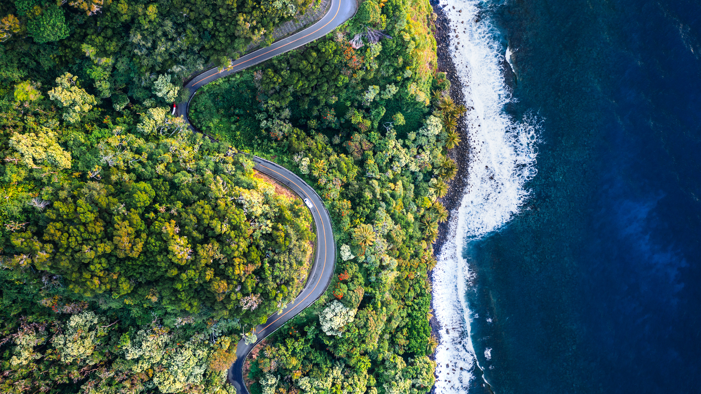 [哈纳之路，毛伊岛，夏威夷，美国 (© Matteo Colombo/Getty Images)](https://cn.bing.combing_2024-01-13_OHR.HanaHighway_ZH-CN8601588011_UHD.jpg) 2024-01-13 | [北汉山国立公园，韩国 (© TRAVEL TAKE PHOTOS/Shutterstock)](https://cn.bing.combing_2024-01-12_OHR.BukhansanSeoul_ZH-CN8002920750_UHD.jpg) 2024-01-12|
 |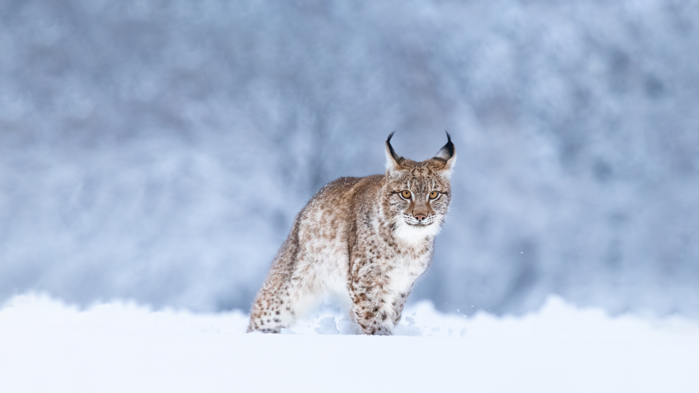 [雪中的欧亚猞猁 (© Jan Stria/Shutterstock)](https://cn.bing.combing_2024-01-11_OHR.LynxSnow_ZH-CN8908082275_UHD.jpg) 2024-01-11 | [米罗伯塔莫斯海岸线上的楼梯，色萨利，希腊 (© Orestis Zoumpos/Amazing Aerial Agency)](https://cn.bing.combing_2024-01-10_OHR.MilopotamosStairs_ZH-CN8013521384_UHD.jpg) 2024-01-10|
 |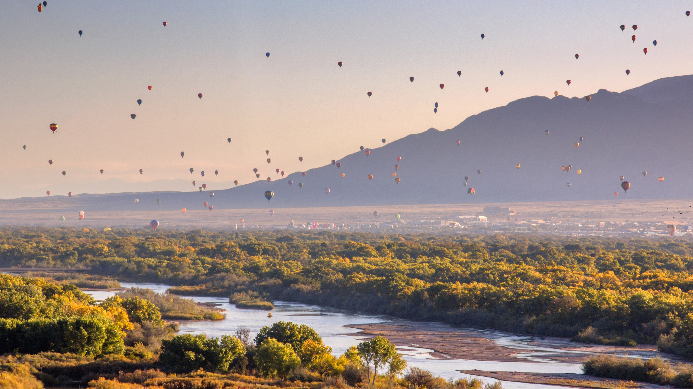 [格兰德河上空的热气球，阿尔伯克基，新墨西哥州，美国 (© Jennifer MacCornack/Shutterstock)](https://cn.bing.combing_2024-01-09_OHR.BalloonDay_ZH-CN7571792218_UHD.jpg) 2024-01-09 |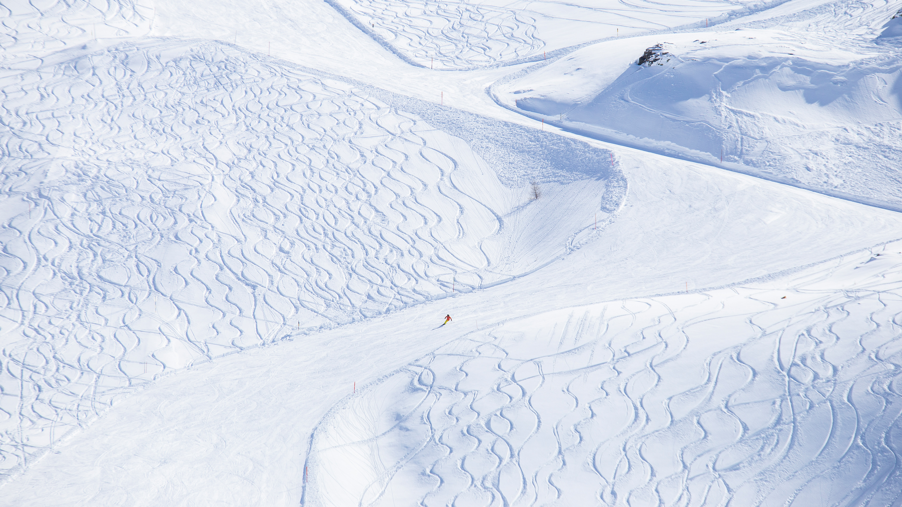 [贝尔尼纳山口的滑雪场，格劳宾登州，瑞士 (© Francesco Bergamaschi/Getty Images)](https://cn.bing.combing_2024-01-08_OHR.BerninaPass_ZH-CN5776010452_UHD.jpg) 2024-01-08|
 |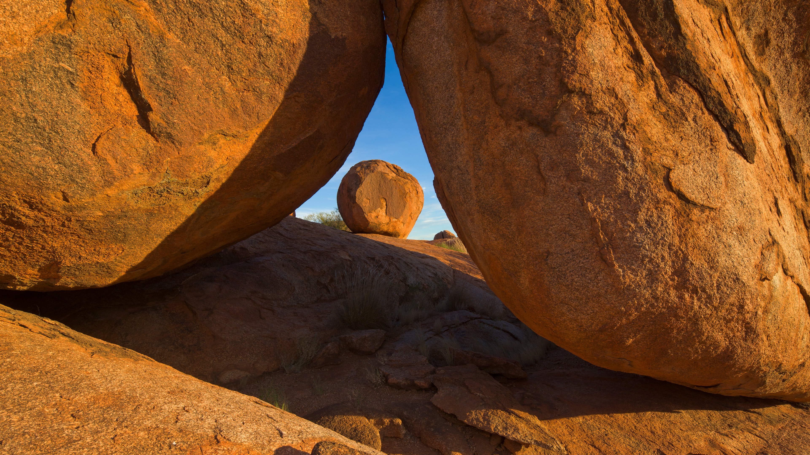 [魔鬼大理石保护区，澳大利亚 (© Yva Momatiuk and John Eastcott/Minden Pictures)](https://cn.bing.combing_2024-01-07_OHR.DevilsMarbles_ZH-CN4897809914_UHD.jpg) 2024-01-07 |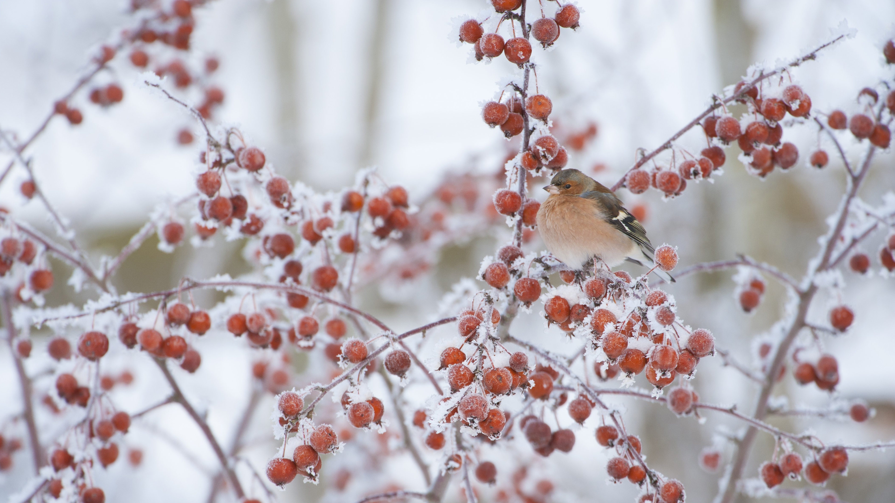 [冬天，雄性苍头燕雀栖息在海棠果树上 (© Mark Hamblin/2020VISION/Minden Pictures)](https://cn.bing.combing_2024-01-06_OHR.CrabappleChaffinch_ZH-CN4458529756_UHD.jpg) 2024-01-06|
 |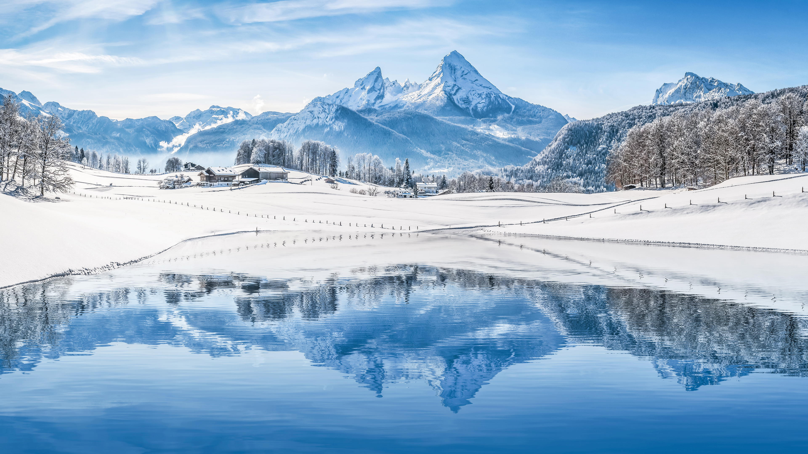 [巴伐利亚阿尔卑斯山脉，德国 (© JFL Photography/Adobe Stock)](https://cn.bing.combing_2024-01-05_OHR.AlpsReflecting_ZH-CN4036320440_UHD.jpg) 2024-01-05 | [金门大桥，旧金山，加利福尼亚州，美国 (© Jim Patterson/Tandem Stills + Motion)](https://cn.bing.combing_2024-01-04_OHR.GoldenGateLight_ZH-CN3874822904_UHD.jpg) 2024-01-04|
 | [明尼汪卡湖，阿尔伯塔省，加拿大 (© Ken Phung/500px/Getty Images)](https://cn.bing.combing_2024-01-03_OHR.MinnewankaLake_ZH-CN3020982568_UHD.jpg) 2024-01-03 | [贾斯旺萨达陵墓和梅兰加尔古堡，焦特布尔，拉贾斯坦邦，印度 (© Twenty47studio/Getty images)](https://cn.bing.combing_2024-01-02_OHR.MehrangarhJodhpur_ZH-CN2855490711_UHD.jpg) 2024-01-02|
 | [睡在雪地里的赤狐，阿布鲁佐，意大利 (© marco vancini/500px/Getty Images)](https://cn.bing.combing_2024-01-01_OHR.SleepingFox_ZH-CN2622967726_UHD.jpg) 2024-01-01|
### 2023-12

|     |    |
| ---- | ---- |
 | [帕那空奇里上空的烟花，碧武里府,泰国 (© noomcpk/Shutterstock)](https://cn.bing.combing_2023-12-31_OHR.ThailandNewYears_ZH-CN2058192262_UHD.jpg) 2023-12-31|
 |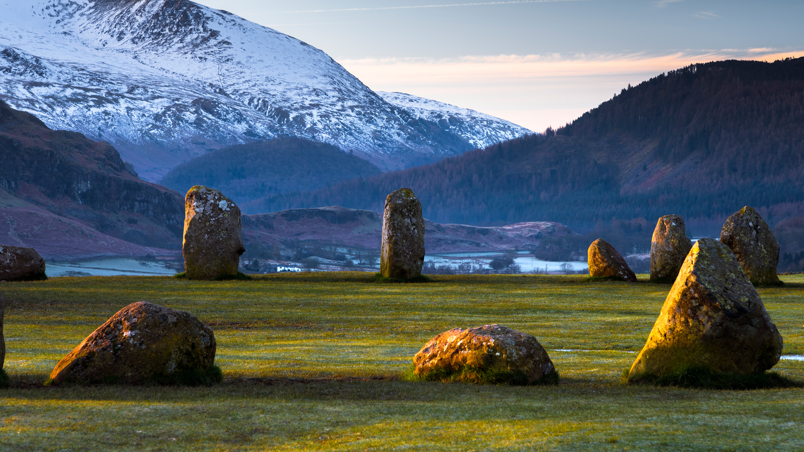 [卡塞里格石圈，湖区国家公园 ，坎布里亚，英国 (© John Finney Photography/Getty Images)](https://cn.bing.combing_2023-12-30_OHR.CastleriggStoneCircleUK_ZH-CN1174541384_UHD.jpg) 2023-12-30 |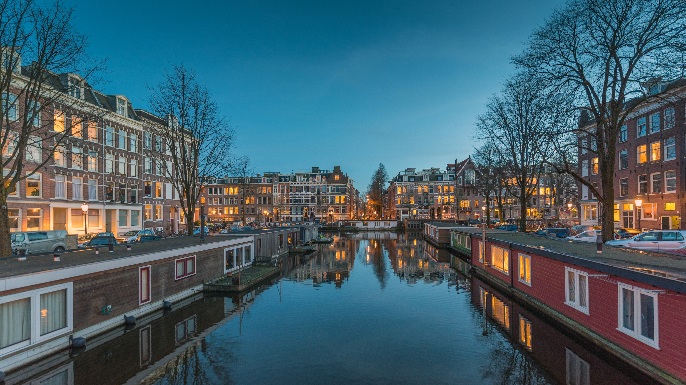 [旧西街区，阿姆斯特丹 ，荷兰 (© George Pachantouris/Getty Images)](https://cn.bing.combing_2023-12-29_OHR.BlueAmsterdam_ZH-CN0483591394_UHD.jpg) 2023-12-29|
 |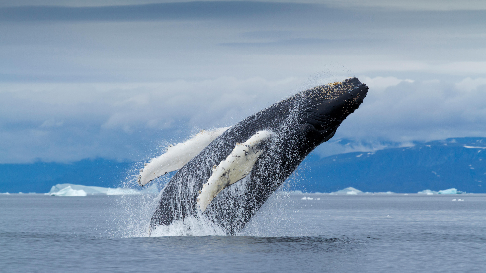 [座头鲸，迪斯科湾，格陵兰 (© Paul Souders/DanitaDelimont.com)](https://cn.bing.combing_2023-12-28_OHR.GreenlandHumpback_ZH-CN8145852053_UHD.jpg) 2023-12-28 |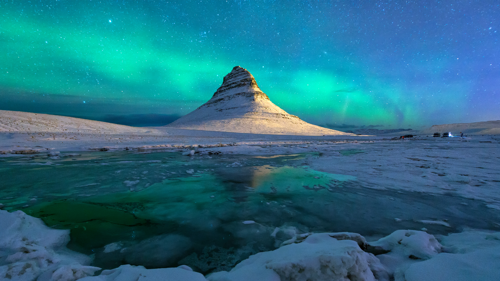 [教堂山，斯奈山半岛，冰岛 (© Ratnakorn Piyasirisorost/Getty Images)](https://cn.bing.combing_2023-12-27_OHR.KirkjufellAurora_ZH-CN7878752057_UHD.jpg) 2023-12-27|
 |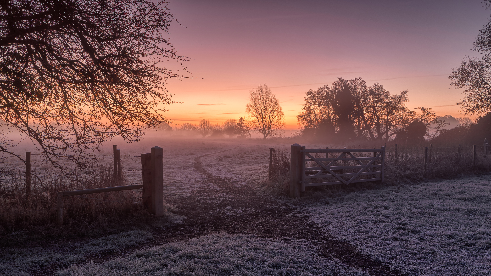 [冬季日出，戴德姆，科尔切斯特，英格兰 (© George W Johnson/Getty Images)](https://cn.bing.combing_2023-12-26_OHR.BoxingDaySunrise_ZH-CN7431512686_UHD.jpg) 2023-12-26 |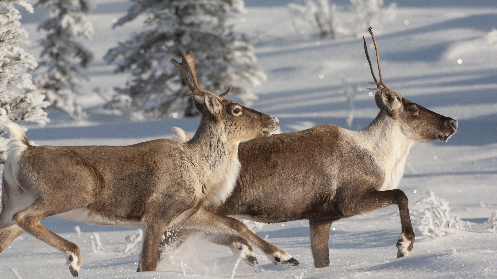 [驯鹿在雪中奔跑，阿拉斯加，美国 (© Michael Quinton/Minden Pictures)](https://cn.bing.combing_2023-12-25_OHR.CaribouChristmas_ZH-CN6264028572_UHD.jpg) 2023-12-25|
 |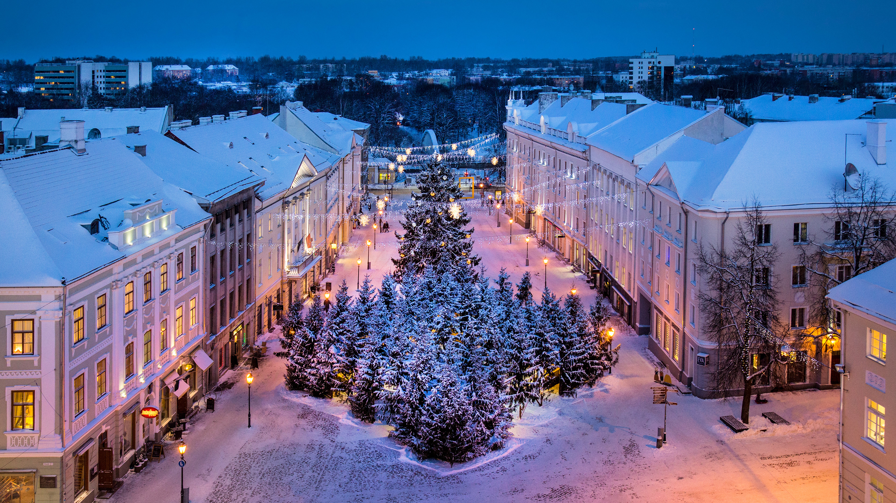 [市政厅广场，塔尔图，爱沙尼亚 (© Westend61/Getty Images)](https://cn.bing.combing_2023-12-24_OHR.EstoniaXmasEve_ZH-CN5870799404_UHD.jpg) 2023-12-24 | [帽带企鹅，南桑威奇群岛，南大西洋 (© Jan Vermeer/Minden Pictures)](https://cn.bing.combing_2023-12-23_OHR.FestivusPenguins_ZH-CN5191348531_UHD.jpg) 2023-12-23|
 |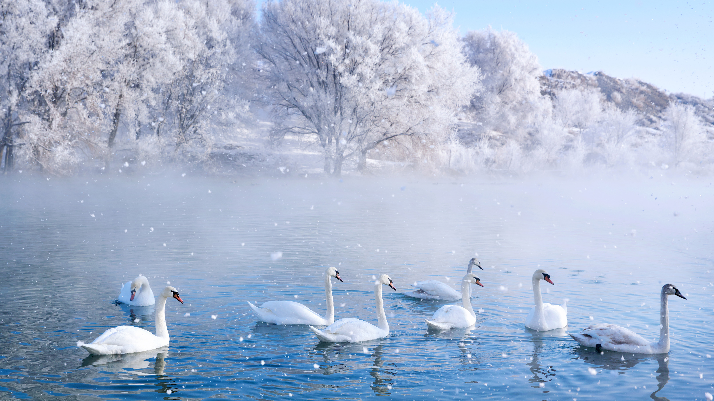 [天鹅泉湿地公园，伊犁，新疆，中国 (© 500px Asia/Getty images)](https://cn.bing.combing_2023-12-22_OHR.WinterSolstice2023_ZH-CN4450201916_UHD.jpg) 2023-12-22 | [卢布尔雅那，斯洛文尼亚共和国 (© kasto80/Getty images)](https://cn.bing.combing_2023-12-21_OHR.LjubljanaLights_ZH-CN3179297953_UHD.jpg) 2023-12-21|
 |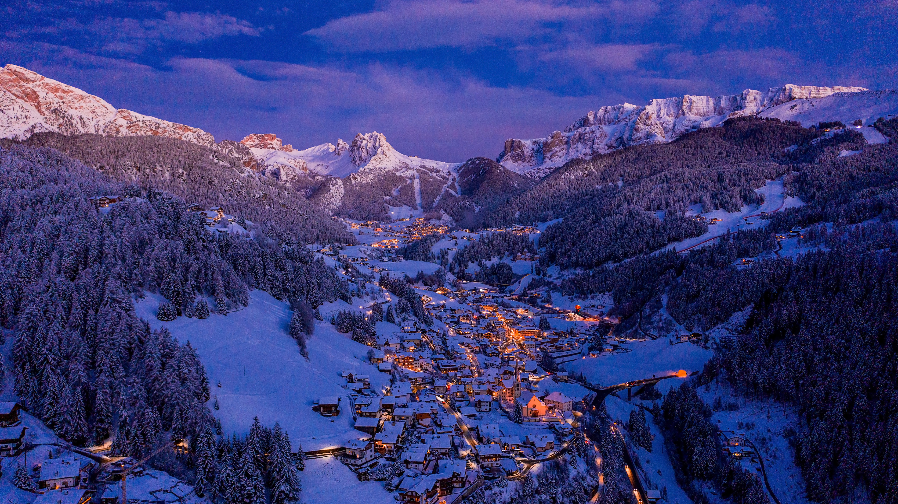 [圣诞节期间的瓦尔加迪纳山谷的村庄，多洛米蒂山，意大利 (© Ingus Kruklitis/Getty Images)](https://cn.bing.combing_2023-12-20_OHR.ValGardenaItaly_ZH-CN2405437494_UHD.jpg) 2023-12-20 |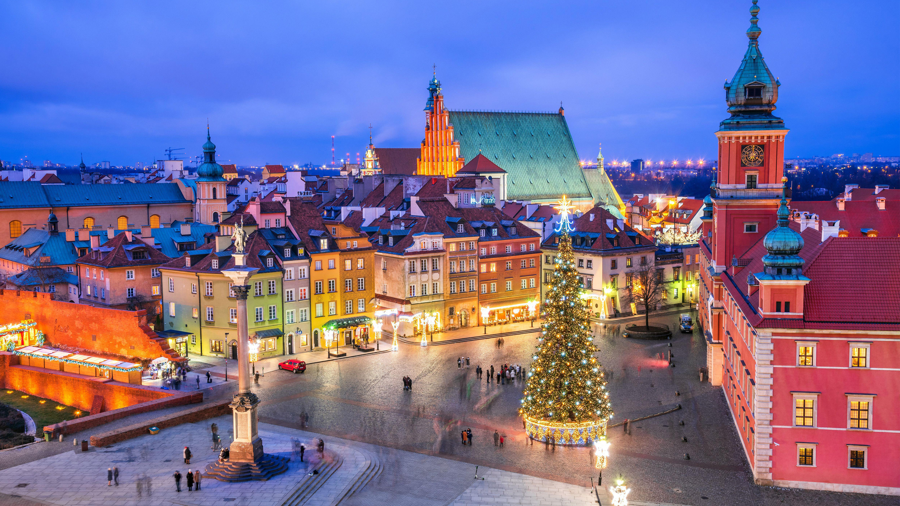 [城堡广场的圣诞树，华沙古城，波兰 (© Panther Media GmbH/Alamy Stock Photo)](https://cn.bing.combing_2023-12-19_OHR.WarsawChristmas_ZH-CN0949732911_UHD.jpg) 2023-12-19|
 |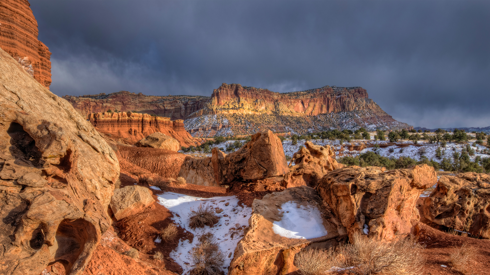 [圆顶礁国家公园，犹他州，美国 (© Jeff Clay/Tandem Stills + Motion)](https://cn.bing.combing_2023-12-18_OHR.CapitolReefSnow_ZH-CN0085775882_UHD.jpg) 2023-12-18 |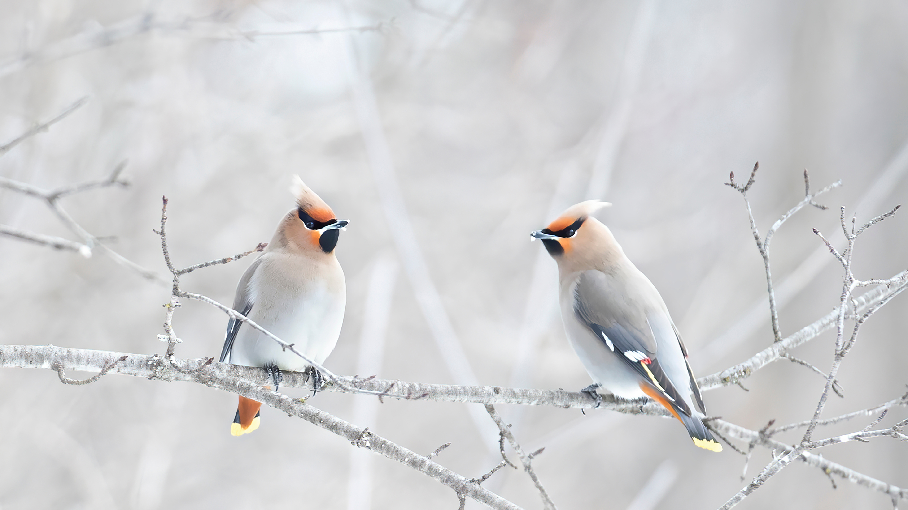 [波西米亚太平鸟栖息在树枝上，加拿大 (© Jim Cumming/Shutterstock)](https://cn.bing.combing_2023-12-17_OHR.WinterWaxwings_ZH-CN9274297835_UHD.jpg) 2023-12-17|
 |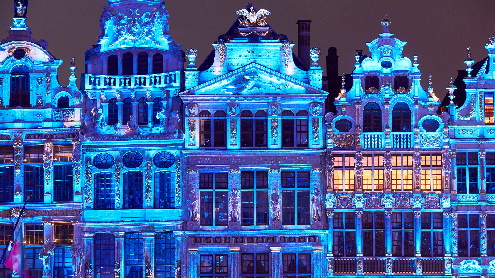 [大广场，布鲁塞尔，比利时 (© Richard Taylor/Sime/eStock Photo)](https://cn.bing.combing_2023-12-16_OHR.GrandPlaceXmas_ZH-CN8299342316_UHD.jpg) 2023-12-16 |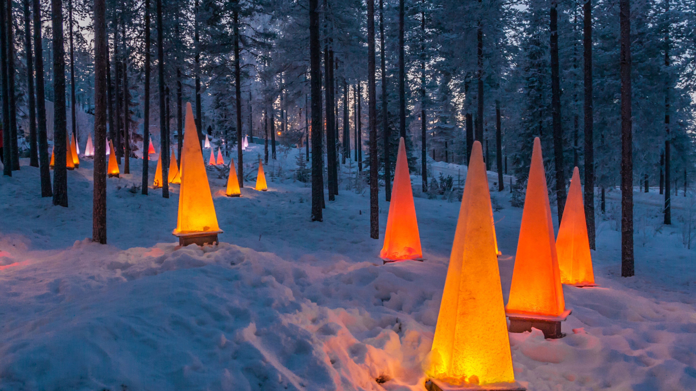 [罗瓦涅米的圣诞老人公园，拉普兰德，芬兰 (© lukutin77/Getty Images)](https://cn.bing.combing_2023-12-15_OHR.SantaPark_ZH-CN7444715899_UHD.jpg) 2023-12-15|
 |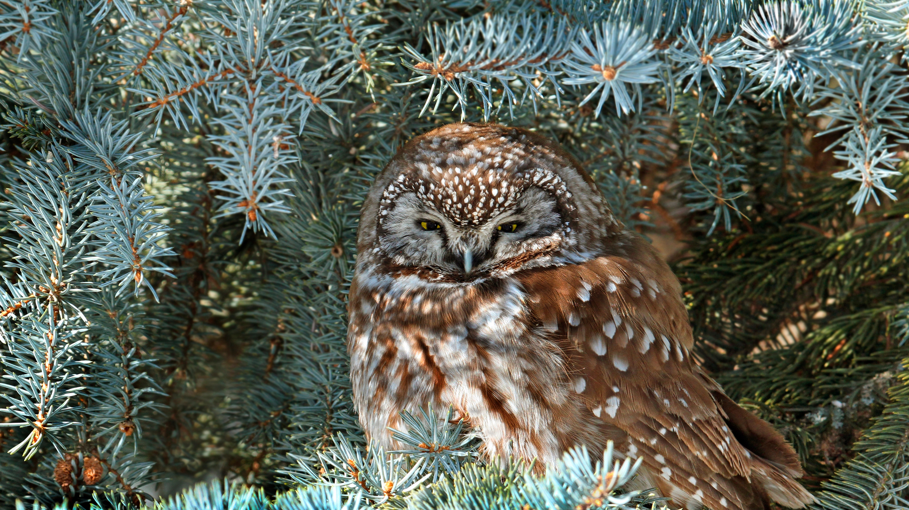 [北方猫头鹰，萨斯喀彻温省，加拿大 (© Nick Saunders/Minden Pictures)](https://cn.bing.combing_2023-12-14_OHR.BorealOwl_ZH-CN7957240111_UHD.jpg) 2023-12-14 |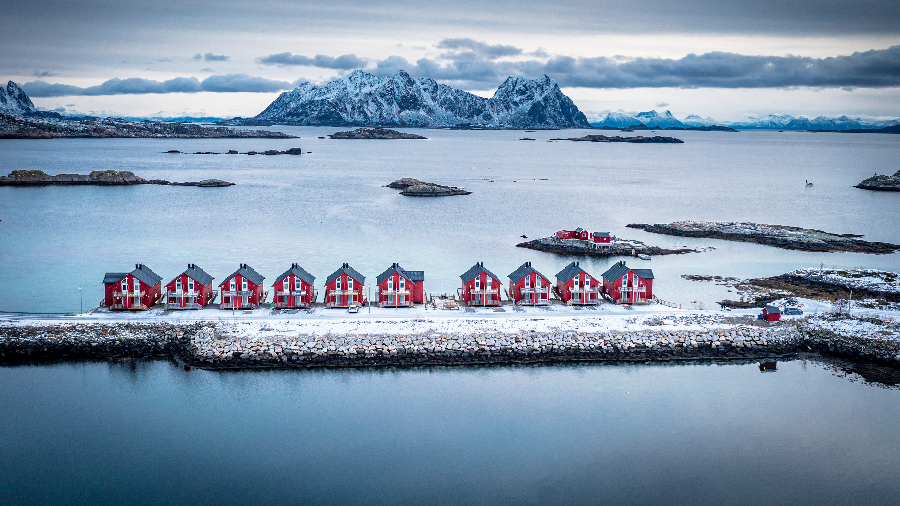 [传统钓鱼小屋，斯沃尔韦尔，罗弗敦群岛，挪威 (© Roberto Moiola/Sysaworld/Getty Images)](https://cn.bing.combing_2023-12-13_OHR.LofotenRorbu_ZH-CN7790383976_UHD.jpg) 2023-12-13|
 | [一品红 (© Yarygin/Getty Images)](https://cn.bing.combing_2023-12-12_OHR.Poinsettia_ZH-CN7255902344_UHD.jpg) 2023-12-12 |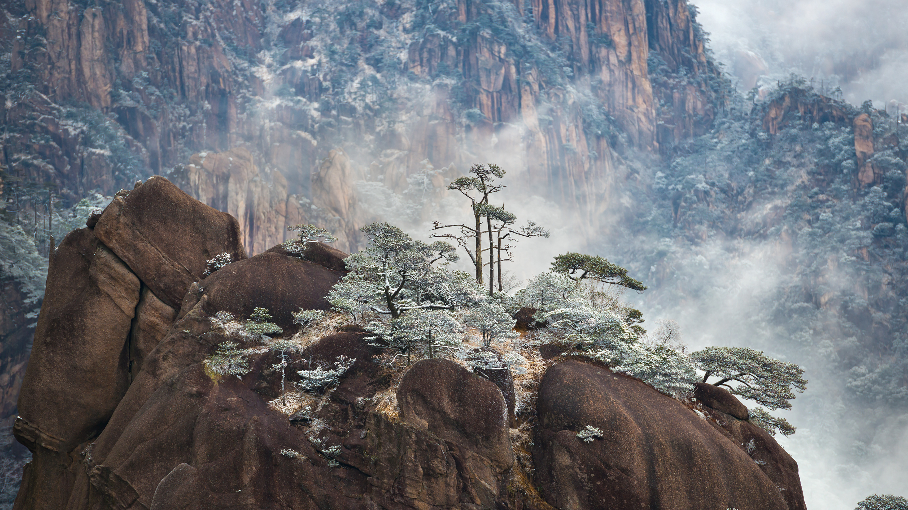 [黄山的冬天，中国 (© Hung Chung Chih/Shutterstock)](https://cn.bing.combing_2023-12-11_OHR.MountainDayChina_ZH-CN6894169616_UHD.jpg) 2023-12-11|
 |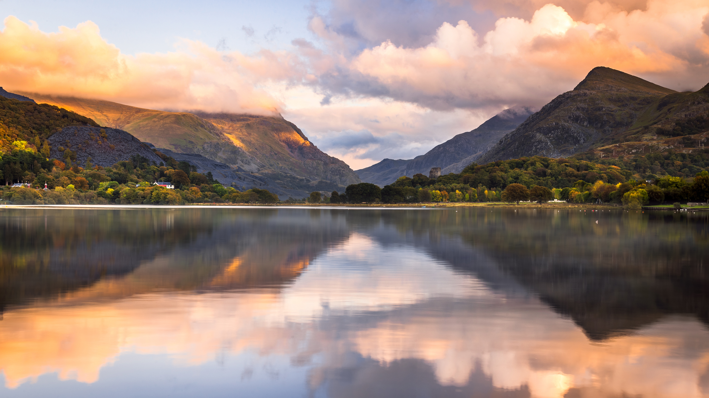 [林帕达恩湖，斯诺登尼亚国家公园， 威尔士 (© Joe Daniel Price/Getty Images)](https://cn.bing.combing_2023-12-10_OHR.LlanberisSnowdoniaSunset_ZH-CN6682238671_UHD.jpg) 2023-12-10 |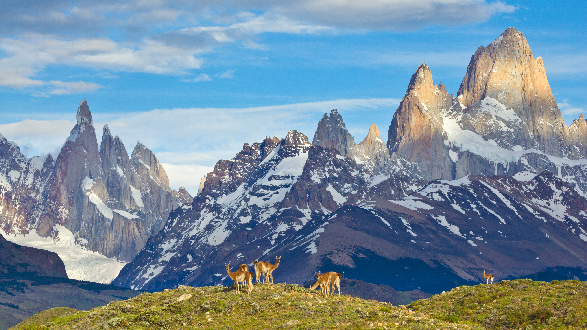 [原驼，冰川国家公园，阿根廷 (© Yva Momatiuk and John Eastcott/Minden Pictures)](https://cn.bing.combing_2023-12-09_OHR.PatagoniaGuanaco_ZH-CN6438038982_UHD.jpg) 2023-12-09|
 | [拉罗克港，圣克莱门特，泽西岛 (© Reinhard Schmid/Huber/eStock Photo)](https://cn.bing.combing_2023-12-08_OHR.JerseyIsland_ZH-CN6224973235_UHD.jpg) 2023-12-08 |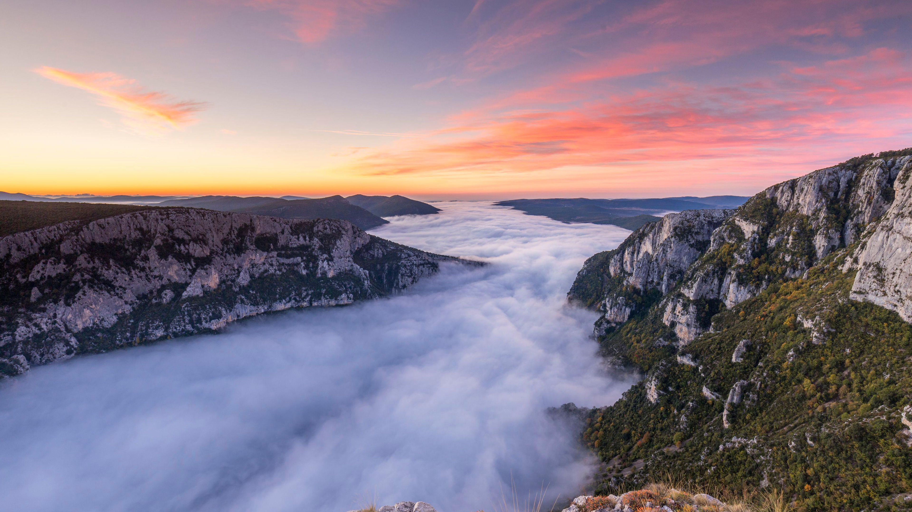 [韦尔东峡谷的雾蒙蒙的早晨，普罗旺斯-阿尔卑斯-蓝色海岸大区，法国 (© Hemis/Alamy)](https://cn.bing.combing_2023-12-07_OHR.GrandCanyonVerdon_ZH-CN6025902720_UHD.jpg) 2023-12-07|
 |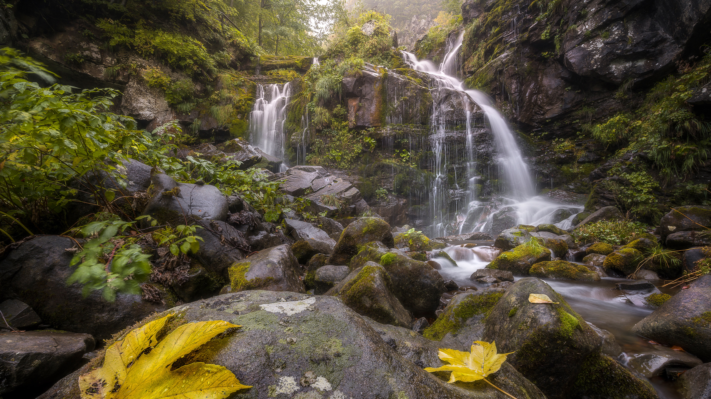 [达尔达尼亚瀑布，博洛尼亚，意大利 (© Alberto Ghizzi Panizza/Minden)](https://cn.bing.combing_2023-12-06_OHR.DardagnaWaterfalls_ZH-CN5613123621_UHD.jpg) 2023-12-06 |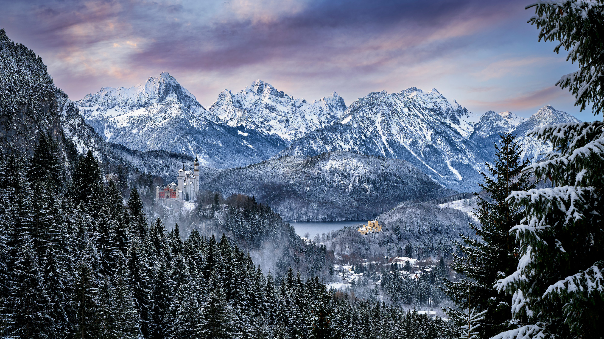 [天鹅堡和旧天鹅堡，巴伐利亚阿尔卑斯山，德国 (© Harald Nachtmann/Getty Images)](https://cn.bing.combing_2023-12-05_OHR.AlpsCastles_ZH-CN5078013932_UHD.jpg) 2023-12-05|
 | [一只猎豹妈妈和她的幼崽，马赛马拉国家保护区，肯尼亚 (© Scott Davis/Tandem Stills + Motion)](https://cn.bing.combing_2023-12-04_OHR.CheetahDay_ZH-CN5114530695_UHD.jpg) 2023-12-04 |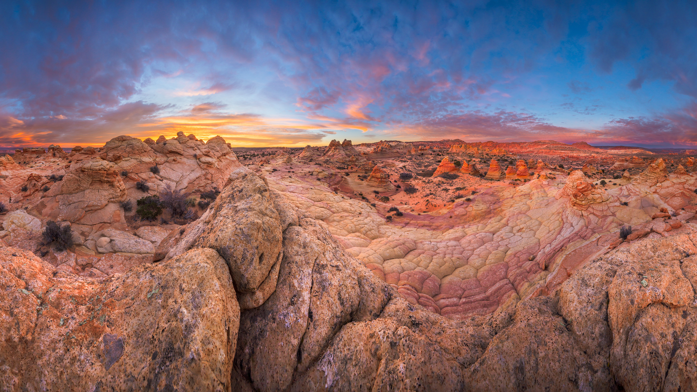 [砂岩岩层，红悬崖国家保护区，亚利桑那州，美国 (© Yva Momatiuk and John Eastcott/Minden Pictures)](https://cn.bing.combing_2023-12-03_OHR.VermilionCliffs_ZH-CN3945784250_UHD.jpg) 2023-12-03|
 | [瓜廖尔堡，中央邦，印度 (© Dmitry Rukhlenko-Photos of India/Alamy)](https://cn.bing.combing_2023-12-02_OHR.GwaliorFortMP_ZH-CN3300432281_UHD.jpg) 2023-12-02 |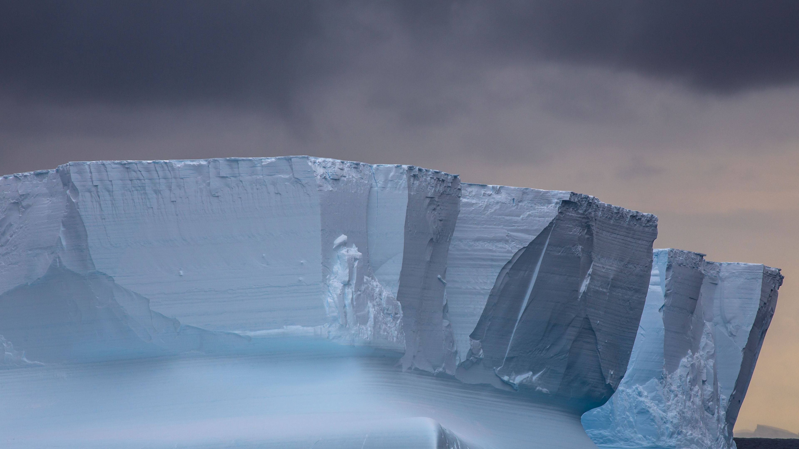 [罗斯海的冰山，南极洲 (© Michel Roggo/Minden Pictures)](https://cn.bing.combing_2023-12-01_OHR.IcebergAntarctica_ZH-CN2053356825_UHD.jpg) 2023-12-01|

### 2023-11

|     |    |
| ---- | ---- |
 |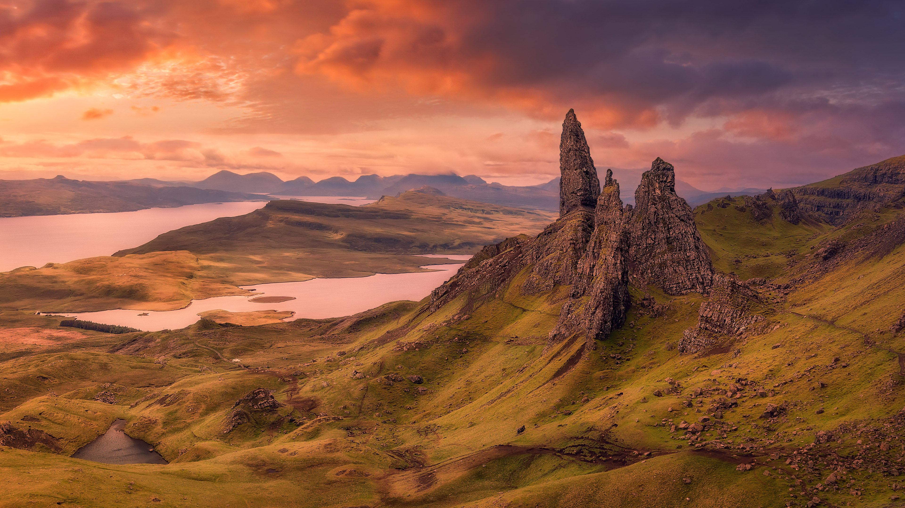 [斯托尔，斯凯岛上展露的岩石尖峰，苏格兰，英国 (© Juan Maria Coy Vergara/Getty Images)](https://cn.bing.combing_2023-11-30_OHR.TrotternishStorr_ZH-CN2508882441_UHD.jpg) 2023-11-30 |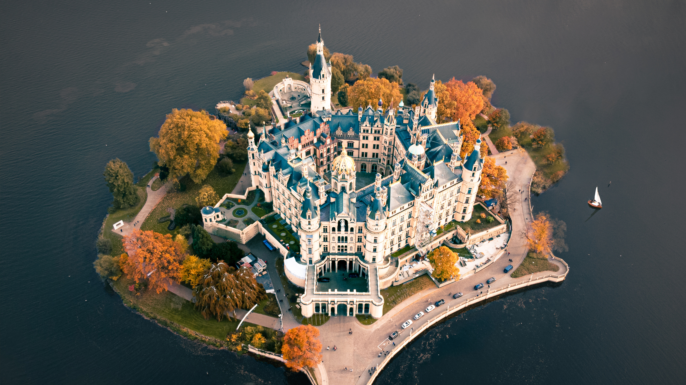 [什未林湖上的什未林城堡，梅克伦堡-前波美拉尼亚州，德国 (© Hannes Wendt/Shutterstock)](https://cn.bing.combing_2023-11-29_OHR.SchwerinerSchloss_ZH-CN2390476345_UHD.jpg) 2023-11-29|
 |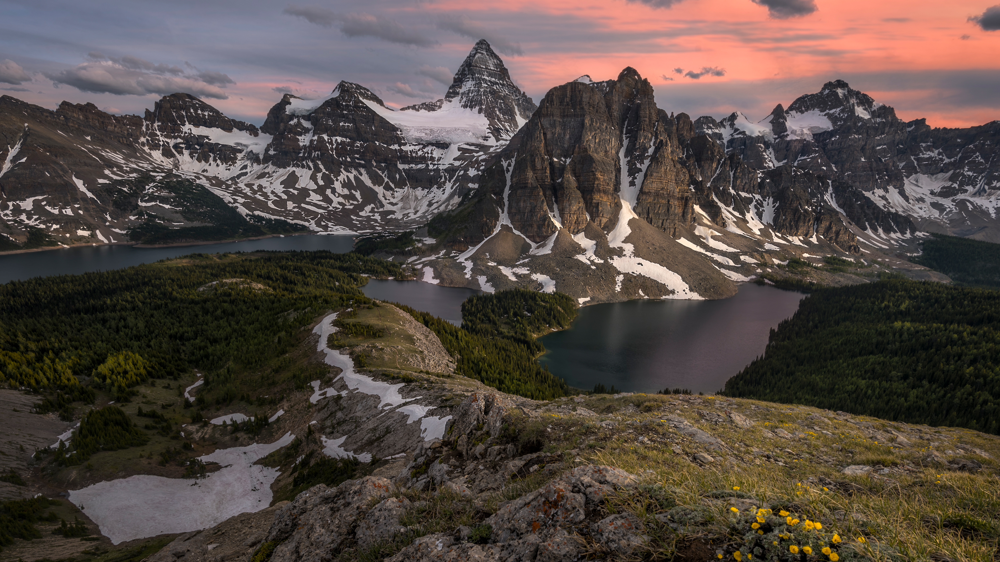 [阿西尼博因山省级公园，加拿大 (© matt macpherson/500px/Getty Images)](https://cn.bing.combing_2023-11-28_OHR.AssiniboineProvincialPark_ZH-CN2270275151_UHD.jpg) 2023-11-28 |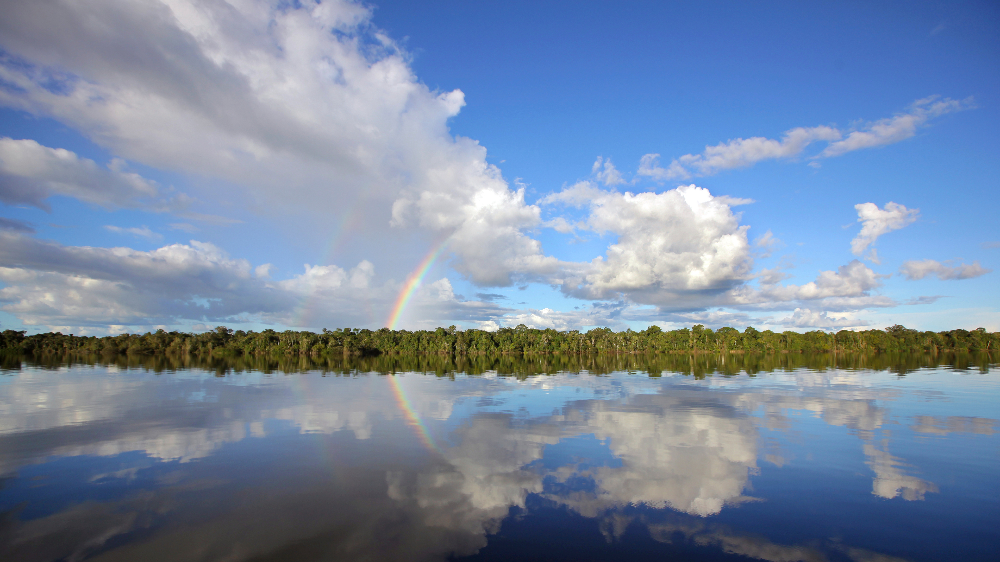 [内格罗河，亚马逊河流域，巴西 (© Timothy Allen/Getty Images)](https://cn.bing.combing_2023-11-27_OHR.RioNegro_ZH-CN2121977810_UHD.jpg) 2023-11-27|
 |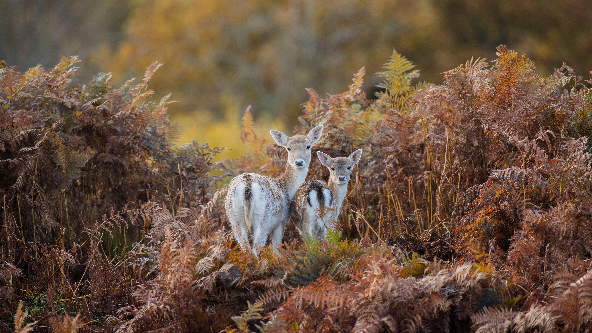 [布拉德盖特公园的小鹿，莱斯特郡，英国 (© Chris Bainbridge/Alamy)](https://cn.bing.combing_2023-11-26_OHR.BradgateFallow_ZH-CN1852334581_UHD.jpg) 2023-11-26 |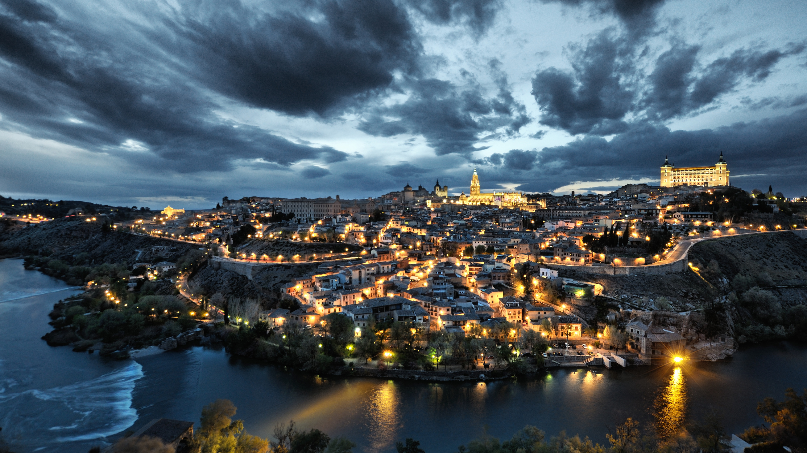 [托莱多，西班牙 (© Carlos Fernandez/Getty Images)](https://cn.bing.combing_2023-11-25_OHR.TajoRiver_ZH-CN1752559204_UHD.jpg) 2023-11-25|
 |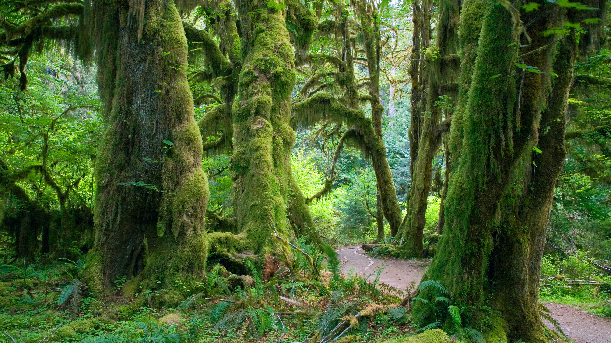 [奥林匹克国家公园霍河雨林中的苔藓大厅 ，华盛顿州，美国 (© James Randklev/Getty Images)](https://cn.bing.combing_2023-11-24_OHR.HallofMosses_ZH-CN1565129809_UHD.jpg) 2023-11-24 |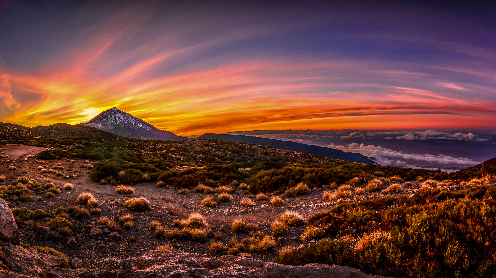 [泰德国家公园的日落，特内里费岛，加那利群岛, 西班牙 (© Javier Martínez Morán/Alamy)](https://cn.bing.combing_2023-11-23_OHR.TeideNational_ZH-CN1367200520_UHD.jpg) 2023-11-23|
 |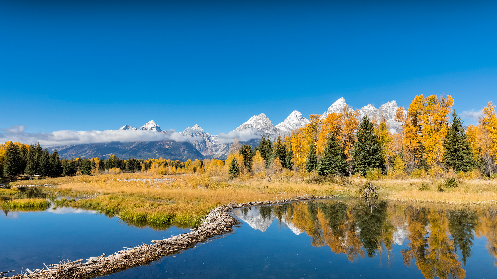 [大提顿国家公园，怀俄明州，美国 (© Westend61/Getty Images)](https://cn.bing.combing_2023-11-22_OHR.SnakeRiverTeton_ZH-CN1213535303_UHD.jpg) 2023-11-22 | [英国诺福克海滩上的灰海豹幼崽 (© Vince Burton/Minden Pictures)](https://cn.bing.combing_2023-11-21_OHR.HelloSeal_ZH-CN1064568368_UHD.jpg) 2023-11-21|
 |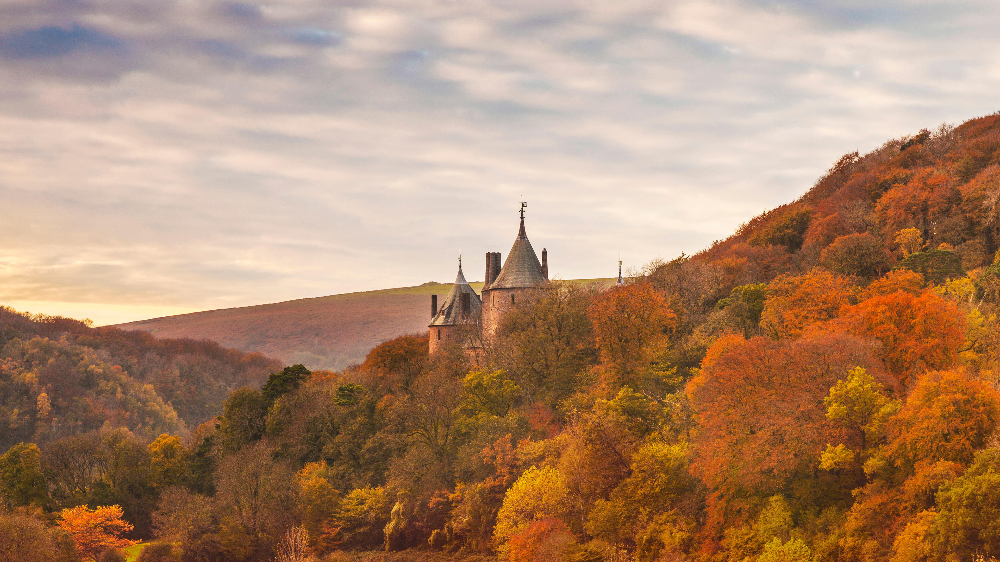 [科奇城堡，Tongwynlais，卡迪夫，威尔士，英国，欧洲 (© Billy Stock/robertharding/Alamy Stock Photo)](https://cn.bing.combing_2023-11-20_OHR.CastleCoch_ZH-CN0917284602_UHD.jpg) 2023-11-20 | [Alam-Pedja自然保护区，爱沙尼亚 (© Sven Zacek/Minden Pictures)](https://cn.bing.combing_2023-11-19_OHR.FrozenBog_ZH-CN0712859386_UHD.jpg) 2023-11-19|
 |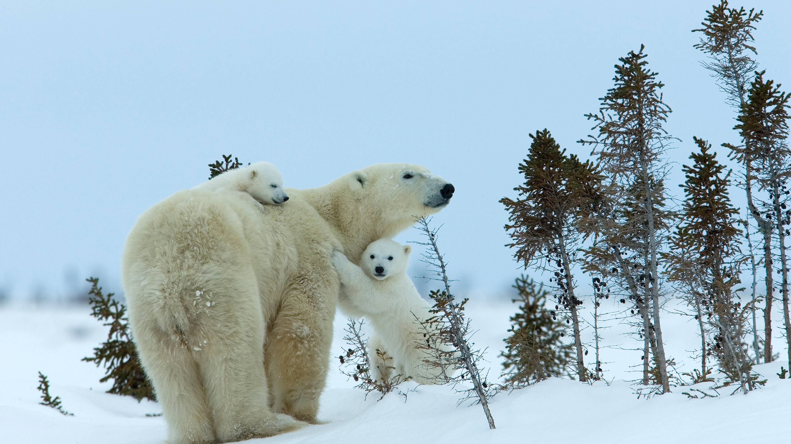 [北极熊妈妈和幼崽，丘吉尔城，曼尼托巴省，加拿大 (© Thorsten Milse/Getty Images)](https://cn.bing.combing_2023-11-18_OHR.MilsePolarBear_ZH-CN0567475122_UHD.jpg) 2023-11-18 |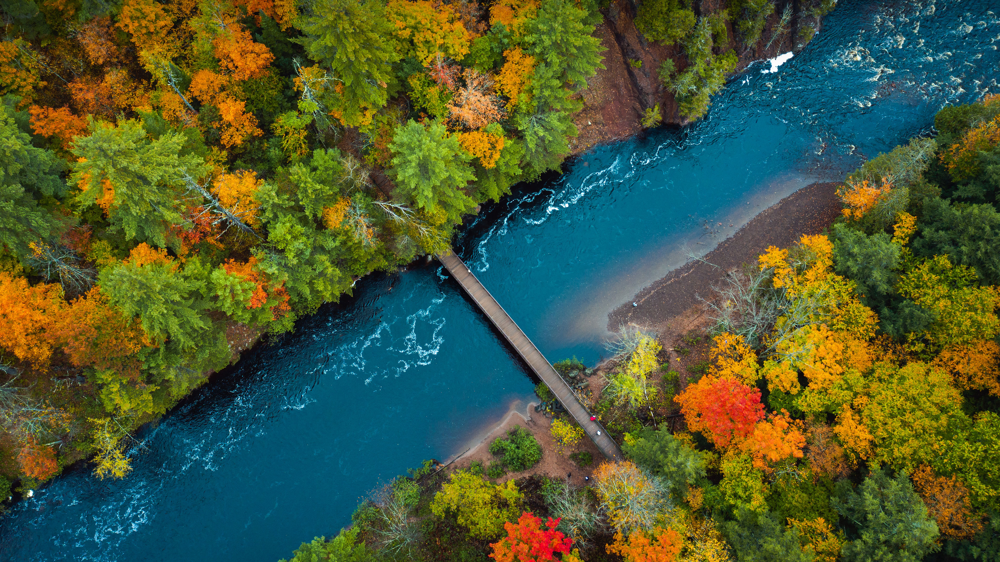 [铜瀑布州立公园的巴德河，威斯康星州，美国 (© Big Joe/Getty Images)](https://cn.bing.combing_2023-11-17_OHR.BadRiver_ZH-CN0416550169_UHD.jpg) 2023-11-17|
 | [雅典和卫城，希腊 (© Mlenny/Getty Images)](https://cn.bing.combing_2023-11-16_OHR.AthensAcropolis_ZH-CN9942357439_UHD.jpg) 2023-11-16 | [萨雷克国家公园的拉帕谷，瑞典 (© Hans Strand/Getty Images)](https://cn.bing.combing_2023-11-15_OHR.SarekSweden_ZH-CN9728518595_UHD.jpg) 2023-11-15|
 | [特卡波湖沿岸的鲁冰花，南岛，新西兰 (© Jeffrey Lewis/Tandem Stills + Motion)](https://cn.bing.combing_2023-11-14_OHR.RussellLupines_ZH-CN8552113285_UHD.jpg) 2023-11-14 |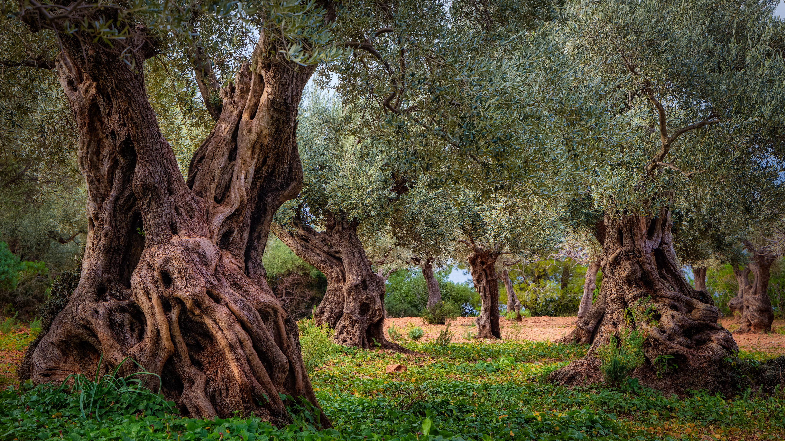 [特拉蒙塔纳山中的老橄榄园，马略卡岛，西班牙 (© cinoby/Getty Images)](https://cn.bing.combing_2023-11-13_OHR.OliveOrchard_ZH-CN8198989130_UHD.jpg) 2023-11-13|
 | [秋天池塘里的两只绿头鸭 (© sun ok/Shutterstock)](https://cn.bing.combing_2023-11-12_OHR.MallarDucks_ZH-CN7422818269_UHD.jpg) 2023-11-12 |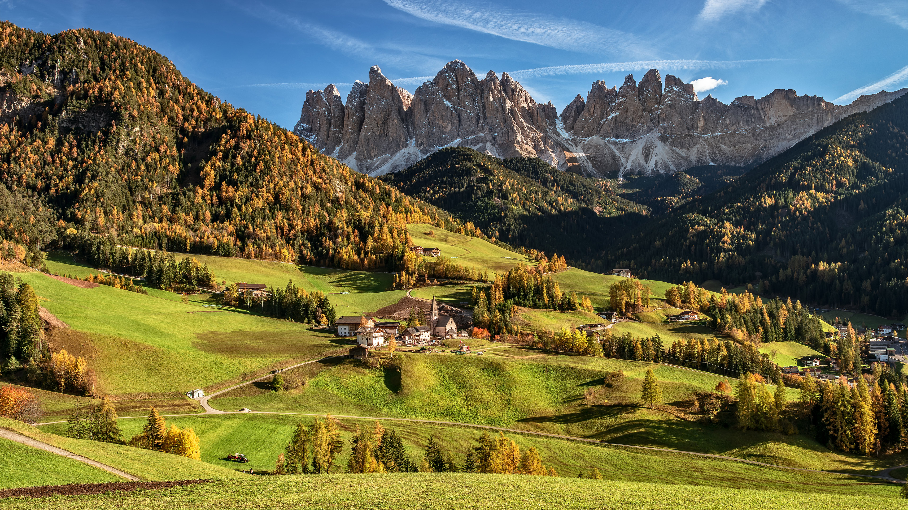 [富内斯山谷，背景是多洛米蒂山，南蒂罗尔，意大利 (© Achim Thomae/Getty Images)](https://cn.bing.combing_2023-11-11_OHR.ValDiFunes_ZH-CN2080915930_UHD.jpg) 2023-11-11|
 |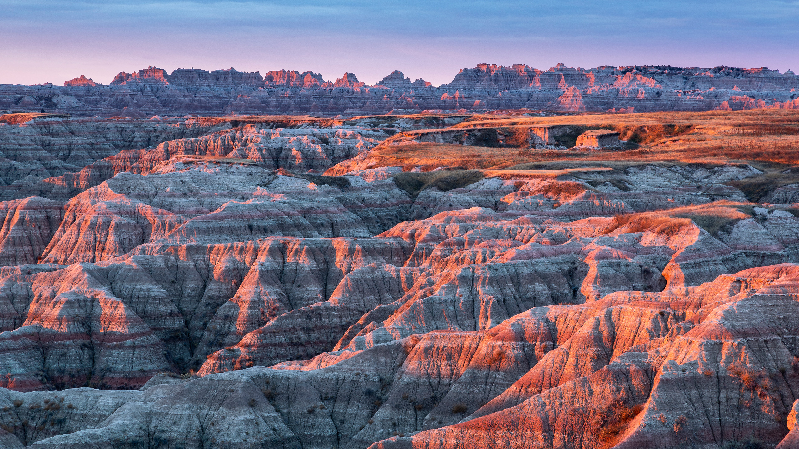 [恶地国家公园，南达科他州，美国 (© Grant Ordelheide/Tandem Stills + Motion)](https://cn.bing.combing_2023-11-10_OHR.BadlandsSunrise_ZH-CN5906162228_UHD.jpg) 2023-11-10 |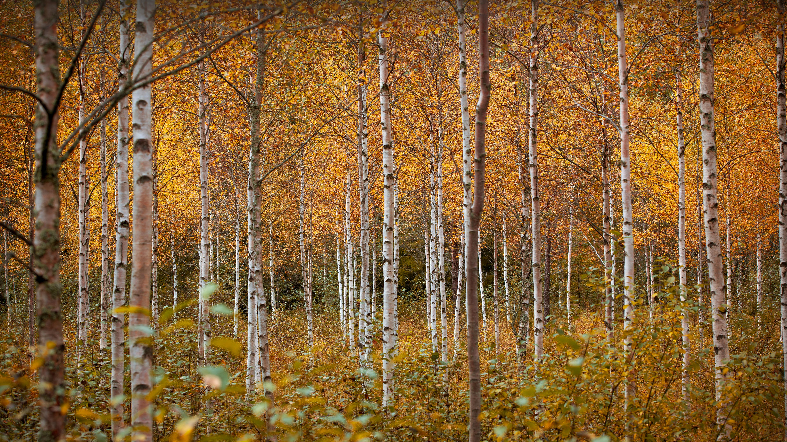 [秋天的白桦树，德拉门，挪威 (© Baac3nes/Getty Images)](https://cn.bing.combing_2023-11-09_OHR.NorwayBirch_ZH-CN5482311438_UHD.jpg) 2023-11-09|
 |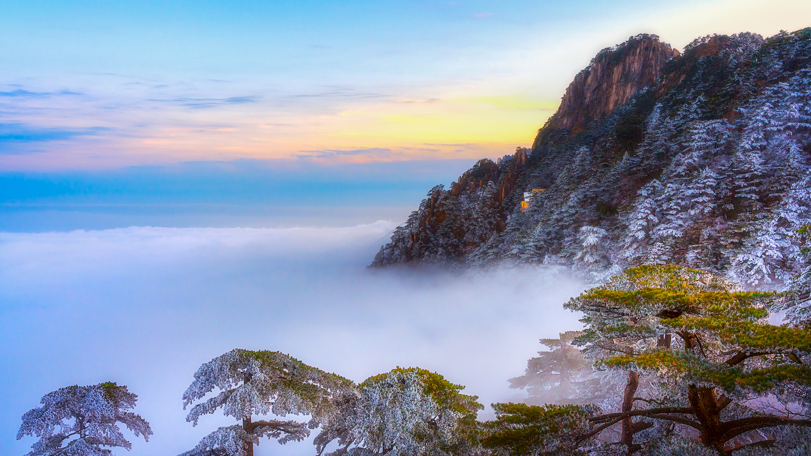 [黄山的日落，安徽省，中国 (© Nantapon Pattamakijsakul/Getty Images)](https://cn.bing.combing_2023-11-08_OHR.LiDong2023_ZH-CN5089092069_UHD.jpg) 2023-11-08 |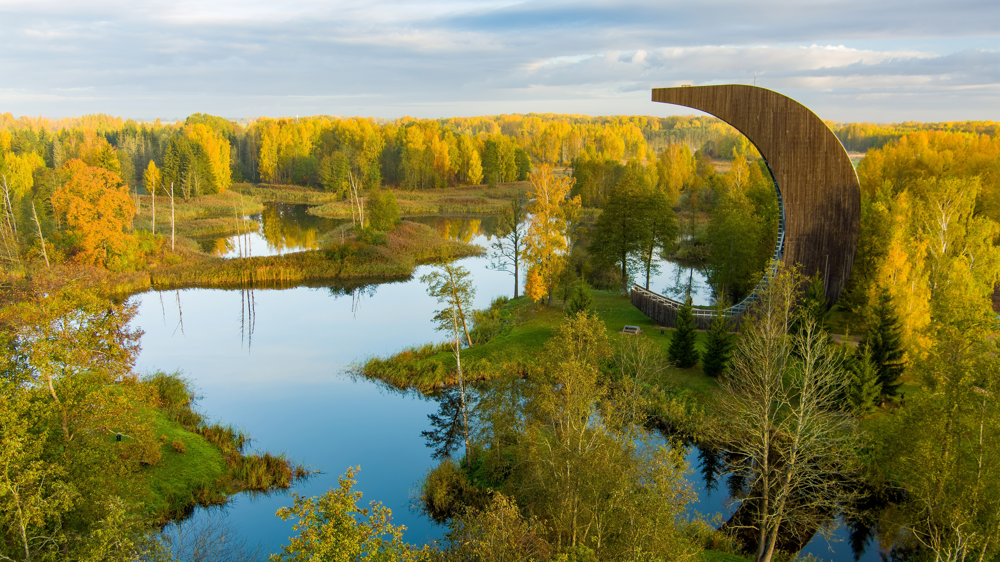 [Kirkilai湖泊和瞭望塔，比尔扎伊地区公园，立陶宛 (© MNStudio/Shutterstock)](https://cn.bing.combing_2023-11-07_OHR.KirkilaiTower_ZH-CN4058404632_UHD.jpg) 2023-11-07|
 |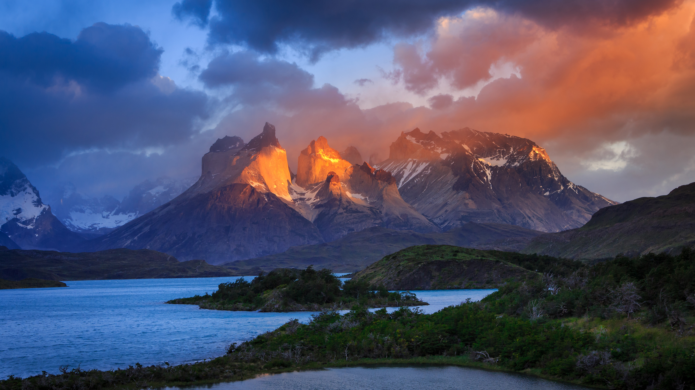 [佩霍湖，百内国家公园，智利南部 (© OST/Getty Images)](https://cn.bing.combing_2023-11-06_OHR.LagoPehoe_ZH-CN3367356273_UHD.jpg) 2023-11-06 |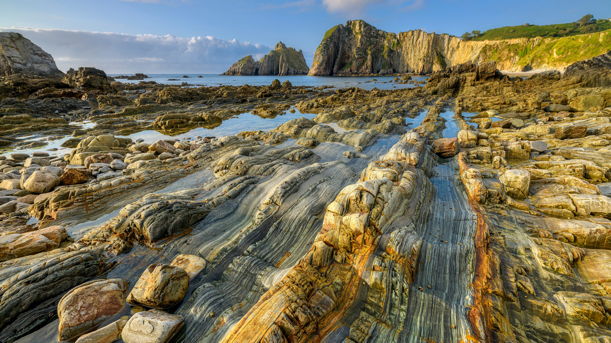 [石英岩地层，普拉亚德尔锡伦西奥，西班牙 (© Jean-Philippe Delobelle/Minden Pictures)](https://cn.bing.combing_2023-11-05_OHR.SilencioSpain_ZH-CN2955614478_UHD.jpg) 2023-11-05|
 |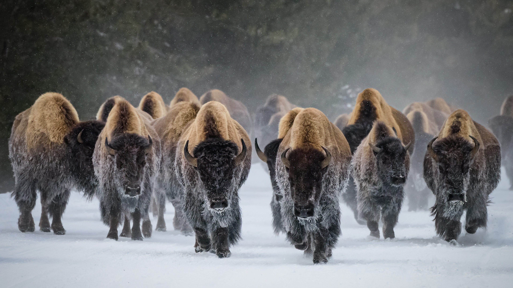 [美洲野牛，黄石国家公园，怀俄明州，美国 (© Gary Gray/Getty Images)](https://cn.bing.combing_2023-11-04_OHR.BisonSnow_ZH-CN2483472629_UHD.jpg) 2023-11-04 |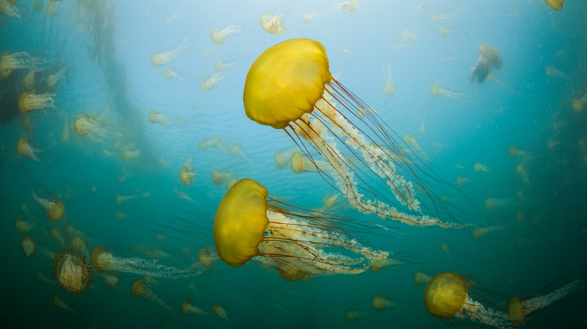 [卡梅尔海岸的太平洋海荨麻水母，加利福尼亚，美国 (© Jim Patterson/Tandem Stills + Motion)](https://cn.bing.combing_2023-11-03_OHR.SeaNettles_ZH-CN1735729435_UHD.jpg) 2023-11-03|
 |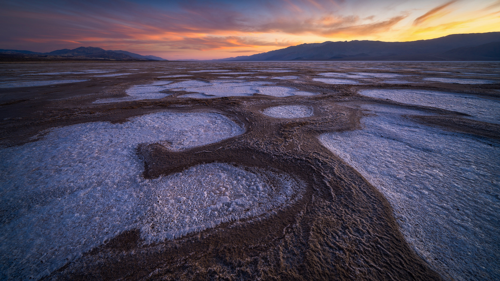 [恶水盆地的盐滩，死亡谷国家公园，加利福尼亚州，美国 (© Jim Patterson/Tandem Stills + Motion)](https://cn.bing.combing_2023-11-02_OHR.DeathValleySalt_ZH-CN8438207719_UHD.jpg) 2023-11-02 | [上巴尔城堡，阿尔萨斯，法国 (© Andrea Pistolesi/Getty Images)](https://cn.bing.combing_2023-11-01_OHR.HautBarr_ZH-CN8274813404_UHD.jpg) 2023-11-01|

### 2023-10

|     |    |
| ---- | ---- |
 | [万圣节南瓜灯 (© Bing Image Creator)](https://cn.bing.combing_2023-10-31_OHR.HalloweenCuteAI_ZH-CN1079713117_UHD.jpg) 2023-10-31 |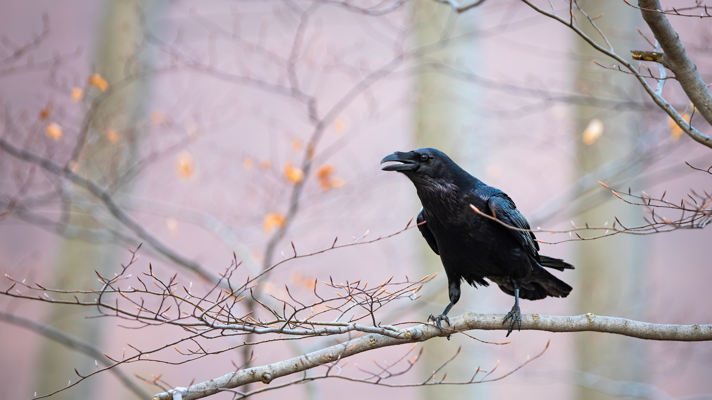 [普通乌鸦坐在树枝上 (© WildMedia/Shutterstock)](https://cn.bing.combing_2023-10-30_OHR.AutumnRaven_ZH-CN7897841947_UHD.jpg) 2023-10-30|
 |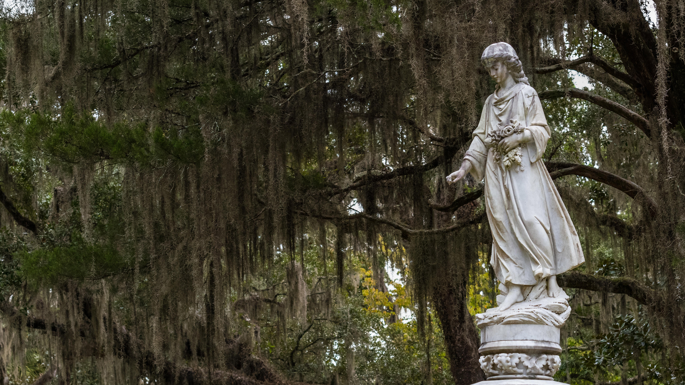 [博纳温彻墓地，萨凡纳，佐治亚州，美国 (© Kelly vanDellen/Alamy)](https://cn.bing.combing_2023-10-29_OHR.SavannahSculpture_ZH-CN7663694208_UHD.jpg) 2023-10-29 |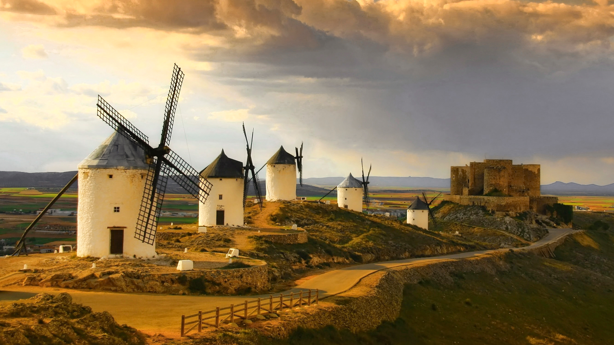 [卡斯蒂利亚-拉曼恰的风车，西班牙 (© Getty Images)](https://cn.bing.combing_2023-10-28_OHR.FiveWinds_ZH-CN7503464049_UHD.jpg) 2023-10-28|
 | [斯利加坎老桥，苏格兰斯凯岛 (© Aliaume Chapelle/Tandem Stills + Motion)](https://cn.bing.combing_2023-10-27_OHR.OldBridgeSkye_ZH-CN7228411986_UHD.jpg) 2023-10-27 | [美泉宫公园的秋叶，维也纳，奥地利 (© rusm/Getty Images)](https://cn.bing.combing_2023-10-26_OHR.ViennaAutumn_ZH-CN7011999199_UHD.jpg) 2023-10-26|
 |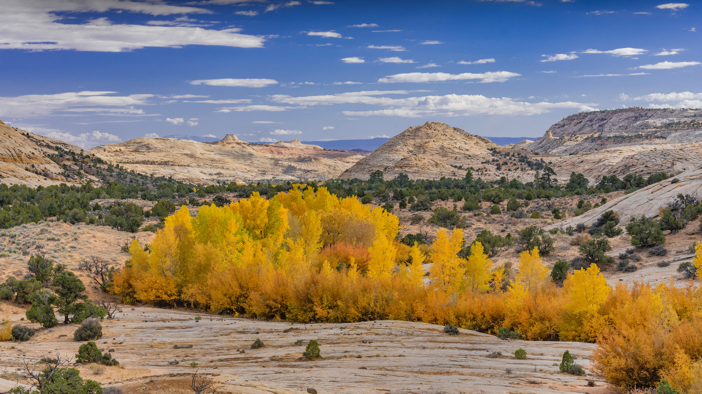 [大阶梯埃斯卡兰特国家纪念区中的棉白杨树，犹他州，美国 (© Jeff Foott/Minden Pictures)](https://cn.bing.combing_2023-10-25_OHR.GrandStaircase_ZH-CN5928937512_UHD.jpg) 2023-10-25 |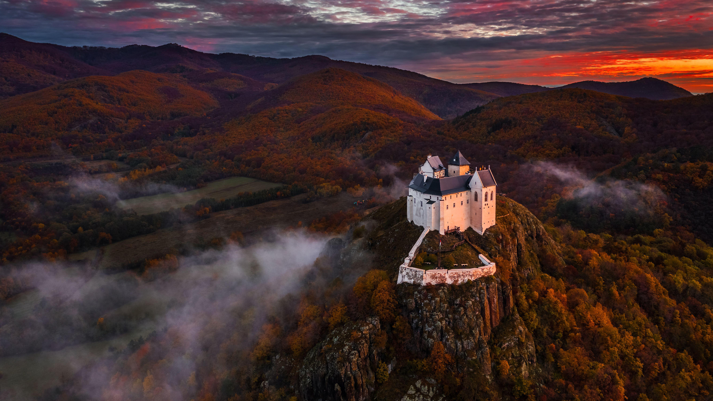 [桑佩伦山上的菲泽尔城堡，匈牙利 (© ZGPhotography/Alamy)](https://cn.bing.combing_2023-10-24_OHR.FuzerCastle_ZH-CN5485191349_UHD.jpg) 2023-10-24|
 | [哥伦比亚河上的阿斯托里亚-梅格勒大桥，阿斯托里亚区，俄勒冈州，美国 (© Dan Mihai/Getty Images)](https://cn.bing.combing_2023-10-22_OHR.AstoriaBridge_ZH-CN5052905610_UHD.jpg) 2023-10-22 | [波斯古城波斯波利斯的浮雕，伊朗 (© Ozbalci/Getty Images)](https://cn.bing.combing_2023-10-21_OHR.PersepolisRelief_ZH-CN4910990690_UHD.jpg) 2023-10-21|
 |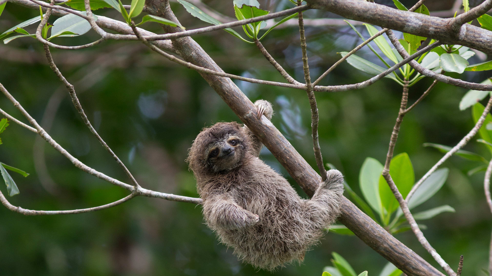 [俾格米三趾树懒宝宝，埃斯库多贝拉瓜斯岛，巴拿马 (© Suzi Eszterhas/Minden Pictures)](https://cn.bing.combing_2023-10-20_OHR.PygmySloth_ZH-CN4739853522_UHD.jpg) 2023-10-20 |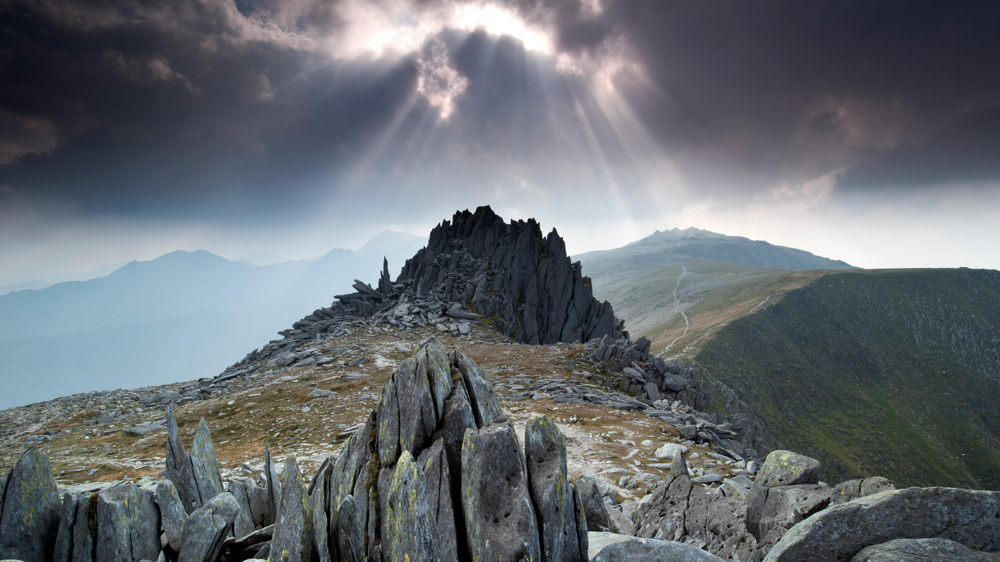 [Castell y Gwynt，格莱德法赫山，雪墩山国家公园，英国北威尔士 (© Alan Novelli/Alamy Stock Photo)](https://cn.bing.combing_2023-10-19_OHR.CastellyGwyntUK_ZH-CN1219668479_UHD.jpg) 2023-10-19|
 |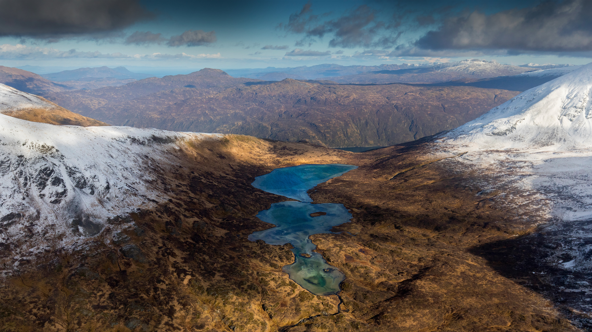 [科迪亚克国家野生动物保护区，科迪亚克岛，阿拉斯加州，美国 (© Ian Shive/Tandem Stills + Motion)](https://cn.bing.combing_2023-10-18_OHR.KodiakAlaska_ZH-CN0627619150_UHD.jpg) 2023-10-18 | [帕拉塔塔,阿雅克肖,科西嘉岛,法国 (© Jon Ingall/Alamy)](https://cn.bing.combing_2023-10-17_OHR.GenoeseTower_ZH-CN0086623003_UHD.jpg) 2023-10-17|
 |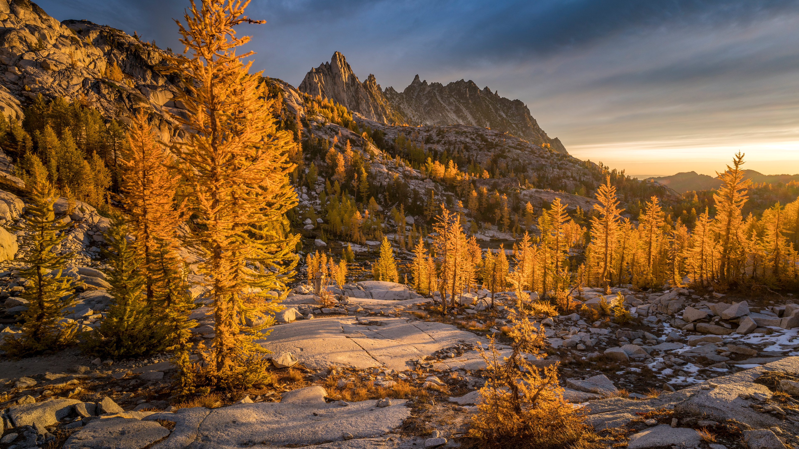 [金色落叶松和普鲁西克峰，魔力地带，华盛顿州，美国 (© Jim Patterson/Tandem Stills + Motion)](https://cn.bing.combing_2023-10-16_OHR.GoldenEnchantments_ZH-CN9686531344_UHD.jpg) 2023-10-16 | [躲在树皮中欧洲刺猬，苏塞克斯，英国 (© Jules Cox/Minden Pictures)](https://cn.bing.combing_2023-10-15_OHR.AutumnHedgehog_ZH-CN7309314630_UHD.jpg) 2023-10-15|
 | ["火环”日环食，多哈，卡特尔 (© Sorin Furcoi/Getty Images)](https://cn.bing.combing_2023-10-14_OHR.RingEclipse_ZH-CN7063841581_UHD.jpg) 2023-10-14 | [加尔加诺半岛上的维埃斯特，阿普利亚，意大利 (© Pilat666/Getty Images)](https://cn.bing.combing_2023-10-13_OHR.ViesteItaly_ZH-CN6693499674_UHD.jpg) 2023-10-13|
 |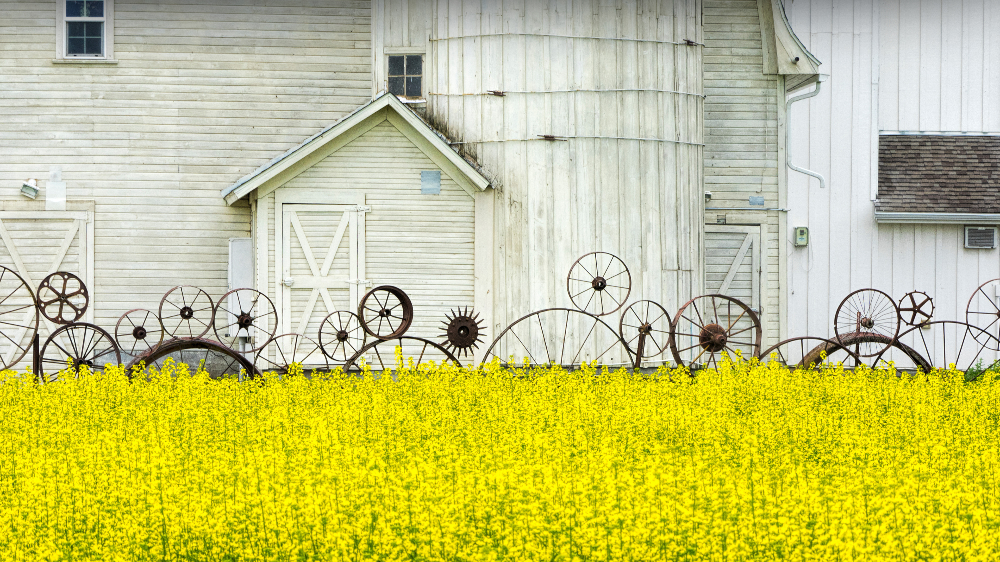 [帕卢斯地区的老谷仓和油菜田，爱达荷州，美国 (© Terry Eggers/Getty Images)](https://cn.bing.combing_2023-10-12_OHR.IdahoBarn_ZH-CN6472682534_UHD.jpg) 2023-10-12 |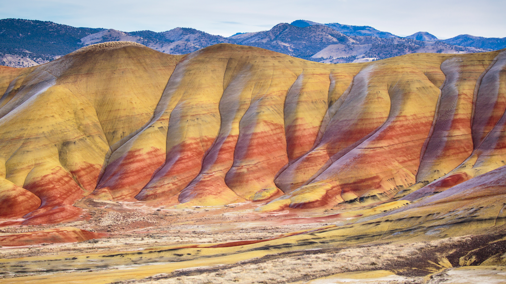 [约翰迪化石床国家纪念地中的彩绘山，俄勒冈州，美国 (© Ben Herndon/Tandem Stills + Motion)](https://cn.bing.combing_2023-10-11_OHR.JohnDayFossil_ZH-CN6265838332_UHD.jpg) 2023-10-11|
 |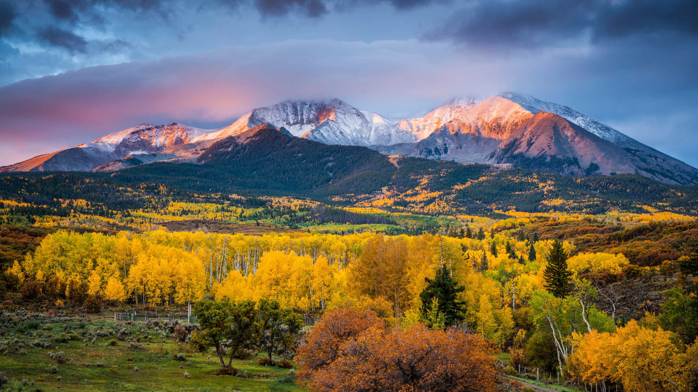 [索普里斯山，科罗拉多州，美国 (© Jason Hatfield/Tandem Stills + Motion)](https://cn.bing.combing_2023-10-10_OHR.SoprisSunrise_ZH-CN5935701155_UHD.jpg) 2023-10-10 |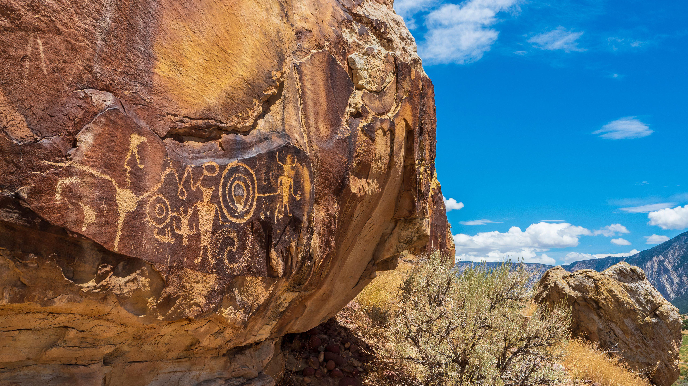 [弗里蒙特岩画，恐龙国家纪念碑，詹森，犹他州，美国 (© Dan Leeth/Alamy)](https://cn.bing.combing_2023-10-09_OHR.FremontPetroglyph_ZH-CN5736573545_UHD.jpg) 2023-10-09|
 | [巨型蛤壳中的条纹蛸，苏拉威西海，印度尼西亚 (© Alex Mustard/Minden Pictures)](https://cn.bing.combing_2023-10-08_OHR.OctoClam_ZH-CN5427646548_UHD.jpg) 2023-10-08 | [灰熊在卡特迈国家公园布鲁克斯瀑布捕捞鲑鱼，阿拉斯加州，美国 (© oksana.perkins/Shutterstock)](https://cn.bing.combing_2023-10-07_OHR.GrizzlyFalls_ZH-CN5152476563_UHD.jpg) 2023-10-07|
 |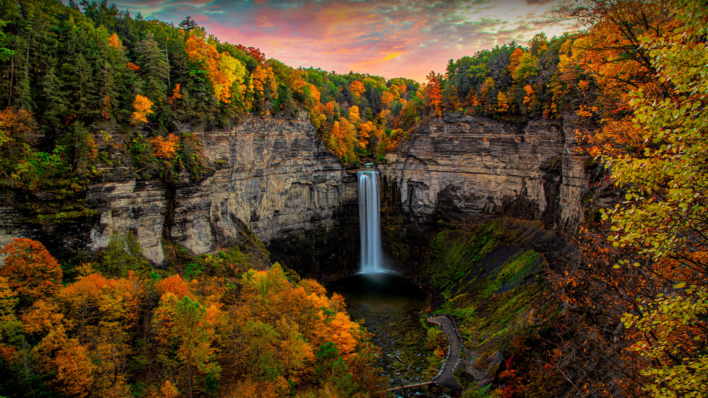 [杜鲁门斯堡的州立托格汉诺克瀑布公园，纽约州，美国 (© Paul Massie Photography/Getty Images)](https://cn.bing.combing_2023-10-06_OHR.TaughannockFalls_ZH-CN4580750386_UHD.jpg) 2023-10-06 |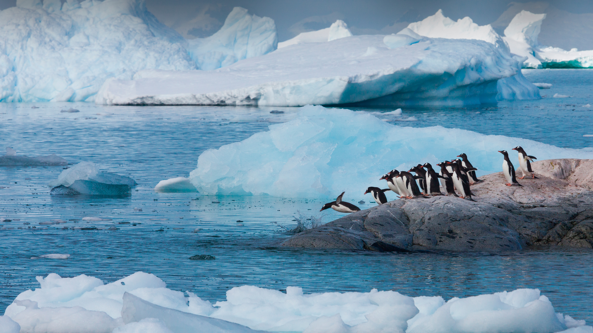 [巴布亚企鹅，南极洲 (© Art Wolfe/Getty Images)](https://cn.bing.combing_2023-10-05_OHR.GentooJump_ZH-CN9625511393_UHD.jpg) 2023-10-05|
 | [狼蛛星云中形成的年轻恒星，詹姆斯·韦布空间望远镜 (© NASA, ESA, CSA, STScI, Webb ERO Production Team)](https://cn.bing.combing_2023-10-04_OHR.TarantulaNebula_ZH-CN9340300473_UHD.jpg) 2023-10-04 |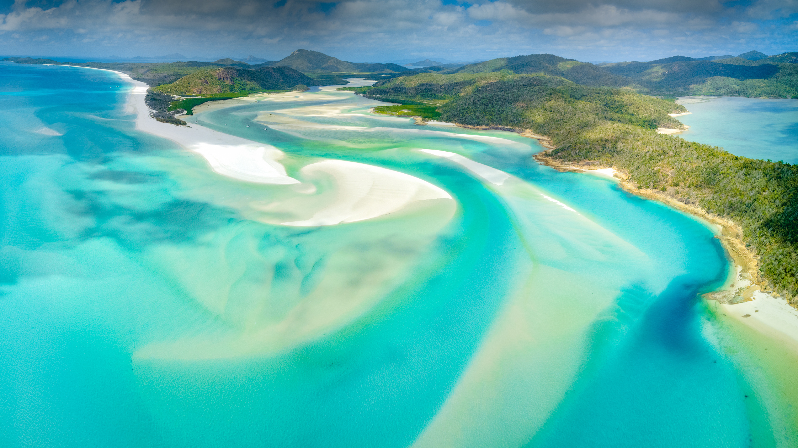 [白天堂海滩，圣灵群岛，昆士兰州，澳大利亚 (© Coral Brunner/Shutterstock)](https://cn.bing.combing_2023-10-03_OHR.WhitsundaySwirl_ZH-CN9085371328_UHD.jpg) 2023-10-03|
 |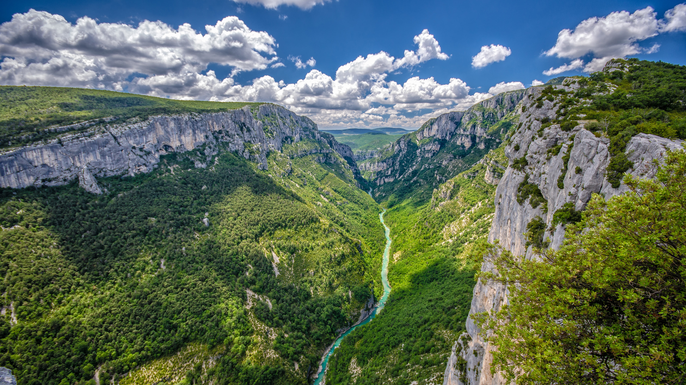 [韦尔东峡谷，普罗旺斯-阿尔卑斯-蓝色海岸，法国 (© luisapuccini/Getty Images)](https://cn.bing.combing_2023-10-02_OHR.VerdonCanyon_ZH-CN8872507857_UHD.jpg) 2023-10-02 | [雄伟壮丽的中国长城 (© Jeff_Hu/Getty Images)](https://cn.bing.combing_2023-10-01_OHR.NationalDay2023_ZH-CN8608297006_UHD.jpg) 2023-10-01|

### 2023-09

|     |    |
| ---- | ---- |
 |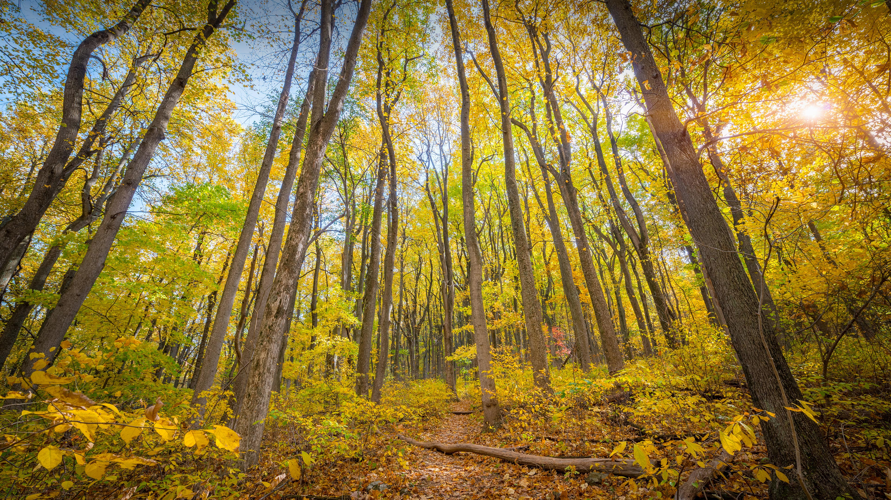 [仙纳度国家公园的秋色，弗吉尼亚州 (© Michael Ver Sprill/Getty Images)](https://cn.bing.combing_2023-09-30_OHR.ShenandoahFoliage_ZH-CN9885452713_UHD.jpg) 2023-09-30 | [满月下的甲秀楼，中国贵州省贵阳市 (© Wang Yukun/Getty Images)](https://cn.bing.combing_2023-09-29_OHR.GuiyangMoon_ZH-CN7497119092_UHD.jpg) 2023-09-29|
 | [泰国商业港口附近的集装箱船 (© Suriyapong Thongsawang/Getty Images)](https://cn.bing.combing_2023-09-28_OHR.MaritimeDay_ZH-CN7073219075_UHD.jpg) 2023-09-28 |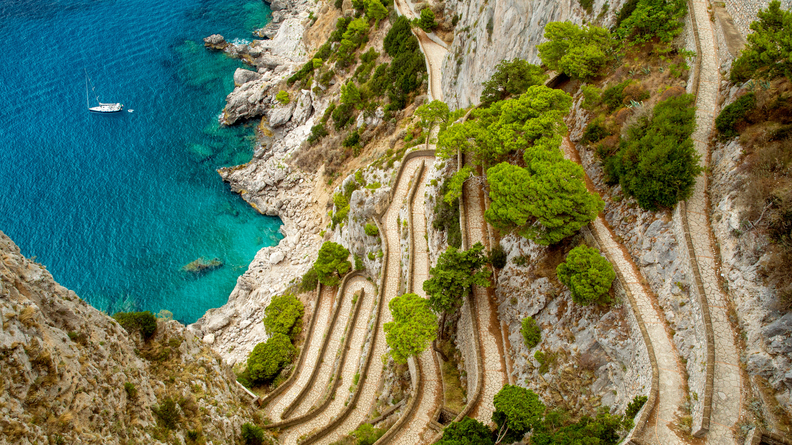 [克虏伯路，卡普里岛，意大利 (© Mikolaj Niemczewski/Shutterstock)](https://cn.bing.combing_2023-09-27_OHR.CapriKrupp_ZH-CN6893334288_UHD.jpg) 2023-09-27|
 | [日落时的威尼斯海滩滑板公园，洛杉矶，加利福尼亚州 (© EXTREME-PHOTOGRAPHER/Getty Images)](https://cn.bing.combing_2023-09-26_OHR.VeniceSkatePark_ZH-CN6295228801_UHD.jpg) 2023-09-26 |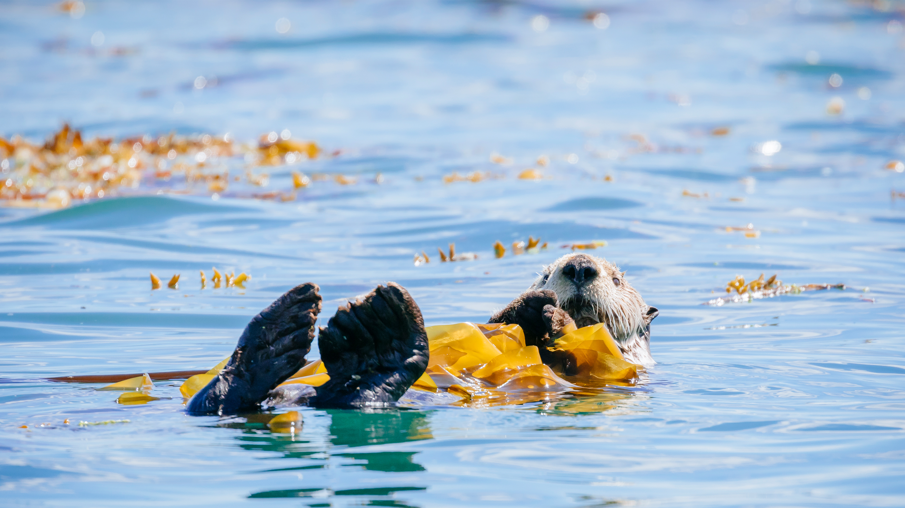 [巴特利特湾的海獭，冰川湾国家公园，阿拉斯加州 (© Andrew Peacock/Tandem Stills + Motion)](https://cn.bing.combing_2023-09-25_OHR.GlacierBayOtter_ZH-CN6065209551_UHD.jpg) 2023-09-25|
 |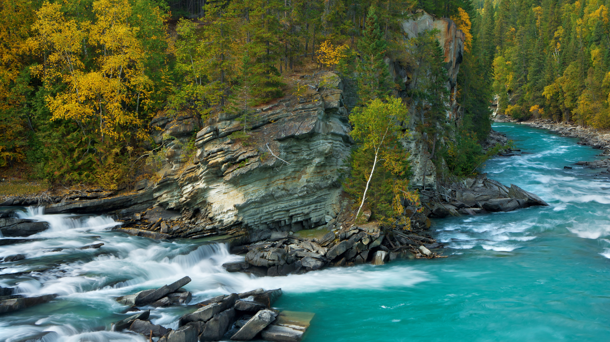 [罗布森山附近的弗雷泽河，大不列颠哥伦比亚省，加拿大 (© phototropic/Getty Images)](https://cn.bing.combing_2023-09-24_OHR.FraserRiverBC_ZH-CN5743867197_UHD.jpg) 2023-09-24 |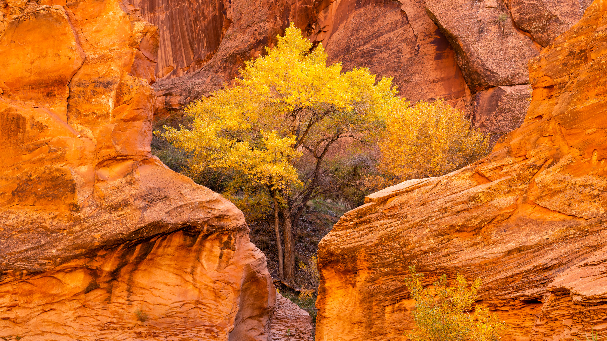 [郊狼谷的棉白杨和红砂岩，格兰峡谷国家保护区，犹他州 (© Stephen Matera/Tandem Stills + Motion)](https://cn.bing.combing_2023-09-23_OHR.CottonwoodCanyon_ZH-CN5293620973_UHD.jpg) 2023-09-23|
 |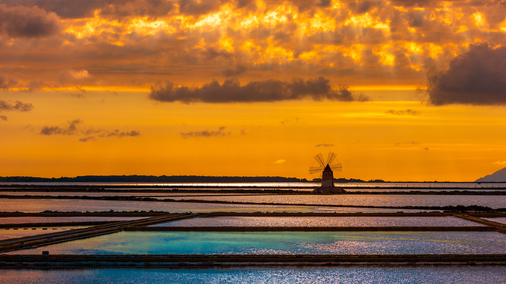 [马尔萨拉盐田，意大利 (© javarman3/Getty Images)](https://cn.bing.combing_2023-09-22_OHR.MarsalaSalt_ZH-CN4943158328_UHD.jpg) 2023-09-22 | [诺贝尔和平中心内部，奥斯陆，挪威 (© Ilyas Ayub/Alamy)](https://cn.bing.combing_2023-09-21_OHR.NobelNorway_ZH-CN9824054026_UHD.jpg) 2023-09-21|
 |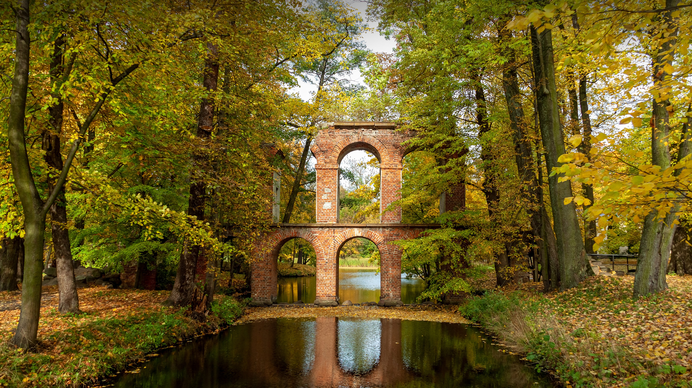 [罗马风格的渡槽，阿卡迪亚公园，波兰 (© PATSTOCK/Getty Images)](https://cn.bing.combing_2023-09-20_OHR.ArkadiaPark_ZH-CN9501056317_UHD.jpg) 2023-09-20 | [哈德良长城，诺森伯兰郡国家公园，英国 (© daverhead/Getty Images)](https://cn.bing.combing_2023-09-19_OHR.HadriansWallUK_ZH-CN9203571422_UHD.jpg) 2023-09-19|
 |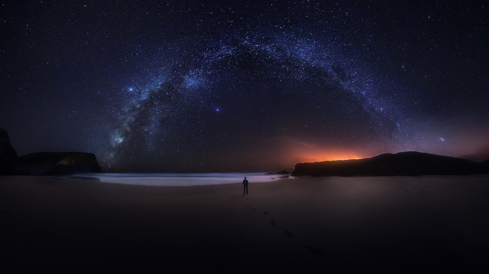 [西南阿连特茹和维森廷海岸自然公园上空的银河，葡萄牙 (© Daniel Garrido/Getty Images)](https://cn.bing.combing_2023-09-18_OHR.MilkyWayPortugal_ZH-CN8878883229_UHD.jpg) 2023-09-18 | [杂色短尾鴗，阿里杰罗德胡波尔德国家公园，古巴 (© Bruno D'Amicis/Minden Pictures)](https://cn.bing.combing_2023-09-17_OHR.CubanTody_ZH-CN8656368705_UHD.jpg) 2023-09-17|
 |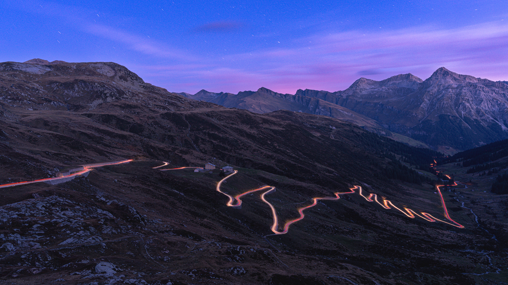 [施布吕根山口，格劳宾登州，瑞士 (© Roberto Moiola/Getty Images)](https://cn.bing.combing_2023-09-16_OHR.SplugenPass_ZH-CN8347591461_UHD.jpg) 2023-09-16 |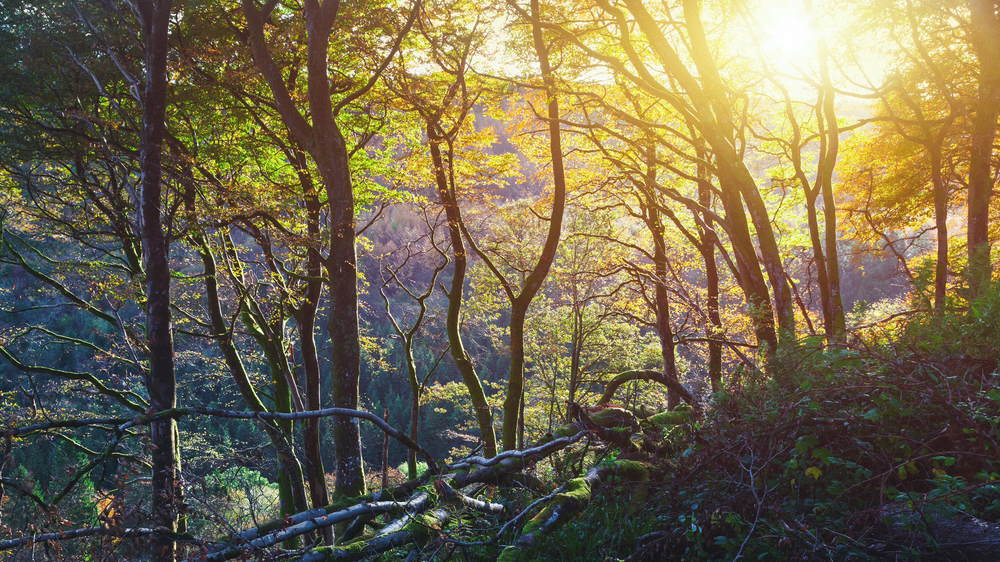 [格莱纳里夫森林公园的日落，安特里姆郡，爱尔兰 (© Peter Zelei/Getty Images)](https://cn.bing.combing_2023-09-15_OHR.GlenariffForest_ZH-CN7874768337_UHD.jpg) 2023-09-15|
 |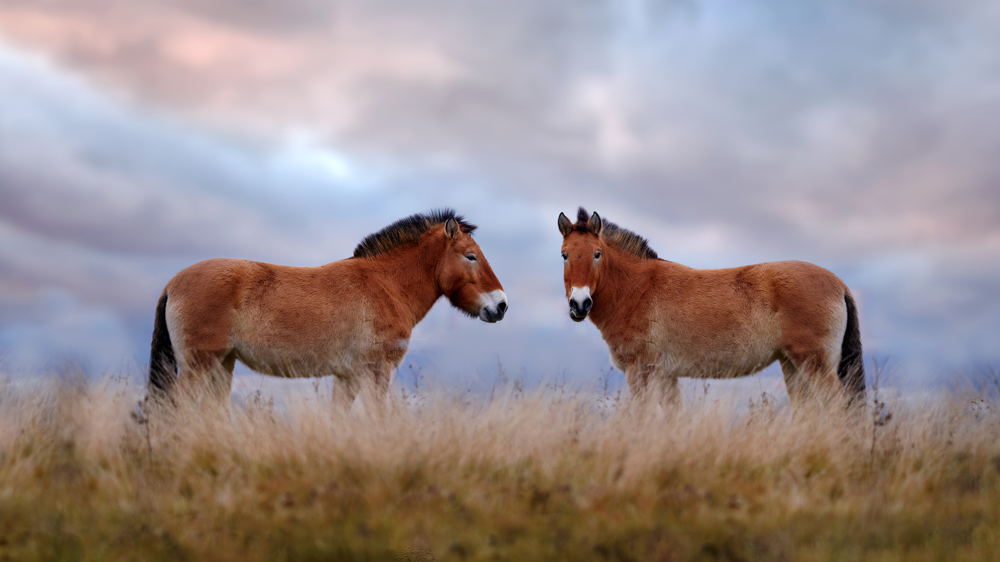 [普氏野马，哈斯台国家公园，蒙古国 (© Ondrej Prosicky/Shutterstock)](https://cn.bing.combing_2023-09-14_OHR.MongoliaHorses_ZH-CN7660582867_UHD.jpg) 2023-09-14 |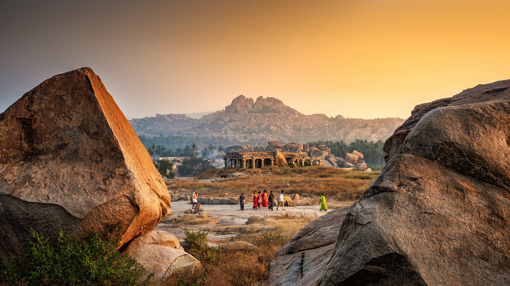 [赫马库塔山上的神庙，汉皮，卡纳塔克邦，印度 (© Images of india/Alamy Stock Photo)](https://cn.bing.combing_2023-09-13_OHR.HemakutaHill_ZH-CN7438439036_UHD.jpg) 2023-09-13|
 | [北海日落，诺德多夫，德国 (© Frederick Doerschem/Getty Images)](https://cn.bing.combing_2023-09-12_OHR.NorthSeaStairs_ZH-CN7044471948_UHD.jpg) 2023-09-12 |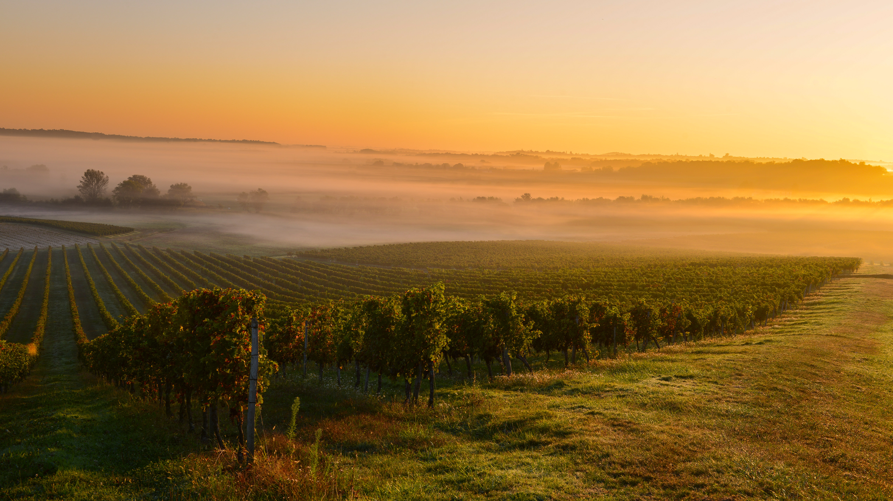 [波尔多葡萄园的日出，法国 (© Esperanza33/Getty Images)](https://cn.bing.combing_2023-09-11_OHR.MarathonMedoc_ZH-CN6649798028_UHD.jpg) 2023-09-11|
 |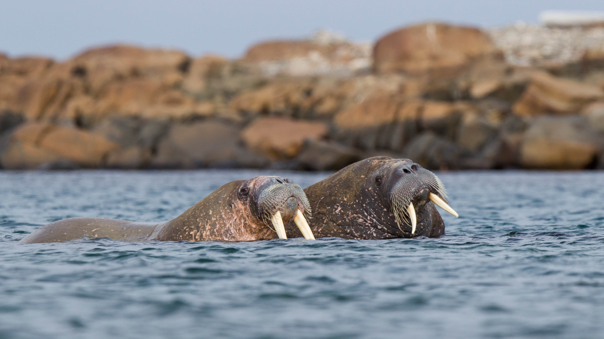 [斯瓦尔巴群岛海上的一对海象，挪威 (© Mark Smith/Getty Images)](https://cn.bing.combing_2023-09-10_OHR.WalrusSvalbard_ZH-CN6343458320_UHD.jpg) 2023-09-10 | [大城府历史公园的柴瓦塔那兰寺，泰国 (© Weerasak Saeku/Getty Images)](https://cn.bing.combing_2023-09-09_OHR.AyutthayaTemple_ZH-CN5996587937_UHD.jpg) 2023-09-09|
 |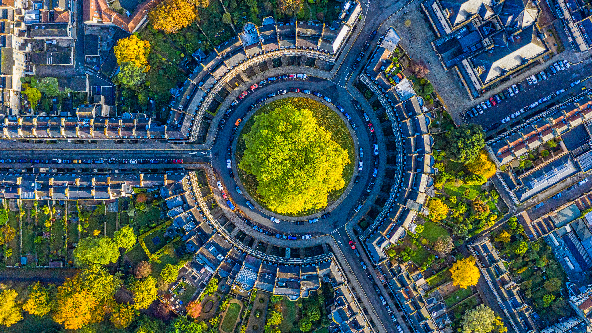 [巴斯圆形广场，萨默塞特 ，英国 (© Gavin Hellier/Getty Images)](https://cn.bing.combing_2023-09-08_OHR.BathCircus_ZH-CN5796600786_UHD.jpg) 2023-09-08 |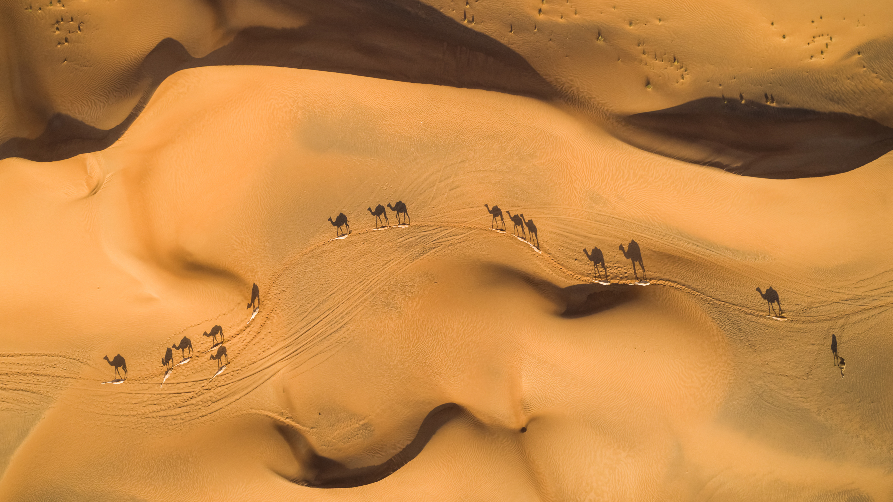 [沙漠中的骆驼，阿拉伯联合酋长国 (© Amazing Aerial Premium/Shutterstock)](https://cn.bing.combing_2023-09-07_OHR.CamelsAbove_ZH-CN1389810021_UHD.jpg) 2023-09-07|
 | [威尼斯旧港，克里特岛，希腊 (© Gatsi/Getty Images)](https://cn.bing.combing_2023-09-06_OHR.CreteHarbor_ZH-CN0937533372_UHD.jpg) 2023-09-06 |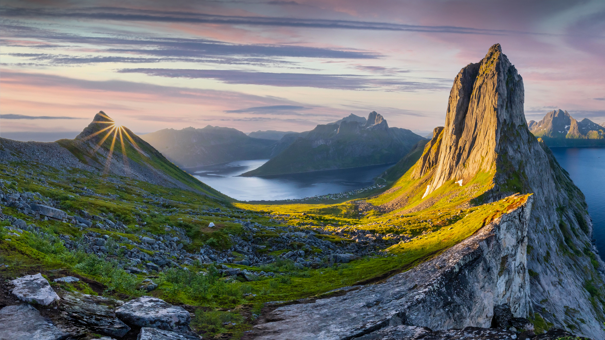 [塞格拉山，塞尼亚岛，挪威 (© imageBROKER/Moritz Wolf/Getty Images)](https://cn.bing.combing_2023-09-05_OHR.MountSegla_ZH-CN0758615745_UHD.jpg) 2023-09-05|
 |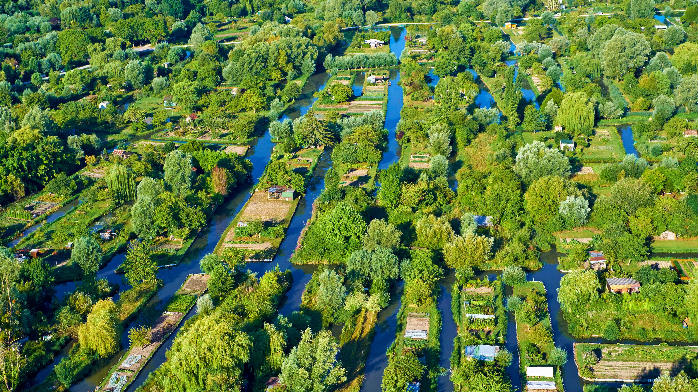 [布尔日的沼泽，法国 (© Tuul & Bruno Morandi/Getty Images)](https://cn.bing.combing_2023-09-04_OHR.BourgesMarsh_ZH-CN0505354655_UHD.jpg) 2023-09-04 |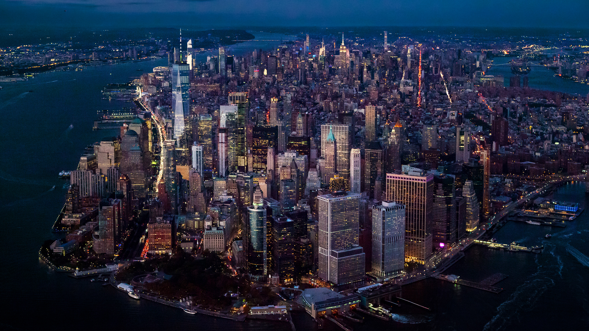 [曼哈顿鸟瞰图，纽约市，美国 (© Wojtek Zagorski/Getty Images)](https://cn.bing.combing_2023-09-03_OHR.ManhattanAerial_ZH-CN0036686873_UHD.jpg) 2023-09-03|
 |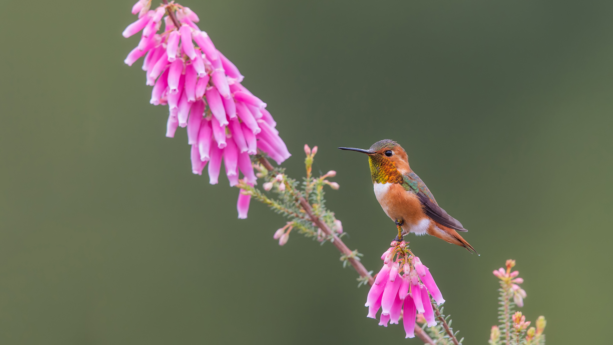 [艾氏煌蜂鸟，圣克鲁斯，加利福尼亚州，美国 (© mallardg500/Getty Images)](https://cn.bing.combing_2023-09-02_OHR.TinyHummer_ZH-CN9853929957_UHD.jpg) 2023-09-02 |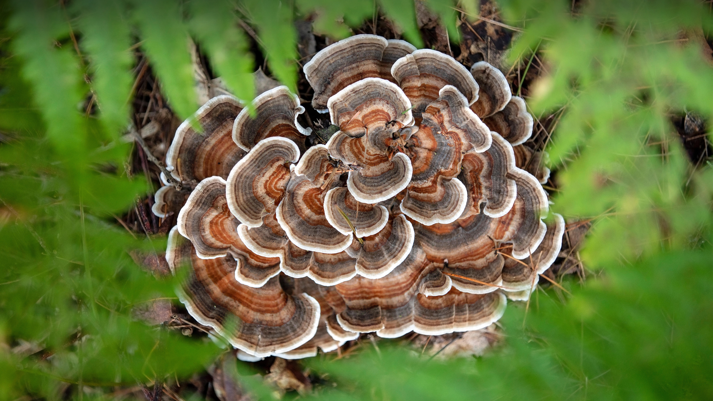 [火鸡尾蘑菇，布里瓦德，北卡罗来纳州，美国 (© Bill Gozansky/Alamy Stock Photo)](https://cn.bing.combing_2023-09-01_OHR.TurkeyTailMush_ZH-CN9683744281_UHD.jpg) 2023-09-01|

### 2023-08

|     |    |
| ---- | ---- |
 |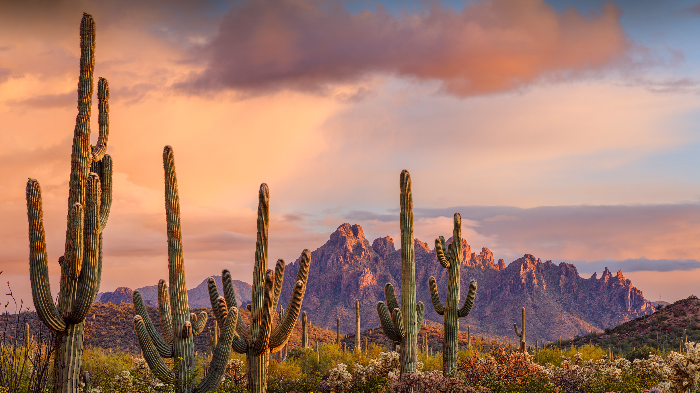 [巨人柱，铁木森林国家纪念地，亚利桑那州，美国 (© Jack Dykinga/Minden Pictures)](https://cn.bing.combing_2023-08-31_OHR.IronwoodCactus_ZH-CN9290037977_UHD.jpg) 2023-08-31 |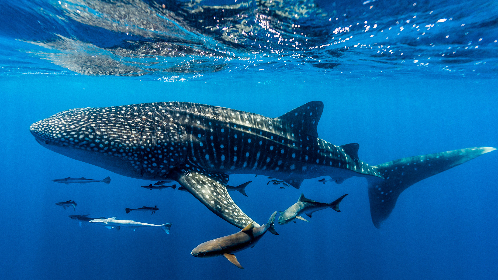 [鲸鲨，宁加洛珊瑚礁，西澳大利亚 (© Jason Edwards/Getty Images)](https://cn.bing.combing_2023-08-30_OHR.NingalooShark_ZH-CN9014712175_UHD.jpg) 2023-08-30|
 |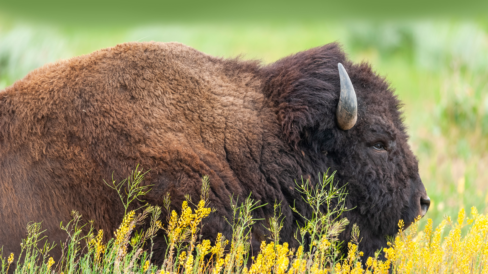 [美洲野牛，大提顿国家公园，怀俄明州 (© Enrique Aguirre Aves/Getty Images)](https://cn.bing.combing_2023-08-29_OHR.TetonBison_ZH-CN9384306649_UHD.jpg) 2023-08-29 | [洛夫里耶纳克堡，西港，杜布罗夫尼克，克罗地亚 (© Benny Marty/Shutterstock)](https://cn.bing.combing_2023-08-28_OHR.DubrovnikHarbor_ZH-CN8590217905_UHD.jpg) 2023-08-28|
 |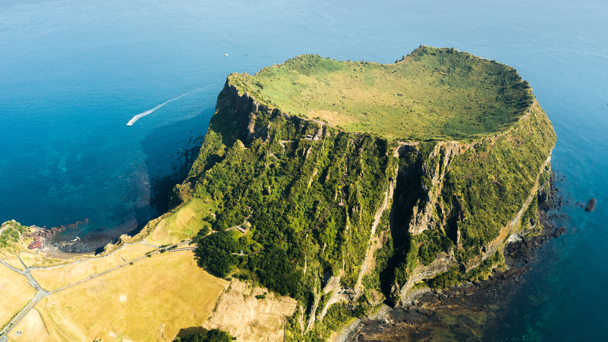 [城山日出峰，济州岛上的凝灰岩锥，韩国 (© Quynh Anh Nguyen/Getty Images)](https://cn.bing.combing_2023-08-27_OHR.JejuIsland_ZH-CN8434910851_UHD.jpg) 2023-08-27 | [柏林大教堂和博物馆岛，柏林，德国 (© Rudy Balasko/Shutterstock)](https://cn.bing.combing_2023-08-26_OHR.MuseumIsland_ZH-CN8277258964_UHD.jpg) 2023-08-26|
 |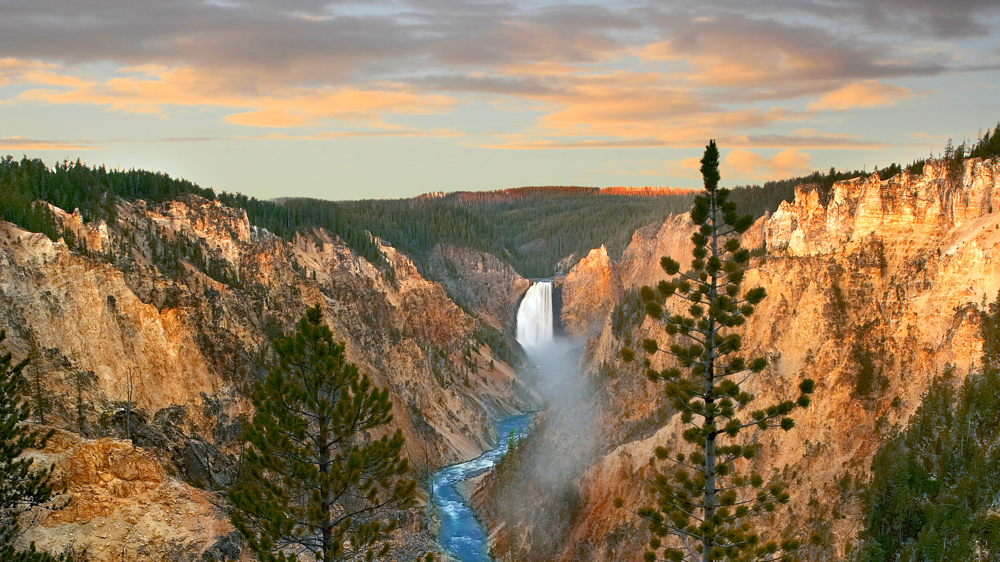 [黄石下瀑布，黄石国家公园，怀俄明州，美国 (© Tim Fitzharris/Minden Pictures)](https://cn.bing.combing_2023-08-25_OHR.YellowstoneFalls_ZH-CN8050562150_UHD.jpg) 2023-08-25 |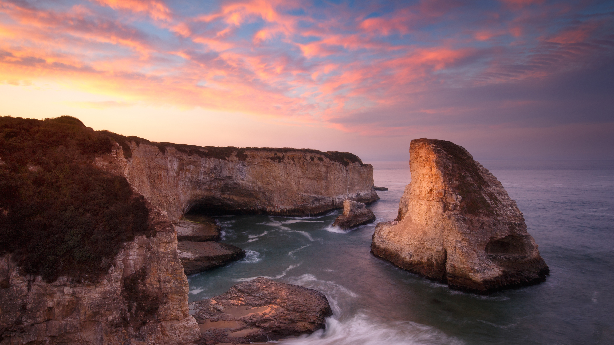 [鲨鱼鳍湾，达文波特，加利福尼亚州，美国 (© Jeff Lewis/Tandem Stills + Motion)](https://cn.bing.combing_2023-08-24_OHR.SharkFinCove_ZH-CN4952934195_UHD.jpg) 2023-08-24|
 |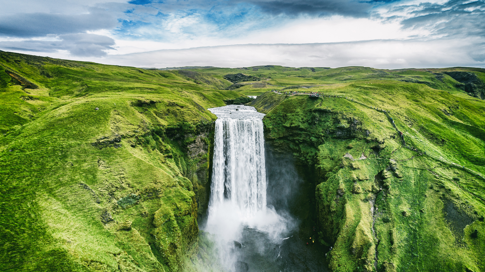 [斯科加瀑布，冰岛 (© Maridav/Shutterstock)](https://cn.bing.combing_2023-08-23_OHR.SkogafossWaterfall_ZH-CN4763253095_UHD.jpg) 2023-08-23 | [埃尔杰姆露天剧场，突尼斯 (© Westend61/Getty Images)](https://cn.bing.combing_2023-08-22_OHR.TunisiaAmphitheatre_ZH-CN4431856872_UHD.jpg) 2023-08-22|
 |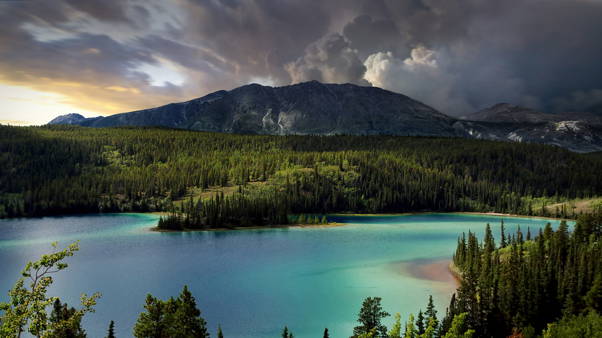 [翡翠湖，加拿大育空地区 (© artherng/Getty Images)](https://cn.bing.combing_2023-08-21_OHR.EmeraldLakeYukon_ZH-CN4281156537_UHD.jpg) 2023-08-21 | [起点灯塔，德文郡，英国 (© Guy Edwardes/Minden Pictures)](https://cn.bing.combing_2023-08-20_OHR.StartPointLight_ZH-CN4021540566_UHD.jpg) 2023-08-20|
 | [看着相机镜头的松鼠 (© Alfredo Piedrafita/Getty Images)](https://cn.bing.combing_2023-08-19_OHR.CameraSquirrel_ZH-CN3580119980_UHD.jpg) 2023-08-19 |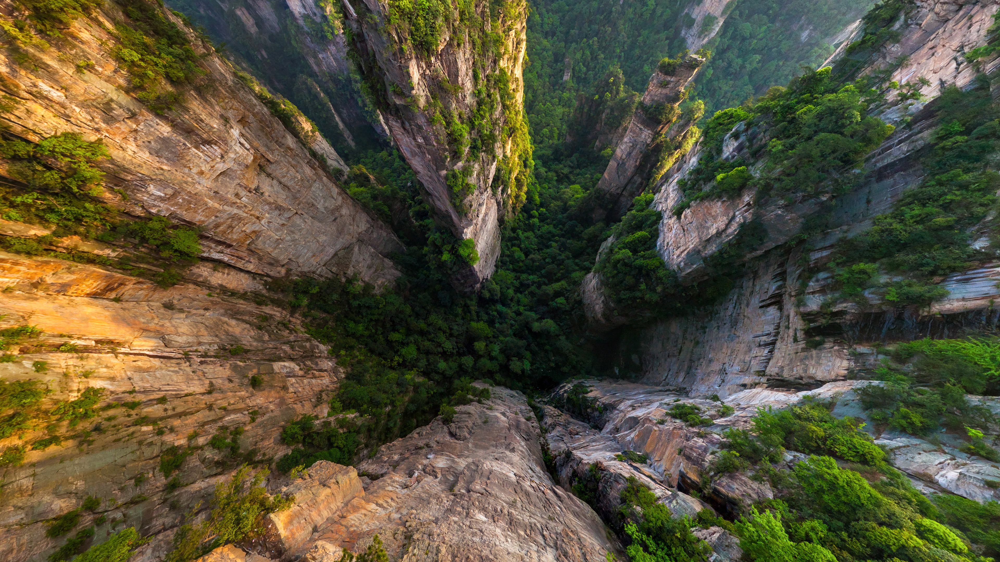 [哈利路亚山，张家界国家森林公园，中国 (© Amazing Aerial Premium/Shutterstock)](https://cn.bing.combing_2023-08-18_OHR.AvatarMountain_ZH-CN3268610045_UHD.jpg) 2023-08-18|
 | [罕肯瀑布,威尔斯格雷省立公园, 加拿大不列颠哥伦比亚省 (© Laurens Verhoeven/Getty Images)](https://cn.bing.combing_2023-08-17_OHR.HelmckenWaterfall_ZH-CN9694510761_UHD.jpg) 2023-08-17 | [基韦斯特的七英里大桥，佛罗里达州，美国 (© Evgeny Vasenev/Cavan Images)](https://cn.bing.combing_2023-08-16_OHR.KeyWestBridge_ZH-CN2540450067_UHD.jpg) 2023-08-16|
 |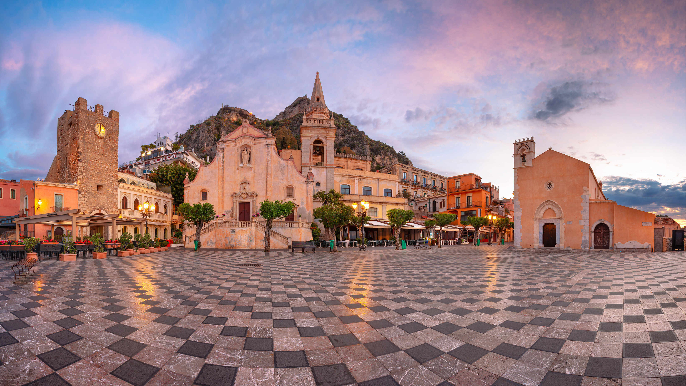 [四月九日广场，陶尔米纳，西西里岛，意大利 (© rudi1976/Alamy)](https://cn.bing.combing_2023-08-15_OHR.TaorminaSquare_ZH-CN0273325652_UHD.jpg) 2023-08-15 | [叶片上的小壁虎 (© Darren Greenwood/Alamy)](https://cn.bing.combing_2023-08-14_OHR.GeckoLeaf_ZH-CN9908456174_UHD.jpg) 2023-08-14|
 |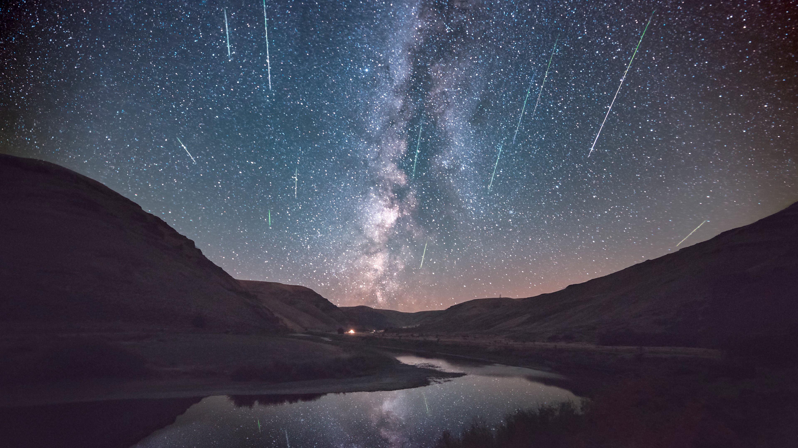 [英仙座流星雨，白杨木峡谷州立公园，俄勒冈州，美国 (© Joshua Meador/Tandem Stills + Motion)](https://cn.bing.combing_2023-08-13_OHR.PerseidsOregon_ZH-CN9427980491_UHD.jpg) 2023-08-13 |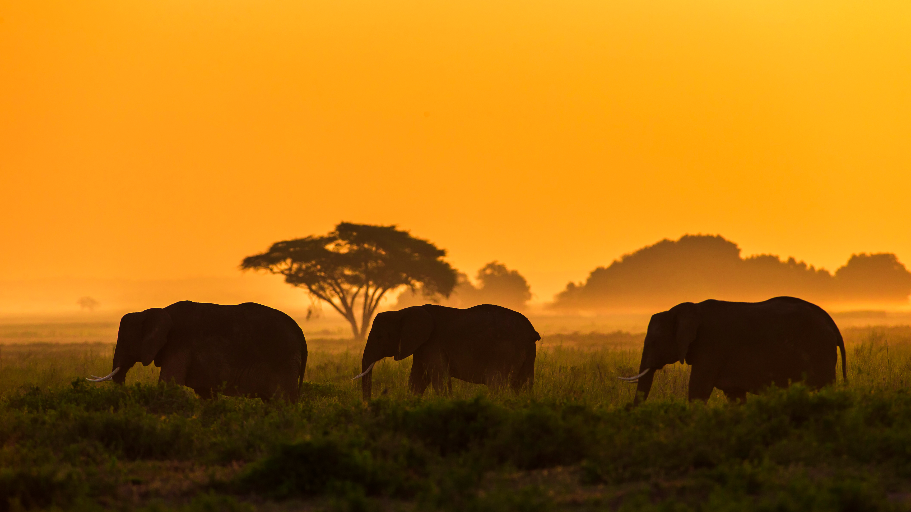 [大象家族，安波塞利国家公园，肯尼亚 (© Ibrahim Suha Derbent/Getty Images)](https://cn.bing.combing_2023-08-12_OHR.ThreeElephants_ZH-CN8708711085_UHD.jpg) 2023-08-12|
 |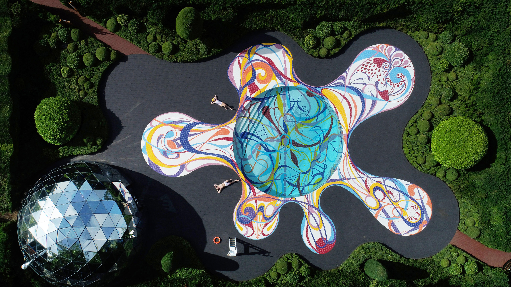 ['朱庇特艺术园的“入口”水池，爱丁堡，苏格兰 (© Owen Humphreys/PA Images/Alamy)](https://cn.bing.combing_2023-08-11_OHR.JupiterArtland_ZH-CN7955790073_UHD.jpg) 2023-08-11 |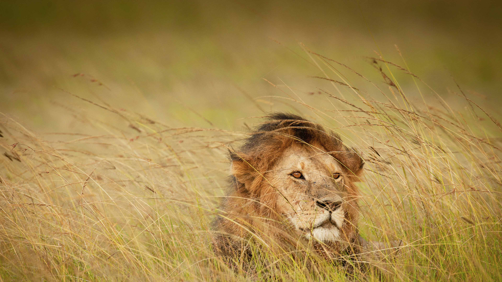 [马赛马拉的一头狮子，肯尼亚 (© Federico Veronesi/Minden Pictures)](https://cn.bing.combing_2023-08-10_OHR.WorldLionDay_ZH-CN0525835107_UHD.jpg) 2023-08-10|
 |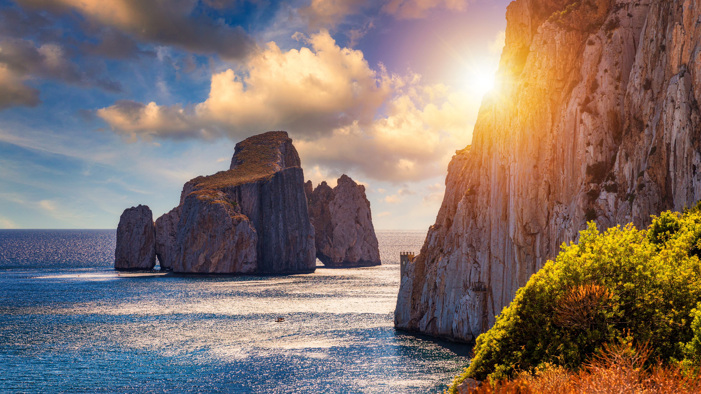 [马苏阿的甜面包海蚀柱，撒丁岛，意大利 (© DaLiu/Getty Images)](https://cn.bing.combing_2023-08-09_OHR.PandiZucchero_ZH-CN9833521922_UHD.jpg) 2023-08-09 | [五花海，阿坝九寨沟旅游景区，四川省，中国 (© Michael Ver Sprill/Getty Images)](https://cn.bing.combing_2023-08-08_OHR.LiQiu2023_ZH-CN9197909278_UHD.jpg) 2023-08-08|
 |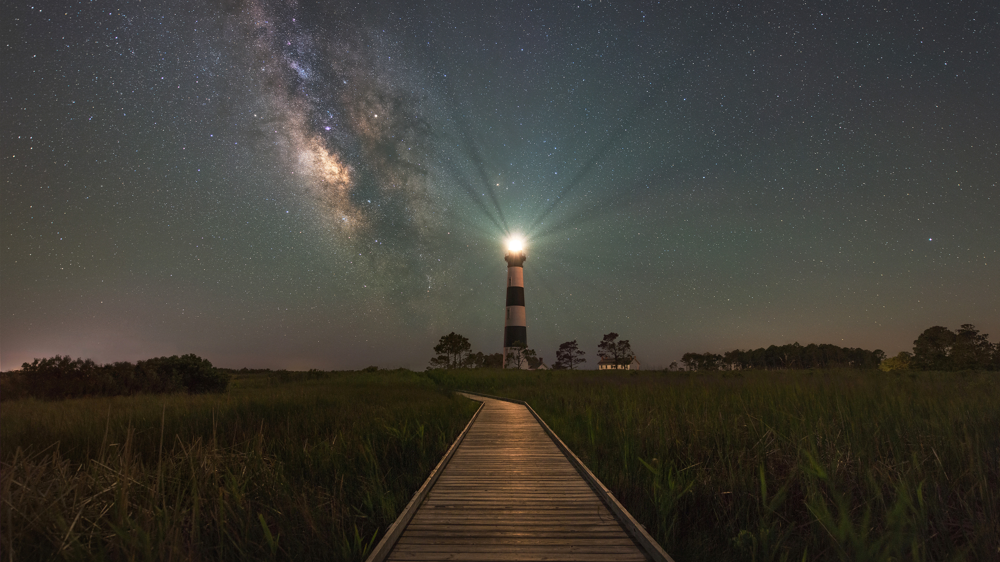 [博迪岛灯塔，马头城，北卡罗来纳州，美国 (© Michael Ver Sprill/Getty Images)](https://cn.bing.combing_2023-08-07_OHR.BodieNC_ZH-CN9027999004_UHD.jpg) 2023-08-07 |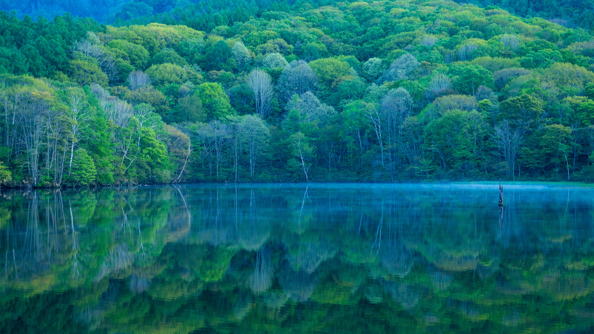 [镜池，长野，日本 (© Shoji Fujita/Getty Images)](https://cn.bing.combing_2023-08-06_OHR.NaganoPond_ZH-CN8794832798_UHD.jpg) 2023-08-06|
 |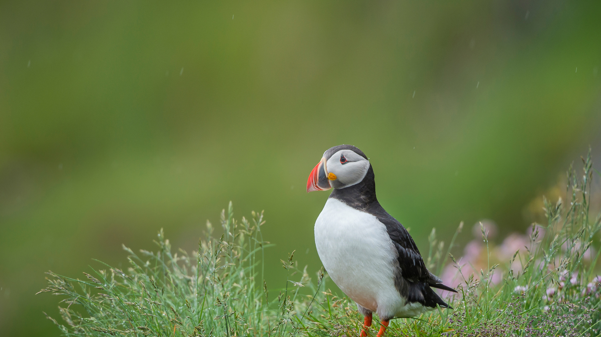 [大西洋海鹦，冰岛 (© Peter Hering/Minden Pictures)](https://cn.bing.combing_2023-08-05_OHR.AtlanticPuffin_ZH-CN8523220989_UHD.jpg) 2023-08-05 | [廷特恩修道院，威尔士 (© matthibcn/Getty Images)](https://cn.bing.combing_2023-08-04_OHR.GothicRuins_ZH-CN8317467997_UHD.jpg) 2023-08-04|
 |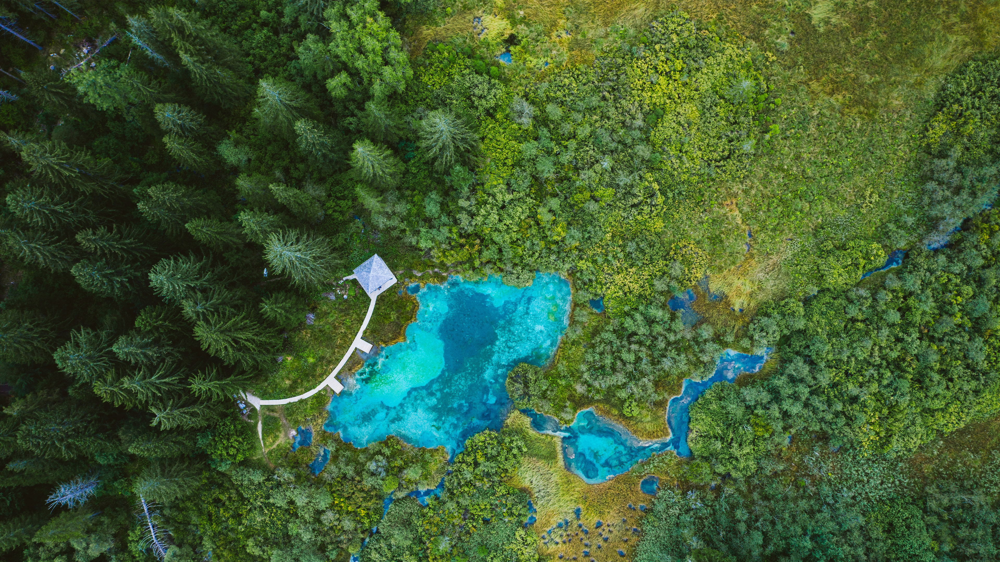 [泽伦西自然保护区，斯洛文尼亚 (© Andrey Danilovich/Getty Images)](https://cn.bing.combing_2023-08-03_OHR.ZelenciSprings_ZH-CN8022746409_UHD.jpg) 2023-08-03 |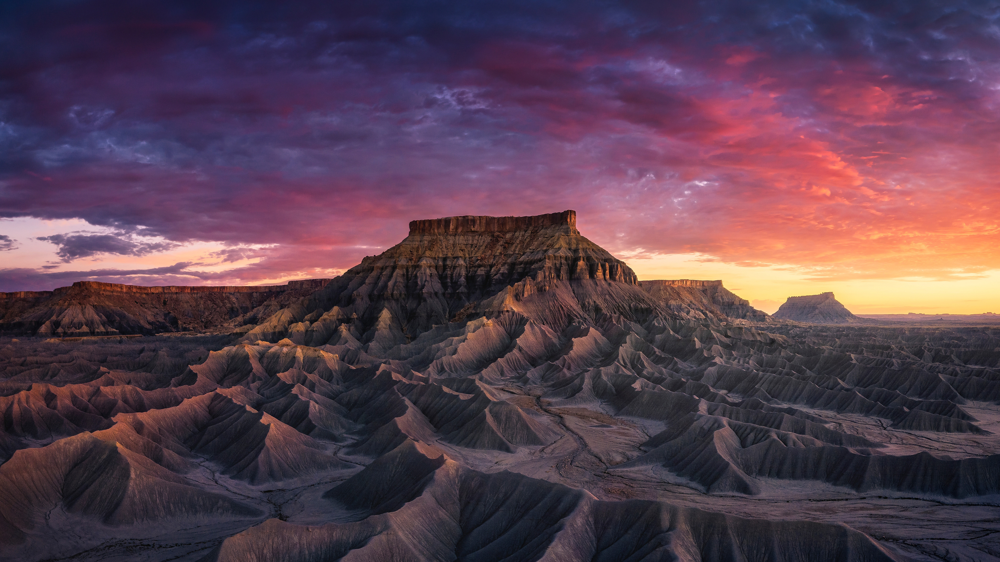 [圆顶礁国家公园的砂岩山丘，犹他州，美国 (© Amazing Aerial Premium/Shutterstock)](https://cn.bing.combing_2023-08-02_OHR.CapitolButte_ZH-CN7707972988_UHD.jpg) 2023-08-02|
 | [从德纳里山看福克拉山，德纳里国家公园，美国阿拉斯加州 (© Andrew Peacock/Tandem Stills + Motion)](https://cn.bing.combing_2023-08-01_OHR.DenaliClimber_ZH-CN7548168932_UHD.jpg) 2023-08-01|
### 2023-07

|     |    |
| ---- | ---- |
 |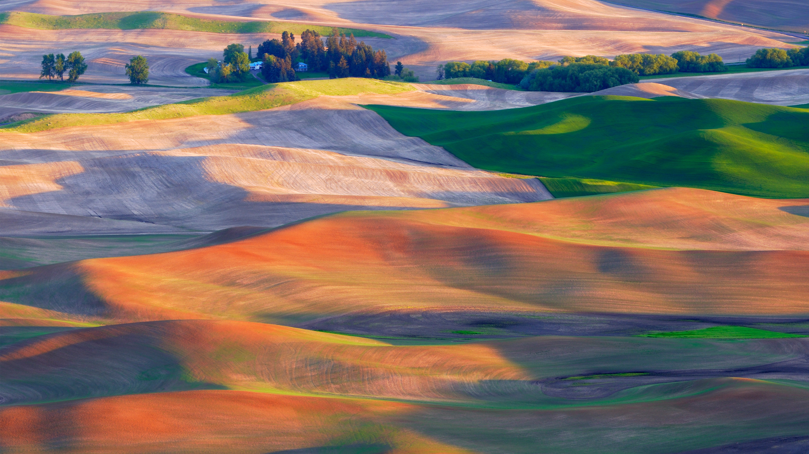 [帕卢斯的农田，华盛顿州，美国 (© EJ-J/Getty Images)](https://cn.bing.combing_2023-07-30_OHR.PalouseHills_ZH-CN6864015897_UHD.jpg) 2023-07-30|
 | [孟加拉虎，兰坦波尔国家公园，印度 (© Andy Rouse/Minden Pictures)](https://cn.bing.combing_2023-07-29_OHR.TigerIndia_ZH-CN6657629375_UHD.jpg) 2023-07-29 |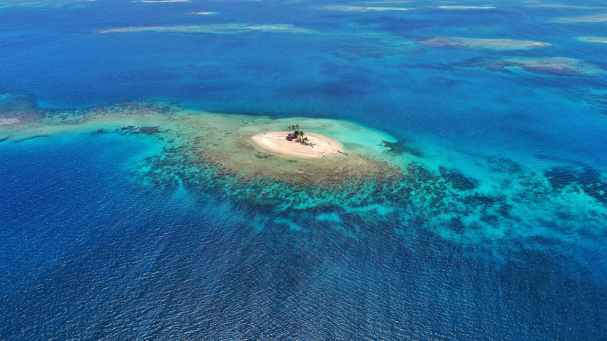 [圣布拉斯群岛，巴拿马 (© bgremler/Shutterstock)](https://cn.bing.combing_2023-07-28_OHR.SanBlasIslands_ZH-CN6320572106_UHD.jpg) 2023-07-28|
 | [卡鲁塞尔凯旋门和卢浮宫金字塔，巴黎，法国 (© Jon Hicks/Getty Images)](https://cn.bing.combing_2023-07-27_OHR.ParisLouvre_ZH-CN0341884841_UHD.jpg) 2023-07-27 |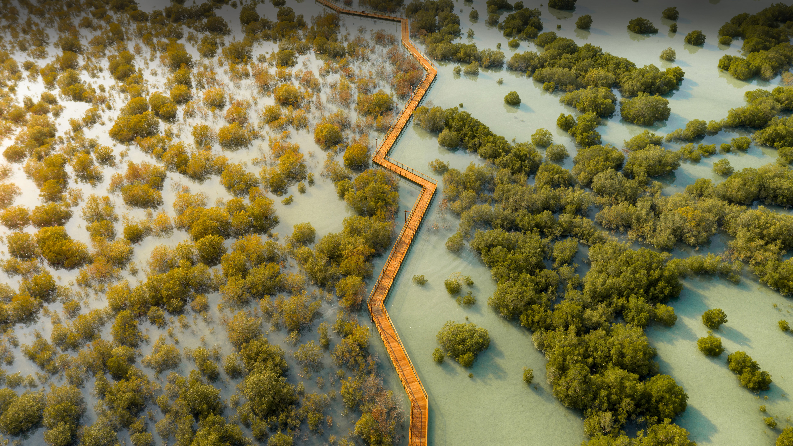 [朱拜勒红树林公园，阿布扎比，阿拉伯联合酋长国 (© Amazing Aerial Premium/Shutterstock)](https://cn.bing.combing_2023-07-26_OHR.MangrovePark_ZH-CN0208518370_UHD.jpg) 2023-07-26|
 | [托雷维耶哈潟湖，阿利坎特，西班牙 (© Juan Maria Coy Vergara/Getty Images)](https://cn.bing.combing_2023-07-25_OHR.LasLagunas_ZH-CN9917702340_UHD.jpg) 2023-07-25 |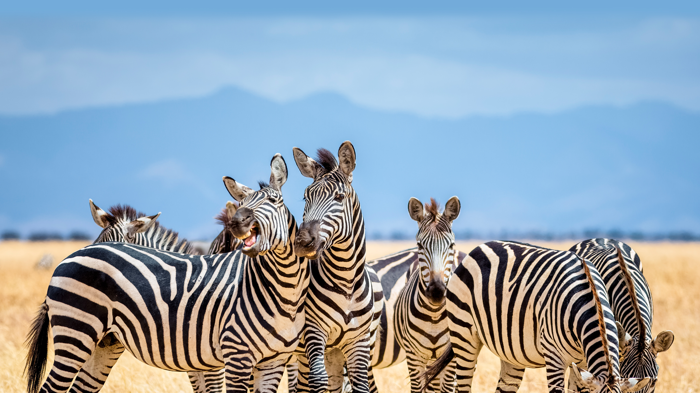 [斑马，塔兰吉雷国家公园，坦桑尼亚 (© cinoby/Getty Images)](https://cn.bing.combing_2023-07-24_OHR.ZebraCousins_ZH-CN8159888859_UHD.jpg) 2023-07-24|
 |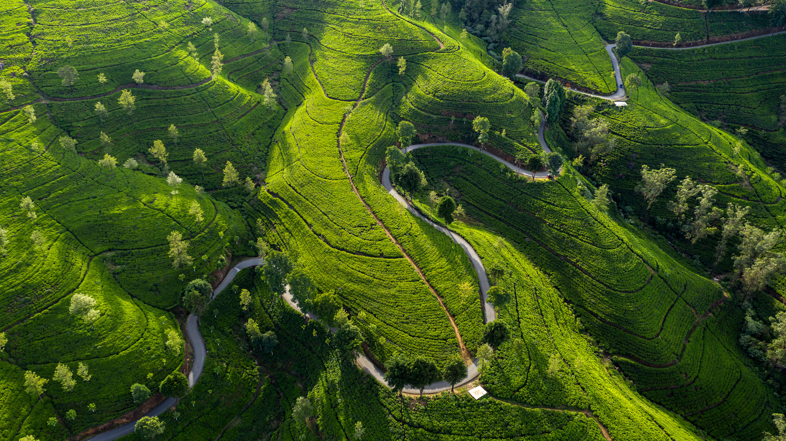 [爱丁堡茶园, 努沃勒埃利耶, 斯里兰卡 (© Jeremy Woodhouse/Getty Images)](https://cn.bing.combing_2023-07-23_OHR.TeaEstate_ZH-CN9645412630_UHD.jpg) 2023-07-23 |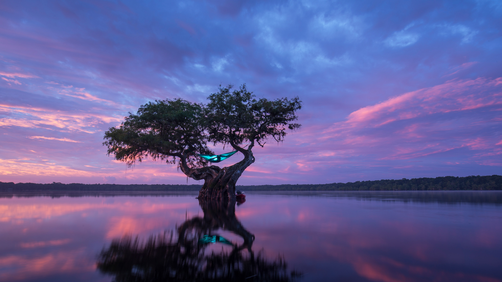 [在一棵秃柏树上吊床露营，佛罗里达州，美国 (© Mac Stone/Tandem Stills + Motion)](https://cn.bing.combing_2023-07-22_OHR.HammockDay_ZH-CN9368760971_UHD.jpg) 2023-07-22|
 |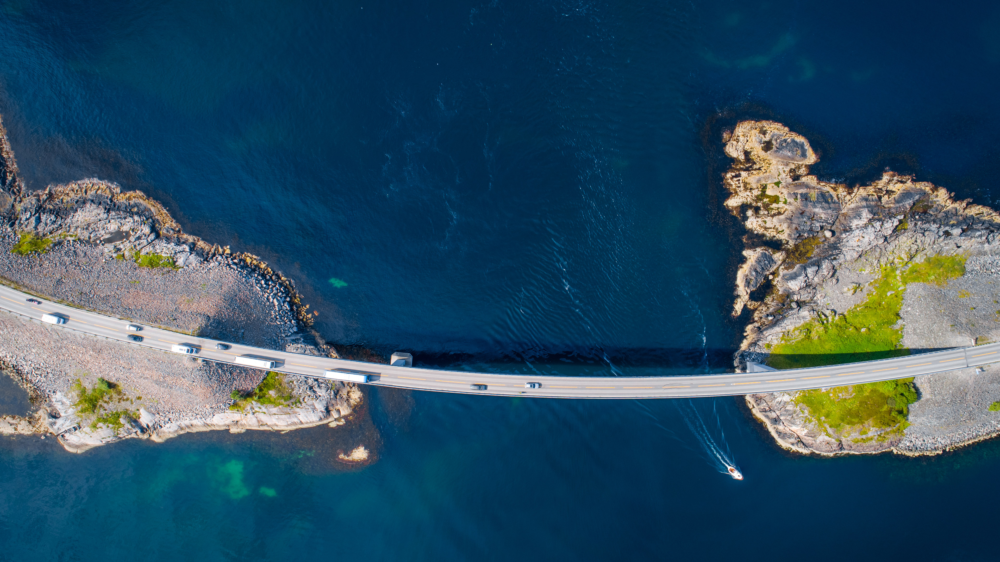 [斯托尔桑德特大桥，挪威 (© Morten Falch Sortland/Getty Images)](https://cn.bing.combing_2023-07-21_OHR.BridgeNorway_ZH-CN9063814637_UHD.jpg) 2023-07-21 |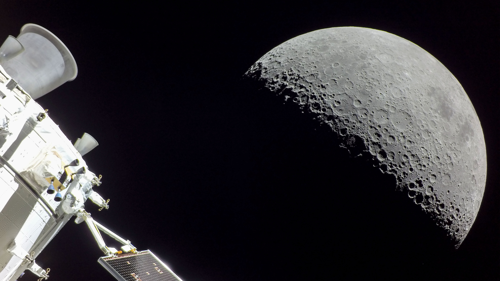 [从美国宇航局猎户座飞船上看到的月球 (© NASA)](https://cn.bing.combing_2023-07-20_OHR.MoonDayArtemis_ZH-CN8743374853_UHD.jpg) 2023-07-20|
 | [敦煌月牙泉，甘肃省，中国 (© R7 Photo/Shutterstock)](https://cn.bing.combing_2023-07-19_OHR.CrescentLake_ZH-CN8294493832_UHD.jpg) 2023-07-19 |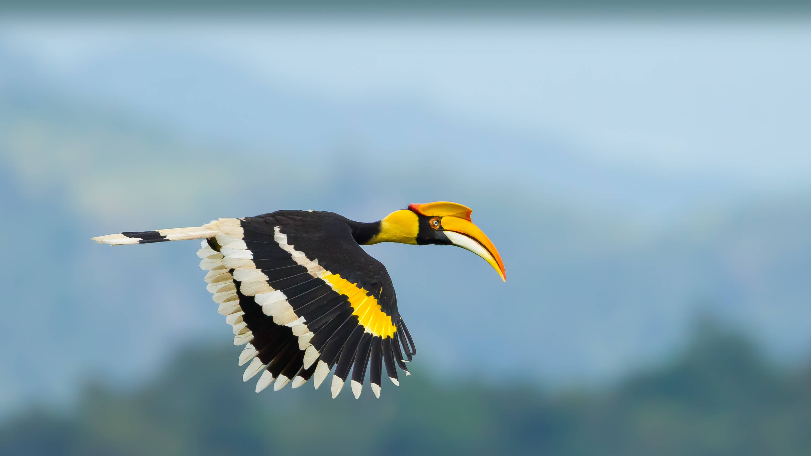 [双角犀鸟，考艾国家公园，泰国 (© kajornyot wildlife photography/Shutterstock)](https://cn.bing.combing_2023-07-18_OHR.BucerosBicornis_ZH-CN7795050230_UHD.jpg) 2023-07-18|
 |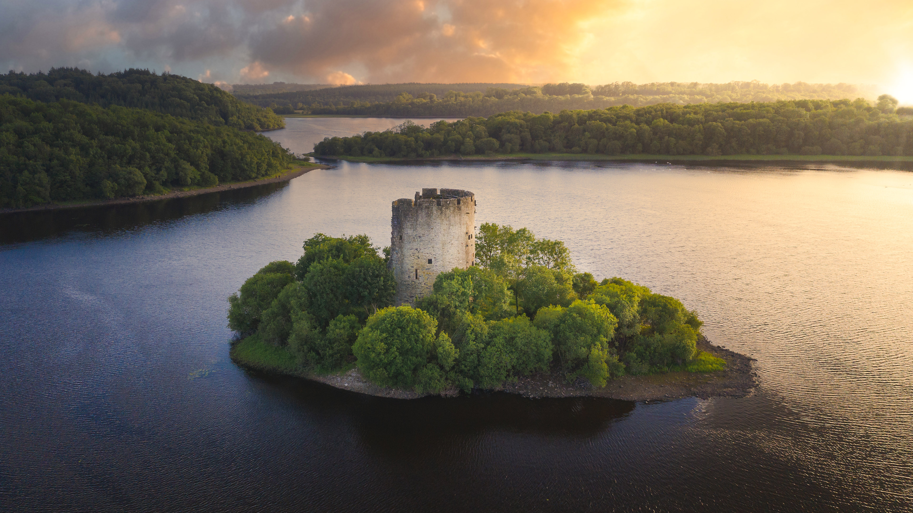 [乌特湖的克拉夫特城堡，卡文郡，爱尔兰 (© 4H4 PH/Shutterstock)](https://cn.bing.combing_2023-07-17_OHR.CavanCastle_ZH-CN7109317900_UHD.jpg) 2023-07-17 |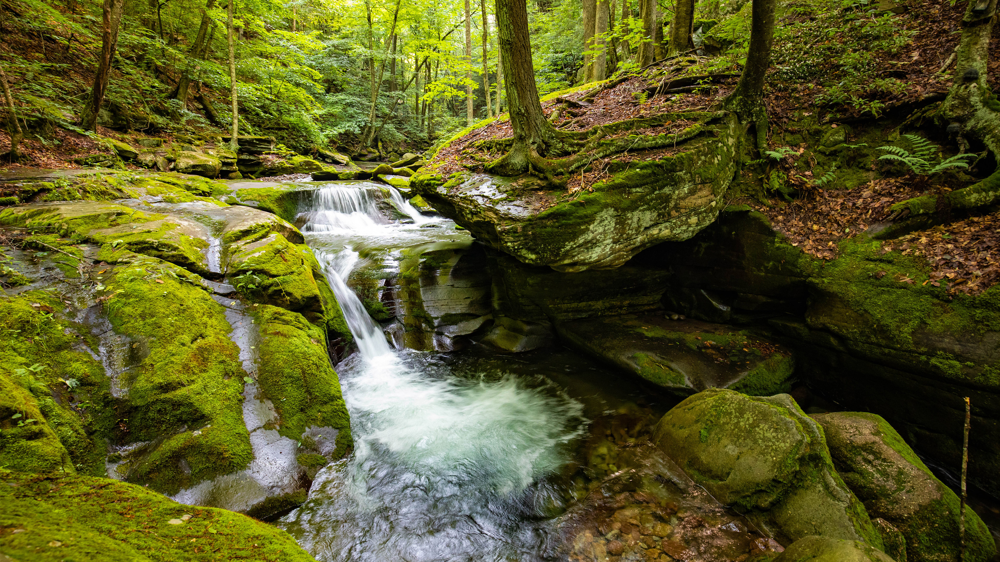 [熊洞溪，卡茨基尔山脉，纽约，美国 (© GummyBone/Getty Images)](https://cn.bing.combing_2023-07-16_OHR.BearHoleBrook_ZH-CN6855885557_UHD.jpg) 2023-07-16|
 |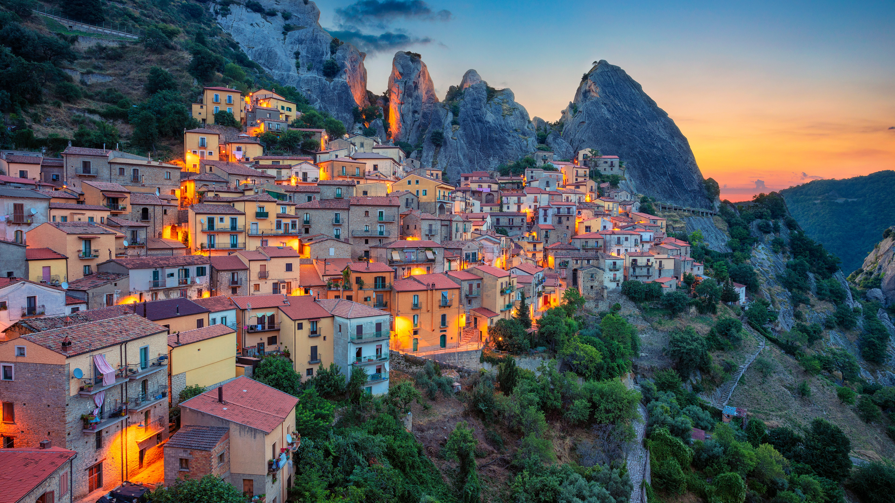 [卡斯泰尔梅扎诺，意大利 (© Rudy Balasko/Shutterstock)](https://cn.bing.combing_2023-07-15_OHR.CastelmazzanoSunrise_ZH-CN6733875019_UHD.jpg) 2023-07-15 |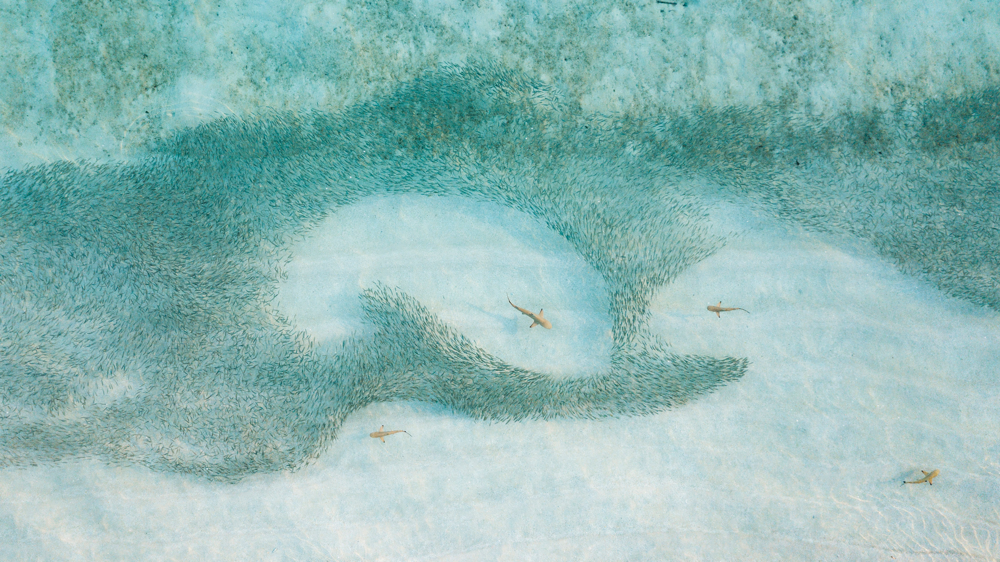 [乌翅真鲨，马尔代夫 (© Filippo Bacci/Getty Images)](https://cn.bing.combing_2023-07-14_OHR.BlacktipSharks_ZH-CN6532659465_UHD.jpg) 2023-07-14|
 |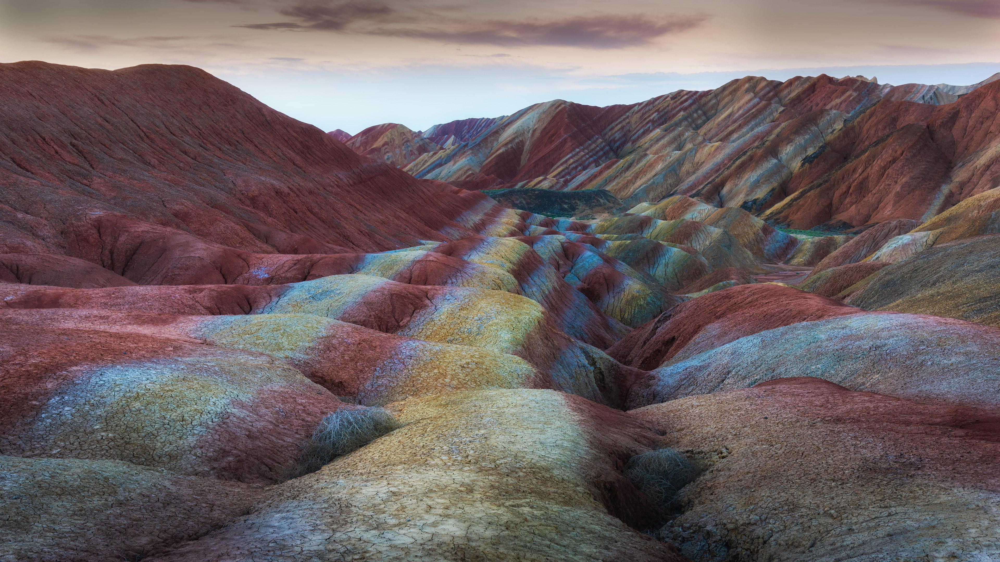 [张掖国家地质公园，甘肃，中国 (© TONNAJA/Getty Images)](https://cn.bing.combing_2023-07-13_OHR.ZhangyeGeopark_ZH-CN1045536243_UHD.jpg) 2023-07-13 | [“我爱你”海滩自然保护区的沙洲，桑给巴尔，坦桑尼亚 (© Lubos Paukeje/Alamy)](https://cn.bing.combing_2023-07-12_OHR.NakupendaBeach_ZH-CN7913805608_UHD.jpg) 2023-07-12|
 | [Hong Kong SAR (© leungchopan/Getty Images)](https://cn.bing.combing_2023-07-11_OHR.WorldPopDay_ZH-CN7074706912_UHD.jpg) 2023-07-11 |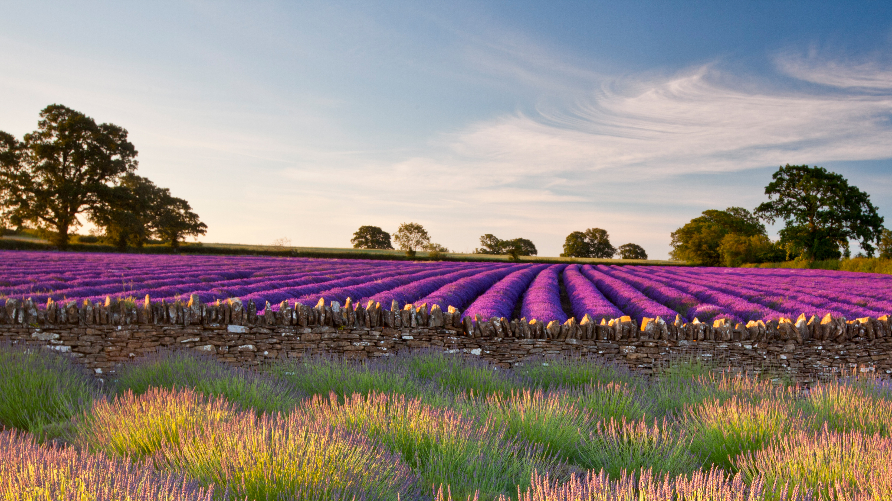 [萨默塞特郡的薰衣草田，英国 (© Doug Chinnery/Getty Images)](https://cn.bing.combing_2023-07-10_OHR.SomersetLavender_ZH-CN5823464763_UHD.jpg) 2023-07-10|
 |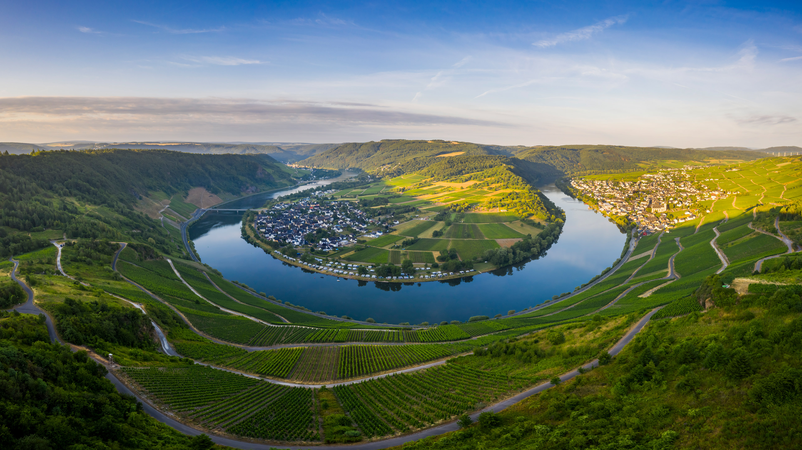 [克罗夫附近的摩泽尔河，德国 (© Jorg Greuel/Getty Images)](https://cn.bing.combing_2023-07-09_OHR.MoselleRiver_ZH-CN1283415242_UHD.jpg) 2023-07-09 |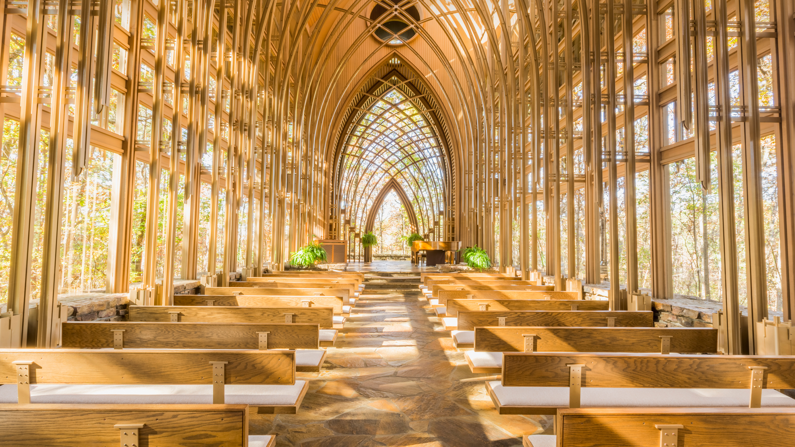 [米尔德里德-B-库珀纪念教堂，贝拉维斯塔，阿肯色州 (© Eddie Brady/Getty Images)](https://cn.bing.combing_2023-07-08_OHR.CooperChapel_ZH-CN1150924688_UHD.jpg) 2023-07-08|

### 2023-06

|     |    |
| ---- | ---- |
 |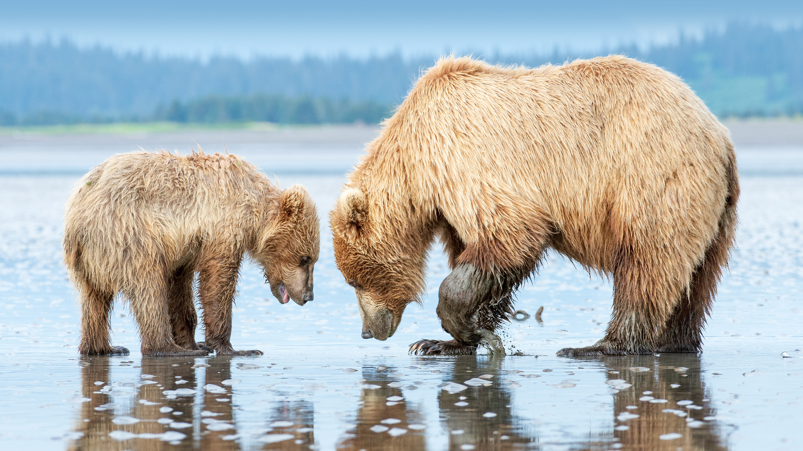 [棕熊妈妈和幼崽，克拉克湖国家公园和自然保护区，美国阿拉斯加州 (© Carlos Carreno/Getty Images)](https://cn.bing.combing_2023-06-30_OHR.ClamBears_ZH-CN5686721500_UHD.jpg) 2023-06-30 | [巴尼亚群岛，苏门答腊，印度尼西亚 (© fbxx/Getty Imagesz)](https://cn.bing.combing_2023-06-29_OHR.BanyakIslands_ZH-CN6620304821_UHD.jpg) 2023-06-29|
 |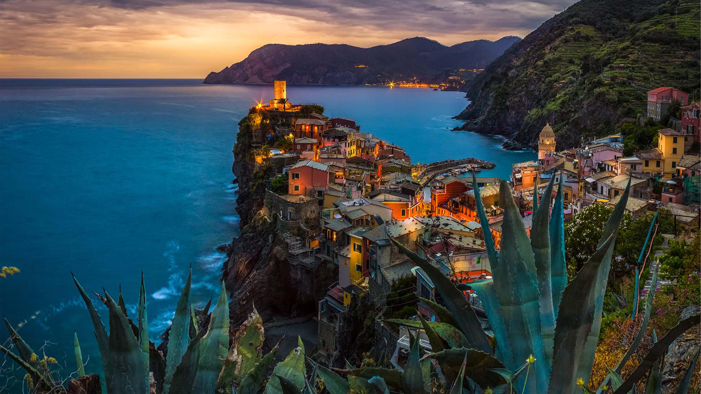 [韦尔纳扎，五渔村，意大利 (© Rubin Versigny/Getty Images)](https://cn.bing.combing_2023-06-28_OHR.ItalyCinqueTerre_ZH-CN6495965228_UHD.jpg) 2023-06-28 |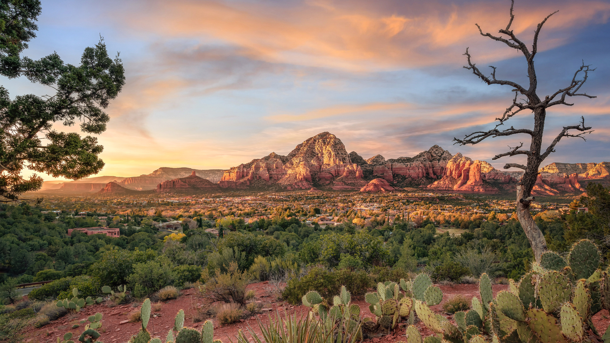 [塞多纳，亚利桑那州，美国 (© Jonathan Ross/Getty Images)](https://cn.bing.combing_2023-06-27_OHR.SedonaSunset_ZH-CN6289462383_UHD.jpg) 2023-06-27|
 |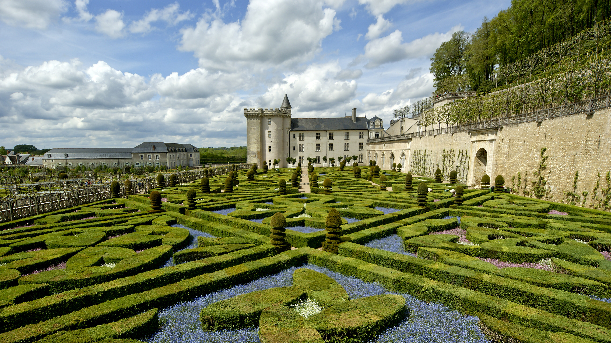 [维朗德里城堡及花园，卢瓦尔河谷，法国 (© VLADJ55/Shutterstock)](https://cn.bing.combing_2023-06-26_OHR.VillandryGarden_ZH-CN6140359139_UHD.jpg) 2023-06-26 |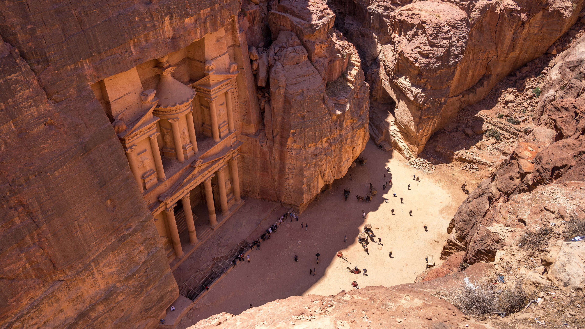 [佩特拉的宝库，约旦 (© WitthayaP/Shutterstock)](https://cn.bing.combing_2023-06-25_OHR.PetraTreasury_ZH-CN6007151900_UHD.jpg) 2023-06-25|
 |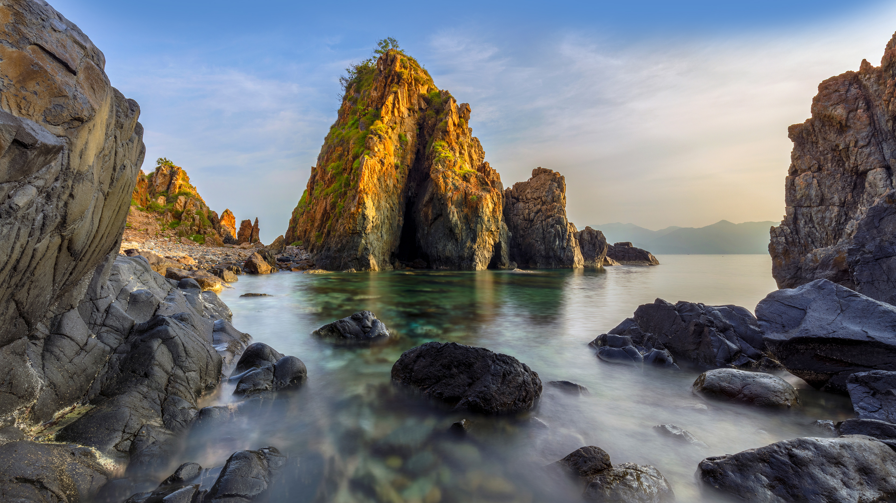 [芽富湾，芽庄，越南 (© Thang Tat Nguyen/Getty Images)](https://cn.bing.combing_2023-06-24_OHR.NhaTrang_ZH-CN5834700560_UHD.jpg) 2023-06-24 |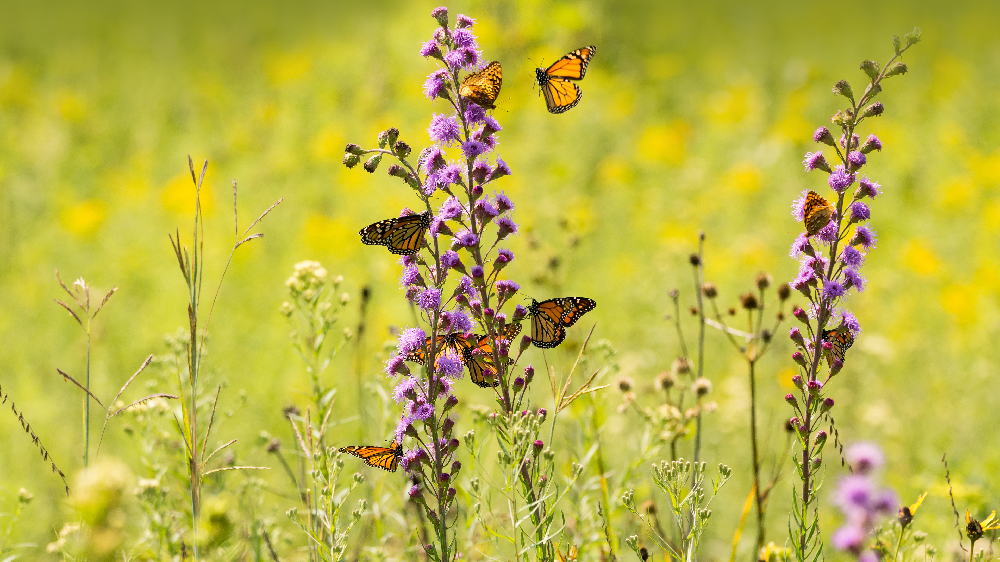 [帝王蝶在野花中取食 (© bookguy/Getty Images)](https://cn.bing.combing_2023-06-23_OHR.PollinatorMonarch_ZH-CN5556988827_UHD.jpg) 2023-06-23|
 | [中国传统节日端午节 (© timekeep/Shutterstock)](https://cn.bing.combing_2023-06-22_OHR.DragonBoatFestival2023_ZH-CN5255671687_UHD.jpg) 2023-06-22 | [夏日盛开的荷花 (© pandemin/Getty Images)](https://cn.bing.combing_2023-06-21_OHR.SummerSolstice2023_ZH-CN5038619036_UHD.jpg) 2023-06-21|
 |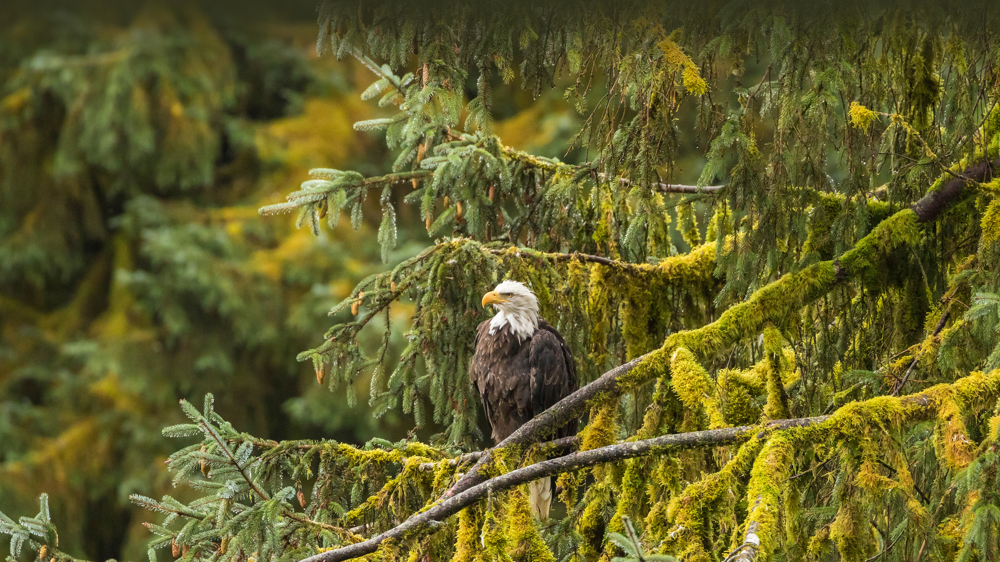 [秃鹰，通加斯国家森林，阿拉斯加，美国 (© Jaynes Gallery/Shutterstock)](https://cn.bing.combing_2023-06-20_OHR.EagleTree_ZH-CN7775102951_UHD.jpg) 2023-06-20 | [奔跑在诺曼底草地上的小狍，法国 (© Gerard Lacz/Minden)](https://cn.bing.combing_2023-06-19_OHR.Fawn_ZH-CN2172152960_UHD.jpg) 2023-06-19|
 |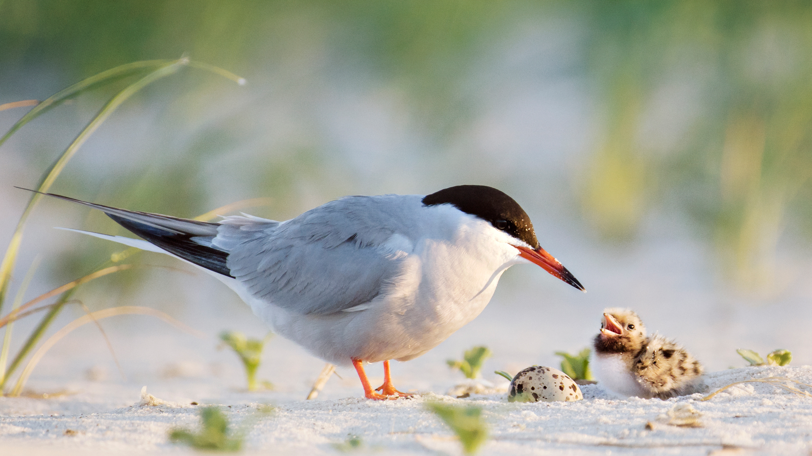 [普通燕鸥父亲和宝宝，长岛，纽约州，美国 (© Vicki Jauron, Babylon and Beyond Photography/Getty Images)](https://cn.bing.combing_2023-06-18_OHR.TernFather_ZH-CN1860589914_UHD.jpg) 2023-06-18 | [在加利福尼亚州圣地亚哥举行的“为团结划桨”活动 (© Brandon Colbert Photography/Getty Images)](https://cn.bing.combing_2023-06-17_OHR.SurfSanDiego_ZH-CN1485510748_UHD.jpg) 2023-06-17|
 | [游泳的鹰嘴海龟， 冲绳，日本 (© Robert Mallon/Getty Images)](https://cn.bing.combing_2023-06-16_OHR.HawksbillTurtle_ZH-CN0562063994_UHD.jpg) 2023-06-16 |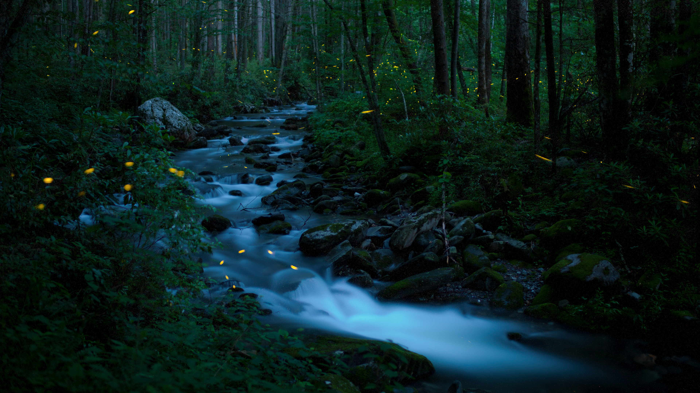 [同步萤火虫，大烟山国家公园，田纳西州，美国 (© Floris Van Bruegel/Minden Pictures)](https://cn.bing.combing_2023-06-15_OHR.SmokyFireflies_ZH-CN3840923626_UHD.jpg) 2023-06-15|
 |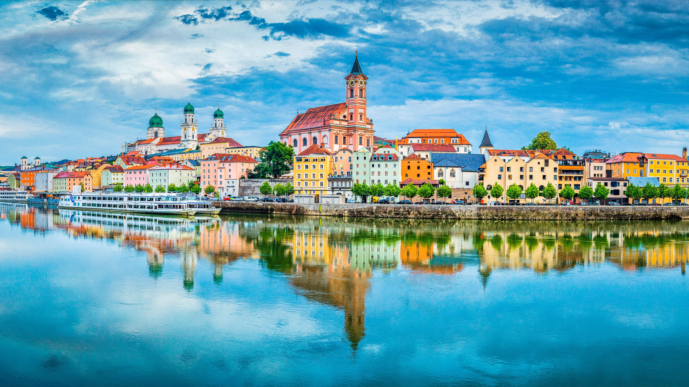 [多瑙河畔的帕绍市，巴伐利亚，德国 (© Scott Wilson/Alamy)](https://cn.bing.combing_2023-06-14_OHR.PassauSunsetJune_ZH-CN7563956674_UHD.jpg) 2023-06-14 |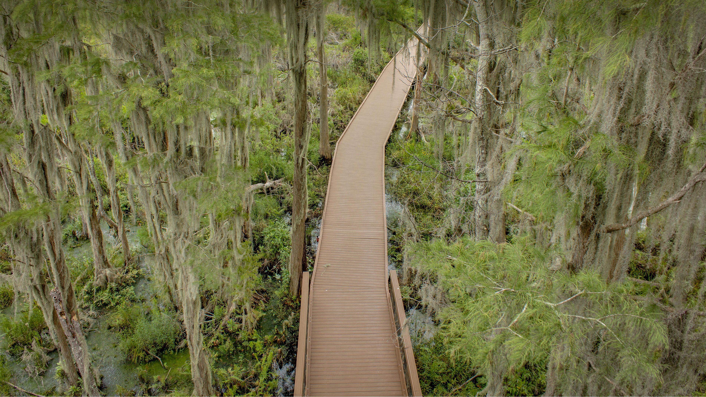 [奥克弗诺基沼泽木板路上的西班牙苔藓，佐治亚州，美国 (© Emmer Photo/Alamy)](https://cn.bing.combing_2023-06-13_OHR.OkefenokeeSwamp_ZH-CN3640203783_UHD.jpg) 2023-06-13|
 |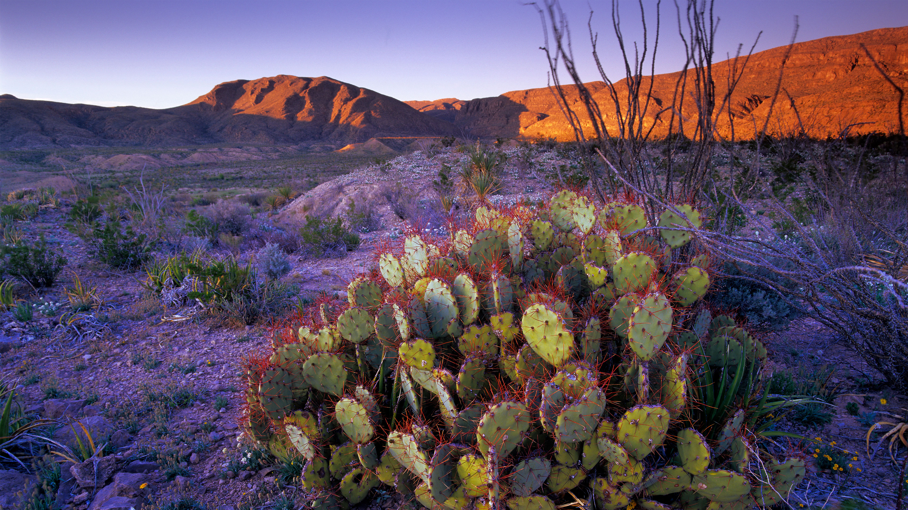 [仙人掌植物，得克萨斯州大弯国家公园，美国 (© Tim Fitzharris/Minden Pictures)](https://cn.bing.combing_2023-06-12_OHR.BigBendAnniv_ZH-CN3445097868_UHD.jpg) 2023-06-12 |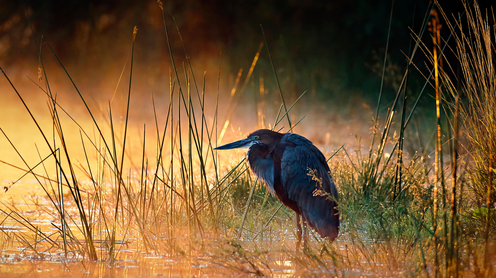 [巨鹭，克鲁格国家公园，南非 (© Johan Swanepoel/Alamy)](https://cn.bing.combing_2023-06-11_OHR.GoliathHeron_ZH-CN2413747227_UHD.jpg) 2023-06-11|
 |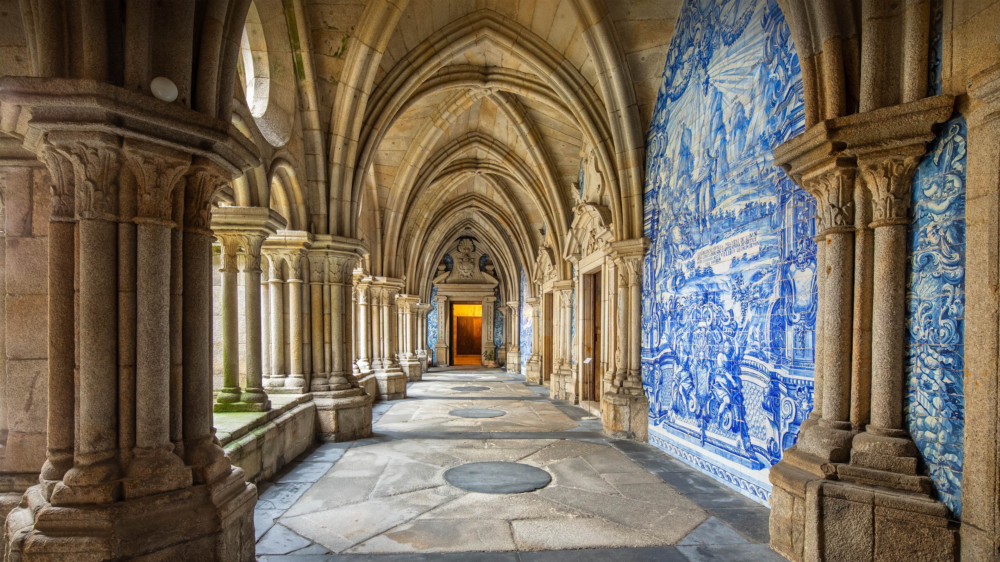 [波尔图大教堂, 葡萄牙 (© Reinhard Schmid/Huber/eStock Photo)](https://cn.bing.combing_2023-06-10_OHR.PortugalDay_ZH-CN2939429166_UHD.jpg) 2023-06-10 | [卡帕多西亚, 土耳其 (© Anton Petrus/Getty Images)](https://cn.bing.combing_2023-06-09_OHR.BalloonsTurkey_ZH-CN2791109350_UHD.jpg) 2023-06-09|
 |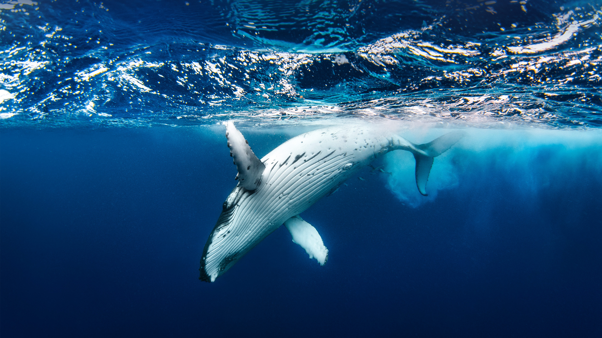 [座头鲸 (© Philip Thurston/Getty Images)](https://cn.bing.combing_2023-06-08_OHR.PlayfulHumpback_ZH-CN2241016258_UHD.jpg) 2023-06-08 |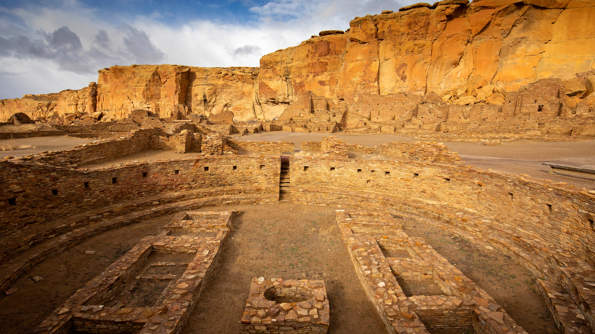 [普韦布洛·博尼托镇，查科文化国家历史公园，美国新墨西哥州 (© Ian Shive/Tandem Stills + Motion)](https://cn.bing.combing_2023-06-07_OHR.ChacoCulture_ZH-CN2098865361_UHD.jpg) 2023-06-07|
 |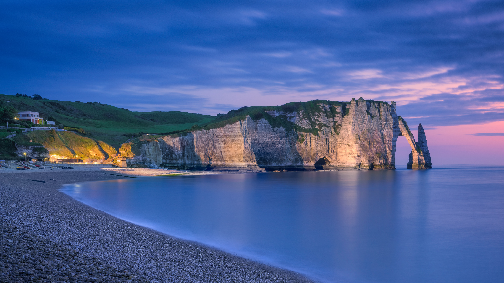 [The chalk cliffs of Étretat, Normandy, France (© MarcelloLand/Getty Images)](https://cn.bing.combing_2023-06-06_OHR.CliffsEtretat_ZH-CN1961838068_UHD.jpg) 2023-06-06 |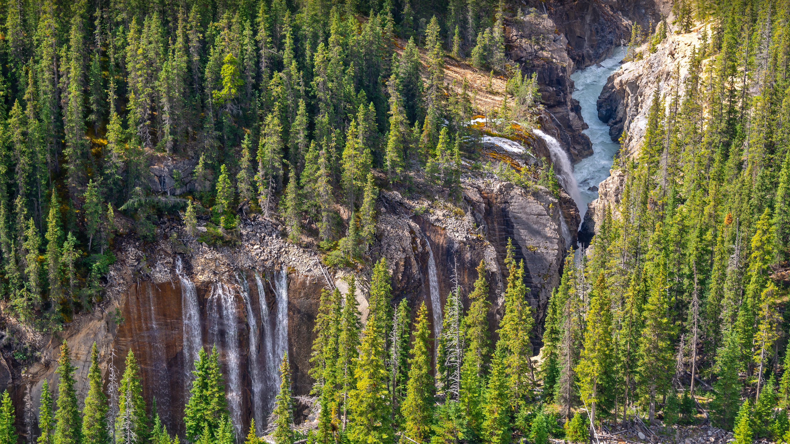 [辛华达峡谷的瀑布，贾斯珀国家公园，加拿大 (© Delpixart/Getty Images)](https://cn.bing.combing_2023-06-05_OHR.WaterfallsSunwaptaValley_ZH-CN1804229850_UHD.jpg) 2023-06-05|
 | [怀阿纳帕纳帕州立公园的黑沙滩，茂宜岛，夏威夷，美国 (© Matt Anderson Photography/Getty Images)](https://cn.bing.combing_2023-06-04_OHR.MauiBeach_ZH-CN1435658101_UHD.jpg) 2023-06-04 |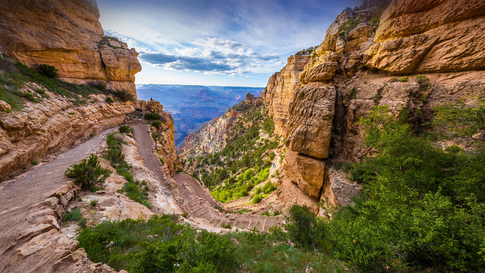 [大峡谷国家公园的南凯巴布步道，亚利桑那州，美国 (© Roman Khomlyak/Getty Images)](https://cn.bing.combing_2023-06-03_OHR.SouthKaibabTrail_ZH-CN1186135534_UHD.jpg) 2023-06-03|
 | [沙丘中的南非剑羚，纳米比亚 (© Sergey Gorshkov/Alamy)](https://cn.bing.combing_2023-06-02_OHR.GemsbokNamibia_ZH-CN0963988839_UHD.jpg) 2023-06-02 |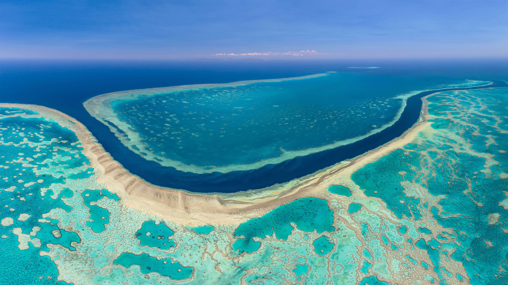 [大堡礁的航拍图，澳大利亚 (© AirPano LLC/Amazing Aerial Agency)](https://cn.bing.combing_2023-06-01_OHR.ReefAwareness_ZH-CN8840949729_UHD.jpg) 2023-06-01|

### 2023-05

|     |    |
| ---- | ---- |
 | [海獭宝宝，威廉王子湾，美国阿拉斯加州 (© Donald M. Jones/Minden Pictures)](https://cn.bing.combing_2023-05-31_OHR.WorldOtterDay_ZH-CN8607141093_UHD.jpg) 2023-05-31 | [埃莫海滩，玛丽埃塔斯群岛，巴亚尔塔港，墨西哥 (© ferrantraite/Getty Images)](https://cn.bing.combing_2023-05-30_OHR.HiddenBeach_ZH-CN8410568637_UHD.jpg) 2023-05-30|
 |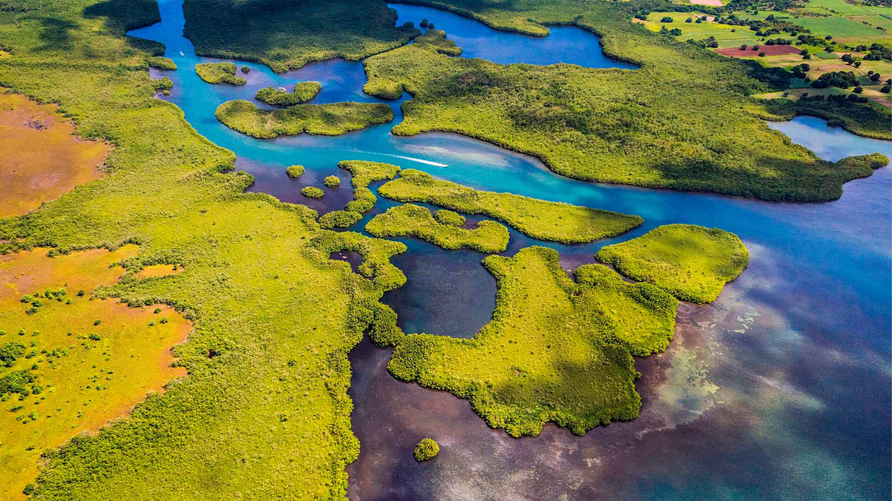 [萨克马兰大湾，瓜德罗普岛国家公园，小安的列斯群岛 (© Hemis/Alamy)](https://cn.bing.combing_2023-05-29_OHR.Antilles_ZH-CN8267285876_UHD.jpg) 2023-05-29 |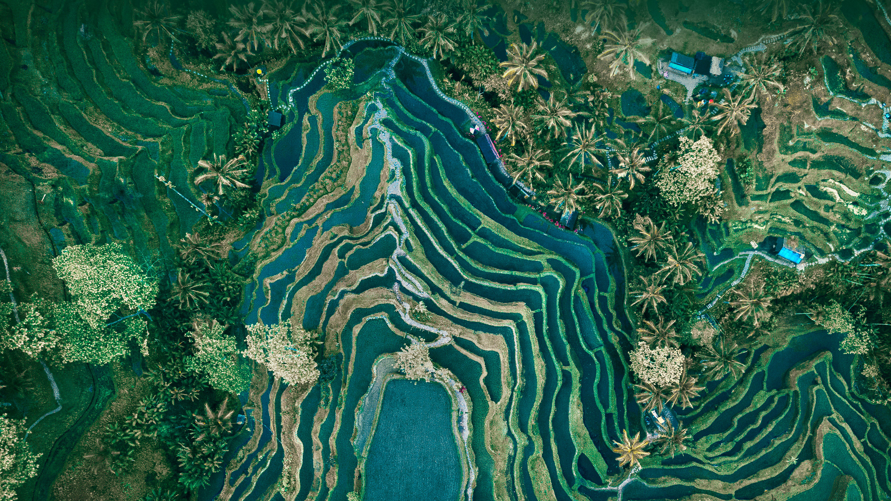 [乌布的德格拉朗梯田，印度尼西亚 (© Cavan Images/Adobe Stock)](https://cn.bing.combing_2023-05-28_OHR.TegallalangTerrace_ZH-CN8126456968_UHD.jpg) 2023-05-28|
 |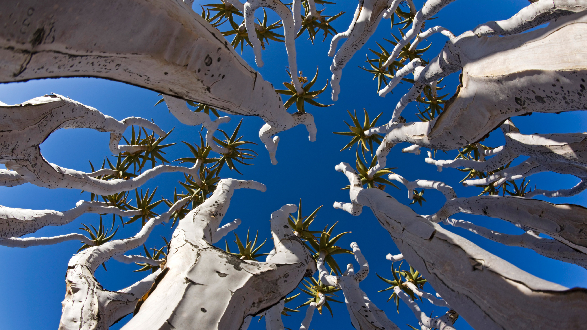 [纳米比亚的植物 (© Fotofeeling/DEEPOL by plainpicture)](https://cn.bing.combing_2023-05-27_OHR.AloeDichotomum_ZH-CN7940121733_UHD.jpg) 2023-05-27 | [西沙瓦寺，素可泰历史公园，泰国 (© Casper1774 Studio/Shutterstock)](https://cn.bing.combing_2023-05-26_OHR.WatSriSawai_ZH-CN7688908090_UHD.jpg) 2023-05-26|
 |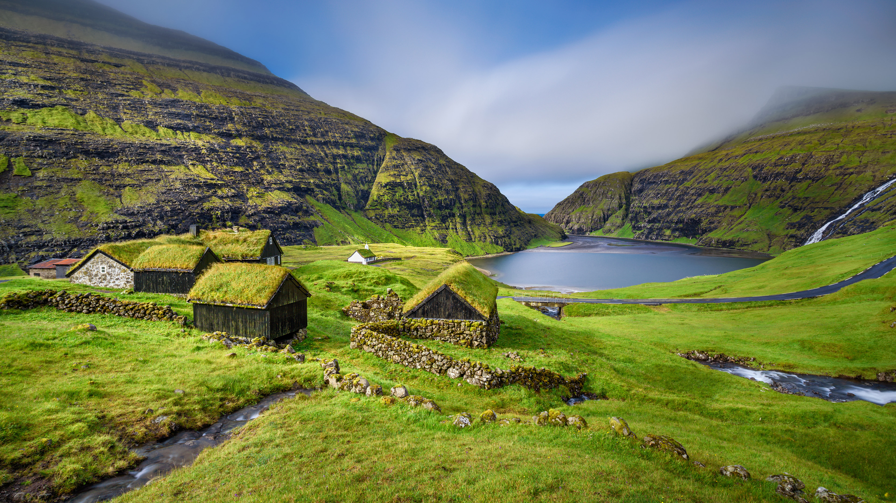 [法罗群岛，丹麦 (© miroslav_1/Getty Images)](https://cn.bing.combing_2023-05-25_OHR.SaksunFaroe_ZH-CN7150180006_UHD.jpg) 2023-05-25 | [科孚岛旧城堡 (© Netfalls Remy Musser/Shutterstock)](https://cn.bing.combing_2023-05-24_OHR.OldFortress_ZH-CN6469523538_UHD.jpg) 2023-05-24|
 | [西部箱龟 (© Tim Fitzharris/Minden Pictures)](https://cn.bing.combing_2023-05-23_OHR.WesternBoxTurtle_ZH-CN6203163704_UHD.jpg) 2023-05-23 | [塞纳河，巴黎，法国 (© StockByM/Getty Images)](https://cn.bing.combing_2023-05-21_OHR.PontdArcole_ZH-CN5348049357_UHD.jpg) 2023-05-21|
 | [谢菲尔德的欧洲蜜蜂, 英格兰 (© Deborah Vernon/Alamy)](https://cn.bing.combing_2023-05-20_OHR.EuropeanHoneybee_ZH-CN5191293837_UHD.jpg) 2023-05-20 |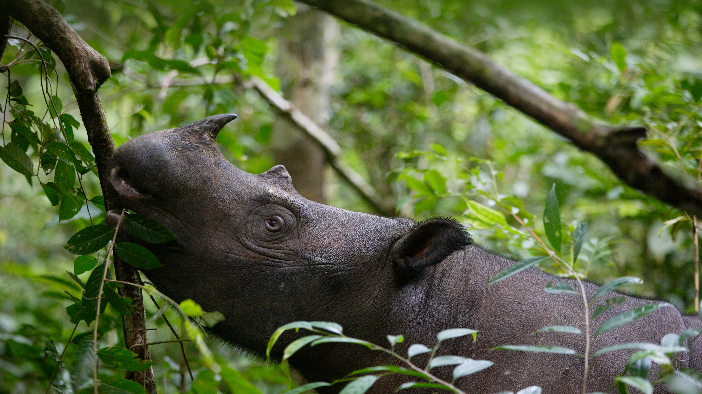 [苏门答腊犀牛，韦卡巴斯国家公园，印度尼西亚 (© Cyril Ruoso/Minden Pictures)](https://cn.bing.combing_2023-05-19_OHR.SumatranRhino_ZH-CN4529744910_UHD.jpg) 2023-05-19|
 |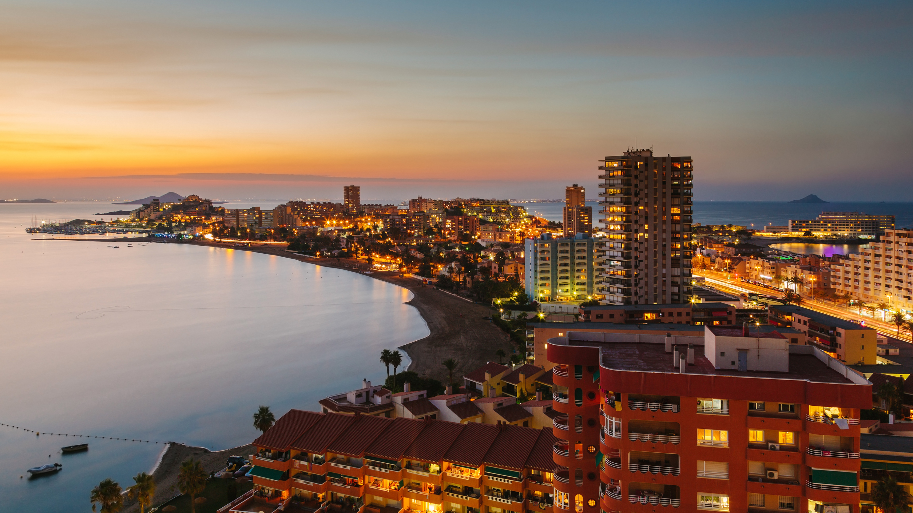 [拉曼加，穆尔西亚，西班牙 (© SOMATUSCANI/Getty Images)](https://cn.bing.combing_2023-05-18_OHR.SardineBurial_ZH-CN9563091726_UHD.jpg) 2023-05-18 | [加利福尼亚州圣克鲁斯的天然桥州立公园 (© Jim Patterson/Tandem Stills + Motion)](https://cn.bing.combing_2023-05-17_OHR.CormorantBridge_ZH-CN7673299694_UHD.jpg) 2023-05-17|
 |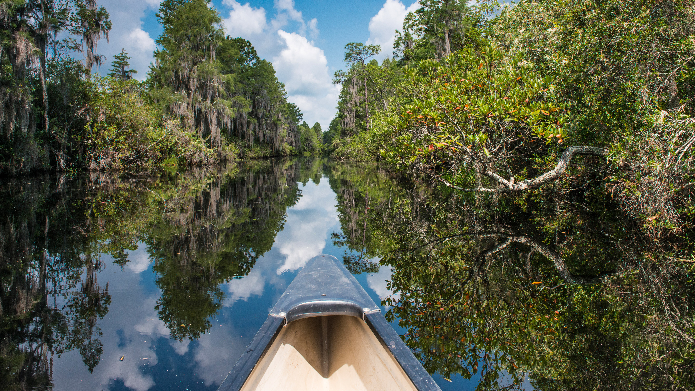 [在奥克弗诺基国家野生动物保护区划独木舟 (© Brad Beck/Tandem Stills + Motion)](https://cn.bing.combing_2023-05-16_OHR.AmericanWetlands_ZH-CN7534567518_UHD.jpg) 2023-05-16 |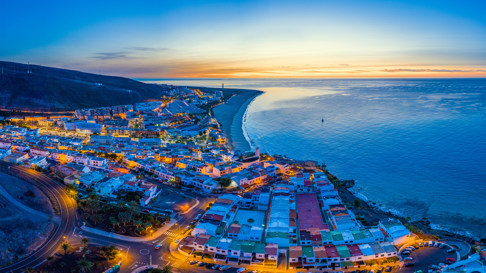 [莫罗哈夫莱海滩和科罗拉达斯海滩，富埃特文图拉岛，西班牙加那利群岛 (© Gavin Hellier/Getty Images)](https://cn.bing.combing_2023-05-15_OHR.MorroJable_ZH-CN7382027688_UHD.jpg) 2023-05-15|
 | [白尾鹿母鹿和刚出生的小鹿，美国蒙大拿州 (© Donald M. Jones/Minden Pictures)](https://cn.bing.combing_2023-05-14_OHR.OdocoileusVirginianus_ZH-CN6941501455_UHD.jpg) 2023-05-14 |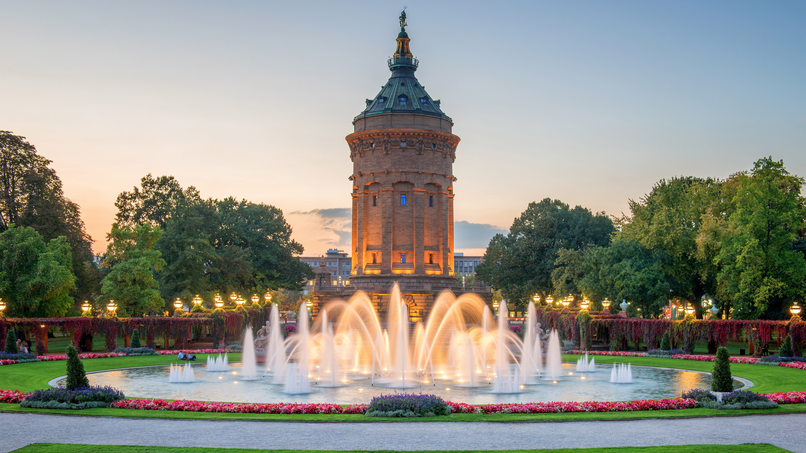 [曼海姆水塔，德国 (© tichr/Getty Images)](https://cn.bing.combing_2023-05-13_OHR.Mannheim_ZH-CN6793377814_UHD.jpg) 2023-05-13|
 | [紫色和蓝色的野生羽扇豆 (© silverjohn/Getty Images Plus)](https://cn.bing.combing_2023-05-12_OHR.WildLupine_ZH-CN6623952879_UHD.jpg) 2023-05-12 | [亨宁斯韦尔体育场，挪威 (© Morten Falch Sortland/Getty Images)](https://cn.bing.combing_2023-05-11_OHR.FootballField_ZH-CN6439594719_UHD.jpg) 2023-05-11|
 | [科尔杜昂灯塔，罗扬市，夏朗德省，法国 (© FRTimelapse/Getty Images)](https://cn.bing.combing_2023-05-10_OHR.CordouanLighthouse_ZH-CN6267155218_UHD.jpg) 2023-05-10 |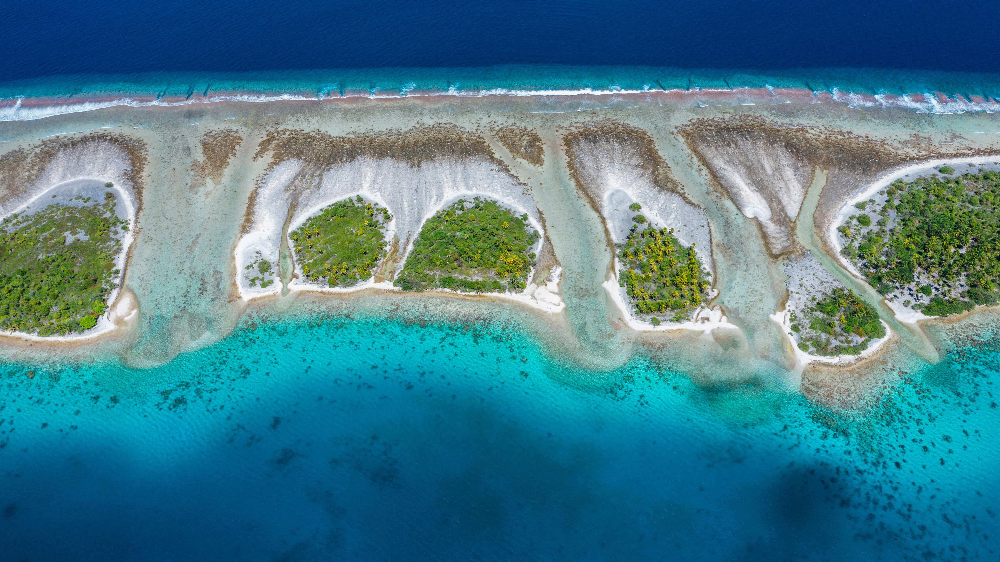 [卡韦希环礁，土阿莫土群岛，法属波利尼西亚 (© WaterFrame/Alamy)](https://cn.bing.combing_2023-05-09_OHR.Atoll_ZH-CN9469093805_UHD.jpg) 2023-05-09|
 |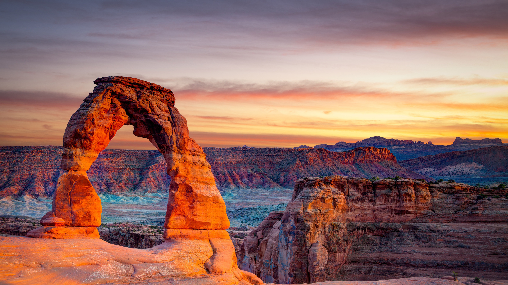 [精致拱门，拱门国家公园，犹他州 (© Mark Brodkin Photography/Getty Images)](https://cn.bing.combing_2023-05-08_OHR.TheChaps_ZH-CN5966508162_UHD.jpg) 2023-05-08 | [海豹幼崽，伦迪岛，英国 (© Henley Spiers/Minden Pictures)](https://cn.bing.combing_2023-05-07_OHR.SealLaughing_ZH-CN5809094643_UHD.jpg) 2023-05-07|
 |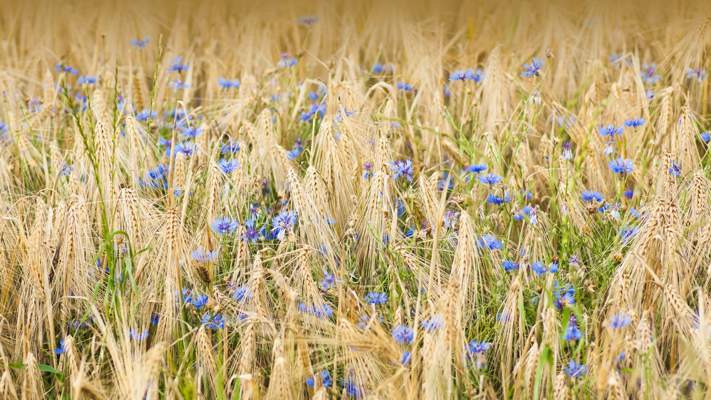 [大麦和矢车菊, 诺德豪森, 德国 (© Mandy Tabatt/Getty Images)](https://cn.bing.combing_2023-05-06_OHR.Kornblume_ZH-CN0344238832_UHD.jpg) 2023-05-06 |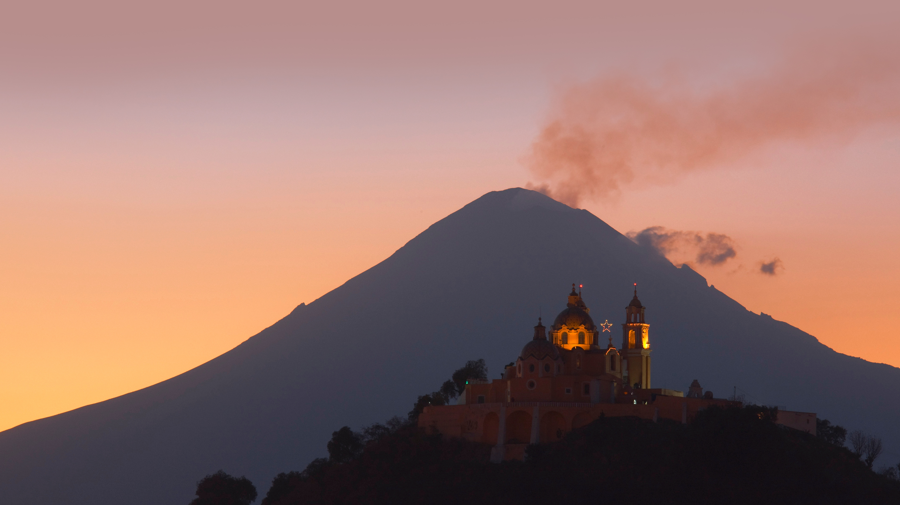 [普埃布拉天主堂和波波卡特佩特火山，普埃布拉，墨西哥 (© Radius Images/Shutterstock)](https://cn.bing.combing_2023-05-05_OHR.Popocatepetl_ZH-CN5483138337_UHD.jpg) 2023-05-05|
 |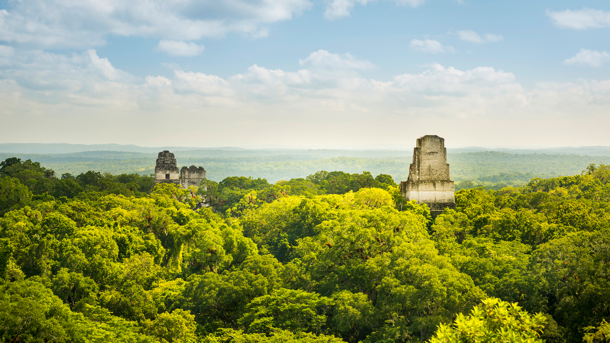 [蒂卡尔的玛雅遗址，危地马拉 (© THP Creative/Getty Images)](https://cn.bing.combing_2023-05-04_OHR.RebelBase_ZH-CN0484516261_UHD.jpg) 2023-05-04 | [马赛马拉的角马，肯尼亚 (© Matt Polski/Getty Images)](https://cn.bing.combing_2023-05-03_OHR.ThreeWildebeest_ZH-CN0175563521_UHD.jpg) 2023-05-03|
 |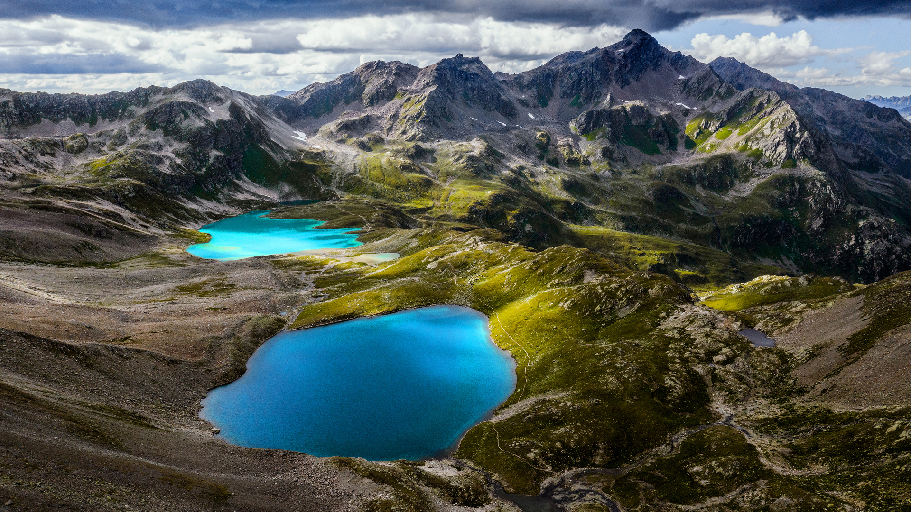 [阿尔卑斯山脉锡尔夫雷塔山的乔里森湖，瑞士 (© Florin Baumann/Getty Images)](https://cn.bing.combing_2023-05-02_OHR.KlostersSerneus_ZH-CN9821473046_UHD.jpg) 2023-05-02 | [横跨圣劳伦斯河下游的魁北克大桥，加拿大 (© Ronald Santerre/Getty Images)](https://cn.bing.combing_2023-05-01_OHR.QuebecCityBridge_ZH-CN9618387961_UHD.jpg) 2023-05-01|

### 2023-04

|     |    |
| ---- | ---- |
 |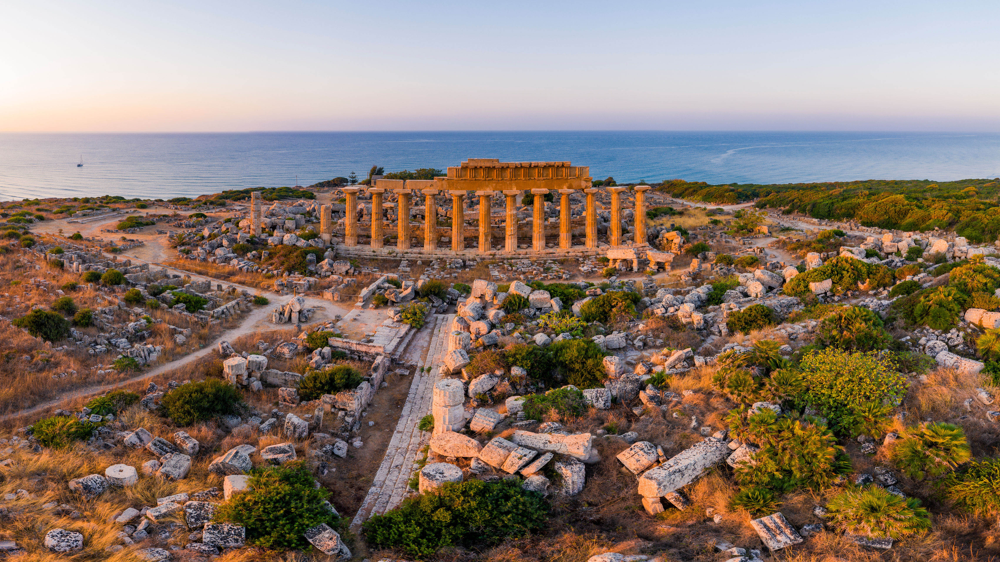 [塞利努斯的神庙，西西里岛，意大利 (© Antonino Bartuccio/eStock)](https://cn.bing.combing_2023-04-30_OHR.TempleE_ZH-CN9455488333_UHD.jpg) 2023-04-30 |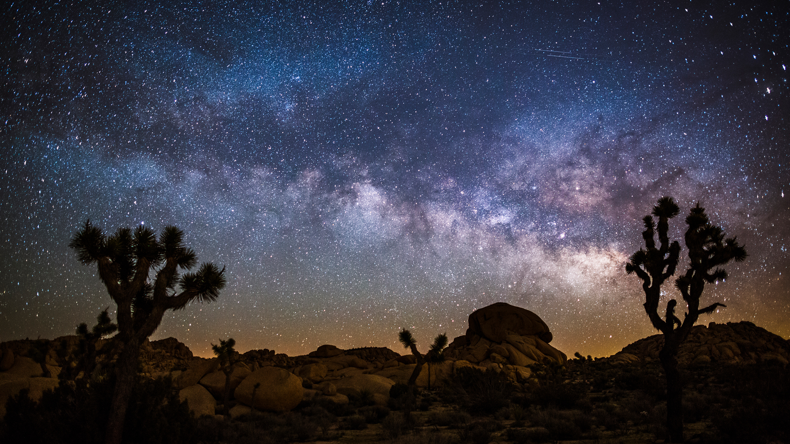 [约书亚树国家公园上空的银河，美国加利福尼亚州 (© Schroptschop/Getty Images)](https://cn.bing.combing_2023-04-29_OHR.JTNPMilkyWay_ZH-CN9128830420_UHD.jpg) 2023-04-29|
 | [优胜美地国家公园的马里波萨谷巨杉林，美国加利福尼亚州 (© Orbon Alija/Getty Images)](https://cn.bing.combing_2023-04-28_OHR.MariposaGrove_ZH-CN8957145435_UHD.jpg) 2023-04-28 |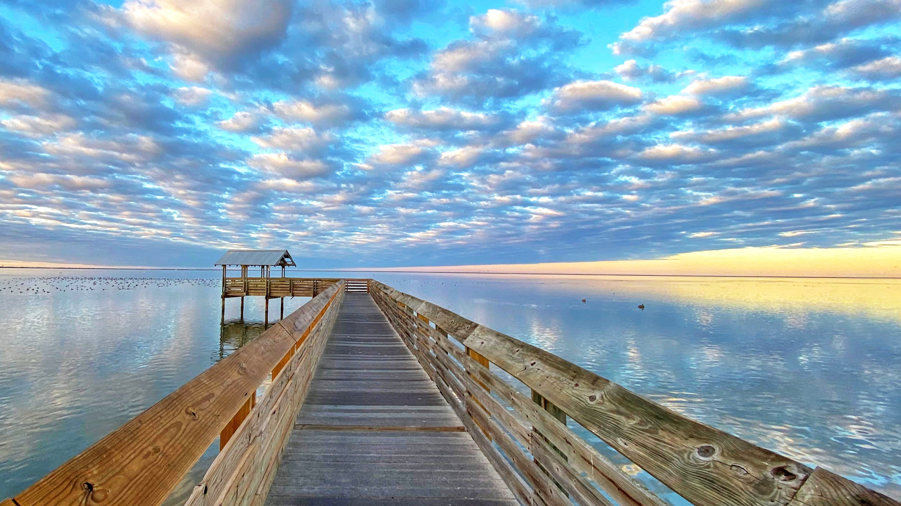 [南帕德里岛，美国得克萨斯州 (© Jeff R Clow/Getty Images)](https://cn.bing.combing_2023-04-27_OHR.SouthPadre_ZH-CN8788572569_UHD.jpg) 2023-04-27|
 |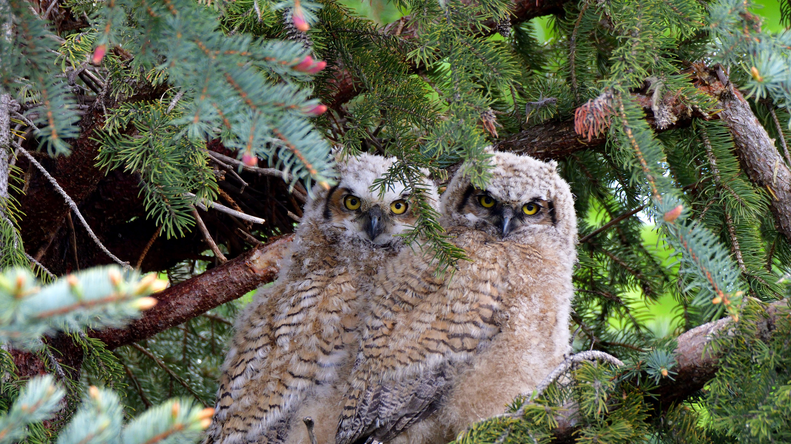 [大雕鸮幼崽 (© Michael Morse/Getty Images)](https://cn.bing.combing_2023-04-26_OHR.GHOAudubonDay_ZH-CN8605905801_UHD.jpg) 2023-04-26 |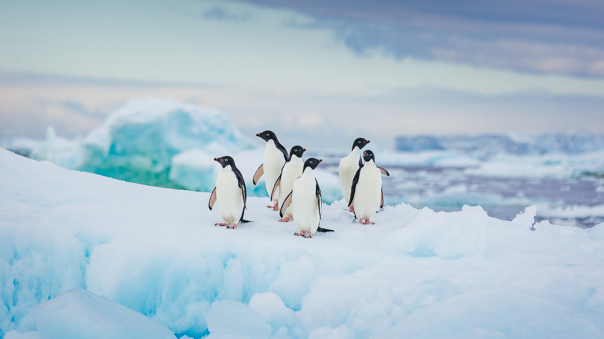 [阿德利企鹅 (© David Merron Photography/Getty Images)](https://cn.bing.combing_2023-04-25_OHR.AdelieWPD_ZH-CN8434233391_UHD.jpg) 2023-04-25|
 |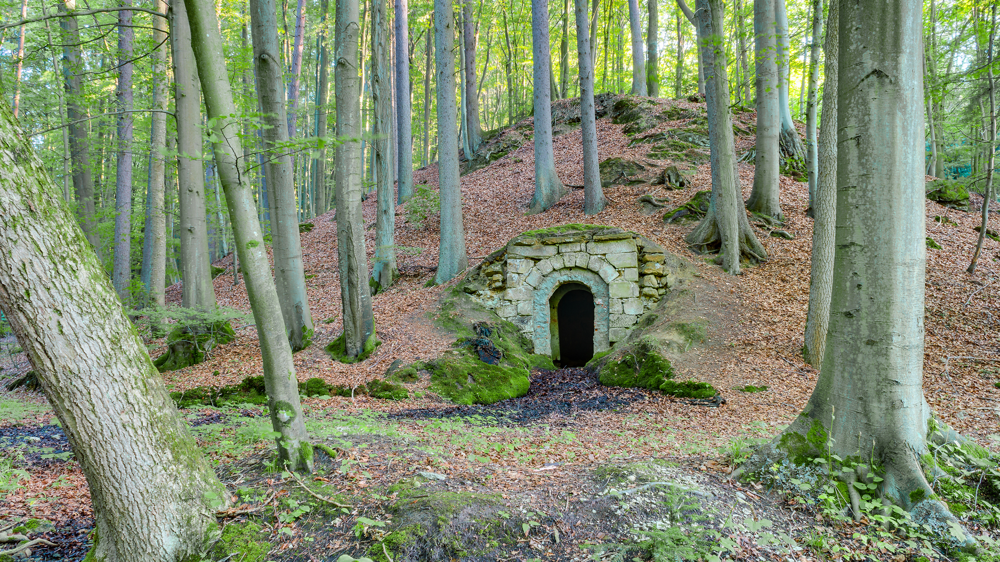 [巴伐利亚森林酒窖，德国 (© Andreas_Zerndl/Getty Images)](https://cn.bing.combing_2023-04-24_OHR.FranconianWineCellar_ZH-CN8234719750_UHD.jpg) 2023-04-24 | [日出时分薄雾笼罩下的薰衣草田，印度 (© Amith Nag Photography/Getty Images)](https://cn.bing.combing_2023-04-23_OHR.Honnavaralavenderfields_ZH-CN8054655091_UHD.jpg) 2023-04-23|
 | [岛屿灰狐，海峡群岛国家公园，美国加利福尼亚州 (© Ian Shive/Tandem Stills + Motion)](https://cn.bing.combing_2023-04-22_OHR.EarthDayFox_ZH-CN7926350207_UHD.jpg) 2023-04-22 | [普罗奇达岛，意大利 (© Sean Pavone/Shutterstock)](https://cn.bing.combing_2023-04-21_OHR.ProcidaItaly_ZH-CN7712975930_UHD.jpg) 2023-04-21|
 |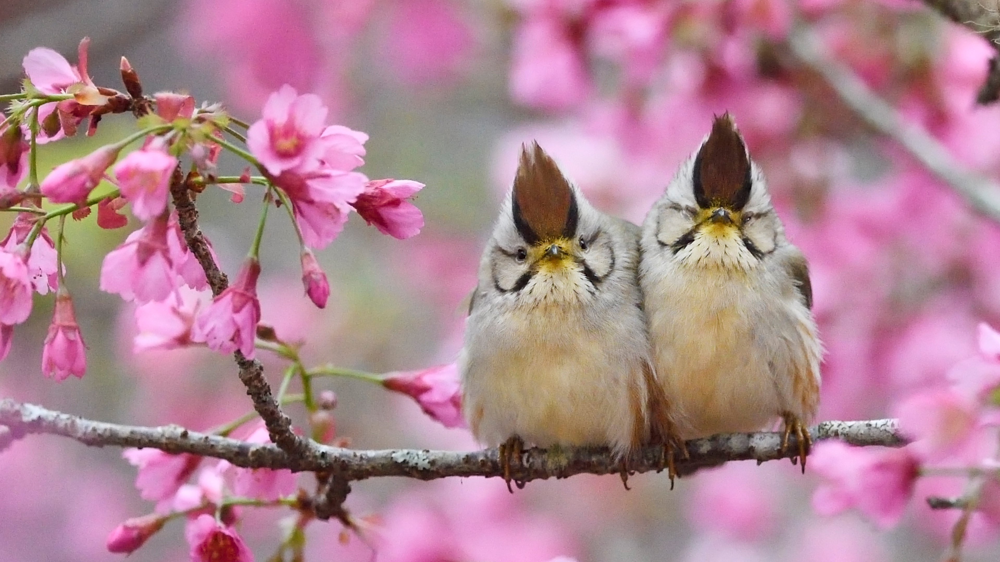 [褐头凤鹛 (© Staffan Widstrand/Minden Pictures)](https://cn.bing.combing_2023-04-19_OHR.TaiwanYuhina_ZH-CN6541884178_UHD.jpg) 2023-04-19 | [马丘比丘，秘鲁 (© Dora Dalton/Getty Images)](https://cn.bing.combing_2023-04-18_OHR.MPPUnesco_ZH-CN8076198158_UHD.jpg) 2023-04-18|
 | [布列塔尼的小米努灯塔，法国 (© RooM the Agency/Alamy)](https://cn.bing.combing_2023-04-17_OHR.MinouLighthouse_ZH-CN7940024247_UHD.jpg) 2023-04-17 |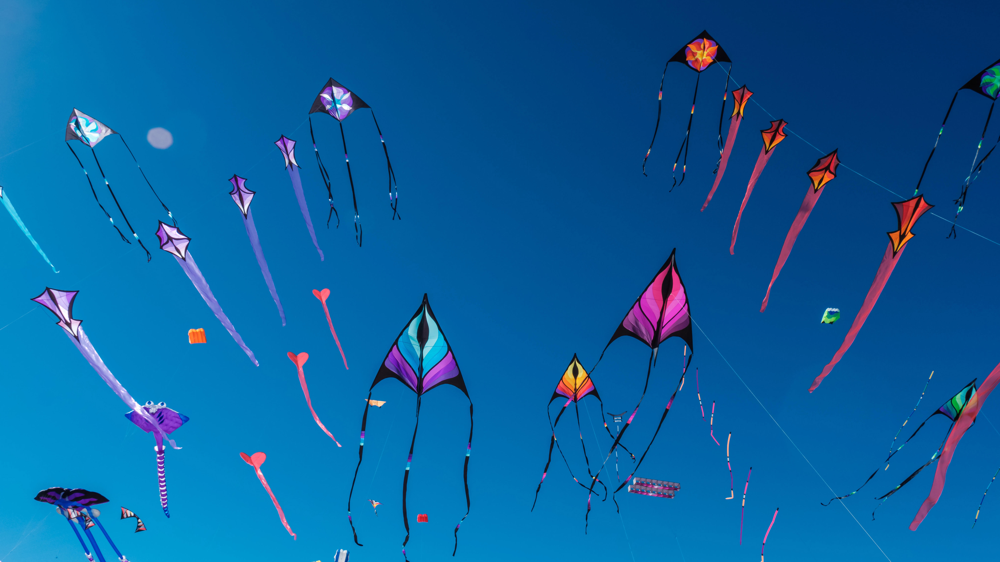 [阿德莱德国际风筝节，澳大利亚 (© Andrey Moisseyev/Alamy)](https://cn.bing.combing_2023-04-16_OHR.KiteDay_ZH-CN7813901578_UHD.jpg) 2023-04-16|
 | [从纳哈加尔城堡鸟瞰斋浦尔，印度 (© Sean3810/iStock/Getty Images Plus)](https://cn.bing.combing_2023-04-15_OHR.NahargarhFort_ZH-CN7681434372_UHD.jpg) 2023-04-15 |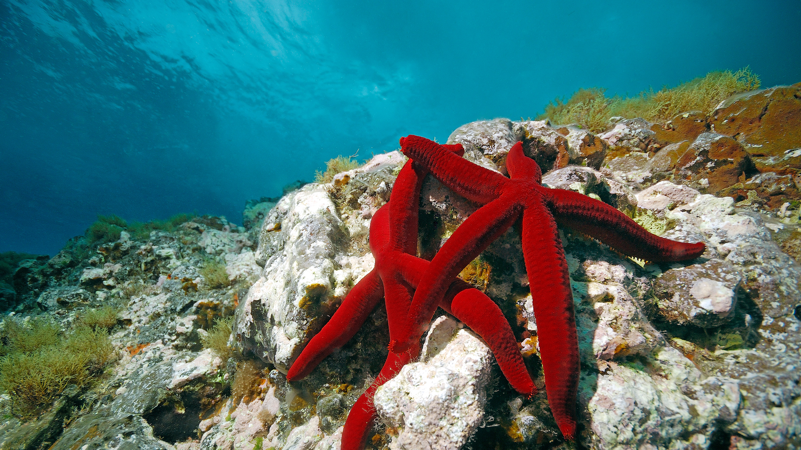 [红海星, 地中海 (© Hans Leijnse/Minden Pictures)](https://cn.bing.combing_2023-04-14_OHR.RedSeaStars_ZH-CN6243743747_UHD.jpg) 2023-04-14|
 |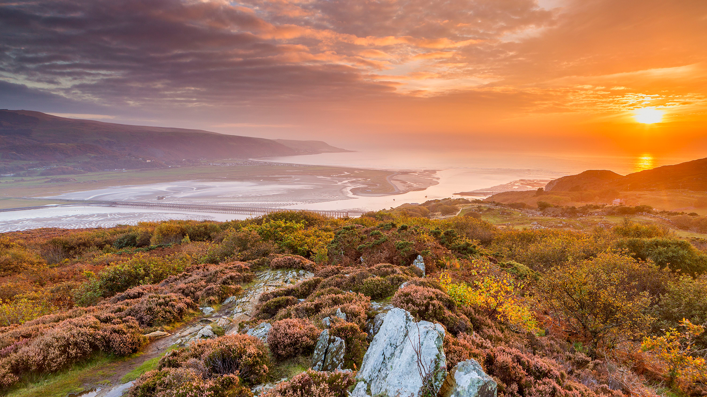 [斯诺登尼亚国家公园，威尔士，英国 (© Sebastian Wasek/eStock Photo)](https://cn.bing.combing_2023-04-13_OHR.SnowdoniaNational_ZH-CN7415540950_UHD.jpg) 2023-04-13 | [从国际空间站拍摄的地球 (© Tim Peake/ESA/NASA via Getty Images)](https://cn.bing.combing_2023-04-12_OHR.EuropeFromISS_ZH-CN0722816540_UHD.jpg) 2023-04-12|
 | [哥伦比亚河峡谷，俄勒冈州，美国 (© Chase Dekker Wild-Life Images/Getty Images)](https://cn.bing.combing_2023-04-11_OHR.MossyGrottoFalls_ZH-CN2490591617_UHD.jpg) 2023-04-11 | [安博塞利国家公园的大象，肯尼亚 (© Diana Robinson/Getty Images)](https://cn.bing.combing_2023-04-10_OHR.ElephantTwins_ZH-CN6743766062_UHD.jpg) 2023-04-10|
 | [复活节彩蛋 (© fotomem/Getty Images)](https://cn.bing.combing_2023-04-09_OHR.LithuanianEggs_ZH-CN6609820454_UHD.jpg) 2023-04-09 | [巨人之路，北爱尔兰，英国 (© DieterMeyrl/Getty Images)](https://cn.bing.combing_2023-04-08_OHR.NIrelandGiants_ZH-CN6110576507_UHD.jpg) 2023-04-08|
 | [欧亚河狸宝宝，芬兰 (© Danny Green/Minden Pictures)](https://cn.bing.combing_2023-04-07_OHR.KitsAspen_ZH-CN2160526845_UHD.jpg) 2023-04-07 | [月亮升起，图森，亚利桑那州，美国 (© Tim Murphy/Shutterstock)](https://cn.bing.combing_2023-04-06_OHR.ArizonaPinkMoon_ZH-CN5545607389_UHD.jpg) 2023-04-06|
 | [杭州西湖水墨意境般的风景，浙江省，中国 (© zhangshuang/Getty Images)](https://cn.bing.combing_2023-04-05_OHR.QingMing2023_ZH-CN6951199028_UHD.jpg) 2023-04-05 | [科尔多瓦的古罗马桥，西班牙 (© Jeremy Woodhouse/Getty Images)](https://cn.bing.combing_2023-04-04_OHR.RomanBridge_ZH-CN4699931052_UHD.jpg) 2023-04-04|
 | [大岛上的霍瑙瑙国家历史公园，夏威夷 (© Westend61/Getty Images)](https://cn.bing.combing_2023-04-03_OHR.HonaunauNP_ZH-CN4491662962_UHD.jpg) 2023-04-03 |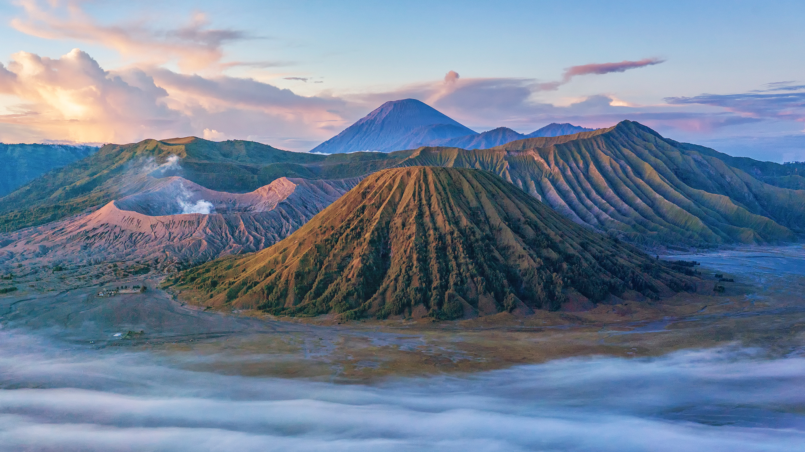 [爪哇岛东部的婆罗摩火山，印度尼西亚 (© Bento Fotography/Getty Images)](https://cn.bing.combing_2023-04-02_OHR.JavaBromo_ZH-CN2744043733_UHD.jpg) 2023-04-02|
 | [爪哇树蛙 (© kuritafsheen/Getty Images)](https://cn.bing.combing_2023-04-01_OHR.FrogMonth_ZH-CN3874143397_UHD.jpg) 2023-04-01|
### 2023-03

|     |    |
| ---- | ---- |
 |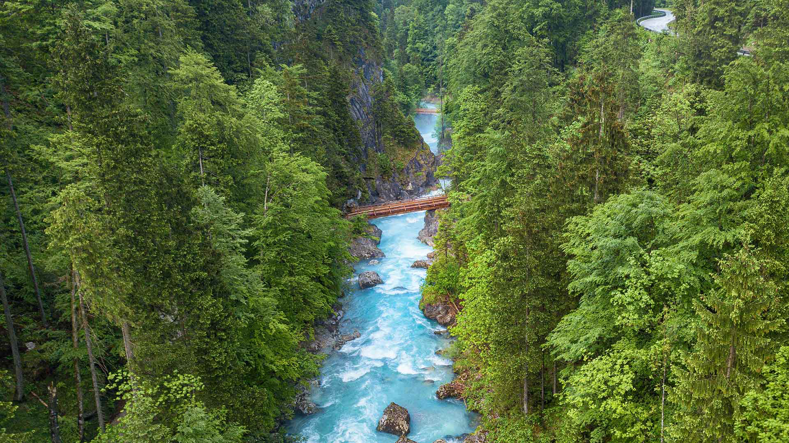 [斯太尔河, 奥地利 (© guenterguni/Getty Images)](https://cn.bing.combing_2023-03-31_OHR.SteyrRiver_ZH-CN3175702026_UHD.jpg) 2023-03-31|
 | [孔雀羽毛 (© sarayut Thaneerat/Getty Images)](https://cn.bing.combing_2023-03-30_OHR.PeacockFeathers_ZH-CN3403145691_UHD.jpg) 2023-03-30 | [两只海牛，佛罗里达州的水晶河，美国 (© Gregory Sweeney/Getty Images)](https://cn.bing.combing_2023-03-29_OHR.NuzzleManatee_ZH-CN3263788190_UHD.jpg) 2023-03-29|
 | [意大利三峰山上空的银河 (© Juan Romero/Cavan Images)](https://cn.bing.combing_2023-03-28_OHR.MWDolomites_ZH-CN2886991396_UHD.jpg) 2023-03-28 | [云层中的纽约市天际线 (© Orbon Alija/Getty Images)](https://cn.bing.combing_2023-03-27_OHR.NYCClouds_ZH-CN2585785154_UHD.jpg) 2023-03-27|
 | [安沙波利哥沙漠州立公园的野花，加利福尼亚州，美国 (© Ron and Patty Thomas/Getty Images)](https://cn.bing.combing_2023-03-26_OHR.WildAnza_ZH-CN2384861750_UHD.jpg) 2023-03-26 | [塞西尔布鲁尔楼梯，伦敦，英国 (© Yiran An/Getty Images)](https://cn.bing.combing_2023-03-25_OHR.CecilBrewerStaircase_ZH-CN2117182176_UHD.jpg) 2023-03-25|
 | [盛开的野蒜，海尼希国家公园，德国 (© Frank Sommariva/Getty Images)](https://cn.bing.combing_2023-03-24_OHR.WildGarlic_ZH-CN1869796625_UHD.jpg) 2023-03-24 | [杜费里峡谷，上萨瓦省，法国 (© Jean-Philippe Delobelle/Biosphoto/Alamy)](https://cn.bing.combing_2023-03-23_OHR.ChavarocheWinter_ZH-CN1842519491_UHD.jpg) 2023-03-23|
 | [鲍威尔湖，美国 (© Peter Schaefer/Alamy)](https://cn.bing.combing_2023-03-22_OHR.LakePowellAerial_ZH-CN1427611965_UHD.jpg) 2023-03-22 | [彩色粉笔 (© Stephen Shepherd/Plainpicture)](https://cn.bing.combing_2023-03-21_OHR.ColourDay_ZH-CN1032554089_UHD.jpg) 2023-03-21|
 | [紫番红花 (© Raimund Linke/Getty Images)](https://cn.bing.combing_2023-03-20_OHR.PurpleCrocus_ZH-CN0891528297_UHD.jpg) 2023-03-20 | [仓鸮，英格兰 (© Ondrej Prosicky/Getty Images)](https://cn.bing.combing_2023-03-19_OHR.BarnOwlWinter_ZH-CN5484796826_UHD.jpg) 2023-03-19|
 | [甘博阿陨击坑，火星 (© NASA/JPL-Caltech/University of Arizona)](https://cn.bing.combing_2023-03-18_OHR.MarsTars_ZH-CN0496313394_UHD.jpg) 2023-03-18 | [ballyvooney海岸，科佩海岸地质公园，爱尔兰 (© Andrea Pistolesi/Getty Images)](https://cn.bing.combing_2023-03-17_OHR.BallyvooneyCove_ZH-CN0284564457_UHD.jpg) 2023-03-17|
 | [成都大熊猫繁育研究基地，中国 (© Jim Zuckerman/Jaynes Gallery/DanitaDelimont)](https://cn.bing.combing_2023-03-16_OHR.ChengduPanda_ZH-CN0043208941_UHD.jpg) 2023-03-16 | [阿圭罗村庄，西班牙 (© Andrea Comi/Getty Images)](https://cn.bing.combing_2023-03-15_OHR.AgueroSpain_ZH-CN9622864502_UHD.jpg) 2023-03-15|
 | [阿伊纳帕植物园灌木丛迷宫，塞浦路斯 (© Tpopova/Getty Images)](https://cn.bing.combing_2023-03-14_OHR.CyprusMaze_ZH-CN9448060895_UHD.jpg) 2023-03-14 | [正在睡觉的母狮, 塞伦盖蒂国家公园，坦桑利亚 (© Cavan Images/Shutterstock)](https://cn.bing.combing_2023-03-13_OHR.LionessesNap_ZH-CN9240393299_UHD.jpg) 2023-03-13|
 | [南唐斯国家公园的绵羊，东萨塞克斯郡，英国 (© Slawek Staszczuk/Alamy)](https://cn.bing.combing_2023-03-12_OHR.SouthDownsSheep_ZH-CN8986424729_UHD.jpg) 2023-03-12 | [马萨诸塞州格洛斯特的沼泽地 (© Thomas H. Mitchell/Getty Images)](https://cn.bing.combing_2023-03-11_OHR.LongWharf_ZH-CN8793669955_UHD.jpg) 2023-03-11|
 | [埃代尔，峰区，英国 (© John Finney/Getty Images)](https://cn.bing.combing_2023-03-10_OHR.EdaleValley_ZH-CN8464524952_UHD.jpg) 2023-03-10 | [威美亚峡谷和怀波奥瀑布上空的彩虹,考艾岛，夏威夷，美国 (© Beverley Van Praagh/Getty Images)](https://cn.bing.combing_2023-03-09_OHR.WaimeaRainbow_ZH-CN1127225170_UHD.jpg) 2023-03-09|
 | [极光展示，怀特霍斯，育空地区，加拿大 (© John Hyde/plainpicture/Design Pics)](https://cn.bing.combing_2023-03-08_OHR.WhitehorseAurora_ZH-CN0978404088_UHD.jpg) 2023-03-08 | [梯田鸟瞰图，元阳，中国 (© AlexGcs/Getty Images)](https://cn.bing.combing_2023-03-07_OHR.YuanyangChina_ZH-CN7360249295_UHD.jpg) 2023-03-07|
 | [站在自己领域的冰岛马，冰岛 (© Rodrigo Lourezini/Shutterstock)](https://cn.bing.combing_2023-03-06_OHR.IcelandHorses_ZH-CN7213041152_UHD.jpg) 2023-03-06 | [袋鼠妈妈和宝宝 (© Belle Ciezak/Shutterstock)](https://cn.bing.combing_2023-03-05_OHR.HuggingKanga_ZH-CN1045131695_UHD.jpg) 2023-03-05|
 | [通往皮库山的道路，葡萄牙 (© Marco Bottigelli/Getty Images)](https://cn.bing.combing_2023-03-04_OHR.PicoVolcano_ZH-CN6865997792_UHD.jpg) 2023-03-04 | [斯皮尔德拉的虎鲸，挪威 (© Alex Mustard/Minden Pictures)](https://cn.bing.combing_2023-03-03_OHR.OrcaNorway_ZH-CN6101327628_UHD.jpg) 2023-03-03|
 | [内格拉廷湖，格拉纳达，西班牙 (© Andres Martinez Olmedo/Getty Images)](https://cn.bing.combing_2023-03-02_OHR.NegratinSpain_ZH-CN5916944876_UHD.jpg) 2023-03-02 | [吕贝克的霍尔斯滕门，德国 (© Harald Nachtmann/Getty Images)](https://cn.bing.combing_2023-03-01_OHR.LuebeckCityGate_ZH-CN4618826141_UHD.jpg) 2023-03-01|

### 2023-02

|     |    |
| ---- | ---- |
 | [阿特拉尼，阿马尔菲海岸，意大利 (© Amazing Aerial/Shutterstock)](https://cn.bing.combing_2023-02-28_OHR.AtraniAmalfi_ZH-CN6391731688_UHD.jpg) 2023-02-28 | [北极熊在加拿大沉睡 (© David Pike/Minden Pictures)](https://cn.bing.combing_2023-02-27_OHR.PolarBearFrost_ZH-CN5918160947_UHD.jpg) 2023-02-27|
 | [亚马孙雨林的树冠探险，秘鲁 (© Pere Rubi/Getty Images)](https://cn.bing.combing_2023-02-26_OHR.CanopyPeru_ZH-CN5659581553_UHD.jpg) 2023-02-26 | [布莱斯峡谷国家公园的石林，犹他州，美国 (© Piriya Photography/Getty Images)](https://cn.bing.combing_2023-02-25_OHR.BryceAnniv_ZH-CN5305245786_UHD.jpg) 2023-02-25|
 | [里士满公园的鸳鸯，伦敦，英国 (© Oscar Dewhurst/Minden Pictures)](https://cn.bing.combing_2023-02-24_OHR.RichmondParkDuck_ZH-CN4956127005_UHD.jpg) 2023-02-24 | [克罗索尔山谷，斯诺多尼亚国家公园，英国威尔士 (© Matthew Williams Ellis/Plainpicture)](https://cn.bing.combing_2023-02-23_OHR.BabblingBrook_ZH-CN9371346787_UHD.jpg) 2023-02-23|
 | [菲希特尔山脉上的和平钟，萨克森州，德国 (© Jan Drahokoupil/Getty Images)](https://cn.bing.combing_2023-02-22_OHR.FriedensglockeFichtelberg_ZH-CN5510489151_UHD.jpg) 2023-02-22 | [新奥尔良法语区，路易斯安那州 (© f11photo/Getty Images)](https://cn.bing.combing_2023-02-21_OHR.MardiGrasNOLA_ZH-CN9628788934_UHD.jpg) 2023-02-21|
 | [Itaimbezinho峡谷，巴西 (© NidoHuebl/Getty Images)](https://cn.bing.combing_2023-02-20_OHR.Itaimbezinho_ZH-CN5641449623_UHD.jpg) 2023-02-20 | [毛伊岛附近的座头鲸，美国夏威夷 (© Flip Nicklin/Minden Pictures)](https://cn.bing.combing_2023-02-19_OHR.MauiWhale_ZH-CN6664793962_UHD.jpg) 2023-02-19|
 | [埃本冰洞，密歇根上半岛，美国 (© Dean Pennala/Shutterstock)](https://cn.bing.combing_2023-02-18_OHR.EbenIceCave_ZH-CN6035107581_UHD.jpg) 2023-02-18 | [栖息在红袋鼠爪枝干上的艾氏煌蜂鸟 (© GypsyPictureShow/Shutterstock)](https://cn.bing.combing_2023-02-17_OHR.BirdcountAllen_ZH-CN4029022734_UHD.jpg) 2023-02-17|
 | [“火流”马尾瀑布，约塞米蒂国家公园，美国加利福尼亚州 (© Jeff Lewis/Tandem Stills + Motion)](https://cn.bing.combing_2023-02-16_OHR.FireFallYosemite_ZH-CN3351604820_UHD.jpg) 2023-02-16 | [河马妈妈和宝宝，乔贝国家公园，博茨瓦纳 (© jacobeukman/Getty Images)](https://cn.bing.combing_2023-02-15_OHR.HippoDayChobe_ZH-CN2883647954_UHD.jpg) 2023-02-15|
 | [日本北海道小樽雪灯之路的冰屋 (© T Photography/Shutterstock)](https://cn.bing.combing_2023-02-14_OHR.OtaruIgloo_ZH-CN2078929256_UHD.jpg) 2023-02-14 | [阿卡切斯瞭望台，月亮谷，智利 (© Ignacio Palacios/Getty Images)](https://cn.bing.combing_2023-02-13_OHR.MoonValley_ZH-CN1906470869_UHD.jpg) 2023-02-13|
 | [一对蓝脚鲣鸟，加拉帕戈斯群岛，厄瓜多尔 (© Tui De Roy/Minden Pictures)](https://cn.bing.combing_2023-02-12_OHR.BoobyDarwinDay_ZH-CN9917306809_UHD.jpg) 2023-02-12 | [死亡谷扎布里斯基角上空的银河，美国加利福尼亚州 (© Matt Anderson Photography/Getty Images)](https://cn.bing.combing_2023-02-11_OHR.DarkSkiesDV_ZH-CN1076500221_UHD.jpg) 2023-02-11|
 | [埃庇道鲁斯剧场, 希腊阿尔戈利斯省 (© George Pachantouris/Getty Images)](https://cn.bing.combing_2023-02-10_OHR.EpidaurusGreece_ZH-CN0640135476_UHD.jpg) 2023-02-10 |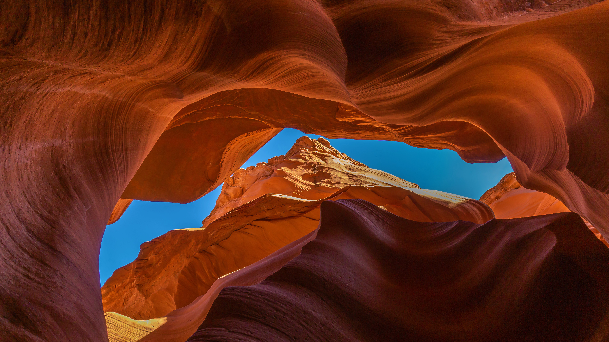 [下羚羊峡谷，亚利桑那州，美国 (© AZCat/Getty Images)](https://cn.bing.combing_2023-02-09_OHR.LowerAntelopeAZ_ZH-CN4758496750_UHD.jpg) 2023-02-09|
 | [艾琳多南堡，苏格兰高地 (© VisualCommunications/Getty Images)](https://cn.bing.combing_2023-02-08_OHR.EileanDonanDawn_ZH-CN0383017858_UHD.jpg) 2023-02-08 | [拉布罗小镇，列蒂省，意大利 (© Marco Ilari/Shutterstock)](https://cn.bing.combing_2023-02-07_OHR.MedievalLabro_ZH-CN0015356188_UHD.jpg) 2023-02-07|
 | [峡湾国家公园，新西兰南岛 (© WitR/Adobe Stock)](https://cn.bing.combing_2023-02-06_OHR.WaitangiFjordlandNP_ZH-CN9436140228_UHD.jpg) 2023-02-06 | [毛茸茸又可爱的山兔 (© Ben Hall/Minden Pictures)](https://cn.bing.combing_2023-02-05_OHR.YearRabbit_ZH-CN2751166096_UHD.jpg) 2023-02-05|
 | [永福樱花园，福建省龙岩市, 中国 (© SEN LI/Getty Images)](https://cn.bing.combing_2023-02-04_OHR.Lichun2023_ZH-CN7842399047_UHD.jpg) 2023-02-04 | [费尔蒙芳堤娜城堡酒店，魁北克省，加拿大 (© Romiana Lee/Shutterstock)](https://cn.bing.combing_2023-02-03_OHR.QuebecFrontenac_ZH-CN9519096458_UHD.jpg) 2023-02-03|
 | [高地陶恩国家公园内的高山土拨鼠，奥地利 (© Michaela Walch/Alamy)](https://cn.bing.combing_2023-02-02_OHR.GroundhogThree_ZH-CN6720558481_UHD.jpg) 2023-02-02 | [皮埃尔丰城堡，皮卡第大区，法国 (© Hemis/Alamy)](https://cn.bing.combing_2023-02-01_OHR.SunriseCastle_ZH-CN6235928386_UHD.jpg) 2023-02-01|

### 2023-01

|     |    |
| ---- | ---- |
 | [南非自然保护区的斑马 (© Richard Du Toit/Minden Pictures)](https://cn.bing.combing_2023-01-31_OHR.ZebraTrio_ZH-CN5902552401_UHD.jpg) 2023-01-31 | [卡纳塔克邦的纳加尔霍雷国家公园，印度 (© Vivek BR/Shutterstock)](https://cn.bing.combing_2023-01-30_OHR.NagarholeNationalPark_ZH-CN2550578922_UHD.jpg) 2023-01-30|
 | [埃塞克斯的乌鸫，英国 (© Bill Coster/Alamy Stock Photo)](https://cn.bing.combing_2023-01-29_OHR.BlackbirdDay_ZH-CN2291101162_UHD.jpg) 2023-01-29 | [从国际空间站看到的巴哈马周围的蓝绿色水域 (© NASA)](https://cn.bing.combing_2023-01-28_OHR.BlueBahamas_ZH-CN2083290847_UHD.jpg) 2023-01-28|
 | [瓜纳阿卡维韦斯半岛国家公园的红树林，古巴 (© Claudio Contreras/Minden Pictures)](https://cn.bing.combing_2023-01-27_OHR.RedMangrove_ZH-CN4083989028_UHD.jpg) 2023-01-27 | [天门洞，湖南天门山国家森林公园，中国 (© Shane P. White/Minden Pictures)](https://cn.bing.combing_2023-01-26_OHR.HighArchChina_ZH-CN8170154553_UHD.jpg) 2023-01-26|
 | [位于阿伯费尔迪桦树林中的罗伯特·彭斯雕像, 苏格兰 (© Dennis Barnes/Getty Images)](https://cn.bing.combing_2023-01-25_OHR.BirksofAberfeldy_ZH-CN7810226692_UHD.jpg) 2023-01-25 | [多洛米蒂山谷中的科莱圣卢恰小镇，意大利 (© mauritius images GmbH/Alamy)](https://cn.bing.combing_2023-01-24_OHR.ColleSantaLucia_ZH-CN7638164714_UHD.jpg) 2023-01-24|
 | [复活节岛上的摩艾石像，智利 (© Karine Aigner/Tandem Stills + Motion)](https://cn.bing.combing_2023-01-23_OHR.SunriseMoai_ZH-CN7413178404_UHD.jpg) 2023-01-23 | [春节的桃花和红灯笼 (© David Ng+EyeEm/Getty Images)](https://cn.bing.combing_2023-01-22_OHR.ChineseSpringFestival2023_ZH-CN7281854882_UHD.jpg) 2023-01-22|
 | [除夕夜的中国新年灯笼 (© Toa55/Getty Images)](https://cn.bing.combing_2023-01-21_OHR.ChineseNewYearEve2023_ZH-CN7188893388_UHD.jpg) 2023-01-21 | [王企鹅，福克兰群岛 (© Elmar Weiss/Getty Images)](https://cn.bing.combing_2023-01-20_OHR.FalklandKings_ZH-CN6891102487_UHD.jpg) 2023-01-20|
 | [帕克城, 美国犹他州 (© Kruck20/Getty Images)](https://cn.bing.combing_2023-01-19_OHR.SFFParkCity_ZH-CN6707019061_UHD.jpg) 2023-01-19 | [白沙国家公园，美国新墨西哥州 (© Andrea Harrell/Tandem Stills + Motion)](https://cn.bing.combing_2023-01-18_OHR.WhiteSands_ZH-CN6500188005_UHD.jpg) 2023-01-18|
 | [穆涅略斯自然保护区，西班牙 (© Andres M. Dominguez/Minden Pictures)](https://cn.bing.combing_2023-01-17_OHR.SessileOaks_ZH-CN6385464274_UHD.jpg) 2023-01-17 | [麦切纳山和结冰的亚伯拉罕湖，加拿大艾伯塔省 (© Tom Mackie/plainpicture)](https://cn.bing.combing_2023-01-16_OHR.FrozenBubblesAlberta_ZH-CN6154214678_UHD.jpg) 2023-01-16|
 | [横贯图尔库的奥拉河, 芬兰 (© Jarmo Piironen/Alamy)](https://cn.bing.combing_2023-01-15_OHR.Turku_ZH-CN6008877545_UHD.jpg) 2023-01-15 | [吃樱桃树枝的毛驴 (© Juniors Bildarchiv GmbH/Alamy)](https://cn.bing.combing_2023-01-14_OHR.DonkeyFeast_ZH-CN5880627132_UHD.jpg) 2023-01-14|
 | [海峡群岛国家公园的巨藻，美国加利福尼亚州 (© Brandon Cole Images/Shutterstock)](https://cn.bing.combing_2023-01-13_OHR.Pneumatocysts_ZH-CN5721988566_UHD.jpg) 2023-01-13 | [博斯普鲁斯海峡的如梅利堡垒，土耳其伊斯坦布尔 (© Drone in Wonderland/Amazing Aerial Agency)](https://cn.bing.combing_2023-01-12_OHR.RumeliHisari_ZH-CN0185820275_UHD.jpg) 2023-01-12|
 | [戈德雷维灯塔，英国康沃尔郡 (© Paul Nash/Shutterstock)](https://cn.bing.combing_2023-01-11_OHR.GodrevyRocks_ZH-CN0051118926_UHD.jpg) 2023-01-11 | [爱沙尼亚佩普斯湖上的小冰丘 (© Sven Zacek/Minden Pictures)](https://cn.bing.combing_2023-01-10_OHR.HummockIce_ZH-CN9917832145_UHD.jpg) 2023-01-10|
 | [南达科他州风洞国家公园的水牛 (© Charlie Summers/Minden Pictures)](https://cn.bing.combing_2023-01-09_OHR.BisonWindCave_ZH-CN9778045938_UHD.jpg) 2023-01-09 | [科罗拉多州布雷肯里奇 (© Sean Pavone/Shutterstock)](https://cn.bing.combing_2023-01-08_OHR.Breckenridge_ZH-CN9598860382_UHD.jpg) 2023-01-08|
 | [羊毛和马海毛纱线 (© Jurate Buiviene/Alamy)](https://cn.bing.combing_2023-01-07_OHR.Mohair_ZH-CN9435762268_UHD.jpg) 2023-01-07 | [英格兰湖区的Black Fell (© Daniel Kay/Shutterstock)](https://cn.bing.combing_2023-01-06_OHR.BlackFell_ZH-CN9224189688_UHD.jpg) 2023-01-06|
 | [白鼬 (Mustela erminea), 上巴伐利亚，德国 (© Konrad Wothe/Minden Pictures)](https://cn.bing.combing_2023-01-05_OHR.HermelinSchnee_ZH-CN8839783506_UHD.jpg) 2023-01-05 | [从国际空间站看到的地球 (© JSC/NASA)](https://cn.bing.combing_2023-01-04_OHR.Perihelion_ZH-CN8681537155_UHD.jpg) 2023-01-04|
 | [博斯克·德尔·阿帕奇国家野生动物保护区的沙丘鹤，美国新墨西哥州 (© Jay Goodrich/Tandem Stills + Motion)](https://cn.bing.combing_2023-01-03_OHR.SandhillSleeping_ZH-CN8483997851_UHD.jpg) 2023-01-03 | [霍亨索伦城堡，德国 (© Sahara Prince/Shutterstock)](https://cn.bing.combing_2023-01-02_OHR.HohenzollernBurg_ZH-CN8109082566_UHD.jpg) 2023-01-02|
 | [北极熊斯瓦尔巴群岛，挪威 (© Dennis Stogsdill/Getty Images)](https://cn.bing.combing_2023-01-01_OHR.NorwayNYD_ZH-CN7856439066_UHD.jpg) 2023-01-01|
### 2022-12

|     |    |
| ---- | ---- |
 | [一起迎接2023年 (© GettyImages)](https://cn.bing.combing_2022-12-31_OHR.TheNationaDay_ZH-CN7631842209_UHD.jpg) 2022-12-31|
 | [白沙漠中的岩石，埃及 (© Anton Petrus/Getty Images)](https://cn.bing.combing_2022-12-30_OHR.ChalkRock_ZH-CN2893565655_UHD.jpg) 2022-12-30 | [斯托尔石山，天空之岛，苏格兰 (© Aliaume Chapelle/Tandem Stills + Motion)](https://cn.bing.combing_2022-12-29_OHR.StorrRocks_ZH-CN4956679462_UHD.jpg) 2022-12-29|
 | [马洛亚，瑞士 (© Roberto Moiola/Getty)](https://cn.bing.combing_2022-12-28_OHR.ChiesaBianca_ZH-CN4208333975_UHD.jpg) 2022-12-28 | [格林达维克的蓝湖，冰岛 (© Westend61/Getty Images)](https://cn.bing.combing_2022-12-27_OHR.BlueLagoon_ZH-CN3874240119_UHD.jpg) 2022-12-27|
 | [贝弗利·韦斯特伍德，东约克郡，英格兰 (© Les Gibbon/Alamy)](https://cn.bing.combing_2022-12-26_OHR.BeverleyWestwood_ZH-CN3729041588_UHD.jpg) 2022-12-26 | [黑梳山附近的惠斯勒小镇，加拿大不列颠哥伦比亚省 (© VisualCommunications/Getty Images)](https://cn.bing.combing_2022-12-25_OHR.WhistlerVillage_ZH-CN3451305723_UHD.jpg) 2022-12-25|
 | [狍子，特伦蒂诺-上阿迪杰大区，意大利 (© Federica Cattaruzzi/eStock)](https://cn.bing.combing_2022-12-24_OHR.RoeTrentinoSnow_ZH-CN3122890500_UHD.jpg) 2022-12-24 | [南极洲的巴布亚企鹅 (© Nature Picture Library/Alamy)](https://cn.bing.combing_2022-12-23_OHR.GentooGrievances_ZH-CN2875292726_UHD.jpg) 2022-12-23|
 | [安纳西，法国上瓦萨省 (© Sabine Klein/Alamy)](https://cn.bing.combing_2022-12-22_OHR.AnnecyXmas_ZH-CN2540694929_UHD.jpg) 2022-12-22 | [多洛米蒂山脉安特莫亚湖上的日晕，意大利 (© Walter Donega/Getty Images)](https://cn.bing.combing_2022-12-21_OHR.SolarHalo_ZH-CN2320274967_UHD.jpg) 2022-12-21|
 | [维也纳美景宫的圣诞市场，奥地利 (© Diyana Dimitrova/Alamy)](https://cn.bing.combing_2022-12-20_OHR.PalaceBelvedere_ZH-CN1818163173_UHD.jpg) 2022-12-20 | [栖息在北美冬青上的北美红雀，美国伊利诺伊州 (© Richard and Susan Day/Danita Delimont)](https://cn.bing.combing_2022-12-19_OHR.WinterberryBush_ZH-CN1414026440_UHD.jpg) 2022-12-19|
 | [迈阿密南海滩，美国佛罗里达州 (© Claudia Uripos/eStock Photo)](https://cn.bing.combing_2022-12-18_OHR.SouthBeach_ZH-CN0989287734_UHD.jpg) 2022-12-18 | [冰川国家公园的山羊，美国蒙大拿州 (© Sumio Harada/Minden Pictures)](https://cn.bing.combing_2022-12-17_OHR.GlacierGoats_ZH-CN0764810245_UHD.jpg) 2022-12-17|
 | [杜德萨加尔瀑布，印度果阿 (© Lucky-photographer/Getty Images)](https://cn.bing.combing_2022-12-16_OHR.DudhsagarFallsGoa_ZH-CN0466471017_UHD.jpg) 2022-12-16 | [博罗韦茨，保加利亚 (© Grigor Ivanov/Cavan Images)](https://cn.bing.combing_2022-12-15_OHR.Borovets_ZH-CN5914681811_UHD.jpg) 2022-12-15|
 | [大帕拉迪索国家公园，意大利 (© agustavop/Getty Images)](https://cn.bing.combing_2022-12-14_OHR.GranParadiso100th_ZH-CN5744961532_UHD.jpg) 2022-12-14 | [哈尔施塔特，奥地利 (© Jon Arnold Images Ltd/Alamy)](https://cn.bing.combing_2022-12-13_OHR.InstagramHallstatt_ZH-CN5309282641_UHD.jpg) 2022-12-13|
 | [一品红 (© Elizabeth Fernandez/Getty Images)](https://cn.bing.combing_2022-12-12_OHR.PoinsettiaDay_ZH-CN5115071992_UHD.jpg) 2022-12-12 | [泰根塞山脉Roßstein山顶的景色，德国巴伐利亚州 (© Christian Bäck/eStock Photo)](https://cn.bing.combing_2022-12-11_OHR.BuchsteinRossstein_ZH-CN4924477552_UHD.jpg) 2022-12-11|
 | [玻利维亚的乌尤尼盐沼 (© Theo Allofs/Minden Pictures)](https://cn.bing.combing_2022-12-10_OHR.SaltDesert_ZH-CN4728398785_UHD.jpg) 2022-12-10 | [多弗勒山-松达尔国家公园的麝牛与她的宝宝，挪威 (© Robert Haasmann/Minden Pictures)](https://cn.bing.combing_2022-12-09_OHR.NorwayMuskox_ZH-CN6137934745_UHD.jpg) 2022-12-09|
 | [多弗勒山-松达尔国家公园的麝牛与她的宝宝，挪威 (© Robert Haasmann/Minden Pictures)](https://cn.bing.combing_2022-12-08_OHR.WistmansWood_ZH-CN4453301808_UHD.jpg) 2022-12-08 | [贾斯珀国家公园纠结溪瀑布，阿尔伯塔省，加拿大 (© Jeff Foott/Minden Pictures)](https://cn.bing.combing_2022-12-07_OHR.TangleCreekFalls_ZH-CN4281148652_UHD.jpg) 2022-12-07|
 | [大沼泽国家公园里的一只大白鹭，美国佛罗里达州 (© Troy Harrison/Getty Images)](https://cn.bing.combing_2022-12-06_OHR.GreatEgret_ZH-CN4088261519_UHD.jpg) 2022-12-06 | [古瓦哈提的竹子，印度阿萨姆邦 (© Page Bazar/500px/Getty Images)](https://cn.bing.combing_2022-12-05_OHR.BambooTreesIndia_ZH-CN3943852151_UHD.jpg) 2022-12-05|
 | [乞力马扎罗山附近的大象，安波塞利国家公园，肯尼亚 (© Diana Robinson Photography/Getty Images)](https://cn.bing.combing_2022-12-04_OHR.KilimanjaroElephants_ZH-CN3779609103_UHD.jpg) 2022-12-04 | [迈阿密海滩海洋大道，美国佛罗里达州 (© Matteo Colombo/Getty Images)](https://cn.bing.combing_2022-12-03_OHR.MiamiDT_ZH-CN3528760113_UHD.jpg) 2022-12-03|
 | [特里卡基拉河三角洲，阿拉斯加州克拉克湖国家公园，美国 (© Dawn Wilson Photography/Getty Images)](https://cn.bing.combing_2022-12-02_OHR.BraidedRiverDelta_ZH-CN3352462511_UHD.jpg) 2022-12-02 | [江泽民逝世 (© Luca Flor/Shutterstock)](https://cn.bing.combing_2022-12-01_OHR.QingmingCandle2020_ZH-CN6775701680_UHD.jpg) 2022-12-01|

### 2022-11

|     |    |
| ---- | ---- |
 | [罗维尼老城，克罗地亚 (© trabantos/Shutterstock)](https://cn.bing.combing_2022-11-30_OHR.RovinjCroatia_ZH-CN5459110500_UHD.jpg) 2022-11-30 | [正在筑巢的大蓝鹭，佛罗里达州瓦可达哈齐湿地，美国 (© Imagebroker/Alamy)](https://cn.bing.combing_2022-11-29_OHR.HeronGiving_ZH-CN5229629007_UHD.jpg) 2022-11-29|
 | [火星（© NASA/Alamy）](https://cn.bing.combing_2022-11-28_OHR.RedPlanetDay_ZH-CN4913018041_UHD.jpg) 2022-11-28 | [一片飘落在龙虾爪瓣上的号角树树叶，墨西哥 (© Gerry Ellis/Minden Pictures)](https://cn.bing.combing_2022-11-27_OHR.Cecropia_ZH-CN4236630074_UHD.jpg) 2022-11-27|
 | [意大利西西里岛康科迪亚神庙前的一棵橄榄树 (© Alfio Finocchiaro/Shutterstock)](https://cn.bing.combing_2022-11-26_OHR.OliveTreeDay_ZH-CN3960861965_UHD.jpg) 2022-11-26 | [日出时分的蒂雷纳村庄，法国新阿基坦大区科雷兹省 (© Tim Mannakee/plainpicture)](https://cn.bing.combing_2022-11-25_OHR.TurenneSunrise_ZH-CN2357226217_UHD.jpg) 2022-11-25|
 | [坎彭万德山，基姆高地区阿绍，德国巴伐利亚州 (© Toni Anzenberger/plainpicture)](https://cn.bing.combing_2022-11-24_OHR.AschauChiemgau_ZH-CN1929016406_UHD.jpg) 2022-11-24 | [向日葵 (© Dileep Chandran/Alamy)](https://cn.bing.combing_2022-11-23_OHR.HelianthusAnnuus_ZH-CN1675762555_UHD.jpg) 2022-11-23|
 | [阿姆斯特丹供水沙丘自然保护区的赤狐，荷兰 (© Edwin Giesbers/Minden Pictures)](https://cn.bing.combing_2022-11-22_OHR.Waterleidingduinen_ZH-CN1430683267_UHD.jpg) 2022-11-22 | [伊索拉贝拉岛，意大利马焦雷湖 (© Massimo Ripani/eStock)](https://cn.bing.combing_2022-11-21_OHR.BorromeanIslands_ZH-CN0480730115_UHD.jpg) 2022-11-21|
 | [船底星云中的宇宙悬崖 (© NASA, ESA, CSA, and STScI)](https://cn.bing.combing_2022-11-20_OHR.CosmicCliffs_ZH-CN9555199651_UHD.jpg) 2022-11-20 | [犹他州锡安国家公园的维尔京河，美国 (© Jonathan Ross/Getty)](https://cn.bing.combing_2022-11-19_OHR.ZNPVR_ZH-CN0123954914_UHD.jpg) 2022-11-19|
 | [菲斯皇宫的大门，摩洛哥 (© Adam Smigielski/Getty Images)](https://cn.bing.combing_2022-11-18_OHR.IslamicArt_ZH-CN9972614185_UHD.jpg) 2022-11-18 | [威拉米特国家森林麦肯齐河步道上的桥，美国 (© Don Paulson/Danita Delimont)](https://cn.bing.combing_2022-11-17_OHR.McKenzieRiverTrail_ZH-CN3786429850_UHD.jpg) 2022-11-17|
 | [梅萨维德国家公园的悬崖宫，美国 (© Brad McGinley Photography/Getty Images)](https://cn.bing.combing_2022-11-16_OHR.Unesco50_ZH-CN3652927413_UHD.jpg) 2022-11-16 | [北美水獭在阿卡迪亚国家公园游泳，美国 (© George Sanker/Minden Pictures)](https://cn.bing.combing_2022-11-15_OHR.LontraCanadensis_ZH-CN3359002168_UHD.jpg) 2022-11-15|
 | [哈尔基岛的圣约翰骑士中世纪城堡遗址，希腊 (© Massimo Ripani/eStock Photo)](https://cn.bing.combing_2022-11-14_OHR.SanGiovanni_ZH-CN3184593519_UHD.jpg) 2022-11-14 |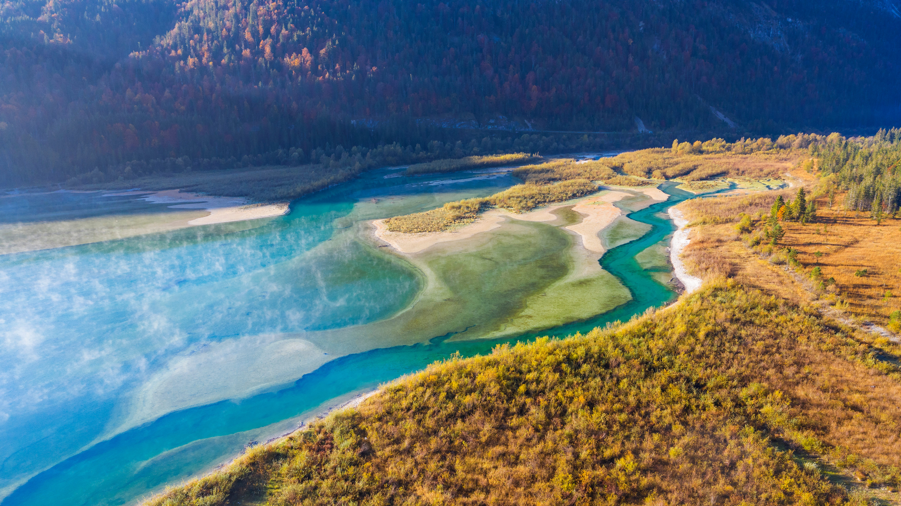 [伊萨尔河鸟瞰图，德国伦格里斯 (© Martin Siepmann/Offset/Shutterstock)](https://cn.bing.combing_2022-11-13_OHR.IsarwinkelSylvenstein_ZH-CN2963187862_UHD.jpg) 2022-11-13|
 | [阿拉斯加州海恩斯附近的秃鹰群，美国 (© Marion Vollborn/Minden Pictures)](https://cn.bing.combing_2022-11-12_OHR.HainesEagle_ZH-CN1542376030_UHD.jpg) 2022-11-12 | [阿拉瓦利山脉的阿布山，印度拉贾斯坦邦 (© saiko3p/Shutterstock)](https://cn.bing.combing_2022-11-11_OHR.MountAbu_ZH-CN1348295593_UHD.jpg) 2022-11-11|
 | [雷暴中恶地国家公园的岩层，美国南达科他州 (© DEEPOL by plainpicture)](https://cn.bing.combing_2022-11-10_OHR.BadLightning_ZH-CN1049646409_UHD.jpg) 2022-11-10 | [萨塞克斯郡的西欧刺猬，英国 (© Jules Cox/Minden Pictures)](https://cn.bing.combing_2022-11-09_OHR.HedgehogNest_ZH-CN0781850458_UHD.jpg) 2022-11-09|
 | [清迈易鹏节升起的天灯，泰国 (© Suttipong Sutiratanachai/Getty Images)](https://cn.bing.combing_2022-11-08_OHR.YiPeng_ZH-CN0652265903_UHD.jpg) 2022-11-08 | [庐山冬季美景，中国江西省 (© silkwayrain/Getty Images)](https://cn.bing.combing_2022-11-07_OHR.LiDong2022_ZH-CN9929478283_UHD.jpg) 2022-11-07|
 | [1990年纽约市马拉松比赛，参赛者穿过韦拉扎诺海峡大桥 (© David Madison/Getty Images)](https://cn.bing.combing_2022-11-06_OHR.MarathonSunday_ZH-CN9833453732_UHD.jpg) 2022-11-06 | [阿赫雷湖畔的泰莫特罗萨克斯城堡酒店，苏格兰 (© Fortunato Gatto/eStock Photo)](https://cn.bing.combing_2022-11-05_OHR.Trossachs_ZH-CN9299955040_UHD.jpg) 2022-11-05|
 | [班夫国家公园的沛托湖，加拿大艾伯塔省 (© Ben Girardi/Cavan Images)](https://cn.bing.combing_2022-11-04_OHR.PeytoIce_ZH-CN7517633327_UHD.jpg) 2022-11-04 | [乞力马扎罗山和非洲水牛，肯尼亚 (© RealityImages/Shutterstock)](https://cn.bing.combing_2022-11-03_OHR.AmboseliBioshere_ZH-CN7220940943_UHD.jpg) 2022-11-03|
 | [慕纳尔的茶园，印度喀拉拉邦 (© Mazur Travel/Shutterstock)](https://cn.bing.combing_2022-11-02_OHR.TeaPlantationsMunnar_ZH-CN7007323849_UHD.jpg) 2022-11-02 | [神秘森林里木桌上的两个微笑的万圣节南瓜 (© sandsun/Getty Images)](https://cn.bing.combing_2022-11-01_OHR.SmilingPunpkins2022_ZH-CN6763384812_UHD.jpg) 2022-11-01|

### 2022-10

|     |    |
| ---- | ---- |
 | [牛津郡韦奇伍德森林的树，英国 (© Frederick Ardley/Getty Images)](https://cn.bing.combing_2022-10-31_OHR.WychwoodForest_ZH-CN6560180288_UHD.jpg) 2022-10-31 | [哈德逊湾边缘的北极熊，加拿大 (© Sean Crane/Minden Pictures)](https://cn.bing.combing_2022-10-30_OHR.SealRiver_ZH-CN6334858649_UHD.jpg) 2022-10-30|
 | [海洋天使 (© Alexander Semenov Images/Shutterstock)](https://cn.bing.combing_2022-10-29_OHR.SeaAngel_ZH-CN6176844066_UHD.jpg) 2022-10-29 | [洛桑日内瓦湖上空的暴风雨，瑞典 (© Suradech Singhanat/Shutterstock)](https://cn.bing.combing_2022-10-28_OHR.FrankensteinFriday_ZH-CN5814917673_UHD.jpg) 2022-10-28|
 | [意大利威尼斯的叹息桥 (© Doug Pearson/Alamy)](https://cn.bing.combing_2022-10-27_OHR.BridgeofSighs_ZH-CN5414607871_UHD.jpg) 2022-10-27 | [巴尔干中央国家公园的布罗肯现象，保加利亚 (© Maya Karkalicheva/Getty Images)](https://cn.bing.combing_2022-10-26_OHR.BrockenSpecter_ZH-CN5278743909_UHD.jpg) 2022-10-26|
 | [怪物公园里的奥库斯雕像, 意大利博马尔佐花园 (© Scott Wilson/Alamy)](https://cn.bing.combing_2022-10-25_OHR.OrcusMouth_ZH-CN7303142999_UHD.jpg) 2022-10-25 | [玛利恩堡，德国莱茵兰-普法尔茨州采尔县附近 (© Eiben, Hans Georg/Alamy)](https://cn.bing.combing_2022-10-24_OHR.MarienburgZell_ZH-CN4562312386_UHD.jpg) 2022-10-24|
 | [疣鼻天鹅，荷兰瓦尔肯霍斯特自然保护区 (© David Pattyn/Minden Pictures)](https://cn.bing.combing_2022-10-23_OHR.Knobbelzwaan_ZH-CN4850245302_UHD.jpg) 2022-10-23 | [中国桂林漓江国家公园的喀斯特山脉 (© Sean Pavone/Alamy)](https://cn.bing.combing_2022-10-22_OHR.KarstMountains_ZH-CN4719178982_UHD.jpg) 2022-10-22|
 | [秋季的落羽杉，美国佐治亚州 (© Chris Moore/Tandem Stills + Motion)](https://cn.bing.combing_2022-10-21_OHR.GeorgiaCypress_ZH-CN3705257154_UHD.jpg) 2022-10-21 | [塔拉曼卡旧港的霍氏树懒母子，哥斯达黎加 (© Suzi Eszterhas/Minden Pictures)](https://cn.bing.combing_2022-10-20_OHR.SlothDay_ZH-CN4945330735_UHD.jpg) 2022-10-20|
 | [秋天的图林根森林与瓦特堡城堡，德国 (© ezypix/Getty Images)](https://cn.bing.combing_2022-10-19_OHR.WartburgCastle_ZH-CN4201605751_UHD.jpg) 2022-10-19 | [Bridalveil Fall, Yosemite National Park, California (© Jeff Foott/Minden Pictures)](https://cn.bing.combing_2022-10-18_OHR.BridalVeilFalls_ZH-CN3954641670_UHD.jpg) 2022-10-18|
 | [捷克共和国波希米亚-摩拉维亚高地的长耳鸮 (© Ondrej Prosicky/Alamy)](https://cn.bing.combing_2022-10-17_OHR.SwedenOwl_ZH-CN6960032096_UHD.jpg) 2022-10-17 | [克里斯蒂安王子之声，格陵兰岛 (© Posnov/Getty Images)](https://cn.bing.combing_2022-10-16_OHR.PrinceChristianSound_ZH-CN0274463143_UHD.jpg) 2022-10-16|
 | [纳克什鲁斯塔姆遗址，伊朗波斯波利斯 (© mshirani/Shutterstock)](https://cn.bing.combing_2022-10-15_OHR.NaqsheRustam_ZH-CN9695151436_UHD.jpg) 2022-10-15 | [奥尔德萨和佩尔迪多山国家公园里的瀑布，西班牙比利牛斯山脉 (© David Santiago Garcia/Cavan Images)](https://cn.bing.combing_2022-10-14_OHR.RioArazas_ZH-CN9451571402_UHD.jpg) 2022-10-14|
 | [迪纳利国家公园里的两只驼鹿，美国阿拉斯加州 (© Yva Momatiuk and John Eastcott/Minden Pictures)](https://cn.bing.combing_2022-10-13_OHR.AlaskaMoose_ZH-CN9148253690_UHD.jpg) 2022-10-13 | [蒙茅斯海滩的菊石路面，英国多塞特侏罗纪海岸世界遗产地 (© AWL Images/Danita Delimont)](https://cn.bing.combing_2022-10-12_OHR.AmmoniteGraveyard_ZH-CN8904427525_UHD.jpg) 2022-10-12|
 | [带着闪闪发光水滴的泛生墙藓, 荷兰 (© Arjan Troost/Minden Pictures)](https://cn.bing.combing_2022-10-11_OHR.TortulaMoss_ZH-CN8695265186_UHD.jpg) 2022-10-11 | [瓦伦蒂诺大坝，意大利伦巴第大区布雷西亚省 (© wmaster890/Getty Images)](https://cn.bing.combing_2022-10-10_OHR.ValvestinoDam_ZH-CN8397604653_UHD.jpg) 2022-10-10|
 | [楚科奇海的浮游植物水华，美国阿拉斯加州海岸附近 (© Norman Kuring/Kathryn Hansen/U.S. Geological Survey/NASA)](https://cn.bing.combing_2022-10-09_OHR.ChukchiSea_ZH-CN7218471261_UHD.jpg) 2022-10-09 | [佛得角附近大西洋中的玻璃章鱼 (© Solvin Zankl/Minden Pictures)](https://cn.bing.combing_2022-10-08_OHR.GlassOctopus_ZH-CN6853414529_UHD.jpg) 2022-10-08|
 | [温德米尔湖的风景，坎布里亚湖区，英格兰 (© Chris Warren/eStock Photo)](https://cn.bing.combing_2022-10-07_OHR.WindermereHills_ZH-CN6614218161_UHD.jpg) 2022-10-07 | [巴斯克海岸世界地质公园的比斯开湾，西班牙 (© Olimpio Fantuz/eStock Photo)](https://cn.bing.combing_2022-10-06_OHR.BayofBiscay_ZH-CN6002214693_UHD.jpg) 2022-10-06|
 | [加勒比海红鹳，里奥拉加托斯自然保护区，墨西哥 (© Claudio Contreras/Minden Pictures)](https://cn.bing.combing_2022-10-05_OHR.FlamingoTeacher_ZH-CN5688509752_UHD.jpg) 2022-10-05 | [黄山的日出，中国 (© zhouyousifang/Getty Images)](https://cn.bing.combing_2022-10-04_OHR.ChongyangFestival_ZH-CN5260976551_UHD.jpg) 2022-10-04|
 | [仙女谷，苏格兰斯凯岛 (© e55evu/Getty Images)](https://cn.bing.combing_2022-10-03_OHR.FairyGlen_ZH-CN4521633106_UHD.jpg) 2022-10-03 | [倒映在湖中的勃朗峰山脉，法国霞慕尼市 (© Stefan Huwiler/Alamy)](https://cn.bing.combing_2022-10-02_OHR.LacChesserys_ZH-CN4136691056_UHD.jpg) 2022-10-02|
 | [山上的日出，河北蔚县 (© zhao zhenhao/Getty Images)](https://cn.bing.combing_2022-10-01_OHR.NationalDay2022_ZH-CN3861603311_UHD.jpg) 2022-10-01|
### 2022-09

|     |    |
| ---- | ---- |
 | [在新湾潜水的南露脊鲸，阿根廷瓦尔德斯半岛 (© Gabriel Rojo/Minden Pictures)](https://cn.bing.combing_2022-09-30_OHR.EubalaenaAustralis_ZH-CN3366455170_UHD.jpg) 2022-09-30|
 | [约翰斯顿峡谷，加拿大班夫国家公园 (© Jason Hatfield/TANDEM Stills + Motion)](https://cn.bing.combing_2022-09-29_OHR.JohnstonWater_ZH-CN3121890365_UHD.jpg) 2022-09-29 | [卡伯特镇的福斯特廊桥，美国佛蒙特州 (© Alan Majchrowicz/Getty Images)](https://cn.bing.combing_2022-09-28_OHR.FosterCoveredBridge_ZH-CN2672988563_UHD.jpg) 2022-09-28|
 | [黄石国家公园里的上间歇泉盆地，美国怀俄明州 (© Ray Urner/Tandem Stills + Motion)](https://cn.bing.combing_2022-09-27_OHR.YellowstoneUGB_ZH-CN2518690319_UHD.jpg) 2022-09-27 | [两头穿越苏西特纳河的驯鹿，美国阿拉斯加 (© Tim Plowden/Alamy)](https://cn.bing.combing_2022-09-26_OHR.SusitnaRiver_ZH-CN2317772890_UHD.jpg) 2022-09-26|
 | [亚马逊河鸟瞰图，巴西 (© Curioso.Photography/Shutterstock)](https://cn.bing.combing_2022-09-25_OHR.AmazonMangroves_ZH-CN2154443859_UHD.jpg) 2022-09-25 | [阿卡迪亚国家公园上空的银河系，美国缅因州 (© Harry Collins/Getty Images)](https://cn.bing.combing_2022-09-24_OHR.DarkSkyAcadia_ZH-CN1827511700_UHD.jpg) 2022-09-24|
 | [最后一美元公路旁的白杨树，科罗拉多州特鲁莱德市附近 (© Grant Ordelheide/Tandem Stills + Motion)](https://cn.bing.combing_2022-09-23_OHR.LastDollarRoad_ZH-CN1462265798_UHD.jpg) 2022-09-23 | [春角礁灯塔，缅因州南波特兰 (© Haizhan Zheng/Getty Images)](https://cn.bing.combing_2022-09-22_OHR.SpringPoint_ZH-CN6445792697_UHD.jpg) 2022-09-22|
 | [赫努姆的茅草屋顶, 德国叙尔特岛 (© Francesco Carovillano/eStock Photo)](https://cn.bing.combing_2022-09-21_OHR.SyltNordseeHoernum_ZH-CN6316415332_UHD.jpg) 2022-09-21 | [阿拉斯加州锡特卡海峡的海獭，美国 (© Robert Harding/Offset/Shutterstock)](https://cn.bing.combing_2022-09-20_OHR.SitkaOtters_ZH-CN4715326633_UHD.jpg) 2022-09-20|
 | [巴斯利卡塔的卡斯泰尔梅扎诺村，意大利 (© Roberto Moiola/Getty Images)](https://cn.bing.combing_2022-09-19_OHR.SanMartinoVillage_ZH-CN4623104087_UHD.jpg) 2022-09-19 | [幽鹤国家公园的翡翠湖, 加拿大不列颠哥伦比亚省 (© Cavan Images/Offset)](https://cn.bing.combing_2022-09-18_OHR.EmeraldYoho_ZH-CN4524610330_UHD.jpg) 2022-09-18|
 | [布莱克浦塔和中央码头，英国兰开夏郡 (© Bailey-Cooper Photography/Alamy)](https://cn.bing.combing_2022-09-17_OHR.BlackpoolBeach_ZH-CN2646268897_UHD.jpg) 2022-09-17 | [百内国家公园中的一头美洲狮，智利巴塔哥尼亚 (© Ingo Arndt/Minden Pictures)](https://cn.bing.combing_2022-09-16_OHR.PianePuma_ZH-CN1482049046_UHD.jpg) 2022-09-16|
 | [Navajo Bridge over the Colorado River at the Glen Canyon National Recreation Area in northern Arizona (© trekandshoot/Alamy)](https://cn.bing.combing_2022-09-15_OHR.MarbleCanyon_EN-US7056773172_UHD.jpg) 2022-09-15 | [罗兰豁口上空的银河，法国上比利牛斯省 (© SPANI Arnaud/Alamy)](https://cn.bing.combing_2022-09-15_OHR.PyreneesPark_ZH-CN1341030921_UHD.jpg) 2022-09-15|
 | [大沙丘国家公园和保护区，美国科罗拉多州 (© Y Paudel/Getty Images)](https://cn.bing.combing_2022-09-13_OHR.GSDNPest_ZH-CN0818304791_UHD.jpg) 2022-09-13 | [栗耳簇舌巨嘴鸟，巴西潘塔纳尔保护区里 (© Ana Gram/Shutterstock)](https://cn.bing.combing_2022-09-12_OHR.Aracari_ZH-CN0383753817_UHD.jpg) 2022-09-12|
 | [在喀拉拉邦河流中行驶的一艘小船，印度 (© Shutterstock)](https://cn.bing.combing_2022-09-11_OHR.KeralaIndia_ZH-CN0125201857_UHD.jpg) 2022-09-11 | [中秋之夜, 上海豫园 (© Zyxeos30/Getty images)](https://cn.bing.combing_2022-09-10_OHR.MidAutumn2022_ZH-CN9825550508_UHD.jpg) 2022-09-10|
 | [伯利兹堡礁保护区, 伯利兹 (© Tom Till/Alamy)](https://cn.bing.combing_2022-09-09_OHR.BHNMBelize_ZH-CN9422261941_UHD.jpg) 2022-09-09 | [从塞维利亚的都市阳伞俯瞰城市，西班牙 (© LucVi/Shutterstock)](https://cn.bing.combing_2022-09-08_OHR.CircumnavigationAnni_ZH-CN6835512993_UHD.jpg) 2022-09-08|
 | [英格兰怀特岛上的尼德尔斯白垩岩石和19世纪的灯塔。 (© CBCK Christine/iStock/Getty Images Plus)](https://cn.bing.combing_2022-09-07_OHR.TheNeedles_ZH-CN6578835963_UHD.jpg) 2022-09-07 | [叼着蘑菇的红松鼠 (© Michael Quinton/Minden Pictures)](https://cn.bing.combing_2022-09-06_OHR.SquirrelMushroom_ZH-CN2854383605_UHD.jpg) 2022-09-06|
 | [北魁北克的公路，加拿大 (© Posnov/Getty Images)](https://cn.bing.combing_2022-09-05_OHR.TaigaRoad_ZH-CN2567537158_UHD.jpg) 2022-09-05 | [果阿邦的阿兰博尔海滩，印度 (© Ben Pipe/Alamy)](https://cn.bing.combing_2022-09-04_OHR.ArambolBeach_ZH-CN2149857876_UHD.jpg) 2022-09-04|
 | [吉隆坡石油双塔，马来西亚 (© tampatra/Getty Images)](https://cn.bing.combing_2022-09-03_OHR.MalaysiaTwinTowers_ZH-CN1989513449_UHD.jpg) 2022-09-03 | [克里特岛上的海滩，希腊 (© Georgios Tsichlis/Alamy)](https://cn.bing.combing_2022-09-02_OHR.SeitanLimania_ZH-CN3831790369_UHD.jpg) 2022-09-02|
 | [维尔登的野生动物通道，荷兰 (© Frans Lemmens/Alamy)](https://cn.bing.combing_2022-09-01_OHR.WildlifeCrossing_ZH-CN1493053695_UHD.jpg) 2022-09-01|
### 2022-08

|     |    |
| ---- | ---- |
 | [新爱尔兰岛上的蓝指海星，巴布亚新几内亚 (© Jurgen Freund/Minden Pictures)](https://cn.bing.combing_2022-08-31_OHR.BlueLinckia_ZH-CN1103817183_UHD.jpg) 2022-08-31|
 | [米利亚里诺自然公园，圣罗索尔，意大利马萨西犹可利 (© Stefano Valeri/Alamy)](https://cn.bing.combing_2022-08-30_OHR.Migliarino_ZH-CN0744250844_UHD.jpg) 2022-08-30 | [爱沙尼亚波罗的海 (© fotoman-kharkov/Getty Images)](https://cn.bing.combing_2022-08-29_OHR.EstoniaBaltic_ZH-CN0314555299_UHD.jpg) 2022-08-29|
 | [荷兰弗莱福兰湿地的文须雀 (© Gert-Jan IJzerman/Minden Pictures)](https://cn.bing.combing_2022-08-28_OHR.BeardedTit_ZH-CN0065279700_UHD.jpg) 2022-08-28 | [圣海伦斯山国家火山纪念区的边界小径，美国华盛顿州 (© Don Geyer/Alamy)](https://cn.bing.combing_2022-08-27_OHR.MSHV_ZH-CN9630204701_UHD.jpg) 2022-08-27|
 | [克罗地亚佩列沙茨半岛附近的风筝冲浪者和风帆冲浪者 (© helivideo/Getty Images)](https://cn.bing.combing_2022-08-26_OHR.PeljesacWind_ZH-CN9299214248_UHD.jpg) 2022-08-26 | [华盛顿州北瀑布国家公园，美国 (© Ethan Welty/Tandem Stills + Motion)](https://cn.bing.combing_2022-08-25_OHR.CascadesNP_ZH-CN1830542356_UHD.jpg) 2022-08-25|
 | [格洛里亚附近的码头和糖面包山，巴西里约热内卢 (© f11photo/Getty Images)](https://cn.bing.combing_2022-08-24_OHR.MarinaDaGloria_ZH-CN6894795645_UHD.jpg) 2022-08-24 | [芒通，法国 (© Flavio Foglietta/Getty Images)](https://cn.bing.combing_2022-08-23_OHR.MentonFrance_ZH-CN5849270429_UHD.jpg) 2022-08-23|
 | [南佛罗里达的一只穴小鸮雏鸟和一只成年穴小鸮，美国 (© Carlos Carreno/Getty Images)](https://cn.bing.combing_2022-08-22_OHR.TenderMoment_ZH-CN5447705408_UHD.jpg) 2022-08-22 | [加利西亚省科斯塔达莫尔特的灯塔，西班牙 (© Carlos Fernandez/Getty Images)](https://cn.bing.combing_2022-08-21_OHR.CostadaMorte_ZH-CN5219249535_UHD.jpg) 2022-08-21|
 | [西班牙阿斯图里亚斯省穆涅略斯自然保护区的蜂箱 (© ABB Photo/Shutterstock)](https://cn.bing.combing_2022-08-20_OHR.BearProof_ZH-CN4950171791_UHD.jpg) 2022-08-20 | [康沃尔郡的彭赞斯，英国 (© Murray Bosley Photography/Getty Images)](https://cn.bing.combing_2022-08-19_OHR.PenzancePool_ZH-CN4493022613_UHD.jpg) 2022-08-19|
 | [哥德堡群岛的岸边，瑞典 (© Martin Wahlborg/Getty Images)](https://cn.bing.combing_2022-08-18_OHR.SourHerring_ZH-CN4136738467_UHD.jpg) 2022-08-18 | [大自然的水族馆中的水下景观，巴西 (© Michel Roggo/Minden Pictures)](https://cn.bing.combing_2022-08-17_OHR.AquarioNatural_ZH-CN3886634374_UHD.jpg) 2022-08-17|
 | [夕阳下的大白鲨过山车，美国新泽西州 (© John Van Decker/Alamy)](https://cn.bing.combing_2022-08-16_OHR.GreatWhiteRoller_ZH-CN1541809088_UHD.jpg) 2022-08-16 | [奇陶尔加尔堡，印度 (© Anand Purohit/Getty Images)](https://cn.bing.combing_2022-08-15_OHR.ChittorgarhFort_ZH-CN2955182965_UHD.jpg) 2022-08-15|
 | [琥珀山国家公园里的豹变色龙，马达加斯加 (© Christian Ziegler/Minden Pictures)](https://cn.bing.combing_2022-08-14_OHR.PantherChameleon_ZH-CN2554514270_UHD.jpg) 2022-08-14 | [阿斯佩山谷中的蒙塔尼翁湖，法国 (© thieury/Adobe photo stock)](https://cn.bing.combing_2022-08-13_OHR.LacMontagnon_ZH-CN8301464080_UHD.jpg) 2022-08-13|
 | [安博塞利国家公园里的非洲象群，肯尼亚 (© Susan Portnoy/Shutterstock)](https://cn.bing.combing_2022-08-12_OHR.AmboseliElephants_ZH-CN2078609290_UHD.jpg) 2022-08-12 | [日本长野县安昙野附近的燕岳山 (© Joshua Hawley/Getty Images)](https://cn.bing.combing_2022-08-11_OHR.MtTsubakuro_ZH-CN0305525340_UHD.jpg) 2022-08-11|
 | [约书亚树，加利福尼亚州约书亚树国家公园 (© Tim Fitzharris/Minden Pictures)](https://cn.bing.combing_2022-08-10_OHR.AnniversaryJTNP_ZH-CN9974030692_UHD.jpg) 2022-08-10 | [阿根廷圣克鲁斯的洛斯马诺斯洞穴 (© Adwo/Alamy)](https://cn.bing.combing_2022-08-09_OHR.CuevaManos_ZH-CN8900667928_UHD.jpg) 2022-08-09|
 | [圣埃尔姆附近的潘塔留岛鸟瞰图，西班牙马略卡岛 (© Dimitri Weber/Azing航空公司)](https://cn.bing.combing_2022-08-08_OHR.EsPantaleu_ZH-CN8612029580_UHD.jpg) 2022-08-08 | [杭州西湖的古典中国园林 (© DANNY HU/Getty Images)](https://cn.bing.combing_2022-08-07_OHR.theBeginningofAutumn2022_ZH-CN9413449297_UHD.jpg) 2022-08-07|
 | [旧金山湾的盐滩 (© Jeffrey Lewis/Tandem Stills + Motion)](https://cn.bing.combing_2022-08-06_OHR.SFSaltFlats_ZH-CN7261637239_UHD.jpg) 2022-08-06 | [夜晚的爱丁堡城市天际线，苏格兰 (© Suranga Weeratuna/Alamy)](https://cn.bing.combing_2022-08-05_OHR.MilitaryTattoo_ZH-CN0302287210_UHD.jpg) 2022-08-05|
 | [上海浦东森林心形洞穴鸟瞰图，中国 (© Yaorusheng/Getty Images)](https://cn.bing.combing_2022-08-04_OHR.QiXiFestival2022_ZH-CN2628111266_UHD.jpg) 2022-08-04 | [在德国的赤颈鸊鷉 (© Edo van Uchelen/Minden Pictures)](https://cn.bing.combing_2022-08-03_OHR.RedneckedGrebe_ZH-CN6036749974_UHD.jpg) 2022-08-03|
 | [圆顶礁国家公园里的希克曼桥，美国犹他州 (© Tim Fitzharris/Minden Pictures)](https://cn.bing.combing_2022-08-02_OHR.HickmanBridge_ZH-CN0976106691_UHD.jpg) 2022-08-02 | [漏出“天窗”的熔岩管，夏威夷火山国家公园 (© Tom Schwabel/Tandem Stills + Motion)](https://cn.bing.combing_2022-08-01_OHR.LavaTube_ZH-CN5458469336_UHD.jpg) 2022-08-01|

### 2022-07

|     |    |
| ---- | ---- |
 | [立陶宛的夜光云 (© ljphoto7/Getty Images)](https://cn.bing.combing_2022-07-31_OHR.NoctilucentClouds_ZH-CN4816301354_UHD.jpg) 2022-07-31 | [米尔福德峡湾附近的徒步雨林，新西兰 (© Jim Patterson/Tandem Stills + Motion)](https://cn.bing.combing_2022-07-30_OHR.FiordlandRainforest_ZH-CN4528847139_UHD.jpg) 2022-07-30|
 | [塔多巴老虎保护区里的老虎四姐妹，印度 (© Ashish Parmar/Alamy)](https://cn.bing.combing_2022-07-29_OHR.FourTigresses_ZH-CN4095017352_UHD.jpg) 2022-07-29 | [落基山国家公园的朗斯峰，科罗拉多州 (© Andrew R. Slaton/Tandem Stills + Motion)](https://cn.bing.combing_2022-07-28_OHR.LongsPeak_ZH-CN5927119555_UHD.jpg) 2022-07-28|
 | [玛甸沙勒（也被称为黑格拉）的纳巴泰墓，沙特阿拉伯 (© Tuul & Bruno Morandi/Getty Images)](https://cn.bing.combing_2022-07-27_OHR.NabateanTomb_ZH-CN5770360385_UHD.jpg) 2022-07-27 | [萨卢姆三角洲国家公园的红树林，塞内加尔共和国 (© mariusz_prusaczyk/Getty Images)](https://cn.bing.combing_2022-07-26_OHR.MangroveDay_ZH-CN5590436101_UHD.jpg) 2022-07-26|
 | [兰贝里斯山口脚下的多尔巴达恩城堡，威尔士 (© Viktoria Rodriguez/Getty Images)](https://cn.bing.combing_2022-07-25_OHR.DolbadarnCastle_ZH-CN5397592090_UHD.jpg) 2022-07-25 | [双杰克湖，班夫国家公园，艾伯塔省，加拿大 (© SnapRapid/Offset)](https://cn.bing.combing_2022-07-24_OHR.TwoJackLake_ZH-CN4716355677_UHD.jpg) 2022-07-24|
 | [毛地黄上的红天蛾 (© David Chapman/Alamy)](https://cn.bing.combing_2022-07-23_OHR.FoxgloveHawkmoth_ZH-CN4486704889_UHD.jpg) 2022-07-23 | [科托尔湾的圣乔治海峡和圣母湾，黑山 (© Dmitrii Sakharov/Shutterstock)](https://cn.bing.combing_2022-07-22_OHR.SGIMontenegro_ZH-CN4155831603_UHD.jpg) 2022-07-22|
 | [伯里圣埃德蒙兹镇的修道院公园，英国萨福克郡 (© Charles Martinez/Amazing Aerial Agency)](https://cn.bing.combing_2022-07-21_OHR.AbbeyGardens_ZH-CN4831631801_UHD.jpg) 2022-07-21 | [一组月相照片 (© Delpixart/Getty Images)](https://cn.bing.combing_2022-07-20_OHR.MoonPhases_ZH-CN3779272016_UHD.jpg) 2022-07-20|
 | [基姆湖上的淑女岛，德国巴伐利亚州 (© Malorny/Getty Images)](https://cn.bing.combing_2022-07-19_OHR.FraueninselChiemsee_ZH-CN3541482552_UHD.jpg) 2022-07-19 | [布满奇石的青海岛，日本北长门海岸国定公园 (© Sean Pavone Photo/Adobe Stock)](https://cn.bing.combing_2022-07-18_OHR.OmijimaIsland_ZH-CN3328515301_UHD.jpg) 2022-07-18|
 | [北狼丘里的"波浪谷"，美国亚利桑那州 (© Dennis Frates/Alamy)](https://cn.bing.combing_2022-07-17_OHR.CoyoteButtes_ZH-CN3166159419_UHD.jpg) 2022-07-17 | [向日葵上的金翅雀，美国南卡罗来纳州 (© Teresa Kopec/Getty Images)](https://cn.bing.combing_2022-07-16_OHR.AmericanGoldfinch_ZH-CN2996912015_UHD.jpg) 2022-07-16|
 | [阿罗内镇的村落，意大利翁布里亚大区 (© Maurizio Rellini/eStock Photo)](https://cn.bing.combing_2022-07-15_OHR.Arrone_ZH-CN2794175618_UHD.jpg) 2022-07-15 | [爱丽丝镇附近水域中的柠檬鲨宝宝，巴哈马比米尼岛 (© Ken Kiefer 2/Getty Images)](https://cn.bing.combing_2022-07-14_OHR.BabyLemons_ZH-CN4212701834_UHD.jpg) 2022-07-14|
 | [巨人堤道上的玄武岩柱，英国北爱尔兰 (© Olimpio Fantuz/eStock Photo)](https://cn.bing.combing_2022-07-13_OHR.BasaltGiants_ZH-CN4038085235_UHD.jpg) 2022-07-13 | [悉尼奥林匹克公园里的湾标瞭望台，澳大利亚 (© ai_yoshi/Getty Images)](https://cn.bing.combing_2022-07-12_OHR.SpiralHill_ZH-CN3829252235_UHD.jpg) 2022-07-12|
 | [巴塞罗那城市上空，西班牙 (© SW Photography/Getty Images)](https://cn.bing.combing_2022-07-11_OHR.BarcelonaPop_ZH-CN3687855585_UHD.jpg) 2022-07-11 | [鸟瞰视角下的彩色船只，土耳其欧鲁旦尼斯 (© den-belitsky/Getty Images)](https://cn.bing.combing_2022-07-10_OHR.OludenizTurkey_ZH-CN3467496108_UHD.jpg) 2022-07-10|
 | [多洛米蒂山上空的银河，意大利 (© Carlos Fernandez/Getty Images)](https://cn.bing.combing_2022-07-09_OHR.DolomitesMW_ZH-CN3307894335_UHD.jpg) 2022-07-09 | [普雷维利峡谷里的河流和棕榈树森林，希腊克里特岛 (© borchee/Getty Images)](https://cn.bing.combing_2022-07-08_OHR.PreveliGorge_ZH-CN3109665395_UHD.jpg) 2022-07-08|
 | [哈萨塔角灯塔，佛罗伦萨，俄勒冈州 (© Tom Schwabel/Tandem Stills + Motion)](https://cn.bing.combing_2022-07-07_OHR.HecetaHead_ZH-CN2813876594_UHD.jpg) 2022-07-07 | [一对大西洋海雀在接吻，设得兰群岛，苏格兰 (© Vince Burton/Minden Pictures)](https://cn.bing.combing_2022-07-06_OHR.KissingPuffins_ZH-CN2578608262_UHD.jpg) 2022-07-06|
 | [被翡翠湾环绕的芬尼特岛，太浩湖，加利福尼亚 (© Rachid Dahnoun/Tandem Stills + Motion)](https://cn.bing.combing_2022-07-05_OHR.FannetteIsland_ZH-CN2395055456_UHD.jpg) 2022-07-05 | [一列火车穿过卡纳塔克邦的沙拉瓦蒂桥，印度 (© Amith Nag Photography/Getty Images)](https://cn.bing.combing_2022-07-04_OHR.SharavatiBridge_ZH-CN2011371774_UHD.jpg) 2022-07-04|
 | [赤狐 (© Yossi Eshbol/Minden Pictures)](https://cn.bing.combing_2022-07-03_OHR.SummerDogs_ZH-CN1604998367_UHD.jpg) 2022-07-03 | [分隔两个湖泊的公路，苏格兰高地 (© Abstract Aerial Art/Getty Images)](https://cn.bing.combing_2022-07-02_OHR.HalfwayDay_ZH-CN1333459630_UHD.jpg) 2022-07-02|
 | [阿圭罗村庄, 韦斯卡, 西班牙 (© Francesco Carovillano/eStock)](https://cn.bing.combing_2022-07-01_OHR.AgueroVillage_ZH-CN1007741117_UHD.jpg) 2022-07-01|
### 2022-06

|     |    |
| ---- | ---- |
 | [基伯龙半岛上的海滩，法国布列塔尼地区 (© hardyun/Adobe)](https://cn.bing.combing_2022-06-30_OHR.CoteSauvage_ZH-CN9967984163_UHD.jpg) 2022-06-30|
 | [攀牙湾安达曼海的红树林，泰国 (© Ratnakorn Piyasirisorost/Getty Images)](https://cn.bing.combing_2022-06-29_OHR.PhangNgaBay_ZH-CN9408705933_UHD.jpg) 2022-06-29 | [塔菲拉勒地区的一座古老古堡, 摩洛哥 (© José Antonio Moreno/agefotostock)](https://cn.bing.combing_2022-06-28_OHR.TafilaletOasis_ZH-CN9143950935_UHD.jpg) 2022-06-28|
 | [普罗旺斯瓦朗索勒高原上的薰衣草田，法国 (© Shutterstock)](https://cn.bing.combing_2022-06-27_OHR.ValensoleLavender_ZH-CN8778885260_UHD.jpg) 2022-06-27 | [一只正在树上睡觉的考拉 (© Anton Rogozin/Getty Images)](https://cn.bing.combing_2022-06-26_OHR.KoalaSleeping_ZH-CN8369657308_UHD.jpg) 2022-06-26|
 | [卡特迈国家公园和保护区的棕熊妈妈和幼崽，阿拉斯加 (© Suzi Eszterhas/Minden Pictures)](https://cn.bing.combing_2022-06-25_OHR.BBMomCub_ZH-CN7715738841_UHD.jpg) 2022-06-25 | [潜水员探索文图拉斯港附近的水下天然井，墨西哥 (© Extreme Photographer/Getty Images)](https://cn.bing.combing_2022-06-24_OHR.CenoteDiver_ZH-CN7334440742_UHD.jpg) 2022-06-24|
 | [莫斯塔尔古桥，波斯尼亚和黑塞哥维那 (© Ayhan Altun/Getty Images)](https://cn.bing.combing_2022-06-23_OHR.MostarBridge_ZH-CN5920156936_UHD.jpg) 2022-06-23 | [亚苏尼国家公园，厄瓜多尔 (© Paul Bertner/Minden Pictures)](https://cn.bing.combing_2022-06-22_OHR.AmazonianEcuador_ZH-CN9873999948_UHD.jpg) 2022-06-22|
 | [格拉斯顿伯里山丘上的日出，英格兰 (© Guy Edwardes/Minden Pictures)](https://cn.bing.combing_2022-06-21_OHR.GlastonburySolstice_ZH-CN9694169797_UHD.jpg) 2022-06-21 | [停在同一朵花上的两只金凤蝶 (© Alberto Ghizzi Panizza/Getty Images)](https://cn.bing.combing_2022-06-20_OHR.SwallowtailFlower_ZH-CN5950463168_UHD.jpg) 2022-06-20|
 | [双垂鹤鸵爸爸和它的宝宝们，澳大利亚 (© Martin Willis/Minden Pictures)](https://cn.bing.combing_2022-06-19_OHR.Cassowary_ZH-CN9903525394_UHD.jpg) 2022-06-19 | [黄金海岸上的冲浪者，澳大利亚 (© Darren Tierney/Getty Images)](https://cn.bing.combing_2022-06-18_OHR.CelebratingSurfing_ZH-CN9747833506_UHD.jpg) 2022-06-18|
 | [山下盛开的箭叶脂根菊，美国大提顿国家公园 (© Mike Cavaroc/Tandem Stills + Motion)](https://cn.bing.combing_2022-06-17_OHR.Balsamroot_ZH-CN9456182640_UHD.jpg) 2022-06-17 | [仙岩寺中的升仙桥，韩国曹溪山道立公园 (© Aaron Choi/Getty Images)](https://cn.bing.combing_2022-06-16_OHR.SeonamTemple_ZH-CN3460236076_UHD.jpg) 2022-06-16|
 | [大雾山国家公园，田纳西州 (© Tony Barber/Getty Images)](https://cn.bing.combing_2022-06-15_OHR.ClingmansDome_ZH-CN0900594339_UHD.jpg) 2022-06-15 | [纽约大都会艺术博物馆 (© Susanne Pommer/Shutterstock)](https://cn.bing.combing_2022-06-14_OHR.MuseumMile_ZH-CN0641581371_UHD.jpg) 2022-06-14|
 | [行走在奥卡万戈河中的大象，博茨瓦纳，非洲南部 (© Markus Pavlowsky/Getty Images)](https://cn.bing.combing_2022-06-13_OHR.OkavangoElephant_ZH-CN0058670579_UHD.jpg) 2022-06-13 | [大弯曲国家公园的塞拉庞塞和格兰德河边的悬崖，美国得克萨斯州 (© Tim Fitzharris/Minden Pictures)](https://cn.bing.combing_2022-06-12_OHR.SierraPonce_ZH-CN9720358958_UHD.jpg) 2022-06-12|
 | [米苏尔岛，拉贾安帕特群岛中的岛屿，印度尼西亚 (© rusm/Getty Images)](https://cn.bing.combing_2022-06-11_OHR.MisoolIsland_ZH-CN9038691748_UHD.jpg) 2022-06-11 | [斑鹿，滕波尔国家公园，印度 (© Ondrej Prosicky/Shutterstock)](https://cn.bing.combing_2022-06-10_OHR.SpottedDeers_ZH-CN8790816034_UHD.jpg) 2022-06-10|
 | [邓弗里斯和加洛韦的甜心修道院，苏格兰 (© Westend61/Getty Images)](https://cn.bing.combing_2022-06-09_OHR.SweetheartAbbey_ZH-CN8325969067_UHD.jpg) 2022-06-09 | [正在狩猎太平洋沙丁鱼的长吻真海豚和南非鲣鸟，南非东开普省 (© Pete Oxford/Minden Pictures)](https://cn.bing.combing_2022-06-08_OHR.CommonDolphin_ZH-CN3524729916_UHD.jpg) 2022-06-08|
 | [赫尔辛基的哈加杜鹃花公园，芬兰 (© Samuli Vainionpää/Getty Images)](https://cn.bing.combing_2022-06-07_OHR.HaagaRhododendron_ZH-CN3375001658_UHD.jpg) 2022-06-07 | [奥杜邦中心的一只靛蓝彩鹀，美国宾夕法尼亚州 (© Vicki Jauron/Getty Images)](https://cn.bing.combing_2022-06-06_OHR.IndigoBunting_ZH-CN3172415219_UHD.jpg) 2022-06-06|
 | [萨勒克国家公园的拉帕谷，瑞典 (© Alena Vishina/Alamy)](https://cn.bing.combing_2022-06-05_OHR.RapadalenSNP_ZH-CN3018224759_UHD.jpg) 2022-06-05 | [安塞尔·亚当斯的荒野，加利福尼亚 (© Michael DeYoung Photography/Tandem Stills + Motion)](https://cn.bing.combing_2022-06-04_OHR.BannerPeak_ZH-CN2693006060_UHD.jpg) 2022-06-04|
 | [广角镜头下的厦门龙舟池，日落的光洒在传统龙舟上，中国 (© Sen Li/Getty Image)](https://cn.bing.combing_2022-06-03_OHR.DragonBoat2022_ZH-CN2392684688_UHD.jpg) 2022-06-03 | [福森市的莱西瀑布，德国拜仁州 (© Sergej Razvod/agefotostock)](https://cn.bing.combing_2022-06-02_OHR.LechfallFuessen_ZH-CN3887501600_UHD.jpg) 2022-06-02|
 | [马罗沃泻湖中的珊瑚礁，所罗门群岛 (© WaterFrame/Alamy)](https://cn.bing.combing_2022-06-01_OHR.MarovoLagoon_ZH-CN1029152514_UHD.jpg) 2022-06-01|
### 2022-05

|     |    |
| ---- | ---- |
 | [展开双翅的绯红金刚鹦鹉，哥斯达黎加 (© Harry Collins/Getty Images)](https://cn.bing.combing_2022-05-31_OHR.ParrotDay_ZH-CN0775936218_UHD.jpg) 2022-05-31|
 | [日落时分的阿萨巴斯卡瀑布，加拿大 (© Robert Postma/Getty Images)](https://cn.bing.combing_2022-05-30_OHR.MountFryatt_ZH-CN0611142036_UHD.jpg) 2022-05-30 | [加勒廷国家森林里的小溪，美国蒙大拿州 (© Jared Lloyd/Getty Images)](https://cn.bing.combing_2022-05-29_OHR.HyaliteCreek_ZH-CN0400013447_UHD.jpg) 2022-05-29|
 | [波奴鲁鲁国家公园里的邦格尔邦格尔山脉，澳大利亚 (© Francesco Riccardo Iacomino/Getty Images)](https://cn.bing.combing_2022-05-28_OHR.PurnululuNP_ZH-CN0102753224_UHD.jpg) 2022-05-28 | [金门大桥和马林岬角，美国加利福尼亚州 (© Jeff Lewis/Tandem Stills + Motion)](https://cn.bing.combing_2022-05-27_OHR.MarinHeadlands_ZH-CN9876016714_UHD.jpg) 2022-05-27|
 | [蒙特维德云雾森林中的吊桥，哥斯达黎加 (© Dmitriy Burlakov/Getty Images)](https://cn.bing.combing_2022-05-26_OHR.Monteverde_ZH-CN9598634812_UHD.jpg) 2022-05-26 | [格拉纳达的阿尔罕布拉，安达卢西亚省，西班牙 (© Armand Tamboly/Getty Images)](https://cn.bing.combing_2022-05-25_OHR.Alhambra_ZH-CN9040625762_UHD.jpg) 2022-05-25|
 | [科纳提国家公园，克罗地亚 (© Anton Petrus/Getty Images)](https://cn.bing.combing_2022-05-24_OHR.KornatiNP_ZH-CN8829346235_UHD.jpg) 2022-05-24 | [彩虹河里的佛罗里达红肚龟，彩虹泉州立公园，佛罗里达 (© Michel Roggo/Minden Pictures)](https://cn.bing.combing_2022-05-23_OHR.RedBellied_ZH-CN8667089924_UHD.jpg) 2022-05-23|
 | [伯切尔氏斑马和一只牛白鹭，南非利特弗雷自然保护区 (© Richard Du Toit/Minden Pictures)](https://cn.bing.combing_2022-05-22_OHR.ZebraEgret_ZH-CN8497454146_UHD.jpg) 2022-05-22 | [阿尔比恩瀑布，汉密尔顿，加拿大安大略省 (© Alexander Sviridov/Shutterstock)](https://cn.bing.combing_2022-05-21_OHR.AlbionFalls_ZH-CN8302577218_UHD.jpg) 2022-05-21|
 | [Honeybee flying over crocuses in the Tatra Mountains, Poland (© Mirek Kijewski/Getty Images)](https://cn.bing.combing_2022-05-20_OHR.ApisMellifera_ZH-CN8078623367_UHD.jpg) 2022-05-20 | [张家界大峡谷玻璃桥，湖南 (© MediaProduction/Getty Images)](https://cn.bing.combing_2022-05-19_OHR.GlassBridge_ZH-CN4258621683_UHD.jpg) 2022-05-19|
 | [护城河边的格吕克斯堡城堡，德国 (© Christian Back/eStock Photo)](https://cn.bing.combing_2022-05-18_OHR.SchlossGluecksburg_ZH-CN4079837227_UHD.jpg) 2022-05-18 | [马拉斯盐田，秘鲁 (© Fotofeeling/Westend61 on Offset/Shutterstock)](https://cn.bing.combing_2022-05-17_OHR.SaltPondsMaras_ZH-CN3768334932_UHD.jpg) 2022-05-17|
 | [花丛中的小穴鸮们，美国科罗拉多州 (© Roberta Olenick/Alamy)](https://cn.bing.combing_2022-05-16_OHR.PawneeOwls_ZH-CN3586129981_UHD.jpg) 2022-05-16 | [贝尔尼纳山脉和血月，瑞士 (© Bernd Zoller/Shutterstock)](https://cn.bing.combing_2022-05-15_OHR.BerninaBloodMoon_ZH-CN3349260043_UHD.jpg) 2022-05-15|
 | [金德代克风车群，荷兰 (© Achim Thomae/Getty Images)](https://cn.bing.combing_2022-05-14_OHR.WindmillDay_ZH-CN3115996668_UHD.jpg) 2022-05-14 | [一只马赛长颈鹿，肯尼亚马赛马拉国家保护区 (© Andy Rouse/Minden Pictures)](https://cn.bing.combing_2022-05-13_OHR.MaasaiGiraffe_ZH-CN2960157829_UHD.jpg) 2022-05-13|
 | [布拉塞河上的雾天黎明，英国湖区国家公园 (© fstopphotography/Getty Images)](https://cn.bing.combing_2022-05-12_OHR.RiverBrathay_ZH-CN2718424663_UHD.jpg) 2022-05-12 | [圣托里尼岛上的伊亚镇，希腊 (© Zebra-Studio/Shutterstock)](https://cn.bing.combing_2022-05-11_OHR.OiaVillage_ZH-CN2495652522_UHD.jpg) 2022-05-11|
 | [春天的豹溪瀑布，吉福德·平肖国家森林，美国华盛顿州 (© Stephen Matera/Tandem Stills + Motion)](https://cn.bing.combing_2022-05-10_OHR.GiffordPinchot_ZH-CN2050686223_UHD.jpg) 2022-05-10 | [从观景台俯瞰格雷梅，格雷梅国家公园，土耳其卡帕多西亚省 (© Anton Petrus/Getty Images)](https://cn.bing.combing_2022-05-09_OHR.GoremeNationalPark_ZH-CN1861727385_UHD.jpg) 2022-05-09|
 | [考拉熊妈妈和8个月大的宝宝，澳大利亚昆士兰 (© Suzi Eszterhas/Minden Pictures)](https://cn.bing.combing_2022-05-08_OHR.MomJoey_ZH-CN1642006600_UHD.jpg) 2022-05-08 | [拉西拉ESO天文台上的天文望远镜设备，智利 (© Alberto Ghizzi Panizza/Getty Images)](https://cn.bing.combing_2022-05-07_OHR.SwedishAntenna_ZH-CN9163420082_UHD.jpg) 2022-05-07|
 | [一条蜿蜒穿过开满蓝铃花森林的小径，英格兰赫特福德郡 (© JayKay57/Getty Images)](https://cn.bing.combing_2022-05-06_OHR.HertfordshireBluebells_ZH-CN1027832085_UHD.jpg) 2022-05-06 | [蓝色龙舌兰田，墨西哥哈利斯科州龙舌兰酒产区 (© Brian Overcast/Alamy)](https://cn.bing.combing_2022-05-05_OHR.JaliscoAgave_ZH-CN6612544241_UHD.jpg) 2022-05-05|
 | [托菲诺的麦肯齐海滩，加拿大不列颠哥伦比亚省 (© Robert Postma/Plainpicture/Design Pics)](https://cn.bing.combing_2022-05-04_OHR.TofinoOcean_ZH-CN6555392161_UHD.jpg) 2022-05-04 | [鸳鸯妈妈和小鸳鸯们，韩国 (© VDCM image/Getty Images)](https://cn.bing.combing_2022-05-03_OHR.DuckHen_ZH-CN6493617016_UHD.jpg) 2022-05-03|
 | [土耳其棉花堡的石灰华梯田 (© bybostanci/Getty Images)](https://cn.bing.combing_2022-05-02_OHR.TravertineTurkey_ZH-CN6430409651_UHD.jpg) 2022-05-02 | [盛开的金链花树和紫色葱属植物，加拿大温哥华范度森植物园 (© Greg Vaughn/Alamy)](https://cn.bing.combing_2022-05-01_OHR.VanBlooms_ZH-CN6370306779_UHD.jpg) 2022-05-01|

### 2022-04

|     |    |
| ---- | ---- |
 | [正在投喂幼鸟的戴胜鸟，德国 (© Slawek Staszczuk/Alamy)](https://cn.bing.combing_2022-04-30_OHR.WiedehopfElbe_ZH-CN6286311611_UHD.jpg) 2022-04-30 | [巨型红杉的小萌芽，加利福尼亚州 (© Hutch Axilrod/Getty Images)](https://cn.bing.combing_2022-04-29_OHR.RedwoodSprout_ZH-CN6224667074_UHD.jpg) 2022-04-29|
 | [大脊山，英格兰峰区国家公园 (© John Finney Photography/Moment/Getty Images)](https://cn.bing.combing_2022-04-28_OHR.GreatRidge_ZH-CN6165605288_UHD.jpg) 2022-04-28 | [午夜的太阳，挪威斯瓦尔巴群岛 (© Nature Picture Library/Alamy)](https://cn.bing.combing_2022-04-27_OHR.SvalbardSun_ZH-CN6108396467_UHD.jpg) 2022-04-27|
 | [下莱茵省的胡内城堡，法国阿尔萨斯大区 (© Leonid Andronov/Alamy)](https://cn.bing.combing_2022-04-26_OHR.Hunebourg_ZH-CN6038786751_UHD.jpg) 2022-04-26 | [圣安德鲁斯湾岸边的三只王企鹅，南乔治亚岛 (© Paul Souders/Getty Images)](https://cn.bing.combing_2022-04-25_OHR.ThreeKings_ZH-CN5954425982_UHD.jpg) 2022-04-25|
 | [半穹顶景观点上空的银河，优胜美地国家公园，加利福尼亚州 (© Cory Marshall/Tandem Stills + Motion)](https://cn.bing.combing_2022-04-24_OHR.YosemiteNightSky_ZH-CN5864740024_UHD.jpg) 2022-04-24 | [维多利亚纪念堂，印度加尔各答 (© Roop_Dey/Shutterstock)](https://cn.bing.combing_2022-04-23_OHR.VictoriaMemorialKolkata_ZH-CN5801450386_UHD.jpg) 2022-04-23|
 | [卡鲁拉国家公园里的小湖，爱沙尼亚 (© Sven Zacek/Minden Pictures)](https://cn.bing.combing_2022-04-22_OHR.EarthDay2022_ZH-CN5733809629_UHD.jpg) 2022-04-22 | [在公路上吃草的绵羊，冰岛 (© Matthew Kuhns/Tandem Stills + Motion)](https://cn.bing.combing_2022-04-21_OHR.IcelandicSummer_ZH-CN1779278033_UHD.jpg) 2022-04-21|
 | [两只躲在妈妈尾羽下的疣鼻小天鹅，纽约长岛 (© Vicki Jauron/Getty Images)](https://cn.bing.combing_2022-04-20_OHR.MuteSwan_ZH-CN1554957153_UHD.jpg) 2022-04-20 | [十六湖国家公园，克罗地亚 (© Janne Kahila/Getty Images)](https://cn.bing.combing_2022-04-19_OHR.PlitviceBoardwalk_ZH-CN1370384104_UHD.jpg) 2022-04-19|
 | [梅萨维德国家公园的方形塔楼，美国科罗拉多州 (© lightphoto/Getty Images)](https://cn.bing.combing_2022-04-18_OHR.SquareTowerHouse_ZH-CN1203640326_UHD.jpg) 2022-04-18 | [蓝色的美洲知更鸟蛋，新泽西州 (© Mira/Alamy)](https://cn.bing.combing_2022-04-17_OHR.RobinsEgg_ZH-CN0838507211_UHD.jpg) 2022-04-17|
 | [黄石国家公园的大棱镜泉鸟瞰图，美国怀俄明州 (© AirPano LLC/Amazing Aerial Agency)](https://cn.bing.combing_2022-04-16_OHR.Yellowstone150_ZH-CN0551084440_UHD.jpg) 2022-04-16 | [达特穆尔国家公园的薄雾，英格兰德文郡 (© AWL Images/Danita Delimont)](https://cn.bing.combing_2022-04-15_OHR.DartmoorMist_ZH-CN0317898466_UHD.jpg) 2022-04-15|
 | [科罗拉多河上的马蹄湾，美国亚利桑那州 (© Michael Dunn/Getty Images)](https://cn.bing.combing_2022-04-14_OHR.AZBend_ZH-CN9943469006_UHD.jpg) 2022-04-14 | [森林中的结香花，日本 (© nattya3714/Getty Images)](https://cn.bing.combing_2022-04-13_OHR.Mitsumata_ZH-CN9794271032_UHD.jpg) 2022-04-13|
 | [从国际空间站拍摄到的地球上方的渐亏凸月 (© NASA)](https://cn.bing.combing_2022-04-12_OHR.WaningGibbous_ZH-CN9648865417_UHD.jpg) 2022-04-12 | [卷曲的蕨菜叶，加拿大魁北克 (© Marianna Armata/Getty Images)](https://cn.bing.combing_2022-04-11_OHR.FernFronds_ZH-CN9338280267_UHD.jpg) 2022-04-11|
 | [三只狞猫宝宝 (© Marion Vollborn/Minden Pictures)](https://cn.bing.combing_2022-04-10_OHR.Caracal_ZH-CN7086185498_UHD.jpg) 2022-04-10 | [光绘摄影下的滑板公园，美国阿瓦达市 (© Jon Paciaroni/Getty Images)](https://cn.bing.combing_2022-04-09_OHR.LightPainting_ZH-CN8824196181_UHD.jpg) 2022-04-09|
 | [蓬塔德尔加达附近的海岸，葡萄牙 (© Jan Wlodarczyk/Alamy)](https://cn.bing.combing_2022-04-08_OHR.PontaDelgada_ZH-CN8596828822_UHD.jpg) 2022-04-08 | [黄昏下的马拉加老城，西班牙 (© Sean Pavone Photo/Getty Images)](https://cn.bing.combing_2022-04-07_OHR.Malaga_ZH-CN9644862917_UHD.jpg) 2022-04-07|
 | [正在求偶的凤头卡拉鹰，美国德克萨斯州 (© Alan Murphy/Minden Pictures)](https://cn.bing.combing_2022-04-06_OHR.NorthernCaracara_ZH-CN9538371843_UHD.jpg) 2022-04-06 | [北极光下的众神瀑布，冰岛 (© Anton Petrus/Getty Images)](https://cn.bing.combing_2022-04-05_OHR.Godafoss_ZH-CN9460037606_UHD.jpg) 2022-04-05|
 | [裂缝中的谢拉格伯顿石，挪威谢格拉山 (© Angel FAyE/Getty Images)](https://cn.bing.combing_2022-04-04_OHR.NorwayBoulder_ZH-CN8749661500_UHD.jpg) 2022-04-04 | [太湖边盛开的樱花，无锡 (© Eric Yang/Getty Images)](https://cn.bing.combing_2022-04-03_OHR.TaihuCherry_ZH-CN9040685764_UHD.jpg) 2022-04-03|
 | [旺阿雷自然保护区里的旺阿雷瀑布，新西兰北岛 (© Nathan Kavumbura/Getty Images)](https://cn.bing.combing_2022-04-02_OHR.WhangareiFalls_ZH-CN9150162556_UHD.jpg) 2022-04-02 | [哈瓦泰姬陵，印度拉贾斯坦邦，斋浦尔市 (© Mazur Travel/Shutterstock)](https://cn.bing.combing_2022-04-01_OHR.HawaMahalJaipur_ZH-CN3863273823_UHD.jpg) 2022-04-01|

### 2022-03

|     |    |
| ---- | ---- |
 | [Belted Galloway cows in Scotland (© JohnFScott/Getty Images)](https://cn.bing.combing_2022-03-31_OHR.BeltedGalloway_EN-US0423647307_UHD.jpg) 2022-03-31 | [埃菲尔铁塔，法国巴黎 (© Susanne Kremer/eStock Photo)](https://cn.bing.combing_2022-03-31_OHR.AnniEiffel_ZH-CN8273124420_UHD.jpg) 2022-03-31|
 | [黑白相间的腰带盖洛韦牛，苏格兰 (© JohnFScott/Getty Images)](https://cn.bing.combing_2022-03-30_OHR.BeltedGalloway_ZH-CN8570849064_UHD.jpg) 2022-03-30 | [风景秀丽的加勒比海岸，哥伦比亚 (© Nicholas Hills/Getty Images)](https://cn.bing.combing_2022-03-29_OHR.Buritaca_ZH-CN7178457066_UHD.jpg) 2022-03-29|
 | [河内藤园里梦幻的紫藤花，日本北九州市 (© Steve Tan C K Photography/Getty Images)](https://cn.bing.combing_2022-03-28_OHR.Kawachi_ZH-CN6964965791_UHD.jpg) 2022-03-28 | [陶尔米纳古剧院，意大利西西里岛 (© Antonino Bartuccio/eStock Photo)](https://cn.bing.combing_2022-03-27_OHR.TeatroAntico_ZH-CN7370959605_UHD.jpg) 2022-03-27|
 | [黄番红花和翩翩起舞的大山雀 (© Nataba/Getty Images)](https://cn.bing.combing_2022-03-26_OHR.YellowCrocuses_ZH-CN6617862337_UHD.jpg) 2022-03-26 | [劳特布龙嫩山谷，瑞士阿尔卑斯山 (© Leonid Andronov/Getty Images)](https://cn.bing.combing_2022-03-25_OHR.Rivendell_ZH-CN6669549862_UHD.jpg) 2022-03-25|
 | [小窝中安睡的欧亚红松鼠，苏格兰高地 (© Neil Anderson/Minden Pictures)](https://cn.bing.combing_2022-03-24_OHR.SquirrelNesting_ZH-CN7673817247_UHD.jpg) 2022-03-24 | [雷暴下的大峡谷国家公园，亚利桑那州 (© spkeelin/Getty Images)](https://cn.bing.combing_2022-03-23_OHR.GCThunderstorm_ZH-CN7535350453_UHD.jpg) 2022-03-23|
 | [千泉州立公园的瀑布，美国爱达荷州 (© knowlesgallery/Getty Images)](https://cn.bing.combing_2022-03-22_OHR.ThousandSprings_ZH-CN7431323804_UHD.jpg) 2022-03-22 | [圣三一教堂，英国埃文河畔斯特拉特福 (© James Osmond/Getty Images)](https://cn.bing.combing_2022-03-21_OHR.TheBard_ZH-CN7318156185_UHD.jpg) 2022-03-21|
 | [鲜艳多彩的爪哇树蛙，印度尼西亚 (© kuritafsheen/Getty Images)](https://cn.bing.combing_2022-03-20_OHR.WorldFrogDay_ZH-CN7191299445_UHD.jpg) 2022-03-20 | [日落时的悬日现象，美国芝加哥 (© Razvan Sera/Amazing Aerial Agency)](https://cn.bing.combing_2022-03-19_OHR.Chicagohenge_ZH-CN7070361892_UHD.jpg) 2022-03-19|
 | [洒红节期间售卖的五彩粉末 (© Nuno Valadas/Getty Images)](https://cn.bing.combing_2022-03-18_OHR.Holi2022_ZH-CN2265496434_UHD.jpg) 2022-03-18 | [生机盎然的酢浆草和红杉树，美国大草原溪红杉州立公园 (© Jack Dykinga/Minden Pictures)](https://cn.bing.combing_2022-03-17_OHR.Shamrocks_ZH-CN6712957522_UHD.jpg) 2022-03-17|
 | [扶着树干的大熊猫，四川卧龙国家级自然保护区 (© Katherine Feng/Minden Pictures)](https://cn.bing.combing_2022-03-16_OHR.PandaDay_ZH-CN6584061291_UHD.jpg) 2022-03-16 | [古罗马广场，意大利 (© Peter Zelei Images/Getty Images)](https://cn.bing.combing_2022-03-15_OHR.RomanView_ZH-CN6469652448_UHD.jpg) 2022-03-15|
 | [兰洋夸特墓室，英国康沃尔郡 (© Guy Edwardes/Minden Pictures)](https://cn.bing.combing_2022-03-14_OHR.LanyonQuoit_ZH-CN6278576563_UHD.jpg) 2022-03-14 | [在湿地中跳跃的欧洲野兔，荷兰 (© Jim Brandenburg/Minden Pictures)](https://cn.bing.combing_2022-03-13_OHR.SpringForward_ZH-CN6154174266_UHD.jpg) 2022-03-13|
 | [鸟瞰视角下的布雷阿岛，法国阿摩尔滨海省 (© LECLERCQ Olivier/hemis.fr/Alamy)](https://cn.bing.combing_2022-03-12_OHR.BrehatIsland_ZH-CN6015596530_UHD.jpg) 2022-03-12 | [奥卡拉国家森林中的杜松泉，美国佛罗里达州 (© Michael Warren/Getty Images)](https://cn.bing.combing_2022-03-11_OHR.OcalaNF_ZH-CN1112502059_UHD.jpg) 2022-03-11|
 | [Ponte Gobbo桥，意大利博比奥 (© afinocchiaro/Getty Images)](https://cn.bing.combing_2022-03-10_OHR.BobbioItaly_ZH-CN7993515424_UHD.jpg) 2022-03-10 | [纳加尔霍雷国家公园的孔雀，印度卡纳塔克邦 (© Vivek BR/Shutterstock)](https://cn.bing.combing_2022-03-09_OHR.PeacockNagarahole_ZH-CN7404674152_UHD.jpg) 2022-03-09|
 | [蒂内河畔圣艾蒂安小镇，法国阿尔卑斯省  (© CAVALIER Michel/hemis.fr/Alamy Stock Photo)](https://cn.bing.combing_2022-03-08_OHR.Mercantour_ZH-CN7208180454_UHD.jpg) 2022-03-08 | [以新西兰南岛奥拉基/库克山国家公园为背景的特卡波湖 (© Sophie Dover/Getty Images)](https://cn.bing.combing_2022-03-07_OHR.NZTekapo_ZH-CN6919300257_UHD.jpg) 2022-03-07|
 | [在暴风雪中畅游的鸬鹚，德国黑森州 (© Wilfried Martin/Getty Images)](https://cn.bing.combing_2022-03-06_OHR.GreatCormorants_ZH-CN6811149253_UHD.jpg) 2022-03-06 | [圣米歇尔山，法国诺曼底 (© DaLiu/Getty Images)](https://cn.bing.combing_2022-03-05_OHR.NormandyMont_ZH-CN6657762215_UHD.jpg) 2022-03-05|
 | [佩格尼茨河上的葡萄酒窖，德国纽伦堡 (© Reinhard Schmid/Huber/eStock Photo)](https://cn.bing.combing_2022-03-04_OHR.WeinstadelNuernberg_ZH-CN6448054345_UHD.jpg) 2022-03-04 | [加济兰加国家公园里的两头印度犀，印度阿萨姆邦 (© Robert Harding World Imagery/Shutterstock)](https://cn.bing.combing_2022-03-03_OHR.RhinocerosUnicornis_ZH-CN6380546992_UHD.jpg) 2022-03-03|
 | [雷尼尔山上空的银河星系，美国华盛顿州 (© Brad Goldpaint/Cavan)](https://cn.bing.combing_2022-03-02_OHR.MoonlightRainier_ZH-CN6263832605_UHD.jpg) 2022-03-02 | [楚格峰山顶的缆车站，德国格赖瑙市 (© Robert Jank/Alamy)](https://cn.bing.combing_2022-03-01_OHR.ZugspitzeGipfelstation_ZH-CN6120971585_UHD.jpg) 2022-03-01|

### 2022-02

|     |    |
| ---- | ---- |
 | [霜雪覆盖下的科茨沃尔德，英格兰 (© Peter Adams/Getty Images)](https://cn.bing.combing_2022-02-28_OHR.WinterCotswolds_ZH-CN6017348883_UHD.jpg) 2022-02-28 | [在妈妈身旁玩耍的北极熊宝宝们，加拿大曼尼托巴省 (© Andre Gilden/Minden Pictures)](https://cn.bing.combing_2022-02-27_OHR.IPBDMom_ZH-CN5918907676_UHD.jpg) 2022-02-27|
 | [冰川湾国家公园里的兰普鲁冰川，美国阿拉斯加州 (© Andrew Peacock/Getty Images)](https://cn.bing.combing_2022-02-26_OHR.LamplughGlacier_ZH-CN5709513673_UHD.jpg) 2022-02-26 | [怀特霍斯市的落日余晖，加拿大育空地区 (© Robert Postma/Design Pics)](https://cn.bing.combing_2022-02-25_OHR.WheatonYukon_ZH-CN5573629391_UHD.jpg) 2022-02-25|
 | [冰川洞穴里流动的河流，冰岛瓦特纳冰原 (© Marco Bottigelli/Getty Images)](https://cn.bing.combing_2022-02-24_OHR.CrystalCave_ZH-CN1284839856_UHD.jpg) 2022-02-24 | [雷斯岬国家海岸公园里的柏树隧道，美国加利福尼亚州 (© Spondylolithesis/Getty Images)](https://cn.bing.combing_2022-02-23_OHR.CypressTunnel_ZH-CN1174542149_UHD.jpg) 2022-02-23|
 | [两只双峰骆驼 (© Nurlan Kulcha/Alamy)](https://cn.bing.combing_2022-02-22_OHR.BactrianCamels_ZH-CN1072425996_UHD.jpg) 2022-02-22 | [哈德良长城上空的北极光，英格兰诺森伯兰郡 (© Guy Edwardes/NPL/Minden Pictures)](https://cn.bing.combing_2022-02-21_OHR.SycamoreStars_ZH-CN0996978485_UHD.jpg) 2022-02-21|
 | [在海洋里畅游的座头鲸和海豚，美国夏威夷州 (© drewsulockcreations/Getty Images)](https://cn.bing.combing_2022-02-20_OHR.WhalesDolphins_ZH-CN0636695997_UHD.jpg) 2022-02-20 | [贝希特斯加登阿尔卑斯山脉全景，德国巴伐利亚州 (© Spotcatch/Westend61/Offset)](https://cn.bing.combing_2022-02-19_OHR.BerchtesgadenerAlpen_ZH-CN0740088231_UHD.jpg) 2022-02-19|
 | [冬天树枝上的大山雀，法国 (© Eric Ferry/Alamy)](https://cn.bing.combing_2022-02-18_OHR.GreatTits_ZH-CN0546267922_UHD.jpg) 2022-02-18 | [里士满公园的雄鹿，英国伦敦 (© Ian Schofield Images/Offset/Shutterstock)](https://cn.bing.combing_2022-02-17_OHR.RichmondDeer_ZH-CN0408206629_UHD.jpg) 2022-02-17|
 | [白霜覆盖下的山毛榉林，英格兰多塞特郡 (© Guy Edwardes/Minden Pictures)](https://cn.bing.combing_2022-02-16_OHR.CranborneChase_ZH-CN0337426199_UHD.jpg) 2022-02-16 | [成都街头的红灯笼，中国四川省（© kiszon pascal/Moment/Getty Images）](https://cn.bing.combing_2022-02-15_OHR.Latern2022_ZH-CN0112710917_UHD.jpg) 2022-02-15|
 | [心形小岛和白沙滩，印度洋马尔代夫 (© Willyam Bradberry/Shutterstock)](https://cn.bing.combing_2022-02-14_OHR.MaldivesHeart_ZH-CN0032539727_UHD.jpg) 2022-02-14 | [黄石国家公园的美洲野牛，美国怀俄明州 (© Gerald Corsi/Getty Images)](https://cn.bing.combing_2022-02-13_OHR.FaceOff_ZH-CN9969100257_UHD.jpg) 2022-02-13|
 | [达尔文岛的达尔文拱门，厄瓜多尔加拉帕戈斯 (© miralex/Getty Images)](https://cn.bing.combing_2022-02-12_OHR.DarwinsArch_ZH-CN9740478501_UHD.jpg) 2022-02-12 | [慕那尔山区的茶园，印度喀拉拉邦 (© SvitlanaBelinska/iStock/Getty Images Plus)](https://cn.bing.combing_2022-02-11_OHR.TeaGardensMunnar_ZH-CN9587720369_UHD.jpg) 2022-02-11|
 | [静谧的伯尔尼古城区，瑞士 (© Xantana/Getty Images)](https://cn.bing.combing_2022-02-10_OHR.SnowyBern_ZH-CN5472524801_UHD.jpg) 2022-02-10 | [七姐妹悬崖上的警卫小屋，英国东萨塞克斯郡 (© Paul Daniels/Alamy)](https://cn.bing.combing_2022-02-09_OHR.SevenSistersCliffs_ZH-CN5362127173_UHD.jpg) 2022-02-09|
 | [科西嘉岛上的Speloncato市，法国 (© Jon Ingall/Alamy)](https://cn.bing.combing_2022-02-08_OHR.SpeloncatoSnow_ZH-CN8115437163_UHD.jpg) 2022-02-08 | [冰雪节上的冰雕艺术作品，加拿大渥太华 (© S. Garcia Cournoyer/Alamy)](https://cn.bing.combing_2022-02-07_OHR.WinterludeIce_ZH-CN7868524911_UHD.jpg) 2022-02-07|
 | [奥伊米亚康的冬天，俄罗斯 (© Alexandr Berdicevschi/Getty Images)](https://cn.bing.combing_2022-02-06_OHR.Oymyakon_ZH-CN7758768574_UHD.jpg) 2022-02-06 | [漫天飞舞的黑脉金斑蝶，墨西哥 (© Sylvain Cordier/Minden Pictures)](https://cn.bing.combing_2022-02-05_OHR.MexicoMonarchs_ZH-CN7526758236_UHD.jpg) 2022-02-05|
 | [亚运村夜景，北京 (© ViewStock/Getty Images)](https://cn.bing.combing_2022-02-04_OHR.WinterOlymics_ZH-CN7384614076_UHD.jpg) 2022-02-04 | [Corjuem堡垒，印度果阿邦 (© Ingvar Kuznetsov/Shutterstock)](https://cn.bing.combing_2022-02-03_OHR.FortCorjuem_ZH-CN7295613217_UHD.jpg) 2022-02-03|
 | [阿尔卑斯旱獭，奥地利陶恩山国家公园 (© Misja Smits/Minden Pictures)](https://cn.bing.combing_2022-02-02_OHR.GHDMarmot_ZH-CN5983212280_UHD.jpg) 2022-02-02 | [寓意幸福和团圆的春节灯笼，中国 (© d3sign/Moment/Getty Images)](https://cn.bing.combing_2022-02-01_OHR.ChineseNewYear_ZH-CN5844255626_UHD.jpg) 2022-02-01|

### 2022-01

|     |    |
| ---- | ---- |
 | [烟花绽放的除夕夜，中国 (© MediaProduction/E+/Getty Images)](https://cn.bing.combing_2022-01-31_OHR.ChineseNewYearEve_ZH-CN1901922324_UHD.jpg) 2022-01-31 | [厄尔士山脉上的光晕，德国萨克森州 (© Martin Ruegner/Getty Images)](https://cn.bing.combing_2022-01-30_OHR.WinterHalo_ZH-CN0666553211_UHD.jpg) 2022-01-30|
 | [加勒比海的片脑纹珊瑚，开曼群岛 (© Alex Mustard/Minden Pictures)](https://cn.bing.combing_2022-01-29_OHR.BrainCoral_ZH-CN8354100992_UHD.jpg) 2022-01-29 | [正在狩猎的短耳鸮，英格兰林肯郡 (© Ben Hall/Minden Pictures)](https://cn.bing.combing_2022-01-28_OHR.WinteringFowl_ZH-CN8158075445_UHD.jpg) 2022-01-28|
 | [珀斯附近海域的蓝斑条尾魟，澳大利亚 (© Jeff Rotman/Minden Pictures)](https://cn.bing.combing_2022-01-27_OHR.RibbontailStingray_ZH-CN3248204214_UHD.jpg) 2022-01-27 | [梅兰加尔堡，印度焦特布尔 (© Jayakumar/Shutterstock)](https://cn.bing.combing_2022-01-26_OHR.MehrangarhCourtyard_ZH-CN3216739355_UHD.jpg) 2022-01-26|
 | [安格尔西岛上的Tŵr Mawr 灯塔，英国威尔士 (© Joe Daniel Price/Getty Images)](https://cn.bing.combing_2022-01-25_OHR.StDwynwensDay_ZH-CN3187096355_UHD.jpg) 2022-01-25 | [灯光璀璨的曼哈顿下城，美国纽约 (© New York On Air/Offset/Shutterstock)](https://cn.bing.combing_2022-01-24_OHR.ManhattanView_ZH-CN3156325644_UHD.jpg) 2022-01-24|
 | [海岸旁的二见浦夫妇岩，日本三重县 (© Marco Gaiotti/plainpicture)](https://cn.bing.combing_2022-01-23_OHR.MeotoIwa_ZH-CN3126370410_UHD.jpg) 2022-01-23 | [蔚蓝海域中的马提尼克岛，加勒比海 (© Airpano LLC/Amazing Aerial Agency)](https://cn.bing.combing_2022-01-22_OHR.LesserAntilles_ZH-CN3012679657_UHD.jpg) 2022-01-22|
 | [草丛中的母狮和它的幼崽，南非 (© Andrew Coleman/Getty Images)](https://cn.bing.combing_2022-01-21_OHR.HuggingDay_ZH-CN2984681593_UHD.jpg) 2022-01-21 | [格雷厄姆海峡的阿德利企鹅，南极洲南极半岛 (© Nick Garbutt/Minden Pictures)](https://cn.bing.combing_2022-01-20_OHR.GrahamAdelie_ZH-CN2945763969_UHD.jpg) 2022-01-20|
 | [克卢恩国家公园保护区的山脉和冰川，加拿大育空地区 (© Design Pics Inc/Alamy)](https://cn.bing.combing_2022-01-19_OHR.SaintElias_ZH-CN2861097596_UHD.jpg) 2022-01-19 | [博格豪森镇和萨尔察赫河，德国巴伐利亚州 (© Harald Nachtmann/Moment/Getty Images)](https://cn.bing.combing_2022-01-18_OHR.BurghausenWinter_ZH-CN2822501718_UHD.jpg) 2022-01-18|
 | [莱达尔湖, 英格兰坎布里亚郡湖区 (© Tranquillian1/iStock/Getty Images Plus)](https://cn.bing.combing_2022-01-17_OHR.RydalWater_ZH-CN2787617470_UHD.jpg) 2022-01-17 | [农场上晾晒的红辣椒，孟加拉国博格拉县 (© Amazing Aerial Agency/Offset/Shutterstock)](https://cn.bing.combing_2022-01-16_OHR.BoguraChili_ZH-CN2707755390_UHD.jpg) 2022-01-16|
 | [苏阿海沟，萨摩亚乌波卢岛南海岸 (© Chris McLennan/Alamy)](https://cn.bing.combing_2022-01-15_OHR.BigHole_ZH-CN2671071218_UHD.jpg) 2022-01-15 | [通往萨卡洛布拉湾的路，西班牙马约卡岛 (© Tolo Balaguer/agefotostock)](https://cn.bing.combing_2022-01-14_OHR.SaCalobra_ZH-CN0945855556_UHD.jpg) 2022-01-14|
 | [搁浅船只上空的极光，格陵兰岛塔西拉克 (© Shane P. White/Minden Pictures)](https://cn.bing.combing_2022-01-13_OHR.TasiilaqAurora_ZH-CN0330057121_UHD.jpg) 2022-01-13 | [梵净山，中国西南部 (© zhuxiaophotography/Shutterstock)](https://cn.bing.combing_2022-01-12_OHR.FanjingStairs_ZH-CN0360402048_UHD.jpg) 2022-01-12|
 | [爬上柳树枝头的豪猪，美国阿拉斯加 (© Design Pics/Danita Delimont)](https://cn.bing.combing_2022-01-11_OHR.PorcupineWillow_ZH-CN0280041973_UHD.jpg) 2022-01-11 | [在高地陶恩山脉的滑雪旅行，奥地利巴德加斯坦 (© RooM the Agency/Alamy)](https://cn.bing.combing_2022-01-10_OHR.SkiTouring_ZH-CN0237169285_UHD.jpg) 2022-01-10|
 | [正在晾晒的大米，孟加拉国达卡 (© Amazing Aerial Agency/Offset by Shutterstock)](https://cn.bing.combing_2022-01-09_OHR.RiceBangladesh_ZH-CN0196473460_UHD.jpg) 2022-01-09 | [黄石国家公园的美洲野牛，美国怀俄明州 (© Steve Gettle/Minden Pictures)](https://cn.bing.combing_2022-01-08_OHR.WinterBison_ZH-CN0120689382_UHD.jpg) 2022-01-08|
 | [纳扎雷灯塔，葡萄牙 (© Richard A Lock/Getty Images)](https://cn.bing.combing_2022-01-07_OHR.FortedeSao_ZH-CN0093358703_UHD.jpg) 2022-01-07 | [冬日里的科赫尔湖，德国巴伐利亚州 (© Reinhard Schmid/eStock Photo)](https://cn.bing.combing_2022-01-06_OHR.LakeKochelsee_ZH-CN0004970986_UHD.jpg) 2022-01-06|
 | [树干上的扁嘴山巨嘴鸟，厄瓜多尔 (© Tui De Roy/Minden Pictures)](https://cn.bing.combing_2022-01-05_OHR.MountainToucan_ZH-CN9939482570_UHD.jpg) 2022-01-05 | [安沙波利哥沙漠州立公园，美国加利福尼亚州 (© Tom Hogan/plainpicture)](https://cn.bing.combing_2022-01-04_OHR.BorregoBadlands_ZH-CN9913349081_UHD.jpg) 2022-01-04|
 | [汉密尔顿山顶的利克天文台，美国加利福尼亚州 (© Jeffrey Lewis/Tandem Stills + Motion)](https://cn.bing.combing_2022-01-03_OHR.LickObservatory_ZH-CN9676762110_UHD.jpg) 2022-01-03 | [雪后的布拉格，捷克共和国 (© benkrut/Getty Images)](https://cn.bing.combing_2022-01-02_OHR.SnowyPrague_ZH-CN9794475183_UHD.jpg) 2022-01-02|
 | [睡在海滩上的竖琴海豹，纽约长岛 (© Vicki Jauron, Babylon and Beyond Photography/Getty Images)](https://cn.bing.combing_2022-01-01_OHR.JonesBeachHarpSeal_ZH-CN9584238333_UHD.jpg) 2022-01-01|
### 2021-12

|     |    |
| ---- | ---- |
 | [跨年夜的篝火晚会，冰岛雷克雅未克 (© Ragnar Th Sigurdsson/Alamy)](https://cn.bing.combing_2021-12-31_OHR.IcelandBonfire_ZH-CN9270966209_UHD.jpg) 2021-12-31|
 | [星空下的灯塔，德国Westerhever镇 (© Sandra Bartocha/Minden Pictures)](https://cn.bing.combing_2021-12-30_OHR.WesterheverLight_ZH-CN6827035695_UHD.jpg) 2021-12-30 | [育空地区的落基山羊，加拿大 (© Mark Newman/Getty Images)](https://cn.bing.combing_2021-12-29_OHR.OreamnosAmericanus_ZH-CN6731612431_UHD.jpg) 2021-12-29|
 | [半球形的谢尔亨里克森天文台，挪威斯瓦尔巴群岛 (© Vincent Fournier/Gallery Stock)](https://cn.bing.combing_2021-12-28_OHR.KjellHenriksen_ZH-CN6626275076_UHD.jpg) 2021-12-28 | [暴雪中成群的雪鹀，美国纽约 (© Marie Read/Minden Pictures)](https://cn.bing.combing_2021-12-27_OHR.SnowBuntings_ZH-CN6554424742_UHD.jpg) 2021-12-27|
 | [日光下的村落，英格兰东萨塞克斯郡 (© JohnnyPowell/iStock/Getty Images Plus)](https://cn.bing.combing_2021-12-26_OHR.SalehurstChurch_ZH-CN6419013724_UHD.jpg) 2021-12-26 | [宛如圣诞精灵的树干，乌克兰喀尔巴阡山脉 (© panaramka/Getty Images)](https://cn.bing.combing_2021-12-25_OHR.KhomyakMountain_ZH-CN6296455717_UHD.jpg) 2021-12-25|
 | [湖畔的一棵小圣诞树，奥地利魏森湖 (© nagelestock/Alamy)](https://cn.bing.combing_2021-12-24_OHR.Rauchnachte_ZH-CN6061051054_UHD.jpg) 2021-12-24 | [两只玩耍的北极熊，加拿大丘吉尔镇 (© Cheryl Ramalho/Getty Images)](https://cn.bing.combing_2021-12-23_OHR.ManitobaBears_ZH-CN5877672648_UHD.jpg) 2021-12-23|
 | [投射在安纳西中皇岛墙上的雪景影像，法国上萨瓦省 (© blickwinkel/Alamy)](https://cn.bing.combing_2021-12-22_OHR.AnnecyFrance_ZH-CN5773797252_UHD.jpg) 2021-12-22 | [西西伯利亚森林中的阳光，俄罗斯拉杜日内市附近 (© Leonid Ikan/Shutterstock)](https://cn.bing.combing_2021-12-21_OHR.SiberianSunset_ZH-CN5711093662_UHD.jpg) 2021-12-21|
 | [Linn of Quoich瀑布旁的碗状岩石洞，苏格兰阿伯丁郡 (© AWL Images/Danita Delimont)](https://cn.bing.combing_2021-12-20_OHR.QuoichBowl_ZH-CN5583756085_UHD.jpg) 2021-12-20 | [布鲁克斯山脉上空的极光，美国阿拉斯加州 (© Noppawat Tom Charoensinphon/Getty Images)](https://cn.bing.combing_2021-12-19_OHR.AtigunPassAurora_ZH-CN5486073819_UHD.jpg) 2021-12-19|
 | [阿尔萨斯的葡萄酒村，法国上莱茵省 (© Walter Bibikow/eStock Photo)](https://cn.bing.combing_2021-12-18_OHR.WinterRoofs_ZH-CN5091303265_UHD.jpg) 2021-12-18 | [圣诞主题的海滩小屋，英国伯恩茅斯 (© Allouphoto/Alamy)](https://cn.bing.combing_2021-12-17_OHR.XmasBeachHuts_ZH-CN6195800613_UHD.jpg) 2021-12-17|
 | [韦尼格罗德的圣诞市场，德国萨克森-安哈尔特州 (© Krzysztof Baranowski/Moment/Getty Images)](https://cn.bing.combing_2021-12-16_OHR.WernigerodeWeihnachtsmarkt_ZH-CN1081480865_UHD.jpg) 2021-12-16 | [坎塔布里亚的小教堂，西班牙 (© Luis Miguel Martin/Getty Images)](https://cn.bing.combing_2021-12-15_OHR.SantaJusta_ZH-CN0849826455_UHD.jpg) 2021-12-15|
 | [伫立枝头的旅鸫鸟，加拿大 (© marcophotos/Getty Images)](https://cn.bing.combing_2021-12-14_OHR.AmericanRobin_ZH-CN0667508209_UHD.jpg) 2021-12-14 | [暮色中的面包山和老城区，厄瓜多尔基多 (© Karol Kozlowski/plainpicture)](https://cn.bing.combing_2021-12-13_OHR.ElPanecilloHill_ZH-CN0527709139_UHD.jpg) 2021-12-13|
 | [别致的柳条田野，西班牙Cañamares (© David Santiago Garcia/Alamy)](https://cn.bing.combing_2021-12-12_OHR.WickerCultivation_ZH-CN0310713697_UHD.jpg) 2021-12-12 | [珠穆朗玛峰的影子，尼泊尔喜马拉雅西部 (© Kent Karvey/KH Films, Inc./Tandem Stills + Motion)](https://cn.bing.combing_2021-12-11_OHR.ShadowEverest_ZH-CN9951649290_UHD.jpg) 2021-12-11|
 | [北极狐，挪威多弗勒山-松达尔国家 (© Andy Trowbridge/Minden Pictures)](https://cn.bing.combing_2021-12-10_OHR.FoxDovrefjell_ZH-CN9554491452_UHD.jpg) 2021-12-10 | [蓝山国家公园里的萤火虫，澳大利亚 (© Leelakajonkij/Getty Images)](https://cn.bing.combing_2021-12-09_OHR.GlowWormBMNP_ZH-CN9173680006_UHD.jpg) 2021-12-09|
 | [有着丰富石化木材的石化林国家公园，美国亚利桑那州 (© Ian Shive/Tandem Stills + Motion)](https://cn.bing.combing_2021-12-08_OHR.PFNPAZ_ZH-CN7929165864_UHD.jpg) 2021-12-08 | [孚日山脉上的国王城堡，法国阿尔萨斯 (© Leonid Andronov/Shutterstock)](https://cn.bing.combing_2021-12-07_OHR.Koenigsbourg_ZH-CN7675452866_UHD.jpg) 2021-12-07|
 | [Glastonbury Tor, Somerset, England (© DEEPOL by plainpicture/Adam Burton)](https://cn.bing.combing_2021-12-06_OHR.MistyTor_ZH-CN7520952555_UHD.jpg) 2021-12-06 | [Salzburg with Salzach river, Austria (© MacEaton/Alamy)](https://cn.bing.combing_2021-12-05_OHR.SalzburgKrampus_ZH-CN7355658592_UHD.jpg) 2021-12-05|
 | [Mother cheetah and her cub in the Maasai Mara nature reserve, Kenya (© gudkovandrey/Adobe Stock)](https://cn.bing.combing_2021-12-04_OHR.MotherCheetah_ZH-CN6992630248_UHD.jpg) 2021-12-04 | [Autumn leaves coated with frost (© sagarmanis/Getty Images)](https://cn.bing.combing_2021-12-03_OHR.FrostLeaves_ZH-CN6851974281_UHD.jpg) 2021-12-03|
 | [迪纳利国家公园里的白大角羊，阿拉斯加 (© Patrick J. Endres/Getty Images)](https://cn.bing.combing_2021-12-02_OHR.DenaliDall_ZH-CN9952652691_UHD.jpg) 2021-12-02 | [库佛维尔岛附近的蓝色冰山，南极洲 (© Mike Hill/Getty Images)](https://cn.bing.combing_2021-12-01_OHR.CuvervilleIsland_ZH-CN9814166047_UHD.jpg) 2021-12-01|

### 2021-11

|     |    |
| ---- | ---- |
 | [马赛马拉国家保护区中的非洲草原象，肯尼亚 (© Yva Momatiuk and John Eastcott/Minden Pictures)](https://cn.bing.combing_2021-11-30_OHR.ElephantGiving_ZH-CN9743352473_UHD.jpg) 2021-11-30 | [被白雪覆盖的彩虹山，秘鲁 (© Jude Newkirk/Amazing Aerial Agency)](https://cn.bing.combing_2021-11-29_OHR.RainbowMountain_ZH-CN9670076890_UHD.jpg) 2021-11-29|
 | [古老的水青冈树，英国北安普顿郡 (© Andrew Baskott/Alamy)](https://cn.bing.combing_2021-11-28_OHR.BeechTrees_ZH-CN9605292244_UHD.jpg) 2021-11-28 | [伊兰谷中的Pen y Garreg水坝，威尔士 (© Joe Daniel Price/Moment Open/Getty Images)](https://cn.bing.combing_2021-11-27_OHR.ElanValley_ZH-CN9533069637_UHD.jpg) 2021-11-27|
 | [枝头上的太平鸟（北美亚种），加拿大 (© Mircea Costina/Alamy)](https://cn.bing.combing_2021-11-26_OHR.WinterWaxwing_ZH-CN9435499385_UHD.jpg) 2021-11-26 | [凯恩戈姆山国家公园的欧亚红松鼠，苏格兰高地 (© Scotland: The Big Picture/Minden Pictures)](https://cn.bing.combing_2021-11-25_OHR.SquirrelsCairngorms_ZH-CN9369511507_UHD.jpg) 2021-11-25|
 | [独特的巧克力山，菲律宾薄荷岛 (© Danita Delimont/Offset by Shutterstock)](https://cn.bing.combing_2021-11-24_OHR.ChocoHillBohol_ZH-CN9297094265_UHD.jpg) 2021-11-24 | [菊石亚纲壳体的横截面 (© Marianna Armata/Getty Images)](https://cn.bing.combing_2021-11-23_OHR.AmmoniteShell_ZH-CN9232274077_UHD.jpg) 2021-11-23|
 | [伊吕波坂山道，日本日光市 (© LightRecords/Shutterstock)](https://cn.bing.combing_2021-11-22_OHR.IrohazakaRoad_ZH-CN9151363864_UHD.jpg) 2021-11-22 | [Invergarry村庄附近的森林，苏格兰 (© Matt Anderson Photography/Getty Images)](https://cn.bing.combing_2021-11-21_OHR.Invergarry_ZH-CN9013535988_UHD.jpg) 2021-11-21|
 | [阿西尼博因山公园的秋叶，加拿大不列颠哥伦比亚省 (© Mitch Pittman/TANDEM Stills + Motion)](https://cn.bing.combing_2021-11-20_OHR.FallAssiniboine_ZH-CN8878734090_UHD.jpg) 2021-11-20 | [The Subway slot canyon in Zion National Park, Utah (© Stan Moniz/Tandem Stills + Motion)](https://cn.bing.combing_2021-11-19_OHR.LeftForkNorth_ZH-CN8798894034_UHD.jpg) 2021-11-19|
 | [潘塔纳尔湿地的风信子金刚鹦鹉，巴西 (© David Pattyn/Minden Pictures)](https://cn.bing.combing_2021-11-18_OHR.HyacinthMacaws_ZH-CN1191345036_UHD.jpg) 2021-11-18 | [螺旋沼泽鸟兽禁猎区的小径,佛罗里达州 (© Bill Gozansky/Alamy)](https://cn.bing.combing_2021-11-17_OHR.CorkscrewSwamp_ZH-CN2637396790_UHD.jpg) 2021-11-17|
 | [穿越格伦菲南高架桥的蒸汽火车，苏格兰因弗内斯郡 (© The Escape of Malee/Shutterstock)](https://cn.bing.combing_2021-11-16_OHR.HogwartsExpress_ZH-CN2774508923_UHD.jpg) 2021-11-16 | [憨态可掬的海牛, 美国佛罗里达州 (© Paul E Tessier/Cavan Images/Offset by Shutterstock)](https://cn.bing.combing_2021-11-15_OHR.FloridaManatee_ZH-CN2405291075_UHD.jpg) 2021-11-15|
 | [第一悬崖步道，瑞士格林德瓦 (© Hans-Georg Eiben/eStock Photo)](https://cn.bing.combing_2021-11-14_OHR.FirstCliff_ZH-CN2308482395_UHD.jpg) 2021-11-14 | [鸟瞰埃尔塔霍峡谷, 西班牙龙达小镇 (© Jude Newkirk/Amazing Aerial Agency)](https://cn.bing.combing_2021-11-13_OHR.ElTajo_ZH-CN2134749418_UHD.jpg) 2021-11-13|
 | [海狸湾度假公园, 美国俄克拉何马州 (© Inge Johnsson/Alamy)](https://cn.bing.combing_2021-11-12_OHR.BeaversBend_ZH-CN1916035610_UHD.jpg) 2021-11-12 | [梅加拉亚邦的七姐妹瀑布，印度 (© Upamanyoo Das/Shutterstock)](https://cn.bing.combing_2021-11-11_OHR.NohsngithiangFalls_ZH-CN1819466830_UHD.jpg) 2021-11-11|
 | [坎伯兰岛国家海岸，美国佐治亚州 (© Wilsilver77/Getty Images Plus)](https://cn.bing.combing_2021-11-10_OHR.CumberlandSeashore_ZH-CN1662936356_UHD.jpg) 2021-11-10 | [悬崖上雕刻的古老岩石墓葬，土耳其达利安附近 (© Reinhard Schmid/eStock Photo)](https://cn.bing.combing_2021-11-09_OHR.DalyanTombs_ZH-CN1519154607_UHD.jpg) 2021-11-09|
 | [好奇地看着相机的北极熊，加拿大丘吉尔镇 (© Matthias Breiter/Minden Pictures)](https://cn.bing.combing_2021-11-08_OHR.ChurchillBears_ZH-CN1430090934_UHD.jpg) 2021-11-08 | [日出时的麦克拱岩，俄勒冈南海岸 (© Dennis Frates/Alamy)](https://cn.bing.combing_2021-11-07_OHR.MackArch_ZH-CN1068755647_UHD.jpg) 2021-11-07|
 | [布鲁克顿的一只雌性袋食蚁兽，西澳大利亚州 (© Martin Willis/Minden Pictures)](https://cn.bing.combing_2021-11-06_OHR.WANumbat_ZH-CN0953446849_UHD.jpg) 2021-11-06 | [帕尔默河上的红桥，加拿大魁北克省 (© Jean Surprenant/Getty Images)](https://cn.bing.combing_2021-11-05_OHR.PontRouge_ZH-CN0788212424_UHD.jpg) 2021-11-05|
 | [托利莫尔森林公园的弗利桥，英国北爱尔兰 (© Adrian McGlynn/Alamy)](https://cn.bing.combing_2021-11-04_OHR.FoleysBridge_ZH-CN4338959688_UHD.jpg) 2021-11-04 | [海月水母和一群无刺的黄金水母，印度尼西亚 (© Alex Mustard/Minden Pictures)](https://cn.bing.combing_2021-11-03_OHR.MoonJellyDay_ZH-CN4121466496_UHD.jpg) 2021-11-03|
 | [亡灵节上点缀公墓的万寿菊，墨西哥米却肯州 (© Irwin Barrett/Design Pics/Alamy)](https://cn.bing.combing_2021-11-02_OHR.CinnamonFernNS_ZH-CN3822051382_UHD.jpg) 2021-11-02 | [海滩上的三趾鹬，法国布列塔尼大区 (© Fabrice Cahez/Minden Pictures)](https://cn.bing.combing_2021-11-01_OHR.LittleBirds_ZH-CN3637653515_UHD.jpg) 2021-11-01|

### 2021-10

|     |    |
| ---- | ---- |
 | [约克大教堂墙上的怪诞雕塑，英格兰北约克郡 (© John Potter/Alamy)](https://cn.bing.combing_2021-10-31_OHR.YorkMinster_ZH-CN3129176050_UHD.jpg) 2021-10-31 | [薄雾笼罩的松树林，越南 (© Thanh Thuy/Moment/Getty Images)](https://cn.bing.combing_2021-10-30_OHR.MistyForest_ZH-CN3024731044_UHD.jpg) 2021-10-30|
 | [冷漠的渡鸦们，美国阿拉斯加州 (© Brian Browitt Photo/Adobe Stock)](https://cn.bing.combing_2021-10-29_OHR.UnkindnessRavens_ZH-CN2840574948_UHD.jpg) 2021-10-29 | [北奥塞梯-阿兰共和国的一片墓地，俄罗斯 (© Yakov Oskanov/Shutterstock)](https://cn.bing.combing_2021-10-28_OHR.Dargavs_ZH-CN2721319869_UHD.jpg) 2021-10-28|
 | [牛顿市的一片南瓜地，美国马萨诸塞州 (© Frank Debonis/EyeEm/Alamy)](https://cn.bing.combing_2021-10-27_OHR.NewtonPumpkins_ZH-CN2560195971_UHD.jpg) 2021-10-27 | [黑林山中的赤狐，德国 (© Klaus Echle/Minden Pictures)](https://cn.bing.combing_2021-10-26_OHR.RedFoxBlackForest_ZH-CN2253259942_UHD.jpg) 2021-10-26|
 | [阿尔达河上的魔鬼桥，保加利亚 (© Petar Mladenov/Alamy)](https://cn.bing.combing_2021-10-25_OHR.BulgariaDevilBridge_ZH-CN1894068778_UHD.jpg) 2021-10-25 | [像巨大指纹一样的Bavljenac岛，克罗地亚 (© Julien Duval/Amazing Aerial Agency)](https://cn.bing.combing_2021-10-24_OHR.Bavljenac_ZH-CN1739905750_UHD.jpg) 2021-10-24|
 | [波西米亚瑞士国家公园里的红角鸮，捷克共和国 (© Milan Zygmunt/Alamy)](https://cn.bing.combing_2021-10-23_OHR.ScopsOwl_ZH-CN1547209464_UHD.jpg) 2021-10-23 | [划过湖面上空的新智彗星，加拿大贾斯珀国家公园 (© Stocktrek Images, Inc./Alamy)](https://cn.bing.combing_2021-10-22_OHR.Neowise_ZH-CN1308687945_UHD.jpg) 2021-10-22|
 | [阿查法拉亚盆地的秃柏和西班牙苔藓，路易斯安那州 (© Chris Moore/Exploring Light Photography/Tandem Stills + Motion)](https://cn.bing.combing_2021-10-21_OHR.AtchafalayaMoss_ZH-CN6079994094_UHD.jpg) 2021-10-21 | [微笑的树懒,哥斯达黎加 (© Lukas Kovarik/Shutterstock)](https://cn.bing.combing_2021-10-20_OHR.SmileySloth_ZH-CN5943980097_UHD.jpg) 2021-10-20|
 | [马德拉岛的法纳尔森林，葡萄牙 (© Val Thoermer/Alamy)](https://cn.bing.combing_2021-10-19_OHR.FanalMadeira_ZH-CN5337723033_UHD.jpg) 2021-10-19 | [史诺多尼亚国家公园的Capel Curig，英国威尔士 (© Sebastian Wasek/Sime/eStock Photo)](https://cn.bing.combing_2021-10-18_OHR.CapelCurig_ZH-CN5115677414_UHD.jpg) 2021-10-18|
 | [华卡雷瓦雷瓦森林的红木纪念树林，新西兰北岛 (© Michael Breitung/Huber/eStock Photo)](https://cn.bing.combing_2021-10-17_OHR.Whakarewarewa_ZH-CN4957778498_UHD.jpg) 2021-10-17 | [哈特谢普苏特女王神庙鸟瞰图，埃及卢克索古城 (© Ratnakorn Piyasirisorost/Moment/Getty Images)](https://cn.bing.combing_2021-10-16_OHR.Hatshepsut_ZH-CN4516192627_UHD.jpg) 2021-10-16|
 | [世界著名气泡酒产地普罗塞克山丘,意大利威尼托 (© Olimpio Fantuz/Sime/eStock Photo)](https://cn.bing.combing_2021-10-15_OHR.ProseccoHills_ZH-CN3931715664_UHD.jpg) 2021-10-15 | [星空下的仙人掌家族，美国萨瓜罗国家公园 (© Christian Foto Az/Shutterstock)](https://cn.bing.combing_2021-10-14_OHR.SaguaroFamily_ZH-CN3845395676_UHD.jpg) 2021-10-14|
 | [侏罗纪时期的鱼龙化石，英国多塞特 (© Christopher Jones/Alamy)](https://cn.bing.combing_2021-10-13_OHR.IchthyosaurFossil_ZH-CN3662909435_UHD.jpg) 2021-10-13 | [布列塔尼大区的城市圣马洛，法国 (© Mathieu Rivrin/Moment/Getty Images)](https://cn.bing.combing_2021-10-12_OHR.StMalo_ZH-CN3452597997_UHD.jpg) 2021-10-12|
 | [拉莫里斯国家公园中的Wapizagonke湖区，加拿大魁北克 (© Instants/Getty Images)](https://cn.bing.combing_2021-10-11_OHR.MauricieAutumn_ZH-CN3300167870_UHD.jpg) 2021-10-11 | [五彩缤纷的鲍鱼贝壳，新西兰 (© Lynda Harper/Minden Pictures)](https://cn.bing.combing_2021-10-10_OHR.AbaloneShell_ZH-CN3205304974_UHD.jpg) 2021-10-10|
 | [野生动物保护区中的沙丘鹤和野鸭，美国新墨西哥州 (© Cathy & Gordon Illg/Jaynes Gallery/DanitaDelimont.com)](https://cn.bing.combing_2021-10-09_OHR.SandhillApache_ZH-CN3021579142_UHD.jpg) 2021-10-09 | [海草中的章鱼，法国利翁湾 (© BIOSPHOTO/Alamy)](https://cn.bing.combing_2021-10-08_OHR.FriendlyOctopus_ZH-CN2519447724_UHD.jpg) 2021-10-08|
 | [Khuean Srinagarindra国家公园的Huay Mae Khamin瀑布,泰国 (© Casper1774Studio/Getty Images)](https://cn.bing.combing_2021-10-07_OHR.HuayMaeKhamin_ZH-CN2718383027_UHD.jpg) 2021-10-07 | [达拉斯分水岭, 科罗拉多州西南部 (© Ronda Kimbrow/Shutterstock)](https://cn.bing.combing_2021-10-06_OHR.SWColorado_ZH-CN2381176407_UHD.jpg) 2021-10-06|
 | [爱德华王子岛的森林和树冠，加拿大 (© OliverChilds/Getty Images)](https://cn.bing.combing_2021-10-05_OHR.FallPEI_ZH-CN2044233645_UHD.jpg) 2021-10-05 | [绚烂的仙女座星系 (© NASA/JPL-Caltech)](https://cn.bing.combing_2021-10-04_OHR.Andromeda_ZH-CN1967953496_UHD.jpg) 2021-10-04|
 | [古罗马斗兽场，西班牙桑蒂蓬塞镇的罗马古城遗迹 (© Amazing Aerial Agency/Offset by Shutterstock)](https://cn.bing.combing_2021-10-03_OHR.Italica_ZH-CN1692906751_UHD.jpg) 2021-10-03 | [北坡自治市镇的伊维沙克河，阿拉斯加州 (© Don Paulson/Danita Delimont)](https://cn.bing.combing_2021-10-02_OHR.IvishakRiver_ZH-CN1464216156_UHD.jpg) 2021-10-02|
 | [潘塔纳尔湿地的风信子金刚鹦鹉，巴西 (© David Pattyn/Minden Pictures)](https://cn.bing.combing_2021-10-01_OHR.HyacinthMacaws_ZH-CN1191345036_UHD.jpg) 2021-10-01|
### 2021-09

|     |    |
| ---- | ---- |
 | [加利福尼亚州的一艘集装箱船，美国 (© Cameron Venti/Getty Images)](https://cn.bing.combing_2021-09-30_OHR.ContainerShip_ZH-CN0850122021_UHD.jpg) 2021-09-30|
 | [加拿大西北部的一头美洲野牛 (© Don Johnston/agefotostock)](https://cn.bing.combing_2021-09-29_OHR.WoodBison_ZH-CN0663388789_UHD.jpg) 2021-09-29 | [布罗兹湿地国家公园，英国诺福克郡 (© Steven Docwra/Getty Images)](https://cn.bing.combing_2021-09-28_OHR.TheBroads_ZH-CN0485661191_UHD.jpg) 2021-09-28|
 | [Pico Bonito国家公园里的刺蛾，洪都拉斯 (© Mac Stone/Tandem Stills + Motion)](https://cn.bing.combing_2021-09-27_OHR.PicoThorn_ZH-CN0359446116_UHD.jpg) 2021-09-27 | [注入海中的马更些河，加拿大 (© Norman Kuring, GSFC/NASA/USGS Landsat)](https://cn.bing.combing_2021-09-26_OHR.MackenzieRiver_ZH-CN0214805768_UHD.jpg) 2021-09-26|
 | [豪猪山荒野国家公园中的小路，美国密歇根州 (© Pat & Chuck Blackley/Alamy)](https://cn.bing.combing_2021-09-25_OHR.PorkiesTrail_ZH-CN0014697428_UHD.jpg) 2021-09-25 | [阿玛斯广场上的库斯科大教堂，库斯科，秘鲁 (© sharptoyou/Shutterstock)](https://cn.bing.combing_2021-09-24_OHR.CuscoCathedral_ZH-CN9834821723_UHD.jpg) 2021-09-24|
 | [蔚蓝色的海王星 (© NASA/JPL)](https://cn.bing.combing_2021-09-23_OHR.BrilliantBlue_ZH-CN1727875801_UHD.jpg) 2021-09-23 | [白犀牛宝宝和它的妈妈 (© Martin Harvey/Alamy)](https://cn.bing.combing_2021-09-22_OHR.BabyRhino_ZH-CN1456333192_UHD.jpg) 2021-09-22|
 | [【中秋快乐】 （ © shutterstock ）](https://cn.bing.combing_2021-09-21_OHR.MidAutumnFestival2021_ZH-CN7657484762_UHD.jpg) 2021-09-21 | [秋季在湿地上空迁徙的椋鸟群 (© Viking/Alamy)](https://cn.bing.combing_2021-09-20_OHR.BlackSun_ZH-CN0889682619_UHD.jpg) 2021-09-20|
 | [英国康沃尔郡岸边的日落 (© Andrew Turner/Getty Images)](https://cn.bing.combing_2021-09-19_OHR.LandsEndSunset_ZH-CN0737794484_UHD.jpg) 2021-09-19 | [四川成都熊猫基地的小熊猫 (© Biosphoto/Alamy)](https://cn.bing.combing_2021-09-18_OHR.Firefox_ZH-CN0575885603_UHD.jpg) 2021-09-18|
 | [贝纳吉尔洞穴，葡萄牙阿尔加维 (© Michael Malorny/Offset by Shutterstock)](https://cn.bing.combing_2021-09-17_OHR.BenagilCave_ZH-CN0480408879_UHD.jpg) 2021-09-17 | [阿拉普扎的船屋，印度喀拉拉邦 (© Martin Harvey/The Image Bank/Getty Images)](https://cn.bing.combing_2021-09-16_OHR.HouseboatKerala_ZH-CN0318796630_UHD.jpg) 2021-09-16|
 | [布里斯托尔海峡的伯恩贝克码头，英国滨海韦斯顿北索美塞得 (© Stephen Davies/Adobe Stock)](https://cn.bing.combing_2021-09-15_OHR.BirnbeckPier_ZH-CN0177628993_UHD.jpg) 2021-09-15 | [冰岛北部内陆景观中的Aldeyjarfoss瀑布 (© Jim Patterson/Tandem Stills + Motion)](https://cn.bing.combing_2021-09-14_OHR.Aldeyjarfoss_ZH-CN0106567013_UHD.jpg) 2021-09-14|
 | [威尼斯海滩滑板公园鸟瞰图，洛杉矶 (© Ingus Kruklitis/Getty Images)](https://cn.bing.combing_2021-09-13_OHR.VeniceBeach_ZH-CN9971532384_UHD.jpg) 2021-09-13 | [印度西孟加拉邦的亚洲象 (© Avijan Saha/Minden Pictures)](https://cn.bing.combing_2021-09-12_OHR.AsianElephants_ZH-CN2736490825_UHD.jpg) 2021-09-12|
 | [Treetop walkway in Hainich National Park, Thuringia, Germany (© mauritius images GmbH/Alamy)](https://cn.bing.combing_2021-09-11_OHR.HainichBaumwipfelpfad_ZH-CN2635981561_UHD.jpg) 2021-09-11 | [River Avon in Bath, England (© Robert Harding World Imagery/Offset by Shutterstock)](https://cn.bing.combing_2021-09-10_OHR.JaneAusten_ZH-CN2508681308_UHD.jpg) 2021-09-10|
 | [圣胡安群岛，华盛顿州 (© Stephen Matera/Tandem Stills + Motion)](https://cn.bing.combing_2021-09-09_OHR.SanJuanIslands_ZH-CN3763036819_UHD.jpg) 2021-09-09 | [从昂沃峡湾眺望里欧岛，法国马赛 (© Jason Langley/AWL Images/Offset by Shutterstock)](https://cn.bing.combing_2021-09-08_OHR.Riou_ZH-CN1401049576_UHD.jpg) 2021-09-08|
 | [出现在马萨诸塞州海岸附近的座头鲸 (© Eric Kulin/plainpicture)](https://cn.bing.combing_2021-09-07_OHR.MassachusettsHumpbacks_ZH-CN1239514789_UHD.jpg) 2021-09-07 | [约克郡谷地国家公园里的山丘，英格兰 (© davidnmoorhouse/iStock/Getty Images Plus)](https://cn.bing.combing_2021-09-06_OHR.HowgillFells_ZH-CN1134328886_UHD.jpg) 2021-09-06|
 | [在大运河上举办的赛船节， 意大利威尼斯 (© Alexander Duffner/Alamy)](https://cn.bing.combing_2021-09-05_OHR.GCVenice_ZH-CN0993336331_UHD.jpg) 2021-09-05 | [静立枝头的朱红蜂鸟 (© Dee/Getty Images)](https://cn.bing.combing_2021-09-04_OHR.AnnasHummingbird_ZH-CN0832228710_UHD.jpg) 2021-09-04|
 | [比斯蒂荒野上的“外星孵化场”，新墨西哥州 (© Ian Shive/Tandem Stills + Motion)](https://cn.bing.combing_2021-09-03_OHR.AlienEggs_ZH-CN0732640719_UHD.jpg) 2021-09-03 | [弗拉维亚港，意大利撒丁岛 (© Visualframing/Adobe Stock)](https://cn.bing.combing_2021-09-02_OHR.PortoFlavia_ZH-CN0573894597_UHD.jpg) 2021-09-02|
 | [一朵牛肝菌 (© vnosokin/Getty Images)](https://cn.bing.combing_2021-09-01_OHR.Porcini_ZH-CN0462290460_UHD.jpg) 2021-09-01|
### 2021-08

|     |    |
| ---- | ---- |
 | [杜德维卡塔拉大桥，黑山 (© Hike The World/Shutterstock)](https://cn.bing.combing_2021-08-31_OHR.DjurdjevicaBridge_ZH-CN0284105882_UHD.jpg) 2021-08-31|
 | [菲律宾马荣山的火山口冒烟 (© Per-Andre Hoffmann/Cavan)](https://cn.bing.combing_2021-08-30_OHR.MayonVolcano_ZH-CN0183039911_UHD.jpg) 2021-08-30 | [Ruskeala山地公园的地下湖， 俄罗斯卡累利阿 (© Konstantin Trubavin/Offset by Shutterstock)](https://cn.bing.combing_2021-08-29_OHR.Ruskeala_ZH-CN0059931600_UHD.jpg) 2021-08-29|
 | [红嘴牛椋鸟和高角羚， 南非姆普马兰加省 (© Heini Wehrle/Minden Pictures)](https://cn.bing.combing_2021-08-28_OHR.Mpumalanga_ZH-CN9666962271_UHD.jpg) 2021-08-28 | [镶嵌在巨石之间的石屋，葡萄牙 (© Olimpio Fantuz/eStock Photo)](https://cn.bing.combing_2021-08-27_OHR.FlintstoneHouse_ZH-CN0784178650_UHD.jpg) 2021-08-27|
 | [一只海蛞蝓正在进食银币水母，澳大利亚新南威尔士州 (© Gary Bell/Minden Pictures)](https://cn.bing.combing_2021-08-26_OHR.SeaSwallow_ZH-CN1134903878_UHD.jpg) 2021-08-26 | [美国大峡谷北缘的天使之窗，亚利桑那州 (© Tim Fitzharris/Minden Pictures)](https://cn.bing.combing_2021-08-25_OHR.WalhallaOverlook_ZH-CN1059655401_UHD.jpg) 2021-08-25|
 | [排成篱笆模样的旧滑板，夏威夷毛伊岛 (© Matt Anderson Photography/Getty Images)](https://cn.bing.combing_2021-08-24_OHR.HippieTown_ZH-CN0980866245_UHD.jpg) 2021-08-24 | [浅水滩上的小蓝鹭，古巴 (© Sergey Uryadnikov/Alamy)](https://cn.bing.combing_2021-08-23_OHR.LittleBlueHeron_ZH-CN0892428603_UHD.jpg) 2021-08-23|
 | [奥林匹克海岸国家海洋保护区的海岸线，美国华盛顿州 (© Chris Moore/Tandem Stills + Motion)](https://cn.bing.combing_2021-08-22_OHR.OlympicCoast_ZH-CN0827844876_UHD.jpg) 2021-08-22 | [港边的小米努灯塔，法国布雷斯特 (© Mathieu Rivrin/Getty Images)](https://cn.bing.combing_2021-08-21_OHR.PetitMinou_ZH-CN0758401900_UHD.jpg) 2021-08-21|
 | [位于阿曼和迪拜酋长国边界的鲁卜哈利沙漠 (© Daniel Schoenen/Offset by Shutterstock)](https://cn.bing.combing_2021-08-20_OHR.EmptyQuarter_ZH-CN0670918289_UHD.jpg) 2021-08-20 | [巨型海洋蝠鲼和摄影师，澳大利亚宁格罗海岸 (© Shutterstock Premier)](https://cn.bing.combing_2021-08-19_OHR.GiantManta_ZH-CN0594951444_UHD.jpg) 2021-08-19|
 | [杜布罗夫尼克老城，克罗地亚 (© Jeremy Woodhouse/Getty Images)](https://cn.bing.combing_2021-08-18_OHR.RedRoofTile_ZH-CN0528575898_UHD.jpg) 2021-08-18 | [天堂之路，新泽西州瓦瓦安达州立公园 (© Leembe/Getty Images)](https://cn.bing.combing_2021-08-17_OHR.PochuckValley_ZH-CN0432836291_UHD.jpg) 2021-08-17|
 | [落日时分的香巴拉过山车剪影，西班牙塔拉戈纳萨洛 (© Joaquim F. P./Getty Images)](https://cn.bing.combing_2021-08-16_OHR.PortAventura_ZH-CN0298709661_UHD.jpg) 2021-08-16 | [苏黎世湖岸边的室外游泳池，瑞士 (© Amazing Aerial Agency/Offset by Shutterstock)](https://cn.bing.combing_2021-08-15_OHR.StrandbadTiefenbrunnen_ZH-CN0240023450_UHD.jpg) 2021-08-15|
 | [死亡谷国家公园里的优比喜比火山口，加利福尼亚州 (© Albert Knapp/Alamy)](https://cn.bing.combing_2021-08-14_OHR.UbehebeCrater_ZH-CN0157876978_UHD.jpg) 2021-08-14 | [安斯海滩上的角眼沙蟹，塞舌尔普拉兰岛 (© Ingo Schulz/Offset by Shutterstock)](https://cn.bing.combing_2021-08-13_OHR.Southpaw_ZH-CN0080320297_UHD.jpg) 2021-08-13|
 | [奥卡万戈三角洲上的非洲草原象群，博茨瓦纳 (© Juan-Carlos Munoz/Minden Pictures)](https://cn.bing.combing_2021-08-12_OHR.OkavangoHerd_ZH-CN1931628892_UHD.jpg) 2021-08-12 | [拍摄于二连浩特恐龙博物馆中的英仙座流星雨，中国内蒙古 (© bjdlzx/Getty Images)](https://cn.bing.combing_2021-08-11_OHR.DinoShower_ZH-CN1791773864_UHD.jpg) 2021-08-11|
 | [纳汉尼国家公园保护区的鸟瞰图，加拿大西北部 (© Robert Postma/Getty Images)](https://cn.bing.combing_2021-08-10_OHR.NahanniNP_ZH-CN2848117800_UHD.jpg) 2021-08-10 | [雕刻师在矿山湾创作的岩雕作品，新西兰北岛陶波湖 (© Evgueni Zverev/Alamy)](https://cn.bing.combing_2021-08-09_OHR.MineBay_ZH-CN4962056960_UHD.jpg) 2021-08-09|
 | [伊丽莎白女皇码头桥，澳大利亚珀斯 (© Amazing Aerial Agency/Offset by Shutterstock)](https://cn.bing.combing_2021-08-08_OHR.QuayBridge_ZH-CN4900551209_UHD.jpg) 2021-08-08 | [乌尤尼盐沼上的锥形盐堆，玻利维亚 (© John Shaw/Minden Pictures)](https://cn.bing.combing_2021-08-07_OHR.SaltCones_ZH-CN4825397608_UHD.jpg) 2021-08-07|
 | [从索尔兹伯里的峭壁上俯瞰爱丁堡，苏格兰荷里路德公园 (© Andrew Merry/Getty Images)](https://cn.bing.combing_2021-08-06_OHR.SalisburyCrags_ZH-CN4712204475_UHD.jpg) 2021-08-06 | [波白克岛的小尖塔岩石，英格兰多塞特 (© James Osmond/Alamy)](https://cn.bing.combing_OHR.DorsetPinnacles_ZH-CN2764578102_UHD.jpg) 2021-08-05|
 | [云豹 (© Dhritiman Mukherjee/Alamy)](https://cn.bing.combing_OHR.Neofelis_ZH-CN4637223865_UHD.jpg) 2021-08-04 | [蒙特城堡，意大利普利亚大区 (© Toni Spagone/Alamy)](https://cn.bing.combing_OHR.CasteldelMonte_ZH-CN4436589634_UHD.jpg) 2021-08-03|
 | [圆顶礁国家公园的大教堂谷，犹他州 (© Tim Fitzharris/Minden Pictures)](https://cn.bing.combing_OHR.UpperCathedral_ZH-CN4349673438_UHD.jpg) 2021-08-02 | [东洛锡安的金黄麦田，苏格兰 (© Scott Masterton/plainpicture)](https://cn.bing.combing_OHR.LammasDay_ZH-CN4229387191_UHD.jpg) 2021-08-01|

### 2021-07

|     |    |
| ---- | ---- |
 | [姆科马齐国家公园的北部胭脂红食蜂鸟和欧洲食蜂鸟，坦桑尼亚 (© webguzs/Getty Images)](https://cn.bing.combing_OHR.TanzaniaBeeEater_ZH-CN3246625733_UHD.jpg) 2021-07-31 | [阿卡迪亚国家公园里的水獭悬崖，缅因州 (© dbimages/Alamy)](https://cn.bing.combing_OHR.OtterCliff_ZH-CN3062794263_UHD.jpg) 2021-07-30|
 | [隐藏在高草丛中的老虎，印度阿萨姆邦 (© Sandesh Kadur/Minden Pictures)](https://cn.bing.combing_OHR.PantheraTigris_ZH-CN3331361509_UHD.jpg) 2021-07-29 | [珊瑚礁周围的丝鳍拟花鮨鱼群，澳大利亚昆士兰大堡礁 (© Gary Bell/Minden Pictures)](https://cn.bing.combing_OHR.SeaGoldie_ZH-CN3208818667_UHD.jpg) 2021-07-28|
 | [密歇根湖畔的阿德勒天文馆， 芝加哥伊利诺伊州 (© Amazing Aerial Agency/Offset by Shutterstock)](https://cn.bing.combing_OHR.AdlerPlanetarium_ZH-CN3108653374_UHD.jpg) 2021-07-27 | [Walakiri海滩的红树林，印度尼西亚松巴岛 (© Tengguo Wu/Getty Images)](https://cn.bing.combing_OHR.DancingTrees_ZH-CN2946844631_UHD.jpg) 2021-07-26|
 | [皮丘拉湖畔的乌代布尔城市宫殿，印度 (© Chaiyun Damkaew/Getty Images)](https://cn.bing.combing_OHR.CityPalaceUdaipur_ZH-CN2773121437_UHD.jpg) 2021-07-25 | [四只爪哇树蛙趴在树茎上，印度尼西亚 (© SnapRapid/Offset by Shutterstock)](https://cn.bing.combing_OHR.JavanCousins_ZH-CN2694602511_UHD.jpg) 2021-07-24|
 | [东京塔，日本东京都港区 (© Yukinori Hasumi/Getty Images)](https://cn.bing.combing_OHR.TokyoMetropolis_ZH-CN2580870845_UHD.jpg) 2021-07-23 | [伊豆半岛海岸附近的 Minokake-Iwa 奇岩群，日本 (© Krzysztof Baranowski/Getty Images)](https://cn.bing.combing_OHR.MinokakeRocks_ZH-CN2474262090_UHD.jpg) 2021-07-22|
 | [山脉中的朱砂湖，加拿大落基山脉 (© Glowing Earth Photography/Getty Images)](https://cn.bing.combing_OHR.VermilionLakes_ZH-CN3446257764_UHD.jpg) 2021-07-21 | [月球的高清合成影像 (© Prathamesh Jaju)](https://cn.bing.combing_OHR.PrathameshJaju_ZH-CN2207606082_UHD.jpg) 2021-07-20|
 | [麦地那的彩色小巷， 摩洛哥得土安市 (© Jan Wlodarczyk/eStock Photo)](https://cn.bing.combing_OHR.Tetouan_ZH-CN6795834080_UHD.jpg) 2021-07-19 | [Zinnowitz pier on Usedom island in the Baltic Sea, Germany (© Frank Günther/Getty Images)](https://cn.bing.combing_OHR.ZinnowitzSeebruecke_ZH-CN6706198565_UHD.jpg) 2021-07-18|
 | [乌瑟多姆岛上的钦诺维茨码头， 德国波罗的海 (© Robert Thompson/Minden Pictures)](https://cn.bing.combing_OHR.LoepaOberthuri_ZH-CN6569643505_UHD.jpg) 2021-07-17 | [蒙舒瓦西海滩，毛里求斯 (© Robert Harding World Imagery/Offset by Shutterstock)](https://cn.bing.combing_OHR.MontChoisy_ZH-CN5381112230_UHD.jpg) 2021-07-16|
 | [Ngo Dong河两岸的稻田美景，越南宁平省 (© Jeremy Woodhouse/Getty Images)](https://cn.bing.combing_OHR.NgoDong_ZH-CN6211342982_UHD.jpg) 2021-07-15 | [大溪地海岸附近的乌翅真鲨，法属波利尼西亚 (© Paul Mckenzie/Minden Pictures)](https://cn.bing.combing_OHR.SharkAwareness_ZH-CN6069597614_UHD.jpg) 2021-07-14|
 | [驼鹿穿过莫兰山下的池塘，怀俄明州大提顿国家公园 (© Jim Stamates/Minden Pictures)](https://cn.bing.combing_OHR.MooseVelvet_ZH-CN5891459899_UHD.jpg) 2021-07-13 | [海浪撞击费尔盖拉什灯塔，葡萄牙波尔图 (© Stephan Zirwes/Offset by Shutterstock)](https://cn.bing.combing_OHR.LighthouseWave_ZH-CN5731015881_UHD.jpg) 2021-07-12|
 | [螺旋状芦荟 (© David Madison/Getty Images)](https://cn.bing.combing_OHR.SpiralAloe_ZH-CN5594814833_UHD.jpg) 2021-07-11 | [塔霍河上空的银河，西班牙蒙弗拉圭国家公园 (© Miguel Angel Muñoz Ruiz/Cavan Images)](https://cn.bing.combing_OHR.MonfragueNationalPark_ZH-CN5421553314_UHD.jpg) 2021-07-10|
 | [奥提伽，西西里岛锡拉库萨海岸附近的小岛，意大利 (© DaLiu/Shutterstock)](https://cn.bing.combing_OHR.Ortygia_ZH-CN5237934114_UHD.jpg) 2021-07-09 | [阿巴拉契亚国家步道,新泽西州斯托克斯州立森林 (© Frank DeBonis/Getty Images)](https://cn.bing.combing_OHR.AppalachianTrail_ZH-CN5076145300_UHD.jpg) 2021-07-08|
 | [乌鲁米耶湖中的岩层，伊朗 (© Ali/Adobe Stock)](https://cn.bing.combing_OHR.LakeUrmia_ZH-CN4941337431_UHD.jpg) 2021-07-07 | [茶色蟆口鸱雏鸟，澳大利亚 (© SnapRapid/Offset by Shutterstock)](https://cn.bing.combing_OHR.TawnyFrogmouth_ZH-CN4722501936_UHD.jpg) 2021-07-06|
 | [Serra da Malagueta山脉，佛得角圣地亚哥岛 (© Samuel Borges Photography/Shutterstock)](https://cn.bing.combing_OHR.SerraMalagueta_ZH-CN4592152973_UHD.jpg) 2021-07-05 | [阿尔高阿尔卑斯山脉的Schrecksee湖，德国巴伐利亚 (© Andreas Hagspiel/EyeEm/Getty Images)](https://cn.bing.combing_OHR.LakeSchreckseeBY_ZH-CN0786328970_UHD.jpg) 2021-07-04|
 | [瓦卡托比国家公园，印度尼西亚 (© Fabio Lamanna/Alamy)](https://cn.bing.combing_OHR.WakatobiNP_ZH-CN0672859436_UHD.jpg) 2021-07-03 | [翘首眺望远方的狐獴，纳米比亚 (© Danita Delimont/Offset by Shutterstock)](https://cn.bing.combing_OHR.ShyFive_ZH-CN0542113860_UHD.jpg) 2021-07-02|
 | [Ardnamurchan半岛, 苏格兰高地 (© Cavan Images/Offset by Shutterstock)](https://cn.bing.combing_OHR.PortuairkBay_ZH-CN5255529820_UHD.jpg) 2021-07-01|
### 2021-06

|     |    |
| ---- | ---- |
 | [薰衣草田，英国牛津 (© Peter Greenway/EyeEm/Getty Images)](https://cn.bing.combing_OHR.LavenderBlooms_ZH-CN5541892943_UHD.jpg) 2021-06-30|
 | [拉迪格岛德阿让海滩上的岩石，塞舌尔 (© Roland Gerth/eStock Photo)](https://cn.bing.combing_OHR.RocksSeychelles_ZH-CN0105602892_UHD.jpg) 2021-06-29 | [戈佐岛上的Cittadella城堡,马耳他 (© Davide Seddio/Getty Images)](https://cn.bing.combing_OHR.Cittadella_ZH-CN0039969121_UHD.jpg) 2021-06-28|
 | [大型火烈鸟迁徙到淡水区，印度 (© Amresh Mishra/500px/Getty Images)](https://cn.bing.combing_OHR.GreaterFlamingosIndia_ZH-CN5655181892_UHD.jpg) 2021-06-27 | [Kamikōchi, Nagano Prefecture, Japan (© sadao/Shutterstock)](https://cn.bing.combing_OHR.Kamikouchi_ZH-CN5677161294_UHD.jpg) 2021-06-26|
 | [皇辉蜂鸟和蜜蜂，哥伦比亚 (© Jiri Hrebicek/Alamy)](https://cn.bing.combing_OHR.Heliodoxa_ZH-CN9872355419_UHD.jpg) 2021-06-25 | [德纳利国家公园和自然保护区的驯鹿，阿拉斯加 (© Design Pics/Danita Delimont)](https://cn.bing.combing_OHR.DenaliCaribou_ZH-CN9804350098_UHD.jpg) 2021-06-24|
 | [日南市的萤火虫，日本鸟取县 (© north-tail/Getty Images Plus)](https://cn.bing.combing_OHR.Nichinan_ZH-CN9549208263_UHD.jpg) 2021-06-23 | [塞里雅兰瀑布后的午夜太阳，冰岛南海岸附近 (© Tom Mackie/plainpicture)](https://cn.bing.combing_OHR.SouthCoast_ZH-CN9438294266_UHD.jpg) 2021-06-22|
 | [纳库鲁湖国家公园中的罗氏长颈鹿，肯尼亚 (© Theo Allofs/Minden Pictures)](https://cn.bing.combing_OHR.RothschildGiraffe_ZH-CN9266877986_UHD.jpg) 2021-06-21 | [育空河附近巢穴中的一对白头海雕和雏鹰，加拿大育空 (© Mark Newman/Minden Pictures)](https://cn.bing.combing_OHR.FatherEagle_ZH-CN6127856255_UHD.jpg) 2021-06-20|
 | [在伯利角冲浪的人们，澳大利亚黄金海岸 (© Vicki Smith/Getty Images)](https://cn.bing.combing_OHR.BurleighHeads_ZH-CN6052781534_UHD.jpg) 2021-06-19 | [Aerial view of Chapel Bridge over the river Reuss in Lucerne, Switzerland (© Neleman Initiative/Gallery Stock)](https://cn.bing.combing_OHR.ReussRiver_ZH-CN5897721217_UHD.jpg) 2021-06-18|
 | [Nā pali海岸上的Bright Eye海蚀洞，夏威夷考艾岛 (© jimkruger/Getty Images)](https://cn.bing.combing_OHR.BrightEye_ZH-CN6196887876_UHD.jpg) 2021-06-17 | [正在潜水的绿蠵龟，澳大利亚大堡礁 (© imageBROKER/Alamy)](https://cn.bing.combing_OHR.GBRTurtle_ZH-CN6069093254_UHD.jpg) 2021-06-16|
 | [鸟瞰皮纳图博火山湖和山脉，菲律宾波拉克 (© Amazing Aerial Agency/Offset by Shutterstock)](https://cn.bing.combing_OHR.LakePinatubo_ZH-CN5947011761_UHD.jpg) 2021-06-15 | [【端午安康】 （ © 	Shutterstock ）](https://cn.bing.combing_OHR.DragonBoatFestival2021_ZH-CN2761776128_UHD.jpg) 2021-06-14|
 | [北方针叶林中的欧洲棕熊幼崽，芬兰 (© Jules Cox/Minden Pictures)](https://cn.bing.combing_OHR.FinlandBrownBear_ZH-CN5507007611_UHD.jpg) 2021-06-13 | [大弯国家公园中里奥格兰德河的景色，德克萨斯州 (© Ian Shive/Tandem Stills + Motion)](https://cn.bing.combing_OHR.BBNPGrande_ZH-CN4071551965_UHD.jpg) 2021-06-12|
 | [格伦·埃蒂夫盛开着石南花的小湖，苏格兰 (© Oliver Hellowell/Minden Pictures)](https://cn.bing.combing_OHR.GlenEtive_ZH-CN2562811591_UHD.jpg) 2021-06-11 | [2012年5月20日新墨西哥上空的日环食 (© ssucsy/Getty Images)](https://cn.bing.combing_OHR.AnnularEclipse_ZH-CN2345201060_UHD.jpg) 2021-06-10|
 | [埃尔瓦什附近的格拉萨圣母堡，葡萄牙 (© Luis Pina Photography/Shutterstock)](https://cn.bing.combing_OHR.ForteNossa_ZH-CN2163490377_UHD.jpg) 2021-06-09 | [加利福尼亚湾中数千条杰克鱼成群游动，墨西哥普尔莫角国家公园 (© Christian Vizl/Tandem Stills + Motion)](https://cn.bing.combing_OHR.CortezJacks_ZH-CN1619906832_UHD.jpg) 2021-06-08|
 | [向日葵上的靛蓝彩旗鸟 (© William Krumpelman/Getty Images)](https://cn.bing.combing_OHR.BuntingBird_ZH-CN0707942842_UHD.jpg) 2021-06-07 | [阿罗芒什莱班的桑树港，法国诺曼底 (© agefotostock/Alamy)](https://cn.bing.combing_OHR.ArromanchesLesBains_ZH-CN0631947158_UHD.jpg) 2021-06-06|
 | [La Selva生物站热带雨林树冠上的黑嘴巨嘴鸟，哥斯达黎加 (© Greg Basco/Minden Pictures)](https://cn.bing.combing_OHR.ToucanRainforest_ZH-CN0522556036_UHD.jpg) 2021-06-05 | [法国西南部阿卡雄湾的皮拉沙丘 (© aluxum/iStock/Getty Images Plus)](https://cn.bing.combing_OHR.Pilat_ZH-CN0091553547_UHD.jpg) 2021-06-04|
 | [斯洛文尼亚索奇河上的木制吊桥上骑自行车的人的鸟瞰图 (© Amazing Aerial Agency/Offset by Shutterstock)](https://cn.bing.combing_OHR.SocaCycles_ZH-CN3583247274_UHD.jpg) 2021-06-03 | [埃托沙国家公园内一处水坑附近的跳羚，纳米比亚 (© Charlie Summers/Minden Pictures)](https://cn.bing.combing_OHR.EstoshaSpringbok_ZH-CN3452100881_UHD.jpg) 2021-06-02|
 | [鸟瞰罗卡附近的Grotta della Poesia，意大利莱切 (© Amazing Aerial Agency/Offset by Shutterstock)](https://cn.bing.combing_OHR.PoetrysCave_ZH-CN3196193909_UHD.jpg) 2021-06-01|
### 2021-05

|     |    |
| ---- | ---- |
 | [新天鹅堡附近Pöllat峡谷的瀑布，德国巴伐利亚 (© Gary Whitton/Alamy)](https://cn.bing.combing_OHR.PoellatWasserfall_ZH-CN3028716235_UHD.jpg) 2021-05-31|
 | [海峡群岛附近巨藻林中的加利福尼亚海狮 (© Nature Picture Library/Alamy)](https://cn.bing.combing_OHR.SeaDog_ZH-CN2900177328_UHD.jpg) 2021-05-30 | [武侯祠内红墙和竹林掩映下的小巷，中国成都 (© Eastimages/Getty Images)](https://cn.bing.combing_OHR.RedAlley_ZH-CN2795378972_UHD.jpg) 2021-05-29|
 | [装有褐头牛鹂的蛋的旅鸫巢 (© Edward Kinsman/Science Photo Library)](https://cn.bing.combing_OHR.CowbirdsEgg_ZH-CN2642512087_UHD.jpg) 2021-05-28 | [马哈拉施特拉邦的Varandha Ghat，印度 (© AmitRane1975/iStock/Getty Images Plus)](https://cn.bing.combing_OHR.VarandhaGhat_ZH-CN1268827595_UHD.jpg) 2021-05-27|
 | [2015年4月4日摄于Tear Drop Arch附近的月全食，犹他州纪念碑谷 (© Alan Dyer/Alamy)](https://cn.bing.combing_OHR.TearDropEclipse_ZH-CN2282761840_UHD.jpg) 2021-05-26 | [在多米尼加罗索海岸附近的抹香鲸，加勒比海 (© Tony Wu/Minden Pictures)](https://cn.bing.combing_OHR.TowelDay_ZH-CN2107057381_UHD.jpg) 2021-05-25|
 | [由丹麦建筑师Niels Povlsgaard和JohanGjødes设计的无限桥，丹麦奥胡斯 (© Kosmaj/Shutterstock)](https://cn.bing.combing_OHR.AarhusInfinite_ZH-CN1981168082_UHD.jpg) 2021-05-24 | [纽约公共图书馆总部翻新后的玫瑰主阅览室，纽约市 (© Sascha Kilmer/Getty Images)](https://cn.bing.combing_OHR.RoseRoom_ZH-CN1841119971_UHD.jpg) 2021-05-23|
 | [由中世纪的城墙包围着的市镇，西班牙滨海托萨 (© dleiva/Alamy)](https://cn.bing.combing_OHR.CapeofTossa_ZH-CN1743321499_UHD.jpg) 2021-05-22 | [春季迁徙时正准备起飞的美洲鹤，南达科他州 (© Gerrit Vyn/Minden Pictures)](https://cn.bing.combing_OHR.WhoopingCranes_ZH-CN1637048842_UHD.jpg) 2021-05-21|
 | [巴特米尔湖上的落日 ，英格兰湖区 (© Stewart Smith/Alamy)](https://cn.bing.combing_OHR.ButtermereSunset_ZH-CN9706111376_UHD.jpg) 2021-05-20 | [飘落的杜鹃花瓣铺在Grassy Ridge Bald山的小径上，北卡罗莱纳州皮斯加国家森林 (© aheflin/Getty Images Plus)](https://cn.bing.combing_OHR.RoanRhododendron_ZH-CN6519978283_UHD.jpg) 2021-05-19|
 | [西孟加拉邦的双角犀鸟，印度 (© Debapratim Saha/Minden Pictures)](https://cn.bing.combing_OHR.GreatHornbill_ZH-CN9550236034_UHD.jpg) 2021-05-18 | [奥勒松，挪威 (© AWL Images/Offset by Shutterstock)](https://cn.bing.combing_OHR.Alesund_ZH-CN9437421934_UHD.jpg) 2021-05-17|
 | [鸟瞰瓜塔佩巨岩，哥伦比亚瓜塔佩 (© Amazing Aerial Agency/Offset by Shutterstock)](https://cn.bing.combing_OHR.Guatape_ZH-CN9344556154_UHD.jpg) 2021-05-16 | [帕瑞纳天文台的望远镜和星迹，智利阿塔卡马沙漠 (© Matteo Omied/Alamy)](https://cn.bing.combing_OHR.ParanalStars_ZH-CN9247250519_UHD.jpg) 2021-05-15|
 | [上弗洛雷斯塔附近晨雾中亚马逊雨林，巴西马托格罗索 (© Pulsar Imagens/Alamy)](https://cn.bing.combing_OHR.AltaFloresta_ZH-CN9153671055_UHD.jpg) 2021-05-14 | [美瑛町的四季彩之丘，日本 (© Tanya Jones/Shutterstock)](https://cn.bing.combing_OHR.ShikisaiBiei_ZH-CN9063139813_UHD.jpg) 2021-05-13|
 | [香浓河对岸的景色，爱尔兰利默里克 (© Piotr Machowczyk/Shutterstock)](https://cn.bing.combing_OHR.LimerickDay_ZH-CN8991034176_UHD.jpg) 2021-05-12 | [格林内尔湖，蒙大拿州冰川国家公园 (© Pung/Shutterstock)](https://cn.bing.combing_OHR.GrinnellGlacier_ZH-CN8835275566_UHD.jpg) 2021-05-11|
 | [米斯巴赫的郁金香田，德国巴伐利亚州 (© Rüdiger Hess/geo-select FotoArt)](https://cn.bing.combing_OHR.TulpenMiesbach_ZH-CN8593652929_UHD.jpg) 2021-05-10 | [海獭妈妈和新生的幼崽，加利福尼亚州蒙特雷湾 (© Suzi Eszterhas/Minden Pictures)](https://cn.bing.combing_OHR.OtterMom_ZH-CN8463720387_UHD.jpg) 2021-05-09|
 | [黑尾塍鹬，荷兰 (© Edward van Altena/Minden Pictures)](https://cn.bing.combing_OHR.LimosaLimosa_ZH-CN8008396927_UHD.jpg) 2021-05-08 | [穆斯黑德湖附近的Norcross Brook河与湿地，缅因州皮斯卡特奎斯 (© Aaron Black-Schmidt/Tandem Stills + Motion)](https://cn.bing.combing_OHR.MaineWetland_ZH-CN7884780461_UHD.jpg) 2021-05-07|
 | [托塞加尔瀑布，印度马哈拉施特拉邦 (© Sonali Kumar/iStock/Getty Images Plus)](https://cn.bing.combing_OHR.ThosegharWaterfalls_ZH-CN9371597122_UHD.jpg) 2021-05-06 | [乔鲁拉大金字塔，墨西哥乔鲁拉 (© mauritius images GmbH/Alamy)](https://cn.bing.combing_OHR.Cholula_ZH-CN9284459784_UHD.jpg) 2021-05-05|
 | [正爬上唐娜·诺克沙滩的灰海豹，英格兰北林肯郡 (© Frederic Desmette/Minden Pictures)](https://cn.bing.combing_OHR.StarWarsSeal_ZH-CN9173208926_UHD.jpg) 2021-05-04 | [鸟瞰博登湖上的迈瑙岛，德国 (© Amazing Aerial Agency/Offset by Shutterstock)](https://cn.bing.combing_OHR.InselMainauAerial_ZH-CN9105248103_UHD.jpg) 2021-05-03|
 | [Rietvlei自然保护区内的雄性布氏斑马，南非 (© Richard Du Toit/Minden Pictures)](https://cn.bing.combing_OHR.LaughingZebras_ZH-CN9034706837_UHD.jpg) 2021-05-02 | [金门公园中日本茶园里盛开的樱花，加州旧金山  (© luisascanio/iStock/Getty Images)](https://cn.bing.comnull) 2021-05-01|

### 2021-04

|     |    |
| ---- | ---- |
 | [处于美轮美奂的光影中的圣米歇尔山 (© Mathieu Rivrin/Getty Images)](https://cn.bing.comnull) 2021-04-30|