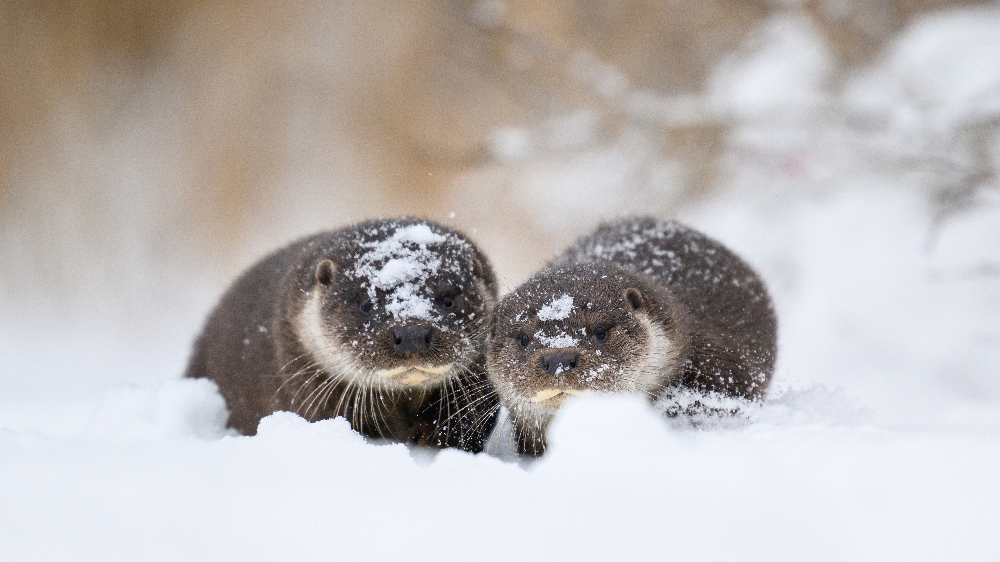
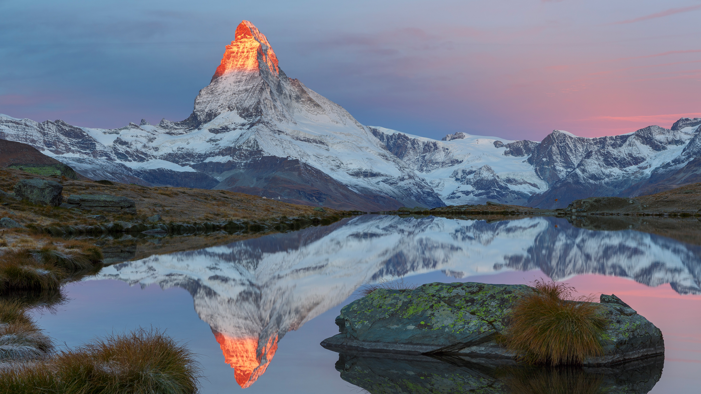
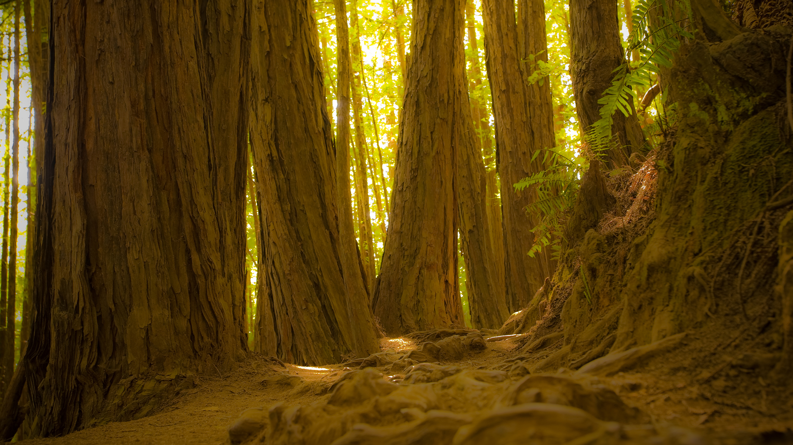
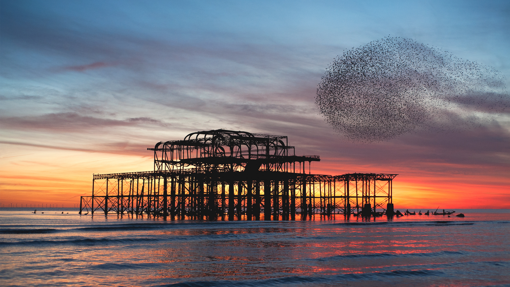
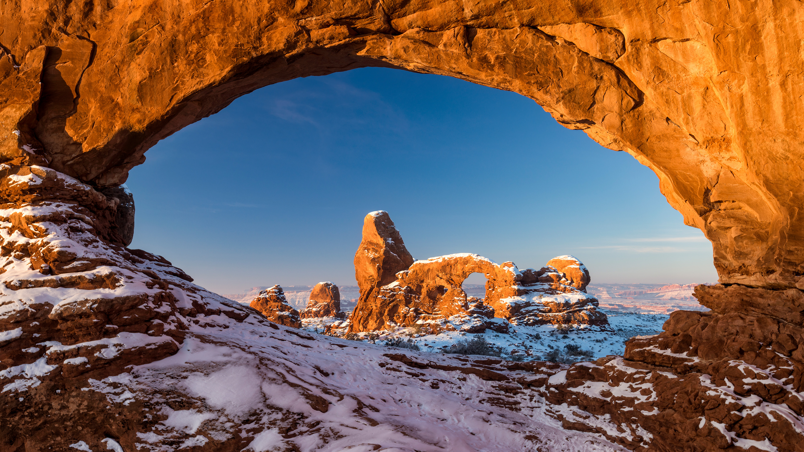
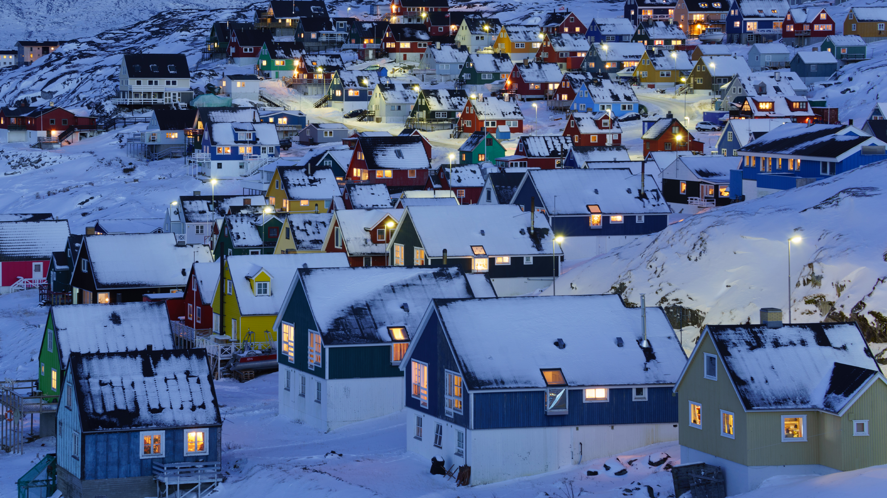
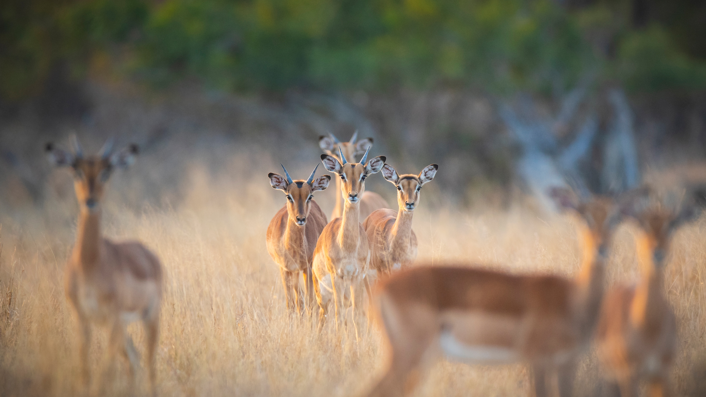
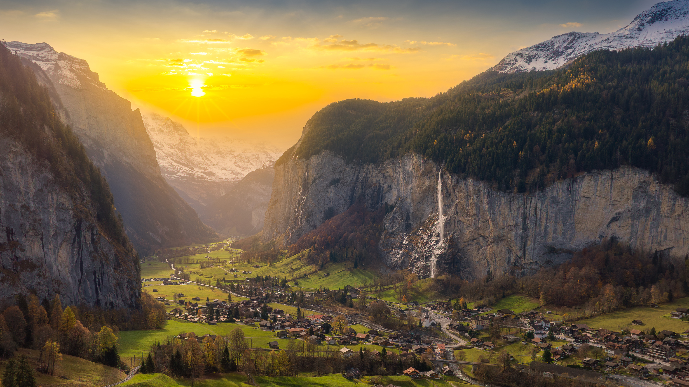
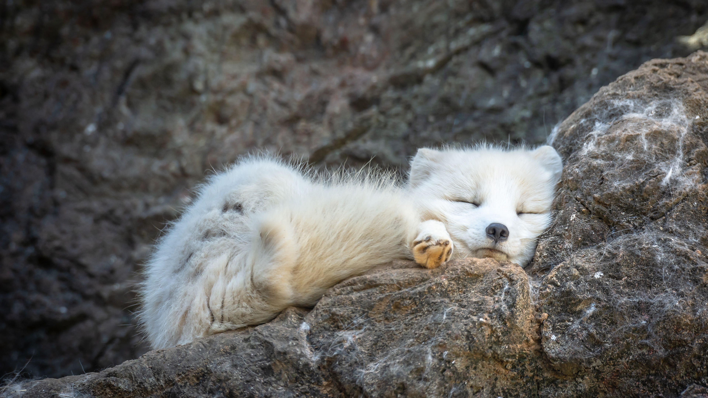

# wallpaper

bing wallpaper 4k download

### 今天 today :
 [欧亚水獭和幼崽, 爱沙尼亚 (© Sven Zacek/naturepl.com)](https://cn.bing.com/th?id=OHR.SnowOtters_ZH-CN3563991803_UHD.jpg) 2026-01-12

### 2026-01

|     |    |
| ---- | ---- |
 | [欧亚水獭和幼崽, 爱沙尼亚 (© Sven Zacek/naturepl.com)](https://cn.bing.com/th?id=OHR.SnowOtters_ZH-CN3563991803_UHD.jpg&rf=LaDigue_UHD.jpg&pid=hp&w=3840&h=2160&rs=1&c=4) 2026-01-12 | [舍夫沙万的蓝色墙壁, 摩洛哥 (© AnetteAndersen/Getty Images)](https://cn.bing.com/th?id=OHR.BlueMorocco_ZH-CN3296596109_UHD.jpg&rf=LaDigue_UHD.jpg&pid=hp&w=3840&h=2160&rs=1&c=4) 2026-01-11|
 | [日出时分，马特洪峰的倒影映照在斯特利湖中, 采尔马特, 瑞士 (© Andy Trowbridge/naturepl.com)](https://cn.bing.com/th?id=OHR.MatterhornSunrise_ZH-CN3171879631_UHD.jpg&rf=LaDigue_UHD.jpg&pid=hp&w=3840&h=2160&rs=1&c=4) 2026-01-10 | [缪尔树林国家保护区的巨型红杉树林, 加利福尼亚州, 美国 (© photo by canderson/Getty Images)](https://cn.bing.com/th?id=OHR.MuirWoodsMonument_ZH-CN2985538001_UHD.jpg&rf=LaDigue_UHD.jpg&pid=hp&w=3840&h=2160&rs=1&c=4) 2026-01-09|
 | [椋鸟群在布莱顿西码头废墟上空盘旋, 英格兰 (© Philip Reeve/Photodisc/Getty Images)](https://cn.bing.com/th?id=OHR.StarlingBrighton2025_ZH-CN2775446092_UHD.jpg&rf=LaDigue_UHD.jpg&pid=hp&w=3840&h=2160&rs=1&c=4) 2026-01-08 | [拱门国家公园的北窗框景中的炮塔拱门, 犹他州, 美国 (© Jim Patterson/TANDEM Stills + Motion)](https://cn.bing.com/th?id=OHR.OldRockArch_ZH-CN2061140260_UHD.jpg&rf=LaDigue_UHD.jpg&pid=hp&w=3840&h=2160&rs=1&c=4) 2026-01-07|
 | [努克, 格陵兰 (© nevereverro/Getty Images)](https://cn.bing.com/th?id=OHR.NuukGreenland_ZH-CN2414771686_UHD.jpg&rf=LaDigue_UHD.jpg&pid=hp&w=3840&h=2160&rs=1&c=4) 2026-01-06 | [一群高角羚, 隆多洛齐野生动物保护区, 南非 (© Mint Images/Getty Images)](https://cn.bing.com/th?id=OHR.ImpalaRooibok_ZH-CN2307890154_UHD.jpg&rf=LaDigue_UHD.jpg&pid=hp&w=3840&h=2160&rs=1&c=4) 2026-01-05|
 | [国王山, 楚加奇山脉, 阿拉斯加, 美国 (© Chris Moore - Exploring Light Photography/TANDEM Stills + Motion)](https://cn.bing.com/th?id=OHR.KingMountain_ZH-CN0397508222_UHD.jpg&rf=LaDigue_UHD.jpg&pid=hp&w=3840&h=2160&rs=1&c=4) 2026-01-04 | [劳特布隆嫩的施陶巴赫瀑布, 伯尔尼州, 瑞士 (© pongnathee kluaythong/Getty Images)](https://cn.bing.com/th?id=OHR.LauterbrunnenValley_ZH-CN0118001217_UHD.jpg&rf=LaDigue_UHD.jpg&pid=hp&w=3840&h=2160&rs=1&c=4) 2026-01-03|
 | [威尼斯鸟瞰图, 意大利 (© Clement Leonard/Getty Images)](https://cn.bing.com/th?id=OHR.VeniceView_ZH-CN3088407995_UHD.jpg&rf=LaDigue_UHD.jpg&pid=hp&w=3840&h=2160&rs=1&c=4) 2026-01-02 | [正在睡觉的北极狐 (© Chansak Joe/Getty Images)](https://cn.bing.com/th?id=OHR.NewYearFox_ZH-CN9312618796_UHD.jpg&rf=LaDigue_UHD.jpg&pid=hp&w=3840&h=2160&rs=1&c=4) 2026-01-01|

### 存档 archive :
[2021.md](archive/2021.md) 

[2022.md](archive/2022.md) 

[2023.md](archive/2023.md) 

[2024.md](archive/2024.md) 

[2025.md](archive/2025.md) 

