# wallpaper

bing wallpaper 4k download

### 今天 today :
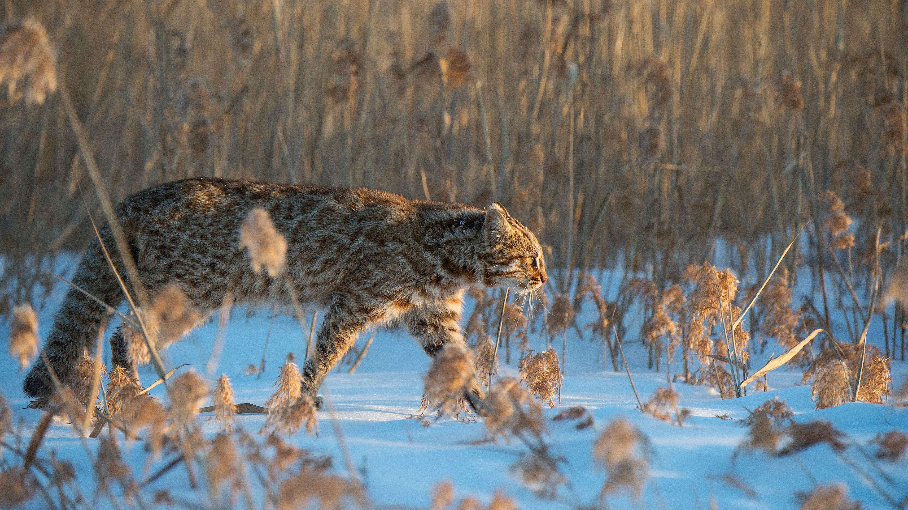 [阿穆尔豹猫，俄罗斯 (© Valeriy Maleev/naturepl.com)](https://cn.bing.com/th?id=OHR.LeopardCat_ZH-CN4431427444_UHD.jpg) 2026-02-09

### 2026-02

|     |    |
| ---- | ---- |
 | [阿穆尔豹猫，俄罗斯 (© Valeriy Maleev/naturepl.com)](https://cn.bing.com/th?id=OHR.LeopardCat_ZH-CN4431427444_UHD.jpg&rf=LaDigue_UHD.jpg&pid=hp&w=3840&h=2160&rs=1&c=4) 2026-02-09 |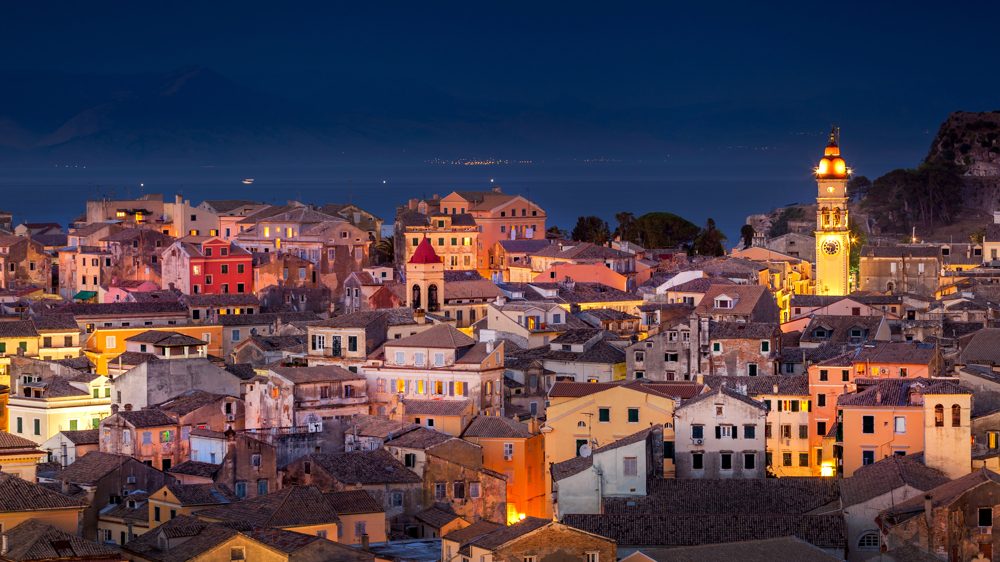 [科孚岛的夜晚, 希腊 (© whitewizzard/Getty Images)](https://cn.bing.com/th?id=OHR.CorfuGreece_ZH-CN4305970968_UHD.jpg&rf=LaDigue_UHD.jpg&pid=hp&w=3840&h=2160&rs=1&c=4) 2026-02-08|
 | [玻利维亚乌尤尼盐湖 (© Abstract Aerial Art/Getty Images)](https://cn.bing.com/th?id=OHR.SalarUyuni_ZH-CN4163237089_UHD.jpg&rf=LaDigue_UHD.jpg&pid=hp&w=3840&h=2160&rs=1&c=4) 2026-02-07 |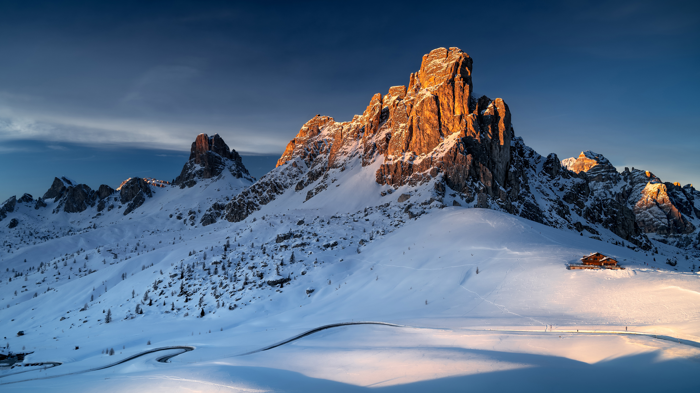 [贾乌山口的拉古塞拉峰, 在科尔蒂纳丹佩佐附近, 意大利 (© Tomasz Podolski/Getty Images)](https://cn.bing.com/th?id=OHR.GiauPass_ZH-CN3901214501_UHD.jpg&rf=LaDigue_UHD.jpg&pid=hp&w=3840&h=2160&rs=1&c=4) 2026-02-06|
 |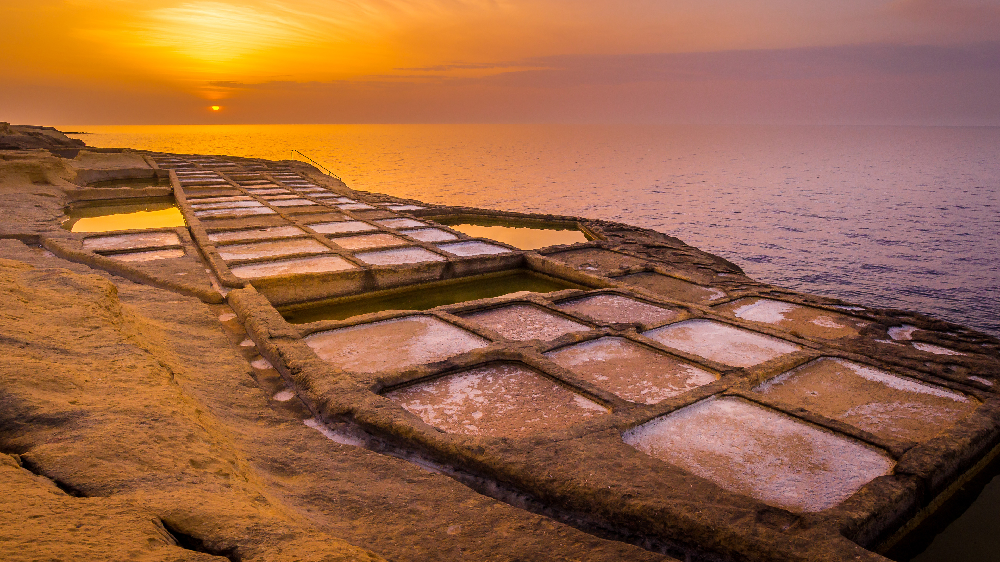 [戈佐岛上的盐田, 马耳他 (© Marius Roman/Getty Images)](https://cn.bing.com/th?id=OHR.MaltaSalt_ZH-CN7025158187_UHD.jpg&rf=LaDigue_UHD.jpg&pid=hp&w=3840&h=2160&rs=1&c=4) 2026-02-05 | [雪中​​的红鸢 (© Carl Mckie/500px/Getty Images)](https://cn.bing.com/th?id=OHR.BigGardenBirdwatch2026_ZH-CN6864628198_UHD.jpg&rf=LaDigue_UHD.jpg&pid=hp&w=3840&h=2160&rs=1&c=4) 2026-02-04|
 |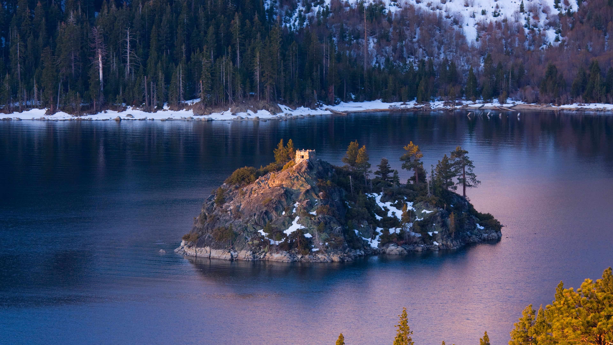 [翡翠湾和范内特岛, 太浩湖, 加利福尼亚州, 美国 (© Bill Stevenson/Cavan Images)](https://cn.bing.com/th?id=OHR.FanetteIsland_ZH-CN6466809551_UHD.jpg&rf=LaDigue_UHD.jpg&pid=hp&w=3840&h=2160&rs=1&c=4) 2026-02-03 |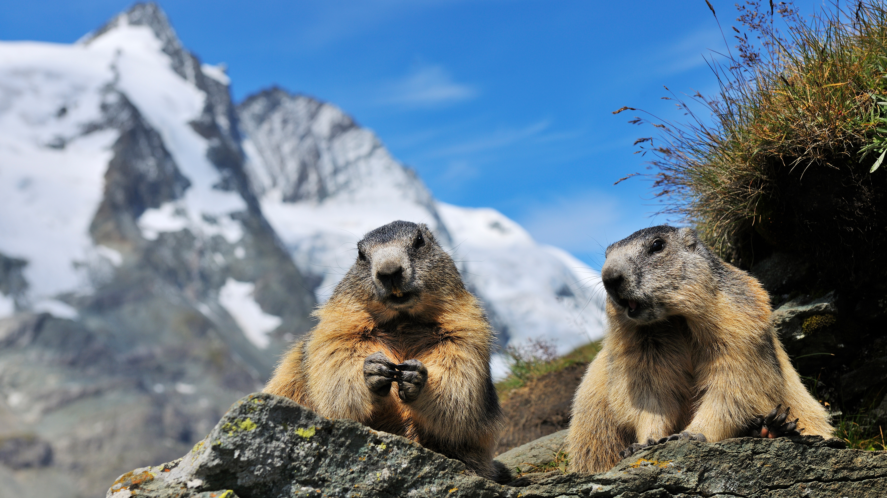 [阿尔卑斯山土拨鼠, 霍赫陶恩国家公园, 奥地利 (© Raimund Linke/Getty Images)](https://cn.bing.com/th?id=OHR.AlpineMarmots_ZH-CN6323637910_UHD.jpg&rf=LaDigue_UHD.jpg&pid=hp&w=3840&h=2160&rs=1&c=4) 2026-02-02|
 |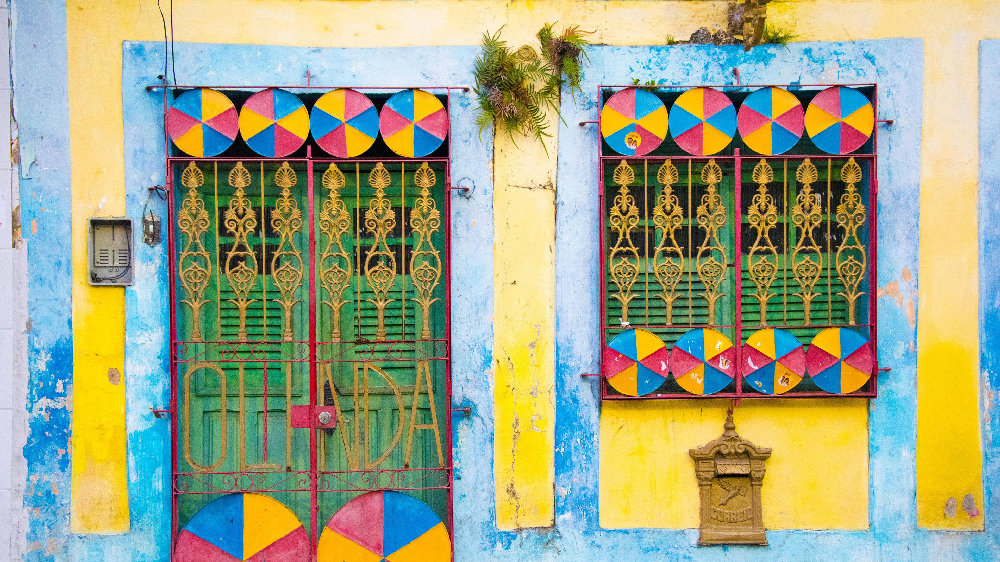 [奥林达的彩色房子, 巴西 (© Robert Pekar/Alamy)](https://cn.bing.com/th?id=OHR.Olinda_ZH-CN6216385346_UHD.jpg&rf=LaDigue_UHD.jpg&pid=hp&w=3840&h=2160&rs=1&c=4) 2026-02-01|
### 2026-01

|     |    |
| ---- | ---- |
 | [平原斑马, 埃托沙国家公园, 纳米比亚 (© Mogens Trolle/Shutterstock)](https://cn.bing.com/th?id=OHR.EtoshaZebra_ZH-CN6068087794_UHD.jpg&rf=LaDigue_UHD.jpg&pid=hp&w=3840&h=2160&rs=1&c=4) 2026-01-31|
 | [马拉齐翁的圣迈克尔山, 康沃尔郡, 英格兰 (© Baxter Bradford/robertharding/Getty Images)](https://cn.bing.com/th?id=OHR.StMichaelsCornwall_ZH-CN5878042411_UHD.jpg&rf=LaDigue_UHD.jpg&pid=hp&w=3840&h=2160&rs=1&c=4) 2026-01-30 | [密尔沃基市政厅的八层开放式中庭，威斯康星州，美国 (© lavin photography/Getty Images)](https://cn.bing.com/th?id=OHR.MilwaukeeHall_ZH-CN5779477975_UHD.jpg&rf=LaDigue_UHD.jpg&pid=hp&w=3840&h=2160&rs=1&c=4) 2026-01-29|
 |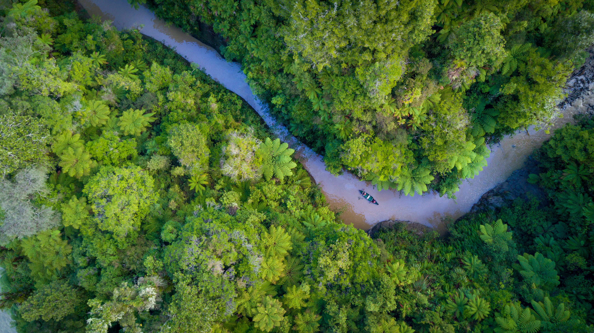 [旺格努伊国家公园，雷塔鲁克，新西兰 (© Matthew Micah Wright/Getty Images)](https://cn.bing.com/th?id=OHR.WhanganuiPark_ZH-CN5664518836_UHD.jpg&rf=LaDigue_UHD.jpg&pid=hp&w=3840&h=2160&rs=1&c=4) 2026-01-28 |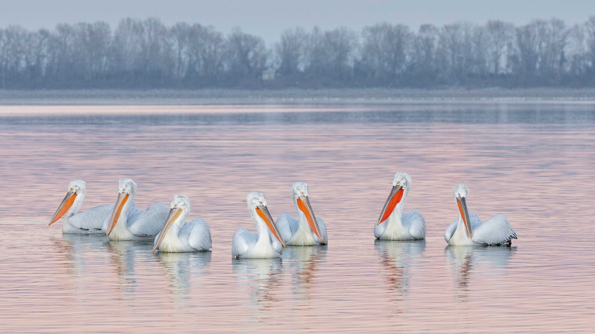 [卷羽鹈鹕，凯尔基尼湖，希腊 (© Guy Edwardes/naturepl.com)](https://cn.bing.com/th?id=OHR.DalmationPelicans_ZH-CN5252732863_UHD.jpg&rf=LaDigue_UHD.jpg&pid=hp&w=3840&h=2160&rs=1&c=4) 2026-01-27|
 |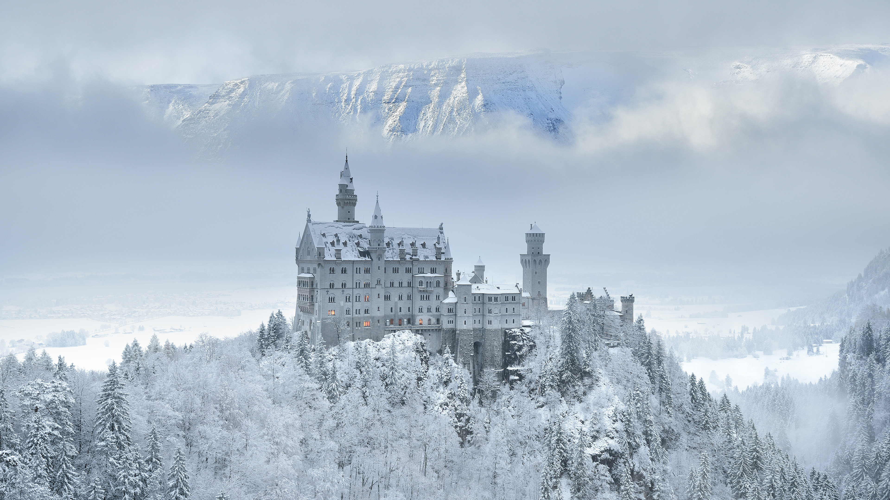 [新天鹅堡，巴伐利亚州，德国 (© www.fredconcha.com @ All Rights Reserved/Getty Images)](https://cn.bing.com/th?id=OHR.NeuschwansteinWinter_ZH-CN4972014681_UHD.jpg&rf=LaDigue_UHD.jpg&pid=hp&w=3840&h=2160&rs=1&c=4) 2026-01-26 |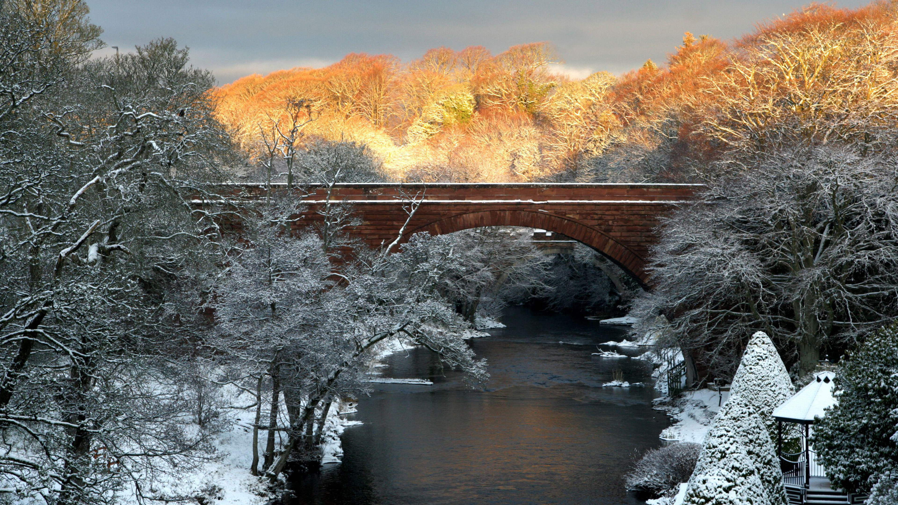 [伯恩斯国家遗产公园，艾尔，南艾尔郡，苏格兰 (© Alister Firth/Alamy)](https://cn.bing.com/th?id=OHR.BurnsPark_ZH-CN4442772228_UHD.jpg&rf=LaDigue_UHD.jpg&pid=hp&w=3840&h=2160&rs=1&c=4) 2026-01-25|
 |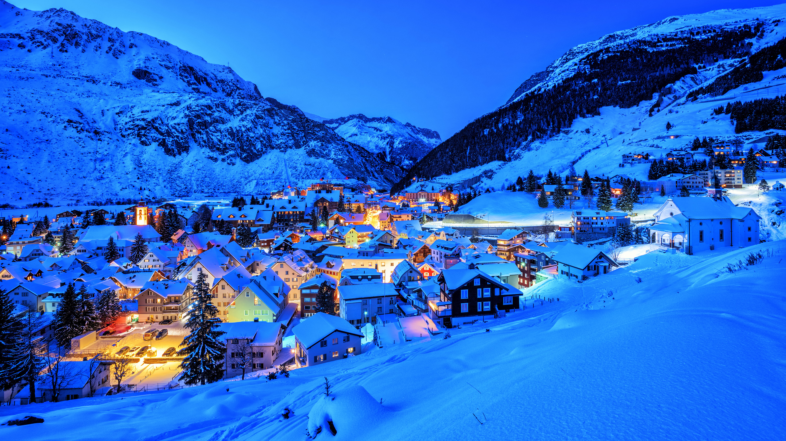 [阿尔卑斯山脉的安德马特小镇，瑞士 (© Xantana/Getty Images)](https://cn.bing.com/th?id=OHR.AndermattSwiss_ZH-CN4112824348_UHD.jpg&rf=LaDigue_UHD.jpg&pid=hp&w=3840&h=2160&rs=1&c=4) 2026-01-24 |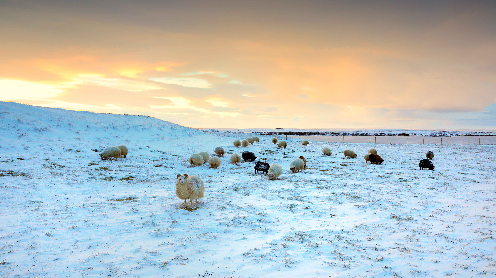 [绵羊在雪地里吃草，冰岛 (© Christophe Lehenaff/Getty Images)](https://cn.bing.com/th?id=OHR.IcelandSheep_ZH-CN3931993073_UHD.jpg&rf=LaDigue_UHD.jpg&pid=hp&w=3840&h=2160&rs=1&c=4) 2026-01-23|
 |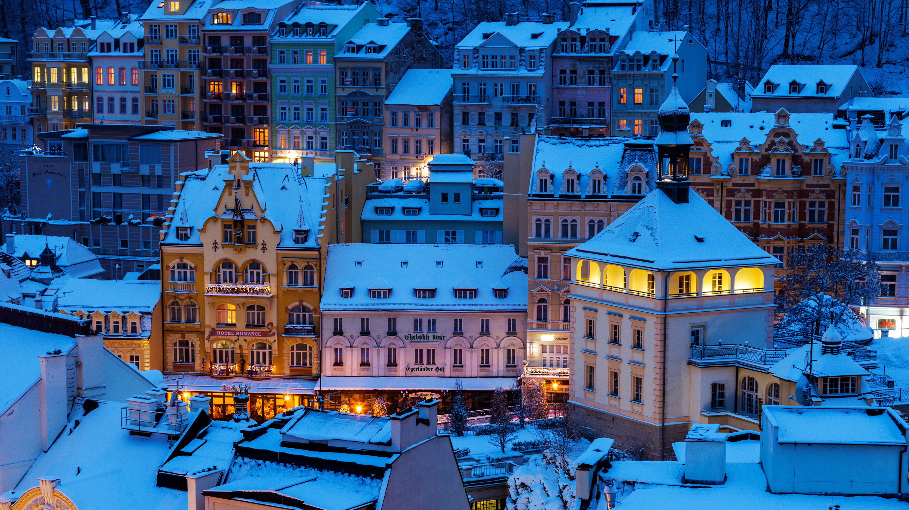 [卡罗维瓦利，波西米亚，捷克共和国 (© Henryk Sadura/Getty Images)](https://cn.bing.com/th?id=OHR.KarlovyVary_ZH-CN7585938362_UHD.jpg&rf=LaDigue_UHD.jpg&pid=hp&w=3840&h=2160&rs=1&c=4) 2026-01-22 |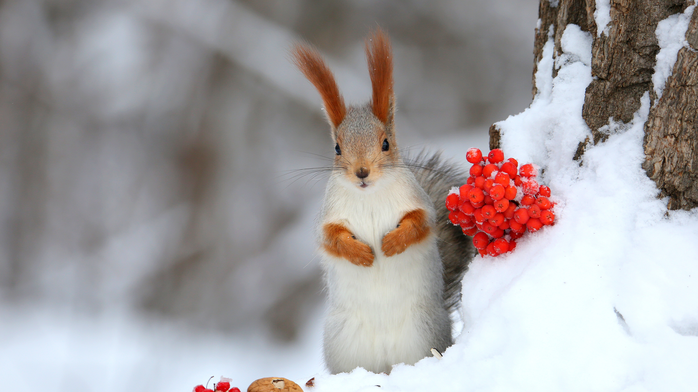 [欧亚红松鼠 (© Galina Jacyna/Getty Images)](https://cn.bing.com/th?id=OHR.BerrySquirrel_ZH-CN7382553646_UHD.jpg&rf=LaDigue_UHD.jpg&pid=hp&w=3840&h=2160&rs=1&c=4) 2026-01-21|
 | [栖息在树枝上的北长尾山雀，大庆市，中国黑龙江省 (© Visual China Group/Getty Images)](https://cn.bing.com/th?id=OHR.TheGreatColdY25_ZH-CN7239762815_UHD.jpg&rf=LaDigue_UHD.jpg&pid=hp&w=3840&h=2160&rs=1&c=4) 2026-01-20 | [亚伯拉罕湖冰封景象，艾伯塔省，加拿大 (© Luis F Arevalo/Getty Images)](https://cn.bing.com/th?id=OHR.BubblesAbraham_ZH-CN7203734882_UHD.jpg&rf=LaDigue_UHD.jpg&pid=hp&w=3840&h=2160&rs=1&c=4) 2026-01-19|
 |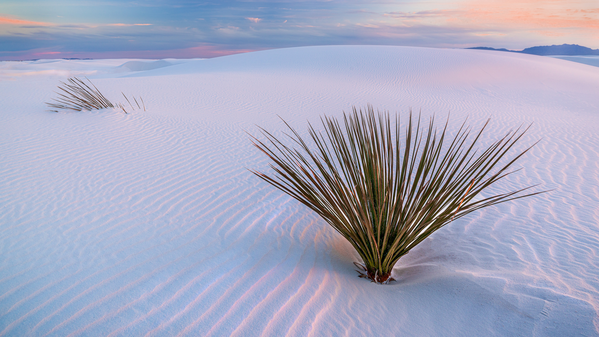 [白沙国家公园，新墨西哥州，美国 (© Francesco Carucci/Getty Images)](https://cn.bing.com/th?id=OHR.WhiteSandsNM_ZH-CN7070772772_UHD.jpg&rf=LaDigue_UHD.jpg&pid=hp&w=3840&h=2160&rs=1&c=4) 2026-01-18 | [保罗圣方济圣殿，那不勒斯，意大利 (© javarman3/Getty Images)](https://cn.bing.com/th?id=OHR.NaplesBasilica_ZH-CN6888150174_UHD.jpg&rf=LaDigue_UHD.jpg&pid=hp&w=3840&h=2160&rs=1&c=4) 2026-01-17|
 |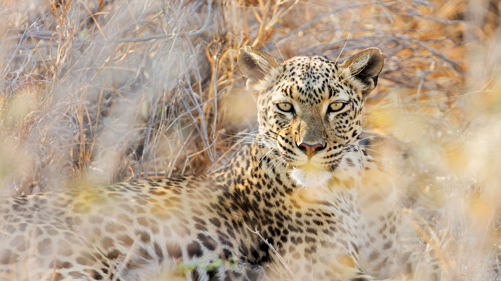 [埃托沙国家公园的豹子，纳米比亚 (© Norbert Achtelik/Cavan Images)](https://cn.bing.com/th?id=OHR.EtoshaLeopard_ZH-CN6654006040_UHD.jpg&rf=LaDigue_UHD.jpg&pid=hp&w=3840&h=2160&rs=1&c=4) 2026-01-16 |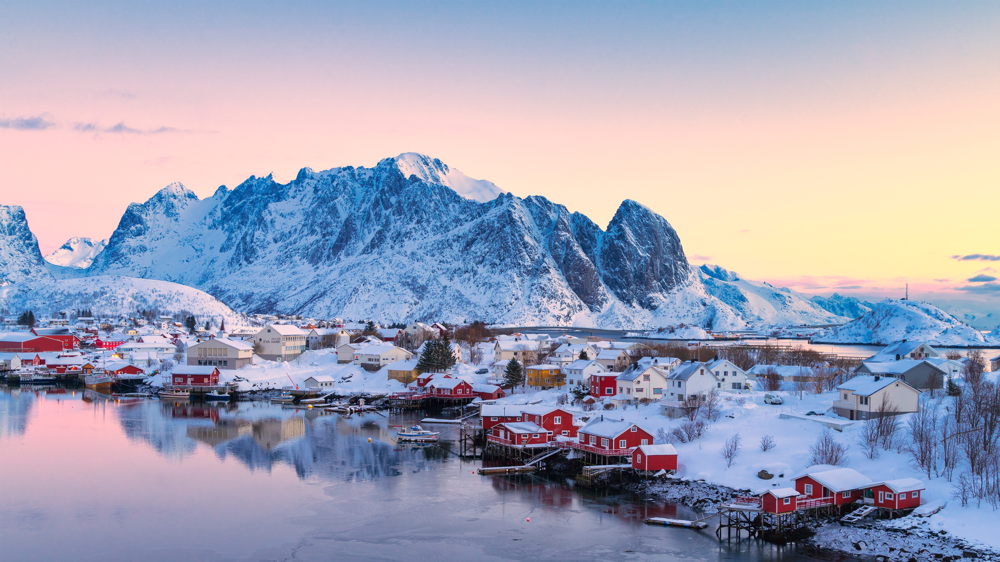 [雷讷渔村, 挪威 (© Roberto Moiola/Cavan Images/SuperStock)](https://cn.bing.com/th?id=OHR.ReineSunrise_ZH-CN6297586399_UHD.jpg&rf=LaDigue_UHD.jpg&pid=hp&w=3840&h=2160&rs=1&c=4) 2026-01-15|
 |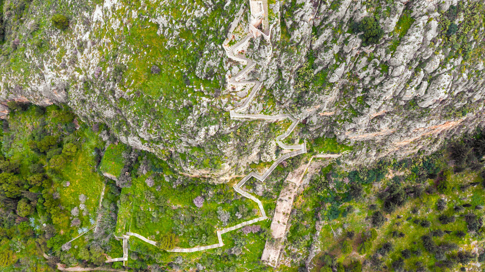 [帕拉米蒂要塞的阶梯, 纳夫普利翁, 希腊 (© George Pachantouris/Getty Images)](https://cn.bing.com/th?id=OHR.PalamidiFortress_ZH-CN5420143053_UHD.jpg&rf=LaDigue_UHD.jpg&pid=hp&w=3840&h=2160&rs=1&c=4) 2026-01-14 |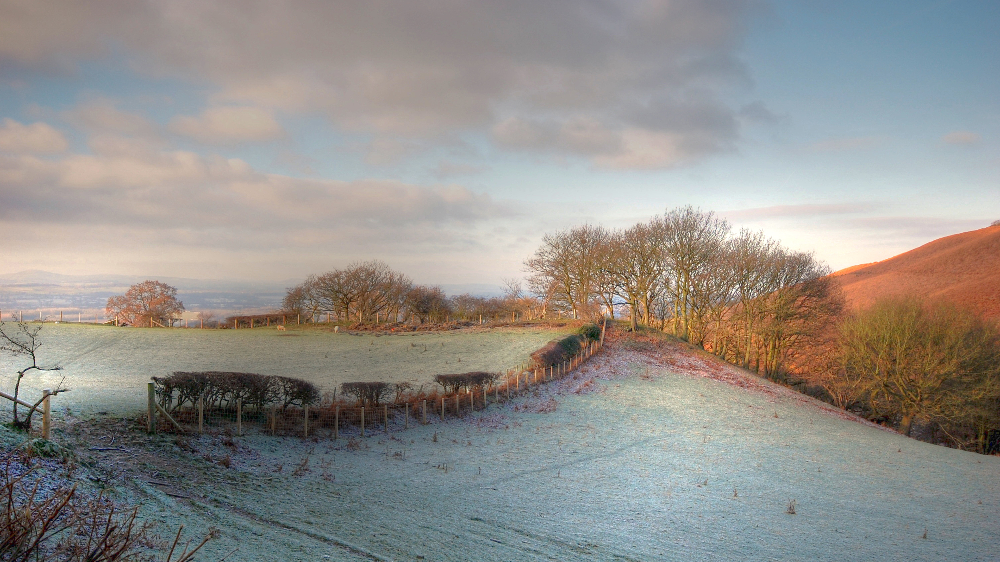 [克卢伊德谷, 威尔士 (© Valerie Blencowe/Getty Images)](https://cn.bing.com/th?id=OHR.WalesWinter_ZH-CN3692879767_UHD.jpg&rf=LaDigue_UHD.jpg&pid=hp&w=3840&h=2160&rs=1&c=4) 2026-01-13|
 | [欧亚水獭和幼崽, 爱沙尼亚 (© Sven Zacek/naturepl.com)](https://cn.bing.com/th?id=OHR.SnowOtters_ZH-CN3563991803_UHD.jpg&rf=LaDigue_UHD.jpg&pid=hp&w=3840&h=2160&rs=1&c=4) 2026-01-12 | [舍夫沙万的蓝色墙壁, 摩洛哥 (© AnetteAndersen/Getty Images)](https://cn.bing.com/th?id=OHR.BlueMorocco_ZH-CN3296596109_UHD.jpg&rf=LaDigue_UHD.jpg&pid=hp&w=3840&h=2160&rs=1&c=4) 2026-01-11|
 | [日出时分，马特洪峰的倒影映照在斯特利湖中, 采尔马特, 瑞士 (© Andy Trowbridge/naturepl.com)](https://cn.bing.com/th?id=OHR.MatterhornSunrise_ZH-CN3171879631_UHD.jpg&rf=LaDigue_UHD.jpg&pid=hp&w=3840&h=2160&rs=1&c=4) 2026-01-10 | [缪尔树林国家保护区的巨型红杉树林, 加利福尼亚州, 美国 (© photo by canderson/Getty Images)](https://cn.bing.com/th?id=OHR.MuirWoodsMonument_ZH-CN2985538001_UHD.jpg&rf=LaDigue_UHD.jpg&pid=hp&w=3840&h=2160&rs=1&c=4) 2026-01-09|
 | [椋鸟群在布莱顿西码头废墟上空盘旋, 英格兰 (© Philip Reeve/Photodisc/Getty Images)](https://cn.bing.com/th?id=OHR.StarlingBrighton2025_ZH-CN2775446092_UHD.jpg&rf=LaDigue_UHD.jpg&pid=hp&w=3840&h=2160&rs=1&c=4) 2026-01-08 | [拱门国家公园的北窗框景中的炮塔拱门, 犹他州, 美国 (© Jim Patterson/TANDEM Stills + Motion)](https://cn.bing.com/th?id=OHR.OldRockArch_ZH-CN2061140260_UHD.jpg&rf=LaDigue_UHD.jpg&pid=hp&w=3840&h=2160&rs=1&c=4) 2026-01-07|
 | [努克, 格陵兰 (© nevereverro/Getty Images)](https://cn.bing.com/th?id=OHR.NuukGreenland_ZH-CN2414771686_UHD.jpg&rf=LaDigue_UHD.jpg&pid=hp&w=3840&h=2160&rs=1&c=4) 2026-01-06 | [一群高角羚, 隆多洛齐野生动物保护区, 南非 (© Mint Images/Getty Images)](https://cn.bing.com/th?id=OHR.ImpalaRooibok_ZH-CN2307890154_UHD.jpg&rf=LaDigue_UHD.jpg&pid=hp&w=3840&h=2160&rs=1&c=4) 2026-01-05|
 | [国王山, 楚加奇山脉, 阿拉斯加, 美国 (© Chris Moore - Exploring Light Photography/TANDEM Stills + Motion)](https://cn.bing.com/th?id=OHR.KingMountain_ZH-CN0397508222_UHD.jpg&rf=LaDigue_UHD.jpg&pid=hp&w=3840&h=2160&rs=1&c=4) 2026-01-04 | [劳特布隆嫩的施陶巴赫瀑布, 伯尔尼州, 瑞士 (© pongnathee kluaythong/Getty Images)](https://cn.bing.com/th?id=OHR.LauterbrunnenValley_ZH-CN0118001217_UHD.jpg&rf=LaDigue_UHD.jpg&pid=hp&w=3840&h=2160&rs=1&c=4) 2026-01-03|
 | [威尼斯鸟瞰图, 意大利 (© Clement Leonard/Getty Images)](https://cn.bing.com/th?id=OHR.VeniceView_ZH-CN3088407995_UHD.jpg&rf=LaDigue_UHD.jpg&pid=hp&w=3840&h=2160&rs=1&c=4) 2026-01-02 | [正在睡觉的北极狐 (© Chansak Joe/Getty Images)](https://cn.bing.com/th?id=OHR.NewYearFox_ZH-CN9312618796_UHD.jpg&rf=LaDigue_UHD.jpg&pid=hp&w=3840&h=2160&rs=1&c=4) 2026-01-01|

### 存档 archive :
[2021.md](archive/2021.md) 

[2022.md](archive/2022.md) 

[2023.md](archive/2023.md) 

[2024.md](archive/2024.md) 

[2025.md](archive/2025.md) 

