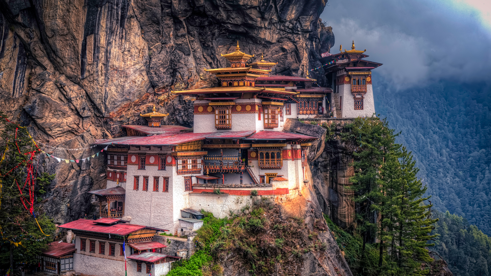

# wallpaper

bing wallpaper 4k download

### 今天 today :
 [鲍曼附近日落时分的闪电和风暴云，布拉斯加州，美国 (© john finney photography/Getty Images)](https://cn.bing.com/th?id=OHR.NebraskaStorm_ZH-CN6944682381_UHD.jpg) 2025-03-23

### 2025-03

|     |    |
| ---- | ---- |
 | [鲍曼附近日落时分的闪电和风暴云，布拉斯加州，美国 (© john finney photography/Getty Images)](https://cn.bing.com/th?id=OHR.NebraskaStorm_ZH-CN6944682381_UHD.jpg&rf=LaDigue_UHD.jpg&pid=hp&w=3840&h=2160&rs=1&c=4) 2025-03-23 | [尼特哈天然井水面上的睡莲，图卢姆，墨西哥 (© Franco Banfi/NPL/Minden)](https://cn.bing.com/th?id=OHR.CenoteLilies_ZH-CN5915682591_UHD.jpg&rf=LaDigue_UHD.jpg&pid=hp&w=3840&h=2160&rs=1&c=4) 2025-03-22|
 | [低地雨林上空的薄雾，丹浓谷，沙巴，婆罗洲，马来西亚 (© Nick Garbutt/Alamy)](https://cn.bing.com/th?id=OHR.DanumValley_ZH-CN5786482012_UHD.jpg&rf=LaDigue_UHD.jpg&pid=hp&w=3840&h=2160&rs=1&c=4) 2025-03-21 | [美丽盛开的樱花，杭州的春天，中国 (© zhang shuang/Getty Images)](https://cn.bing.com/th?id=OHR.SpringequinoxY25_ZH-CN1635828827_UHD.jpg&rf=LaDigue_UHD.jpg&pid=hp&w=3840&h=2160&rs=1&c=4) 2025-03-20|
 | [黑鹭捕鱼，乔贝国家公园，博茨瓦纳 (© Paul Souders/Minden PIctures)](https://cn.bing.com/th?id=OHR.BlackHeron_ZH-CN6764711050_UHD.jpg&rf=LaDigue_UHD.jpg&pid=hp&w=3840&h=2160&rs=1&c=4) 2025-03-19 | [红色岩层，塞多纳，亚利桑那州，美国 (© Jim Ekstrand/Alamy Stock Photo)](https://cn.bing.com/th?id=OHR.SedonaSpring_ZH-CN6305197600_UHD.jpg&rf=LaDigue_UHD.jpg&pid=hp&w=3840&h=2160&rs=1&c=4) 2025-03-18|
 | [塞缪尔·贝克特桥, 都柏林, 爱尔兰 (© Colm Keating/Tandem Stills + Motion)](https://cn.bing.com/th?id=OHR.BeckettBridge_ZH-CN6206942429_UHD.jpg&rf=LaDigue_UHD.jpg&pid=hp&w=3840&h=2160&rs=1&c=4) 2025-03-17 | [雪地里的大熊猫宝宝，中国 (© Cheryl Schneider/Alamy Stock Photo)](https://cn.bing.com/th?id=OHR.PandaSnow_ZH-CN5981854301_UHD.jpg&rf=LaDigue_UHD.jpg&pid=hp&w=3840&h=2160&rs=1&c=4) 2025-03-16|
 | [罗马广场上的罗马萨图尔诺农神庙，罗马，意大利 (© Nico De Pasquale Photography/Getty Images)](https://cn.bing.com/th?id=OHR.ForumRomanum_ZH-CN5873120178_UHD.jpg&rf=LaDigue_UHD.jpg&pid=hp&w=3840&h=2160&rs=1&c=4) 2025-03-15 | [索尔吉奈特克斯的巨石墓，巴斯克地区，阿拉瓦省，西班牙 (© David Herraez Calzada/plainpicture)](https://cn.bing.com/th?id=OHR.BasqueDolmen_ZH-CN2364777801_UHD.jpg&rf=LaDigue_UHD.jpg&pid=hp&w=3840&h=2160&rs=1&c=4) 2025-03-14|
 | [洒红节庆祝活动，斋浦尔，印度 (© powerofforever/Getty Images)](https://cn.bing.com/th?id=OHR.HoliColors_ZH-CN2177185823_UHD.jpg&rf=LaDigue_UHD.jpg&pid=hp&w=3840&h=2160&rs=1&c=4) 2025-03-13 | [卢瓦尔河畔叙利城堡, 卢瓦尔中心省, 法国 (© StockPhotoAstur/Shutterstock)](https://cn.bing.com/th?id=OHR.ChateauLoire_ZH-CN5040147638_UHD.jpg&rf=LaDigue_UHD.jpg&pid=hp&w=3840&h=2160&rs=1&c=4) 2025-03-12|
 | [努沙佩尼达岛的破碎海滩, 巴厘岛, 印度尼西亚 (© joakimbkk/Getty Images)](https://cn.bing.com/th?id=OHR.NusaPenida_ZH-CN4934656933_UHD.jpg&rf=LaDigue_UHD.jpg&pid=hp&w=3840&h=2160&rs=1&c=4) 2025-03-11 | [在伊沙沙区里正在睡觉的狮子，伊丽莎白女王国家公园，乌干达 (© Gunter Nuyts/Getty Images)](https://cn.bing.com/th?id=OHR.NappingLion_ZH-CN1214312983_UHD.jpg&rf=LaDigue_UHD.jpg&pid=hp&w=3840&h=2160&rs=1&c=4) 2025-03-10|
 | [圣马可钟楼，威尼斯，意大利 (© scaliger/Getty Images)](https://cn.bing.com/th?id=OHR.ItalyClock_ZH-CN0846995743_UHD.jpg&rf=LaDigue_UHD.jpg&pid=hp&w=3840&h=2160&rs=1&c=4) 2025-03-09 | [石勒苏益格-荷尔斯泰因州瓦登海国家公园，德国 (© 3quarks/Getty Images)](https://cn.bing.com/th?id=OHR.WaddenSeaBiosphereReserve_ZH-CN9012125146_UHD.jpg&rf=LaDigue_UHD.jpg&pid=hp&w=3840&h=2160&rs=1&c=4) 2025-03-08|
 | [中国的梅花 (© zhikun sun/Getty Images)](https://cn.bing.com/th?id=OHR.PlumBlossom_ZH-CN5888621119_UHD.jpg&rf=LaDigue_UHD.jpg&pid=hp&w=3840&h=2160&rs=1&c=4) 2025-03-07 | [沙漠大角羊，内华达州火焰谷州立公园，美国 (© Rachid Dahnoun/Cavan Images)](https://cn.bing.com/th?id=OHR.NevadaBigHorns_ZH-CN5987046965_UHD.jpg&rf=LaDigue_UHD.jpg&pid=hp&w=3840&h=2160&rs=1&c=4) 2025-03-06|
 | [俯瞰拷索山林国家公园，素叻府，泰国 (© Peetatham Kongkapech/Getty Images)](https://cn.bing.com/th?id=OHR.SuratThani_ZH-CN4797096558_UHD.jpg&rf=LaDigue_UHD.jpg&pid=hp&w=3840&h=2160&rs=1&c=4) 2025-03-05 | [杰克逊广场，新奥尔良，路易斯安那州，美国 (© SeanPavonePhoto/Getty Images)](https://cn.bing.com/th?id=OHR.MardiGrasJackson_ZH-CN3456301377_UHD.jpg&rf=LaDigue_UHD.jpg&pid=hp&w=3840&h=2160&rs=1&c=4) 2025-03-04|
 | [南黄弯嘴犀鸟，克鲁格国家公园 ，南非 (© Richard Du Toit/Minden Pictures)](https://cn.bing.com/th?id=OHR.HornbillPair_ZH-CN3380997666_UHD.jpg&rf=LaDigue_UHD.jpg&pid=hp&w=3840&h=2160&rs=1&c=4) 2025-03-03 | [桉树，梅加龙谷，蓝山山脉国家公园，新南威尔士州，澳大利亚 (© Andrew Peacock/TANDEM Stills + Motion)](https://cn.bing.com/th?id=OHR.EucalyptusForest_ZH-CN3052498076_UHD.jpg&rf=LaDigue_UHD.jpg&pid=hp&w=3840&h=2160&rs=1&c=4) 2025-03-02|
 | [玛琳湖精灵岛上空的北极光，贾斯珀国家公园，加拿大 (© Mumemories/Getty Images)](https://cn.bing.com/th?id=OHR.MaligneLakeJasper_ZH-CN2664289451_UHD.jpg&rf=LaDigue_UHD.jpg&pid=hp&w=3840&h=2160&rs=1&c=4) 2025-03-01|
### 2025-02

|     |    |
| ---- | ---- |
 | [虎穴寺，不丹 (© Baron Reznik/Getty Images)](https://cn.bing.com/th?id=OHR.BhutanMonastery_ZH-CN2469401011_UHD.jpg&rf=LaDigue_UHD.jpg&pid=hp&w=3840&h=2160&rs=1&c=4) 2025-02-28|
 | [北极熊幼崽，丘吉尔，马尼托巴省，加拿大 (© Eric Baccega/NPL/Minden Pictures)](https://cn.bing.com/th?id=OHR.PolarCub_ZH-CN1179361319_UHD.jpg&rf=LaDigue_UHD.jpg&pid=hp&w=3840&h=2160&rs=1&c=4) 2025-02-27 | [莱奇湖上的斯托克尔城堡，阿盖尔郡，苏格兰 (© WLDavies/Getty Images)](https://cn.bing.com/th?id=OHR.ArgyllStalker_ZH-CN0970395078_UHD.jpg&rf=LaDigue_UHD.jpg&pid=hp&w=3840&h=2160&rs=1&c=4) 2025-02-26|
 | [砂岩石柱，布莱斯峡谷国家公园，犹他州，美国 (© Stephen Matera/TANDEM Stills + Motion)](https://cn.bing.com/th?id=OHR.BryceHoodoos_ZH-CN0817211446_UHD.jpg&rf=LaDigue_UHD.jpg&pid=hp&w=3840&h=2160&rs=1&c=4) 2025-02-25 | [斯潘塞湾的一群伞膜乌贼, 怀阿拉,南澳大利亚 (© Gary Bell/Minden Pictures)](https://cn.bing.com/th?id=OHR.GiantCuttlefish_ZH-CN0670915878_UHD.jpg&rf=LaDigue_UHD.jpg&pid=hp&w=3840&h=2160&rs=1&c=4) 2025-02-24|
 | [日出时分的富士山, 河口湖, 日本 (© Twenty47studio/Getty Images)](https://cn.bing.com/th?id=OHR.MtFujiSunrise_ZH-CN0567499176_UHD.jpg&rf=LaDigue_UHD.jpg&pid=hp&w=3840&h=2160&rs=1&c=4) 2025-02-23 | [圣路易斯拱门, 密苏里州, 美国 (© f11photo/Getty Images)](https://cn.bing.com/th?id=OHR.StLouisArch_ZH-CN0442955735_UHD.jpg&rf=LaDigue_UHD.jpg&pid=hp&w=3840&h=2160&rs=1&c=4) 2025-02-22|
 | [希莫加附近的 Champaka Sarasi 池塘，卡纳塔克邦，印度 (© Amith Nag Photography/Getty Images)](https://cn.bing.com/th?id=OHR.ChampakaSarasi_ZH-CN0254940579_UHD.jpg&rf=LaDigue_UHD.jpg&pid=hp&w=3840&h=2160&rs=1&c=4) 2025-02-21 | [马鹿，加拿大 (© Delbars/Getty Images)](https://cn.bing.com/th?id=OHR.CanadaDeer_ZH-CN0631345798_UHD.jpg&rf=LaDigue_UHD.jpg&pid=hp&w=3840&h=2160&rs=1&c=4) 2025-02-20|
 | [欧亚水獭，莱利斯塔德，荷兰 (© Ernst Dirksen/Minden Pictures)](https://cn.bing.com/th?id=OHR.IceHoleOtter_ZH-CN0106321041_UHD.jpg&rf=LaDigue_UHD.jpg&pid=hp&w=3840&h=2160&rs=1&c=4) 2025-02-19 | [大蓝洞，伯利兹 (© JamiesOnAMission/Shutterstock)](https://cn.bing.com/th?id=OHR.BlueBelize_ZH-CN9875040666_UHD.jpg&rf=LaDigue_UHD.jpg&pid=hp&w=3840&h=2160&rs=1&c=4) 2025-02-18|
 | [Coll d'Ares，加泰罗尼亚比利牛斯​​山脉 (© CRISTIAN IONUT ZAHARIA/Shutterstock)](https://cn.bing.com/th?id=OHR.CatalanPyrenees_ZH-CN9699602584_UHD.jpg&rf=LaDigue_UHD.jpg&pid=hp&w=3840&h=2160&rs=1&c=4) 2025-02-17 | [两只麦哲伦企鹅，福克兰群岛 (© Vicki Jauron, Babylon and Beyond Photography/Getty Images)](https://cn.bing.com/th?id=OHR.PenguinLove_ZH-CN9124008164_UHD.jpg&rf=LaDigue_UHD.jpg&pid=hp&w=3840&h=2160&rs=1&c=4) 2025-02-14|
 | [泰瑞尔湖，维多利亚州，澳大利亚 (© Monica Bertolazzi/Getty Images)](https://cn.bing.com/th?id=OHR.LakeTyrrell_ZH-CN8860948292_UHD.jpg&rf=LaDigue_UHD.jpg&pid=hp&w=3840&h=2160&rs=1&c=4) 2025-02-13 | [上海豫园的灯会，元宵节，上海市，中国 (© atiger/Shutterstock)](https://cn.bing.com/th?id=OHR.LanterFestival25Y_ZH-CN8547998003_UHD.jpg&rf=LaDigue_UHD.jpg&pid=hp&w=3840&h=2160&rs=1&c=4) 2025-02-12|
 | [云冈石窟，大同，山西省，中国 (© Eric Yang/Getty Images)](https://cn.bing.com/th?id=OHR.YungangGrottoes_ZH-CN8275054060_UHD.jpg&rf=LaDigue_UHD.jpg&pid=hp&w=3840&h=2160&rs=1&c=4) 2025-02-11 | [雨伞艺术装置，博罗市场，伦敦，英国 (© Malcolm P Chapman/Getty Images)](https://cn.bing.com/th?id=OHR.UmbrellaDay_ZH-CN8024305066_UHD.jpg&rf=LaDigue_UHD.jpg&pid=hp&w=3840&h=2160&rs=1&c=4) 2025-02-10|
 | [阿尔斯特罗姆角，鲍威尔湖，犹他州，美国 (© T.M. Schultze/TANDEM Stills + Motion)](https://cn.bing.com/th?id=OHR.AlstromPoint_ZH-CN7844819126_UHD.jpg&rf=LaDigue_UHD.jpg&pid=hp&w=3840&h=2160&rs=1&c=4) 2025-02-09 | [特隆赫姆的蓝色时刻，挪威 (© Jeanny Mueller/Getty Images)](https://cn.bing.com/th?id=OHR.BlueNorway_ZH-CN7489077966_UHD.jpg&rf=LaDigue_UHD.jpg&pid=hp&w=3840&h=2160&rs=1&c=4) 2025-02-07|
 | [拱门群岛，瓦拉里基海滩，南岛，新西兰 (© Francesco Vaninetti/AWL/plainpicture)](https://cn.bing.com/th?id=OHR.WhararikiBeach_ZH-CN7232913389_UHD.jpg&rf=LaDigue_UHD.jpg&pid=hp&w=3840&h=2160&rs=1&c=4) 2025-02-06 | [拱门群岛，瓦拉里基海滩，南岛，新西兰 (© Francesco Vaninetti/AWL/plainpicture)](https://cn.bing.com/th?id=OHR.ScottishSheep_ZH-CN3051181797_UHD.jpg&rf=LaDigue_UHD.jpg&pid=hp&w=3840&h=2160&rs=1&c=4) 2025-02-05|
 | [金桥，巴拿山，岘港，越南 (© Hien Phung Thu/Shutterstock)](https://cn.bing.com/th?id=OHR.GoldenBridge_ZH-CN2910740727_UHD.jpg&rf=LaDigue_UHD.jpg&pid=hp&w=3840&h=2160&rs=1&c=4) 2025-02-04 | [盛开的樱花树上的红头长尾山雀 (© Haitong Yu/Getty Images)](https://cn.bing.com/th?id=OHR.BeginningofSpring25Y_ZH-CN7356156800_UHD.jpg&rf=LaDigue_UHD.jpg&pid=hp&w=3840&h=2160&rs=1&c=4) 2025-02-03|
 | [年幼的高山土拨鼠 (© Jonas Fichtner-Pflaum/Getty Images)](https://cn.bing.com/th?id=OHR.AustriaMarmot_ZH-CN2303743586_UHD.jpg&rf=LaDigue_UHD.jpg&pid=hp&w=3840&h=2160&rs=1&c=4) 2025-02-02 | [国王岩堡垒 , 瑞士撒克逊, 德国 (© Bildagentur-online/Exss/Alamy)](https://cn.bing.com/th?id=OHR.FestungKonigsteinElbsandsteingebirge_ZH-CN2192655745_UHD.jpg&rf=LaDigue_UHD.jpg&pid=hp&w=3840&h=2160&rs=1&c=4) 2025-02-01|

### 2025-01

|     |    |
| ---- | ---- |
 | [日出时的平原斑马，莫卡拉国家公园，南非 (© EcoPrint/Shutterstock)](https://cn.bing.com/th?id=OHR.PlainsZebra_ZH-CN1989542307_UHD.jpg&rf=LaDigue_UHD.jpg&pid=hp&w=3840&h=2160&rs=1&c=4) 2025-01-31 | [罗兰多山口，奥德萨和佩迪多山国家公园，西班牙 (© Inaki Relanzon/Nature Picture Library/Alamy Stock Photo)](https://cn.bing.com/th?id=OHR.OrdesaSpain_ZH-CN1445868068_UHD.jpg&rf=LaDigue_UHD.jpg&pid=hp&w=3840&h=2160&rs=1&c=4) 2025-01-30|
 | [南京夫子庙的春节许愿牌，江苏省，中国 (© lazy dragon/Shutterstock)](https://cn.bing.com/th?id=OHR.SpringFestival25Y_ZH-CN6133182159_UHD.jpg&rf=LaDigue_UHD.jpg&pid=hp&w=3840&h=2160&rs=1&c=4) 2025-01-29 | [夜空中的烟花表演，长沙，湖南省，中国 (© Sino Images/Getty Images)](https://cn.bing.com/th?id=OHR.LunarNewYearEve25Y_ZH-CN6059625695_UHD.jpg&rf=LaDigue_UHD.jpg&pid=hp&w=3840&h=2160&rs=1&c=4) 2025-01-28|
 | [琐罗亚斯德神庙，大峡谷国家公园，亚利桑那州，美国 (© Nick Lake/Tandem Stills + Motion)](https://cn.bing.com/th?id=OHR.CanyonSnow_ZH-CN3910130781_UHD.jpg&rf=LaDigue_UHD.jpg&pid=hp&w=3840&h=2160&rs=1&c=4) 2025-01-27 | [比利时的欧洲山毛榉森林 (© Philippe Moes/Minden Pictures)](https://cn.bing.com/th?id=OHR.FrostedBeech_ZH-CN2845716018_UHD.jpg&rf=LaDigue_UHD.jpg&pid=hp&w=3840&h=2160&rs=1&c=4) 2025-01-26|
 | [波尔图，葡萄牙 (© Starcevic/Getty Images)](https://cn.bing.com/th?id=OHR.PortoSunset_ZH-CN2388246668_UHD.jpg&rf=LaDigue_UHD.jpg&pid=hp&w=3840&h=2160&rs=1&c=4) 2025-01-25 | [冰岛的史托克间歇泉 (© John and Tina Reid/Getty Images)](https://cn.bing.com/th?id=OHR.IcelandGeyser_ZH-CN2136665867_UHD.jpg&rf=LaDigue_UHD.jpg&pid=hp&w=3840&h=2160&rs=1&c=4) 2025-01-24|
 | [黄昏时的鹿谷，帕克城，犹他州，美国 (© Adventure_Photo/Getty Images)](https://cn.bing.com/th?id=OHR.DeerValley_ZH-CN6029262704_UHD.jpg&rf=LaDigue_UHD.jpg&pid=hp&w=3840&h=2160&rs=1&c=4) 2025-01-23 | [代尔修道院，佩特拉，约旦 (© Punnawit Suwuttananun/Getty Images)](https://cn.bing.com/th?id=OHR.PetraMonastery_ZH-CN5091189333_UHD.jpg&rf=LaDigue_UHD.jpg&pid=hp&w=3840&h=2160&rs=1&c=4) 2025-01-22|
 | [俯瞰那不勒斯湾和维苏威火山，意大利 (© ezypix/Getty Images)](https://cn.bing.com/th?id=OHR.NapoliPizza_ZH-CN4698906448_UHD.jpg&rf=LaDigue_UHD.jpg&pid=hp&w=3840&h=2160&rs=1&c=4) 2025-01-21 | [欧亚红松鼠与毒蘑菇 (© Edwin Giesbers/Minden Pictures)](https://cn.bing.com/th?id=OHR.DutchSquirrel_ZH-CN3896893818_UHD.jpg&rf=LaDigue_UHD.jpg&pid=hp&w=3840&h=2160&rs=1&c=4) 2025-01-20|
 | [海王星石窟，撒丁岛， 意大利 (© Carlo Murenu/Getty Images)](https://cn.bing.com/th?id=OHR.NeptunesGrotto_ZH-CN3092540170_UHD.jpg&rf=LaDigue_UHD.jpg&pid=hp&w=3840&h=2160&rs=1&c=4) 2025-01-19 | [白沙国家公园的日落，新墨西哥州，美国 (© Image Professionals GmbH/Alamy Stock Photo)](https://cn.bing.com/th?id=OHR.WhiteSandsNP_ZH-CN2517618394_UHD.jpg&rf=LaDigue_UHD.jpg&pid=hp&w=3840&h=2160&rs=1&c=4) 2025-01-18|
 | [褐鹈鹕，圣地亚哥，加利福尼亚州，美国 (© Arthur Morris/BIRDS AS ART/Getty Images)](https://cn.bing.com/th?id=OHR.PelicanPortrait_ZH-CN1928504597_UHD.jpg&rf=LaDigue_UHD.jpg&pid=hp&w=3840&h=2160&rs=1&c=4) 2025-01-17 | [尖峰国家公园的高峰步道，圣贝尼托县，加利福尼亚州，美国 (© yhelfman/Getty Images)](https://cn.bing.com/th?id=OHR.PinnaclesPeaks_ZH-CN1603877182_UHD.jpg&rf=LaDigue_UHD.jpg&pid=hp&w=3840&h=2160&rs=1&c=4) 2025-01-16|
 | [Pointe du Diable，圣皮埃尔，留尼汪岛 (© MONTICO Lionel/Alamy)](https://cn.bing.com/th?id=OHR.PointeDiable_ZH-CN0610493136_UHD.jpg&rf=LaDigue_UHD.jpg&pid=hp&w=3840&h=2160&rs=1&c=4) 2025-01-15 | [Village of Zahara de la Sierra, Cádiz province, Spain (© SEN LI/Getty Images)](https://cn.bing.com/th?id=OHR.CadizSpain_ZH-CN0032172399_UHD.jpg&rf=LaDigue_UHD.jpg&pid=hp&w=3840&h=2160&rs=1&c=4) 2025-01-14|
 | [小屋和特尔莫尔灯塔，兰德温岛，威尔士，英国 (© Westend61 on Offset/Shutterstock)](https://cn.bing.com/th?id=OHR.CoastalWales_ZH-CN9113929287_UHD.jpg&rf=LaDigue_UHD.jpg&pid=hp&w=3840&h=2160&rs=1&c=4) 2025-01-13 | [大堡礁的宝石大眼鲷鱼，澳大利亚 (© Fred Bavendam/Minden Pictures)](https://cn.bing.com/th?id=OHR.CrescentTail_ZH-CN8283248964_UHD.jpg&rf=LaDigue_UHD.jpg&pid=hp&w=3840&h=2160&rs=1&c=4) 2025-01-12|
 | [梅克内斯的Heri es-Swani，摩洛哥 (© Calin Stan/Shutterstock)](https://cn.bing.com/th?id=OHR.MeknesMorocco_ZH-CN7953910585_UHD.jpg&rf=LaDigue_UHD.jpg&pid=hp&w=3840&h=2160&rs=1&c=4) 2025-01-11 | [亚伯拉罕湖，阿尔伯塔省，加拿大 (© Basic Elements Photography/Getty Images)](https://cn.bing.com/th?id=OHR.BubbleLake_ZH-CN7146244555_UHD.jpg&rf=LaDigue_UHD.jpg&pid=hp&w=3840&h=2160&rs=1&c=4) 2025-01-10|
 | [苏丝斯黎沙丘，纳米布沙漠，纳米比亚 (© Airpano/Amazing Aerial Agency)](https://cn.bing.com/th?id=OHR.NamibiaDunes_ZH-CN5102483490_UHD.jpg&rf=LaDigue_UHD.jpg&pid=hp&w=3840&h=2160&rs=1&c=4) 2025-01-09 | [被雪覆盖的长城，中国 (© View Stock/Alamy Stock Photo)](https://cn.bing.com/th?id=OHR.GreatWallStairs_ZH-CN4045949792_UHD.jpg&rf=LaDigue_UHD.jpg&pid=hp&w=3840&h=2160&rs=1&c=4) 2025-01-08|
 | [日落时的摩拉基大圆石，南岛，新西兰 (© Douglas Pearson/eStock Photo)](https://cn.bing.com/th?id=OHR.BouldersNZ_ZH-CN6750253580_UHD.jpg&rf=LaDigue_UHD.jpg&pid=hp&w=3840&h=2160&rs=1&c=4) 2025-01-07 | [被水淹没的地下室，圣弗朗西斯大教堂，拉文纳，意大利 (© Andrea Pucci/Getty Images)](https://cn.bing.com/th?id=OHR.RavennaBasilica_ZH-CN1406474730_UHD.jpg&rf=LaDigue_UHD.jpg&pid=hp&w=3840&h=2160&rs=1&c=4) 2025-01-06|
 | [希莫加的紫红头鹦鹉，卡纳塔克邦，印度 (© Hira Punjabi/Alamy Stock Photo)](https://cn.bing.com/th?id=OHR.PlumParakeet_ZH-CN0311942558_UHD.jpg&rf=LaDigue_UHD.jpg&pid=hp&w=3840&h=2160&rs=1&c=4) 2025-01-05 | [归春河上的板约-德天瀑布，中国与越南边境 (© Shane P. White/Minden Pictures)](https://cn.bing.com/th?id=OHR.VietnamFalls_ZH-CN9659529108_UHD.jpg&rf=LaDigue_UHD.jpg&pid=hp&w=3840&h=2160&rs=1&c=4) 2025-01-04|
 | [英国拉德克里夫图书馆和万灵学院，牛津大学，英格兰 (© atiger/Shutterstock)](https://cn.bing.com/th?id=OHR.TolkienOxford_ZH-CN6331694590_UHD.jpg&rf=LaDigue_UHD.jpg&pid=hp&w=3840&h=2160&rs=1&c=4) 2025-01-03 | [阿尔德兹村上空的星轨，格劳宾登州，瑞士 (© Roberto Moiola/Getty Images)](https://cn.bing.com/th?id=OHR.ArdezSwitzerland_ZH-CN5605305240_UHD.jpg&rf=LaDigue_UHD.jpg&pid=hp&w=3840&h=2160&rs=1&c=4) 2025-01-02|
 | [在北极玩耍的北极熊 (© Ondrej Prosicky/Shutterstock)](https://cn.bing.com/th?id=OHR.PolarBearSwim_ZH-CN1000349057_UHD.jpg&rf=LaDigue_UHD.jpg&pid=hp&w=3840&h=2160&rs=1&c=4) 2025-01-01|
### 存档 archive :
[2021.md](archive/2021.md) 

[2022.md](archive/2022.md) 

[2023.md](archive/2023.md) 

[2024.md](archive/2024.md) 

