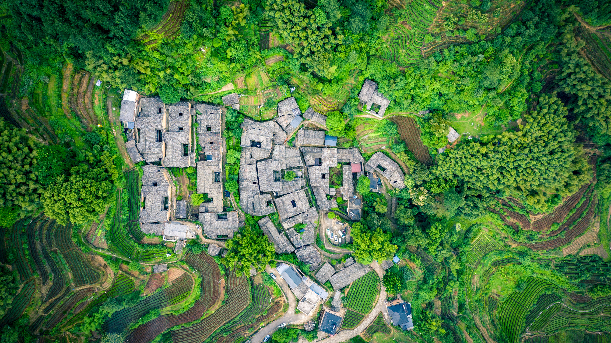
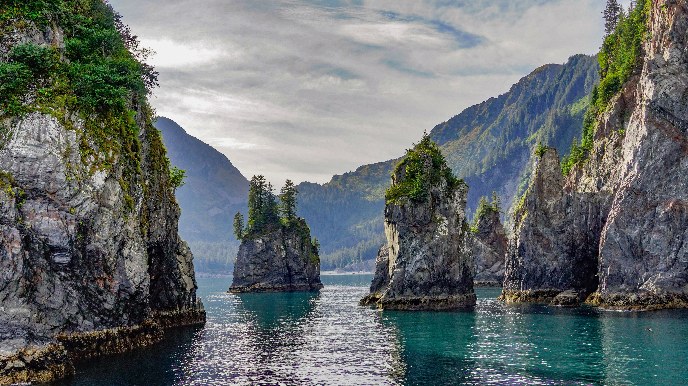
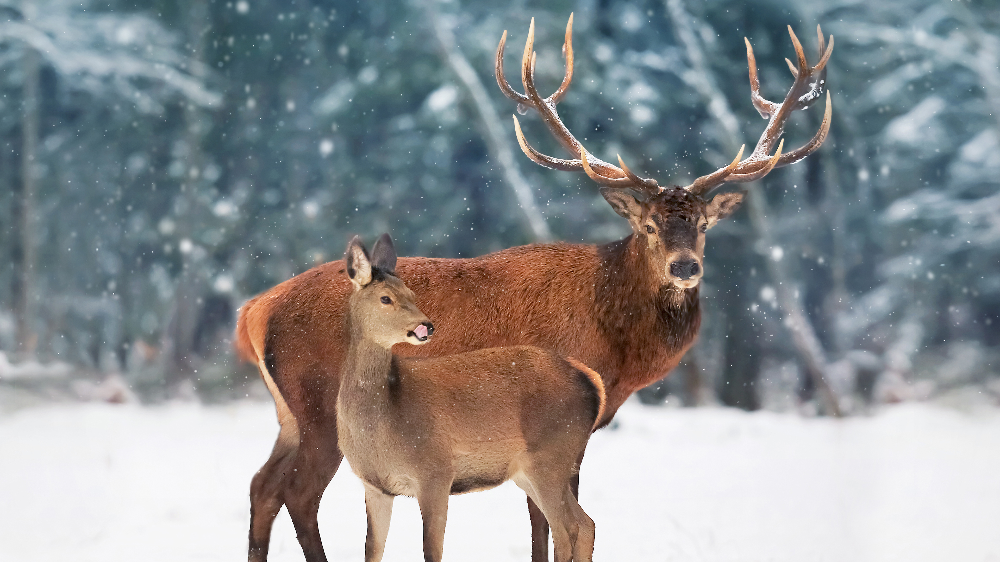

# wallpaper

bing wallpaper 4k download

### 今天 today :
 [加利西亚海域游弋的幼年大青鲨，西班牙 (© Damocean/Getty Images)](https://cn.bing.com/th?id=OHR.YoungShark_ZH-CN0887374663_UHD.jpg) 2025-07-14

### 2025-07

|     |    |
| ---- | ---- |
 | [加利西亚海域游弋的幼年大青鲨，西班牙 (© Damocean/Getty Images)](https://cn.bing.com/th?id=OHR.YoungShark_ZH-CN0887374663_UHD.jpg&rf=LaDigue_UHD.jpg&pid=hp&w=3840&h=2160&rs=1&c=4) 2025-07-14 | [卡尔夫沙马尔斯维克湾玄武岩柱，斯卡吉半岛，冰岛 (© Arterra Picture Library/Alamy Stock Photo)](https://cn.bing.com/th?id=OHR.BasaltColumns_ZH-CN0743036217_UHD.jpg&rf=LaDigue_UHD.jpg&pid=hp&w=3840&h=2160&rs=1&c=4) 2025-07-13|
 | [汤氏瞪羚母亲和小鹿，马赛马拉，肯尼亚 (© Gallo Images/DanitaDelimont.com)](https://cn.bing.com/th?id=OHR.ThomsonGazelle_ZH-CN0413171014_UHD.jpg&rf=LaDigue_UHD.jpg&pid=hp&w=3840&h=2160&rs=1&c=4) 2025-07-12 | [日出时的东京，日本 (© pongnathee kluaythong/Getty Images)](https://cn.bing.com/th?id=OHR.TokyoSunrise_ZH-CN0091906710_UHD.jpg&rf=LaDigue_UHD.jpg&pid=hp&w=3840&h=2160&rs=1&c=4) 2025-07-11|
 | [巴哈马的绿松石色水域 (© BlueOrange Studio/Adobe Stock)](https://cn.bing.com/th?id=OHR.BahamaBlues_ZH-CN8134624828_UHD.jpg&rf=LaDigue_UHD.jpg&pid=hp&w=3840&h=2160&rs=1&c=4) 2025-07-10 | [宪法火车站，布宜诺斯艾利斯，阿根廷 (© Grafissimo/Getty Images)](https://cn.bing.com/th?id=OHR.ConstitucionStation_ZH-CN7962568053_UHD.jpg&rf=LaDigue_UHD.jpg&pid=hp&w=3840&h=2160&rs=1&c=4) 2025-07-09|
 | [塞切达，多洛米蒂山脉的山峰，南蒂罗尔，意大利 (© Kalyakan/Adobe Stock)](https://cn.bing.com/th?id=OHR.SecedaPeak_ZH-CN7633793128_UHD.jpg&rf=LaDigue_UHD.jpg&pid=hp&w=3840&h=2160&rs=1&c=4) 2025-07-08 | [潜水捕鱼的北方鲣鸟，设得兰群岛，苏格兰 (© Richard Shucksmith/Minden Pictures)](https://cn.bing.com/th?id=OHR.ShetlandGannets_ZH-CN7279521125_UHD.jpg&rf=LaDigue_UHD.jpg&pid=hp&w=3840&h=2160&rs=1&c=4) 2025-07-07|
 | [死亡谷国家公园的梅斯基特平原沙丘，加利福尼亚州，美国 (© Bryan Jolley/TANDEM Stills + Motion)](https://cn.bing.com/th?id=OHR.MesquiteFlats_ZH-CN7152959188_UHD.jpg&rf=LaDigue_UHD.jpg&pid=hp&w=3840&h=2160&rs=1&c=4) 2025-07-06 | [Cize-Bolozon viaduct crossing the Ain gorge, France (© Leonid Andronov/Getty Images)](https://cn.bing.com/th?id=OHR.BolozonViaduct_ZH-CN6408632524_UHD.jpg&rf=LaDigue_UHD.jpg&pid=hp&w=3840&h=2160&rs=1&c=4) 2025-07-05|
 | [奥罗塞，撒丁岛，意大利 (© EyeEm Mobile GmbH/Getty Images)](https://cn.bing.com/th?id=OHR.OroseiSardegna_ZH-CN5789138034_UHD.jpg&rf=LaDigue_UHD.jpg&pid=hp&w=3840&h=2160&rs=1&c=4) 2025-07-04 | [彩虹泉州立公园的彩虹河，佛罗里达州，美国 (© Michel Roggo/Minden Pictures)](https://cn.bing.com/th?id=OHR.RainbowRiver_ZH-CN5320095849_UHD.jpg&rf=LaDigue_UHD.jpg&pid=hp&w=3840&h=2160&rs=1&c=4) 2025-07-03|
 | [被泡尖海葵包围的刺颊海葵鱼，米尔恩湾，巴布亚新几内亚 (© Fred Bavendam/Nature Picture Library)](https://cn.bing.com/th?id=OHR.MaroonClownfish_ZH-CN5071934692_UHD.jpg&rf=LaDigue_UHD.jpg&pid=hp&w=3840&h=2160&rs=1&c=4) 2025-07-02 | [Tilting渔村, 福戈岛 , 纽芬兰和拉布拉多省, 加拿大 (© FedevPhoto/Getty Images)](https://cn.bing.com/th?id=OHR.CanadaDayFogo_ZH-CN2593963748_UHD.jpg&rf=LaDigue_UHD.jpg&pid=hp&w=3840&h=2160&rs=1&c=4) 2025-07-01|

### 2025-06

|     |    |
| ---- | ---- |
 | [沃尔夫溪陨石坑, 澳大利亚 (© Abstract Aerial Art/Getty Images)](https://cn.bing.com/th?id=OHR.WolfeCrater_ZH-CN1652906326_UHD.jpg&rf=LaDigue_UHD.jpg&pid=hp&w=3840&h=2160&rs=1&c=4) 2025-06-30 | [Pulau Ay蓝色泻湖, 班达群岛, 印度尼西亚 (© fabio lamanna/Alamy Stock Photo)](https://cn.bing.com/th?id=OHR.BandaIsland_ZH-CN1145779264_UHD.jpg&rf=LaDigue_UHD.jpg&pid=hp&w=3840&h=2160&rs=1&c=4) 2025-06-29|
 | [曼海姆水塔, 德国 (© no limit pictures/Getty Images)](https://cn.bing.com/th?id=OHR.WatertowerMannheim_ZH-CN0692039329_UHD.jpg&rf=LaDigue_UHD.jpg&pid=hp&w=3840&h=2160&rs=1&c=4) 2025-06-28 | [Knuthöjdsmossen自然保护区, 海勒福什市, 瑞典 (© Sven Halling/DEEPOL/plainpicture)](https://cn.bing.com/th?id=OHR.SwedenReserve_ZH-CN9963744170_UHD.jpg&rf=LaDigue_UHD.jpg&pid=hp&w=3840&h=2160&rs=1&c=4) 2025-06-27|
 | [马头岩上空的银河, 新南威尔士州, 澳大利亚 (© Philip Thurston/Getty Images)](https://cn.bing.com/th?id=OHR.HorseheadRock_ZH-CN9319651125_UHD.jpg&rf=LaDigue_UHD.jpg&pid=hp&w=3840&h=2160&rs=1&c=4) 2025-06-26 | [格拉斯顿伯里托尔上的圣迈克尔塔, 格拉斯顿伯里, 萨默塞特郡, 英格兰 (© Gavin Hellier/Getty Images)](https://cn.bing.com/th?id=OHR.GlastonburyScenic_ZH-CN9162571249_UHD.jpg&rf=LaDigue_UHD.jpg&pid=hp&w=3840&h=2160&rs=1&c=4) 2025-06-25|
 | [精致拱门, 拱门国家公园, 犹他州, 美国 (© mmac72/Getty Images)](https://cn.bing.com/th?id=OHR.DelicateArch_ZH-CN8971667580_UHD.jpg&rf=LaDigue_UHD.jpg&pid=hp&w=3840&h=2160&rs=1&c=4) 2025-06-24 | [德累斯顿易北河谷, 德国 (© Sean Pavone/Getty Images)](https://cn.bing.com/th?id=OHR.DresdenElbe_ZH-CN8776977800_UHD.jpg&rf=LaDigue_UHD.jpg&pid=hp&w=3840&h=2160&rs=1&c=4) 2025-06-23|
 | [亚马逊雨林，厄瓜多尔 (© Mark Fox/Getty Images)](https://cn.bing.com/th?id=OHR.AmazonEcuador_ZH-CN2864991745_UHD.jpg&rf=LaDigue_UHD.jpg&pid=hp&w=3840&h=2160&rs=1&c=4) 2025-06-22 | [雾中莲花，中国佛山 (© huoguangliang/Getty Images)](https://cn.bing.com/th?id=OHR.SummerSolsticeY25_ZH-CN2728972774_UHD.jpg&rf=LaDigue_UHD.jpg&pid=hp&w=3840&h=2160&rs=1&c=4) 2025-06-21|
 | [一只马赛长颈鹿妈妈正在给小长颈鹿梳理毛发, 塞伦盖蒂,坦桑尼亚 (© Alberto Cassani/Getty Images)](https://cn.bing.com/th?id=OHR.SerengetiGiraffe_ZH-CN2613013393_UHD.jpg&rf=LaDigue_UHD.jpg&pid=hp&w=3840&h=2160&rs=1&c=4) 2025-06-20 | [圣卡塔琳娜州的海滩, 巴西 (© CaioCarvalhoPhotography/Getty Images)](https://cn.bing.com/th?id=OHR.WinterBegins_ZH-CN7638411804_UHD.jpg&rf=LaDigue_UHD.jpg&pid=hp&w=3840&h=2160&rs=1&c=4) 2025-06-19|
 | [红花石蒜上的柑橘凤蝶 (© lzh/Getty Images)](https://cn.bing.com/th?id=OHR.AsianSwallowtail_ZH-CN7442263508_UHD.jpg&rf=LaDigue_UHD.jpg&pid=hp&w=3840&h=2160&rs=1&c=4) 2025-06-18 | [坎伯兰岛国家海岸的海滨森林，乔治亚州，美国 (© Chris Moore/TANDEM Stills + Motion)](https://cn.bing.com/th?id=OHR.CumberlandOaks_ZH-CN7265906780_UHD.jpg&rf=LaDigue_UHD.jpg&pid=hp&w=3840&h=2160&rs=1&c=4) 2025-06-17|
 | [海龟，费尔南多·迪诺罗尼亚群岛，巴西 (© João Vianna/Getty Images)](https://cn.bing.com/th?id=OHR.SeaTurtleBrazil_ZH-CN6907161064_UHD.jpg&rf=LaDigue_UHD.jpg&pid=hp&w=3840&h=2160&rs=1&c=4) 2025-06-16 | [雄性小美洲鸵与幼鸟，托雷斯德尔潘恩国家公园，巴塔哥尼亚，智利 (© Ignacio Yufera/Minden Pictures)](https://cn.bing.com/th?id=OHR.RheaDad_ZH-CN6706868651_UHD.jpg&rf=LaDigue_UHD.jpg&pid=hp&w=3840&h=2160&rs=1&c=4) 2025-06-15|
 | [五塔峰，多洛米蒂山脉，科尔蒂纳丹佩佐，贝卢诺省，意大利威尼托大区 (© usabin/Getty Images)](https://cn.bing.com/th?id=OHR.DolomitiEstate_ZH-CN6501271709_UHD.jpg&rf=LaDigue_UHD.jpg&pid=hp&w=3840&h=2160&rs=1&c=4) 2025-06-14 | [维拉弗兰卡岛，圣米格尔岛，亚速尔群岛，葡萄牙 (© ARoxo/Getty Images)](https://cn.bing.com/th?id=OHR.SanMiguelAzores_ZH-CN2511982585_UHD.jpg&rf=LaDigue_UHD.jpg&pid=hp&w=3840&h=2160&rs=1&c=4) 2025-06-13|
 | [奇索斯山脉，大弯国家公园，德克萨斯州，美国 (© Dean Fikar/Getty Images)](https://cn.bing.com/th?id=OHR.BigBendChisos_ZH-CN3794880768_UHD.jpg&rf=LaDigue_UHD.jpg&pid=hp&w=3840&h=2160&rs=1&c=4) 2025-06-12 | [大红鹳，吕德里茨，纳米比亚 (© Karine Aigner/TANDEM Stills + Motion)](https://cn.bing.com/th?id=OHR.FlamingosNamibia_ZH-CN3639748956_UHD.jpg&rf=LaDigue_UHD.jpg&pid=hp&w=3840&h=2160&rs=1&c=4) 2025-06-11|
 | [大沼泽地国家公园的鸟瞰图，佛罗里达州，美国 (© Robert DelVecchio - OcuDrone/Getty Images)](https://cn.bing.com/th?id=OHR.AerialEverglades_ZH-CN3388982881_UHD.jpg&rf=LaDigue_UHD.jpg&pid=hp&w=3840&h=2160&rs=1&c=4) 2025-06-10 | [达尔马提亚的杜布罗夫尼克古城，克罗地亚 (© bluejayphoto/Getty Images)](https://cn.bing.com/th?id=OHR.DubrovnikTwilight_ZH-CN2981648854_UHD.jpg&rf=LaDigue_UHD.jpg&pid=hp&w=3840&h=2160&rs=1&c=4) 2025-06-09|
 | [北海狮, 温哥华岛, 不列颠哥伦比亚省, 加拿大 (© Steve Woods Photography/Getty Images)](https://cn.bing.com/th?id=OHR.StellarSeaLions_ZH-CN2859514359_UHD.jpg&rf=LaDigue_UHD.jpg&pid=hp&w=3840&h=2160&rs=1&c=4) 2025-06-08 | [松山顶峰, 洛杉矶国家森林公园, 加利福尼亚州, 美国 (© Matthew Kuhns/TANDEM Stills + Motion)](https://cn.bing.com/th?id=OHR.PacificCrestTrail_ZH-CN9582395021_UHD.jpg&rf=LaDigue_UHD.jpg&pid=hp&w=3840&h=2160&rs=1&c=4) 2025-06-07|
 | [诺曼底的阿罗芒什莱班 , 法国 (© Horia Merla/Getty Images)](https://cn.bing.com/th?id=OHR.NormandyBeach_ZH-CN9312381737_UHD.jpg&rf=LaDigue_UHD.jpg&pid=hp&w=3840&h=2160&rs=1&c=4) 2025-06-06 | [福玛萨瀑布，迪亚曼蒂纳，巴西 (© Pulsar Images/Alamy)](https://cn.bing.com/th?id=OHR.FumacinhaBahia_ZH-CN9190616593_UHD.jpg&rf=LaDigue_UHD.jpg&pid=hp&w=3840&h=2160&rs=1&c=4) 2025-06-05|
 | [卡拉卢纳海滩, 撒丁岛, 意大利 (© guenterguni/Getty Images)](https://cn.bing.com/th?id=OHR.CalaLuna_ZH-CN8174946414_UHD.jpg&rf=LaDigue_UHD.jpg&pid=hp&w=3840&h=2160&rs=1&c=4) 2025-06-04 | [乌得勒支桥上的自行车，荷兰 (© George Pachantouris/Getty Images)](https://cn.bing.com/th?id=OHR.BicyclesUtrecht_ZH-CN8016028978_UHD.jpg&rf=LaDigue_UHD.jpg&pid=hp&w=3840&h=2160&rs=1&c=4) 2025-06-03|
 | [一只停在紫锥菊上的灰蝶，洛克菲勒州立公园，纽约 (© Marianne A. Campolongo/Alamy)](https://cn.bing.com/th?id=OHR.EchinaceaButterfly_ZH-CN7877489878_UHD.jpg&rf=LaDigue_UHD.jpg&pid=hp&w=3840&h=2160&rs=1&c=4) 2025-06-02 | [格朗特尔岛附近的堡礁，法属新喀里多尼亚 (© Karsten Wrobel/Getty Images)](https://cn.bing.com/th?id=OHR.GrandeTerreReef_ZH-CN7463701309_UHD.jpg&rf=LaDigue_UHD.jpg&pid=hp&w=3840&h=2160&rs=1&c=4) 2025-06-01|

### 2025-05

|     |    |
| ---- | ---- |
 | [用彩色丝线串成的香囊，端午节前夕的庙会上，吉林省吉林市，中国 (© Visual China Group/Getty Images)](https://cn.bing.com/th?id=OHR.DuanwuFestivalY25_ZH-CN7343005503_UHD.jpg&rf=LaDigue_UHD.jpg&pid=hp&w=3840&h=2160&rs=1&c=4) 2025-05-31 | [小鸽子河，大雾山国家公园，田纳西州, 美国 (© GreenStock/Getty Images)](https://cn.bing.com/th?id=OHR.LittlePigeonRiver_ZH-CN6554251943_UHD.jpg&rf=LaDigue_UHD.jpg&pid=hp&w=3840&h=2160&rs=1&c=4) 2025-05-30|
 | [米拉韦特，埃布罗河，加泰罗尼亚塔，西班牙 (© Eloi_Omella/Getty Images)](https://cn.bing.com/th?id=OHR.MiravetSpain_ZH-CN8584568741_UHD.jpg&rf=LaDigue_UHD.jpg&pid=hp&w=3840&h=2160&rs=1&c=4) 2025-05-29 | [一只海獭漂浮在阿拉斯加海洋国家野生动物保护区的海藻床上，美国 (© Gerry Ellis/Minden Pictures)](https://cn.bing.com/th?id=OHR.KelpOtter_ZH-CN8297228161_UHD.jpg&rf=LaDigue_UHD.jpg&pid=hp&w=3840&h=2160&rs=1&c=4) 2025-05-28|
 | [梦娜维尔岩池，悉尼，澳大利亚 (© jamenpercy/Getty Images)](https://cn.bing.com/th?id=OHR.MonaValePool_ZH-CN7968271596_UHD.jpg&rf=LaDigue_UHD.jpg&pid=hp&w=3840&h=2160&rs=1&c=4) 2025-05-27 | [沿着岚山保津川行驶的火车，京都，日本 (© Alvin Huang/Getty Images)](https://cn.bing.com/th?id=OHR.Arashiyama2025_ZH-CN7836747321_UHD.jpg&rf=LaDigue_UHD.jpg&pid=hp&w=3840&h=2160&rs=1&c=4) 2025-05-26|
 | [布伦特伍德湾的布查特花园，不列颠哥伦比亚省，加拿大 (© 2009fotofriends/Shutterstock)](https://cn.bing.com/th?id=OHR.ButchartFlowers_ZH-CN6692930571_UHD.jpg&rf=LaDigue_UHD.jpg&pid=hp&w=3840&h=2160&rs=1&c=4) 2025-05-25 | [挪威尤通黑门山国家公园 (© Marisa Estivill/Shutterstock)](https://cn.bing.com/th?id=OHR.JotunheimenPark_ZH-CN7417034574_UHD.jpg&rf=LaDigue_UHD.jpg&pid=hp&w=3840&h=2160&rs=1&c=4) 2025-05-24|
 | [停在黄头侧颈龟鼻子上的茱莉亚蝶，亚马逊地区，厄瓜多尔 (© Westend61/Getty Images)](https://cn.bing.com/th?id=OHR.ButterflyTurtle_ZH-CN5706515924_UHD.jpg&rf=LaDigue_UHD.jpg&pid=hp&w=3840&h=2160&rs=1&c=4) 2025-05-23 | [日落时分的猴面包树，猴面包树大道，马达加斯加 (© Framalicious/Shutterstock)](https://cn.bing.com/th?id=OHR.BaobabAvenue_ZH-CN5217451344_UHD.jpg&rf=LaDigue_UHD.jpg&pid=hp&w=3840&h=2160&rs=1&c=4) 2025-05-22|
 | [杨家塘村茶园，松阳县，中国 (© feng xu/Getty Images)](https://cn.bing.com/th?id=OHR.SongyangTeaGarden_ZH-CN4763170909_UHD.jpg&rf=LaDigue_UHD.jpg&pid=hp&w=3840&h=2160&rs=1&c=4) 2025-05-21 | [薰衣草上的蜜蜂 (© Anthony Brown/Alamy Stock Photo)](https://cn.bing.com/th?id=OHR.HoneyBeeLavender_ZH-CN4513594236_UHD.jpg&rf=LaDigue_UHD.jpg&pid=hp&w=3840&h=2160&rs=1&c=4) 2025-05-20|
 | [汉密尔顿山, 旧金山湾区, 加利福尼亚, 美国 (© Jeffrey Lewis/TANDEM Stills + Motion)](https://cn.bing.com/th?id=OHR.MountHamilton_ZH-CN4280549129_UHD.jpg&rf=LaDigue_UHD.jpg&pid=hp&w=3840&h=2160&rs=1&c=4) 2025-05-19 | [加龙河对面的圣皮埃尔桥，图卢兹，法国 (© Image Professionals GmbH/Alamy)](https://cn.bing.com/th?id=OHR.ToulouseBridge_ZH-CN3930246927_UHD.jpg&rf=LaDigue_UHD.jpg&pid=hp&w=3840&h=2160&rs=1&c=4) 2025-05-18|
 | [威尼斯潟湖中的三角洲, 意大利 (© Dimitri Weber/Amazing Aerial Agency)](https://cn.bing.com/th?id=OHR.VeniceLagoon_ZH-CN3791408491_UHD.jpg&rf=LaDigue_UHD.jpg&pid=hp&w=3840&h=2160&rs=1&c=4) 2025-05-17 | [大绿金刚鹦鹉, 墨西哥 (© Ondrej Prosicky/Shutterstock)](https://cn.bing.com/th?id=OHR.GreenMacaw_ZH-CN3451340204_UHD.jpg&rf=LaDigue_UHD.jpg&pid=hp&w=3840&h=2160&rs=1&c=4) 2025-05-16|
 | [大本钟和国会大厦, 威斯敏斯特宫, 伦敦, 英国 (© Puthipong Worasaran/Getty Images)](https://cn.bing.com/th?id=OHR.LondonParliament_ZH-CN7089923691_UHD.jpg&rf=LaDigue_UHD.jpg&pid=hp&w=3840&h=2160&rs=1&c=4) 2025-05-15 | [弗拉维亚港, 苏尔西斯-伊格莱西恩特, 撒丁岛, 意大利 (© Marco Bottigelli/Getty Images)](https://cn.bing.com/th?id=OHR.SardiniaFlavia_ZH-CN6784449568_UHD.jpg&rf=LaDigue_UHD.jpg&pid=hp&w=3840&h=2160&rs=1&c=4) 2025-05-14|
 | [百内国家公园, 巴塔哥尼亚, 智利 (© Marco Bottigelli/Getty Images)](https://cn.bing.com/th?id=OHR.TorresChile_ZH-CN6319613148_UHD.jpg&rf=LaDigue_UHD.jpg&pid=hp&w=3840&h=2160&rs=1&c=4) 2025-05-13 | [东京的鸢尾花园, 日本 (© M.Arai/Getty Images)](https://cn.bing.com/th?id=OHR.IrisGarden_ZH-CN6226448882_UHD.jpg&rf=LaDigue_UHD.jpg&pid=hp&w=3840&h=2160&rs=1&c=4) 2025-05-12|
 | [豹妈妈正在梳理她的幼崽，Jao保护区，博茨瓦纳 (© Suzi Eszterhas/Minden Pictures)](https://cn.bing.com/th?id=OHR.LeopardMother_ZH-CN6134353524_UHD.jpg&rf=LaDigue_UHD.jpg&pid=hp&w=3840&h=2160&rs=1&c=4) 2025-05-11 | [巴尔德纳斯雷亚尔斯自然公园的卡斯蒂尔德蒂拉，纳瓦拉，西班牙 (© Eloi_Omella/Getty Images)](https://cn.bing.com/th?id=OHR.Castildetierra_ZH-CN6042529770_UHD.jpg&rf=LaDigue_UHD.jpg&pid=hp&w=3840&h=2160&rs=1&c=4) 2025-05-10|
 | [普通变色龙 (© Photostock-Israel/SPL/Getty Images)](https://cn.bing.com/th?id=OHR.CuteChameleon_ZH-CN5029981236_UHD.jpg&rf=LaDigue_UHD.jpg&pid=hp&w=3840&h=2160&rs=1&c=4) 2025-05-09 | [Rhyolite附近山谷中的驴子，内华达州，美国 (© Moelyn Photos/Getty Images)](https://cn.bing.com/th?id=OHR.RhyoliteDonkeys_ZH-CN2626127533_UHD.jpg&rf=LaDigue_UHD.jpg&pid=hp&w=3840&h=2160&rs=1&c=4) 2025-05-08|
 | [邓路斯城堡，安特里姆郡，北爱尔兰 (© DieterMeyrl/Getty Images)](https://cn.bing.com/th?id=OHR.DunluceIreland_ZH-CN2412229757_UHD.jpg&rf=LaDigue_UHD.jpg&pid=hp&w=3840&h=2160&rs=1&c=4) 2025-05-07 | [一架超轻型飞机飞越纳米比亚沙漠 (© Burt Johnson/Alamy Stock Photo)](https://cn.bing.com/th?id=OHR.FlyoverNamibia_ZH-CN2114171516_UHD.jpg&rf=LaDigue_UHD.jpg&pid=hp&w=3840&h=2160&rs=1&c=4) 2025-05-06|
 | [日出时分，美丽的喀斯特山脉鸟瞰图，中国桂林 (© zhaojiankang/Getty Images)](https://cn.bing.com/th?id=OHR.BeginningofSummer25Y_ZH-CN2000519236_UHD.jpg&rf=LaDigue_UHD.jpg&pid=hp&w=3840&h=2160&rs=1&c=4) 2025-05-05 | [西班牙广场，塞维利亚，西班牙 (© Horia Merla/Getty Images)](https://cn.bing.com/th?id=OHR.SevilleNaboo_ZH-CN1065227658_UHD.jpg&rf=LaDigue_UHD.jpg&pid=hp&w=3840&h=2160&rs=1&c=4) 2025-05-04|
 | [拱门国家公园双拱门映衬下的银河，犹他州，美国 (© Adventure_Photo/Getty Images)](https://cn.bing.com/th?id=OHR.ArchesGalaxy_ZH-CN0954505086_UHD.jpg&rf=LaDigue_UHD.jpg&pid=hp&w=3840&h=2160&rs=1&c=4) 2025-05-03 | [鸡蛋花，夏威夷，美国 (© Miranda Jans/Getty Images)](https://cn.bing.com/th?id=OHR.PinkPlumeria_ZH-CN3890147555_UHD.jpg&rf=LaDigue_UHD.jpg&pid=hp&w=3840&h=2160&rs=1&c=4) 2025-05-01|

### 2025-04

|     |    |
| ---- | ---- |
 | [从巴拉那州看到的伊瓜苏瀑布, 巴西 (© agustavop/Getty Images)](https://cn.bing.com/th?id=OHR.FozdoIguacu2025_ZH-CN3781165595_UHD.jpg&rf=LaDigue_UHD.jpg&pid=hp&w=3840&h=2160&rs=1&c=4) 2025-04-30 | [维朗德里城堡，卢瓦尔河谷，法国 (© Mint Images/Getty Images)](https://cn.bing.com/th?id=OHR.GardensVillandry_ZH-CN3660934263_UHD.jpg&rf=LaDigue_UHD.jpg&pid=hp&w=3840&h=2160&rs=1&c=4) 2025-04-29|
 | [莫雷米野生动物保护区的高角羚，博茨瓦纳 (© Paul Souders/Getty Images)](https://cn.bing.com/th?id=OHR.OrangeImpala_ZH-CN3417660107_UHD.jpg&rf=LaDigue_UHD.jpg&pid=hp&w=3840&h=2160&rs=1&c=4) 2025-04-28 | [红木国家公园和州立公园, 加利福尼亚州, 美国 (© Bob Pool/Getty Images)](https://cn.bing.com/th?id=OHR.RedwoodGrove_ZH-CN3339576686_UHD.jpg&rf=LaDigue_UHD.jpg&pid=hp&w=3840&h=2160&rs=1&c=4) 2025-04-27|
 | [印第安头湾, 布鲁斯半岛国家公园, 安大略, 加拿大 (© Maurice Prokaziuk/Getty Images)](https://cn.bing.com/th?id=OHR.BrucePeninsula_ZH-CN3258296517_UHD.jpg&rf=LaDigue_UHD.jpg&pid=hp&w=3840&h=2160&rs=1&c=4) 2025-04-26 | [麦哲伦企鹅, 志愿者角, 福克兰群岛 (© imageBROKER/Matthias Graben/Getty Images)](https://cn.bing.com/th?id=OHR.MagellanicPenguin_ZH-CN3177950090_UHD.jpg&rf=LaDigue_UHD.jpg&pid=hp&w=3840&h=2160&rs=1&c=4) 2025-04-25|
 | [阿拉斯加基奈峡湾国家公园尖顶湾, 阿拉斯加州苏厄德, 美国 (© Wander Photography/Getty Images)](https://cn.bing.com/th?id=OHR.KenaiSpires_ZH-CN3045699778_UHD.jpg&rf=LaDigue_UHD.jpg&pid=hp&w=3840&h=2160&rs=1&c=4) 2025-04-24 | [海利根港斯坦沃德海滩上的沙滩椅，石勒苏益格-荷尔斯泰因州，德国 (© Frank Lukasseck/eStock Photo)](https://cn.bing.com/th?id=OHR.BeachChairsSteinwarder_ZH-CN2947390092_UHD.jpg&rf=LaDigue_UHD.jpg&pid=hp&w=3840&h=2160&rs=1&c=4) 2025-04-23|
 | [大棱镜彩泉，黄石国家公园，怀俄明州，美国 (© Ajith Kumar/Getty Images)](https://cn.bing.com/th?id=OHR.YellowstoneSpring_ZH-CN2643482467_UHD.jpg&rf=LaDigue_UHD.jpg&pid=hp&w=3840&h=2160&rs=1&c=4) 2025-04-22 | [银河下的约书亚树，加利福尼亚州，美国 (© Chao Zhang/Getty Images)](https://cn.bing.com/th?id=OHR.JoshuaStars_ZH-CN1375098210_UHD.jpg&rf=LaDigue_UHD.jpg&pid=hp&w=3840&h=2160&rs=1&c=4) 2025-04-21|
 | [春天里的野生小兔子 (© Fiona McAllister Photography/Getty Images)](https://cn.bing.com/th?id=OHR.BunnyLove_ZH-CN1145897965_UHD.jpg&rf=LaDigue_UHD.jpg&pid=hp&w=3840&h=2160&rs=1&c=4) 2025-04-20 | [锡安国家公园，犹他州，美国 (© Simon Dannhauer/Getty Images)](https://cn.bing.com/th?id=OHR.ZionValley_ZH-CN0611524754_UHD.jpg&rf=LaDigue_UHD.jpg&pid=hp&w=3840&h=2160&rs=1&c=4) 2025-04-19|
 | [卡帕多西亚格雷梅国家公园上空的热气球，土耳其 (© Anton Petrus/Getty Images)](https://cn.bing.com/th?id=OHR.GoremeTurkey_ZH-CN0255739302_UHD.jpg&rf=LaDigue_UHD.jpg&pid=hp&w=3840&h=2160&rs=1&c=4) 2025-04-18 | [安第斯动冠伞鸟，厄瓜多尔 (© Kit Day/Alamy Stock Photo)](https://cn.bing.com/th?id=OHR.EcuadorBird_ZH-CN3676173654_UHD.jpg&rf=LaDigue_UHD.jpg&pid=hp&w=3840&h=2160&rs=1&c=4) 2025-04-17|
 | [卡奇纳桥，天然桥国家区，犹他州，美国 (© Alan Majchrowicz/Getty Images)](https://cn.bing.com/th?id=OHR.KachinaBridge_ZH-CN3333793502_UHD.jpg&rf=LaDigue_UHD.jpg&pid=hp&w=3840&h=2160&rs=1&c=4) 2025-04-16 | [卡拉奥拉城堡，格拉纳达，西班牙 (© Ugo Mellone/eStock Photo)](https://cn.bing.com/th?id=OHR.CerezoEnFlor_ZH-CN2951543796_UHD.jpg&rf=LaDigue_UHD.jpg&pid=hp&w=3840&h=2160&rs=1&c=4) 2025-04-15|
 | [圣玛丽亚岛附近的大西洋细吻海豚，亚速尔群岛，葡萄牙 (© Jordi Chias/Minden Pictures)](https://cn.bing.com/th?id=OHR.SpottedDolphins_ZH-CN1257100316_UHD.jpg&rf=LaDigue_UHD.jpg&pid=hp&w=3840&h=2160&rs=1&c=4) 2025-04-14 | [班克鲁特的唐赛寺，泰国 (© Ratnakorn Piyasirisorost/Getty Images)](https://cn.bing.com/th?id=OHR.ThailandPagodas_ZH-CN1143878296_UHD.jpg&rf=LaDigue_UHD.jpg&pid=hp&w=3840&h=2160&rs=1&c=4) 2025-04-13|
 | [从国际空间站穹顶俯瞰南太平洋 (© NASA)](https://cn.bing.com/th?id=OHR.SpaceFlight_ZH-CN0927394503_UHD.jpg&rf=LaDigue_UHD.jpg&pid=hp&w=3840&h=2160&rs=1&c=4) 2025-04-12 | [郁金香，荷兰 (© 1111IESPDJ/Getty Images)](https://cn.bing.com/th?id=OHR.TulipsWindmill_ZH-CN0665142956_UHD.jpg&rf=LaDigue_UHD.jpg&pid=hp&w=3840&h=2160&rs=1&c=4) 2025-04-11|
 | [靠近巢穴的红狐幼崽 (© WildMedia/Shutterstock)](https://cn.bing.com/th?id=OHR.LittleFoxes_ZH-CN8622806156_UHD.jpg&rf=LaDigue_UHD.jpg&pid=hp&w=3840&h=2160&rs=1&c=4) 2025-04-10 | [纳克索斯岛的蓝色时刻，基克拉泽斯群岛，希腊 (© Sizun Eye/Getty Images)](https://cn.bing.com/th?id=OHR.BlueNaxos_ZH-CN7863097040_UHD.jpg&rf=LaDigue_UHD.jpg&pid=hp&w=3840&h=2160&rs=1&c=4) 2025-04-09|
 | [春天的水仙花在清晨绽放 (© LedyX/Shutterstock)](https://cn.bing.com/th?id=OHR.SpringDaffodils_ZH-CN6737270212_UHD.jpg&rf=LaDigue_UHD.jpg&pid=hp&w=3840&h=2160&rs=1&c=4) 2025-04-08 | [美洲海狸, Moran, 怀俄明州, 美国 (© Enrique Aguirre Aves/Getty Images)](https://cn.bing.com/th?id=OHR.BeaverDay_ZH-CN2889563041_UHD.jpg&rf=LaDigue_UHD.jpg&pid=hp&w=3840&h=2160&rs=1&c=4) 2025-04-07|
 | [碎片大厦，伦敦 (© Dennis Fischer Photography/Moment/Getty Images)](https://cn.bing.com/th?id=OHR.ShardLondon2025_ZH-CN0722863055_UHD.jpg&rf=LaDigue_UHD.jpg&pid=hp&w=3840&h=2160&rs=1&c=4) 2025-04-06 | [日落时分的加兹特鲁加特岛 , 巴斯克地区, 西班牙 (© Eloi_Omella/Getty Images)](https://cn.bing.com/th?id=OHR.GaztelugatxeSunset_ZH-CN0553703567_UHD.jpg&rf=LaDigue_UHD.jpg&pid=hp&w=3840&h=2160&rs=1&c=4) 2025-04-05|
 | [苏州古镇风景，江苏省，中国 (© gyn9038/Getty Images)](https://cn.bing.com/th?id=OHR.QingMingY25_ZH-CN9818431198_UHD.jpg&rf=LaDigue_UHD.jpg&pid=hp&w=3840&h=2160&rs=1&c=4) 2025-04-04 | [沃森峰上空的彩虹, 巨人柱国家公园, 亚利桑那州, 美国 (© Frank Staub/Getty Images)](https://cn.bing.com/th?id=OHR.SaguaroRainbow_ZH-CN0139056375_UHD.jpg&rf=LaDigue_UHD.jpg&pid=hp&w=3840&h=2160&rs=1&c=4) 2025-04-03|
 | [凯恩维尔附近荒地的砂岩地层, 犹他州, 美国 (© Chris Moore/TANDEM Stills + Motion)](https://cn.bing.com/th?id=OHR.UtahBadlands_ZH-CN9174002963_UHD.jpg&rf=LaDigue_UHD.jpg&pid=hp&w=3840&h=2160&rs=1&c=4) 2025-04-02 | [树蛙, 哥斯达黎加 (© Ondrej Prosicky/Shutterstock)](https://cn.bing.com/th?id=OHR.TicanFrog_ZH-CN8949758487_UHD.jpg&rf=LaDigue_UHD.jpg&pid=hp&w=3840&h=2160&rs=1&c=4) 2025-04-01|

### 2025-03

|     |    |
| ---- | ---- |
 | [黄昏下的奥斯图尼, 普利亚, 意大利 (© Feng Wei Photography/Getty Images)](https://cn.bing.com/th?id=OHR.ItalyOstuni_ZH-CN8306220080_UHD.jpg&rf=LaDigue_UHD.jpg&pid=hp&w=3840&h=2160&rs=1&c=4) 2025-03-31 | [悉尼港鸟瞰图，新南威尔士州，澳大利亚 (© jamenpercy/Getty Images)](https://cn.bing.com/th?id=OHR.SydneyHarbour_ZH-CN8119451632_UHD.jpg&rf=LaDigue_UHD.jpg&pid=hp&w=3840&h=2160&rs=1&c=4) 2025-03-30|
 | [卡里佐平原国家纪念碑的超级花期，加利福尼亚州，美国 (© Robb Hirsch/TANDEM Stills + Motion)](https://cn.bing.com/th?id=OHR.CarrizoBloom_ZH-CN7967467357_UHD.jpg&rf=LaDigue_UHD.jpg&pid=hp&w=3840&h=2160&rs=1&c=4) 2025-03-29 | [正在筑巢的雌性黑枕王鹟 (© komkrit tonusin/Alamy)](https://cn.bing.com/th?id=OHR.NestingMonarch_ZH-CN7848166951_UHD.jpg&rf=LaDigue_UHD.jpg&pid=hp&w=3840&h=2160&rs=1&c=4) 2025-03-28|
 | [希罗德·阿提库斯剧场，雅典卫城，希腊 (© f11photo/Getty Images)](https://cn.bing.com/th?id=OHR.OdeonAthens_ZH-CN6085881625_UHD.jpg&rf=LaDigue_UHD.jpg&pid=hp&w=3840&h=2160&rs=1&c=4) 2025-03-27 | [水晶河的海牛，佛罗里达州，美国 (© Stephen Frink/Getty Images)](https://cn.bing.com/th?id=OHR.CrystalManatee_ZH-CN7547286414_UHD.jpg&rf=LaDigue_UHD.jpg&pid=hp&w=3840&h=2160&rs=1&c=4) 2025-03-26|
 | [向日葵田里的红额金翅雀，德国 (© Juniors Bildarchiv GmbH/Alamy)](https://cn.bing.com/th?id=OHR.GoldfinchSunflower_ZH-CN7276848190_UHD.jpg&rf=LaDigue_UHD.jpg&pid=hp&w=3840&h=2160&rs=1&c=4) 2025-03-25 | [沙漠象与小象在高高的草丛中觅食，纳米比亚 (© Christophe Courteau/Minden Pictures)](https://cn.bing.com/th?id=OHR.ElephantGrass_ZH-CN7110191053_UHD.jpg&rf=LaDigue_UHD.jpg&pid=hp&w=3840&h=2160&rs=1&c=4) 2025-03-24|
 | [鲍曼附近日落时分的闪电和风暴云，布拉斯加州，美国 (© john finney photography/Getty Images)](https://cn.bing.com/th?id=OHR.NebraskaStorm_ZH-CN6944682381_UHD.jpg&rf=LaDigue_UHD.jpg&pid=hp&w=3840&h=2160&rs=1&c=4) 2025-03-23 | [尼特哈天然井水面上的睡莲，图卢姆，墨西哥 (© Franco Banfi/NPL/Minden)](https://cn.bing.com/th?id=OHR.CenoteLilies_ZH-CN5915682591_UHD.jpg&rf=LaDigue_UHD.jpg&pid=hp&w=3840&h=2160&rs=1&c=4) 2025-03-22|
 | [低地雨林上空的薄雾，丹浓谷，沙巴，婆罗洲，马来西亚 (© Nick Garbutt/Alamy)](https://cn.bing.com/th?id=OHR.DanumValley_ZH-CN5786482012_UHD.jpg&rf=LaDigue_UHD.jpg&pid=hp&w=3840&h=2160&rs=1&c=4) 2025-03-21 | [美丽盛开的樱花，杭州的春天，中国 (© zhang shuang/Getty Images)](https://cn.bing.com/th?id=OHR.SpringequinoxY25_ZH-CN1635828827_UHD.jpg&rf=LaDigue_UHD.jpg&pid=hp&w=3840&h=2160&rs=1&c=4) 2025-03-20|
 | [黑鹭捕鱼，乔贝国家公园，博茨瓦纳 (© Paul Souders/Minden PIctures)](https://cn.bing.com/th?id=OHR.BlackHeron_ZH-CN6764711050_UHD.jpg&rf=LaDigue_UHD.jpg&pid=hp&w=3840&h=2160&rs=1&c=4) 2025-03-19 | [红色岩层，塞多纳，亚利桑那州，美国 (© Jim Ekstrand/Alamy Stock Photo)](https://cn.bing.com/th?id=OHR.SedonaSpring_ZH-CN6305197600_UHD.jpg&rf=LaDigue_UHD.jpg&pid=hp&w=3840&h=2160&rs=1&c=4) 2025-03-18|
 | [塞缪尔·贝克特桥, 都柏林, 爱尔兰 (© Colm Keating/Tandem Stills + Motion)](https://cn.bing.com/th?id=OHR.BeckettBridge_ZH-CN6206942429_UHD.jpg&rf=LaDigue_UHD.jpg&pid=hp&w=3840&h=2160&rs=1&c=4) 2025-03-17 | [雪地里的大熊猫宝宝，中国 (© Cheryl Schneider/Alamy Stock Photo)](https://cn.bing.com/th?id=OHR.PandaSnow_ZH-CN5981854301_UHD.jpg&rf=LaDigue_UHD.jpg&pid=hp&w=3840&h=2160&rs=1&c=4) 2025-03-16|
 | [罗马广场上的罗马萨图尔诺农神庙，罗马，意大利 (© Nico De Pasquale Photography/Getty Images)](https://cn.bing.com/th?id=OHR.ForumRomanum_ZH-CN5873120178_UHD.jpg&rf=LaDigue_UHD.jpg&pid=hp&w=3840&h=2160&rs=1&c=4) 2025-03-15 | [索尔吉奈特克斯的巨石墓，巴斯克地区，阿拉瓦省，西班牙 (© David Herraez Calzada/plainpicture)](https://cn.bing.com/th?id=OHR.BasqueDolmen_ZH-CN2364777801_UHD.jpg&rf=LaDigue_UHD.jpg&pid=hp&w=3840&h=2160&rs=1&c=4) 2025-03-14|
 | [洒红节庆祝活动，斋浦尔，印度 (© powerofforever/Getty Images)](https://cn.bing.com/th?id=OHR.HoliColors_ZH-CN2177185823_UHD.jpg&rf=LaDigue_UHD.jpg&pid=hp&w=3840&h=2160&rs=1&c=4) 2025-03-13 | [卢瓦尔河畔叙利城堡, 卢瓦尔中心省, 法国 (© StockPhotoAstur/Shutterstock)](https://cn.bing.com/th?id=OHR.ChateauLoire_ZH-CN5040147638_UHD.jpg&rf=LaDigue_UHD.jpg&pid=hp&w=3840&h=2160&rs=1&c=4) 2025-03-12|
 | [努沙佩尼达岛的破碎海滩, 巴厘岛, 印度尼西亚 (© joakimbkk/Getty Images)](https://cn.bing.com/th?id=OHR.NusaPenida_ZH-CN4934656933_UHD.jpg&rf=LaDigue_UHD.jpg&pid=hp&w=3840&h=2160&rs=1&c=4) 2025-03-11 | [在伊沙沙区里正在睡觉的狮子，伊丽莎白女王国家公园，乌干达 (© Gunter Nuyts/Getty Images)](https://cn.bing.com/th?id=OHR.NappingLion_ZH-CN1214312983_UHD.jpg&rf=LaDigue_UHD.jpg&pid=hp&w=3840&h=2160&rs=1&c=4) 2025-03-10|
 | [圣马可钟楼，威尼斯，意大利 (© scaliger/Getty Images)](https://cn.bing.com/th?id=OHR.ItalyClock_ZH-CN0846995743_UHD.jpg&rf=LaDigue_UHD.jpg&pid=hp&w=3840&h=2160&rs=1&c=4) 2025-03-09 | [石勒苏益格-荷尔斯泰因州瓦登海国家公园，德国 (© 3quarks/Getty Images)](https://cn.bing.com/th?id=OHR.WaddenSeaBiosphereReserve_ZH-CN9012125146_UHD.jpg&rf=LaDigue_UHD.jpg&pid=hp&w=3840&h=2160&rs=1&c=4) 2025-03-08|
 | [中国的梅花 (© zhikun sun/Getty Images)](https://cn.bing.com/th?id=OHR.PlumBlossom_ZH-CN5888621119_UHD.jpg&rf=LaDigue_UHD.jpg&pid=hp&w=3840&h=2160&rs=1&c=4) 2025-03-07 | [沙漠大角羊，内华达州火焰谷州立公园，美国 (© Rachid Dahnoun/Cavan Images)](https://cn.bing.com/th?id=OHR.NevadaBigHorns_ZH-CN5987046965_UHD.jpg&rf=LaDigue_UHD.jpg&pid=hp&w=3840&h=2160&rs=1&c=4) 2025-03-06|
 | [俯瞰拷索山林国家公园，素叻府，泰国 (© Peetatham Kongkapech/Getty Images)](https://cn.bing.com/th?id=OHR.SuratThani_ZH-CN4797096558_UHD.jpg&rf=LaDigue_UHD.jpg&pid=hp&w=3840&h=2160&rs=1&c=4) 2025-03-05 | [杰克逊广场，新奥尔良，路易斯安那州，美国 (© SeanPavonePhoto/Getty Images)](https://cn.bing.com/th?id=OHR.MardiGrasJackson_ZH-CN3456301377_UHD.jpg&rf=LaDigue_UHD.jpg&pid=hp&w=3840&h=2160&rs=1&c=4) 2025-03-04|
 | [南黄弯嘴犀鸟，克鲁格国家公园 ，南非 (© Richard Du Toit/Minden Pictures)](https://cn.bing.com/th?id=OHR.HornbillPair_ZH-CN3380997666_UHD.jpg&rf=LaDigue_UHD.jpg&pid=hp&w=3840&h=2160&rs=1&c=4) 2025-03-03 | [桉树，梅加龙谷，蓝山山脉国家公园，新南威尔士州，澳大利亚 (© Andrew Peacock/TANDEM Stills + Motion)](https://cn.bing.com/th?id=OHR.EucalyptusForest_ZH-CN3052498076_UHD.jpg&rf=LaDigue_UHD.jpg&pid=hp&w=3840&h=2160&rs=1&c=4) 2025-03-02|
 | [玛琳湖精灵岛上空的北极光，贾斯珀国家公园，加拿大 (© Mumemories/Getty Images)](https://cn.bing.com/th?id=OHR.MaligneLakeJasper_ZH-CN2664289451_UHD.jpg&rf=LaDigue_UHD.jpg&pid=hp&w=3840&h=2160&rs=1&c=4) 2025-03-01|
### 2025-02

|     |    |
| ---- | ---- |
 | [虎穴寺，不丹 (© Baron Reznik/Getty Images)](https://cn.bing.com/th?id=OHR.BhutanMonastery_ZH-CN2469401011_UHD.jpg&rf=LaDigue_UHD.jpg&pid=hp&w=3840&h=2160&rs=1&c=4) 2025-02-28|
 | [北极熊幼崽，丘吉尔，马尼托巴省，加拿大 (© Eric Baccega/NPL/Minden Pictures)](https://cn.bing.com/th?id=OHR.PolarCub_ZH-CN1179361319_UHD.jpg&rf=LaDigue_UHD.jpg&pid=hp&w=3840&h=2160&rs=1&c=4) 2025-02-27 | [莱奇湖上的斯托克尔城堡，阿盖尔郡，苏格兰 (© WLDavies/Getty Images)](https://cn.bing.com/th?id=OHR.ArgyllStalker_ZH-CN0970395078_UHD.jpg&rf=LaDigue_UHD.jpg&pid=hp&w=3840&h=2160&rs=1&c=4) 2025-02-26|
 | [砂岩石柱，布莱斯峡谷国家公园，犹他州，美国 (© Stephen Matera/TANDEM Stills + Motion)](https://cn.bing.com/th?id=OHR.BryceHoodoos_ZH-CN0817211446_UHD.jpg&rf=LaDigue_UHD.jpg&pid=hp&w=3840&h=2160&rs=1&c=4) 2025-02-25 | [斯潘塞湾的一群伞膜乌贼, 怀阿拉,南澳大利亚 (© Gary Bell/Minden Pictures)](https://cn.bing.com/th?id=OHR.GiantCuttlefish_ZH-CN0670915878_UHD.jpg&rf=LaDigue_UHD.jpg&pid=hp&w=3840&h=2160&rs=1&c=4) 2025-02-24|
 | [日出时分的富士山, 河口湖, 日本 (© Twenty47studio/Getty Images)](https://cn.bing.com/th?id=OHR.MtFujiSunrise_ZH-CN0567499176_UHD.jpg&rf=LaDigue_UHD.jpg&pid=hp&w=3840&h=2160&rs=1&c=4) 2025-02-23 | [圣路易斯拱门, 密苏里州, 美国 (© f11photo/Getty Images)](https://cn.bing.com/th?id=OHR.StLouisArch_ZH-CN0442955735_UHD.jpg&rf=LaDigue_UHD.jpg&pid=hp&w=3840&h=2160&rs=1&c=4) 2025-02-22|
 | [希莫加附近的 Champaka Sarasi 池塘，卡纳塔克邦，印度 (© Amith Nag Photography/Getty Images)](https://cn.bing.com/th?id=OHR.ChampakaSarasi_ZH-CN0254940579_UHD.jpg&rf=LaDigue_UHD.jpg&pid=hp&w=3840&h=2160&rs=1&c=4) 2025-02-21 | [马鹿，加拿大 (© Delbars/Getty Images)](https://cn.bing.com/th?id=OHR.CanadaDeer_ZH-CN0631345798_UHD.jpg&rf=LaDigue_UHD.jpg&pid=hp&w=3840&h=2160&rs=1&c=4) 2025-02-20|
 | [欧亚水獭，莱利斯塔德，荷兰 (© Ernst Dirksen/Minden Pictures)](https://cn.bing.com/th?id=OHR.IceHoleOtter_ZH-CN0106321041_UHD.jpg&rf=LaDigue_UHD.jpg&pid=hp&w=3840&h=2160&rs=1&c=4) 2025-02-19 | [大蓝洞，伯利兹 (© JamiesOnAMission/Shutterstock)](https://cn.bing.com/th?id=OHR.BlueBelize_ZH-CN9875040666_UHD.jpg&rf=LaDigue_UHD.jpg&pid=hp&w=3840&h=2160&rs=1&c=4) 2025-02-18|
 | [Coll d'Ares，加泰罗尼亚比利牛斯​​山脉 (© CRISTIAN IONUT ZAHARIA/Shutterstock)](https://cn.bing.com/th?id=OHR.CatalanPyrenees_ZH-CN9699602584_UHD.jpg&rf=LaDigue_UHD.jpg&pid=hp&w=3840&h=2160&rs=1&c=4) 2025-02-17 | [两只麦哲伦企鹅，福克兰群岛 (© Vicki Jauron, Babylon and Beyond Photography/Getty Images)](https://cn.bing.com/th?id=OHR.PenguinLove_ZH-CN9124008164_UHD.jpg&rf=LaDigue_UHD.jpg&pid=hp&w=3840&h=2160&rs=1&c=4) 2025-02-14|
 | [泰瑞尔湖，维多利亚州，澳大利亚 (© Monica Bertolazzi/Getty Images)](https://cn.bing.com/th?id=OHR.LakeTyrrell_ZH-CN8860948292_UHD.jpg&rf=LaDigue_UHD.jpg&pid=hp&w=3840&h=2160&rs=1&c=4) 2025-02-13 | [上海豫园的灯会，元宵节，上海市，中国 (© atiger/Shutterstock)](https://cn.bing.com/th?id=OHR.LanterFestival25Y_ZH-CN8547998003_UHD.jpg&rf=LaDigue_UHD.jpg&pid=hp&w=3840&h=2160&rs=1&c=4) 2025-02-12|
 | [云冈石窟，大同，山西省，中国 (© Eric Yang/Getty Images)](https://cn.bing.com/th?id=OHR.YungangGrottoes_ZH-CN8275054060_UHD.jpg&rf=LaDigue_UHD.jpg&pid=hp&w=3840&h=2160&rs=1&c=4) 2025-02-11 | [雨伞艺术装置，博罗市场，伦敦，英国 (© Malcolm P Chapman/Getty Images)](https://cn.bing.com/th?id=OHR.UmbrellaDay_ZH-CN8024305066_UHD.jpg&rf=LaDigue_UHD.jpg&pid=hp&w=3840&h=2160&rs=1&c=4) 2025-02-10|
 | [阿尔斯特罗姆角，鲍威尔湖，犹他州，美国 (© T.M. Schultze/TANDEM Stills + Motion)](https://cn.bing.com/th?id=OHR.AlstromPoint_ZH-CN7844819126_UHD.jpg&rf=LaDigue_UHD.jpg&pid=hp&w=3840&h=2160&rs=1&c=4) 2025-02-09 | [特隆赫姆的蓝色时刻，挪威 (© Jeanny Mueller/Getty Images)](https://cn.bing.com/th?id=OHR.BlueNorway_ZH-CN7489077966_UHD.jpg&rf=LaDigue_UHD.jpg&pid=hp&w=3840&h=2160&rs=1&c=4) 2025-02-07|
 | [拱门群岛，瓦拉里基海滩，南岛，新西兰 (© Francesco Vaninetti/AWL/plainpicture)](https://cn.bing.com/th?id=OHR.WhararikiBeach_ZH-CN7232913389_UHD.jpg&rf=LaDigue_UHD.jpg&pid=hp&w=3840&h=2160&rs=1&c=4) 2025-02-06 | [拱门群岛，瓦拉里基海滩，南岛，新西兰 (© Francesco Vaninetti/AWL/plainpicture)](https://cn.bing.com/th?id=OHR.ScottishSheep_ZH-CN3051181797_UHD.jpg&rf=LaDigue_UHD.jpg&pid=hp&w=3840&h=2160&rs=1&c=4) 2025-02-05|
 | [金桥，巴拿山，岘港，越南 (© Hien Phung Thu/Shutterstock)](https://cn.bing.com/th?id=OHR.GoldenBridge_ZH-CN2910740727_UHD.jpg&rf=LaDigue_UHD.jpg&pid=hp&w=3840&h=2160&rs=1&c=4) 2025-02-04 | [盛开的樱花树上的红头长尾山雀 (© Haitong Yu/Getty Images)](https://cn.bing.com/th?id=OHR.BeginningofSpring25Y_ZH-CN7356156800_UHD.jpg&rf=LaDigue_UHD.jpg&pid=hp&w=3840&h=2160&rs=1&c=4) 2025-02-03|
 | [年幼的高山土拨鼠 (© Jonas Fichtner-Pflaum/Getty Images)](https://cn.bing.com/th?id=OHR.AustriaMarmot_ZH-CN2303743586_UHD.jpg&rf=LaDigue_UHD.jpg&pid=hp&w=3840&h=2160&rs=1&c=4) 2025-02-02 | [国王岩堡垒 , 瑞士撒克逊, 德国 (© Bildagentur-online/Exss/Alamy)](https://cn.bing.com/th?id=OHR.FestungKonigsteinElbsandsteingebirge_ZH-CN2192655745_UHD.jpg&rf=LaDigue_UHD.jpg&pid=hp&w=3840&h=2160&rs=1&c=4) 2025-02-01|

### 2025-01

|     |    |
| ---- | ---- |
 | [日出时的平原斑马，莫卡拉国家公园，南非 (© EcoPrint/Shutterstock)](https://cn.bing.com/th?id=OHR.PlainsZebra_ZH-CN1989542307_UHD.jpg&rf=LaDigue_UHD.jpg&pid=hp&w=3840&h=2160&rs=1&c=4) 2025-01-31 | [罗兰多山口，奥德萨和佩迪多山国家公园，西班牙 (© Inaki Relanzon/Nature Picture Library/Alamy Stock Photo)](https://cn.bing.com/th?id=OHR.OrdesaSpain_ZH-CN1445868068_UHD.jpg&rf=LaDigue_UHD.jpg&pid=hp&w=3840&h=2160&rs=1&c=4) 2025-01-30|
 | [南京夫子庙的春节许愿牌，江苏省，中国 (© lazy dragon/Shutterstock)](https://cn.bing.com/th?id=OHR.SpringFestival25Y_ZH-CN6133182159_UHD.jpg&rf=LaDigue_UHD.jpg&pid=hp&w=3840&h=2160&rs=1&c=4) 2025-01-29 | [夜空中的烟花表演，长沙，湖南省，中国 (© Sino Images/Getty Images)](https://cn.bing.com/th?id=OHR.LunarNewYearEve25Y_ZH-CN6059625695_UHD.jpg&rf=LaDigue_UHD.jpg&pid=hp&w=3840&h=2160&rs=1&c=4) 2025-01-28|
 | [琐罗亚斯德神庙，大峡谷国家公园，亚利桑那州，美国 (© Nick Lake/Tandem Stills + Motion)](https://cn.bing.com/th?id=OHR.CanyonSnow_ZH-CN3910130781_UHD.jpg&rf=LaDigue_UHD.jpg&pid=hp&w=3840&h=2160&rs=1&c=4) 2025-01-27 | [比利时的欧洲山毛榉森林 (© Philippe Moes/Minden Pictures)](https://cn.bing.com/th?id=OHR.FrostedBeech_ZH-CN2845716018_UHD.jpg&rf=LaDigue_UHD.jpg&pid=hp&w=3840&h=2160&rs=1&c=4) 2025-01-26|
 | [波尔图，葡萄牙 (© Starcevic/Getty Images)](https://cn.bing.com/th?id=OHR.PortoSunset_ZH-CN2388246668_UHD.jpg&rf=LaDigue_UHD.jpg&pid=hp&w=3840&h=2160&rs=1&c=4) 2025-01-25 | [冰岛的史托克间歇泉 (© John and Tina Reid/Getty Images)](https://cn.bing.com/th?id=OHR.IcelandGeyser_ZH-CN2136665867_UHD.jpg&rf=LaDigue_UHD.jpg&pid=hp&w=3840&h=2160&rs=1&c=4) 2025-01-24|
 | [黄昏时的鹿谷，帕克城，犹他州，美国 (© Adventure_Photo/Getty Images)](https://cn.bing.com/th?id=OHR.DeerValley_ZH-CN6029262704_UHD.jpg&rf=LaDigue_UHD.jpg&pid=hp&w=3840&h=2160&rs=1&c=4) 2025-01-23 | [代尔修道院，佩特拉，约旦 (© Punnawit Suwuttananun/Getty Images)](https://cn.bing.com/th?id=OHR.PetraMonastery_ZH-CN5091189333_UHD.jpg&rf=LaDigue_UHD.jpg&pid=hp&w=3840&h=2160&rs=1&c=4) 2025-01-22|
 | [俯瞰那不勒斯湾和维苏威火山，意大利 (© ezypix/Getty Images)](https://cn.bing.com/th?id=OHR.NapoliPizza_ZH-CN4698906448_UHD.jpg&rf=LaDigue_UHD.jpg&pid=hp&w=3840&h=2160&rs=1&c=4) 2025-01-21 | [欧亚红松鼠与毒蘑菇 (© Edwin Giesbers/Minden Pictures)](https://cn.bing.com/th?id=OHR.DutchSquirrel_ZH-CN3896893818_UHD.jpg&rf=LaDigue_UHD.jpg&pid=hp&w=3840&h=2160&rs=1&c=4) 2025-01-20|
 | [海王星石窟，撒丁岛， 意大利 (© Carlo Murenu/Getty Images)](https://cn.bing.com/th?id=OHR.NeptunesGrotto_ZH-CN3092540170_UHD.jpg&rf=LaDigue_UHD.jpg&pid=hp&w=3840&h=2160&rs=1&c=4) 2025-01-19 | [白沙国家公园的日落，新墨西哥州，美国 (© Image Professionals GmbH/Alamy Stock Photo)](https://cn.bing.com/th?id=OHR.WhiteSandsNP_ZH-CN2517618394_UHD.jpg&rf=LaDigue_UHD.jpg&pid=hp&w=3840&h=2160&rs=1&c=4) 2025-01-18|
 | [褐鹈鹕，圣地亚哥，加利福尼亚州，美国 (© Arthur Morris/BIRDS AS ART/Getty Images)](https://cn.bing.com/th?id=OHR.PelicanPortrait_ZH-CN1928504597_UHD.jpg&rf=LaDigue_UHD.jpg&pid=hp&w=3840&h=2160&rs=1&c=4) 2025-01-17 | [尖峰国家公园的高峰步道，圣贝尼托县，加利福尼亚州，美国 (© yhelfman/Getty Images)](https://cn.bing.com/th?id=OHR.PinnaclesPeaks_ZH-CN1603877182_UHD.jpg&rf=LaDigue_UHD.jpg&pid=hp&w=3840&h=2160&rs=1&c=4) 2025-01-16|
 | [Pointe du Diable，圣皮埃尔，留尼汪岛 (© MONTICO Lionel/Alamy)](https://cn.bing.com/th?id=OHR.PointeDiable_ZH-CN0610493136_UHD.jpg&rf=LaDigue_UHD.jpg&pid=hp&w=3840&h=2160&rs=1&c=4) 2025-01-15 | [Village of Zahara de la Sierra, Cádiz province, Spain (© SEN LI/Getty Images)](https://cn.bing.com/th?id=OHR.CadizSpain_ZH-CN0032172399_UHD.jpg&rf=LaDigue_UHD.jpg&pid=hp&w=3840&h=2160&rs=1&c=4) 2025-01-14|
 | [小屋和特尔莫尔灯塔，兰德温岛，威尔士，英国 (© Westend61 on Offset/Shutterstock)](https://cn.bing.com/th?id=OHR.CoastalWales_ZH-CN9113929287_UHD.jpg&rf=LaDigue_UHD.jpg&pid=hp&w=3840&h=2160&rs=1&c=4) 2025-01-13 | [大堡礁的宝石大眼鲷鱼，澳大利亚 (© Fred Bavendam/Minden Pictures)](https://cn.bing.com/th?id=OHR.CrescentTail_ZH-CN8283248964_UHD.jpg&rf=LaDigue_UHD.jpg&pid=hp&w=3840&h=2160&rs=1&c=4) 2025-01-12|
 | [梅克内斯的Heri es-Swani，摩洛哥 (© Calin Stan/Shutterstock)](https://cn.bing.com/th?id=OHR.MeknesMorocco_ZH-CN7953910585_UHD.jpg&rf=LaDigue_UHD.jpg&pid=hp&w=3840&h=2160&rs=1&c=4) 2025-01-11 | [亚伯拉罕湖，阿尔伯塔省，加拿大 (© Basic Elements Photography/Getty Images)](https://cn.bing.com/th?id=OHR.BubbleLake_ZH-CN7146244555_UHD.jpg&rf=LaDigue_UHD.jpg&pid=hp&w=3840&h=2160&rs=1&c=4) 2025-01-10|
 | [苏丝斯黎沙丘，纳米布沙漠，纳米比亚 (© Airpano/Amazing Aerial Agency)](https://cn.bing.com/th?id=OHR.NamibiaDunes_ZH-CN5102483490_UHD.jpg&rf=LaDigue_UHD.jpg&pid=hp&w=3840&h=2160&rs=1&c=4) 2025-01-09 | [被雪覆盖的长城，中国 (© View Stock/Alamy Stock Photo)](https://cn.bing.com/th?id=OHR.GreatWallStairs_ZH-CN4045949792_UHD.jpg&rf=LaDigue_UHD.jpg&pid=hp&w=3840&h=2160&rs=1&c=4) 2025-01-08|
 | [日落时的摩拉基大圆石，南岛，新西兰 (© Douglas Pearson/eStock Photo)](https://cn.bing.com/th?id=OHR.BouldersNZ_ZH-CN6750253580_UHD.jpg&rf=LaDigue_UHD.jpg&pid=hp&w=3840&h=2160&rs=1&c=4) 2025-01-07 | [被水淹没的地下室，圣弗朗西斯大教堂，拉文纳，意大利 (© Andrea Pucci/Getty Images)](https://cn.bing.com/th?id=OHR.RavennaBasilica_ZH-CN1406474730_UHD.jpg&rf=LaDigue_UHD.jpg&pid=hp&w=3840&h=2160&rs=1&c=4) 2025-01-06|
 | [希莫加的紫红头鹦鹉，卡纳塔克邦，印度 (© Hira Punjabi/Alamy Stock Photo)](https://cn.bing.com/th?id=OHR.PlumParakeet_ZH-CN0311942558_UHD.jpg&rf=LaDigue_UHD.jpg&pid=hp&w=3840&h=2160&rs=1&c=4) 2025-01-05 | [归春河上的板约-德天瀑布，中国与越南边境 (© Shane P. White/Minden Pictures)](https://cn.bing.com/th?id=OHR.VietnamFalls_ZH-CN9659529108_UHD.jpg&rf=LaDigue_UHD.jpg&pid=hp&w=3840&h=2160&rs=1&c=4) 2025-01-04|
 | [英国拉德克里夫图书馆和万灵学院，牛津大学，英格兰 (© atiger/Shutterstock)](https://cn.bing.com/th?id=OHR.TolkienOxford_ZH-CN6331694590_UHD.jpg&rf=LaDigue_UHD.jpg&pid=hp&w=3840&h=2160&rs=1&c=4) 2025-01-03 | [阿尔德兹村上空的星轨，格劳宾登州，瑞士 (© Roberto Moiola/Getty Images)](https://cn.bing.com/th?id=OHR.ArdezSwitzerland_ZH-CN5605305240_UHD.jpg&rf=LaDigue_UHD.jpg&pid=hp&w=3840&h=2160&rs=1&c=4) 2025-01-02|
 | [在北极玩耍的北极熊 (© Ondrej Prosicky/Shutterstock)](https://cn.bing.com/th?id=OHR.PolarBearSwim_ZH-CN1000349057_UHD.jpg&rf=LaDigue_UHD.jpg&pid=hp&w=3840&h=2160&rs=1&c=4) 2025-01-01|
### 存档 archive :
[2021.md](archive/2021.md) 

[2022.md](archive/2022.md) 

[2023.md](archive/2023.md) 

[2024.md](archive/2024.md) 

