### 2024-12

|     |    |
| ---- | ---- |
 | [国会山上空的烟花，渥太华，加拿大 (© naibank/Getty Images)](https://cn.bing.combing_2024-12-31_OHR.CANYE24_ZH-CN3884754296_UHD.jpg) 2024-12-31 |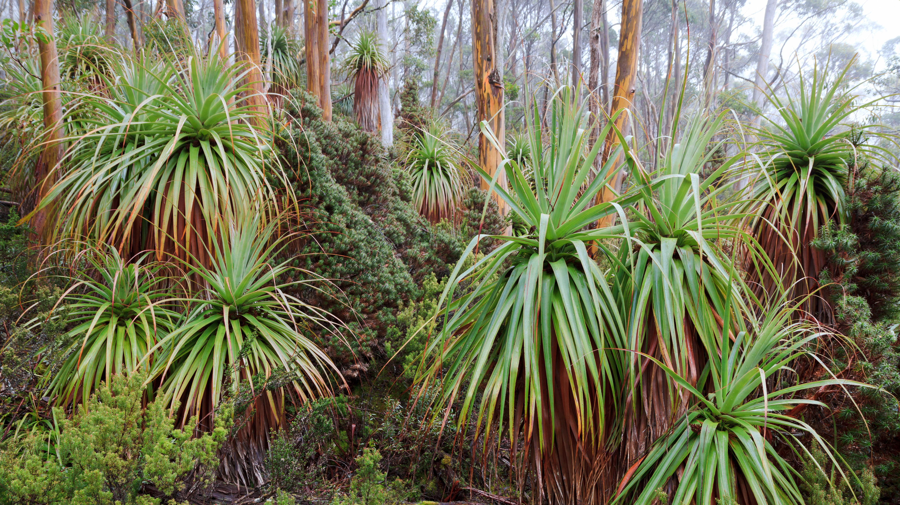 [多布森湖附近的塔斯马尼亚雪胶和班达尼植物，费尔德山国家公园，塔斯马尼亚，澳大利亚 (© Whitworth Images/Getty Images)](https://cn.bing.combing_2024-12-30_OHR.MountFieldNP_ZH-CN6004420782_UHD.jpg) 2024-12-30|
 |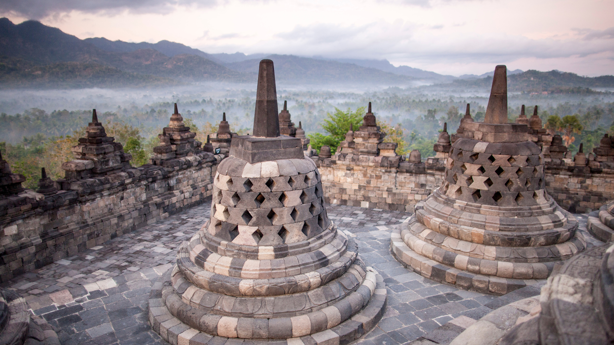 [婆罗浮屠大佛寺，爪哇岛，印度尼西亚 (© Robertharding/Shutterstock)](https://cn.bing.combing_2024-12-29_OHR.BorobudurBells_ZH-CN5291511365_UHD.jpg) 2024-12-29 |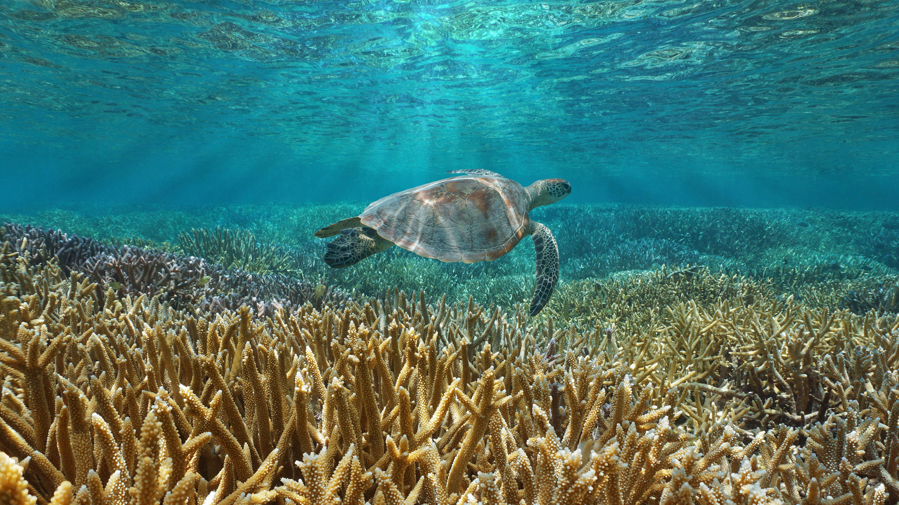 [一只绿海龟在太平洋中游泳，法国海外属地新喀里多尼亚 (© Damsea/Shutterstock)](https://cn.bing.combing_2024-12-28_OHR.CoralTurtle_ZH-CN4771437860_UHD.jpg) 2024-12-28|
 | [布莱德湖，斯洛文尼亚 (© Kesu01/Getty Images)](https://cn.bing.combing_2024-12-27_OHR.LakeBledSnow_ZH-CN4118056813_UHD.jpg) 2024-12-27 | [莫斯霍尔港的圣诞灯饰，康沃尔，英格兰 (© ianwool/Getty Images)](https://cn.bing.combing_2024-12-26_OHR.MouseholeXmas_ZH-CN3079184443_UHD.jpg) 2024-12-26|
 |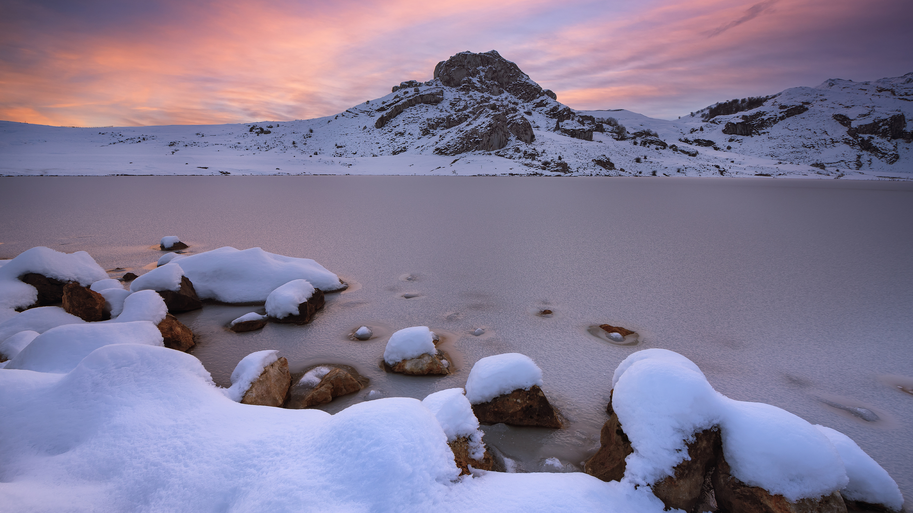 [科瓦东加湖，阿斯图里亚斯，西班牙 (© Carlos Fernandez/Getty Images)](https://cn.bing.combing_2024-12-25_OHR.CovadongaWinter_ZH-CN2873340163_UHD.jpg) 2024-12-25 | [德国圣诞市场 (© Cyril Gosselin/Getty Images)](https://cn.bing.combing_2024-12-24_OHR.SantaSnowglobe_ZH-CN2671421527_UHD.jpg) 2024-12-24|
 |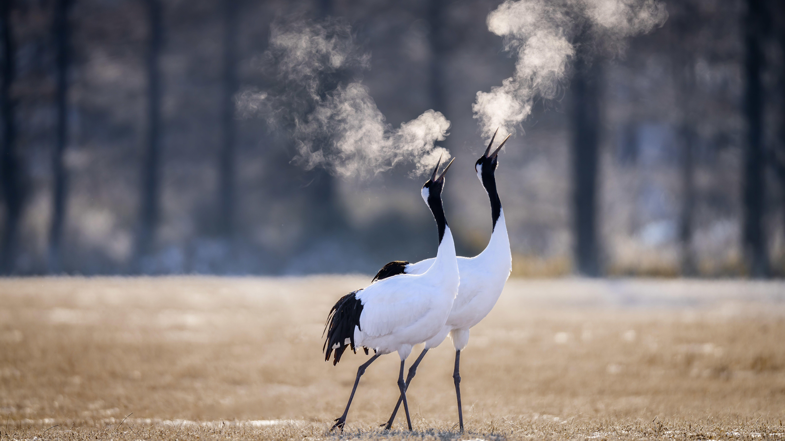 [钏路的两只丹顶鹤，北海道，日本 (© Wirestock, Inc./Alamy Stock Photo)](https://cn.bing.combing_2024-12-23_OHR.FestivusCranes_ZH-CN2464862059_UHD.jpg) 2024-12-23 | [水晶码头的圣诞树，太平洋海滩，加利福尼亚州，美国 (© SamAntonioPhotography/Getty Images)](https://cn.bing.combing_2024-12-22_OHR.CrystalPier_ZH-CN2256372880_UHD.jpg) 2024-12-22|
 |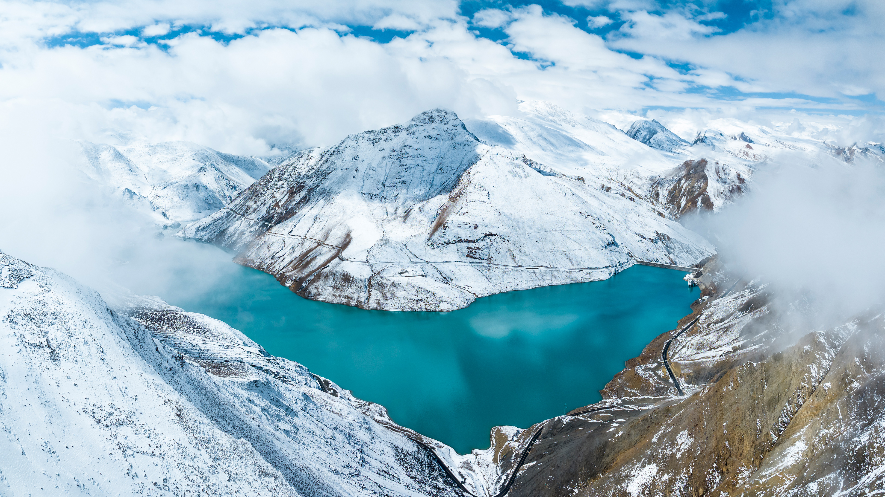 [满拉水库的雪景，日喀则，中国西藏自治区 (© Zhang Zhenqi/VCG via Getty Images)](https://cn.bing.combing_2024-12-21_OHR.WinterSolstice2024_ZH-CN2045153949_UHD.jpg) 2024-12-21 |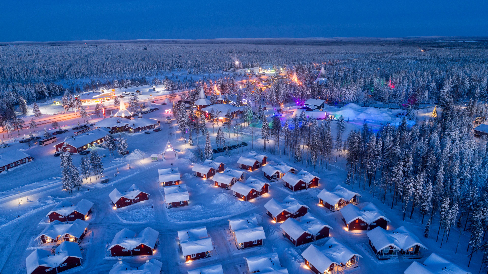 [罗瓦涅米圣诞老人村，拉普兰，芬兰 (© Smelov/Shutterstock)](https://cn.bing.combing_2024-12-20_OHR.SantaClausVillage_ZH-CN1839275027_UHD.jpg) 2024-12-20|
 | [锡比乌圣诞市场，罗马尼亚 (© Calin Stan/Alamy Stock Photo)](https://cn.bing.combing_2024-12-19_OHR.SibiuRomania_ZH-CN1631942857_UHD.jpg) 2024-12-19 |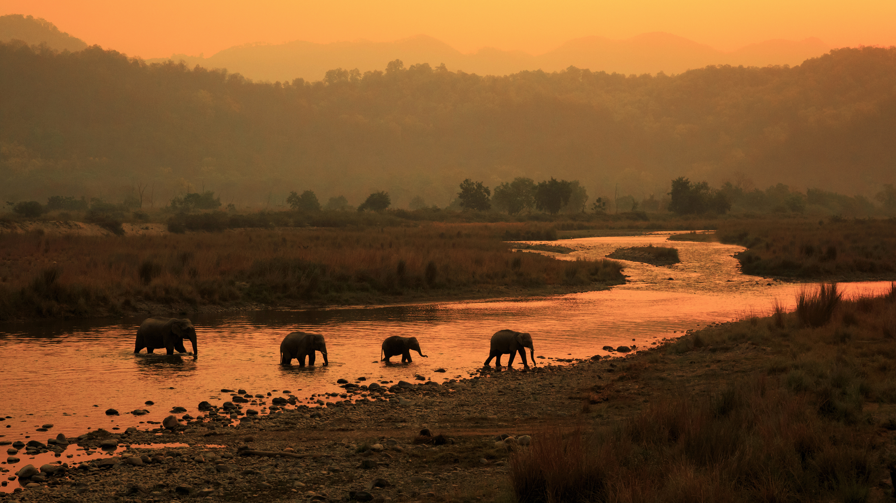 [印度吉姆科比特国家公园的大象，印度 (© ABHILASH VISWA PICASSO/Shutterstock)](https://cn.bing.combing_2024-12-18_OHR.MorningElephants_ZH-CN1418579765_UHD.jpg) 2024-12-18|
 |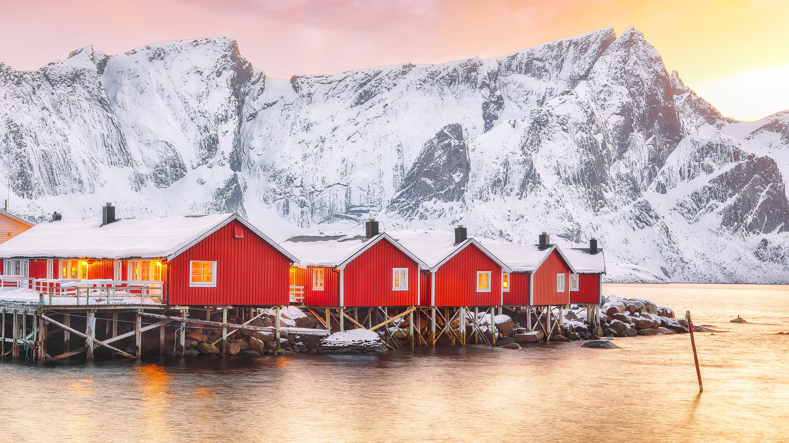 [传统红色渔民小屋，雷讷峡湾岸边，挪威 (© Pilat666/Getty Images)](https://cn.bing.combing_2024-12-17_OHR.ReinefjordenNorway_ZH-CN1198843758_UHD.jpg) 2024-12-17 | [萨尔茨堡，奥地利 (© bluejayphoto/Getty Images)](https://cn.bing.combing_2024-12-16_OHR.SalzburgSnow_ZH-CN0964131994_UHD.jpg) 2024-12-16|
 |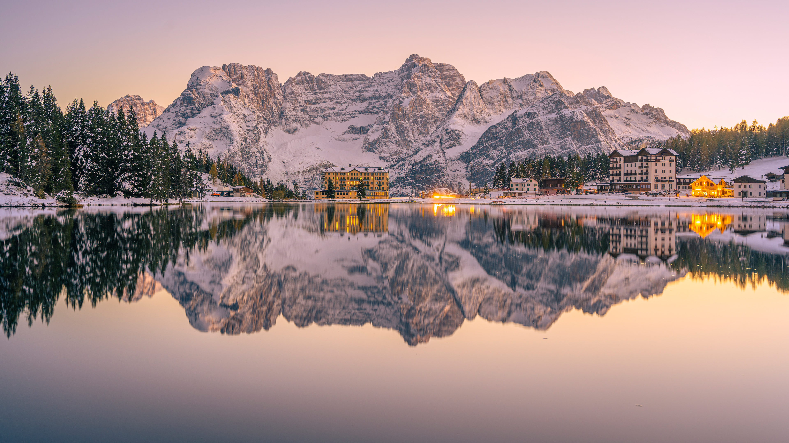 [米苏里纳湖，多洛米蒂山脉，意大利 (© Marco Bottigelli/Getty Images)](https://cn.bing.combing_2024-12-15_OHR.MisurinaLake_ZH-CN0744434715_UHD.jpg) 2024-12-15 |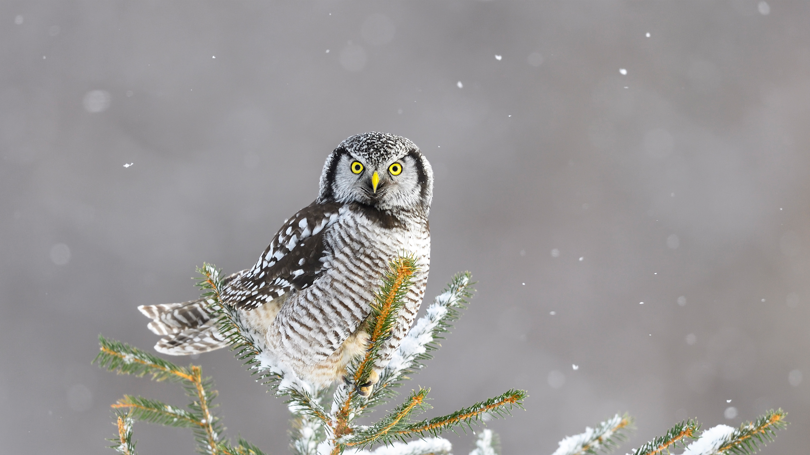 [猛鸮，加拿大 (© pchoui/Getty Images)](https://cn.bing.combing_2024-12-14_OHR.NorthernHawkOwl_ZH-CN8408027305_UHD.jpg) 2024-12-14|
 | [圣诞市场，圣斯蒂芬大教堂，布达佩斯，匈牙利 (© Calin Stan/Shutterstock)](https://cn.bing.combing_2024-12-13_OHR.ChristmasBudapest_ZH-CN8197439971_UHD.jpg) 2024-12-13 |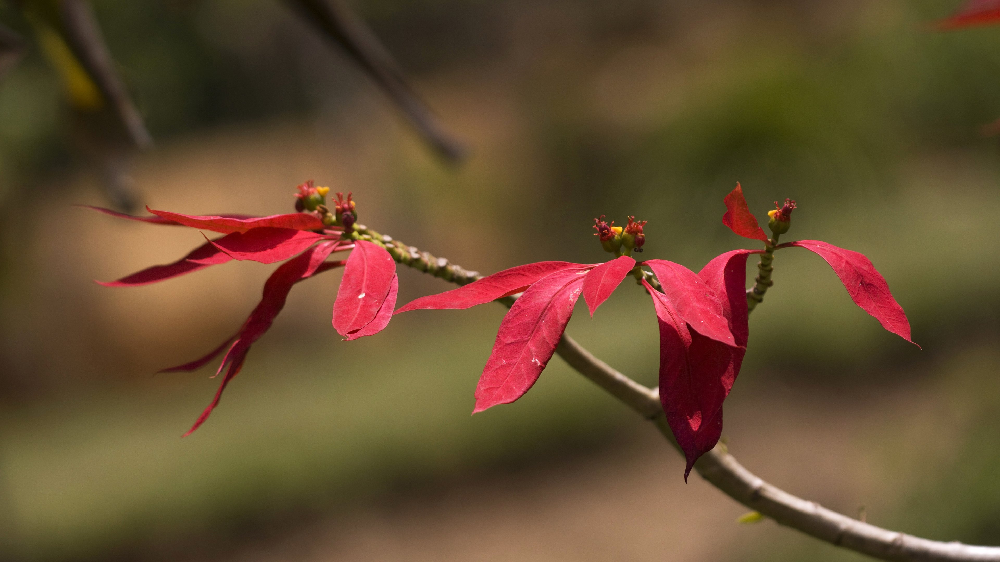 [一品红或圣诞花 (© David Hosking/NPL/Minden Pictures)](https://cn.bing.combing_2024-12-12_OHR.WildPoinsettia_ZH-CN7984548709_UHD.jpg) 2024-12-12|
 |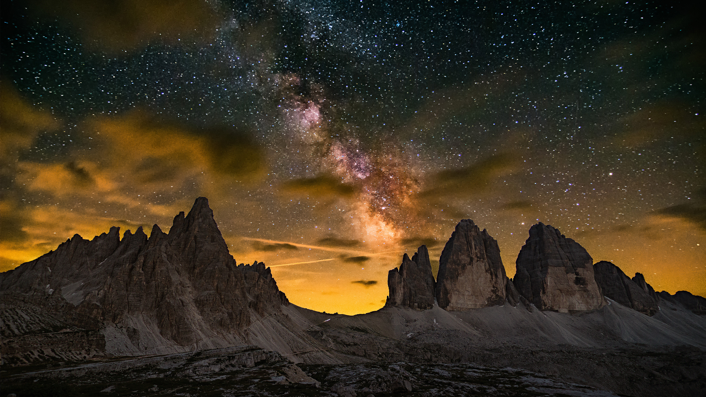 [拉瓦雷多三峰山,意大利 (© Daniel Maran/Getty Images)](https://cn.bing.combing_2024-12-11_OHR.DolomitesSky_ZH-CN9299967785_UHD.jpg) 2024-12-11 |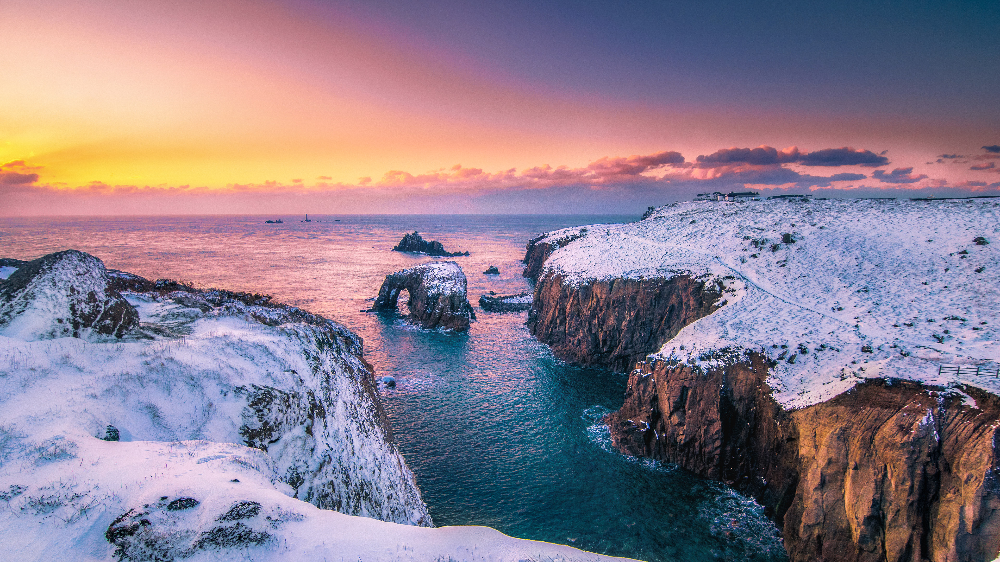 [被雪覆盖的康沃尔天涯海角小径，康沃尔郡兰德恩德，英格兰 (© Josef FitzGerald-Patrick/Getty Images)](https://cn.bing.combing_2024-12-10_OHR.CornwallSnow_ZH-CN8407245245_UHD.jpg) 2024-12-10|
 |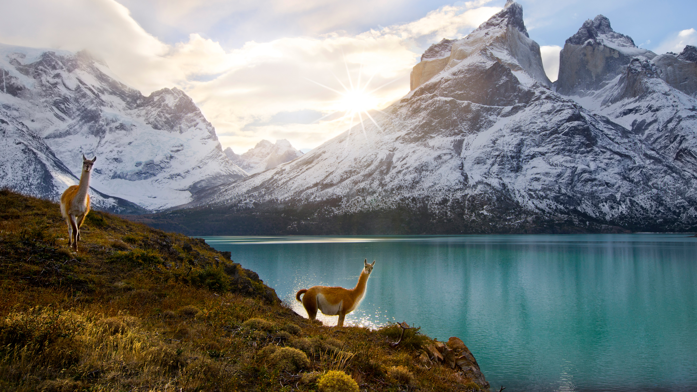 [两只原驼,托雷斯德尔帕恩国家公园 , 智利 (© Floris van Breugel/NPL/Minden Pictures)](https://cn.bing.combing_2024-12-09_OHR.GuanacosChile_ZH-CN7011761081_UHD.jpg) 2024-12-09 | [巴黎圣母院，巴黎，法国 (© Julien Fromentin/Getty Images)](https://cn.bing.combing_2024-12-08_OHR.ReopeningNotreDame_ZH-CN6512133762_UHD.jpg) 2024-12-08|
 | [里约热内卢州的阿拉亚尔多卡博，巴西 (© Derson Santana/Shutterstock)](https://cn.bing.combing_2024-12-07_OHR.ArraialdoCabo_ZH-CN6202620711_UHD.jpg) 2024-12-07 |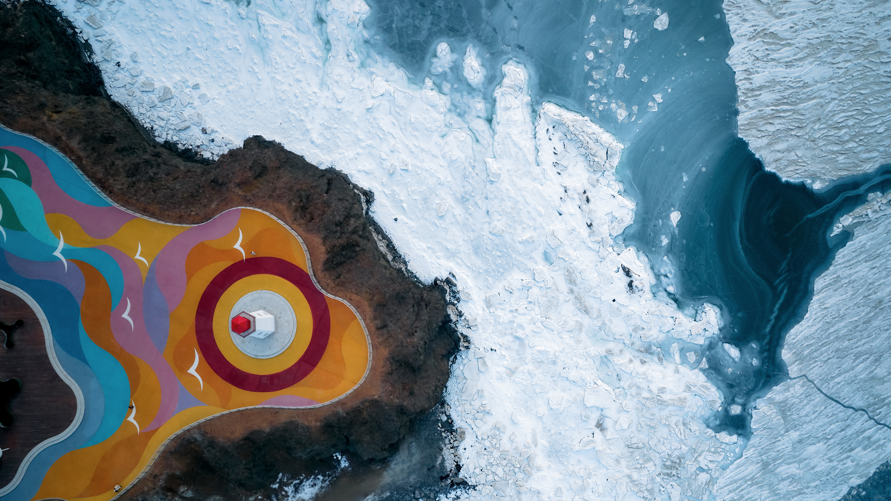 [鸟瞰冰封的大海和悬崖上的灯塔，大连泊霞湾公园，辽宁省，中国 (© zhengshun tang/Getty Images)](https://cn.bing.combing_2024-12-06_OHR.GreaterSnow2024_ZH-CN5929129591_UHD.jpg) 2024-12-06|
 | [莫诺湖的石灰华地层，加利福尼亚州，美国 (© Susanna Patras/TANDEM Stills + Motion)](https://cn.bing.combing_2024-12-05_OHR.MonoTufa_ZH-CN4998806540_UHD.jpg) 2024-12-05 |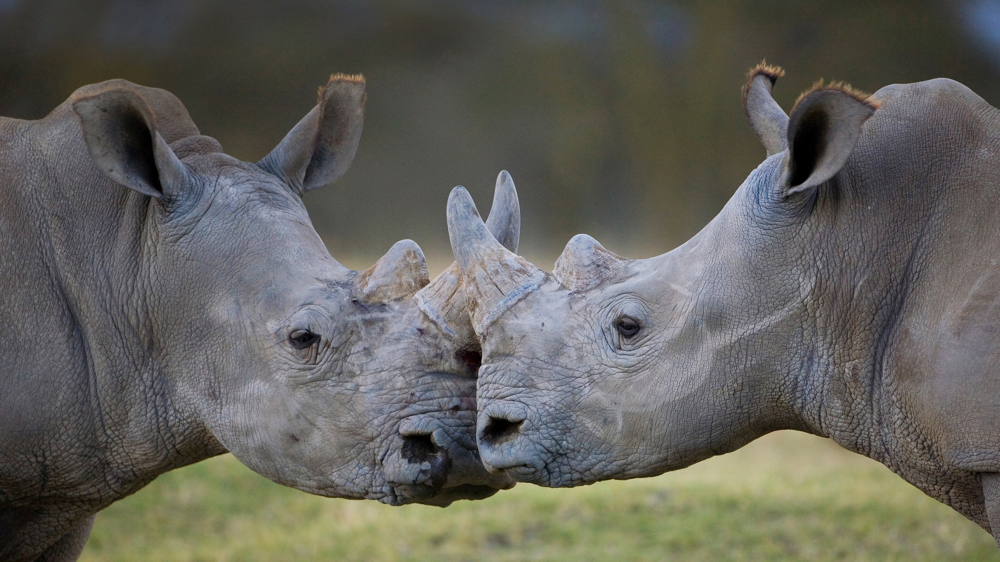 [雄性白犀，纳库鲁湖，肯尼亚 (© Ingo Arndt/Minden Pictures)](https://cn.bing.combing_2024-12-04_OHR.RhinosKenya_ZH-CN4422118541_UHD.jpg) 2024-12-04|
 | [Sattais Katcheri，琥珀堡，拉贾斯坦邦，印度 (© Yury Taranik/Shutterstock)](https://cn.bing.combing_2024-12-03_OHR.JaipurFort_ZH-CN3891828158_UHD.jpg) 2024-12-03 |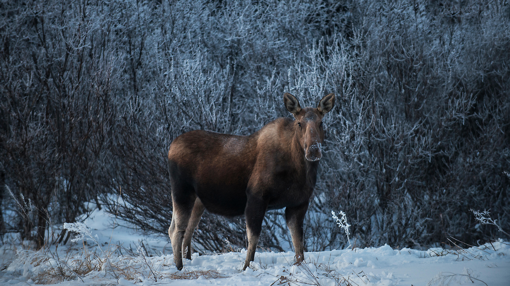 [雌性驼鹿，德纳里国家公园，阿拉斯加州，美国 (© Cavan Images/Alamy Stock Photo)](https://cn.bing.combing_2024-12-02_OHR.SnowMoose_ZH-CN3364979952_UHD.jpg) 2024-12-02|
 |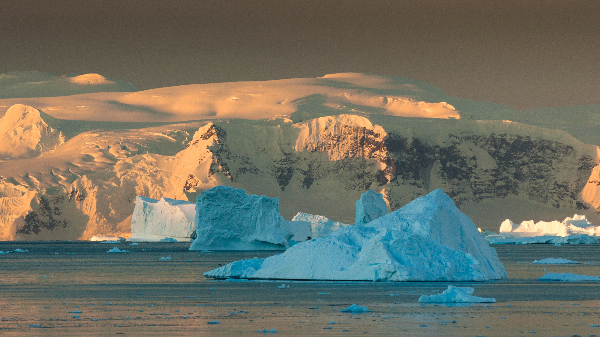 [南极洲的冰山 (© Art Wolfe/DanitaDelimont.com)](https://cn.bing.combing_2024-12-01_OHR.IcebergsAntarctica_ZH-CN2942178295_UHD.jpg) 2024-12-01|
### 2024-11

|     |    |
| ---- | ---- |
 |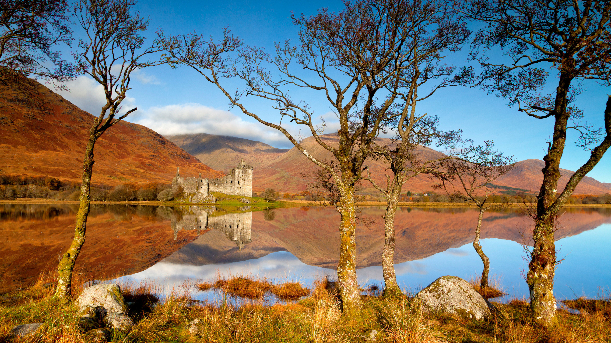 [基尔亨城堡倒映在奥湖中，阿盖尔-比特郡，苏格兰 (© Tom Mackie/plainpicture)](https://cn.bing.combing_2024-11-30_OHR.KilchurnAutumn_ZH-CN2547959725_UHD.jpg) 2024-11-30|
 | [圣米歇尔山，诺曼底，法国 (© Captain Skyhigh/Getty Images)](https://cn.bing.combing_2024-11-29_OHR.MtStMichel_ZH-CN1232662142_UHD.jpg) 2024-11-29 |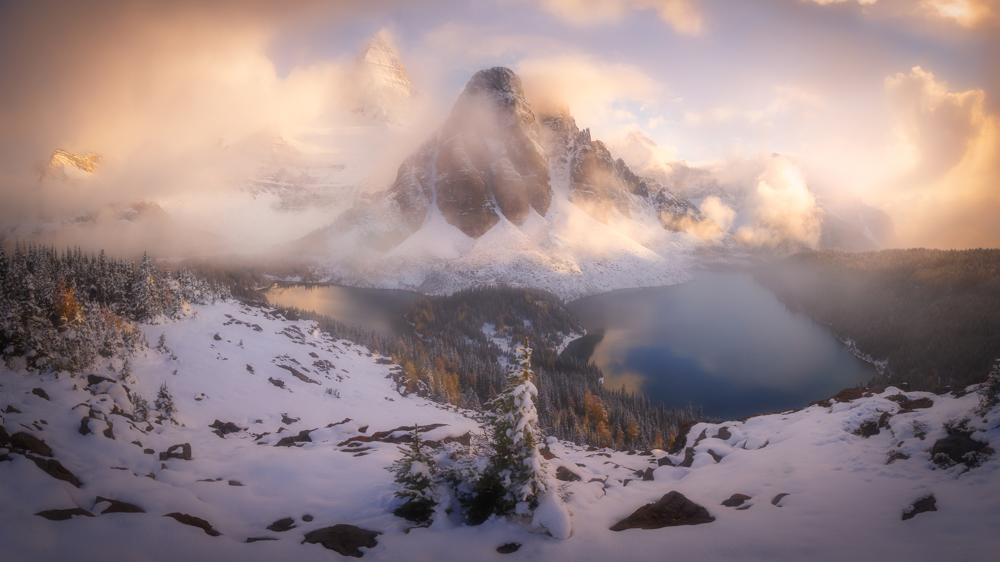 [日落时分风暴渐渐消散，阿西尼博因山省立公园，加拿大 (© Jeff Lewis/TANDEM Stills + Motion)](https://cn.bing.combing_2024-11-28_OHR.AssiniboineTS_ZH-CN9936042562_UHD.jpg) 2024-11-28|
 |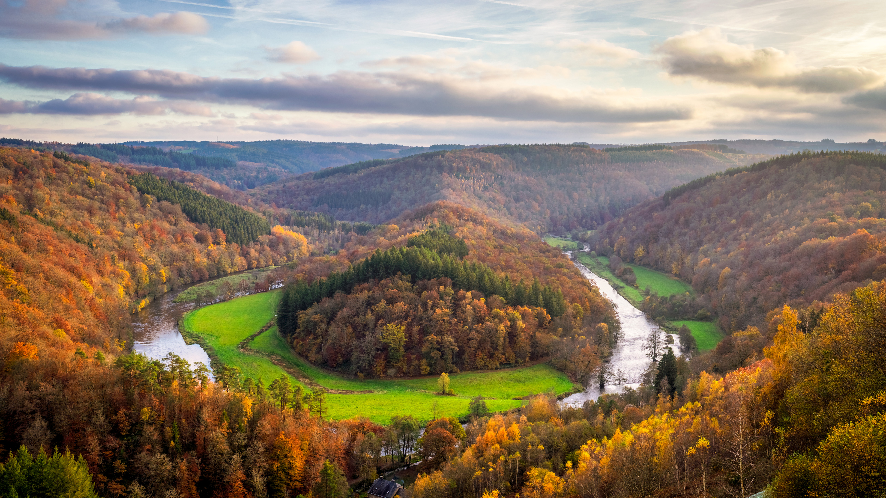 [秋天的巨人之墓，布永市，比利时 (© David Briard/Getty)](https://cn.bing.combing_2024-11-27_OHR.SemoisRiver_ZH-CN0801669014_UHD.jpg) 2024-11-27 |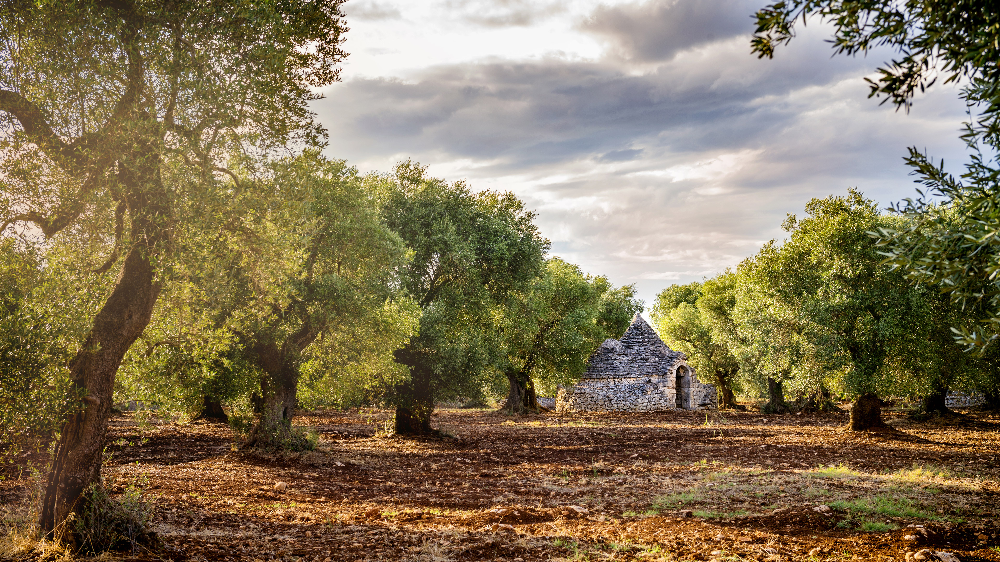 [橄榄树林，伊特里亚山谷，普利亚，意大利 (© Massimo Santi/Shutterstock)](https://cn.bing.combing_2024-11-26_OHR.TrulliGrove_ZH-CN9519400567_UHD.jpg) 2024-11-26|
 | [马赛长颈鹿，安波塞利国家公园，肯尼亚 (© Art Wolfe/DanitaDelimont.com)](https://cn.bing.combing_2024-11-25_OHR.AmboseliGiraffes_ZH-CN9276085602_UHD.jpg) 2024-11-25 | [州立公园，索诺玛海岸，美国加利福尼亚州 (© Rachid Dahnoun/Tandem Stills + Motion)](https://cn.bing.combing_2024-11-24_OHR.SonomaCoast_ZH-CN9187330701_UHD.jpg) 2024-11-24|
 | [多叶芦荟，袋鼠岛，澳大利亚 (© Michael Melford/Alamy)](https://cn.bing.combing_2024-11-23_OHR.FibonacciAloe_ZH-CN8974137481_UHD.jpg) 2024-11-23 |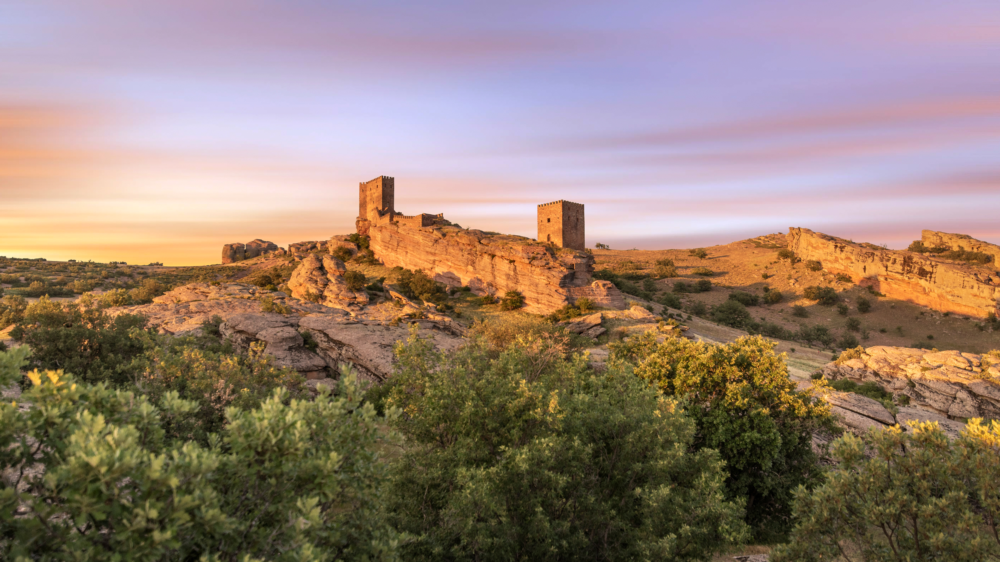 [萨夫拉城堡，瓜达拉哈拉省，西班牙 (© Eduard Gene/Getty Images)](https://cn.bing.combing_2024-11-22_OHR.ZafraCastle_ZH-CN8791148758_UHD.jpg) 2024-11-22|
 | [日出时的两只小狮子，南非 (© Ruan Springorum/Getty Images)](https://cn.bing.combing_2024-11-21_OHR.LionCubs_ZH-CN8538754038_UHD.jpg) 2024-11-21 | [皮埃尔桥，波尔多，法国 (© SergiyN/Getty Images)](https://cn.bing.combing_2024-11-20_OHR.PontBordeaux_ZH-CN7656263575_UHD.jpg) 2024-11-20|
 |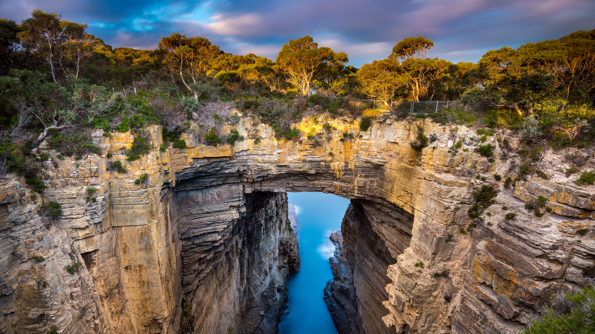 [塔斯曼拱门，塔斯马尼亚州，澳大利亚 (© Gary Bell/Minden Pictures)](https://cn.bing.combing_2024-11-19_OHR.TasmansArch_ZH-CN7062784426_UHD.jpg) 2024-11-19 |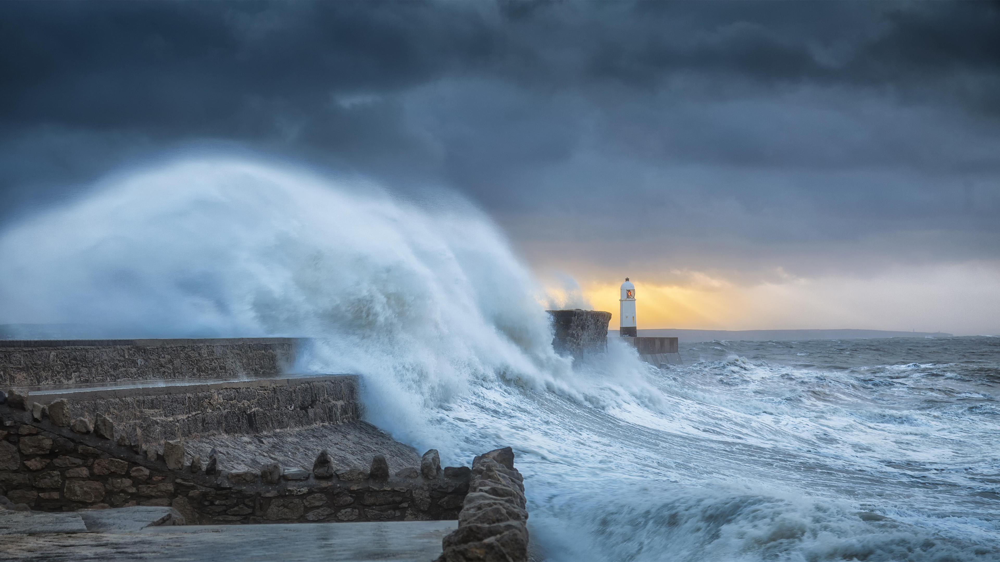 [波斯考尔灯塔，南威尔士，英国 (© Leighton Collins/Alamy)](https://cn.bing.combing_2024-11-18_OHR.PorthcawlLighthouse_ZH-CN6655235820_UHD.jpg) 2024-11-18|
 |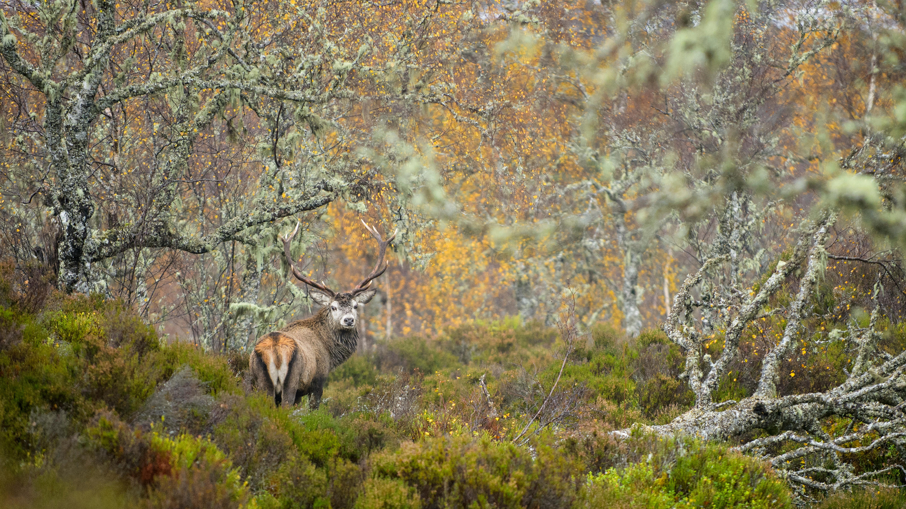 [加里东林中的马鹿，阿夫力谷，苏格兰高地 (© Terry Whittaker/Alamy)](https://cn.bing.combing_2024-11-17_OHR.RedStag_ZH-CN6403546321_UHD.jpg) 2024-11-17 |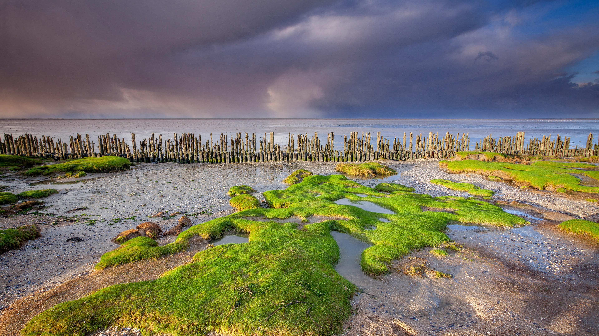 [瓦登海沿岸，莫德加特附近，弗里斯兰，荷兰 (© Ron ter Burg/Minden Pictures)](https://cn.bing.combing_2024-11-16_OHR.FrieslandNetherlands_ZH-CN5952456898_UHD.jpg) 2024-11-16|
 | [义蓬灯节 ，清迈，泰国 (© tampatra/Getty Images)](https://cn.bing.combing_2024-11-15_OHR.YiPengLanterns_ZH-CN5613043353_UHD.jpg) 2024-11-15 |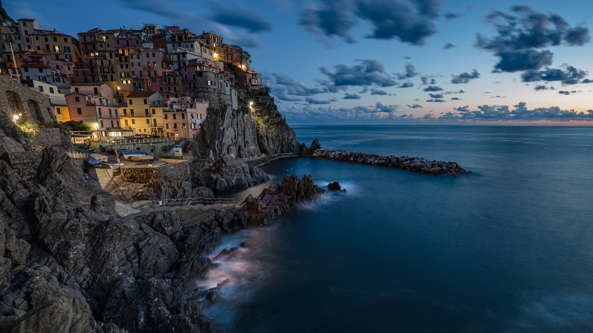 [马纳罗拉，五渔村国家公园，利古里亚，意大利 (© John_Silver/Shutterstock)](https://cn.bing.combing_2024-11-14_OHR.ManarolaItaly_ZH-CN2837915120_UHD.jpg) 2024-11-14|
 |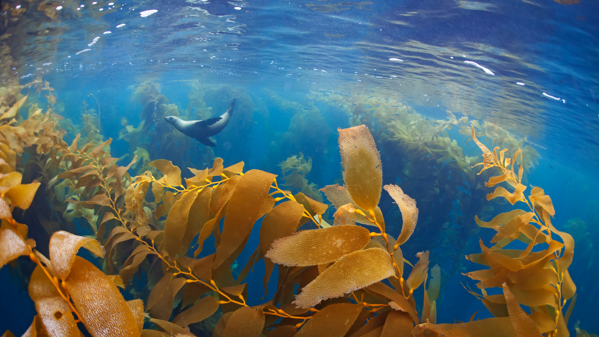 [巨型海藻森林中的加州海狮，下加利福尼亚，墨西哥 (© Claudio Contreras/Minden Pictures)](https://cn.bing.combing_2024-11-13_OHR.KelpForest_ZH-CN2357269491_UHD.jpg) 2024-11-13 |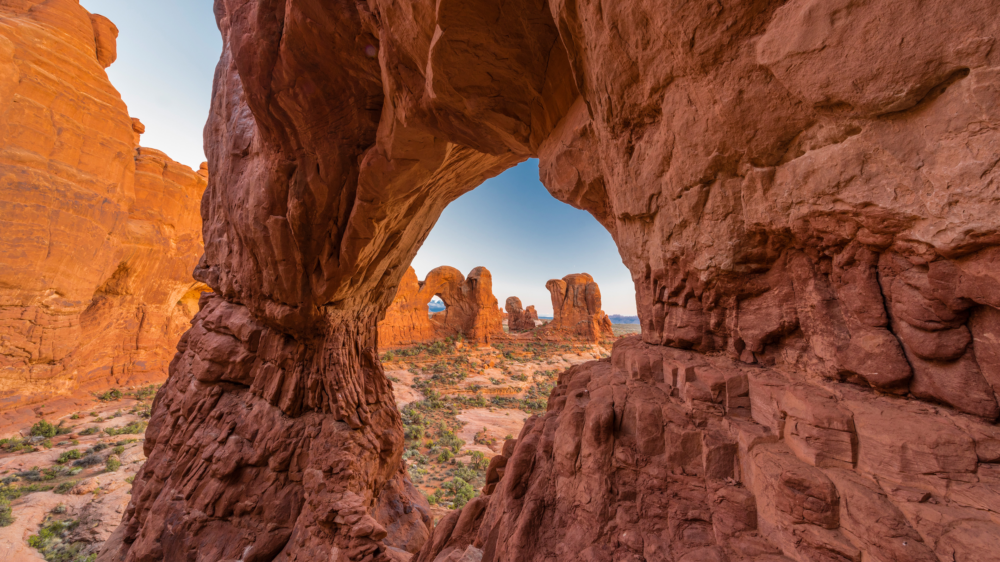 [透过海湾拱门看到双拱门，拱门国家公园，犹他州，美国 (© Jeff Foott/Minden Pictures)](https://cn.bing.combing_2024-11-12_OHR.CoveArch_ZH-CN1281140578_UHD.jpg) 2024-11-12|
 | [班夫国家公园的日落，阿尔伯塔省，加拿大 (© fywPhoto 云卷云舒/Getty Images)](https://cn.bing.combing_2024-11-11_OHR.Banff24_ZH-CN1156176817_UHD.jpg) 2024-11-11 |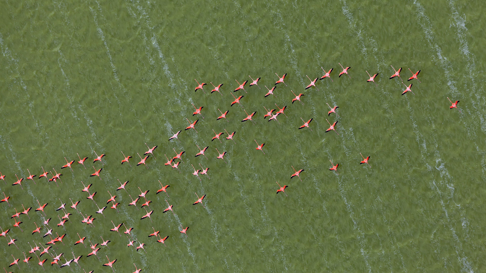 [加勒比火烈鸟，尤卡坦半岛，墨西哥 (© Claudio Contreras/NPL/Minden Pictures)](https://cn.bing.combing_2024-11-10_OHR.YucatanFlamingos_ZH-CN0721673752_UHD.jpg) 2024-11-10|
 |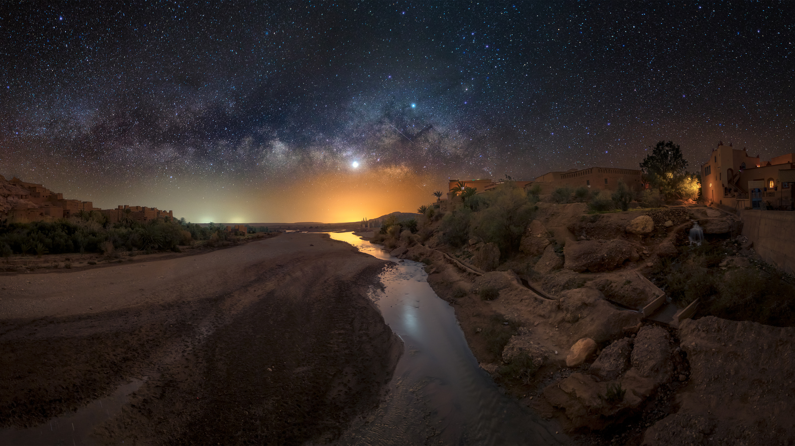 [银河，阿伊特本哈杜杜，摩洛哥 (© Cavan Images/Getty Images)](https://cn.bing.combing_2024-11-09_OHR.MoroccoMilkyWay_ZH-CN3544344290_UHD.jpg) 2024-11-09 |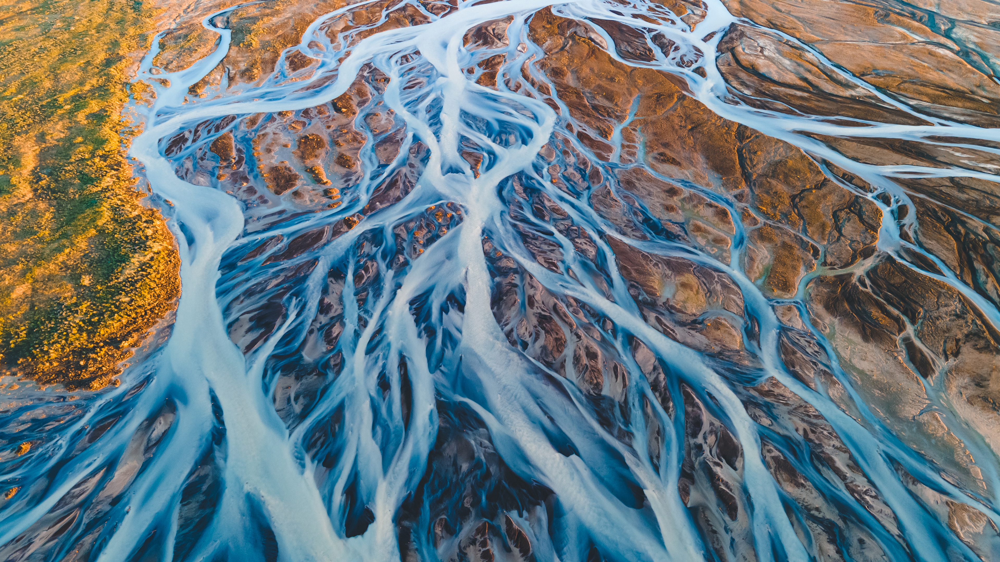 [冰岛冰川河流鸟瞰图 (© rybarmarekk/Shutterstock)](https://cn.bing.combing_2024-11-08_OHR.GlacialRivers_ZH-CN0260507556_UHD.jpg) 2024-11-08|
 | [金色的松树，坝上草原，中国 (© MelindaChan/Getty Images)](https://cn.bing.combing_2024-11-07_OHR.LiDong2024_ZH-CN9944723194_UHD.jpg) 2024-11-07 | [奥林匹克国家公园石狮海滩，华盛顿州，美国 (© T.M. Schultze/TANDEM Stills + Motion)](https://cn.bing.combing_2024-11-06_OHR.ShiShiBeach_ZH-CN8685799566_UHD.jpg) 2024-11-06|
 |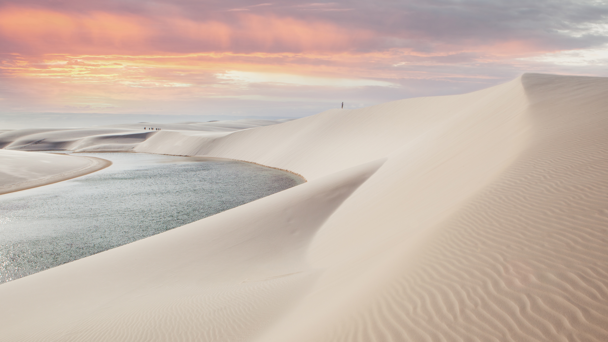 [马拉赫塞斯国家公园，马拉尼昂州,巴西 (© thanosquest/Shutterstock)](https://cn.bing.combing_2024-11-05_OHR.LencoisMaranhao_ZH-CN8194406488_UHD.jpg) 2024-11-05 |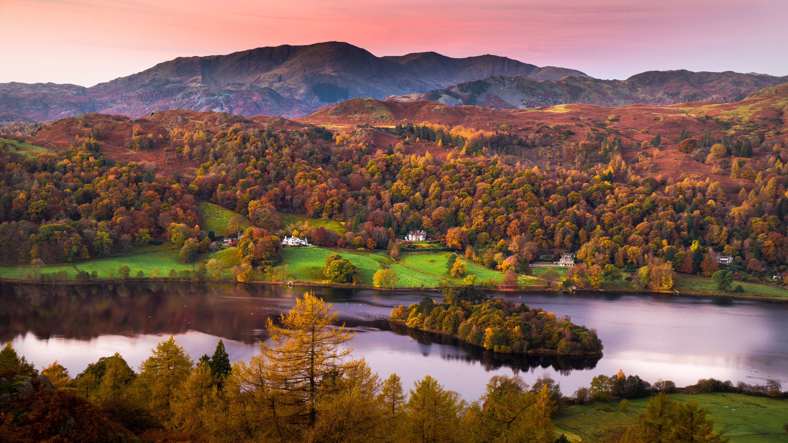 [坎布里亚湖区，格拉斯米尔，英格兰 (© Thomas Molyneux/Getty Images)](https://cn.bing.combing_2024-11-04_OHR.CumbriaAutumn_ZH-CN7697251216_UHD.jpg) 2024-11-04|
 |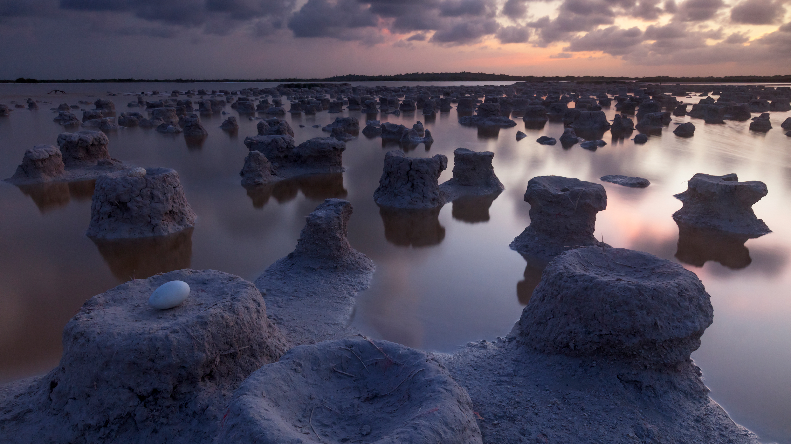 [巢中的加勒比火烈鸟蛋，里奥拉加托斯自然保护区，尤卡坦州，墨西哥 (© Claudio Contreras/Minden Pictures)](https://cn.bing.combing_2024-11-03_OHR.YucatanBiosphere_ZH-CN7442392453_UHD.jpg) 2024-11-03 |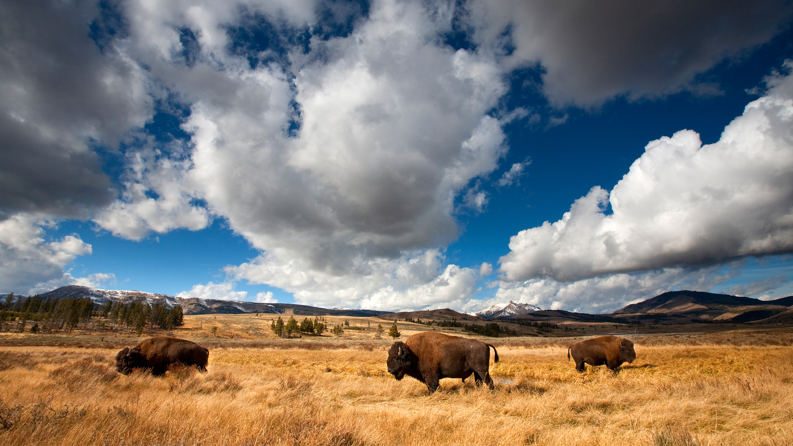 [黄石国家公园的美洲野牛，怀俄明州，美国 (© Ian Shive/TANDEM Stills + Motion)](https://cn.bing.combing_2024-11-02_OHR.BisonYellowstone_ZH-CN7320887379_UHD.jpg) 2024-11-02|
 |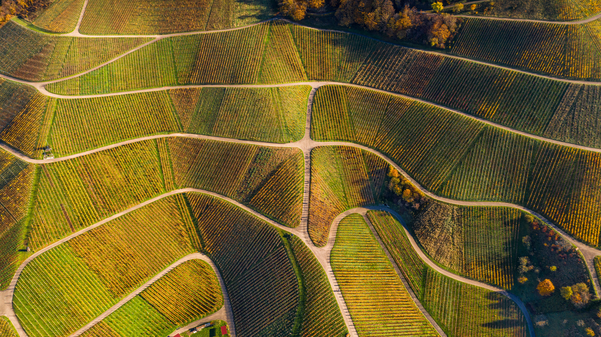 [秋季葡萄园的鸟瞰图，瓦恩哈尔特，黑森林，德国 (© Sabine Gerold/Amazing Aerial Agency)](https://cn.bing.combing_2024-11-01_OHR.VineyardsBlackForestFall_ZH-CN6767078591_UHD.jpg) 2024-11-01|
### 2024-10

|     |    |
| ---- | ---- |
 | [巴黎圣母院的奇美拉，法国 (© scaliger/Getty Images)](https://cn.bing.combing_2024-10-31_OHR.GargoyleParis_ZH-CN1668628241_UHD.jpg) 2024-10-31|
 | [从苏格兰教堂墓地眺望爱丁堡城堡，英国 (© Chris Dorney/Alamy Stock Photo)](https://cn.bing.combing_2024-10-30_OHR.HauntedEdinburgh_ZH-CN1461834159_UHD.jpg) 2024-10-30 |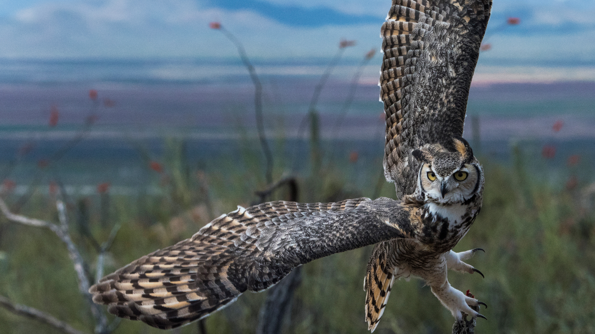 [大雕鸮 (© Mark Newman/Getty Images)](https://cn.bing.combing_2024-10-29_OHR.GreatOwl_ZH-CN1259534922_UHD.jpg) 2024-10-29|
 | [南瓜田，维多利亚，不列颠哥伦比亚省，加拿大 (© Shaun Cunningham/Alamy Stock Photo)](https://cn.bing.combing_2024-10-28_OHR.PumpkinMist_ZH-CN0898655859_UHD.jpg) 2024-10-28 | [北极熊与幼崽，丘吉尔，曼尼托巴，加拿大 (© Design Pics/plainpicture)](https://cn.bing.combing_2024-10-27_OHR.PolarBearHug_ZH-CN0696077546_UHD.jpg) 2024-10-27|
 | [幽灵森林，宁哈根，梅克伦堡-西波美拉尼亚，德国 (© mauritius images GmbH/Alamy Stock Photo)](https://cn.bing.combing_2024-10-26_OHR.GhostForest_ZH-CN9648216213_UHD.jpg) 2024-10-26 |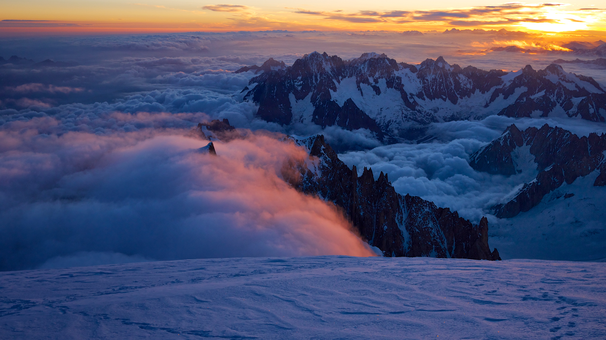 [沙莫尼的勃朗峰，法国 (© Simon Schöpf/Getty Images)](https://cn.bing.combing_2024-10-25_OHR.MontBlancMassif_ZH-CN9172264924_UHD.jpg) 2024-10-25|
 |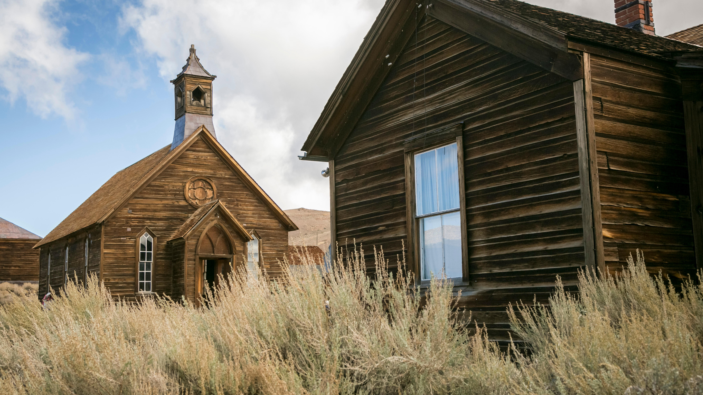 [博迪州立历史公园，莫诺县，加利福尼亚州，美国 (© Julien McRoberts/Tetra Images, LLC/Alamy Stock Photo)](https://cn.bing.combing_2024-10-24_OHR.BodieCalifornia_ZH-CN8941360519_UHD.jpg) 2024-10-24 |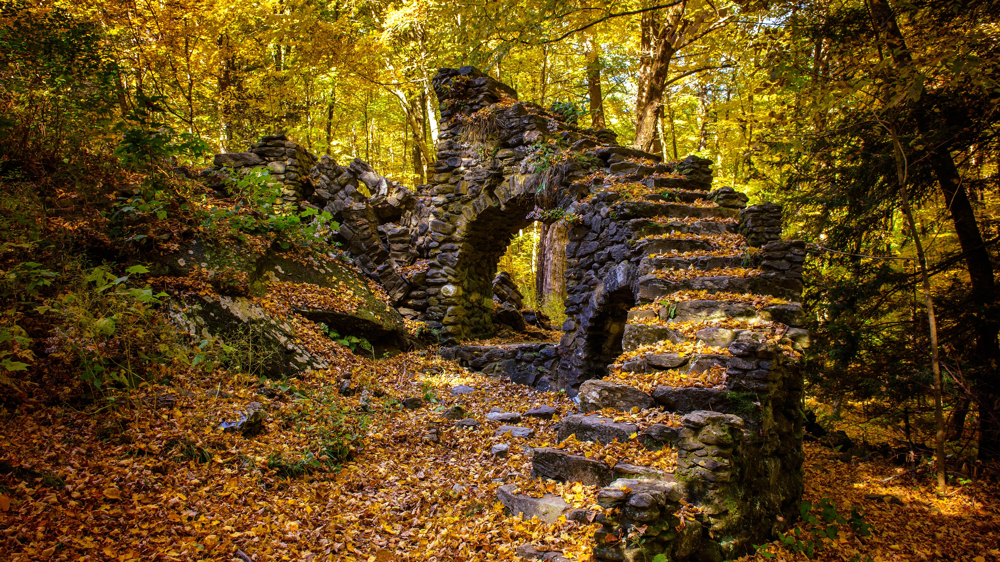 [雪莉夫人森林和古堡遗迹，新罕布什尔州，美国 (© yggdrasill/Shutterstock)](https://cn.bing.combing_2024-10-23_OHR.MadameSherriCastle_ZH-CN8101580548_UHD.jpg) 2024-10-23|
 | [祖卡里宫，罗马，意大利 (© Photon-Photos/Getty Images)](https://cn.bing.combing_2024-10-22_OHR.MonsterDoor_ZH-CN6613337019_UHD.jpg) 2024-10-22 |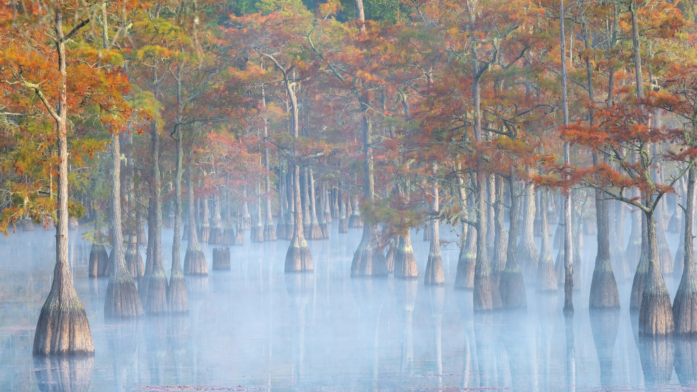 [乔治·史密斯州立公园的柏树，佐治亚州，美国 (© Chris Moore/TANDEM Stills + Motion)](https://cn.bing.combing_2024-10-21_OHR.AutumnCypress_ZH-CN5099875619_UHD.jpg) 2024-10-21|
 | [哈索尔神庙，邓德拉神庙群，基纳，埃及 (© Nick Brundle Photography/Getty Images)](https://cn.bing.combing_2024-10-19_OHR.DenderaTemple_ZH-CN3097745887_UHD.jpg) 2024-10-19 | [曼哈顿中央公园的秋天，纽约，美国 (© mapman/Shutterstock)](https://cn.bing.combing_2024-10-18_OHR.CentralParkAutumn_ZH-CN2757358246_UHD.jpg) 2024-10-18|
 | [地肤草，茨城县，日本 (© DigiPub/Getty Images)](https://cn.bing.combing_2024-10-17_OHR.KochiaJapan_ZH-CN9896157139_UHD.jpg) 2024-10-17 | [侏罗纪海岸的箭石和菊石化石，多塞特郡，英国 (© Nature Picture Library/Alamy Stock Photo)](https://cn.bing.combing_2024-10-16_OHR.FossilsDorset_ZH-CN8722623801_UHD.jpg) 2024-10-16|
 |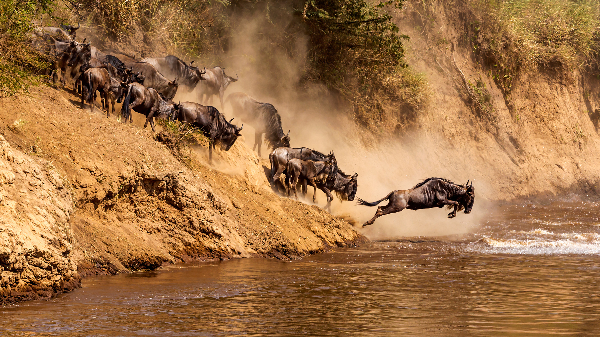 [马拉河的角马大迁徙，肯尼亚 (© Ayzenstayn/Getty Images)](https://cn.bing.combing_2024-10-15_OHR.MaraMigration_ZH-CN8215566853_UHD.jpg) 2024-10-15 |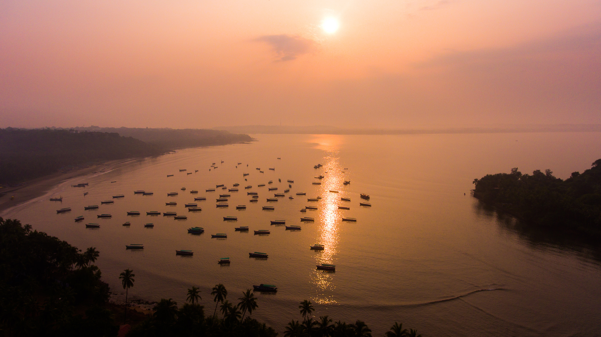 [可可海滩上的渔船，果阿邦，印度 (© Abhinav Sah/Shutterstock)](https://cn.bing.combing_2024-10-14_OHR.CocoBeach_ZH-CN7503553722_UHD.jpg) 2024-10-14|
 | [塞维利亚王宫少女庭院，西班牙 (© Danny Lehman/Getty Images)](https://cn.bing.combing_2024-10-13_OHR.AlcazarSeville_ZH-CN5581795099_UHD.jpg) 2024-10-13 | [林鸳鸯，魁北克省，加拿大 (© Maxime Riendeau/Getty Images)](https://cn.bing.combing_2024-10-12_OHR.QuebecDuck_ZH-CN0588954873_UHD.jpg) 2024-10-12|
 | [黄山云海，安徽省，中国 (© yangyang1991/Getty Images)](https://cn.bing.combing_2024-10-11_OHR.Chongyang2024_ZH-CN4180097837_UHD.jpg) 2024-10-11 |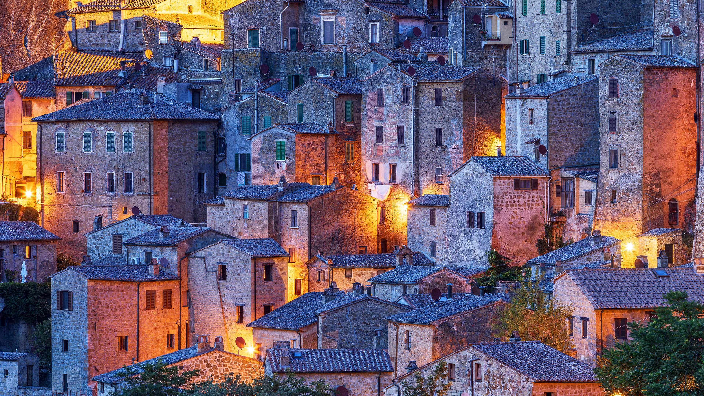 [索拉诺，托斯卡纳，意大利 (© Luigi Vaccarella/eStock Photo)](https://cn.bing.combing_2024-10-10_OHR.SoranoItaly_ZH-CN5842160079_UHD.jpg) 2024-10-10|
 |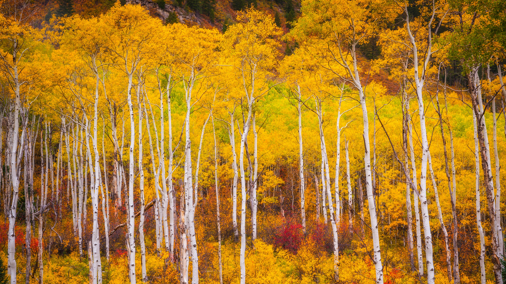 [马布尔附近的白杨树，科罗拉多州，美国 (© Jason Hatfield/TANDEM Stills + Motion)](https://cn.bing.combing_2024-10-09_OHR.AspensColorado_ZH-CN0132780533_UHD.jpg) 2024-10-09 | [索拉诺，托斯卡纳，意大利 (© Luigi Vaccarella/eStock Photo)](https://cn.bing.combing_2024-10-08_OHR.SoranoItaly_ZH-CN1190725201_UHD.jpg) 2024-10-08|
 |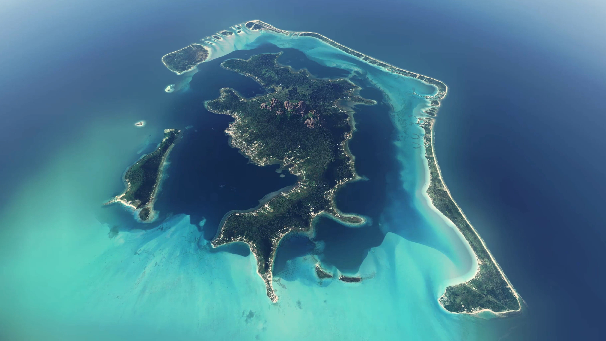 [法属波利尼西亚波拉波拉岛的鸟瞰图 (© GLF Media/Shutterstock)](https://cn.bing.combing_2024-10-07_OHR.BoraPapeete_ZH-CN1991283465_UHD.jpg) 2024-10-07 |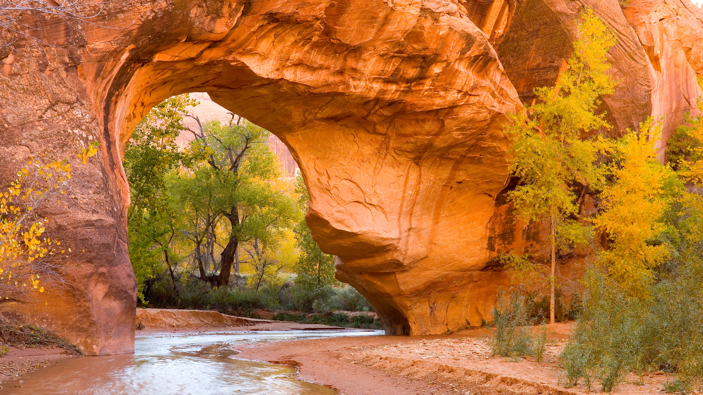 [郊狼峡谷拱门中的白杨树，格兰峡谷休闲区，犹他州，美国 (© Stephen Matera/TANDEM Stills + Motion)](https://cn.bing.combing_2024-10-06_OHR.CoyoteGulch_ZH-CN2869463336_UHD.jpg) 2024-10-06|
 |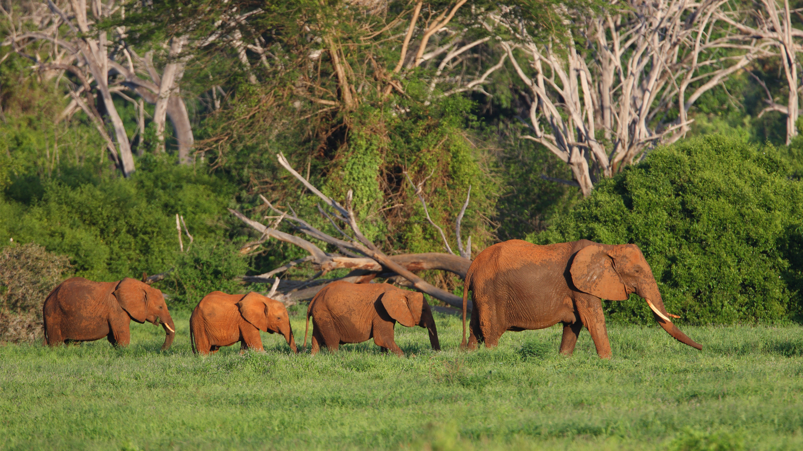 [东察沃国家公园的非洲象，肯尼亚 (© Neil Bowman/Minden Pictures)](https://cn.bing.combing_2024-10-05_OHR.ElephantTeacher_ZH-CN0543308499_UHD.jpg) 2024-10-05 |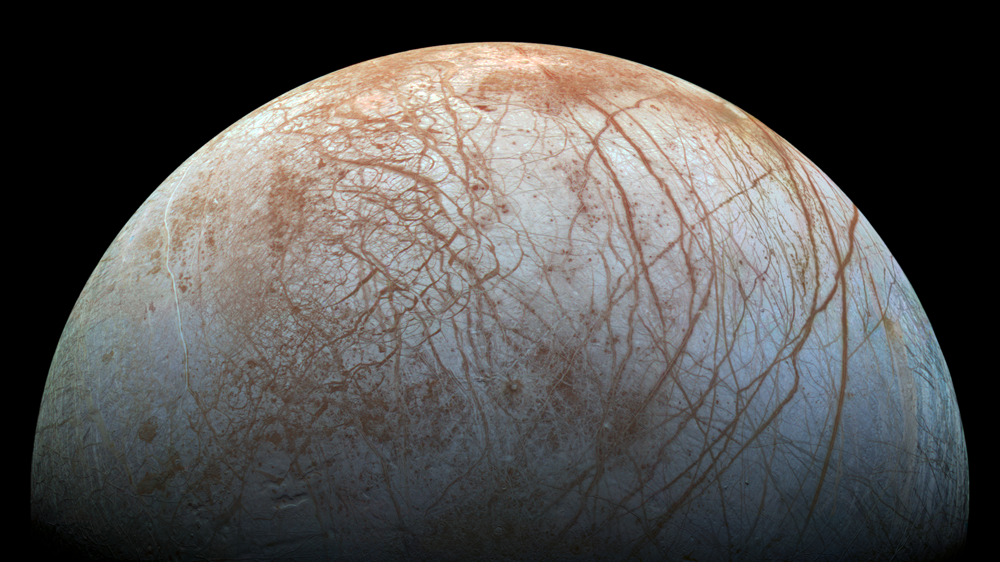 [木星的冰卫星木卫二 (© NASA/JPL-Caltech/SETI Institute)](https://cn.bing.combing_2024-10-04_OHR.EuropaMoon_ZH-CN0149249980_UHD.jpg) 2024-10-04|
 | [阿格拉的泰姬陵，安拉阿巴德，印度 (© Tanarch/Getty Images)](https://cn.bing.combing_2024-10-03_OHR.TajMahalReflection_ZH-CN7498774173_UHD.jpg) 2024-10-03 |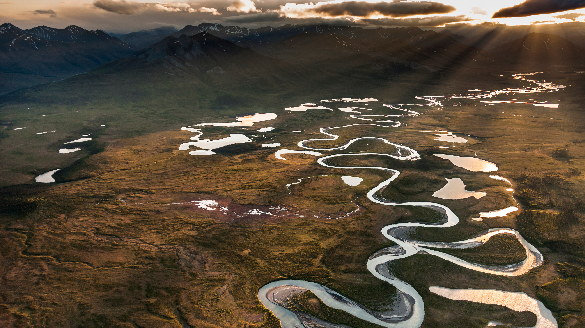 [温德河，布鲁克斯山脉，北极国家野生动物保护区，阿拉斯加州，美国 (© Design Pics/DanitaDelimont)](https://cn.bing.combing_2024-10-02_OHR.WindRiverAlaska_ZH-CN7317039321_UHD.jpg) 2024-10-02|
 |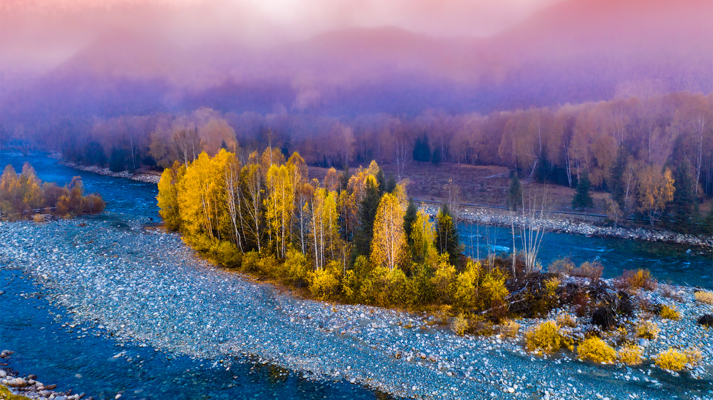 [禾木村的风景，新疆，中国 (© snvv18870020330/Shutterstock)](https://cn.bing.combing_2024-10-01_OHR.NationalDay2024_ZH-CN7026189162_UHD.jpg) 2024-10-01|
### 2024-09

|     |    |
| ---- | ---- |
 |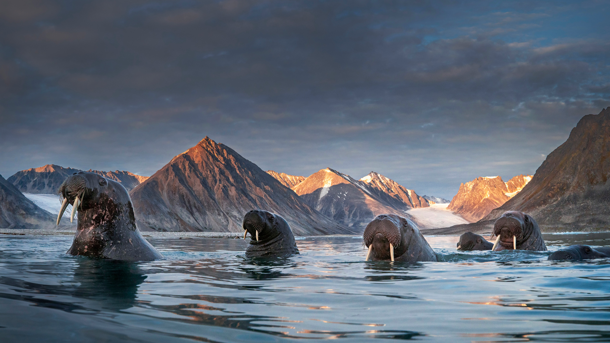 [斯匹次卑尔根岛北部的海象群，斯瓦尔巴群岛，挪威 (© AWL Images/DanitaDelimont)](https://cn.bing.combing_2024-09-30_OHR.WalrusNorway_ZH-CN5657804031_UHD.jpg) 2024-09-30|
 |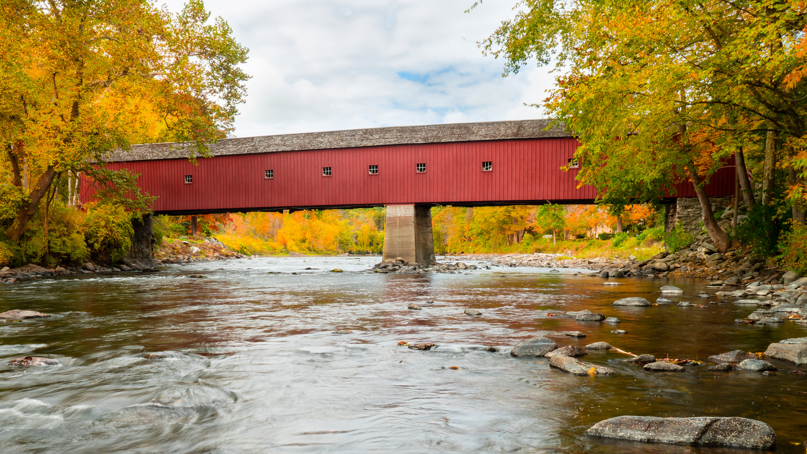 [横跨胡萨托尼克河的西康沃尔廊桥，康涅狄格州，美国 (© pabradyphoto/Getty Images)](https://cn.bing.combing_2024-09-29_OHR.ConnecticutBridge_ZH-CN4957862425_UHD.jpg) 2024-09-29 | [日出时的海滩，海湾岛国家海岸，佛罗里达，美国 (© Tim Fitzharris/Minden Pictures)](https://cn.bing.combing_2024-09-28_OHR.FloridaSeashore_ZH-CN4671838639_UHD.jpg) 2024-09-28|
 | [大运河和安康圣母教堂的鸟瞰图，威尼斯，意大利 (© Bachir Moukarzel/Amazing Aerial Agency)](https://cn.bing.combing_2024-09-27_OHR.VeniceAerial_ZH-CN4070720525_UHD.jpg) 2024-09-27 |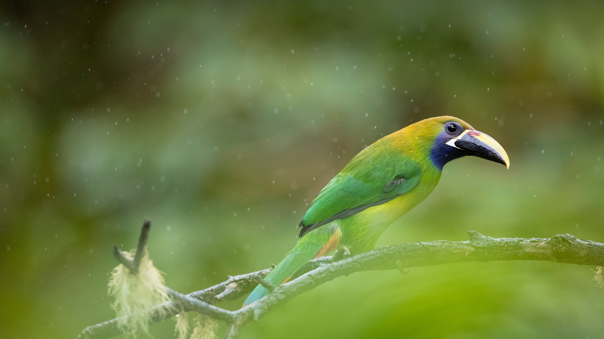 [蓝斑巨嘴鸟，洛斯戈查尔斯国家公园，哥斯达黎加 (© Oscar Dominguez/Tandem Stills + Motion)](https://cn.bing.combing_2024-09-26_OHR.LittleToucanet_ZH-CN2910262009_UHD.jpg) 2024-09-26|
 |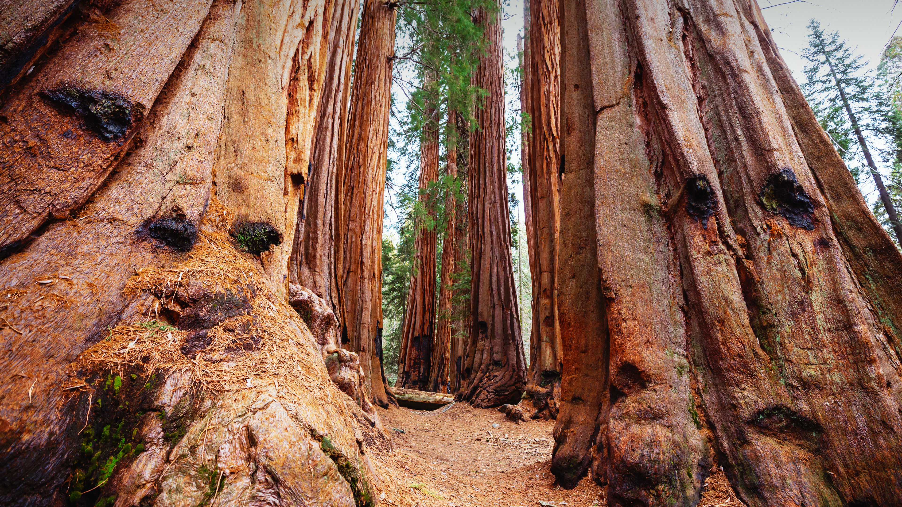 [巨型红杉，红杉国家公园，加利福尼亚州，美国 (© Galyna Andrushko/Shutterstock)](https://cn.bing.combing_2024-09-25_OHR.GiantSequoias_ZH-CN2666897238_UHD.jpg) 2024-09-25 | [斯卡夫塔山的瀑布，瓦特纳冰川国家公园，冰岛 (© Nopasorn Kowathanakul/Getty Images)](https://cn.bing.combing_2024-09-24_OHR.SkaftafellWaterfall_ZH-CN1766863001_UHD.jpg) 2024-09-24|
 | [海獭，威廉王子湾,阿拉斯加州,美国 (© Gerald Corsi/Getty Images)](https://cn.bing.combing_2024-09-23_OHR.IcebergOtter_ZH-CN0972467238_UHD.jpg) 2024-09-23 |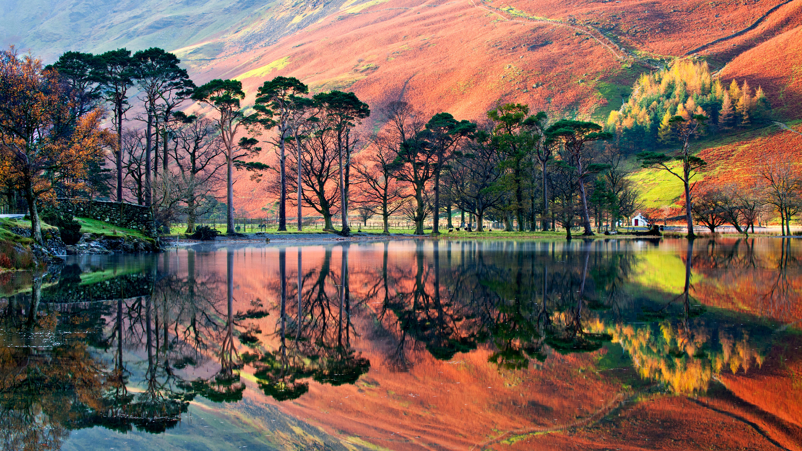 [巴特米尔湖，湖区国家公园，英格兰，英国 (© Alan Novelli/Alamy Stock Photo)](https://cn.bing.combing_2024-09-22_OHR.AutumnCumbria_ZH-CN0565958390_UHD.jpg) 2024-09-22|
 |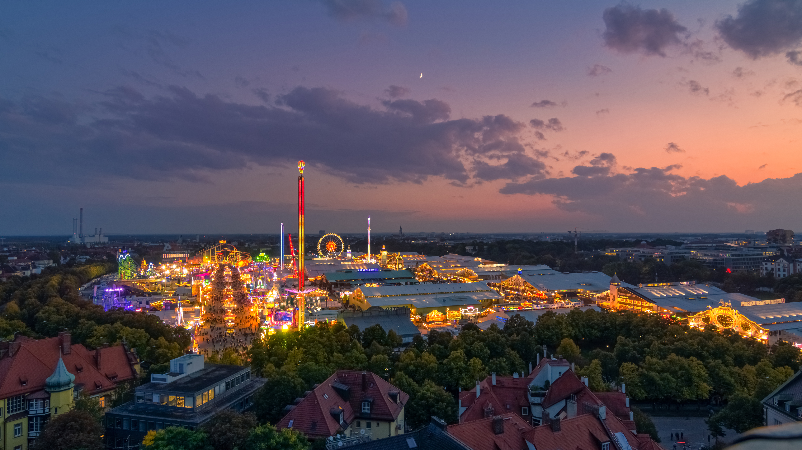 [Oktoberfest in Munich at sunset (© AllesSuper21/iStock/Getty Images)](https://cn.bing.combing_2024-09-21_OHR.MunichBeerfest_ZH-CN0304560562_UHD.jpg) 2024-09-21 |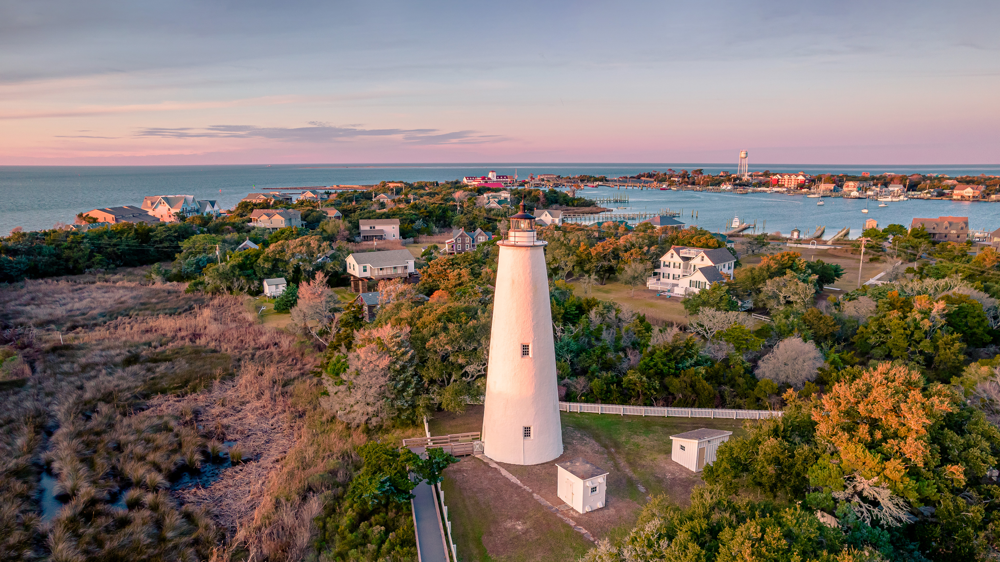 [奥克拉科克岛上的奥克拉科克灯塔，北卡罗来纳州，美国 (© Chansak Joe/Getty Images)](https://cn.bing.combing_2024-09-20_OHR.OcracokeLight_ZH-CN9810840077_UHD.jpg) 2024-09-20|
 |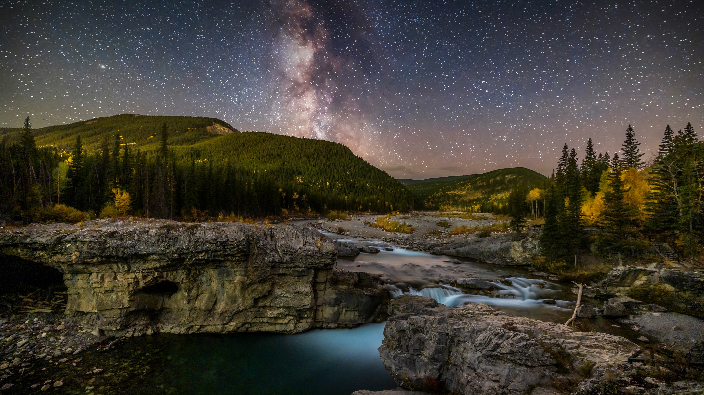 [埃尔博河上空的银河，阿尔伯塔省，加拿大 (© Alan Dyer/Getty Images)](https://cn.bing.combing_2024-09-19_OHR.ElbowRiver_ZH-CN9580175593_UHD.jpg) 2024-09-19 |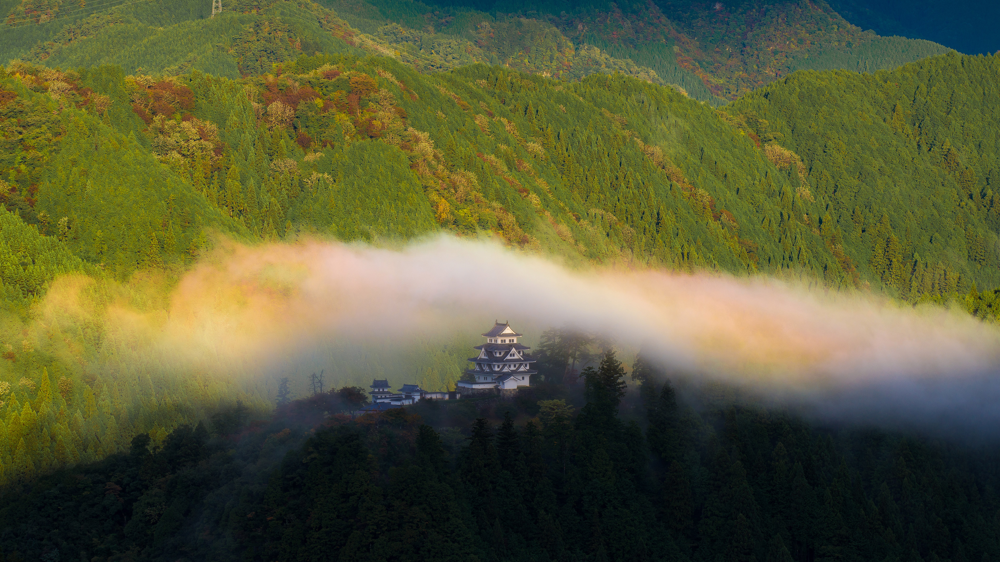 [郡上八幡城，岐阜县，日本 (© ta2funk ito/500px/Getty Images)](https://cn.bing.combing_2024-09-18_OHR.GujoHachiman_ZH-CN9192289658_UHD.jpg) 2024-09-18|
 | [月圆之夜的豫园，上海，中国 (© zyxeos30/Gettyimages)](https://cn.bing.combing_2024-09-17_OHR.MidAutumnFestival2024_ZH-CN9096556094_UHD.jpg) 2024-09-17 |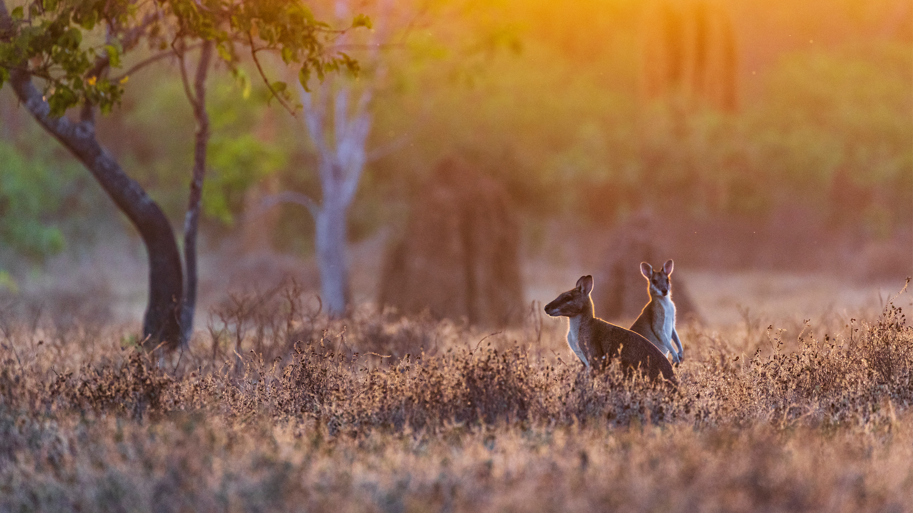 [日出时的小袋鼠，阿德莱德河，北领地，澳大利亚 (© Jeremy Woodhouse/Getty Images)](https://cn.bing.combing_2024-09-16_OHR.SunriseWallabies_ZH-CN8725891401_UHD.jpg) 2024-09-16|
 |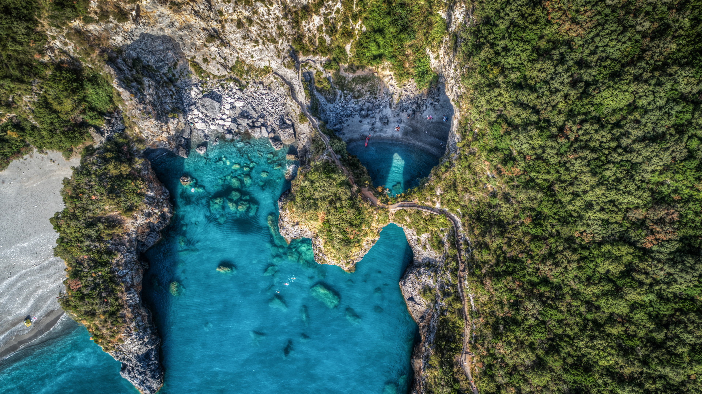 [阿科马尼奥海滩，卡拉布里亚，意大利 (© Alessio de Cicco/Getty Images)](https://cn.bing.combing_2024-09-15_OHR.CalabriaPeperoncino_ZH-CN8603617212_UHD.jpg) 2024-09-15 |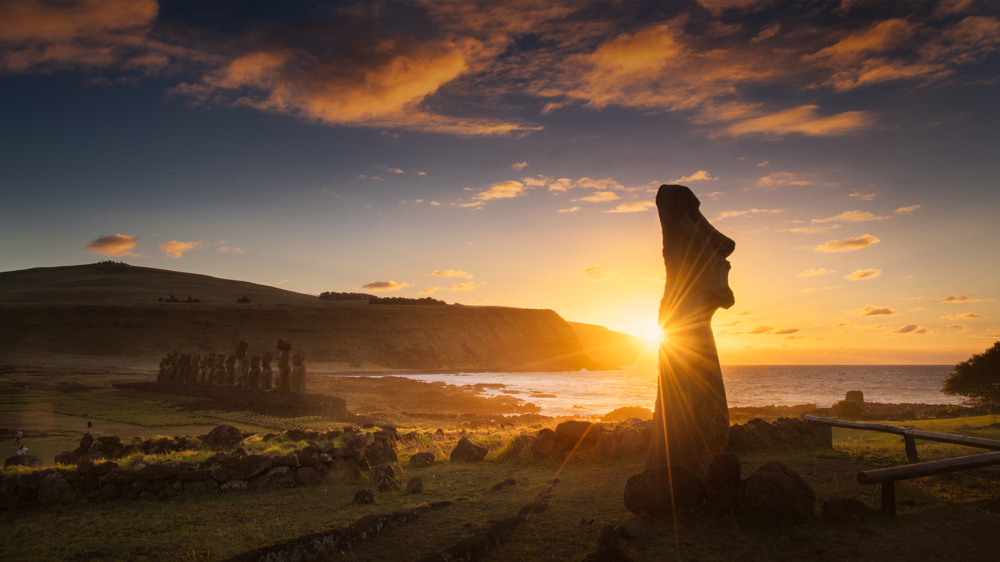 [阿胡汤加里基的日出，拉帕·努伊国家公园，复活节岛，智利 (© Piriya Photography/Getty Images)](https://cn.bing.combing_2024-09-14_OHR.RapaNuiSunrise_ZH-CN1220508877_UHD.jpg) 2024-09-14|
 |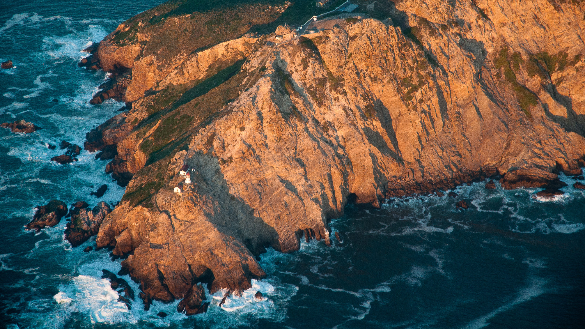 [雷耶斯角国家海岸灯塔，加利福尼亚州，美国 (© RMB Images/Photography by Robert Bowman/Getty Images)](https://cn.bing.combing_2024-09-13_OHR.PointReyes_ZH-CN7781514086_UHD.jpg) 2024-09-13 | [留尼汪岛附近的海豚群，印度洋，法国海外省 (© Joost van Uffelen/Shutterstock)](https://cn.bing.combing_2024-09-12_OHR.DolphinReunion_ZH-CN7681290861_UHD.jpg) 2024-09-12|
 | [埃尔茨城堡，德国 (© Allard Schager/Alamy)](https://cn.bing.combing_2024-09-11_OHR.EltzCastle_ZH-CN7586749377_UHD.jpg) 2024-09-11 | [瓦斯科·达·伽马大桥，里斯本，葡萄牙 (© Achim Thomae/Getty Images)](https://cn.bing.combing_2024-09-10_OHR.BridgeLisbon_ZH-CN6877671644_UHD.jpg) 2024-09-10|
 |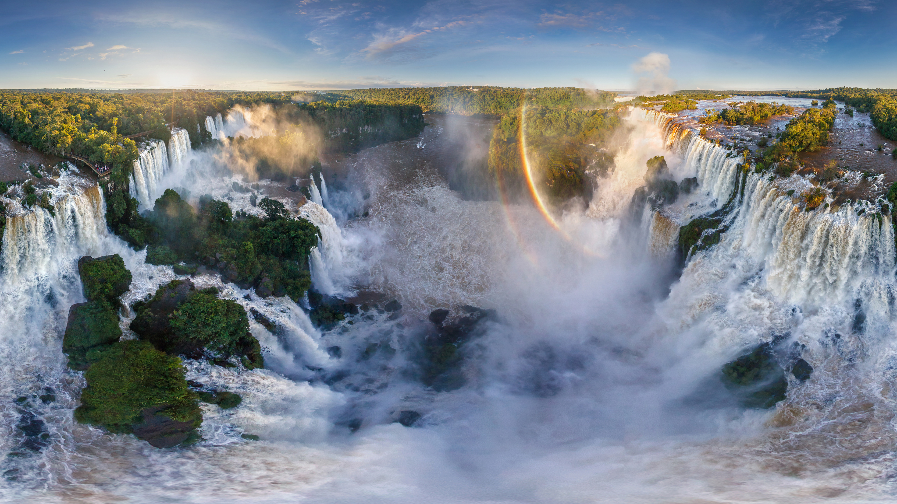 [阿根廷和巴西边境的伊瓜苏瀑布 (© AirPano LLC/Amazing Aerial Agency)](https://cn.bing.combing_2024-09-09_OHR.IguazuRainbow_ZH-CN6524347982_UHD.jpg) 2024-09-09 |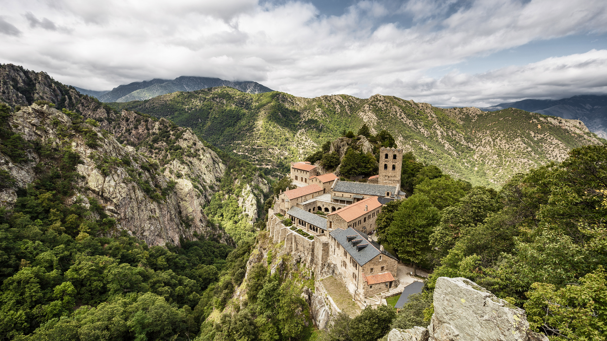 [加泰罗尼亚北部的圣马丁杜卡尼古修道院 ，法国 (© Cyril Gosselin/Getty Images)](https://cn.bing.combing_2024-09-08_OHR.Canigou_ZH-CN6145410455_UHD.jpg) 2024-09-08|
 |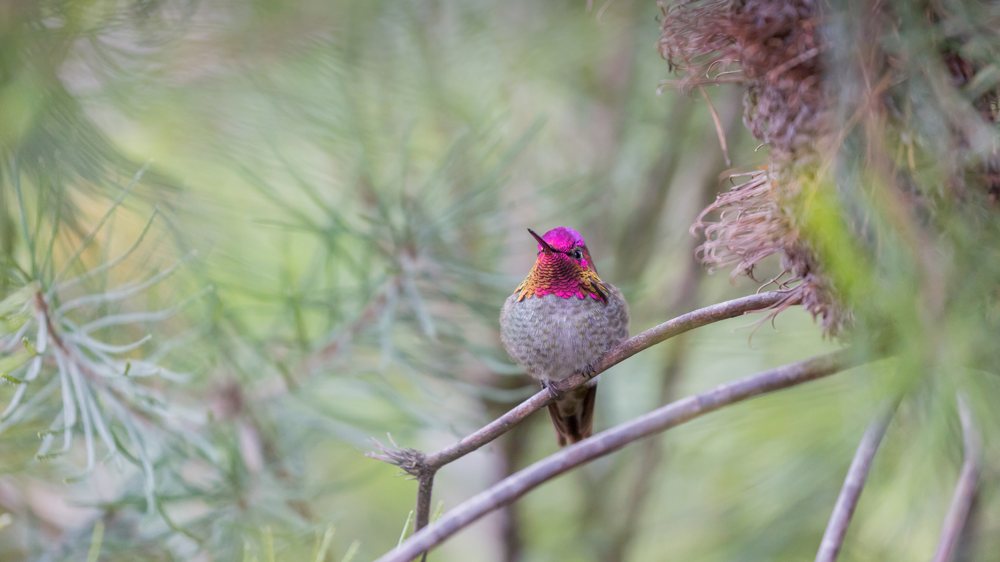 [朱红蜂鸟，圣克鲁斯，加利福尼亚州，美国 (© yhelfman/Getty Images)](https://cn.bing.combing_2024-09-07_OHR.SantaCruzHummer_ZH-CN5448262039_UHD.jpg) 2024-09-07 |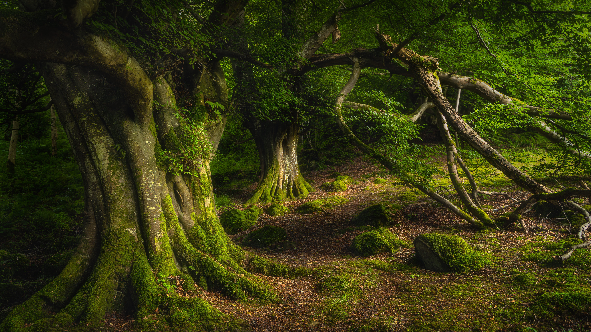 [古老山毛榉树，格莱纳里夫森林公园，安特里姆郡，北爱尔兰 (© Dawid K Photography/Shutterstock)](https://cn.bing.combing_2024-09-06_OHR.GlenariffPark_ZH-CN4667558707_UHD.jpg) 2024-09-06|
 | [多伦多城市天际线,加拿大 (© Roberto Machado Noa/Getty Images)](https://cn.bing.combing_2024-09-05_OHR.TIFF2024_ZH-CN4896695918_UHD.jpg) 2024-09-05 | [乌雕鸮，巴基斯坦 (© zahoor salmi/Getty Images)](https://cn.bing.combing_2024-09-04_OHR.DuskyOwls_ZH-CN4729762831_UHD.jpg) 2024-09-04|
 |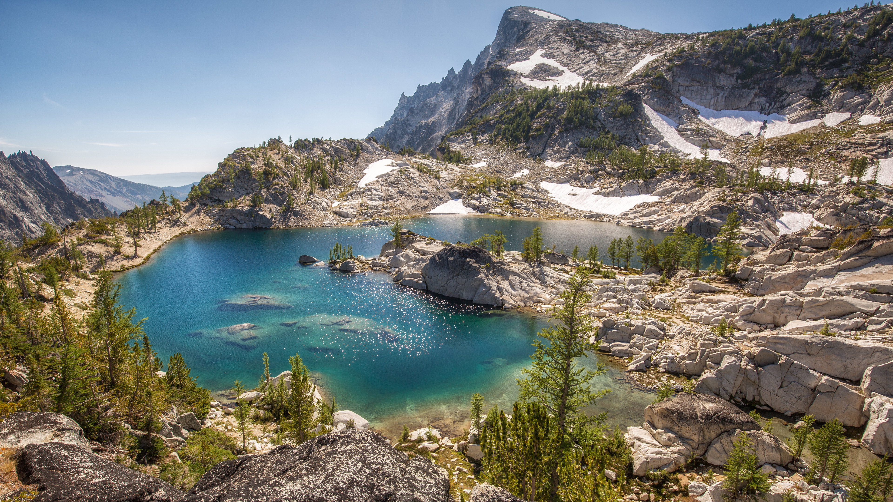 [迷人的水晶湖，高山湖泊，华盛顿州，美国 (© Mitch Pittman/Tandem Stills + Motion)](https://cn.bing.combing_2024-09-03_OHR.AlpineLakes_ZH-CN4537389724_UHD.jpg) 2024-09-03 | [红绿金刚鹦鹉，南马托格罗索州，巴西 (© Ellen Goff/Danita Delimont)](https://cn.bing.combing_2024-09-02_OHR.BuracodasAraras_ZH-CN3881985508_UHD.jpg) 2024-09-02|
 | [泰晤士河，伦敦，英国 (© Puthipong Worasaran/Getty Images)](https://cn.bing.combing_2024-09-01_OHR.ThamesLondon_ZH-CN3629717426_UHD.jpg) 2024-09-01|
### 2024-08

|     |    |
| ---- | ---- |
 |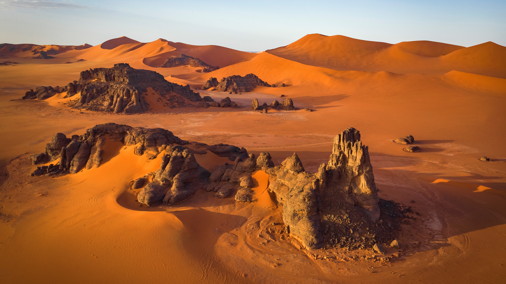 [撒哈拉沙漠的岩层和沙丘，贾奈特，阿尔及利亚 (© Airpano/Amazing Aerial Agency)](https://cn.bing.combing_2024-08-31_OHR.DjanetAlgeria_ZH-CN3458706695_UHD.jpg) 2024-08-31|
 |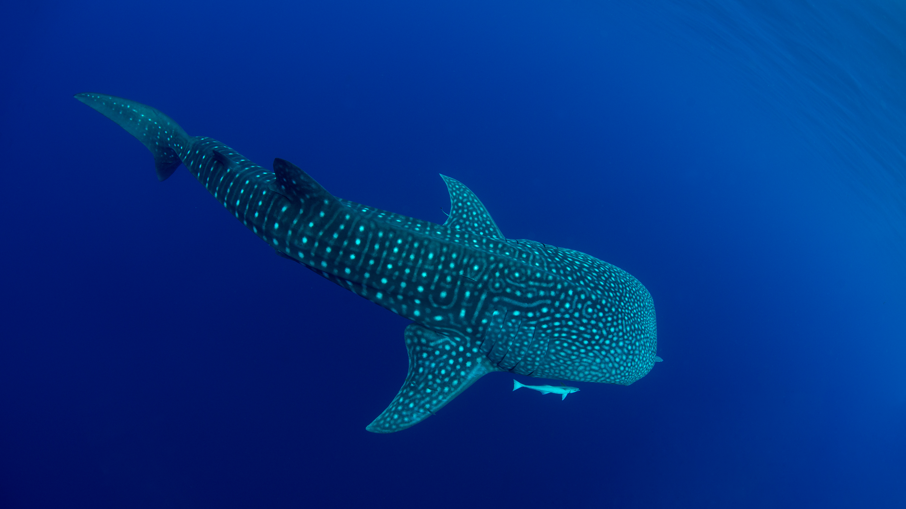 [鸟头湾的鲸鲨，西巴布亚，印度尼西亚 (© Andy Lerner/Tandem Stills + Motion)](https://cn.bing.combing_2024-08-30_OHR.WhaleSharkDay_ZH-CN3334940631_UHD.jpg) 2024-08-30 |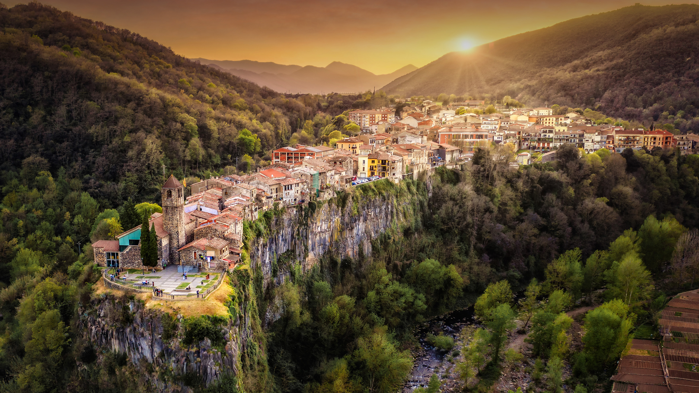 [富利特堡-德拉罗卡，加泰罗尼亚，西班牙 (© Eloi_Omella/Getty Images)](https://cn.bing.combing_2024-08-29_OHR.CastellfollitSpain_ZH-CN2990517626_UHD.jpg) 2024-08-29|
 | [蒙马特和圣心大教堂，巴黎，法国 (© Tuul & Bruno Morandi/Getty Images)](https://cn.bing.combing_2024-08-28_OHR.ParalympicsParis_ZH-CN9773135851_UHD.jpg) 2024-08-28 | [黑色凯门鳄幼崽，坦博帕塔国家保护区，秘鲁 (© Maxime Aliaga/Minden Pictures)](https://cn.bing.combing_2024-08-27_OHR.YoungCaiman_ZH-CN1995433788_UHD.jpg) 2024-08-27|
 |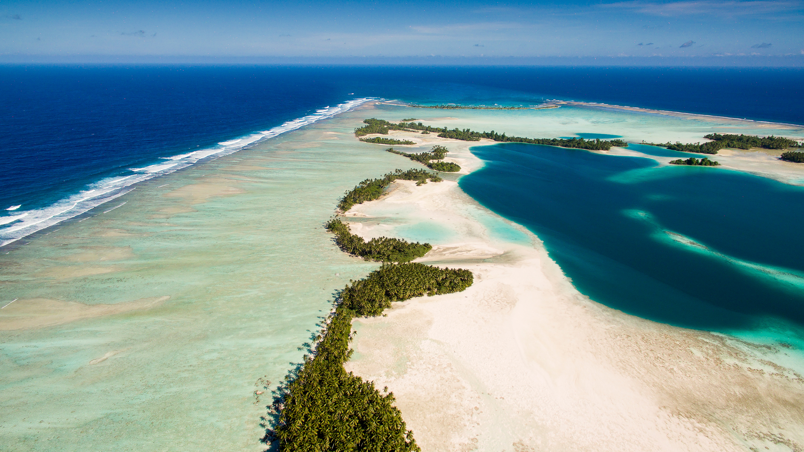 [巴尔米拉环礁国家野生动物保护区，中太平洋 (© Ian Shive/Tandem Stills + Motion)](https://cn.bing.combing_2024-08-26_OHR.PalmyraAtoll_ZH-CN1814325540_UHD.jpg) 2024-08-26 | [急流湖的日出，冰川国家公园，蒙大拿州，美国 (© Jason Savage/Tandem Stills + Motion)](https://cn.bing.combing_2024-08-25_OHR.SwiftcurrentLake_ZH-CN1513761894_UHD.jpg) 2024-08-25|
 |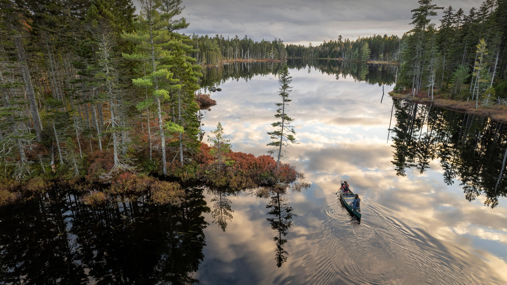 [卡塔丁森林和水域国家纪念碑，佩诺布斯科特县，缅因州，美国 (© Cavan Images/Alamy Stock Photo)](https://cn.bing.combing_2024-08-24_OHR.KatahdinWoods_ZH-CN0748954905_UHD.jpg) 2024-08-24 | [帕侬蓝寺，武里南府，泰国 (© Banjongseal324/Getty Images)](https://cn.bing.combing_2024-08-23_OHR.PrasatPhanom_ZH-CN0445884858_UHD.jpg) 2024-08-23|
 | [海洋城日出时的鸟瞰图，马里兰州，美国 (© Kevin Olson/Amazing Aerial Agency)](https://cn.bing.combing_2024-08-22_OHR.OceanCityMD_ZH-CN1876928284_UHD.jpg) 2024-08-22 |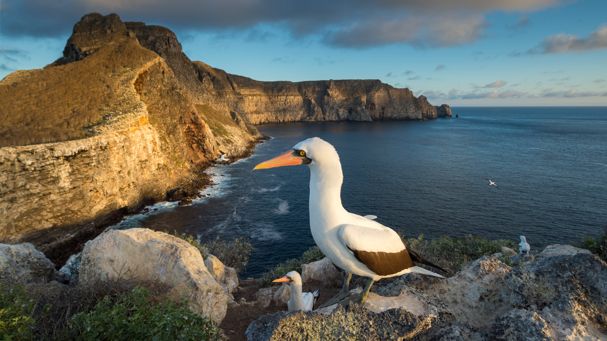 [纳斯卡鲣鸟，沃尔夫岛，加拉帕戈斯群岛，厄瓜多尔 (© Tui De Roy/Minden Pictures)](https://cn.bing.combing_2024-08-21_OHR.NazcaBooby_ZH-CN1534931799_UHD.jpg) 2024-08-21|
 |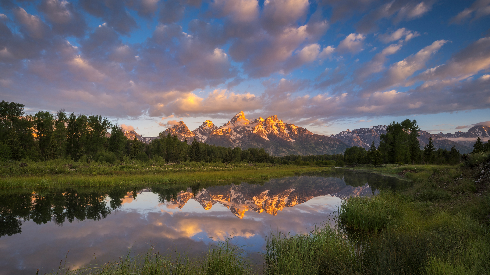 [大提顿国家公园日出,怀俄明州,美国 (© Kurt Budliger/TANDEM Stills + Motion)](https://cn.bing.combing_2024-08-20_OHR.TetonSunrise_ZH-CN1118823848_UHD.jpg) 2024-08-20 | [Bufadero de la Garita，大加那利岛，西班牙 (© Marco Bottigelli/Getty Images)](https://cn.bing.combing_2024-08-19_OHR.RegataSanGines_ZH-CN0807566522_UHD.jpg) 2024-08-19|
 | [日落时的亨廷顿海滩码头，加利福尼亚州，美国 (© Stan Moniz Photography/TANDEM Stills + Motion)](https://cn.bing.combing_2024-08-18_OHR.HuntingtonBeach_ZH-CN0368691951_UHD.jpg) 2024-08-18 |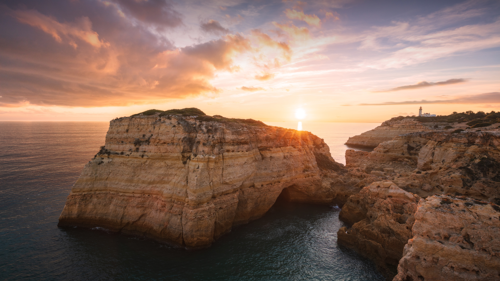 [阿尔凡齐纳灯塔，阿尔加维，葡萄牙 (© Andreas Kunz/Getty Images)](https://cn.bing.combing_2024-08-17_OHR.AlfanzinaLighthouse_ZH-CN9704515669_UHD.jpg) 2024-08-17|
 | [长岛温泉乐园的过山车，三重县，日本 (© Japanese amateur photographer/Getty Images)](https://cn.bing.combing_2024-08-16_OHR.JapanRollerCoaster_ZH-CN7954058301_UHD.jpg) 2024-08-16 |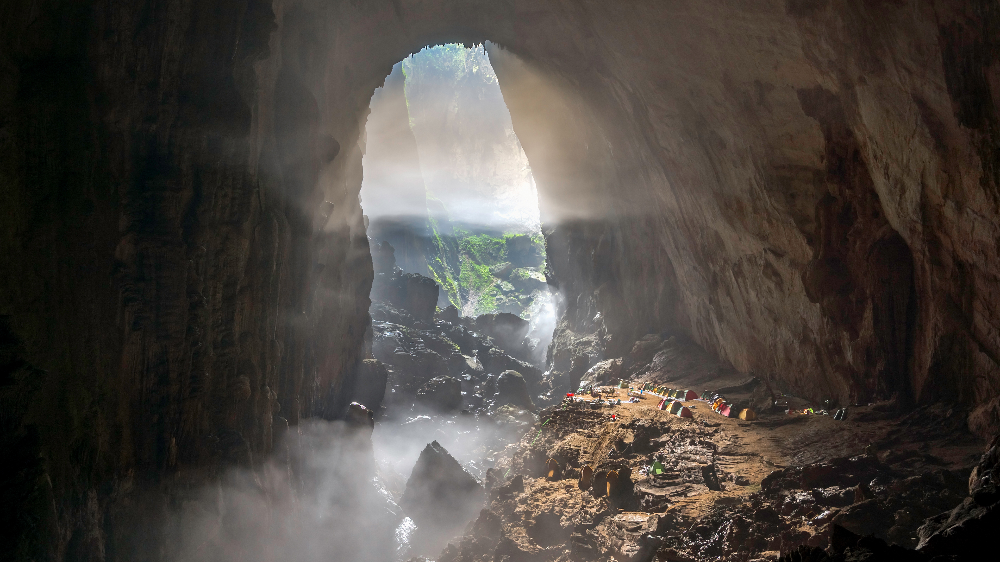 [韩松洞，风牙者榜国家公园，越南 (© Geng Xu/Getty Images)](https://cn.bing.combing_2024-08-15_OHR.HangCave_ZH-CN9217507365_UHD.jpg) 2024-08-15|
 | [澳洲魔蜥，瓦塔卡国家公园，澳大利亚 (© Yva Momatiuk and John Eastcott/Minden Pictures)](https://cn.bing.combing_2024-08-14_OHR.WatarrkaLizard_ZH-CN7974623468_UHD.jpg) 2024-08-14 |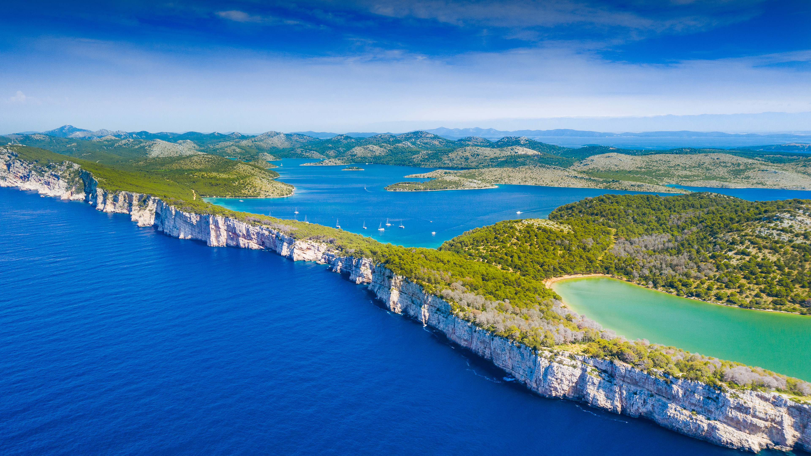 [特拉斯契卡自然公园悬崖，杜吉奥托克岛，克罗地亚 (© Ilija Ascic/Shutterstock)](https://cn.bing.combing_2024-08-13_OHR.DugiOtokCroatia_ZH-CN7791404392_UHD.jpg) 2024-08-13|
 |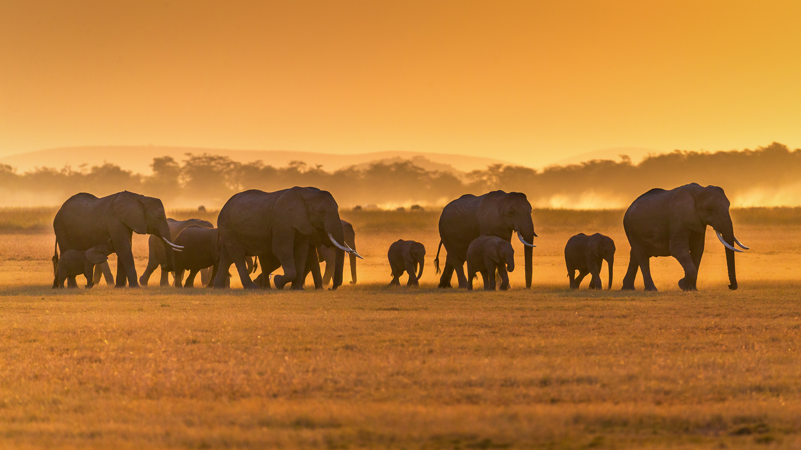 [非洲象，肯尼亚安博塞利国家公园 (© Ruzdi Ekenheim/Getty Images)](https://cn.bing.combing_2024-08-12_OHR.ElephantsAmboseli_ZH-CN7596989061_UHD.jpg) 2024-08-12 |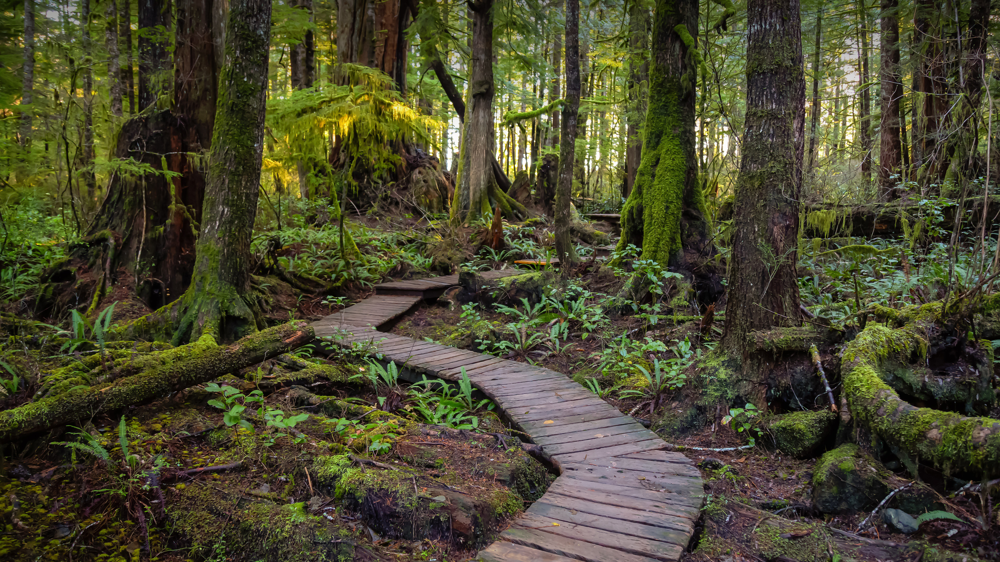 [通往肯尼迪湖的木板路，温哥华岛，加拿大不列颠哥伦比亚省 (© EB Adventure Photography/Shutterstock)](https://cn.bing.combing_2024-08-11_OHR.TofinoVancouver_ZH-CN6920493172_UHD.jpg) 2024-08-11|
 |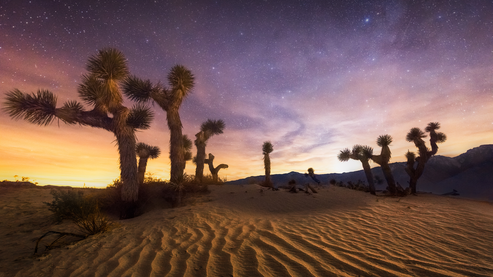 [约书亚树国家公园，加利福尼亚州，美国 (© Chris Moore - Exploring Light Photography/TANDEM Stills + Motion)](https://cn.bing.combing_2024-08-10_OHR.JoshuaTreeNP_ZH-CN5917576674_UHD.jpg) 2024-08-10 |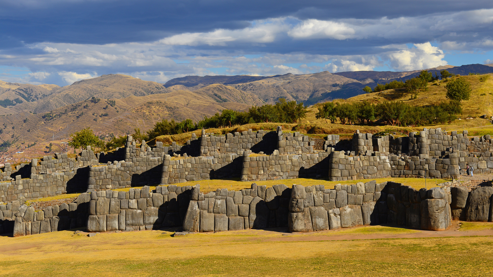 [库斯科附近的萨克塞华曼印加遗址，秘鲁 (© SL_Photography/Getty Images)](https://cn.bing.combing_2024-08-09_OHR.IncaRuinPeru_ZH-CN5068602301_UHD.jpg) 2024-08-09|
 |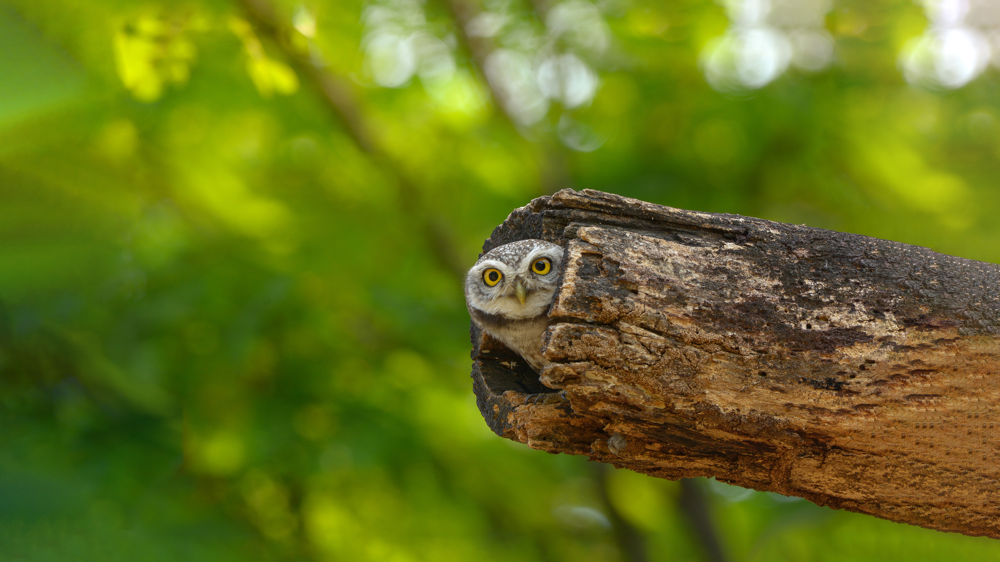 [横斑腹小鸮，曼谷，泰国 (© Tfilm/Getty Images)](https://cn.bing.combing_2024-08-08_OHR.SpottedOwlet_ZH-CN0841935587_UHD.jpg) 2024-08-08 | [圣约瑟夫北码头内灯和外灯，密歇根州，美国 (© Kenneth Keifer/Getty Images)](https://cn.bing.combing_2024-08-07_OHR.MichiganLighthouse_ZH-CN0581377136_UHD.jpg) 2024-08-07|
 | [莫洛基尼，毛伊岛，夏威夷，美国 (© Douglas Peebles/eStock Photo)](https://cn.bing.combing_2024-08-06_OHR.MolokiniHawaii_ZH-CN0375050872_UHD.jpg) 2024-08-06 |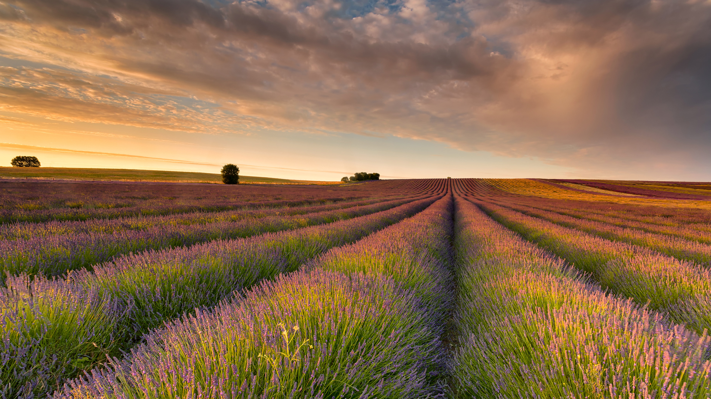 [薰衣草田，赫特福德郡 ，英格兰，英国 (© George W Johnson/Getty Images)](https://cn.bing.combing_2024-08-05_OHR.HertfordshireLavender_ZH-CN9771886404_UHD.jpg) 2024-08-05|
 |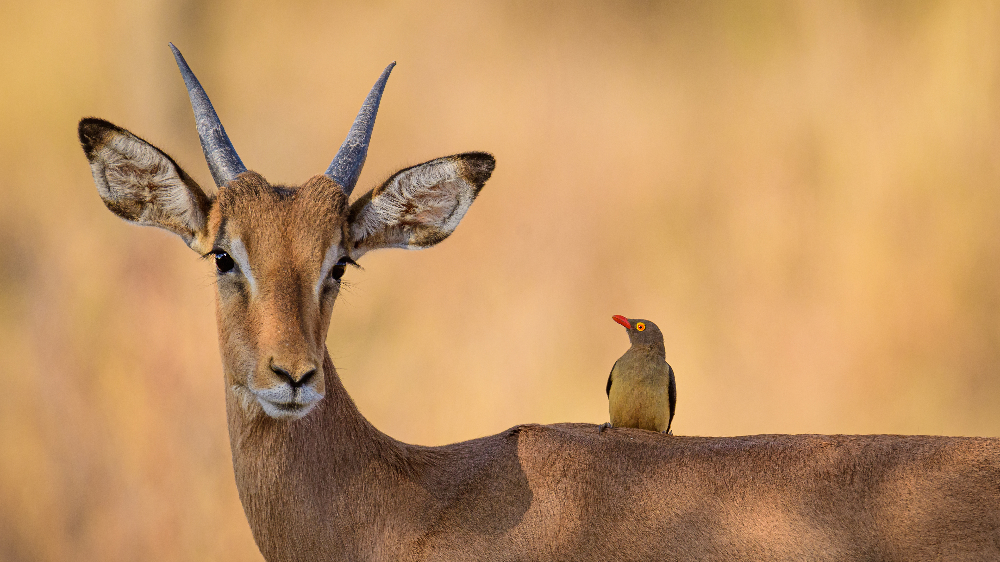 [黑斑羚和红嘴牛椋鸟，南非 (© Matrishva Vyas/Getty Images)](https://cn.bing.combing_2024-08-04_OHR.ImpalaOxpecker_ZH-CN9652434873_UHD.jpg) 2024-08-04 |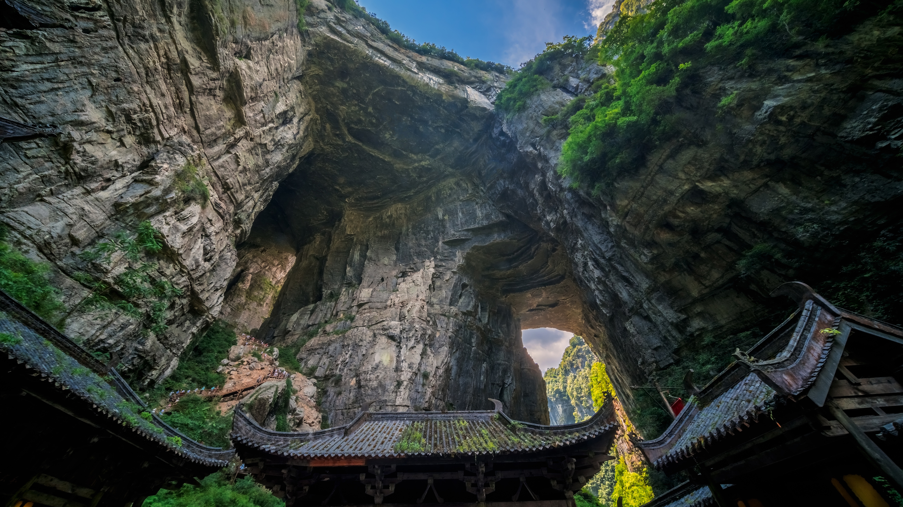 [天生三桥，重庆武隆岩溶国家地质公园，中国 (© Pav-Pro Photography Ltd/Shutterstock)](https://cn.bing.combing_2024-08-03_OHR.WulongKarst_ZH-CN9386528384_UHD.jpg) 2024-08-03|
 | [象鼻湾，维尔京群岛国家公园，圣约翰岛 (© wheatley/Getty Images)](https://cn.bing.combing_2024-08-02_OHR.TrunkBay_ZH-CN9268190655_UHD.jpg) 2024-08-02 | [卡普泰湖水上市场，兰加马蒂，孟加拉 (© Azim Khan Ronnie/Amazing Aerial Agency)](https://cn.bing.combing_2024-08-01_OHR.KaptaiLake_ZH-CN9085738832_UHD.jpg) 2024-08-01|

### 2024-07

|     |    |
| ---- | ---- |
 |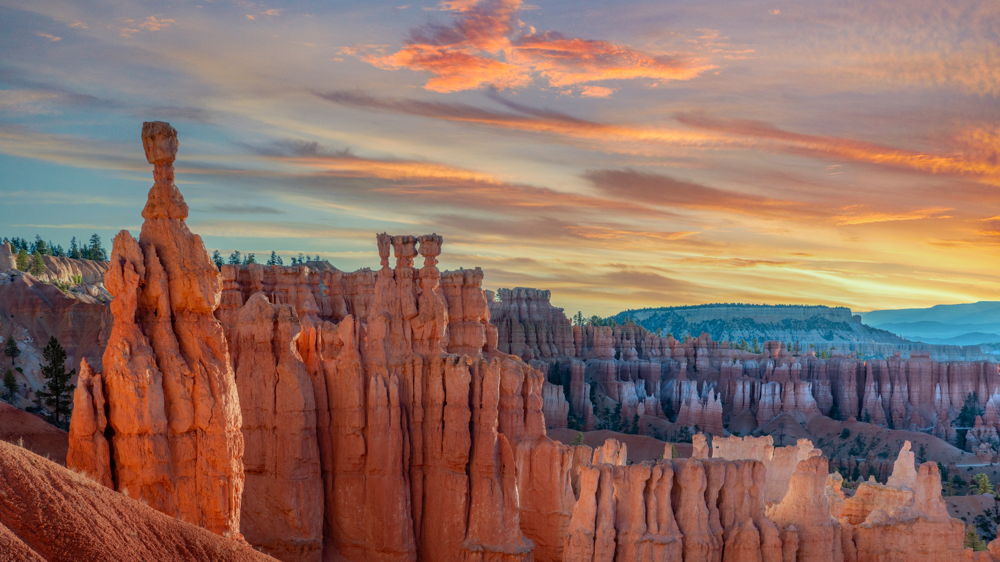 [石林，日落点，布莱斯峡谷国家公园，犹他州，美国 (© Tim Fitzharris/Minden Pictures)](https://cn.bing.combing_2024-07-31_OHR.HoodoosBryce_ZH-CN8398575172_UHD.jpg) 2024-07-31 |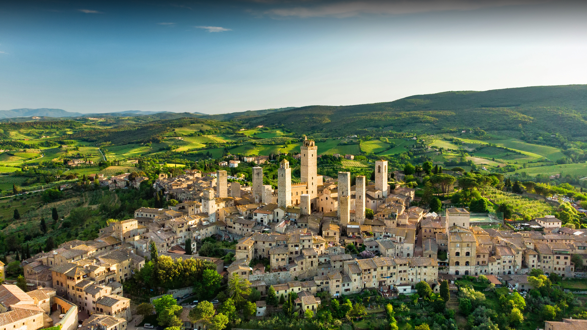 [圣吉米尼亚诺，锡耶纳，托斯卡纳大区，意大利亚 (© MNStudio/Shutterstock)](https://cn.bing.combing_2024-07-30_OHR.GimignanoTuscany_ZH-CN8059318824_UHD.jpg) 2024-07-30|
 |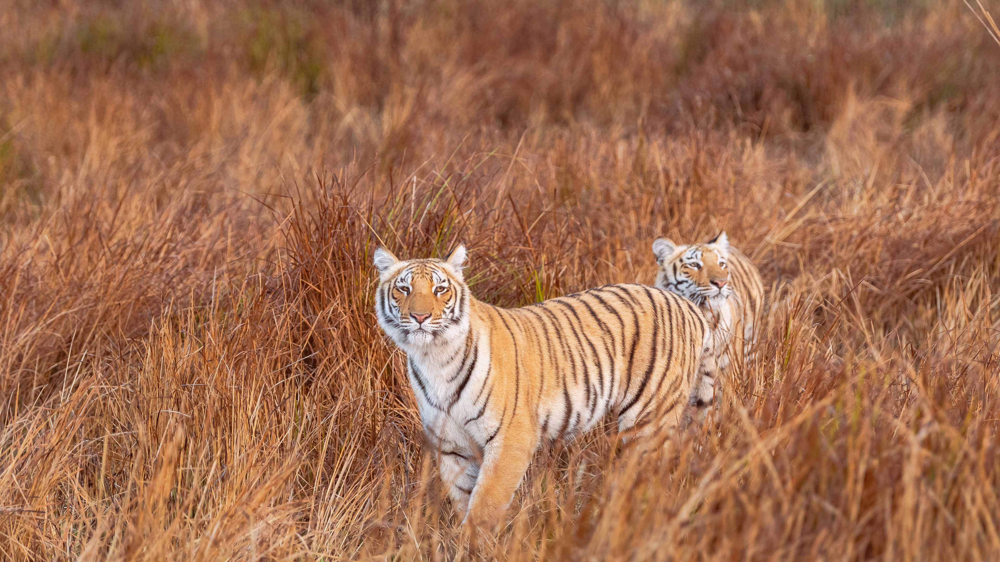 [科贝国家公园的老虎兄弟，北阿坎德邦，印度 (© Sourabh Bharti/Getty Images)](https://cn.bing.combing_2024-07-29_OHR.CorbettTigers_ZH-CN6927569938_UHD.jpg) 2024-07-29 | [斯科讷省海滩上的浴场小屋，瑞典 (© Martin Wahlborg/Getty Images)](https://cn.bing.combing_2024-07-28_OHR.BeachHutsSweden_ZH-CN4193150313_UHD.jpg) 2024-07-28|
 |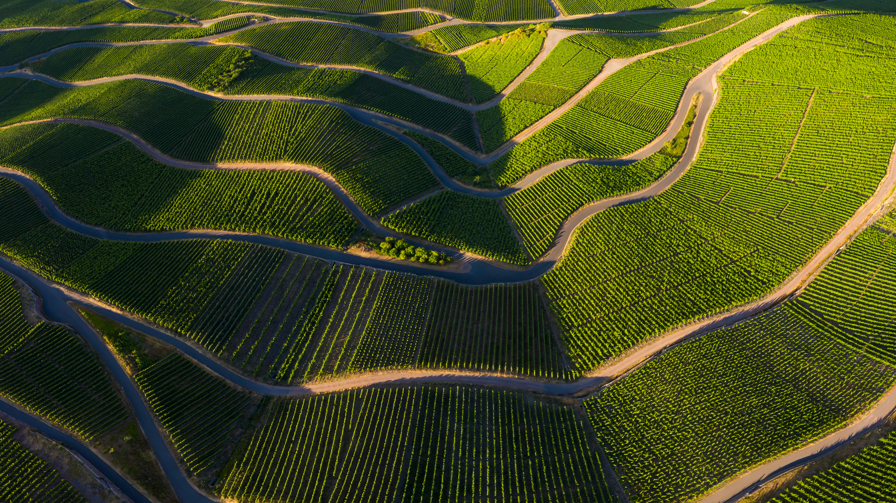 [摩泽尔河谷的葡萄园，莱茵兰-法尔茨，德国 (© Jorg Greuel/Getty Images)](https://cn.bing.combing_2024-07-27_OHR.RhinelandVineyards_ZH-CN3332101688_UHD.jpg) 2024-07-27 | [塞纳河上的新桥，巴黎，法国 (© f11photo/Getty Images)](https://cn.bing.combing_2024-07-26_OHR.PontNeuf_ZH-CN3158359446_UHD.jpg) 2024-07-26|
 |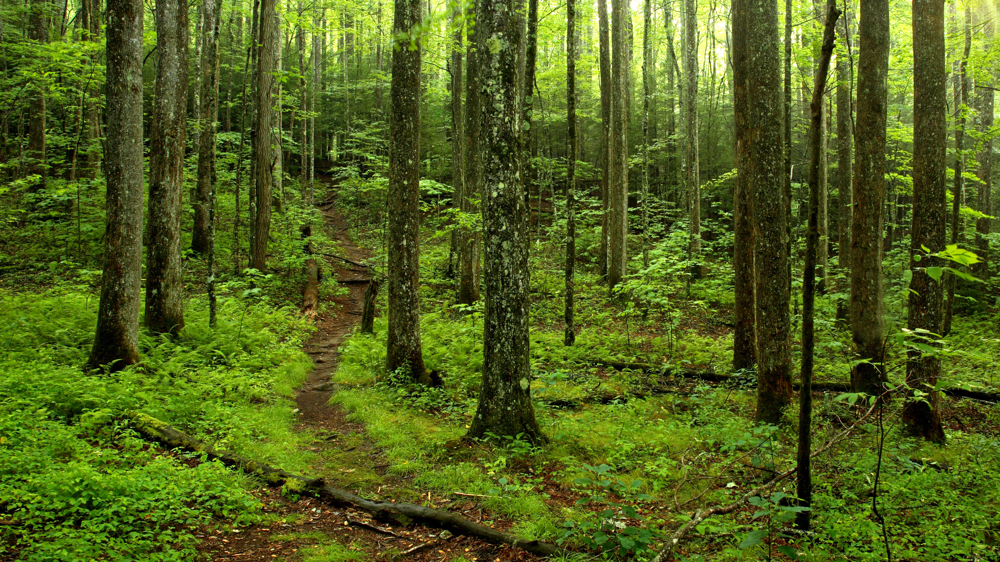 [大烟山国家公园的森林小道，田纳西州，美国 (© putmanphoto/Getty Images)](https://cn.bing.combing_2024-07-25_OHR.SmokyMountainTrail_ZH-CN4691667074_UHD.jpg) 2024-07-25 | [北约克郡的黑面羊羊群，英格兰 (© R A Kearton/Getty Images)](https://cn.bing.combing_2024-07-24_OHR.SheepCousins_ZH-CN4262132476_UHD.jpg) 2024-07-24|
 | [迈索尼城堡，麦西尼亚州，希腊 (© Andrew Mayovskyy/Shutterstock)](https://cn.bing.combing_2024-07-23_OHR.MethoniCastle_ZH-CN4054146065_UHD.jpg) 2024-07-23 | [树上的中国小熊猫, 成都, 四川省, 中国 (© Jackyenjoyphotography/Getty Images)](https://cn.bing.combing_2024-07-22_OHR.TheGreatHeat2024_ZH-CN6033129823_UHD.jpg) 2024-07-22|
 | [肯杜瓦村的木制渔船，桑给巴尔，坦桑尼亚 (© Lubos Paukeje/Alamy Stock Photo)](https://cn.bing.combing_2024-07-21_OHR.ZanzibarBoats_ZH-CN2915388379_UHD.jpg) 2024-07-21 |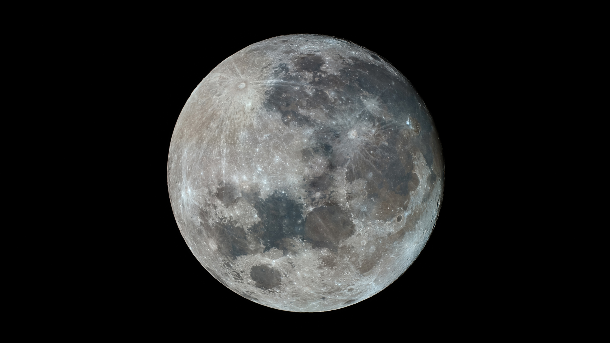 [月球 (© Victor Blum/Getty Images)](https://cn.bing.combing_2024-07-20_OHR.MineralMoon_ZH-CN2555749456_UHD.jpg) 2024-07-20|
 |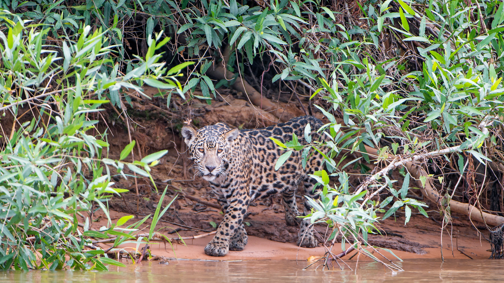 [河岸上的一只年轻美洲虎，潘塔纳尔，巴西 (© Tambako the Jaguar/Getty Images)](https://cn.bing.combing_2024-07-19_OHR.YoungJaguar_ZH-CN2249923627_UHD.jpg) 2024-07-19 |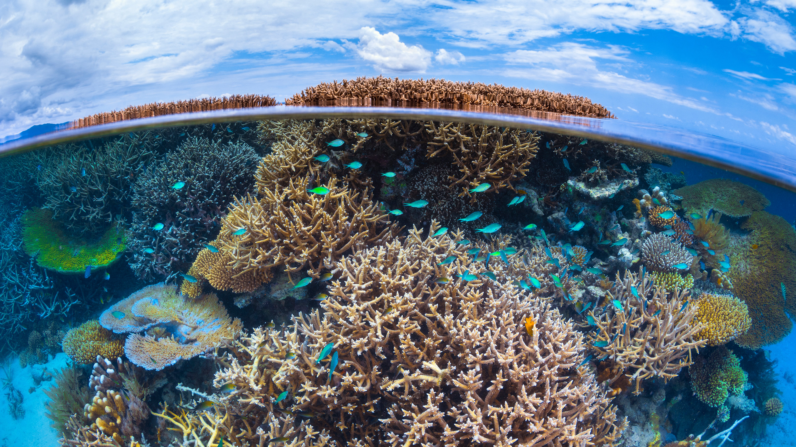 [Coral reef in the Indian Ocean, Mayotte, France (© Gabriel Barathieu/Minden Pictures)](https://cn.bing.combing_2024-07-18_OHR.MayotteCoral_ZH-CN8106288026_UHD.jpg) 2024-07-18|
 | [Coral reef in the Indian Ocean, Mayotte, France (© Gabriel Barathieu/Minden Pictures)](https://cn.bing.combing_2024-07-18_OHR.MayotteCoral_ZH-CN8106288026_UHD.jpg) 2024-07-17 | [立石公园，神奈川县，日本 (© blew_s/Shutterstock)](https://cn.bing.combing_2024-07-15_OHR.TateishiPark_ZH-CN9903501398_UHD.jpg) 2024-07-15|
 |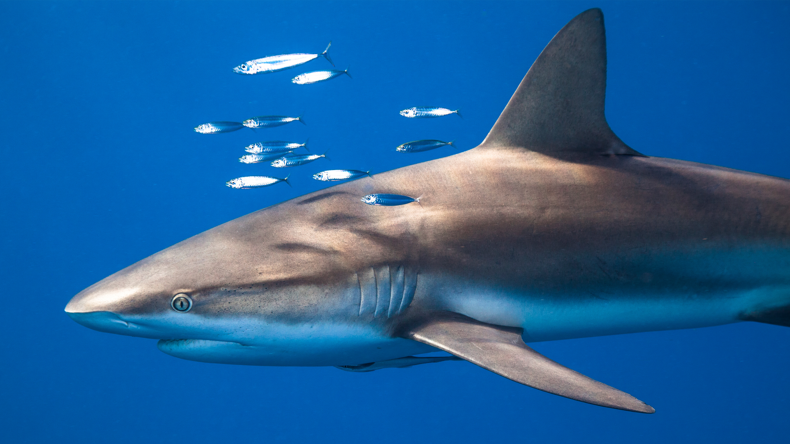 [女王花园群岛的镰形真鲨，古巴 (© Christian Vizl/Tandem Stills + Motion)](https://cn.bing.combing_2024-07-14_OHR.SilkyShark_ZH-CN9523915460_UHD.jpg) 2024-07-14 |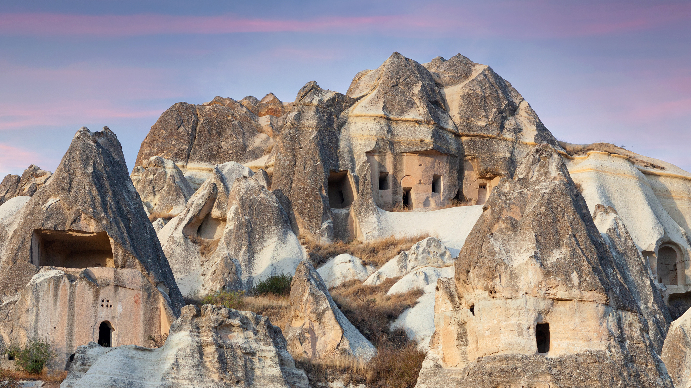 [卡帕多西亚的童话烟囱和窑洞，土耳其 (© Storm Is Me/Shutterstock)](https://cn.bing.combing_2024-07-13_OHR.CappadociaRocks_ZH-CN9283633861_UHD.jpg) 2024-07-13|
 |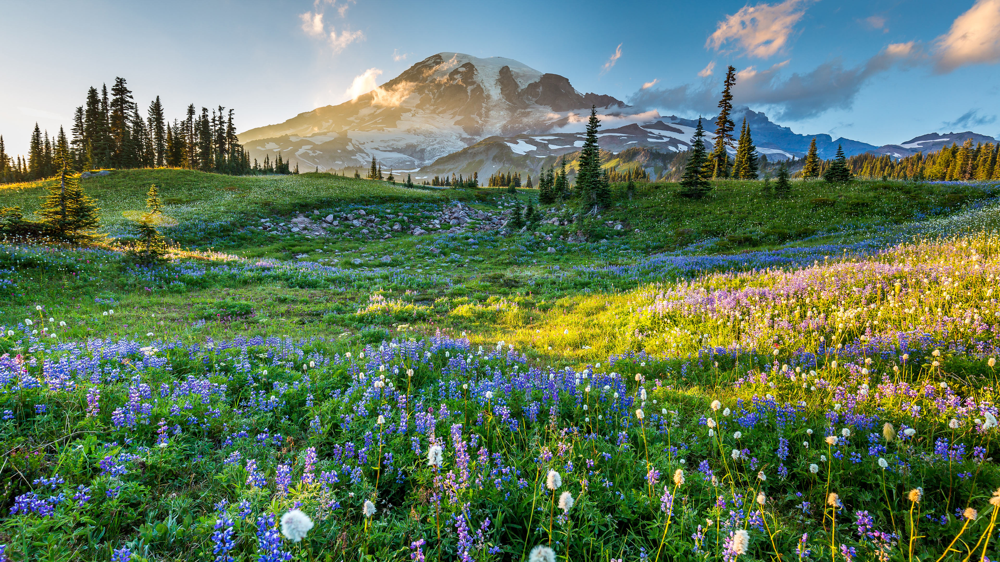 [雷尼尔山国家公园的野花，华盛顿州，美国 (© RomanKhomlyak/Getty Images)](https://cn.bing.combing_2024-07-12_OHR.RainierWildflowers_ZH-CN7392242353_UHD.jpg) 2024-07-12 |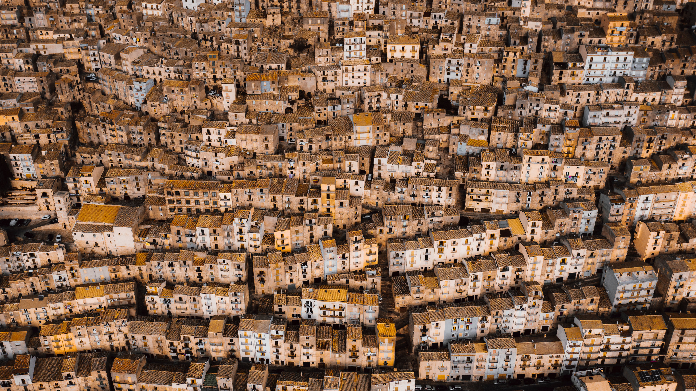 [甘吉，西西里岛，意大利 (© Andrea Caruso/Amazing Aerial Agency)](https://cn.bing.combing_2024-07-11_OHR.GangiSicily_ZH-CN9086944081_UHD.jpg) 2024-07-11|
 |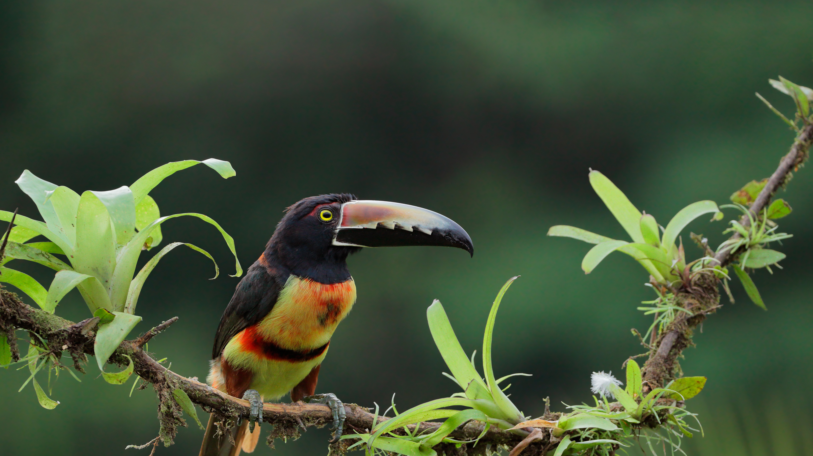 [领簇舌巨嘴鸟，哥斯达黎加 (© Juan Carlos Vindas/Getty Images)](https://cn.bing.combing_2024-07-10_OHR.CollaredAracari_ZH-CN8787234462_UHD.jpg) 2024-07-10 |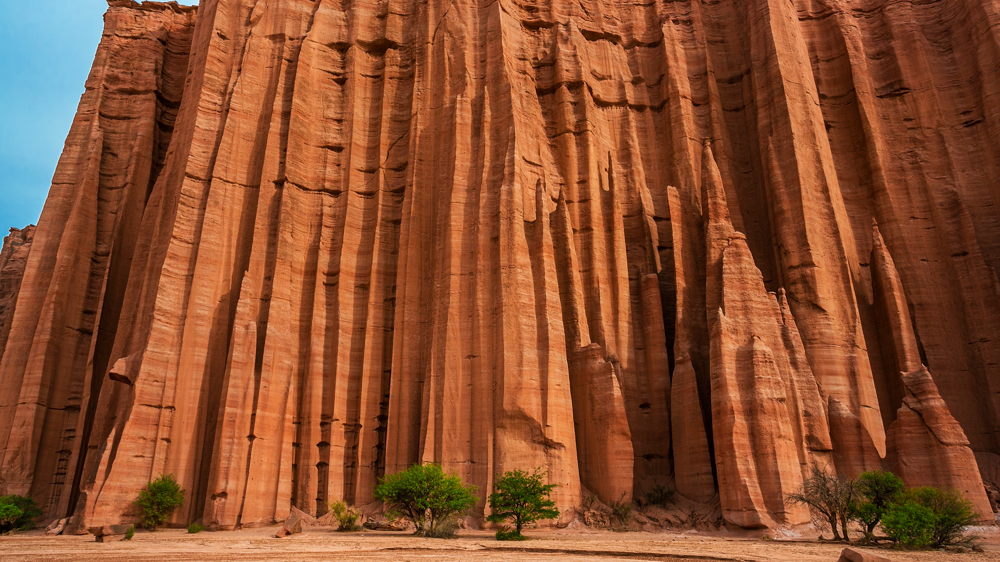 [阿根廷拉里奥哈省塔兰帕亚国家公园 (© Gonzalo Azumendi/Getty Images)](https://cn.bing.combing_2024-07-09_OHR.TalampayaNP_ZH-CN7905859626_UHD.jpg) 2024-07-09|
 |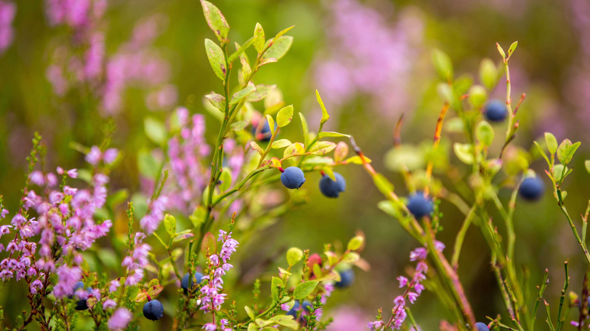 [野生蓝莓 (© Baac3nes/Getty Images)](https://cn.bing.combing_2024-07-08_OHR.NorwayBlueberries_ZH-CN7643097235_UHD.jpg) 2024-07-08 |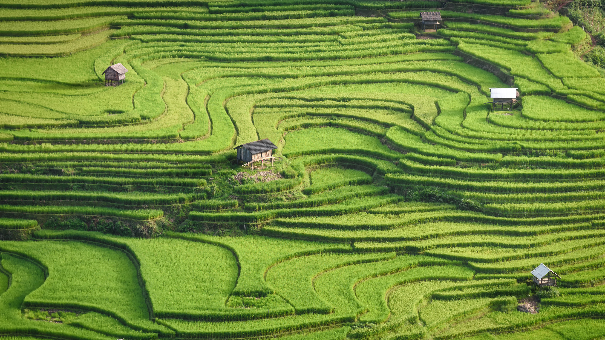 [越南安沛省木仓寨的水稻梯田 (© Kiatanan Sugsompian/Getty Images)](https://cn.bing.combing_2024-07-07_OHR.YenBaiTerraces_ZH-CN7224453501_UHD.jpg) 2024-07-07|
 | [从康威河眺望康威城堡，威尔士 (© David Chapman/Alamy Stock Photo)](https://cn.bing.combing_2024-07-06_OHR.ConwyRiver_ZH-CN6871799250_UHD.jpg) 2024-07-06 | [丹翠雨林的诺亚海滩，昆士兰州，澳大利亚 (© bjeayes/Getty Images)](https://cn.bing.combing_2024-07-05_OHR.NoahBeach_ZH-CN6676061324_UHD.jpg) 2024-07-05|
 |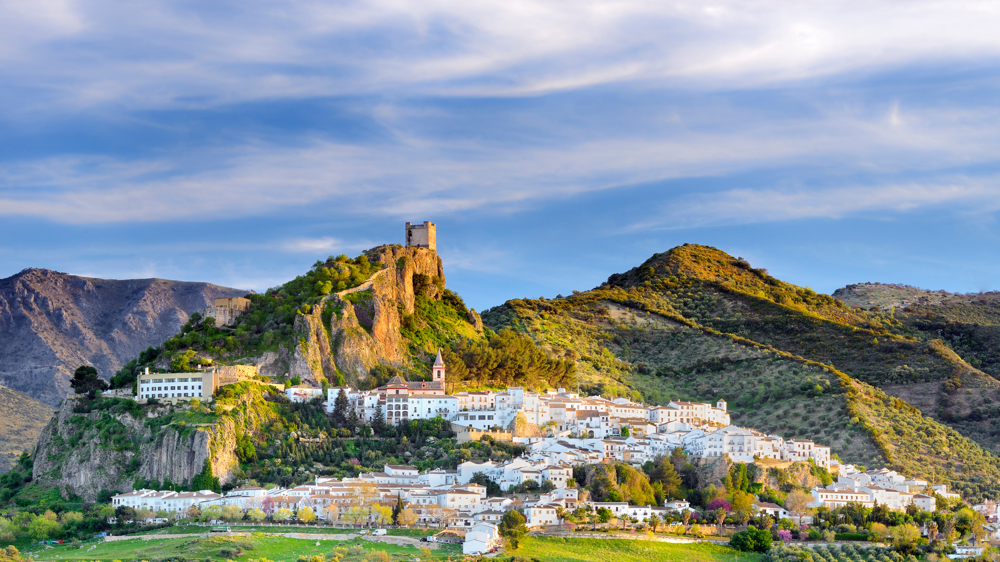 [扎哈拉德拉谢拉，安达卢西亚，西班牙 (© Francesco Carovillano/eStock Photo)](https://cn.bing.combing_2024-07-04_OHR.ZaharaDeLaSierra_ZH-CN6500182265_UHD.jpg) 2024-07-04 | [猫鼬家族 (© anetapics/Shutterstock)](https://cn.bing.combing_2024-07-03_OHR.MeerkatManor_ZH-CN2486051161_UHD.jpg) 2024-07-03|
 |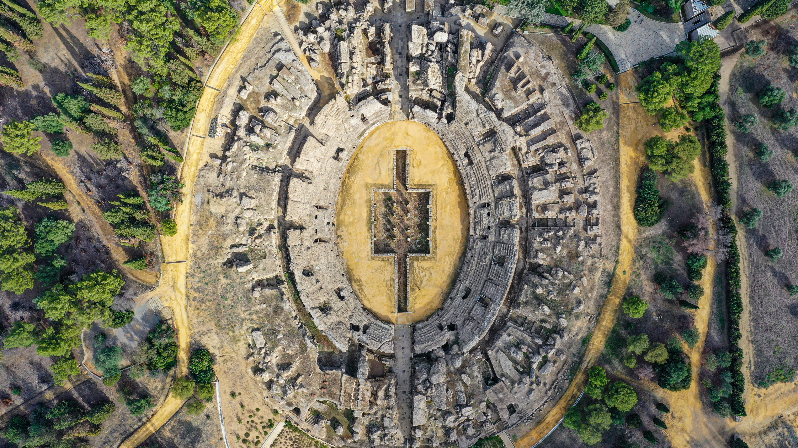 [意大利卡，桑蒂蓬塞的一座古罗马城市，塞维利亚，安达卢西亚，西班牙 (© Moses Palermo/Amazing Aerial Agency)](https://cn.bing.combing_2024-07-02_OHR.ItalicaRuins_ZH-CN5932138207_UHD.jpg) 2024-07-02 | [菲斯加德灯塔，埃斯奎莫尔特港，科尔伍德，不列颠哥伦比亚省，加拿大 (© davemantel/Getty Images)](https://cn.bing.combing_2024-07-01_OHR.FisgardLighthouse_ZH-CN5474064913_UHD.jpg) 2024-07-01|

### 2024-06

|     |    |
| ---- | ---- |
 | [乌布寺庙的石雕,巴厘岛,印度尼西亚 (© R. Schönebaum/plainpicture)](https://cn.bing.combing_2024-06-30_OHR.UbudBali_ZH-CN4891348277_UHD.jpg) 2024-06-30 |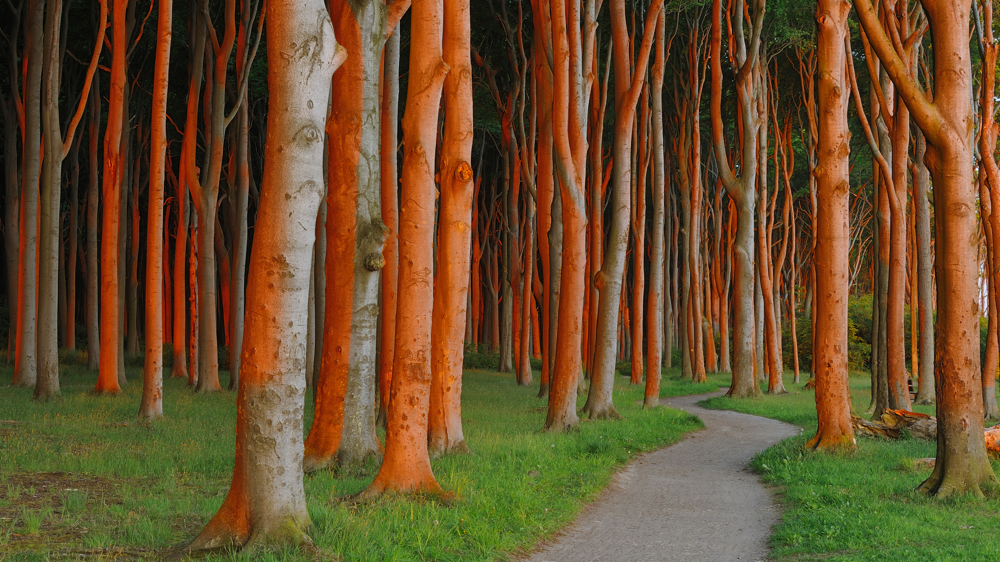 [宁哈根的山毛榉林，梅克伦堡-前波美拉尼亚州，德国 (© Martin Ruegner/Getty Images)](https://cn.bing.combing_2024-06-29_OHR.NienhagenMecklenburg_ZH-CN4482269700_UHD.jpg) 2024-06-29|
 |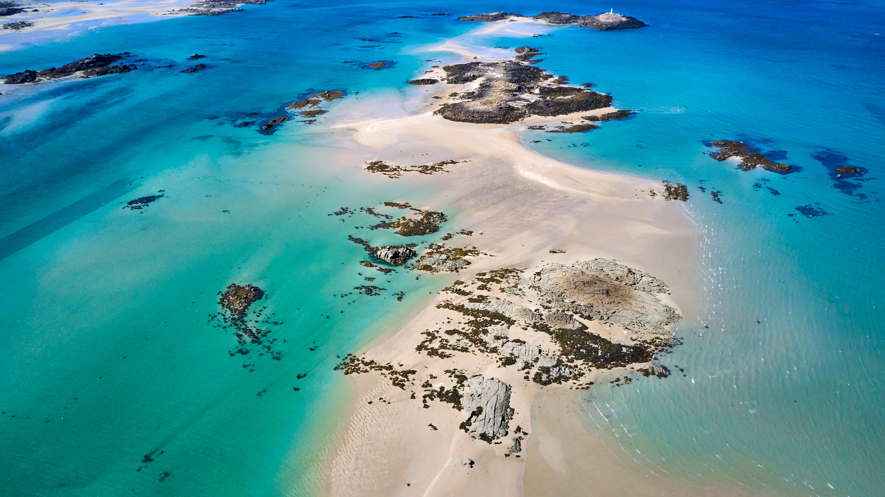 [诺曼底海岸的绍塞群岛，法国 (© Tuul & Bruno Morandi/Getty Images)](https://cn.bing.combing_2024-06-28_OHR.ChauseyIslands_ZH-CN4241103934_UHD.jpg) 2024-06-28 | [黄昏时分的圣母百花大教堂，佛罗伦萨，意大利 (© Elena Pueyo/Getty Images)](https://cn.bing.combing_2024-06-27_OHR.FlorenceDuomo_ZH-CN7379412586_UHD.jpg) 2024-06-27|
 | [考氏鳍竺鲷与海葵，蓝碧海峡，北苏拉威西，印度尼西亚 (© Constantinos Petrinos/NPL/Minden Pictures)](https://cn.bing.combing_2024-06-26_OHR.CardinalfishAnemone_ZH-CN7249037417_UHD.jpg) 2024-06-26 |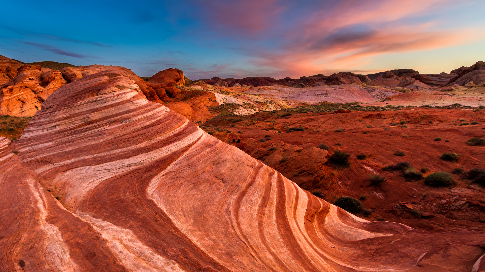 [火浪岩层，火焰谷州立公园，内华达州，美国 (© Clint Losee/Tandem Stills + Motion)](https://cn.bing.combing_2024-06-25_OHR.FireWave_ZH-CN7110736577_UHD.jpg) 2024-06-25|
 |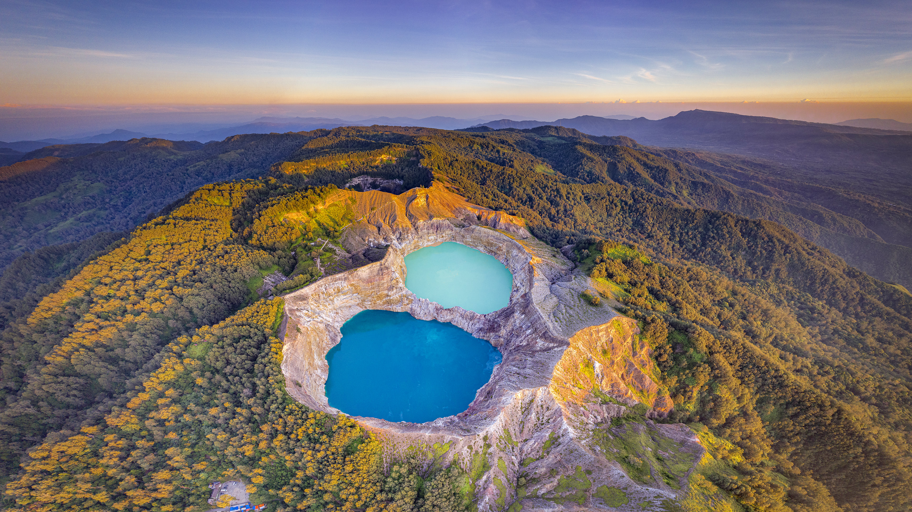 [克里穆图的火山口湖，弗洛勒斯岛，印度尼西亚 (© Shane P. White/Minden Pictures)](https://cn.bing.combing_2024-06-24_OHR.FloresIsland_ZH-CN6930246149_UHD.jpg) 2024-06-24 | [达卡环形交叉路口的鸟瞰图，孟加拉国 (© Azim Khan Ronnie/Amazing Aerial Agency)](https://cn.bing.combing_2024-06-23_OHR.DhakaBangladesh_ZH-CN6777866162_UHD.jpg) 2024-06-23|
 |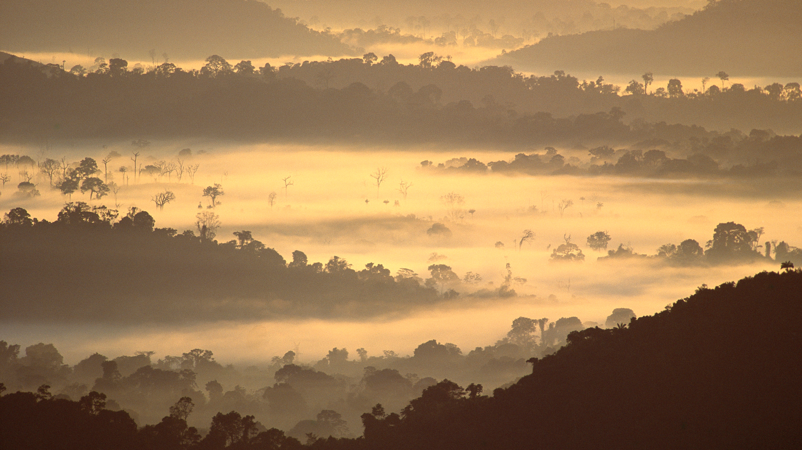 [亚马逊雨林，巴西 (© Claus Meyer/plainpicture)](https://cn.bing.combing_2024-06-22_OHR.BrazilRainforest_ZH-CN6432366530_UHD.jpg) 2024-06-22 | [蓝色水面上的渔船航拍图，郴州市，湖南省，中国 (© Haitong Yu/Getty images)](https://cn.bing.combing_2024-06-21_OHR.SummerSolstice2024_ZH-CN6141918663_UHD.jpg) 2024-06-21|
 |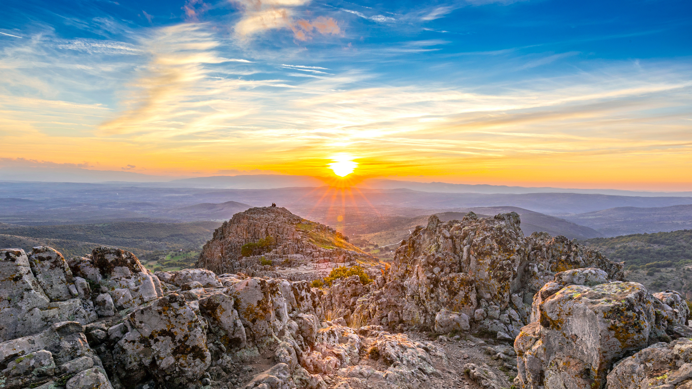 [科基诺，古代巨石观测站，北马其顿 (© stoimilov/Shutterstock)](https://cn.bing.combing_2024-06-20_OHR.KokinoMacedonia_ZH-CN6029529601_UHD.jpg) 2024-06-20 | [库克斯港的水塔，德国 (© Andreas Vogel/Alamy)](https://cn.bing.combing_2024-06-19_OHR.CuxhavenTower_ZH-CN5580118944_UHD.jpg) 2024-06-19|
 |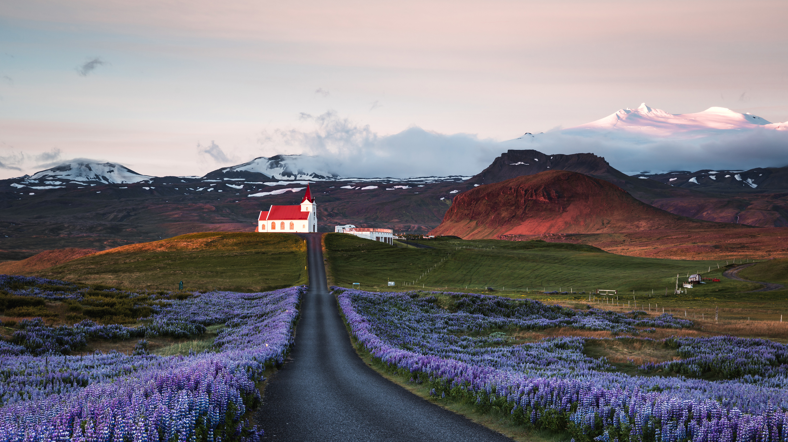 [日出时的羽扇豆田和教堂，斯奈山半岛，冰岛 (© Matteo Colombo/Getty Images)](https://cn.bing.combing_2024-06-18_OHR.LupinIceland_ZH-CN5329147708_UHD.jpg) 2024-06-18 |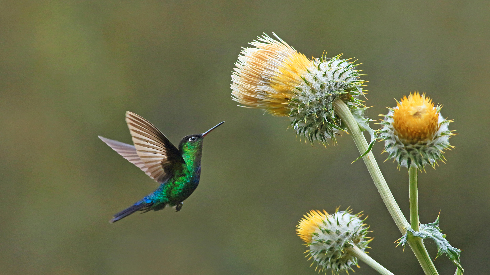 [绿顶辉蜂鸟与巨型蓟，穆埃尔特山，哥斯达黎加 (© adrian hepworth/Alamy Stock Photo)](https://cn.bing.combing_2024-06-17_OHR.HummingThistle_ZH-CN5057539905_UHD.jpg) 2024-06-17|
 | [赤狐父子，华盛顿，美国 (© Chase Dekker/Minden Pictures)](https://cn.bing.combing_2024-06-16_OHR.RedFoxDad_ZH-CN4894022141_UHD.jpg) 2024-06-16 |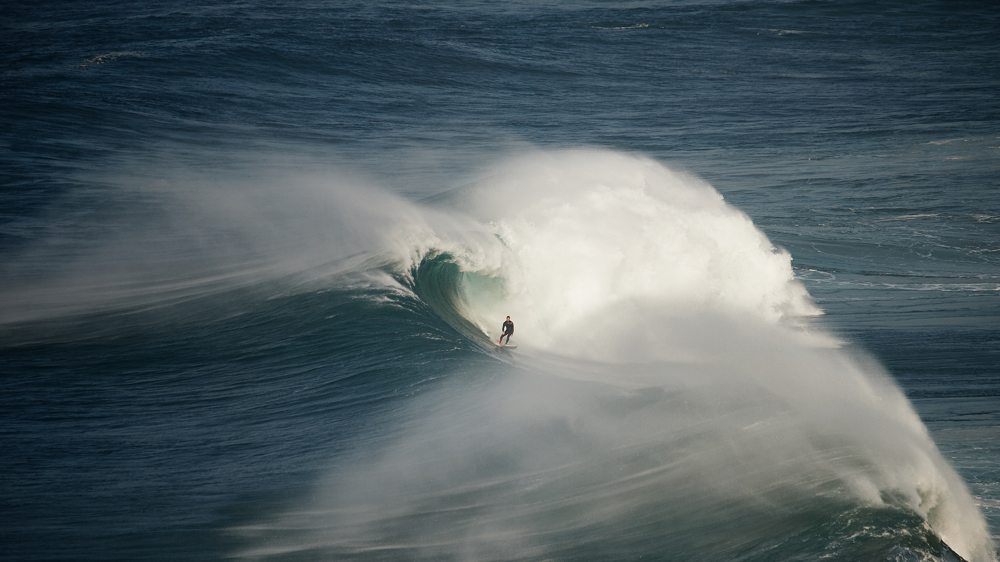 [在纳扎雷冲浪的冲浪者，葡萄牙 (© Rui Caria/Getty Images)](https://cn.bing.combing_2024-06-15_OHR.NazareWave_ZH-CN4575182192_UHD.jpg) 2024-06-15|
 |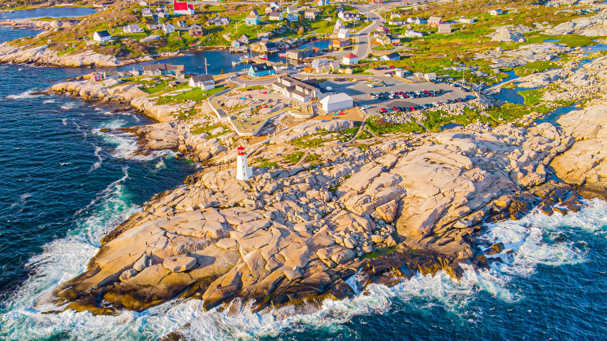 [佩姬湾灯塔，新斯科舍省，加拿大 (© Pugalenthi/Getty Images)](https://cn.bing.combing_2024-06-14_OHR.PeggysCove_ZH-CN4221190894_UHD.jpg) 2024-06-14 | [雷吉斯坦广场的外立面马赛克，撒马尔罕，乌兹别克斯坦撒 (© da-kuk/Getty Images)](https://cn.bing.combing_2024-06-13_OHR.RegistanUzbekistan_ZH-CN7850329702_UHD.jpg) 2024-06-13|
 |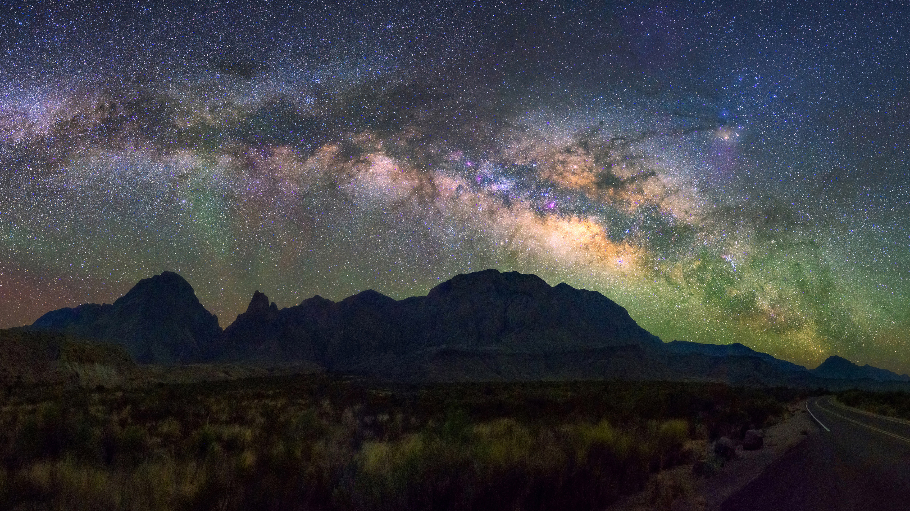 [大弯国家公园上空的银河，得克萨斯州，美国 (© wisanuboonrawd/Adobe Stock)](https://cn.bing.combing_2024-06-12_OHR.BigBendMilkyWay_ZH-CN7709015605_UHD.jpg) 2024-06-12 |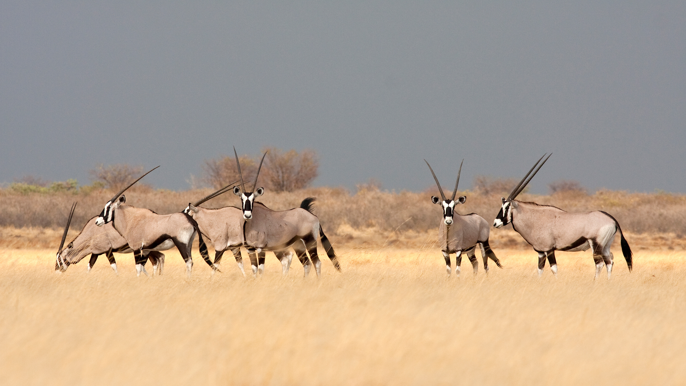 [热带稀树草原上的南非剑羚，博茨瓦纳大草原 (© Karine Aigner/Tandem Stills + Motion)](https://cn.bing.combing_2024-06-11_OHR.GemsbokBotswana_ZH-CN7507199339_UHD.jpg) 2024-06-11|
 | [龙舟池日出，集美区，厦门，中国 (© outcast85/Getty images)](https://cn.bing.combing_2024-06-10_OHR.DragonBoatFestival2024_ZH-CN6619827853_UHD.jpg) 2024-06-10 |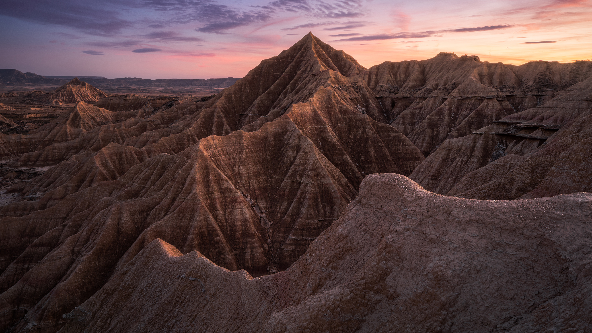 [巴尔德纳斯雷亚尔斯自然公园，巴德纳斯，纳瓦拉，西班牙 (© Aliaume Chapelle/Tandem Stills + Motion)](https://cn.bing.combing_2024-06-09_OHR.BardenasBiosphere_ZH-CN6198033700_UHD.jpg) 2024-06-09|
 |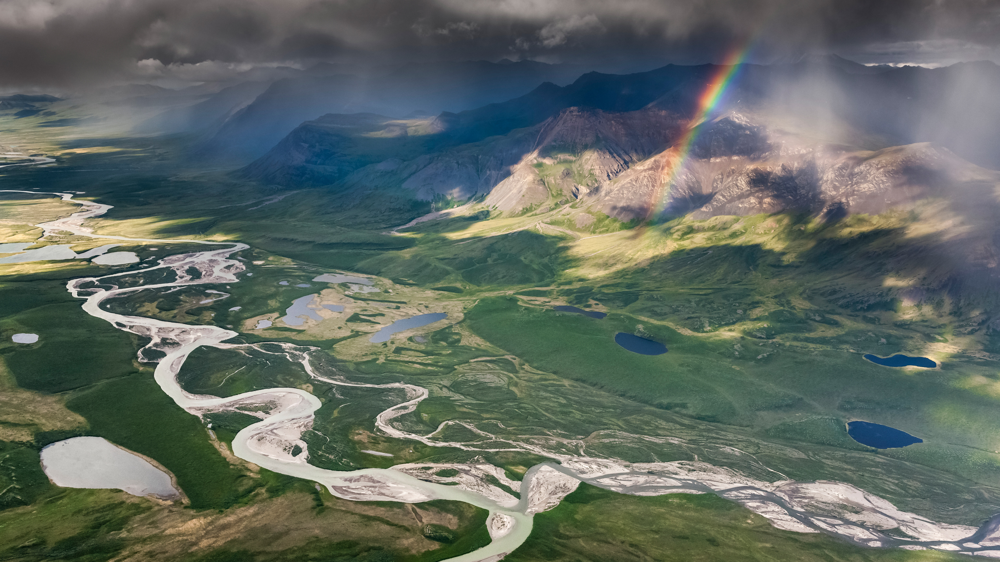 [复活节溪和基利克河的交汇处，北极之门国家公园，阿拉斯加州，美国 (© Patrick J. Endres/Getty Images)](https://cn.bing.combing_2024-06-08_OHR.KillikRiverAlaska_ZH-CN5736211272_UHD.jpg) 2024-06-08 |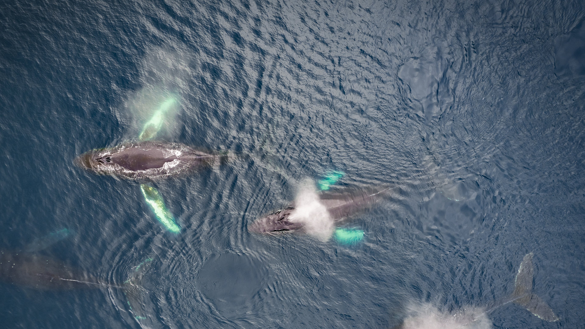 [座头鲸家族，荷兰港，阿拉斯加州 (© Jude Newkirk/Amazing Aerial Agency)](https://cn.bing.combing_2024-06-07_OHR.HumpbackFamily_ZH-CN4336100531_UHD.jpg) 2024-06-07|
 |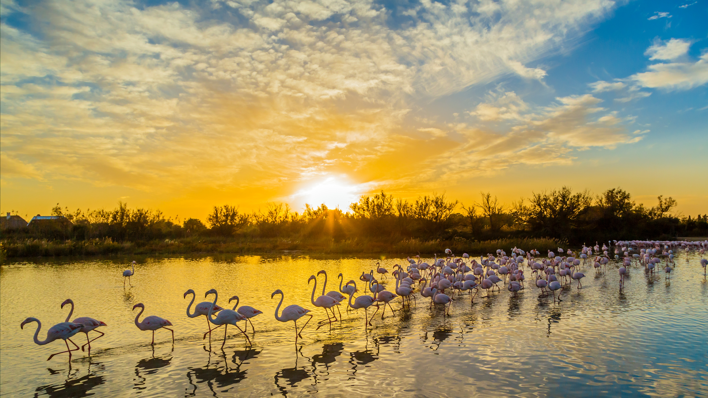 [蓬德高鸟类公园的大红鹳，卡玛格，法国 (© Yann Guichaoua-Photos/Getty Images)](https://cn.bing.combing_2024-06-06_OHR.CamargueFlamingos_ZH-CN4176922228_UHD.jpg) 2024-06-06 |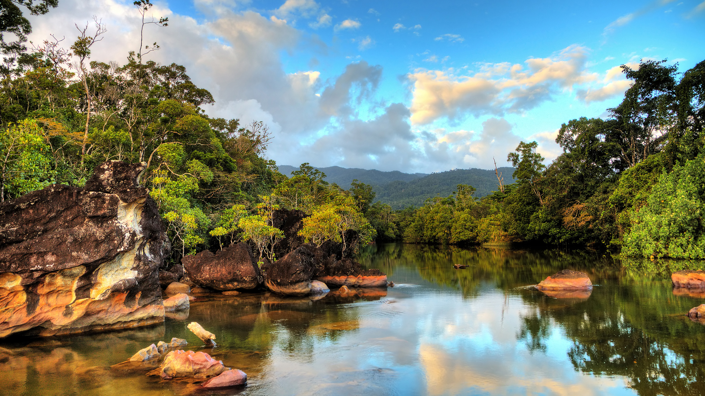 [马达加斯加的马苏阿拉国家公园 (© Dennis van de Water/Shutterstock)](https://cn.bing.combing_2024-06-05_OHR.MadagascarRiver_ZH-CN3842472014_UHD.jpg) 2024-06-05|
 |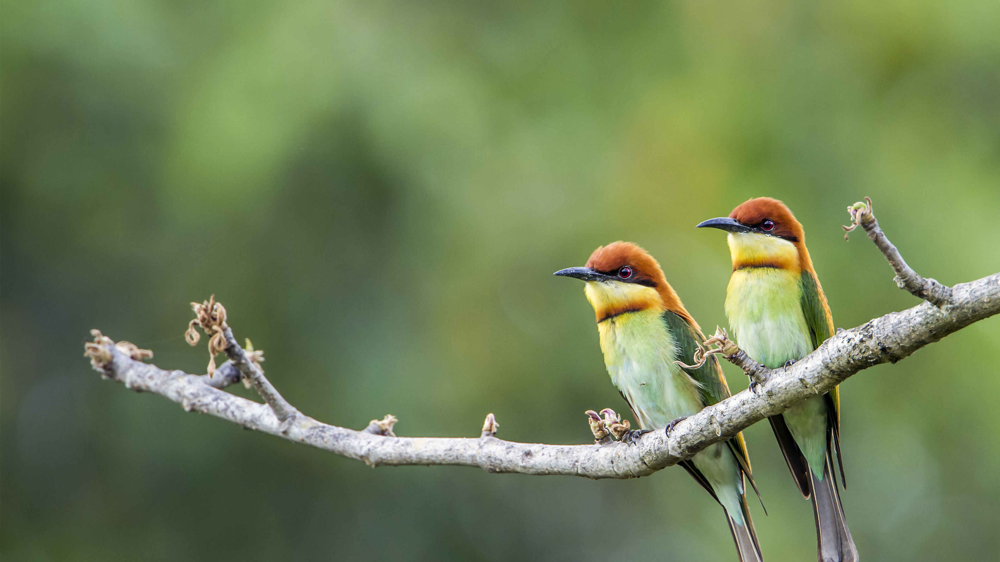 [黑胸蜂虎，巴迪亚国家公园，尼泊尔 (© PACO COMO/Shutterstock)](https://cn.bing.combing_2024-06-04_OHR.ChestnutBeeEater_ZH-CN3514753872_UHD.jpg) 2024-06-04 | [哥本哈根的自行车，丹麦 (© Alphotographic/Getty Images)](https://cn.bing.combing_2024-06-03_OHR.CopenhagenBicycles_ZH-CN3047958346_UHD.jpg) 2024-06-03|
 | [普卢马纳克的灯塔，阿摩尔滨海省，法国 (© Christian Handl/Getty Images)](https://cn.bing.combing_2024-06-02_OHR.MenRuz_ZH-CN2021725181_UHD.jpg) 2024-06-02 |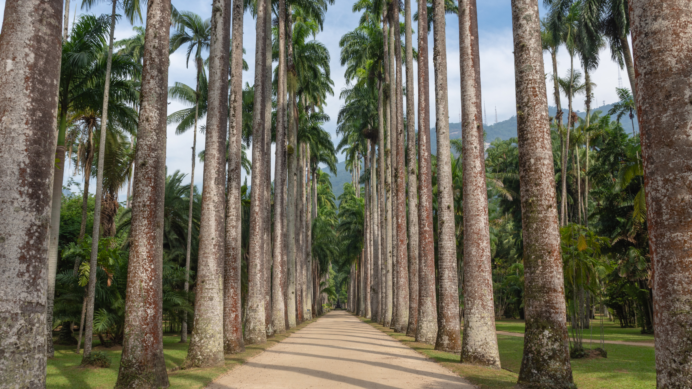 [帝王棕榈树，里约热内卢植物园，巴西 (© Marcia Silva de Mendonca/Getty Images)](https://cn.bing.combing_2024-06-01_OHR.CancaoDoExilio_ZH-CN1012675104_UHD.jpg) 2024-06-01|

### 2024-05

|     |    |
| ---- | ---- |
 | [冈纳塞德，斯韦尔代尔，约克郡谷地国家公园，英格兰 (© Derek Croucher/Alamy Stock Photo)](https://cn.bing.combing_2024-05-31_OHR.YorkshireDalesNP_ZH-CN0775378262_UHD.jpg) 2024-05-31 |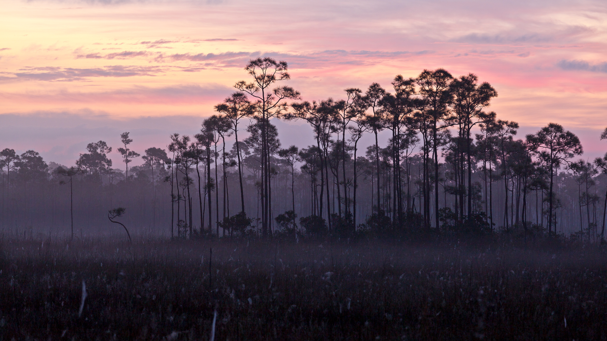 [一片斜纹松和锯齿草大沼泽地国家公园，佛罗里达州，美国 (© Jonathan Gewirtz/Tandem Stills + Motion)](https://cn.bing.combing_2024-05-30_OHR.Everglades90th_ZH-CN9853372570_UHD.jpg) 2024-05-30|
 | [青春期的欧洲水獭，斯佩尔维湖，苏格兰姆尔斯岛 (© Neil Henderson/Alamy Stock Photo)](https://cn.bing.combing_2024-05-29_OHR.MullOtter_ZH-CN9691813587_UHD.jpg) 2024-05-29 |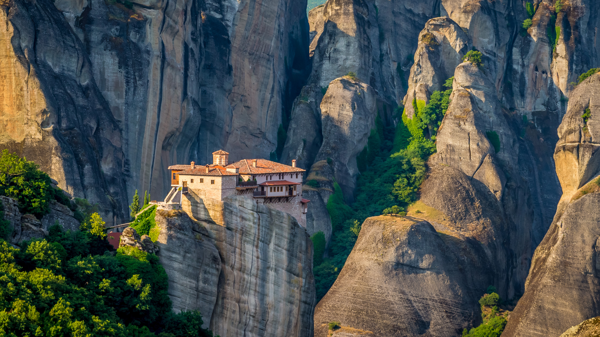 [罗萨诺修道院，迈泰奥拉，色萨利 ，希腊 (© Marius Roman/Getty Images)](https://cn.bing.combing_2024-05-28_OHR.MeteoraMonastery_ZH-CN9551991708_UHD.jpg) 2024-05-28|
 | [塞斯特里莱万特的沉默湾，利古里亚大区，意大利 (© StevanZZ/Getty Images)](https://cn.bing.combing_2024-05-27_OHR.SestriLevante_ZH-CN9286254645_UHD.jpg) 2024-05-27 |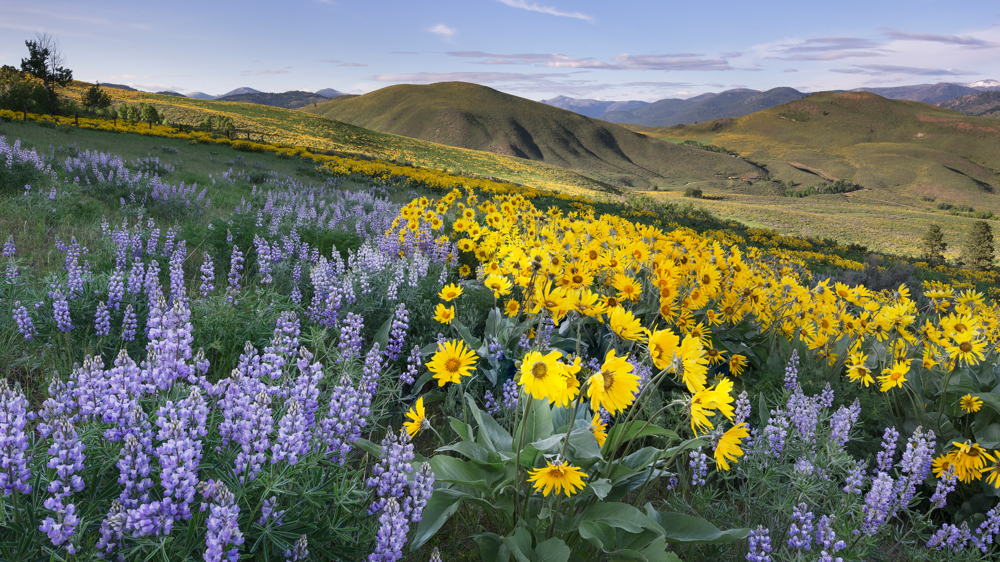 [香根和羽扇豆，梅索谷，北喀斯喀特，华盛顿州，美国 (© Alan Majchrowicz/Getty Images)](https://cn.bing.combing_2024-05-26_OHR.MethowWildflowers_ZH-CN8926661958_UHD.jpg) 2024-05-26|
 |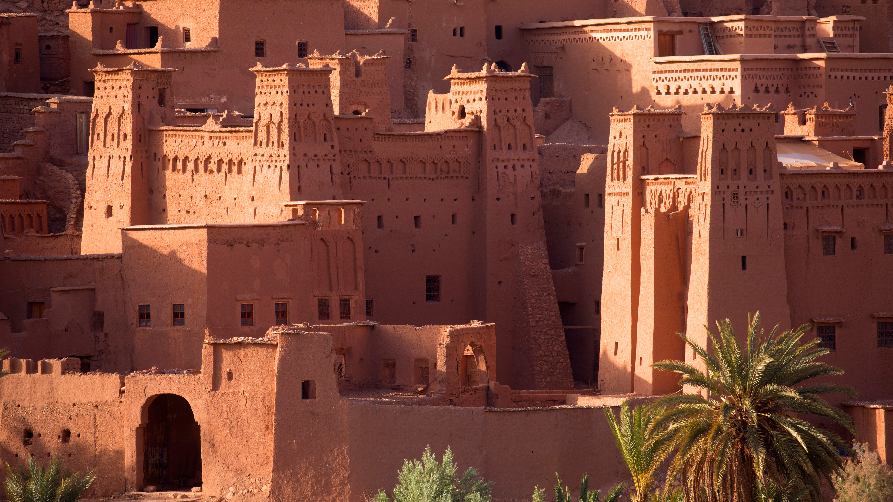 [阿伊特本哈杜，摩洛哥 (© Grant Faint/Getty Images)](https://cn.bing.combing_2024-05-25_OHR.MoroccoBenhaddou_ZH-CN8742267428_UHD.jpg) 2024-05-25 |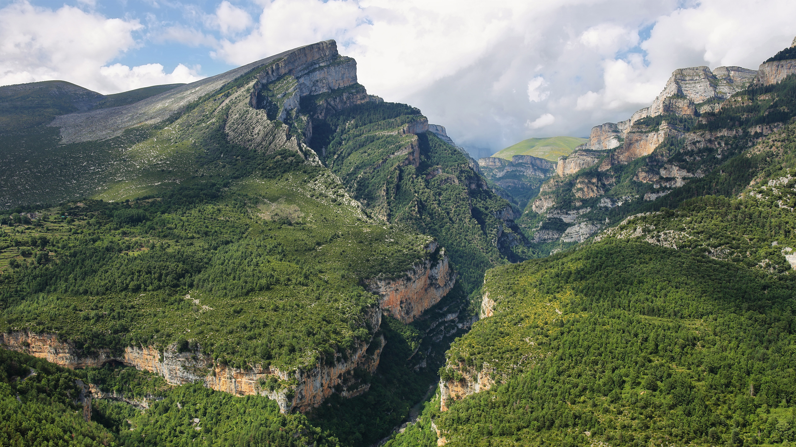 [阿尼斯克洛峡谷，奥德萨和佩尔迪多山国家公园，韦斯卡，西班牙 (© Marisa Estivill/Shutterstock)](https://cn.bing.combing_2024-05-24_OHR.OrdesaNationalPark_ZH-CN8545620273_UHD.jpg) 2024-05-24|
 | [印度星龟，斯里兰卡 (© Robin Chittenden/Minden Pictures)](https://cn.bing.combing_2024-05-23_OHR.IndianStarTortoise_ZH-CN7177478610_UHD.jpg) 2024-05-23 |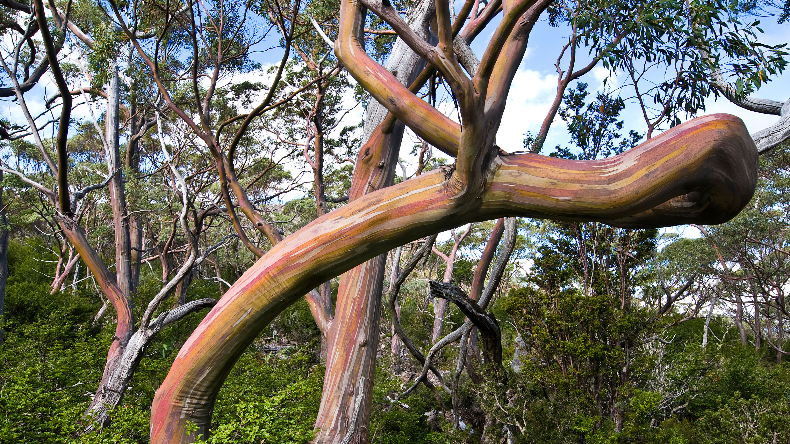 [塔斯马尼亚高山黄桉（假少花桉），费尔德山国家公园，塔斯马尼亚州，澳大利亚 (© Ignacio Palacios/Getty Images)](https://cn.bing.combing_2024-05-22_OHR.SnowGumTasmania_ZH-CN6975160884_UHD.jpg) 2024-05-22|
 |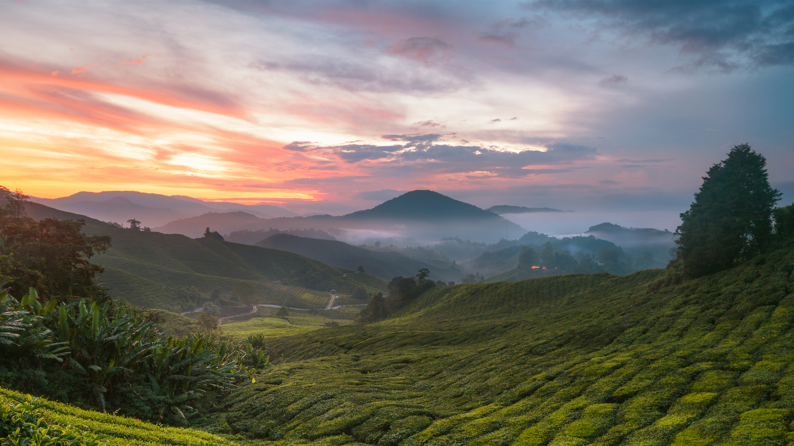 [卡梅隆高地茶园，马拉西亚 (© alex cheong/Getty Images)](https://cn.bing.combing_2024-05-21_OHR.MalaysiaTea_ZH-CN6758939415_UHD.jpg) 2024-05-21 | [蜜蜂照料蜂巢 (© Simun Ascic/Alamy Stock Photo)](https://cn.bing.combing_2024-05-20_OHR.HoneycombBee_ZH-CN6572760814_UHD.jpg) 2024-05-20|
 |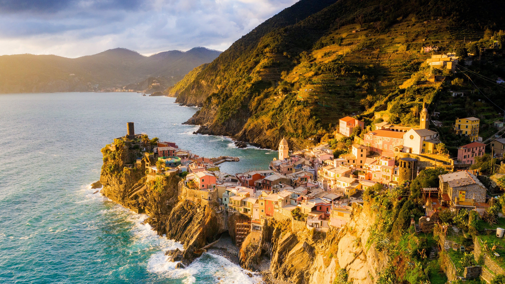 [韦尔纳扎村，五渔村，利古里亚，意大利 (© Roberto Moiola/Sysaworld/Getty Images)](https://cn.bing.combing_2024-05-19_OHR.VernazzaItaly_ZH-CN6245826569_UHD.jpg) 2024-05-19 |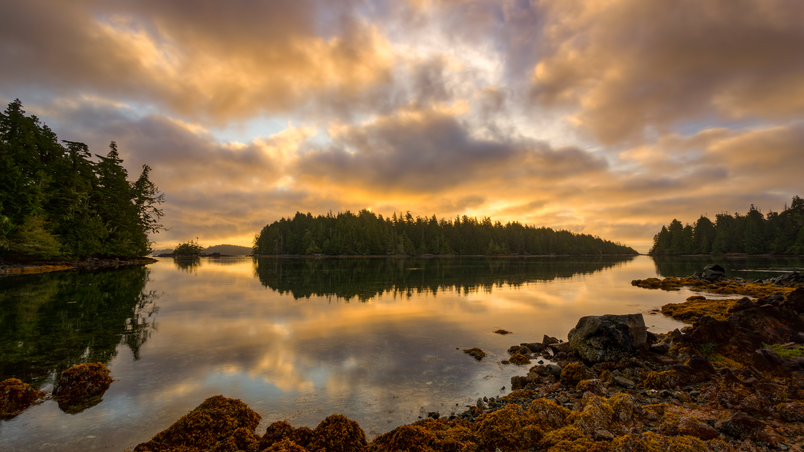 [破碎群岛，环太平洋国家公园保护区，不列颠哥伦比亚省温哥华岛，加拿大 (© Ron Watts/Design Pics/Getty Images)](https://cn.bing.combing_2024-05-18_OHR.PacificRimNationalPark_ZH-CN5809123424_UHD.jpg) 2024-05-18|
 | [塔兰吉雷国家公园的非洲象家族，坦桑尼亚 (© Vicki Jauron, Babylon and Beyond Photography/Getty Images)](https://cn.bing.combing_2024-05-17_OHR.TarangireElephants_ZH-CN5447385839_UHD.jpg) 2024-05-17 | [维戈的兰德大桥，西班牙 (© Julio Conde/Getty Images)](https://cn.bing.combing_2024-05-16_OHR.ReconquistaVigo_ZH-CN4619580424_UHD.jpg) 2024-05-16|
 |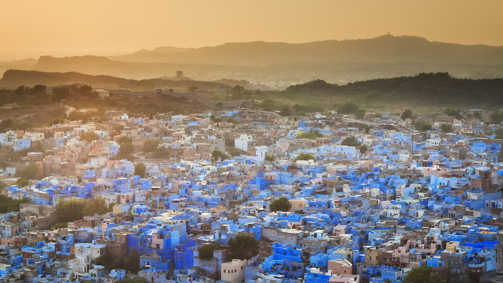 [焦特布尔蓝色之城，印度 (© cinoby/Getty Images)](https://cn.bing.combing_2024-05-15_OHR.BlueCityIndia_ZH-CN4275229255_UHD.jpg) 2024-05-15 |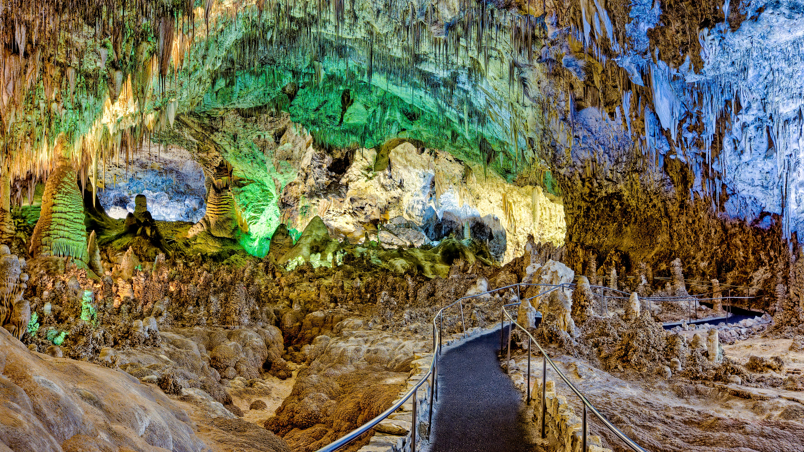 [通往大房间的走道，卡尔斯巴德洞穴国家公园，新墨西哥州 (© Doug Meek/Getty Images)](https://cn.bing.combing_2024-05-14_OHR.CarlsbadNP_ZH-CN4136753542_UHD.jpg) 2024-05-14|
 |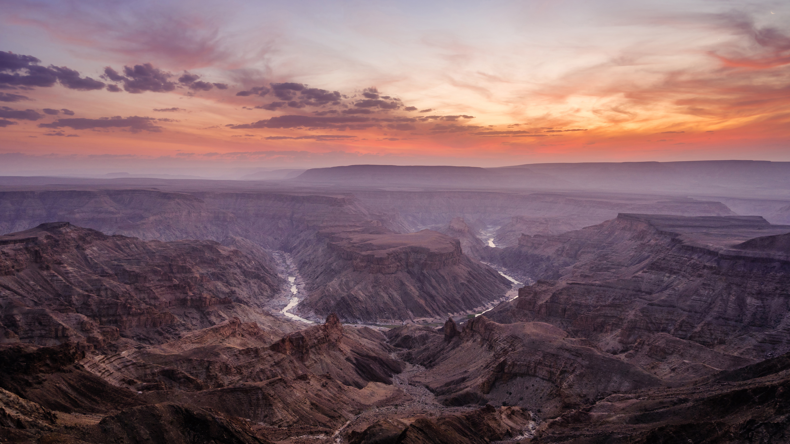 [鱼河大峡谷，纳米比亚 (© R. M. Nunes/Getty Images)](https://cn.bing.combing_2024-05-13_OHR.NamibiaCanyon_ZH-CN3973338246_UHD.jpg) 2024-05-13 |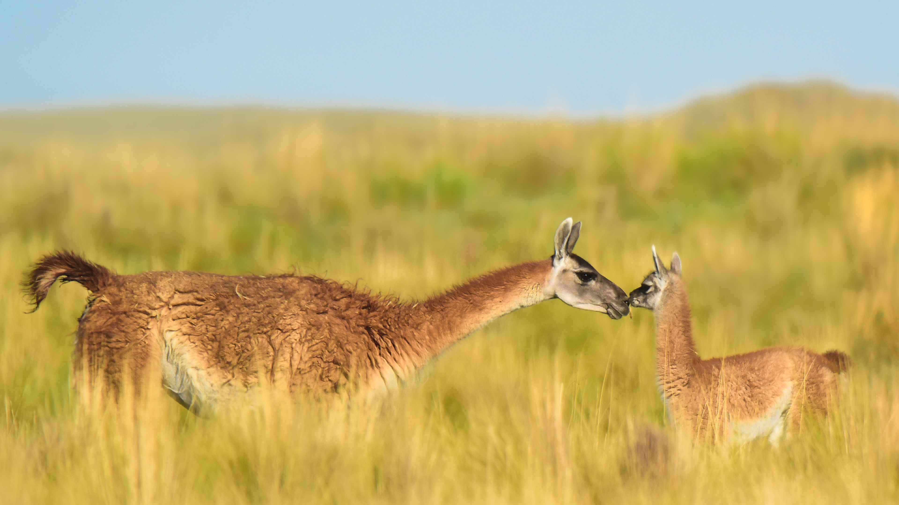 [潘帕省草原上的雌性原驼和它新出生的宝宝，阿根廷 (© Gabriel Rojo/Minden Pictures)](https://cn.bing.combing_2024-05-12_OHR.GuanacoMother_ZH-CN3856540256_UHD.jpg) 2024-05-12|
 |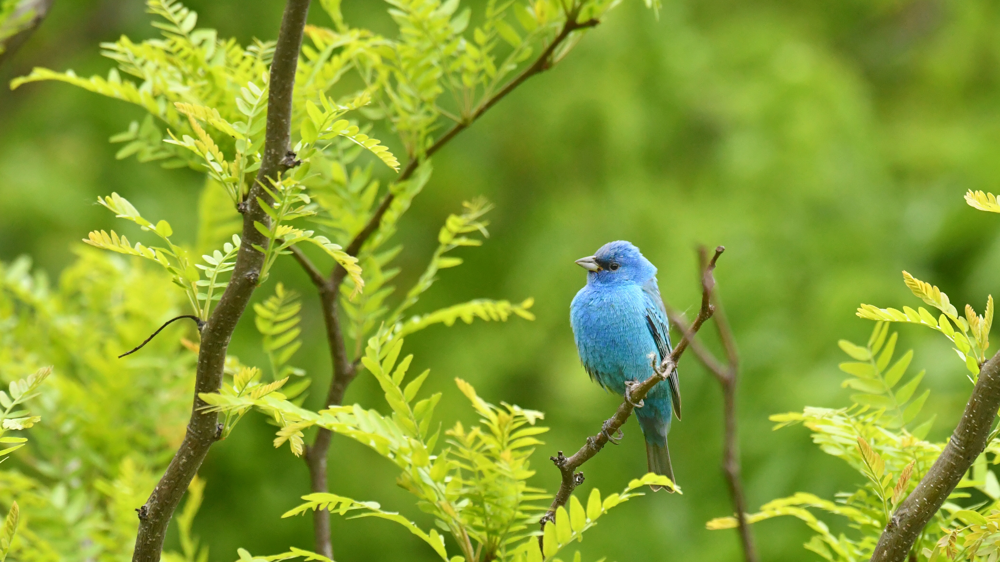 [树枝上栖息的靛蓝彩鹀，德克萨斯州 (© Jeff R Clow/Getty Images)](https://cn.bing.combing_2024-05-11_OHR.TexasIndigoBunting_ZH-CN3699392300_UHD.jpg) 2024-05-11 |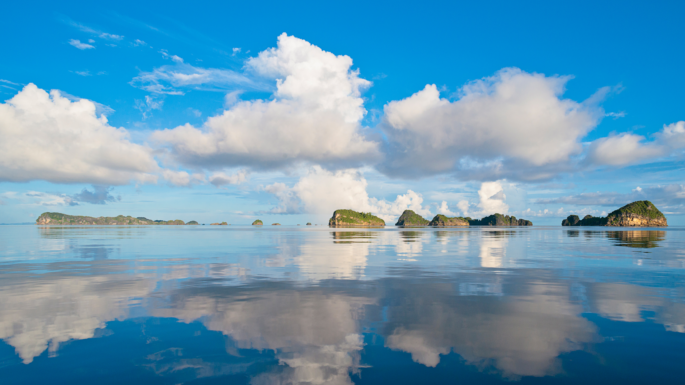 [米苏尔岛，拉贾安帕群岛，印度尼西亚 (© Giordano Cipriani/Getty Images)](https://cn.bing.combing_2024-05-10_OHR.MisoolRajaAmpat_ZH-CN3557473032_UHD.jpg) 2024-05-10|
 | [埃米尔甘公园的郁金香，伊斯坦布尔，土耳其 (© Ozbalci/Getty Images)](https://cn.bing.combing_2024-05-09_OHR.EmirganPark_ZH-CN3394557999_UHD.jpg) 2024-05-09 | [伊夫堡，马赛，法国 (© Sergii Figurnyi/Alamy)](https://cn.bing.combing_2024-05-08_OHR.PortMarseille_ZH-CN3194394496_UHD.jpg) 2024-05-08|
 | [一只小鸭子在水草地上游泳，萨福克郡，英国 (© Nick Hurst/Getty Images)](https://cn.bing.combing_2024-05-07_OHR.LittleDuckling_ZH-CN2922471258_UHD.jpg) 2024-05-07 |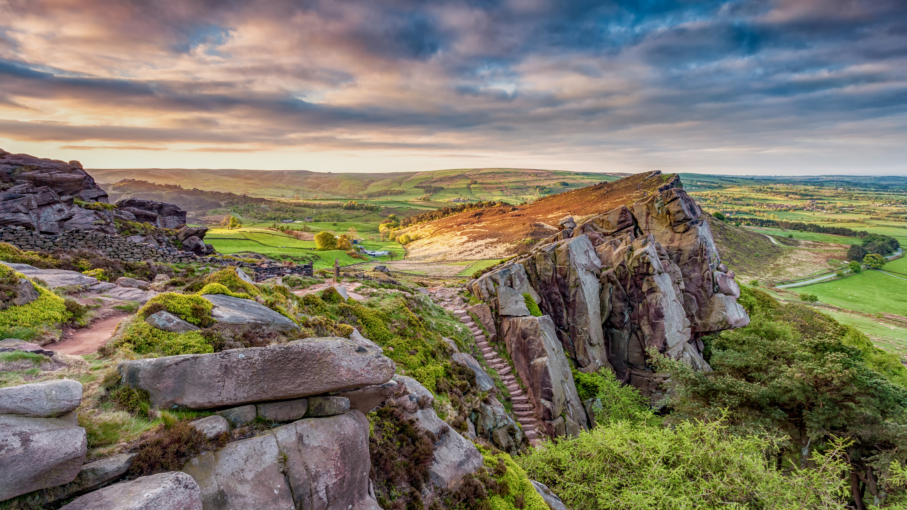 [罗奇斯山脊，英格兰峰区 (© George W Johnson/Getty Images)](https://cn.bing.combing_2024-05-06_OHR.TheRoachesPeakDistrict_ZH-CN2657532467_UHD.jpg) 2024-05-06|
 |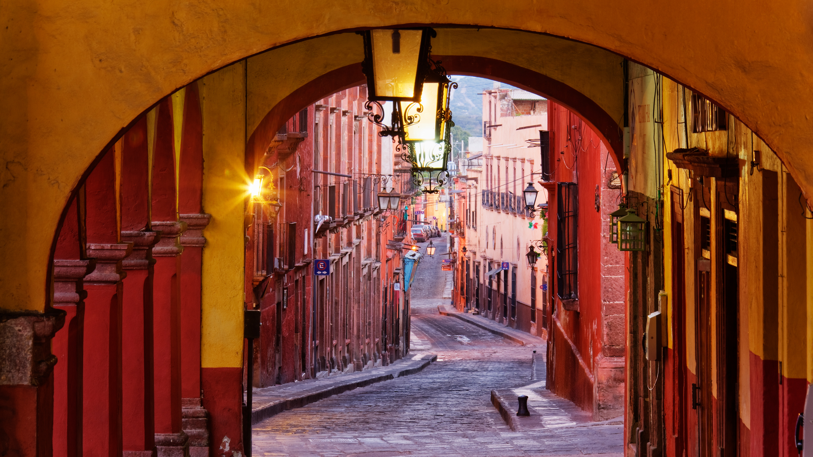 [圣米格尔德阿连德的柱廊，瓜那华托州，墨西哥 (© Mint Images/Getty Images)](https://cn.bing.combing_2024-05-05_OHR.SanMiguelAllende_ZH-CN1840507091_UHD.jpg) 2024-05-05 | [斯凯利格·迈克尔岛上一座古老修道院的废墟，爱尔兰 (© MNStudio/Getty Images)](https://cn.bing.combing_2024-05-04_OHR.JediMonastery_ZH-CN0091557941_UHD.jpg) 2024-05-04|
 |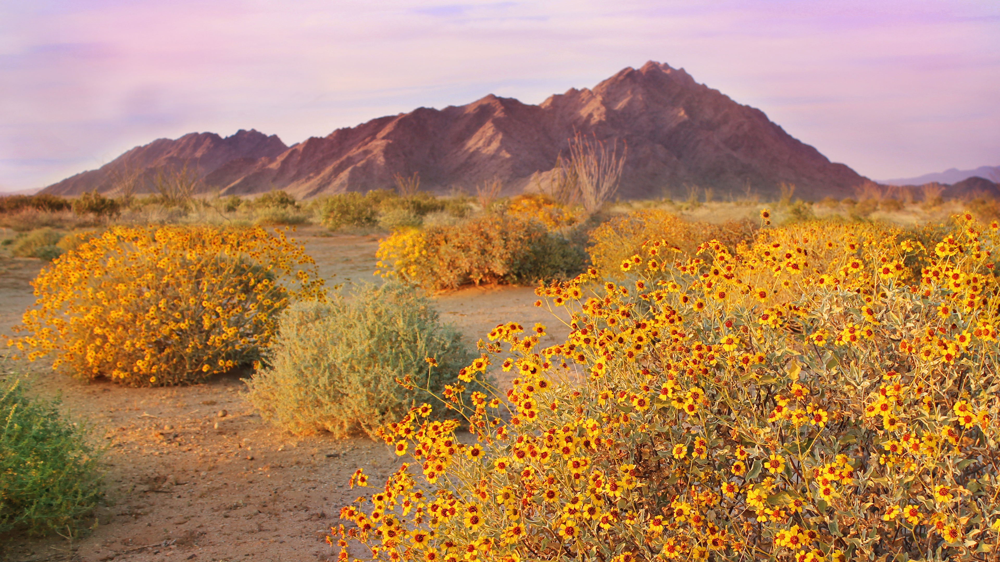 [春天盛开的沙漠毒菊，索诺拉沙漠，亚利桑那州 (© Charles Harker/Getty Images)](https://cn.bing.combing_2024-05-03_OHR.SonoranSpring_ZH-CN9246678734_UHD.jpg) 2024-05-03 |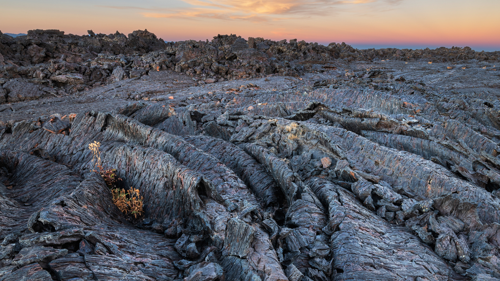 [蓝龙熔岩流，月球陨石坑国家纪念碑和保护区，爱达荷州，美国 (© Alan Majchrowicz/Getty Images)](https://cn.bing.combing_2024-05-02_OHR.CratersOfTheMoon_ZH-CN8971565042_UHD.jpg) 2024-05-02|
 | [夏威夷花环 (© Jotika Pun/Shutterstock)](https://cn.bing.combing_2024-05-01_OHR.HawaiianLei_ZH-CN7857272499_UHD.jpg) 2024-05-01|
### 2024-04

|     |    |
| ---- | ---- |
 |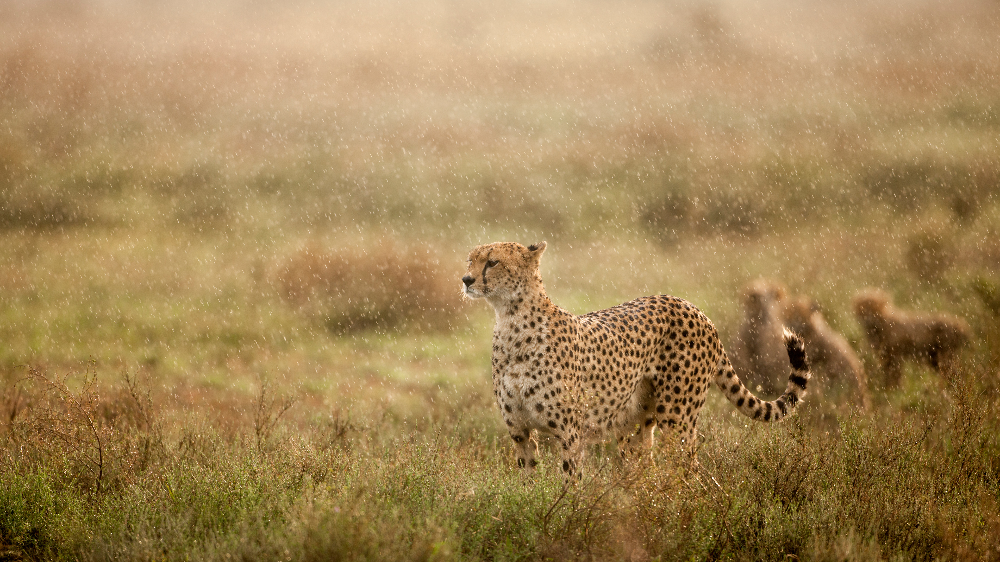 [清晨雨中的猎豹，恩杜图平原，恩戈罗恩戈罗保护区，坦桑尼亚 (© Paul Souders/Getty Images)](https://cn.bing.combing_2024-04-30_OHR.CheetahRain_ZH-CN6722375507_UHD.jpg) 2024-04-30|
 | [福建土楼，福建省历史文化遗产建筑，中国 (© Hongjie Han/Getty Images)](https://cn.bing.combing_2024-04-29_OHR.TulouFujian_ZH-CN4287018074_UHD.jpg) 2024-04-29 |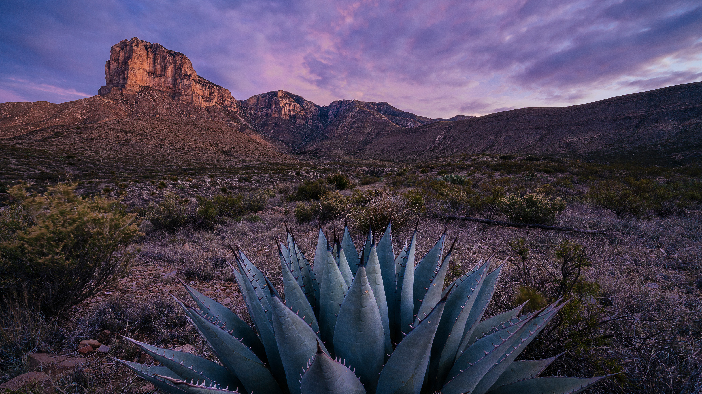 [瓜达卢佩山脉国家公园日出时的埃尔卡皮坦山，德克萨斯州，美国 (© Adam Mowery/Tandem Stills + Motion)](https://cn.bing.combing_2024-04-28_OHR.GuadalupeTexas_ZH-CN3911419948_UHD.jpg) 2024-04-28|
 |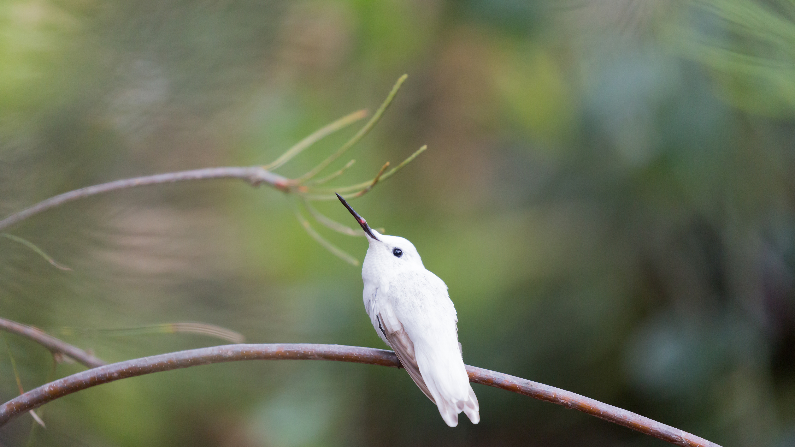 [澳大利亚花园里的白种安氏蜂鸟，加州大学圣克鲁兹分校植物园，加利福尼亚州，美国 (© yhelfman/Getty Images)](https://cn.bing.combing_2024-04-27_OHR.LeucisticHummingbird_ZH-CN2921653789_UHD.jpg) 2024-04-27 |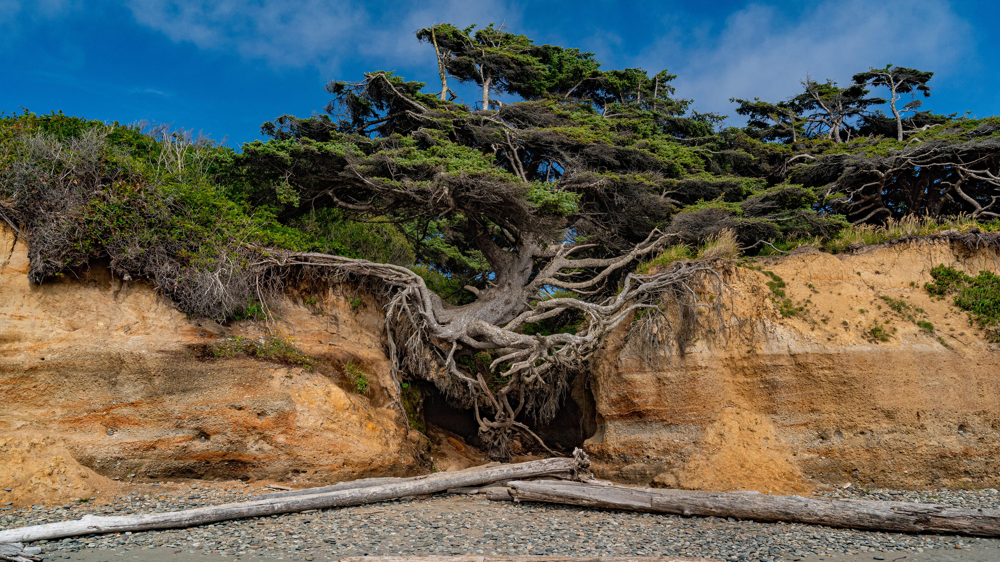 [卡拉洛奇树，又名生命之树，卡拉洛奇海滩，奥林匹克国家公园，华盛顿州，美国 (© Abbie Warnock-Matthews/Shutterstock)](https://cn.bing.combing_2024-04-26_OHR.KalalochTree_ZH-CN9427839259_UHD.jpg) 2024-04-26|
 | [南极洲冰山上的阿德利企鹅 (© Patrick J. Endres/Getty Images)](https://cn.bing.combing_2024-04-25_OHR.PenguinDirections_ZH-CN8498684753_UHD.jpg) 2024-04-25 |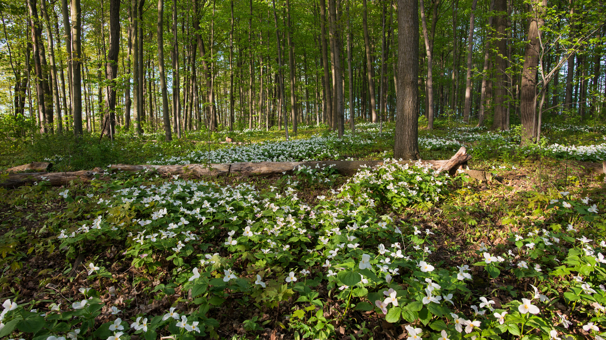 [盛开的白延龄草，安大略省，加拿大 (© Jun Zhang/Getty Images)](https://cn.bing.combing_2024-04-24_OHR.TrilliumOntario_ZH-CN8327395975_UHD.jpg) 2024-04-24|
 | [三一学院图书馆，都柏林，爱尔兰 (© Lukas Bischoff/Getty Images)](https://cn.bing.combing_2024-04-23_OHR.TrinityDublin_ZH-CN7902993255_UHD.jpg) 2024-04-23 | [绿海龟，圣地亚哥，加利福尼亚，美国 (© Ralph Pace/Minden Pictures)](https://cn.bing.combing_2024-04-22_OHR.EarthDayTurtle_ZH-CN4642042701_UHD.jpg) 2024-04-22|
 |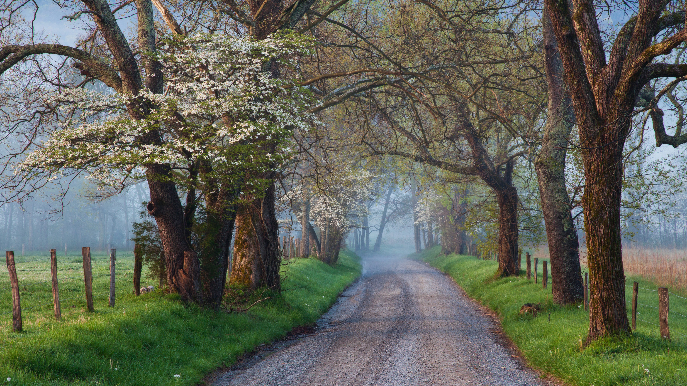 [Cades Cove ，大雾山国家公园，田纳西州，美国 (© Richard Bernabe/Shutterstock)](https://cn.bing.combing_2024-04-21_OHR.CadesCove_ZH-CN3950297181_UHD.jpg) 2024-04-21 |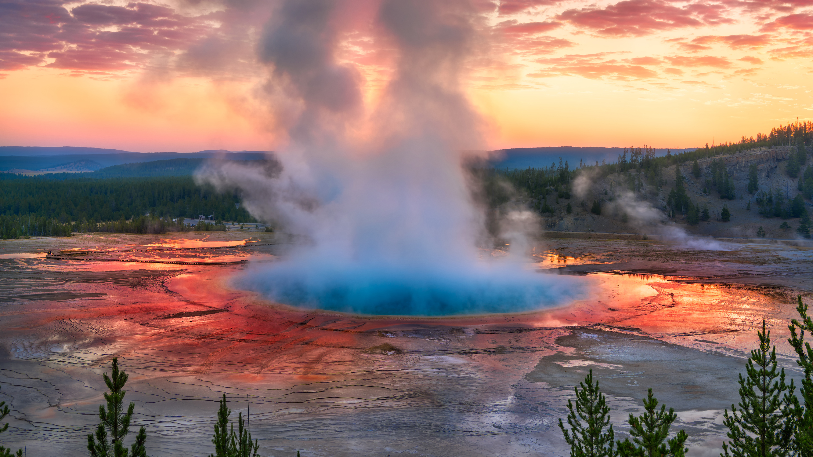 [日出时分的大棱镜泉，美国怀俄明州黄石国家公园 (© XIN WANG/Getty Images)](https://cn.bing.combing_2024-04-20_OHR.YellowstoneGeyser_ZH-CN3441008468_UHD.jpg) 2024-04-20|
 |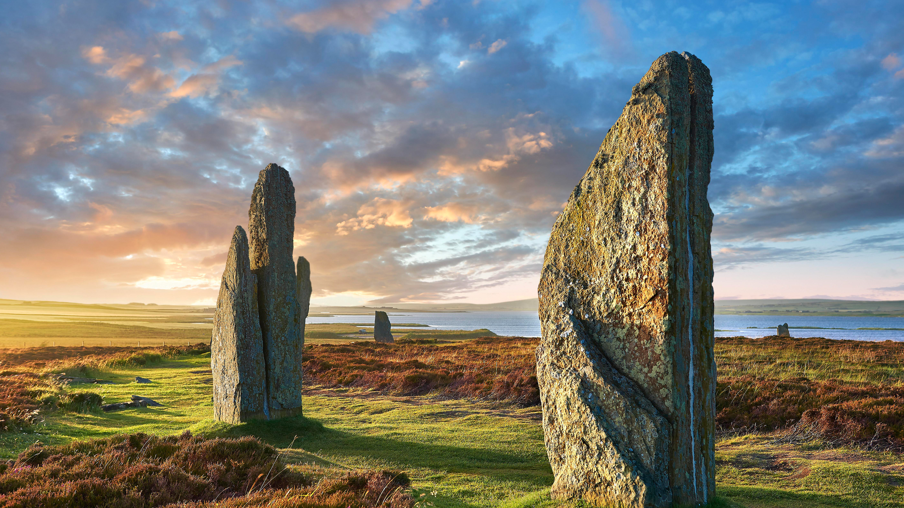 [布罗德加环，奥克尼岛，苏格兰 (© Paul Williams - FunkyStock/Getty Images)](https://cn.bing.combing_2024-04-19_OHR.OrkneyStones_ZH-CN2287350110_UHD.jpg) 2024-04-19 | [中世纪城墙，阿维拉，西班牙 (© Scott Suriano/Getty Images)](https://cn.bing.combing_2024-04-18_OHR.AvilaSpain_ZH-CN1792280503_UHD.jpg) 2024-04-18|
 |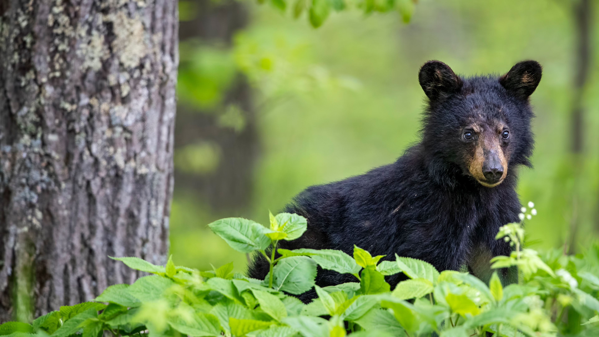 [春天的美洲黑熊幼崽，仙纳度国家公园，弗吉尼亚州，美国 (© Scott Suriano/Getty Images)](https://cn.bing.combing_2024-04-17_OHR.SpringCub_ZH-CN1643833378_UHD.jpg) 2024-04-17 | [暮色中的曼哈顿下城联合广场，纽约，美国 (© Sean Pavone/Getty Images)](https://cn.bing.combing_2024-04-16_OHR.UnionSquareNYC_ZH-CN1533018653_UHD.jpg) 2024-04-16|
 | [香波城堡，中央-卢瓦尔河谷大区，法国 (© Susanne Kremer/eStock Photo)](https://cn.bing.combing_2024-04-15_OHR.ChambordCastle_ZH-CN0930093515_UHD.jpg) 2024-04-15 | [保龄球海滩的日落，门多西诺县，加利福尼亚，美国 (© Melo Qiao/Getty Images)](https://cn.bing.combing_2024-04-14_OHR.BowlingBallCali_ZH-CN0434558966_UHD.jpg) 2024-04-14|
 |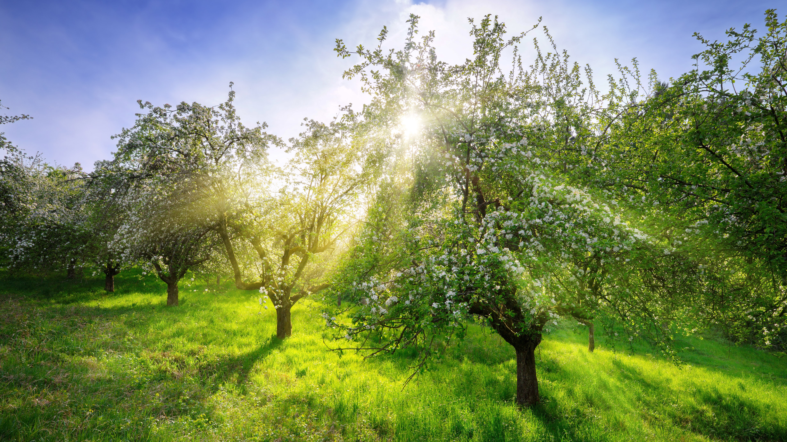 [春天的苹果树，德国 (© Smileus/Getty Images)](https://cn.bing.combing_2024-04-13_OHR.SpringApple_ZH-CN0101917345_UHD.jpg) 2024-04-13 |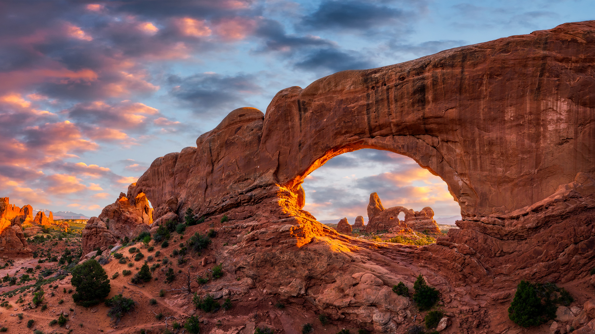 [拱门国家公园，犹他州，美国 (© Anthony Heflin/Shutterstock)](https://cn.bing.combing_2024-04-12_OHR.SunsetArchesNP_ZH-CN9875945974_UHD.jpg) 2024-04-12|
 |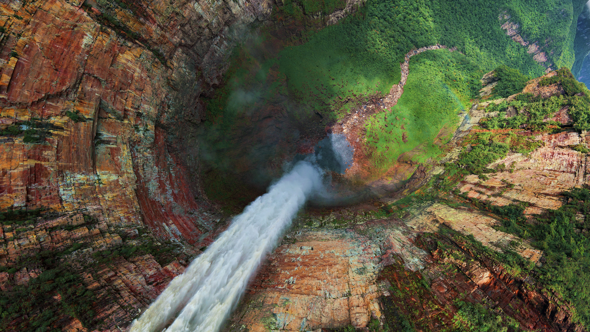 [丘伦梅鲁瀑布鸟瞰图，委内瑞拉 (© AirPano LLC/Amazing Aerial Agency)](https://cn.bing.combing_2024-04-11_OHR.DragonWaterfall_ZH-CN9580105565_UHD.jpg) 2024-04-11 |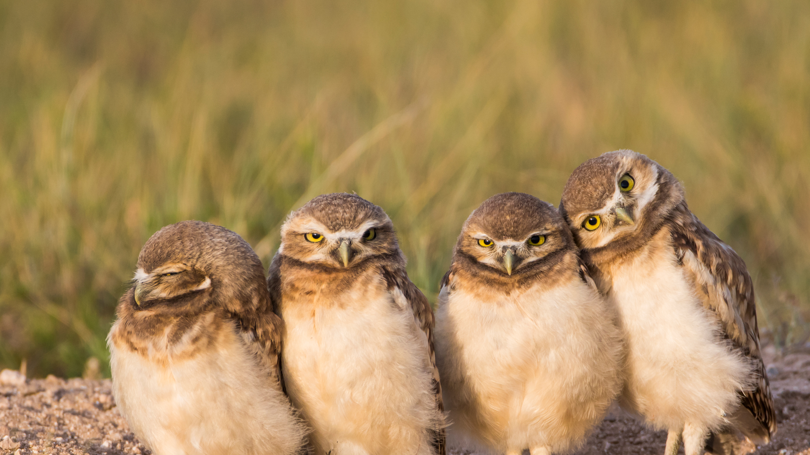 [洞穴附近的穴小鸮雏鸟，怀俄明州，美国 (© Danita Delimont/Getty Images)](https://cn.bing.combing_2024-04-10_OHR.OwlSiblings_ZH-CN9441687518_UHD.jpg) 2024-04-10|
 |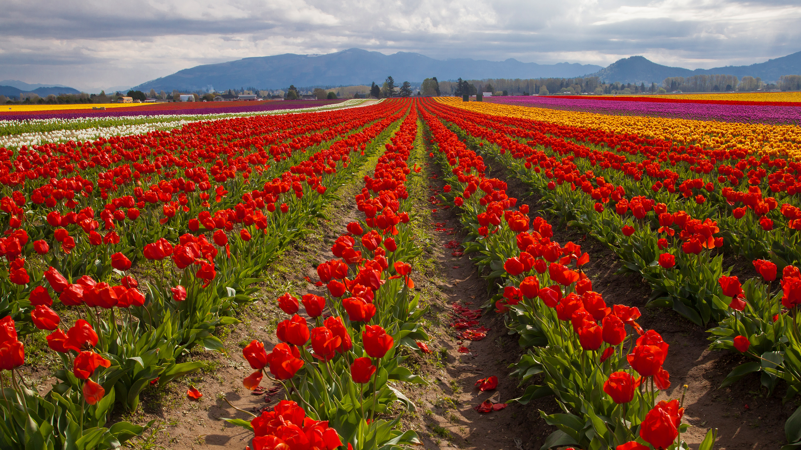 [郁金香田，斯卡吉特山谷，华盛顿州，美国 (© Claudia Cooper/Getty Images)](https://cn.bing.combing_2024-04-09_OHR.SkagitValleyTulips_ZH-CN9034120306_UHD.jpg) 2024-04-09 | [欧洲刺猬在长满蒲公英的花园里，巴特德里堡，德国 (© Oksana Schmidt/Getty Images)](https://cn.bing.combing_2024-04-08_OHR.HedgehogMeadow_ZH-CN8845586473_UHD.jpg) 2024-04-08|
 | [奇迹湖附近池塘里的北美海狸，德纳里国家公园，阿拉斯加州，美国 (© Paul Souders/Getty Images)](https://cn.bing.combing_2024-04-07_OHR.BeaverDenali_ZH-CN8736013851_UHD.jpg) 2024-04-07 | [姬路城，姫路，兵库县，日本 (© Julian Elliott Photography/Getty Images)](https://cn.bing.combing_2024-04-06_OHR.JapanHimeji_ZH-CN8344654166_UHD.jpg) 2024-04-06|
 | [从国际空间站拍摄的巴哈马群岛 (© NASA)](https://cn.bing.combing_2024-04-05_OHR.BahamasSpace_ZH-CN8053657656_UHD.jpg) 2024-04-05 | [红驴羚群穿越奥卡万戈三角洲的沼泽平原，博茨瓦纳 (© Ibrahim Suha Derbent/Getty Images)](https://cn.bing.combing_2024-04-04_OHR.AntelopeBotswana_ZH-CN8253323519_UHD.jpg) 2024-04-04|
 | [At-Bashy地区的彩虹，Kakshaal Too山脉，纳伦省，吉尔吉斯斯坦 (© Emad aljumah/Getty Images)](https://cn.bing.combing_2024-04-03_OHR.KyrgyzstanRainbow_ZH-CN8027219590_UHD.jpg) 2024-04-03 | [日德兰半岛的山毛榉树和野生海葵 ，丹麦 (© Nick Brundle Photography/Getty Images)](https://cn.bing.combing_2024-04-02_OHR.JutlandSpring_ZH-CN7785758539_UHD.jpg) 2024-04-02|
 | [勃朗峰上的冰海，夏慕尼，法国 (© Hagenmuller Jean-François/Hemis/Alamy)](https://cn.bing.combing_2024-04-01_OHR.MontBlancGlacier_ZH-CN2918240023_UHD.jpg) 2024-04-01|
### 2024-03

|     |    |
| ---- | ---- |
 | [潘塔纳尔湿地的大白鹭，巴西 (© Geraldi Corsi/Getty Images)](https://cn.bing.combing_2024-03-31_OHR.ArdeAlba_ZH-CN6807697569_UHD.jpg) 2024-03-31|
 | [睡在号角树上的褐喉树懒，哥斯达黎加 (© Juan Carlos Vindas/Getty Images)](https://cn.bing.combing_2024-03-30_OHR.SleepySloth_ZH-CN6084460583_UHD.jpg) 2024-03-30 | [日落时的南斯塔克灯塔，霍利希德，威尔士，英国 (© mariotlr/Getty Images)](https://cn.bing.combing_2024-03-29_OHR.SouthStackLight_ZH-CN5932471774_UHD.jpg) 2024-03-29|
 | [上海的樱花，中国 (© Yaorusheng/Getty Images)](https://cn.bing.combing_2024-03-28_OHR.ShanghaiBlossoms_ZH-CN5594677517_UHD.jpg) 2024-03-28 | [布宜诺斯艾利斯哥伦布剧院，阿根廷 (© Wei Hao Ho/Alamy Stock Photo)](https://cn.bing.combing_2024-03-27_OHR.TeatroColon_ZH-CN5378730986_UHD.jpg) 2024-03-27|
 | [海水从古老的珊瑚礁上倾泻而下，杭莱，越南 (© Thang Tat Nguyen/Getty Images)](https://cn.bing.combing_2024-03-26_OHR.HangRaiVietnam_ZH-CN1601428109_UHD.jpg) 2024-03-26 | [弗雷泽河谷的郁金香田，阿伯兹福德，不列颠哥伦比亚省，加拿大 (© LeonU/Getty Images)](https://cn.bing.combing_2024-03-25_OHR.TulipAbbotsford_ZH-CN1401627293_UHD.jpg) 2024-03-25|
 | [樱花树枝上的灰胸绣眼鸟，韩国 (© TigerSeo/Getty Images)](https://cn.bing.combing_2024-03-24_OHR.WhiteEyes_ZH-CN1130380430_UHD.jpg) 2024-03-24 | [巴西亚马逊上空巨大的砧状云 (© NASA)](https://cn.bing.combing_2024-03-23_OHR.AmazonClouds_ZH-CN0578911147_UHD.jpg) 2024-03-23|
 | [蓝泉，蒂怀霍步道，新西兰 (© Ian Beattie/Alamy Stock Photo)](https://cn.bing.combing_2024-03-22_OHR.WaikatoWater_ZH-CN0417438809_UHD.jpg) 2024-03-22 | [布恩迪国家公园，乌干达 (© Art Wolfe/DanitaDelimont.com)](https://cn.bing.combing_2024-03-21_OHR.BwindiNationalForest_ZH-CN0436137473_UHD.jpg) 2024-03-21|
 | [鸟瞰春日盛开的樱花，中国 (© outcast85/Getty images)](https://cn.bing.combing_2024-03-20_OHR.Springequinox2024_ZH-CN5647214924_UHD.jpg) 2024-03-20 | [盛开的扁桃树, 加利福尼亚州，美国 (© Jeffrey Lewis/Tandem Stills + Motion)](https://cn.bing.combing_2024-03-19_OHR.AlmondBloom_ZH-CN9441550492_UHD.jpg) 2024-03-19|
 | [大象岩，古城欧拉，沙特阿拉伯 (© Lubo Ivanko/Shutterstock)](https://cn.bing.combing_2024-03-18_OHR.ElephantRock_ZH-CN9293300383_UHD.jpg) 2024-03-18 | [圣菲尼安湾，凯里郡，爱尔兰 (© Atlantide Phototravel/Getty Images)](https://cn.bing.combing_2024-03-17_OHR.StFiniansBay_ZH-CN8655586052_UHD.jpg) 2024-03-17|
 | [正在吃竹子的大熊猫，中国成都 (© Suzi Eszterhas/Minden Pictures)](https://cn.bing.combing_2024-03-16_OHR.BambooPanda_ZH-CN8455481760_UHD.jpg) 2024-03-16 | [安沙波利哥沙漠州立公园，美国加利福尼亚州 (© Stephen Matera/Tandem Stills + Motion)](https://cn.bing.combing_2024-03-15_OHR.AnzaBorregoBloom_ZH-CN8284458835_UHD.jpg) 2024-03-15|
 | [Wat Phra Ngam，大城府历史公园，泰国 (© boonchai wedmakawand/Alamy Stock Photo)](https://cn.bing.combing_2024-03-14_OHR.AyutthayaTree_ZH-CN8075870220_UHD.jpg) 2024-03-14 | [小红鹳飞越马加迪湖,肯尼亚 (© Vicki Jauron, Babylon and Beyond Photography/Getty Images)](https://cn.bing.combing_2024-03-13_OHR.MagadiFlamingos_ZH-CN7888437841_UHD.jpg) 2024-03-13|
 | [布莱斯峡谷国家公园，犹他州，美国 (© Jim Patterson/Tandem Stills + Motion)](https://cn.bing.combing_2024-03-12_OHR.BryceSnow_ZH-CN7489999663_UHD.jpg) 2024-03-12 | [Prosecco山丘，科内利亚诺和瓦尔多比亚德内，威内托大区，意大利 (© Richard T. Nowitz/Getty Images)](https://cn.bing.combing_2024-03-11_OHR.ProseccoItaly_ZH-CN6802010344_UHD.jpg) 2024-03-11|
 | [圣哈辛托大厦的机械钟，博蒙特，美国德克萨斯州 (© Richard T. Nowitz/Getty Images)](https://cn.bing.combing_2024-03-10_OHR.BeaumontClock_ZH-CN5288086713_UHD.jpg) 2024-03-10 | [比斯第恶土，新墨西哥州，美国 (© Ian Shive/Tandem Stills + Motion)](https://cn.bing.combing_2024-03-09_OHR.BistiBlue_ZH-CN4991705833_UHD.jpg) 2024-03-09|
 | [伊瓜苏大瀑布鸟瞰图，巴西 (© Nido Huebl/Shutterstock)](https://cn.bing.combing_2024-03-08_OHR.IguazuFalls_ZH-CN4749837052_UHD.jpg) 2024-03-08 | [Roques de Benet，埃尔斯港自然公园，加泰罗尼亚，西班牙 (© Sergi Boixader/Alamy Stock Photo)](https://cn.bing.combing_2024-03-07_OHR.TarragonaSpain_ZH-CN5488361711_UHD.jpg) 2024-03-07|
 | [Wahclella Falls，哥伦比亚河峡谷，俄勒冈州，美国 (© Eric Vogt/Tandem Stills + Motion)](https://cn.bing.combing_2024-03-06_OHR.WahclellaFalls_ZH-CN4932852217_UHD.jpg) 2024-03-06 | [曼谷的交通圈和高速公路，泰国 (© Avigator Fortuner/Shutterstock)](https://cn.bing.combing_2024-03-05_OHR.BangkokCircle_ZH-CN4702412806_UHD.jpg) 2024-03-05|
 | [从蒙特维多看到的阿雷纳尔火山,哥斯达黎加 (© Lukas Bischoff/Getty Images)](https://cn.bing.combing_2024-03-04_OHR.ArenalCostaRica_ZH-CN4466297855_UHD.jpg) 2024-03-04 | [树上的豹子，克鲁格国家公园，南非 (© Tonino De Marco/Minden Pictures)](https://cn.bing.combing_2024-03-03_OHR.KrugerLeopard_ZH-CN4125884091_UHD.jpg) 2024-03-03|
 | [莫迪卡，西西里岛，意大利 (© Sandro Bisaro/Getty Images)](https://cn.bing.combing_2024-03-02_OHR.ModicaItaly_ZH-CN3893147952_UHD.jpg) 2024-03-02 | [德国草地上的蝴蝶 (© Albert Fertl/Getty Images)](https://cn.bing.combing_2024-03-01_OHR.Schmetterlingswiese_ZH-CN3740804088_UHD.jpg) 2024-03-01|

### 2024-02

|     |    |
| ---- | ---- |
 | [欧亚红松鼠 (© Westend61/Getty Images)](https://cn.bing.combing_2024-02-29_OHR.LeapingSquirrel_ZH-CN9112090462_UHD.jpg) 2024-02-29 | [班堡城堡，诺森伯兰郡，英格兰 (© Blackbeck/Getty Images)](https://cn.bing.combing_2024-02-28_OHR.BamburghCastleUK_ZH-CN3201531782_UHD.jpg) 2024-02-28|
 | [玩耍的北极熊幼崽，卡克托维克，阿拉斯加州，美国 (© Piriya Photography/Getty Images)](https://cn.bing.combing_2024-02-27_OHR.PolarBearCubs_ZH-CN2913942257_UHD.jpg) 2024-02-27 | [大峡谷国家公园，亚利桑那州，美国 (© Jeremy Janus/Getty Images)](https://cn.bing.combing_2024-02-26_OHR.GrandCanyonWinter_ZH-CN2640803517_UHD.jpg) 2024-02-26|
 | [考伊琴山谷的薄雾，温哥华岛，加拿大不列颠哥伦比亚省 (© Kevin Oke/Alamy)](https://cn.bing.combing_2024-02-25_OHR.MtPrevostDuncan_ZH-CN2333619635_UHD.jpg) 2024-02-25 | [锦里街上悬挂的红色中国灯笼，成都，中国四川省 (© Philippe LEJEANVRE/Getty images)](https://cn.bing.combing_2024-02-24_OHR.LaternFestival2024_ZH-CN8050981828_UHD.jpg) 2024-02-24|
 | [Haghartsin修道院，迪利扬国家公园，亚美尼亚 (© Alexey Kharitonov/Shutterstock)](https://cn.bing.combing_2024-02-23_OHR.HaghartsinMonastery_ZH-CN1705226096_UHD.jpg) 2024-02-23 | [布莱顿海滩的彩虹小屋，墨尔本，维多利亚州，澳大利亚 (© Prasit photo/Getty Images)](https://cn.bing.combing_2024-02-22_OHR.BrightonBoxes_ZH-CN0947219018_UHD.jpg) 2024-02-22|
 | [火瀑布，优胜美地国家公园，加利福尼亚州，美国 (© Gregory B Cuvelier/Shutterstock)](https://cn.bing.combing_2024-02-21_OHR.YosemiteFirefall_ZH-CN2236242565_UHD.jpg) 2024-02-21 | [Kinder Scout，峰区国家公园，英国 (© john finney photography/Getty Images)](https://cn.bing.combing_2024-02-20_OHR.PeakDistrictNP_ZH-CN1987784653_UHD.jpg) 2024-02-20|
 | [鸟瞰克鲁斯港色彩斑斓的房屋，特内里费岛，西班牙 (© Marco Bottigelli/Getty Images)](https://cn.bing.combing_2024-02-19_OHR.CarnavalTenerife_ZH-CN1559136778_UHD.jpg) 2024-02-19 | [抹香鲸浮出水面，多米尼克 (© Franco Banfi/Minden Pictures)](https://cn.bing.combing_2024-02-18_OHR.DominicaWhales_ZH-CN1293650397_UHD.jpg) 2024-02-18|
 | [多洛米蒂山的布莱耶斯湖，南蒂罗尔，意大利 (© Marco Bottigelli/Getty Images)](https://cn.bing.combing_2024-02-17_OHR.LakeDolomites_ZH-CN2317113886_UHD.jpg) 2024-02-17 | [一只雌性灰额主红雀栖息在德克萨斯州一株多刺仙人掌上，美国 (© outtakes/Getty Images)](https://cn.bing.combing_2024-02-16_OHR.BackyardBird_ZH-CN0522695977_UHD.jpg) 2024-02-16|
 | [河马妈妈和小河马，南卢安瓜国家公园，赞比亚 (© Nature Picture Library/Alamy Stock Photo)](https://cn.bing.combing_2024-02-15_OHR.HippopotamusDay_ZH-CN0518367336_UHD.jpg) 2024-02-15 | [丹顶鹤向伴侣鞠躬，北海道，日本 (© Steve Bloom Images/Alamy Stock Photo)](https://cn.bing.combing_2024-02-14_OHR.BowingCrane_ZH-CN0143761293_UHD.jpg) 2024-02-14|
 | [马里尼的狂欢节彩珠，新奥尔良，美国 (© Erik Pronske Photography/Getty Images)](https://cn.bing.combing_2024-02-13_OHR.MarignyBeads_ZH-CN9346804869_UHD.jpg) 2024-02-13 | [阿尔塞多火山象龟, 伊莎贝拉岛, 加拉帕戈斯群岛，厄瓜多尔 (© Tui De Roy/Minden Pictures)](https://cn.bing.combing_2024-02-12_OHR.GiantTortoise_ZH-CN9220903689_UHD.jpg) 2024-02-12|
 | [乔拉岛，福莱甘兹罗斯岛，基克拉泽斯群岛, 希腊 (© Francesco Riccardo Iacomino/Getty Images)](https://cn.bing.combing_2024-02-11_OHR.FolegandrosGreece_ZH-CN7803666477_UHD.jpg) 2024-02-11 | [中国舞狮，大年初一 (© SENEZ/Getty Images)](https://cn.bing.combing_2024-02-10_OHR.SpringFestival2024_ZH-CN7514007541_UHD.jpg) 2024-02-10|
 | [灯光秀点亮夜幕中的西安城墙，中国春节 (© Eastimages/Getty Images)](https://cn.bing.combing_2024-02-09_OHR.ChineseNewYearEve2024_ZH-CN7153418405_UHD.jpg) 2024-02-09 | [胡德山，俄勒冈州，美国 (© Inigo Cia/Getty Images)](https://cn.bing.combing_2024-02-08_OHR.MtHoodOregon_ZH-CN6068357532_UHD.jpg) 2024-02-08|
 | [圣詹姆斯潮汐池，开普敦，南非 (© AmazingAerialAgency/Adobe)](https://cn.bing.combing_2024-02-07_OHR.StJamesPool_ZH-CN5930624359_UHD.jpg) 2024-02-07 | [盆景岩，太浩湖，内华达州，美国 (© Jim Patterson/Tandem Stills + Motion)](https://cn.bing.combing_2024-02-06_OHR.LakeTahoeRock_ZH-CN5770740919_UHD.jpg) 2024-02-06|
 | [从奥索伊尼察观景点看日出时的布莱德湖，斯洛文尼亚 (© Rasica/Getty Images)](https://cn.bing.combing_2024-02-05_OHR.LakeBledSunrise_ZH-CN5580697031_UHD.jpg) 2024-02-05 | [德弗塔什卡洞, Devetaki村庄，保加利亚 (© Jasmine_K/Shutterstock)](https://cn.bing.combing_2024-02-04_OHR.DevetashkaCave_ZH-CN5186222166_UHD.jpg) 2024-02-04|
 | [大运河与安康圣母大教堂，威尼斯，意大利 (© Rudy Balasko/Getty Images)](https://cn.bing.combing_2024-02-03_OHR.VeniceCarnival_ZH-CN4965898587_UHD.jpg) 2024-02-03 | [从洞穴中探出头的土拨鼠 (© Scacciamosche/Getty Images)](https://cn.bing.combing_2024-02-02_OHR.AlpineMarmot_ZH-CN3818584615_UHD.jpg) 2024-02-02|
 | [吕根岛的萨斯尼茨灯塔，德国 (© Christian Back/eStock)](https://cn.bing.combing_2024-02-01_OHR.HalbinselJasmund_ZH-CN2110869056_UHD.jpg) 2024-02-01|
### 2024-01

|     |    |
| ---- | ---- |
 | [布氏斑马妈妈和小马驹，里特弗雷自然保护区，南非 (© Richard Du Toit/Minden Pictures)](https://cn.bing.combing_2024-01-31_OHR.ZebraMother_ZH-CN1947314869_UHD.jpg) 2024-01-31|
 | [艾纳, 塞古拉山脉, 阿尔瓦塞特, 西班牙 (© Juan Maria Coy Vergara/Getty Images)](https://cn.bing.combing_2024-01-30_OHR.AlbaceteSpain_ZH-CN1597281896_UHD.jpg) 2024-01-30 | [戈林格瀑布，泰嫩高，萨尔茨堡，奥地利 (© Frank Fischbach/Alamy Stock Photo)](https://cn.bing.combing_2024-01-29_OHR.GollingerFalls_ZH-CN1137680822_UHD.jpg) 2024-01-29|
 | [昆士兰州内陆海峡地区，澳大利亚 (© Southern Lightscapes-Australia/Getty Images)](https://cn.bing.combing_2024-01-28_OHR.ChannelOutback_ZH-CN0579687777_UHD.jpg) 2024-01-28 | [点嘴小巨嘴鸟，大西洋森林，巴西 (© aaprophoto/Getty Images)](https://cn.bing.combing_2024-01-27_OHR.ToucanetEmpoleirado_ZH-CN8520861326_UHD.jpg) 2024-01-27|
 | [北鹰鸮 (© Remo Savisaar/Alamy Stock Photo)](https://cn.bing.combing_2024-01-26_OHR.HawkOwl_ZH-CN3401920167_UHD.jpg) 2024-01-26 | [圣德温教堂的废墟，莫纳岛，威尔士，英国 (© Photos by R A Kearton/Getty Images)](https://cn.bing.combing_2024-01-25_OHR.DwynwensDay_ZH-CN1768649253_UHD.jpg) 2024-01-25|
 | [钻石冰沙滩，冰岛 (© Rachid Dahnoun/Tandem Stills + Motion)](https://cn.bing.combing_2024-01-24_OHR.IcelandBeach_ZH-CN1632329693_UHD.jpg) 2024-01-24 | [印度洋的环礁，马尔代夫 (© Amazing Aerial Premium/Shutterstock)](https://cn.bing.combing_2024-01-23_OHR.MaldivesAtolls_ZH-CN1365670653_UHD.jpg) 2024-01-23|
 | [冬季日出，沃尔顿灯塔，圣克鲁斯, 加利福尼亚州, 美国 (© Jeff Lewis/Tandem Stills + Motion)](https://cn.bing.combing_2024-01-22_OHR.SantaCruzSunrise_ZH-CN3074203377_UHD.jpg) 2024-01-22 | [欧亚红松鼠，荷兰 (© Ernst Dirksen/Minden Pictures)](https://cn.bing.combing_2024-01-21_OHR.SquirrelNetherlands_ZH-CN0757138587_UHD.jpg) 2024-01-21|
 | [马可罗尼企鹅，德雷克海峡，智利 (© Paul Souders/Getty Images)](https://cn.bing.combing_2024-01-20_OHR.MacaroniPenguins_ZH-CN0600867997_UHD.jpg) 2024-01-20 | [十六湖国家公园，克罗地亚 (© Massimo_S8/Getty Images)](https://cn.bing.combing_2024-01-19_OHR.PlitviceWinter_ZH-CN0407572344_UHD.jpg) 2024-01-19|
 | [黄昏时分的亚历山大三世桥，巴黎，法国 (© Sizun Eye/Getty Images)](https://cn.bing.combing_2024-01-18_OHR.ParisBridge_ZH-CN0173421630_UHD.jpg) 2024-01-18 | [巴伐利亚森林国家公园里睡觉的狼，德国 (© Raimund Linke/Getty Images)](https://cn.bing.combing_2024-01-17_OHR.SleepyWolf_ZH-CN9870873990_UHD.jpg) 2024-01-17|
 | [路易斯湖，班夫国家公园，阿尔伯塔省，加拿大 (© Mr. Simon Paul/Shutterstock)](https://cn.bing.combing_2024-01-16_OHR.LakeLouise_ZH-CN9592539152_UHD.jpg) 2024-01-16 | [瓦茨曼山脚下的冰教堂，巴伐利亚，德国 (© Christian Bäck/eStock Photo)](https://cn.bing.combing_2024-01-15_OHR.IceChapel_ZH-CN9189733666_UHD.jpg) 2024-01-15|
 | [屈斜路湖的天鹅，日本 (© Darrell Gulin/DanitaDelimont.com)](https://cn.bing.combing_2024-01-14_OHR.HokkaidoSwans_ZH-CN8733312972_UHD.jpg) 2024-01-14 | [哈纳之路，毛伊岛，夏威夷，美国 (© Matteo Colombo/Getty Images)](https://cn.bing.combing_2024-01-13_OHR.HanaHighway_ZH-CN8601588011_UHD.jpg) 2024-01-13|
 | [北汉山国立公园，韩国 (© TRAVEL TAKE PHOTOS/Shutterstock)](https://cn.bing.combing_2024-01-12_OHR.BukhansanSeoul_ZH-CN8002920750_UHD.jpg) 2024-01-12 | [雪中的欧亚猞猁 (© Jan Stria/Shutterstock)](https://cn.bing.combing_2024-01-11_OHR.LynxSnow_ZH-CN8908082275_UHD.jpg) 2024-01-11|
 | [米罗伯塔莫斯海岸线上的楼梯，色萨利，希腊 (© Orestis Zoumpos/Amazing Aerial Agency)](https://cn.bing.combing_2024-01-10_OHR.MilopotamosStairs_ZH-CN8013521384_UHD.jpg) 2024-01-10 | [格兰德河上空的热气球，阿尔伯克基，新墨西哥州，美国 (© Jennifer MacCornack/Shutterstock)](https://cn.bing.combing_2024-01-09_OHR.BalloonDay_ZH-CN7571792218_UHD.jpg) 2024-01-09|
 | [贝尔尼纳山口的滑雪场，格劳宾登州，瑞士 (© Francesco Bergamaschi/Getty Images)](https://cn.bing.combing_2024-01-08_OHR.BerninaPass_ZH-CN5776010452_UHD.jpg) 2024-01-08 | [魔鬼大理石保护区，澳大利亚 (© Yva Momatiuk and John Eastcott/Minden Pictures)](https://cn.bing.combing_2024-01-07_OHR.DevilsMarbles_ZH-CN4897809914_UHD.jpg) 2024-01-07|
 | [冬天，雄性苍头燕雀栖息在海棠果树上 (© Mark Hamblin/2020VISION/Minden Pictures)](https://cn.bing.combing_2024-01-06_OHR.CrabappleChaffinch_ZH-CN4458529756_UHD.jpg) 2024-01-06 | [巴伐利亚阿尔卑斯山脉，德国 (© JFL Photography/Adobe Stock)](https://cn.bing.combing_2024-01-05_OHR.AlpsReflecting_ZH-CN4036320440_UHD.jpg) 2024-01-05|
 | [金门大桥，旧金山，加利福尼亚州，美国 (© Jim Patterson/Tandem Stills + Motion)](https://cn.bing.combing_2024-01-04_OHR.GoldenGateLight_ZH-CN3874822904_UHD.jpg) 2024-01-04 | [明尼汪卡湖，阿尔伯塔省，加拿大 (© Ken Phung/500px/Getty Images)](https://cn.bing.combing_2024-01-03_OHR.MinnewankaLake_ZH-CN3020982568_UHD.jpg) 2024-01-03|
 | [贾斯旺萨达陵墓和梅兰加尔古堡，焦特布尔，拉贾斯坦邦，印度 (© Twenty47studio/Getty images)](https://cn.bing.combing_2024-01-02_OHR.MehrangarhJodhpur_ZH-CN2855490711_UHD.jpg) 2024-01-02 | [睡在雪地里的赤狐，阿布鲁佐，意大利 (© marco vancini/500px/Getty Images)](https://cn.bing.combing_2024-01-01_OHR.SleepingFox_ZH-CN2622967726_UHD.jpg) 2024-01-01|
